# 입력 중 렌더링과 Selection 변경의 Race Condition 해결

## 문제 상황

### Race Condition 발생 시나리오

```
사용자 입력 중:
1. 브라우저가 DOM에 텍스트 변경 적용 (contentEditable)
   ↓
2. MutationObserver가 변경 감지
   ↓
3. InputHandler가 모델 업데이트
   ↓
4. editor:content.change 이벤트 발생
   ↓
5. EditorViewDOM.render() 호출 (동시에)
   ↓
6. Selection 변경 이벤트 발생 (동시에)
   ↓
❌ 문제: 렌더링과 Selection 변경이 동시에 발생하여 충돌
```

**핵심 문제:**
- 입력 중에 렌더링이 발생하면 DOM이 재생성됨
- 동시에 Selection이 변경되면 잘못된 위치로 이동
- 사용자 입력이 방해받거나 사라질 수 있음

---

## 현재 해결 방안

### 1. skipRender 옵션으로 입력 중 렌더링 차단

**구현 위치:** `packages/editor-view-dom/src/event-handlers/input-handler.ts`

```typescript
// commitPendingImmediate()에서
this.editor.emit('editor:content.change', {
  skipRender: true, // 필수: MutationObserver 변경은 render() 호출 안 함
  from: 'MutationObserver',
  transaction: { type: 'text_replace', nodeId }
});
```

**동작:**
- MutationObserver에서 감지한 characterData 변경은 `skipRender: true`로 설정
- 입력 중에는 모델만 업데이트하고 DOM 렌더링은 하지 않음
- 브라우저가 이미 DOM을 직접 업데이트했으므로 추가 렌더링 불필요

### 2. editor:content.change 핸들러에서 skipRender 체크

**구현 위치:** `packages/editor-view-dom/src/editor-view-dom.ts`

```typescript
this.editor.on('editor:content.change', (e: any) => {
  // 렌더링 중이면 무시 (무한루프 방지)
  if (this._isRendering) {
    return;
  }
  
  // skipRender: true인 경우 렌더링 건너뛰기
  // MutationObserver에서 감지한 characterData 변경은 입력 중이므로
  // 렌더링을 지연시켜 selection과의 race condition을 방지
  if (e?.skipRender) {
    return;
  }
  
  // 외부 변경(model-change)만 렌더링
  this.render();
});
```

**동작:**
- `skipRender: true`인 경우 렌더링을 건너뜀
- 외부 변경(model-change)만 렌더링 수행
- 입력 중에는 렌더링과 Selection 변경의 race condition이 발생하지 않음

### 3. 입력 종료 시 재렌더링 제거

**구현 위치:** `packages/editor-view-dom/src/editor-view-dom.ts`

```typescript
private _onInputEnd(): void {
  this._inputEndDebounceTimer = window.setTimeout(() => {
    // editingNodes 초기화만 수행
    this._editingNodes.clear();
    // 재렌더링은 하지 않음
    // - 입력 중에는 브라우저가 DOM을 직접 업데이트
    // - 우리는 모델만 업데이트 (skipRender: true)
    // - 입력이 끝난 후 재렌더링하면 selection과 충돌할 수 있음
  }, 500);
}
```

**동작:**
- 입력 종료 시 재렌더링을 하지 않음
- 브라우저가 이미 DOM을 업데이트했으므로 추가 렌더링 불필요
- 모델 변경사항은 이미 반영되어 있음

---

## 전체 흐름도

### Mermaid 다이어그램: 입력 중 (CharacterData 변경)

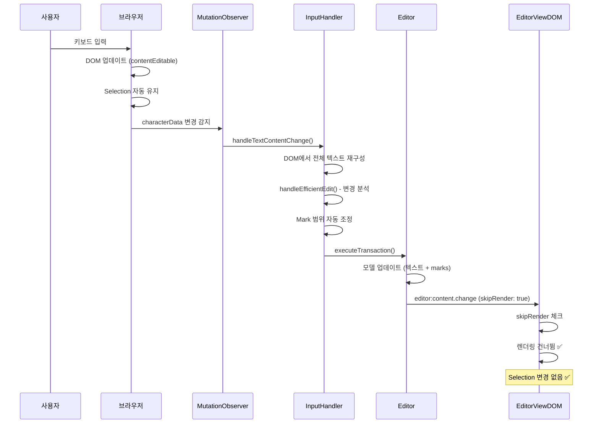

### Mermaid 다이어그램: 외부 변경 (Model Change)

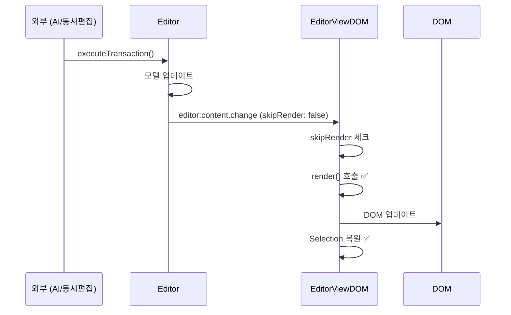

### Mermaid 다이어그램: 입력 상태 전환

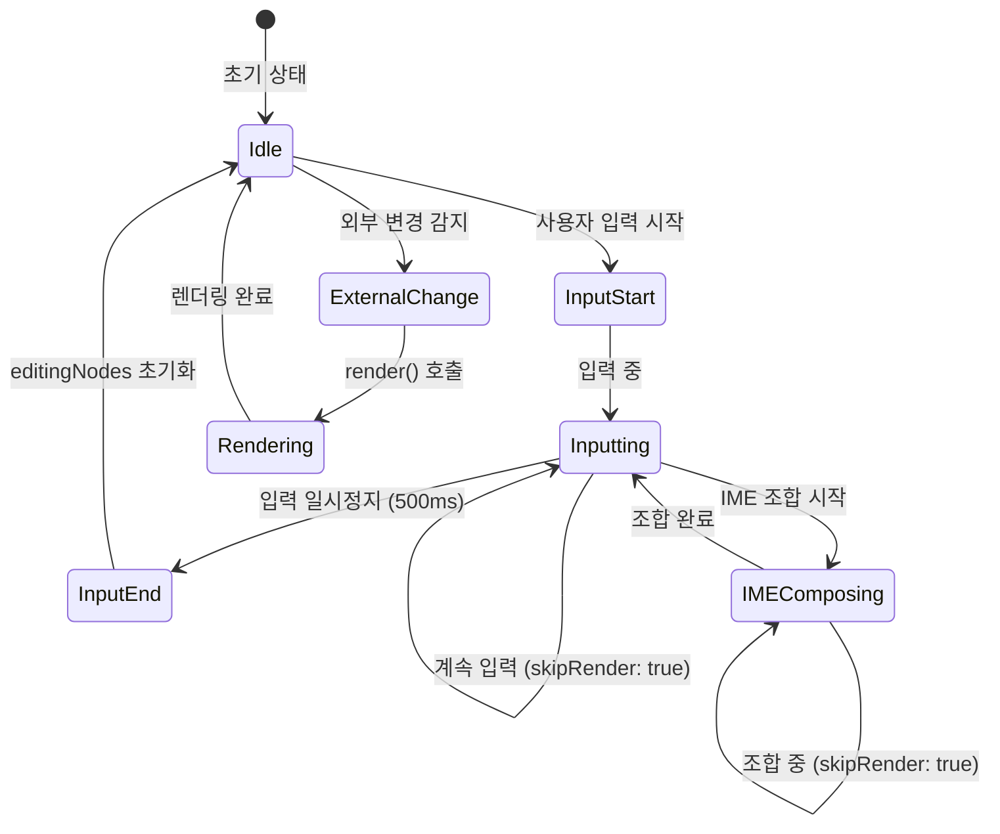

### Mermaid 다이어그램: 의사결정 흐름

```mermaid
flowchart TD
    Start([editor:content.change 이벤트]) --> CheckRendering{렌더링 중?}
    CheckRendering -->|Yes| Skip1[건너뜀]
    CheckRendering -->|No| CheckSkipRender{skipRender?}
    CheckSkipRender -->|true| CheckFrom{from?}
    CheckFrom -->|MutationObserver| Skip2[렌더링 건너뜀 ✅]
    CheckFrom -->|model-change| Render[render() 호출 ✅]
    CheckSkipRender -->|false| Render
    CheckSkipRender -->|undefined| Render
    
    Skip1 --> End([종료])
    Skip2 --> End
    Render --> End
    
    style Skip2 fill:#90EE90
    style Render fill:#90EE90
    style Skip1 fill:#FFB6C1
```

---

## 시나리오별 동작 표

| 시나리오 | 이벤트 소스 | skipRender | 렌더링 | Selection | 결과 |
|---------|------------|-----------|--------|----------|------|
| **기본 입력** |
| 사용자 입력 (characterData) | MutationObserver | `true` | ❌ 건너뜀 | ✅ 브라우저가 유지 | ✅ Race condition 없음 |
| 사용자 입력 + Selection 이동 (Shift+Arrow) | MutationObserver | `true` | ❌ 건너뜀 | ✅ 브라우저가 유지 | ✅ Selection 이동이 브라우저에 의해 안전하게 적용 |
| 백스페이스/Delete 키 입력 | MutationObserver | `true` | ❌ 건너뜀 | ✅ 브라우저가 유지 | ✅ 텍스트 삭제 후 Selection 유지 |
| **IME 입력** |
| IME 조합 중 | MutationObserver | `true` | ❌ 건너뜀 | ✅ 브라우저가 유지 | ✅ 조합 완료 후 처리 |
| IME 조합 완료 | MutationObserver | `true` | ❌ 건너뜀 | ✅ 브라우저가 유지 | ✅ 최종 텍스트만 모델 반영 |
| **외부 변경** |
| 외부 변경 (model-change) | Editor | `false` | ✅ 수행 | ✅ 복원 | ✅ 정상 동작 |
| 외부 Decorator 변경 (예: 댓글, AI 강조) | Editor | `false` | ✅ 수행 | ✅ 복원 | ✅ Marks/Decorators 업데이트 후 Selection 유지 |
| 외부 Selection 동기화 (협업 사용자) | Editor | `false` | ✅ 수행 후 Selection 복원 | ✅ 로컬 Selection 보존, remote Selection은 별도 레이어에 반영 | ✅ 협업 시 Selection 충돌 없음 |
| **복사/붙여넣기** |
| 붙여넣기 (paste) → 텍스트만 변경 | MutationObserver | `true` | ❌ 건너뜀 | ✅ 브라우저가 유지 | ✅ 텍스트만 추가, Selection 유지 |
| 붙여넣기 (paste) → DOM 구조 변경 | MutationObserver | `true` (텍스트), `false` (구조) | 텍스트만 변경 시 ❌, 구조 변경 시 ✅ | 텍스트 변경 시 브라우저 유지, 구조 변경 시 렌더 후 복원 | ✅ paste 내용에 따라 안전하게 처리 |
| 복사 (copy) | - | - | - | ✅ 브라우저가 처리 | ✅ Selection 기반 복사 |
| **선택 및 입력** |
| 드래그 선택 후 입력 | MutationObserver | `true` | ❌ 건너뜀 | ✅ 브라우저가 유지 | ✅ 드래그 선택 영역이 그대로 유지된 상태에서 입력 반영 |
| Range 선택 후 입력 (텍스트 교체) | MutationObserver | `true` | ❌ 건너뜀 | ✅ 브라우저가 유지 | ✅ 선택된 텍스트가 삭제되고 새 텍스트 삽입 |
| **Mark 토글** |
| Bold/Italic 토글 (Mod+B, Mod+I) | Editor | `false` | ✅ 수행 | ✅ 복원 | ✅ Mark 적용 후 Selection 유지 |
| Mark 토글 중 입력 | MutationObserver | `true` | ❌ 건너뜀 | ✅ 브라우저가 유지 | ✅ 입력과 Mark 토글이 독립적으로 처리 |
| **Undo/Redo** |
| Undo (Mod+Z) | Editor | `false` | ✅ 수행 | ✅ 복원 | ✅ 이전 상태로 복원, Selection 복원 |
| Redo (Mod+Shift+Z) | Editor | `false` | ✅ 수행 | ✅ 복원 | ✅ 다음 상태로 복원, Selection 복원 |
| Undo 중 입력 | MutationObserver | `true` | ❌ 건너뜀 | ✅ 브라우저가 유지 | ✅ 입력이 우선, Undo는 취소 |
| **다중 입력** |
| 여러 노드 동시 입력 | MutationObserver | `true` | ❌ 건너뜀 | ✅ 브라우저가 유지 | ✅ 각 노드 독립적으로 처리 |
| 입력 중 다른 노드로 포커스 이동 | MutationObserver | `true` | ❌ 건너뜀 | ✅ 브라우저가 유지 | ✅ 포커스 이동 후 입력 처리 |
| **Cross-node Selection** |
| 여러 노드에 걸친 Selection 후 입력 | MutationObserver | `true` | ❌ 건너뜀 | ✅ 브라우저가 유지 | ✅ 첫 번째 노드에 입력, Selection 축소 |
| 여러 노드에 걸친 Selection 후 삭제 | MutationObserver | `true` | ❌ 건너뜀 | ✅ 브라우저가 유지 | ✅ 선택된 모든 노드의 텍스트 삭제 |
| **특수 키 입력** |
| Home/End 키 (라인 시작/끝 이동) | - | - | - | ✅ 브라우저가 처리 | ✅ Selection만 이동, 입력 없음 |
| PageUp/PageDown 키 (페이지 이동) | - | - | - | ✅ 브라우저가 처리 | ✅ Selection만 이동, 입력 없음 |
| Ctrl+Arrow (단어 단위 이동) | - | - | - | ✅ 브라우저가 처리 | ✅ Selection만 이동, 입력 없음 |
| 특수 키 입력 후 즉시 텍스트 입력 | MutationObserver | `true` | ❌ 건너뜀 | ✅ 브라우저가 유지 | ✅ 특수 키 이동 후 입력 정상 처리 |
| **포커스 및 탭** |
| 입력 중 다른 노드로 포커스 이동 | MutationObserver | `true` | ❌ 건너뜀 | ✅ 브라우저가 유지 | ✅ 포커스 이동 후 입력 처리 |
| 입력 중 다른 탭으로 전환 | MutationObserver | `true` | ❌ 건너뜀 | ✅ 브라우저가 유지 | ✅ 탭 전환 시 입력 중단, 복귀 시 재개 |
| 입력 중 다른 애플리케이션으로 전환 후 복귀 | MutationObserver | `true` | ❌ 건너뜀 | ✅ 브라우저가 유지 | ✅ 포커스 복귀 시 입력 상태 유지 |
| **비 텍스트 요소** |
| 이미지 삽입 (drag & drop) | Editor | `false` | ✅ 수행 | ✅ 복원 | ✅ 이미지 삽입 후 Selection 복원 |
| 이미지 삽입 (paste) | MutationObserver | `false` | ✅ 수행 | ✅ 복원 | ✅ 이미지 붙여넣기 후 Selection 복원 |
| Embed 요소 삽입 | Editor | `false` | ✅ 수행 | ✅ 복원 | ✅ Embed 삽입 후 Selection 복원 |
| **스크롤 및 레이아웃** |
| 입력 중 스크롤 발생 | MutationObserver | `true` | ❌ 건너뜀 | ✅ 브라우저가 유지 | ✅ 스크롤과 입력 독립적으로 처리 |
| 입력 중 창 크기 변경 | MutationObserver | `true` | ❌ 건너뜀 | ✅ 브라우저가 유지 | ✅ 레이아웃 변경과 입력 독립적으로 처리 |
| 입력 중 미디어 쿼리 트리거 | MutationObserver | `true` | ❌ 건너뜀 | ✅ 브라우저가 유지 | ✅ 스타일 변경과 입력 독립적으로 처리 |
| **에러 및 예외** |
| 입력 중 네트워크 에러 (협업) | MutationObserver | `true` | ❌ 건너뜀 | ✅ 브라우저가 유지 | ✅ 로컬 입력은 정상 처리, 동기화는 재시도 |
| 입력 중 모델 검증 실패 | MutationObserver | `true` | ❌ 건너뜀 | ✅ 브라우저가 유지 | ✅ 입력은 유지, 모델 업데이트만 실패 |
| 입력 중 렌더링 에러 | MutationObserver | `true` | ❌ 건너뜀 | ✅ 브라우저가 유지 | ✅ 입력은 정상, 에러는 별도 처리 |
| **특수 케이스** |
| 입력 종료 | - | - | ❌ 재렌더링 없음 | ✅ 브라우저가 유지 | ✅ 충돌 없음 |
| 입력 중 외부 변경 감지 (다른 노드) | Editor | `false` | ✅ 수행 | ✅ 복원 | ✅ 다른 노드는 업데이트, 입력 중인 노드는 브라우저가 DOM을 직접 관리하므로 영향 없음 |
| 렌더링 중 입력 감지 | MutationObserver | `true` | ❌ 건너뜀 (렌더링 중 체크) | ✅ 브라우저가 유지 | ✅ 무한루프 방지 |

---

## 상세 시나리오 설명

### 시나리오 1: 사용자 입력 (characterData)

**상황:** 사용자가 일반 텍스트를 입력하는 경우

**흐름:**
1. 브라우저가 DOM에 텍스트 추가
2. MutationObserver가 characterData 변경 감지
3. InputHandler가 모델 업데이트
4. `skipRender: true`로 렌더링 차단
5. Selection은 브라우저가 자동으로 유지

**결과:** ✅ Race condition 없음, 입력이 부드럽게 진행됨

### 시나리오 2: Selection 이동 중 입력 (Shift+Arrow)

**상황:** 사용자가 Shift+Arrow로 텍스트를 선택하면서 입력하는 경우

**특징:**
- Selection 변경은 브라우저가 직접 처리
- 입력과 Selection 변경이 동시에 발생하지만 브라우저가 안전하게 처리
- `skipRender: true`로 렌더링이 발생하지 않아 충돌 없음

**결과:** ✅ Selection 이동과 입력이 모두 정상 동작

### 시나리오 3: 백스페이스/Delete 키 입력

**상황:** 사용자가 백스페이스 또는 Delete 키로 텍스트를 삭제하는 경우

**흐름:**
1. 브라우저가 DOM에서 텍스트 삭제
2. MutationObserver가 characterData 변경 감지
3. InputHandler가 모델 업데이트
4. `skipRender: true`로 렌더링 차단
5. Selection은 삭제 후 위치로 자동 이동

**결과:** ✅ 텍스트 삭제 후 Selection이 올바른 위치에 유지됨

### 시나리오 4: IME 조합 중

**상황:** 한국어, 일본어, 중국어 등 IME를 사용하여 입력하는 경우

**특징:**
- 조합 중간 상태 (예: "ㅎㅏㄴ" → "한")는 여러 번 DOM 변경 발생
- 모든 변경에 `skipRender: true` 적용
- 조합 완료 후 최종 텍스트만 모델에 반영

**결과:** ✅ 조합 중 렌더링이 발생하지 않아 부드러운 입력 경험

### 시나리오 5: 붙여넣기 (Paste)

**상황:** 사용자가 클립보드에서 텍스트를 붙여넣는 경우

**케이스 A: 단순 텍스트 붙여넣기**
- MutationObserver가 characterData 변경 감지
- `skipRender: true`로 렌더링 차단
- 브라우저가 DOM과 Selection을 직접 처리

**케이스 B: 복잡한 구조 붙여넣기 (HTML, Mark 등)**
- DOM 구조가 변경될 수 있음
- 구조 변경 시 `skipRender: false`로 렌더링 수행
- Selection은 렌더링 후 복원

**결과:** ✅ 붙여넣기 내용에 따라 적절하게 처리

### 시나리오 6: 드래그 선택 후 입력

**상황:** 사용자가 마우스로 텍스트를 드래그하여 선택한 후 입력하는 경우

**흐름:**
1. 드래그로 텍스트 선택 (브라우저가 처리)
2. 선택된 영역에 텍스트 입력
3. 브라우저가 선택된 텍스트를 삭제하고 새 텍스트 삽입
4. MutationObserver가 변경 감지
5. `skipRender: true`로 렌더링 차단

**결과:** ✅ 선택된 영역이 교체되고 Selection이 올바른 위치에 유지됨

### 시나리오 7: Mark 토글 (Bold/Italic)

**상황:** 사용자가 Mod+B 또는 Mod+I로 Mark를 토글하는 경우

**흐름:**
1. 키보드 단축키 감지
2. Editor가 모델에서 Mark 토글
3. `skipRender: false`로 렌더링 수행
4. DOM이 Mark 상태로 업데이트
5. Selection 복원

**특징:**
- Mark 토글은 Editor 레벨에서 처리
- 렌더링이 필요하므로 `skipRender: false`
- 입력과는 독립적으로 처리

**결과:** ✅ Mark가 적용되고 Selection이 유지됨

### 시나리오 8: Undo/Redo

**상황:** 사용자가 Mod+Z로 Undo 또는 Mod+Shift+Z로 Redo하는 경우

**흐름:**
1. 키보드 단축키 감지
2. Editor가 히스토리에서 이전/다음 상태 복원
3. `skipRender: false`로 렌더링 수행
4. DOM이 이전/다음 상태로 업데이트
5. Selection 복원

**특징:**
- 히스토리 기반 상태 복원
- 렌더링이 필요하므로 `skipRender: false`
- Selection도 함께 복원

**결과:** ✅ 이전/다음 상태로 복원되고 Selection이 올바른 위치에 유지됨

### 시나리오 9: 입력 중 외부 변경 감지 (다른 노드)

**상황:** 사용자가 노드 A에서 입력 중일 때 AI나 다른 사용자가 노드 B를 변경하는 경우

**현재 구현:**
- 입력 중인 노드는 `_editingNodes`에 추가됨
- 외부 변경은 `skipRender: false`로 렌더링 수행
- 다른 노드의 변경은 정상적으로 렌더링됨
- 입력 중인 노드는 브라우저가 DOM을 직접 관리하므로 영향 없음

**결과:** ✅ 다른 노드는 업데이트되고, 입력 중인 노드는 영향 없음

### 시나리오 10: 여러 노드 동시 입력

**상황:** 사용자가 여러 노드에서 빠르게 입력하는 경우

**특징:**
- 각 노드의 입력은 독립적으로 처리
- 각각 `skipRender: true`로 렌더링 차단
- `_editingNodes`에 여러 노드가 포함될 수 있음

**결과:** ✅ 각 노드가 독립적으로 처리되어 충돌 없음

### 시나리오 11: Cross-node Selection 입력

**상황:** 사용자가 여러 inline-text 노드에 걸쳐 텍스트를 선택한 후 입력하는 경우

**흐름:**
1. 여러 노드에 걸친 Selection 생성 (드래그 또는 Shift+Arrow)
2. 선택된 영역에 텍스트 입력
3. 브라우저가 첫 번째 노드에 입력하고 Selection 축소
4. MutationObserver가 첫 번째 노드의 변경만 감지
5. `skipRender: true`로 렌더링 차단

**특징:**
- 여러 노드에 걸친 Selection은 브라우저가 자동으로 처리
- 입력은 첫 번째 노드에만 적용됨
- Selection은 입력 후 첫 번째 노드의 입력 위치로 축소

**결과:** ✅ 여러 노드 Selection 후 입력이 정상적으로 처리됨

### 시나리오 12: 특수 키 입력 (Home/End, Ctrl+Arrow)

**상황:** 사용자가 Home, End, Ctrl+Arrow 등 Selection만 이동시키는 키를 입력하는 경우

**특징:**
- 특수 키는 DOM 변경을 일으키지 않음
- Selection만 이동
- MutationObserver가 감지하지 않음
- `editor:content.change` 이벤트 발생하지 않음

**특수 키 입력 후 즉시 텍스트 입력:**
1. 특수 키로 Selection 이동
2. 즉시 텍스트 입력
3. MutationObserver가 텍스트 변경만 감지
4. `skipRender: true`로 렌더링 차단

**결과:** ✅ 특수 키 이동 후 입력이 정상적으로 처리됨

### 시나리오 13: 입력 중 포커스 이동

**상황:** 사용자가 입력 중에 다른 노드로 포커스를 이동하는 경우

**흐름:**
1. 노드 A에서 입력 중
2. 마우스 클릭 또는 키보드로 노드 B로 포커스 이동
3. 노드 B에서 입력 시작
4. 각 노드의 입력은 독립적으로 처리

**특징:**
- 포커스 이동은 브라우저가 처리
- 이전 노드의 입력은 완료된 것으로 간주
- 새 노드의 입력은 새로운 입력으로 처리

**결과:** ✅ 포커스 이동 후 입력이 정상적으로 처리됨

### 시나리오 14: 입력 중 탭 전환

**상황:** 사용자가 입력 중에 브라우저 탭을 전환하는 경우

**흐름:**
1. 노드에서 입력 중
2. 다른 탭으로 전환 (Alt+Tab 또는 탭 클릭)
3. 입력이 일시 중단됨
4. 원래 탭으로 복귀
5. 입력 재개 가능

**특징:**
- 탭 전환 시 브라우저가 포커스를 잃음
- 입력은 일시 중단되지만 DOM은 유지됨
- 탭 복귀 시 포커스와 Selection이 유지됨

**결과:** ✅ 탭 전환 후 복귀 시 입력 상태가 유지됨

### 시나리오 15: 비 텍스트 요소 삽입 (이미지, Embed)

**상황:** 사용자가 이미지나 Embed 요소를 삽입하는 경우

**케이스 A: Drag & Drop으로 이미지 삽입**
1. 이미지를 드래그하여 에디터에 드롭
2. Editor가 모델에 이미지 노드 추가
3. `skipRender: false`로 렌더링 수행
4. DOM에 이미지 요소 추가
5. Selection 복원

**케이스 B: Paste로 이미지 삽입**
1. 클립보드에서 이미지 붙여넣기
2. 브라우저가 DOM에 이미지 추가
3. MutationObserver가 childList 변경 감지
4. Editor가 모델 업데이트
5. `skipRender: false`로 렌더링 수행 (구조 변경)

**결과:** ✅ 이미지/Embed 삽입 후 Selection이 올바른 위치에 유지됨

### 시나리오 16: 입력 중 스크롤/레이아웃 변경

**상황:** 사용자가 입력 중에 스크롤하거나 창 크기를 변경하는 경우

**특징:**
- 스크롤은 DOM 변경을 일으키지 않음
- MutationObserver가 감지하지 않음
- 입력과 스크롤이 독립적으로 처리됨
- 브라우저가 자동으로 입력 영역을 화면에 유지

**창 크기 변경:**
- 레이아웃 재계산 발생
- 하지만 DOM 구조는 변경되지 않음
- 입력은 계속 진행됨

**결과:** ✅ 스크롤/레이아웃 변경과 입력이 독립적으로 처리됨

### 시나리오 17: 입력 중 에러 발생

**상황:** 입력 중에 네트워크 에러나 모델 검증 실패가 발생하는 경우

**케이스 A: 네트워크 에러 (협업)**
1. 사용자가 입력 중
2. 협업 서버와의 동기화 실패
3. 로컬 입력은 정상 처리 (`skipRender: true`)
4. 동기화는 재시도 큐에 추가

**케이스 B: 모델 검증 실패**
1. 사용자가 입력 중
2. 모델 업데이트 시 검증 실패
3. 입력은 DOM에 반영됨 (브라우저가 처리)
4. 모델 업데이트만 실패
5. 사용자는 입력을 계속할 수 있음

**결과:** ✅ 에러 발생 시에도 입력은 정상적으로 처리됨


### Mermaid 다이어그램: 복잡한 시나리오

#### 붙여넣기 시나리오

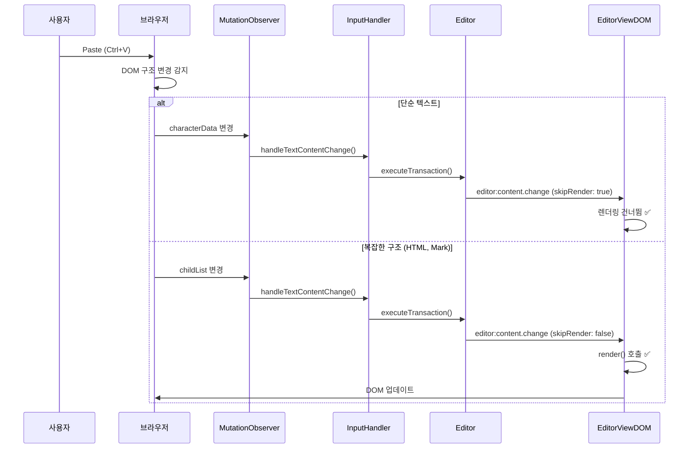

#### Mark 토글 시나리오

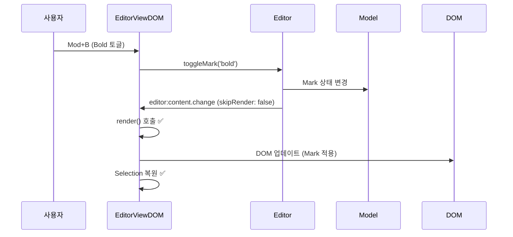

#### Undo/Redo 시나리오

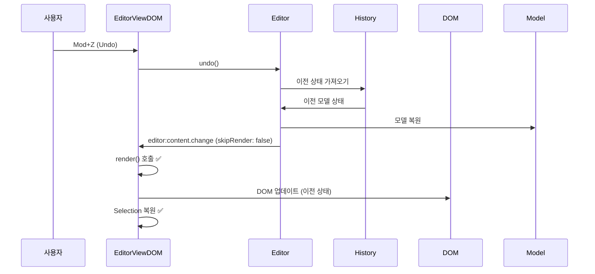

#### 입력 중 외부 변경 시나리오 (현재 vs 향후)

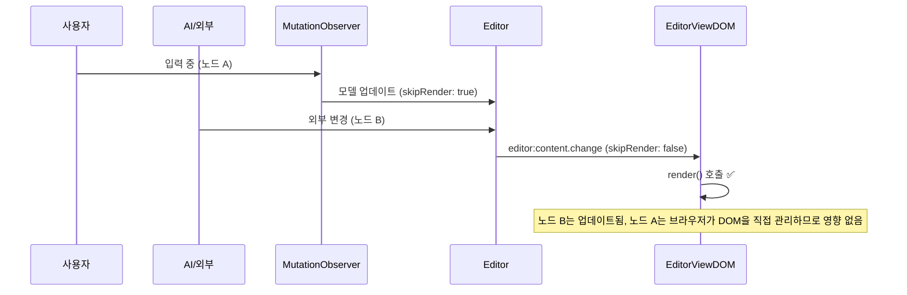

#### Cross-node Selection 입력 시나리오

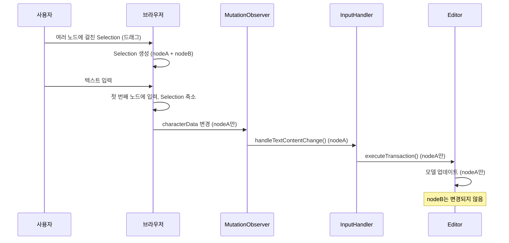

#### 특수 키 입력 후 텍스트 입력 시나리오

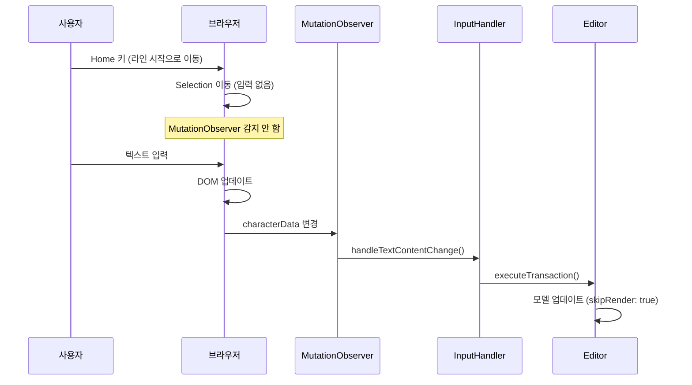

#### 비 텍스트 요소 삽입 시나리오

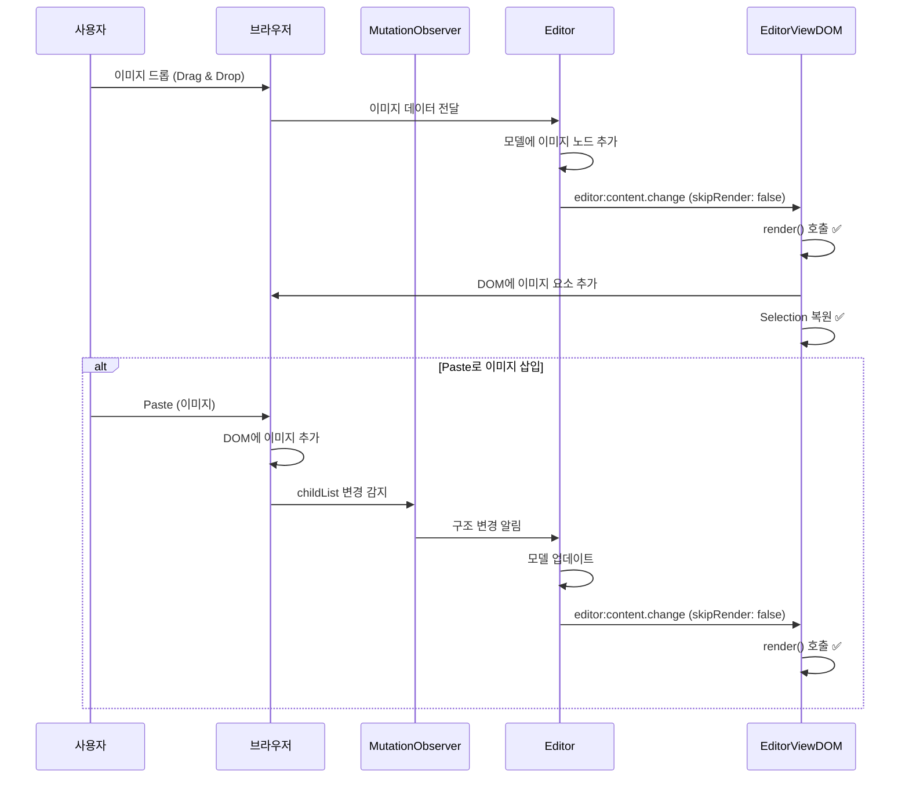

#### 입력 중 에러 발생 시나리오

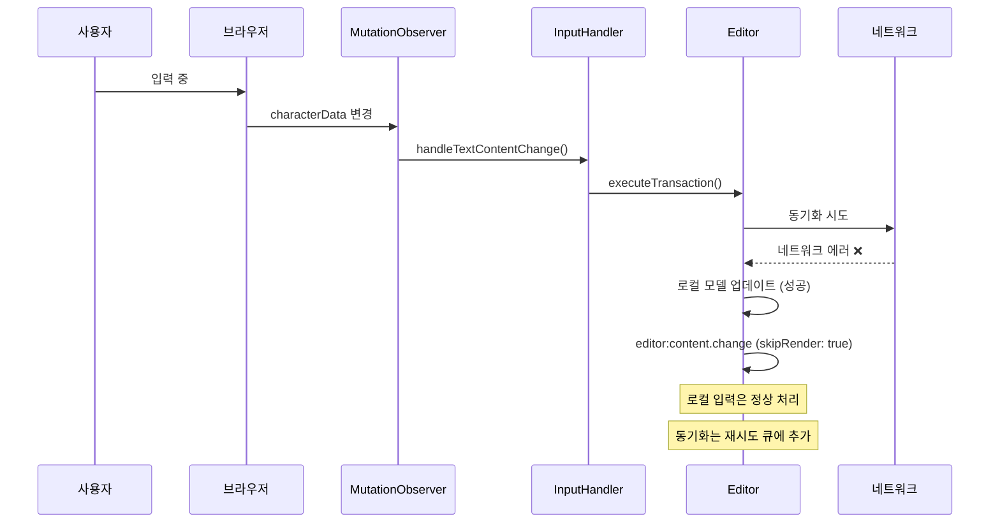

---

## 핵심 원칙

### 1. 입력 중에는 렌더링하지 않음

**이유:**
- 브라우저가 이미 DOM을 직접 업데이트함 (contentEditable)
- 추가 렌더링은 불필요하고 Selection과 충돌할 수 있음
- 모델만 업데이트하면 충분함

**구현:**
- `skipRender: true`로 설정
- `editor:content.change` 핸들러에서 체크하여 렌더링 건너뜀

### 2. 외부 변경만 렌더링

**이유:**
- 외부 변경은 모델만 변경되고 DOM은 아직 업데이트되지 않음
- 렌더링이 필요함

**구현:**
- `skipRender: false` (또는 undefined)
- `editor:content.change` 핸들러에서 렌더링 수행

### 3. 입력 종료 시 재렌더링 없음

**이유:**
- 브라우저가 이미 DOM을 업데이트했음
- 재렌더링하면 Selection과 충돌할 수 있음
- 모델 변경사항은 이미 반영되어 있음

**구현:**
- `_onInputEnd()`에서 재렌더링 제거
- `_editingNodes`만 초기화

---

## 타임라인 다이어그램

### Mermaid Gantt: 입력 중 (정상 동작)

```mermaid
gantt
    title 입력 중 타임라인 (정상 동작)
    dateFormat X
    axisFormat %Ls
    
    section 브라우저
    DOM 업데이트 + Selection 유지 :0, 10
    
    section MutationObserver
    변경 감지 :10, 5
    
    section InputHandler
    모델 업데이트 :15, 10
    
    section EditorViewDOM
    skipRender 체크 :25, 5
    렌더링 건너뜀 :30, 0
```

### Mermaid Gantt: 외부 변경 (정상 동작)

```mermaid
gantt
    title 외부 변경 타임라인 (정상 동작)
    dateFormat X
    axisFormat %Ls
    
    section Editor
    모델 업데이트 :0, 10
    
    section EditorViewDOM
    skipRender 체크 :10, 5
    render() 호출 :15, 20
    
    section DOM
    DOM 업데이트 :20, 10
    Selection 복원 :30, 5
```

### Mermaid Gantt: Race Condition 발생 시나리오 (해결 전)

```mermaid
gantt
    title Race Condition 발생 시나리오 (해결 전)
    dateFormat X
    axisFormat %Ls
    
    section 브라우저
    DOM 업데이트 :0, 10
    
    section MutationObserver
    변경 감지 :10, 5
    
    section InputHandler
    모델 업데이트 :15, 10
    
    section EditorViewDOM
    render() 호출 (동시) :20, 20
    
    section Selection
    Selection 변경 (동시) :20, 15
    
    section 충돌
    ❌ 충돌 발생 :25, 10
```

### Mermaid Gantt: Race Condition 해결 후

```mermaid
gantt
    title Race Condition 해결 후
    dateFormat X
    axisFormat %Ls
    
    section 브라우저
    DOM 업데이트 + Selection 유지 :0, 10
    
    section MutationObserver
    변경 감지 :10, 5
    
    section InputHandler
    모델 업데이트 :15, 10
    
    section EditorViewDOM
    skipRender 체크 :25, 5
    ✅ 렌더링 건너뜀 :30, 0
    
    section Selection
    ✅ 변경 없음 (브라우저 유지) :0, 35
```

---

## 구현 세부사항

### 1. InputHandler에서 skipRender 설정

**파일:** `packages/editor-view-dom/src/event-handlers/input-handler.ts`

```typescript
// commitPendingImmediate()에서
console.log('[Input] commitPendingImmediate: emit editor:content.change (skipRender=true, from=MutationObserver)', { nodeId });
this.editor.emit('editor:content.change', {
  skipRender: true, // 필수: MutationObserver 변경은 render() 호출 안 함
  from: 'MutationObserver',
  transaction: {
    type: 'text_replace',
    nodeId: textNodeId
  }
});
```

### 2. EditorViewDOM에서 skipRender 체크

**파일:** `packages/editor-view-dom/src/editor-view-dom.ts`

```typescript
this.editor.on('editor:content.change', (e: any) => {
  // 렌더링 중이면 무시 (무한루프 방지)
  if (this._isRendering) {
    return;
  }
  
  // skipRender: true인 경우 렌더링 건너뛰기
  if (e?.skipRender) {
    console.log('[EditorViewDOM] content.change: SKIP (skipRender=true)', {
      from: e?.from || 'unknown',
      transactionType: e?.transaction?.type,
      nodeId: e?.transaction?.nodeId
    });
    return;
  }
  
  // 외부 변경만 렌더링
  this.render();
});
```

### 3. 입력 종료 시 재렌더링 제거

**파일:** `packages/editor-view-dom/src/editor-view-dom.ts`

```typescript
private _onInputEnd(): void {
  this._inputEndDebounceTimer = window.setTimeout(() => {
    // editingNodes 초기화만 수행
    this._editingNodes.clear();
    console.log('[EditorViewDOM] Input ended, editingNodes cleared');
    // 재렌더링은 하지 않음
  }, 500);
}
```

---

## 검증 체크리스트

### ✅ 입력 중 렌더링 차단
- [x] `skipRender: true` 설정
- [x] `editor:content.change` 핸들러에서 체크
- [x] 렌더링 건너뜀 확인

### ✅ Selection 보존
- [x] 입력 중에는 브라우저가 Selection 유지
- [x] 렌더링이 발생하지 않으므로 Selection 변경 없음
- [x] Race condition 없음

### ✅ 외부 변경 처리
- [x] `skipRender: false`인 경우 렌더링 수행
- [x] DOM이 모델 상태로 업데이트
- [x] Selection 복원

### ✅ 입력 종료 처리
- [x] 재렌더링 없음
- [x] `_editingNodes` 초기화
- [x] 충돌 없음

---

## 주의사항

### 1. skipRender는 MutationObserver 변경에만 적용

**올바른 사용:**
- ✅ MutationObserver에서 감지한 characterData 변경: `skipRender: true`
- ✅ 외부 변경 (model-change): `skipRender: false` (또는 undefined)

**잘못된 사용:**
- ❌ 모든 변경에 `skipRender: true`: 외부 변경이 반영되지 않음
- ❌ 모든 변경에 `skipRender: false`: 입력 중 race condition 발생

### 2. 입력 종료 시 재렌더링 불필요

**이유:**
- 브라우저가 이미 DOM을 업데이트했음
- 모델 변경사항은 이미 반영되어 있음
- 재렌더링하면 Selection과 충돌할 수 있음

### 3. IME 조합 중 처리

**현재 구현:**
- IME 조합 중에도 `skipRender: true`로 처리
- 조합 완료 후 `commitPendingImmediate()` 호출
- 조합 완료 후에도 `skipRender: true` 유지

### 4. Cross-node Selection 처리

**특징:**
- 여러 노드에 걸친 Selection은 브라우저가 자동으로 처리
- 입력은 첫 번째 노드에만 적용됨
- Selection은 입력 후 첫 번째 노드의 입력 위치로 축소

**주의:**
- 여러 노드에 걸친 Selection 후 입력 시, 나머지 노드는 변경되지 않음
- 사용자가 의도한 동작과 다를 수 있음 (향후 개선 가능)

### 5. 비 텍스트 요소 삽입

**특징:**
- 이미지나 Embed 삽입은 DOM 구조 변경을 일으킴
- `skipRender: false`로 렌더링 수행
- Selection은 삽입된 요소 다음으로 이동

**주의:**
- Drag & Drop과 Paste의 처리 방식이 다를 수 있음
- 복잡한 구조의 붙여넣기는 추가 검증 필요

### 6. 입력 중 에러 처리

**원칙:**
- 에러 발생 시에도 사용자 입력은 보호되어야 함
- 로컬 입력은 정상 처리, 에러는 별도 처리
- 사용자는 입력을 계속할 수 있어야 함

**구현:**
- 네트워크 에러: 로컬 입력은 처리, 동기화는 재시도
- 모델 검증 실패: DOM 입력은 유지, 모델 업데이트만 실패
- 렌더링 에러: 입력은 정상, 에러는 별도 로깅


---

## 관련 문서

- `TEXT_INPUT_DATA_FLOW.md` - 텍스트 입력 시 데이터 변경 흐름
- `TEXT_INPUT_FLOW.md` - EditorViewDOM 글자 입력 반응 흐름
- `protecting-user-input-from-external-changes.md` - 사용자 입력 보호 (AI/동시편집)

---

## 요약

### 해결된 문제

1. **입력 중 렌더링과 Selection 변경의 Race Condition**
   - 입력 중 렌더링이 발생하지 않음 (`skipRender: true`)
   - Selection은 브라우저가 자동으로 유지
   - 충돌 없이 부드러운 입력 경험

2. **입력 종료 시 불필요한 재렌더링**
   - 입력 종료 시 재렌더링 제거
   - 브라우저가 이미 DOM을 업데이트했으므로 추가 렌더링 불필요
   - Selection과의 충돌 방지

### 핵심 메커니즘

1. **skipRender 옵션**
   - MutationObserver 변경: `skipRender: true` (렌더링 차단)
   - 외부 변경: `skipRender: false` (렌더링 수행)

2. **브라우저 의존**
   - 입력 중 DOM 업데이트는 브라우저가 직접 처리
   - Selection 유지도 브라우저가 자동으로 처리
   - 우리는 모델만 업데이트

3. **이벤트 소스 구분**
   - `from: 'MutationObserver'` → `skipRender: true`
   - `from: 'model-change'` → `skipRender: false`

### 지원되는 시나리오

**기본 입력**
- ✅ 기본 입력 (characterData)
- ✅ Selection 이동 중 입력 (Shift+Arrow)
- ✅ 백스페이스/Delete 키 입력
- ✅ 특수 키 입력 (Home/End, Ctrl+Arrow 등)

**IME 입력**
- ✅ IME 조합 (한국어, 일본어, 중국어)
- ✅ IME 조합 완료

**외부 변경**
- ✅ 외부 변경 (model-change)
- ✅ 외부 Decorator 변경 (댓글, AI 강조 등)
- ✅ 외부 Selection 동기화 (협업 사용자)

**복사/붙여넣기**
- ✅ 붙여넣기 (단순 텍스트 및 복잡한 구조)
- ✅ 복사 (copy)

**선택 및 입력**
- ✅ 드래그 선택 후 입력
- ✅ Range 선택 후 입력 (텍스트 교체)
- ✅ Cross-node Selection 입력 (여러 노드에 걸친 선택)

**Mark 토글**
- ✅ Mark 토글 (Bold, Italic 등)
- ✅ Mark 토글 중 입력

**Undo/Redo**
- ✅ Undo (Mod+Z)
- ✅ Redo (Mod+Shift+Z)
- ✅ Undo 중 입력

**다중 입력**
- ✅ 여러 노드 동시 입력
- ✅ 입력 중 다른 노드로 포커스 이동

**비 텍스트 요소**
- ✅ 이미지 삽입 (drag & drop, paste)
- ✅ Embed 요소 삽입

**스크롤 및 레이아웃**
- ✅ 입력 중 스크롤 발생
- ✅ 입력 중 창 크기 변경
- ✅ 입력 중 미디어 쿼리 트리거

**에러 및 예외**
- ✅ 입력 중 네트워크 에러 (협업)
- ✅ 입력 중 모델 검증 실패
- ✅ 입력 중 렌더링 에러

**특수 케이스**
- ✅ 입력 종료
- ✅ 입력 중 외부 변경 감지 (다른 노드)
- ✅ 렌더링 중 입력 감지

---

## 변경 이력

### 2024-01-XX: Race Condition 해결

**변경 사항:**
1. `skipRender: true` 옵션으로 입력 중 렌더링 차단
2. `editor:content.change` 핸들러에서 `skipRender` 체크 추가
3. `_onInputEnd()`에서 재렌더링 제거

**효과:**
- ✅ 입력 중 렌더링과 Selection 변경의 race condition 해결
- ✅ 사용자 입력이 방해받지 않음
- ✅ Selection이 안정적으로 유지됨

