# Resolving Race Condition Between Rendering and Selection Changes During Input

## Problem Situation

### Race Condition Occurrence Scenario

```
During user input:
1. Browser applies text changes to DOM (contentEditable)
   ↓
2. MutationObserver detects changes
   ↓
3. InputHandler updates model
   ↓
4. editor:content.change event occurs
   ↓
5. EditorViewDOM.render() called (simultaneously)
   ↓
6. Selection change event occurs (simultaneously)
   ↓
❌ Problem: Rendering and Selection changes occur simultaneously, causing conflict
```

**Core Problems:**
- If rendering occurs during input, DOM is recreated
- If Selection changes simultaneously, it moves to wrong position
- User input can be interrupted or disappear

---

## Current Solutions

### 1. Block Rendering During Input with skipRender Option

**Implementation Location:** `packages/editor-view-dom/src/event-handlers/input-handler.ts`

```typescript
// In commitPendingImmediate()
this.editor.emit('editor:content.change', {
  skipRender: true, // Required: MutationObserver changes do not call render()
  from: 'MutationObserver',
  transaction: { type: 'text_replace', nodeId }
});
```

**Behavior:**
- characterData changes detected by MutationObserver are set with `skipRender: true`
- During input, only model is updated, DOM rendering is not performed
- Browser already directly updated DOM, so additional rendering unnecessary

### 2. Check skipRender in editor:content.change Handler

**Implementation Location:** `packages/editor-view-dom/src/editor-view-dom.ts`

```typescript
this.editor.on('editor:content.change', (e: any) => {
  // Ignore if rendering (prevent infinite loop)
  if (this._isRendering) {
    return;
  }
  
  // Skip rendering if skipRender: true
  // characterData changes detected by MutationObserver are during input, so
  // delay rendering to prevent race condition with selection
  if (e?.skipRender) {
    return;
  }
  
  // Only render external changes (model-change)
  this.render();
});
```

**Behavior:**
- Skip rendering if `skipRender: true`
- Only perform rendering for external changes (model-change)
- Race condition between rendering and Selection changes does not occur during input

### 3. Remove Re-rendering on Input End

**Implementation Location:** `packages/editor-view-dom/src/editor-view-dom.ts`

```typescript
private _onInputEnd(): void {
  this._inputEndDebounceTimer = window.setTimeout(() => {
    // Only initialize editingNodes
    this._editingNodes.clear();
    // Do not re-render
    // - Browser directly updates DOM during input
    // - We only update model (skipRender: true)
    // - Re-rendering after input ends can conflict with selection
  }, 500);
}
```

**Behavior:**
- Do not re-render on input end
- Browser already updated DOM, so additional rendering unnecessary
- Model changes are already reflected

---

## Overall Flow Diagram

### Mermaid Diagram: During Input (CharacterData Change)

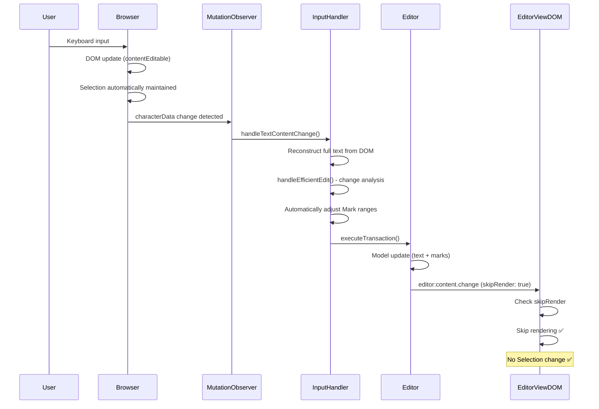

### Mermaid Diagram: External Change (Model Change)

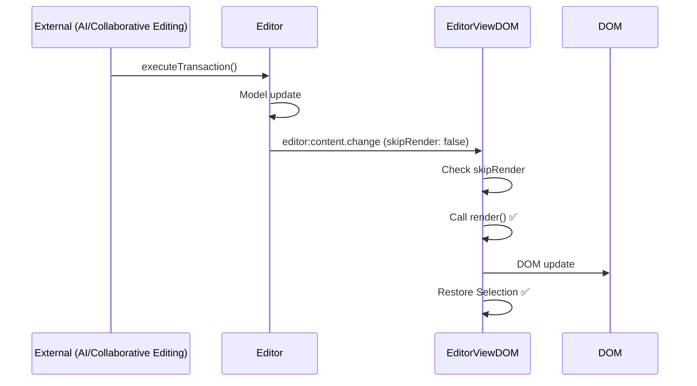

### Mermaid Diagram: Input State Transition

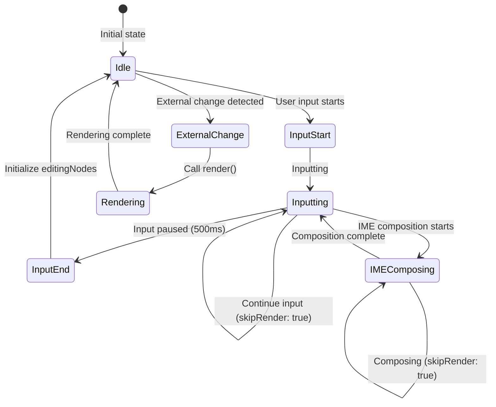

### Mermaid Diagram: Decision Flow

```mermaid
flowchart TD
    Start([editor:content.change event]) --> CheckRendering{Rendering?}
    CheckRendering -->|Yes| Skip1[Skip]
    CheckRendering -->|No| CheckSkipRender{skipRender?}
    CheckSkipRender -->|true| CheckFrom{from?}
    CheckFrom -->|MutationObserver| Skip2[Skip rendering ✅]
    CheckFrom -->|model-change| Render[Call render() ✅]
    CheckSkipRender -->|false| Render
    CheckSkipRender -->|undefined| Render
    
    Skip1 --> End([End])
    Skip2 --> End
    Render --> End
    
    style Skip2 fill:#90EE90
    style Render fill:#90EE90
    style Skip1 fill:#FFB6C1
```

---

## Behavior Table by Scenario

| Scenario | Event Source | skipRender | Rendering | Selection | Result |
|---------|------------|-----------|--------|----------|------|
| **Basic Input** |
| User input (characterData) | MutationObserver | `true` | ❌ Skip | ✅ Browser maintains | ✅ No race condition |
| User input + Selection move (Shift+Arrow) | MutationObserver | `true` | ❌ Skip | ✅ Browser maintains | ✅ Selection move safely applied by browser |
| Backspace/Delete key input | MutationObserver | `true` | ❌ Skip | ✅ Browser maintains | ✅ Selection maintained after text deletion |
| **IME Input** |
| IME composition in progress | MutationObserver | `true` | ❌ Skip | ✅ Browser maintains | ✅ Process after composition completes |
| IME composition complete | MutationObserver | `true` | ❌ Skip | ✅ Browser maintains | ✅ Only final text reflected to model |
| **External Changes** |
| External change (model-change) | Editor | `false` | ✅ Perform | ✅ Restore | ✅ Normal operation |
| External Decorator change (e.g., comments, AI highlights) | Editor | `false` | ✅ Perform | ✅ Restore | ✅ Selection maintained after Marks/Decorators update |
| External Selection sync (collaborative user) | Editor | `false` | ✅ Perform then restore Selection | ✅ Preserve local Selection, remote Selection reflected in separate layer | ✅ No Selection conflict during collaboration |
| **Copy/Paste** |
| Paste → text only change | MutationObserver | `true` | ❌ Skip | ✅ Browser maintains | ✅ Only text added, Selection maintained |
| Paste → DOM structure change | MutationObserver | `true` (text), `false` (structure) | ❌ if text only, ✅ if structure | Browser maintains if text change, restore after render if structure change | ✅ Safely handled according to paste content |
| Copy | - | - | - | ✅ Browser handles | ✅ Selection-based copy |
| **Selection and Input** |
| Input after drag selection | MutationObserver | `true` | ❌ Skip | ✅ Browser maintains | ✅ Input reflected while drag selection area maintained |
| Input after Range selection (text replacement) | MutationObserver | `true` | ❌ Skip | ✅ Browser maintains | ✅ Selected text deleted and new text inserted |
| **Mark Toggle** |
| Bold/Italic toggle (Mod+B, Mod+I) | Editor | `false` | ✅ Perform | ✅ Restore | ✅ Selection maintained after Mark applied |
| Input during Mark toggle | MutationObserver | `true` | ❌ Skip | ✅ Browser maintains | ✅ Input and Mark toggle handled independently |
| **Undo/Redo** |
| Undo (Mod+Z) | Editor | `false` | ✅ Perform | ✅ Restore | ✅ Restore to previous state, Selection restored |
| Redo (Mod+Shift+Z) | Editor | `false` | ✅ Perform | ✅ Restore | ✅ Restore to next state, Selection restored |
| Input during Undo | MutationObserver | `true` | ❌ Skip | ✅ Browser maintains | ✅ Input takes priority, Undo cancelled |
| **Multiple Input** |
| Simultaneous input in multiple nodes | MutationObserver | `true` | ❌ Skip | ✅ Browser maintains | ✅ Each node handled independently |
| Focus move to different node during input | MutationObserver | `true` | ❌ Skip | ✅ Browser maintains | ✅ Input handled after focus move |
| **Cross-node Selection** |
| Input after Selection spanning multiple nodes | MutationObserver | `true` | ❌ Skip | ✅ Browser maintains | ✅ Input in first node, Selection shrinks |
| Delete after Selection spanning multiple nodes | MutationObserver | `true` | ❌ Skip | ✅ Browser maintains | ✅ Text deleted from all selected nodes |
| **Special Key Input** |
| Home/End keys (move to line start/end) | - | - | - | ✅ Browser handles | ✅ Only Selection moves, no input |
| PageUp/PageDown keys (page movement) | - | - | - | ✅ Browser handles | ✅ Only Selection moves, no input |
| Ctrl+Arrow (word-by-word movement) | - | - | - | ✅ Browser handles | ✅ Only Selection moves, no input |
| Text input immediately after special key | MutationObserver | `true` | ❌ Skip | ✅ Browser maintains | ✅ Input normally handled after special key movement |
| **Focus and Tabs** |
| Focus move to different node during input | MutationObserver | `true` | ❌ Skip | ✅ Browser maintains | ✅ Input handled after focus move |
| Switch to different tab during input | MutationObserver | `true` | ❌ Skip | ✅ Browser maintains | ✅ Input paused on tab switch, resumes on return |
| Switch to different application and return during input | MutationObserver | `true` | ❌ Skip | ✅ Browser maintains | ✅ Input state maintained on focus return |
| **Non-text Elements** |
| Image insertion (drag & drop) | Editor | `false` | ✅ Perform | ✅ Restore | ✅ Selection restored after image insertion |
| Image insertion (paste) | MutationObserver | `false` | ✅ Perform | ✅ Restore | ✅ Selection restored after image paste |
| Embed element insertion | Editor | `false` | ✅ Perform | ✅ Restore | ✅ Selection restored after Embed insertion |
| **Scroll and Layout** |
| Scroll during input | MutationObserver | `true` | ❌ Skip | ✅ Browser maintains | ✅ Scroll and input handled independently |
| Window resize during input | MutationObserver | `true` | ❌ Skip | ✅ Browser maintains | ✅ Layout change and input handled independently |
| Media query trigger during input | MutationObserver | `true` | ❌ Skip | ✅ Browser maintains | ✅ Style change and input handled independently |
| **Errors and Exceptions** |
| Network error during input (collaboration) | MutationObserver | `true` | ❌ Skip | ✅ Browser maintains | ✅ Local input handled normally, sync retried |
| Model validation failure during input | MutationObserver | `true` | ❌ Skip | ✅ Browser maintains | ✅ Input maintained, only model update fails |
| Rendering error during input | MutationObserver | `true` | ❌ Skip | ✅ Browser maintains | ✅ Input normal, error handled separately |
| **Special Cases** |
| Input end | - | - | ❌ No re-render | ✅ Browser maintains | ✅ No conflict |
| External change detected during input (different node) | Editor | `false` | ✅ Perform | ✅ Restore | ✅ Different nodes updated, no impact on input node as browser directly manages DOM |
| Input detected during rendering | MutationObserver | `true` | ❌ Skip (check during rendering) | ✅ Browser maintains | ✅ Prevent infinite loop |

---

## Detailed Scenario Descriptions

### Scenario 1: User Input (characterData)

**Situation:** When user inputs general text

**Flow:**
1. Browser adds text to DOM
2. MutationObserver detects characterData change
3. InputHandler updates model
4. Block rendering with `skipRender: true`
5. Selection automatically maintained by browser

**Result:** ✅ No race condition, input proceeds smoothly

### Scenario 2: Input During Selection Move (Shift+Arrow)

**Situation:** When user selects text with Shift+Arrow while inputting

**Characteristics:**
- Selection changes handled directly by browser
- Input and Selection changes occur simultaneously but browser handles safely
- No rendering occurs with `skipRender: true`, so no conflict

**Result:** ✅ Both Selection move and input work normally

### Scenario 3: Backspace/Delete Key Input

**Situation:** When user deletes text with Backspace or Delete key

**Flow:**
1. Browser deletes text from DOM
2. MutationObserver detects characterData change
3. InputHandler updates model
4. Block rendering with `skipRender: true`
5. Selection automatically moves to position after deletion

**Result:** ✅ Selection maintained at correct position after text deletion

### Scenario 4: IME Composition in Progress

**Situation:** When inputting using IME for languages like Korean, Japanese, Chinese

**Characteristics:**
- Intermediate composition states (e.g., "ㅎㅏㄴ" → "한") cause multiple DOM changes
- `skipRender: true` applied to all changes
- Only final text reflected to model after composition completes

**Result:** ✅ No rendering during composition, smooth input experience

### Scenario 5: Paste

**Situation:** When user pastes text from clipboard

**Case A: Simple text paste**
- MutationObserver detects characterData change
- Block rendering with `skipRender: true`
- Browser directly handles DOM and Selection

**Case B: Complex structure paste (HTML, Mark, etc.)**
- DOM structure may change
- Perform rendering with `skipRender: false` when structure changes
- Selection restored after rendering

**Result:** ✅ Handled appropriately according to paste content

### Scenario 6: Input After Drag Selection

**Situation:** When user drags text with mouse to select, then inputs

**Flow:**
1. Select text by dragging (handled by browser)
2. Input text in selected area
3. Browser deletes selected text and inserts new text
4. MutationObserver detects change
5. Block rendering with `skipRender: true`

**Result:** ✅ Selected area replaced and Selection maintained at correct position

### Scenario 7: Mark Toggle (Bold/Italic)

**Situation:** When user toggles Mark with Mod+B or Mod+I

**Flow:**
1. Keyboard shortcut detected
2. Editor toggles Mark in model
3. Perform rendering with `skipRender: false`
4. DOM updated to Mark state
5. Selection restored

**Characteristics:**
- Mark toggle handled at Editor level
- Rendering needed, so `skipRender: false`
- Handled independently from input

**Result:** ✅ Mark applied and Selection maintained

### Scenario 8: Undo/Redo

**Situation:** When user performs Undo with Mod+Z or Redo with Mod+Shift+Z

**Flow:**
1. Keyboard shortcut detected
2. Editor restores previous/next state from history
3. Perform rendering with `skipRender: false`
4. DOM updated to previous/next state
5. Selection restored

**Characteristics:**
- History-based state restoration
- Rendering needed, so `skipRender: false`
- Selection also restored

**Result:** ✅ Restored to previous/next state and Selection maintained at correct position

### Scenario 9: External Change Detected During Input (Different Node)

**Situation:** When AI or another user changes node B while user is inputting in node A

**Current Implementation:**
- Node being input is added to `_editingNodes`
- External changes perform rendering with `skipRender: false`
- Changes to other nodes render normally
- Node being input has no impact as browser directly manages DOM

**Result:** ✅ Other nodes updated, no impact on node being input

### Scenario 10: Simultaneous Input in Multiple Nodes

**Situation:** When user inputs quickly in multiple nodes

**Characteristics:**
- Input in each node handled independently
- Each blocks rendering with `skipRender: true`
- Multiple nodes can be included in `_editingNodes`

**Result:** ✅ Each node handled independently, no conflicts

### Scenario 11: Cross-node Selection Input

**Situation:** When user selects text spanning multiple inline-text nodes, then inputs

**Flow:**
1. Create Selection spanning multiple nodes (drag or Shift+Arrow)
2. Input text in selected area
3. Browser inputs in first node and shrinks Selection
4. MutationObserver detects only first node's change
5. Block rendering with `skipRender: true`

**Characteristics:**
- Selection spanning multiple nodes handled automatically by browser
- Input applied only to first node
- Selection shrinks to input position in first node after input

**Result:** ✅ Input after multi-node Selection handled normally

### Scenario 12: Special Key Input (Home/End, Ctrl+Arrow)

**Situation:** When user inputs keys that only move Selection, like Home, End, Ctrl+Arrow

**Characteristics:**
- Special keys do not cause DOM changes
- Only Selection moves
- MutationObserver does not detect
- `editor:content.change` event does not occur

**Text input immediately after special key:**
1. Move Selection with special key
2. Input text immediately
3. MutationObserver detects only text change
4. Block rendering with `skipRender: true`

**Result:** ✅ Input after special key movement handled normally

### Scenario 13: Focus Move During Input

**Situation:** When user moves focus to different node during input

**Flow:**
1. Inputting in node A
2. Move focus to node B with mouse click or keyboard
3. Start input in node B
4. Input in each node handled independently

**Characteristics:**
- Focus move handled by browser
- Previous node's input considered complete
- New node's input handled as new input

**Result:** ✅ Input after focus move handled normally

### Scenario 14: Tab Switch During Input

**Situation:** When user switches browser tab during input

**Flow:**
1. Inputting in node
2. Switch to different tab (Alt+Tab or tab click)
3. Input paused
4. Return to original tab
5. Input can resume

**Characteristics:**
- Browser loses focus on tab switch
- Input paused but DOM maintained
- Focus and Selection maintained on tab return

**Result:** ✅ Input state maintained on tab switch and return

### Scenario 15: Non-text Element Insertion (Image, Embed)

**Situation:** When user inserts image or Embed element

**Case A: Image insertion via Drag & Drop**
1. Drag image and drop on editor
2. Editor adds image node to model
3. Perform rendering with `skipRender: false`
4. Add image element to DOM
5. Restore Selection

**Case B: Image insertion via Paste**
1. Paste image from clipboard
2. Browser adds image to DOM
3. MutationObserver detects childList change
4. Editor updates model
5. Perform rendering with `skipRender: false` (structure change)

**Result:** ✅ Selection maintained at correct position after image/Embed insertion

### Scenario 16: Scroll/Layout Change During Input

**Situation:** When user scrolls or resizes window during input

**Characteristics:**
- Scroll does not cause DOM changes
- MutationObserver does not detect
- Input and scroll handled independently
- Browser automatically keeps input area on screen

**Window resize:**
- Layout recalculation occurs
- But DOM structure does not change
- Input continues

**Result:** ✅ Scroll/layout changes and input handled independently

### Scenario 17: Error During Input

**Situation:** When network error or model validation failure occurs during input

**Case A: Network error (collaboration)**
1. User inputting
2. Synchronization with collaboration server fails
3. Local input handled normally (`skipRender: true`)
4. Synchronization added to retry queue

**Case B: Model validation failure**
1. User inputting
2. Validation fails on model update
3. Input reflected to DOM (handled by browser)
4. Only model update fails
5. User can continue inputting

**Result:** ✅ Input handled normally even when errors occur


### Mermaid Diagrams: Complex Scenarios

#### Paste Scenario

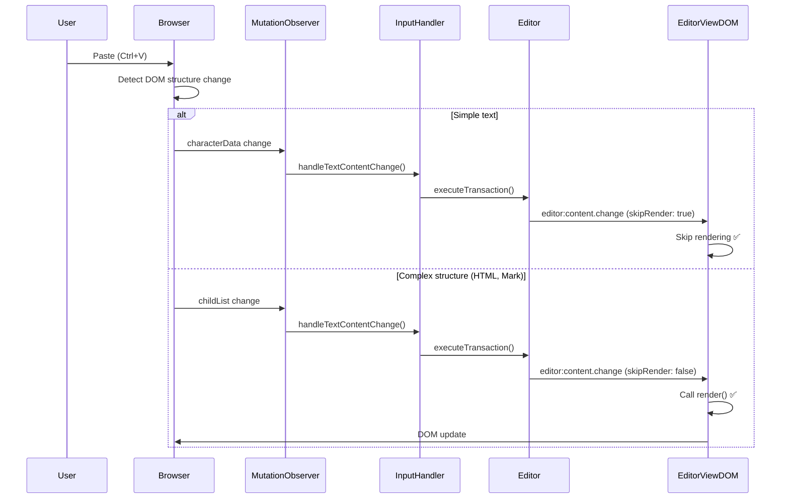

#### Mark Toggle Scenario

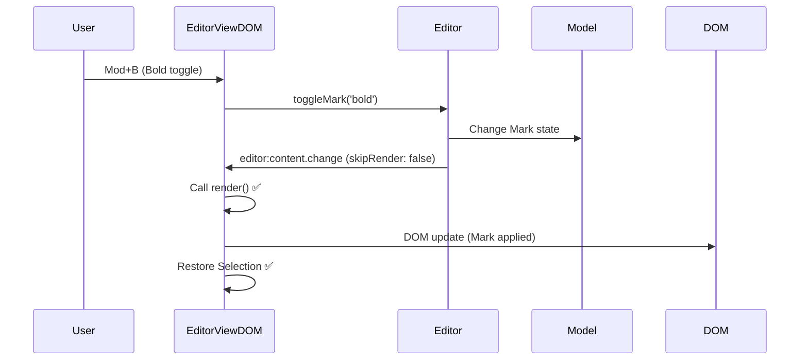

#### Undo/Redo Scenario

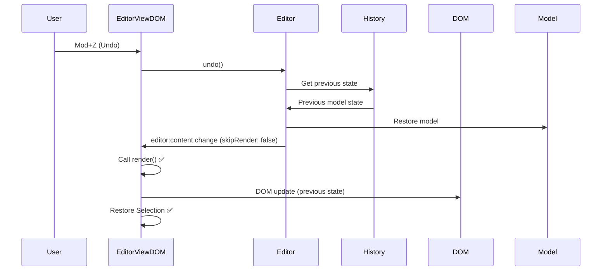

#### External Change During Input Scenario (Current vs Future)

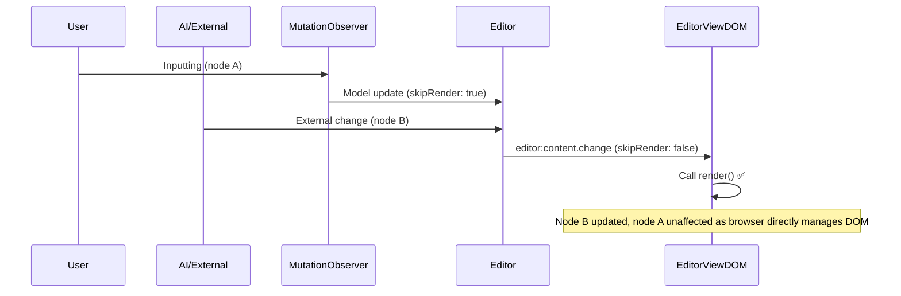

#### Cross-node Selection Input Scenario

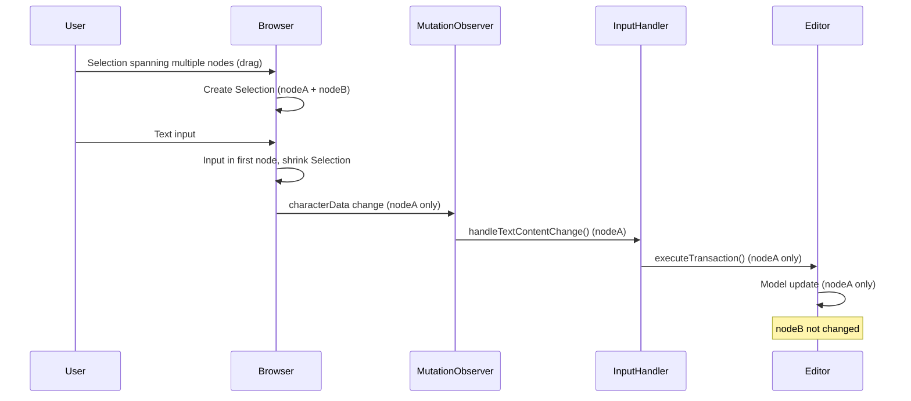

#### Special Key Input Followed by Text Input Scenario

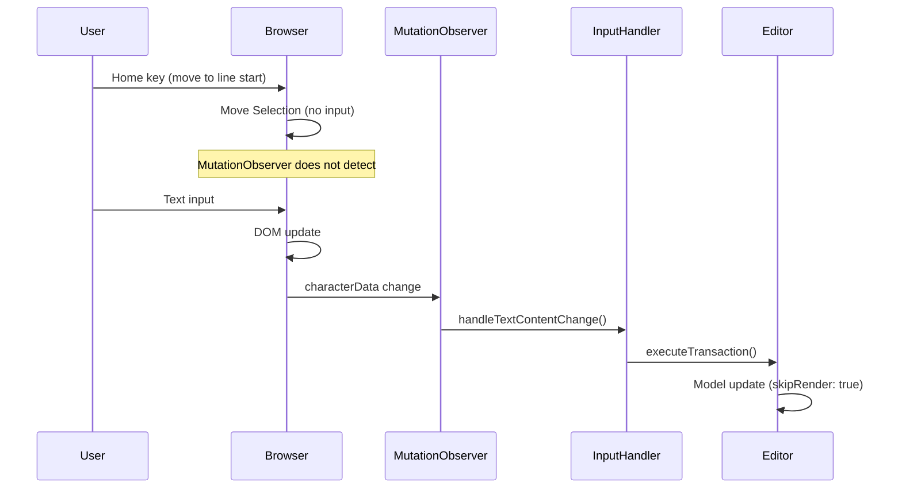

#### Non-text Element Insertion Scenario

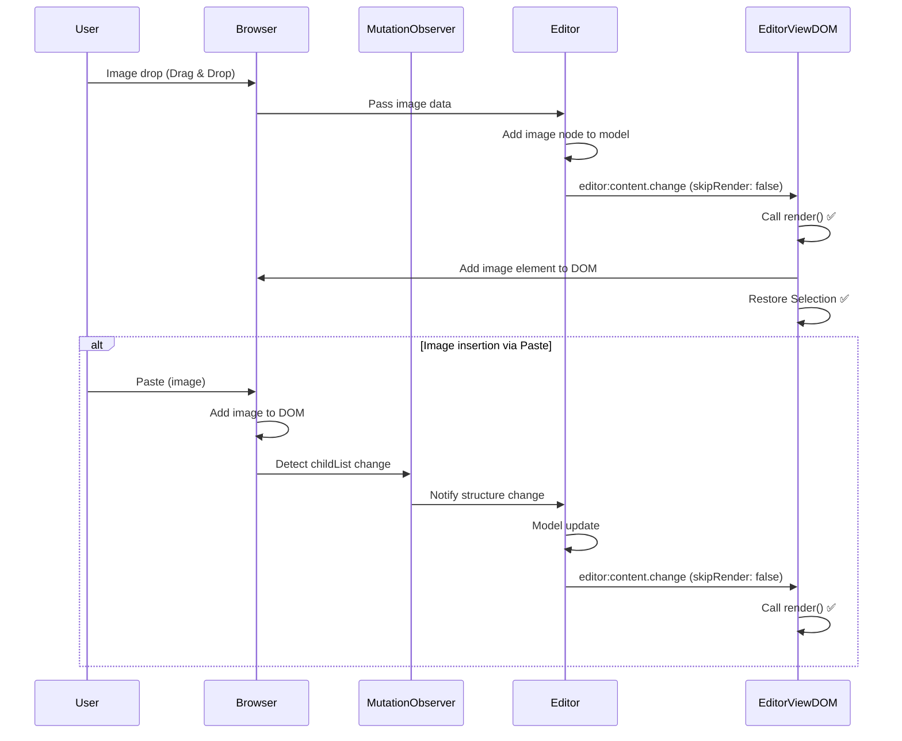

#### Error During Input Scenario

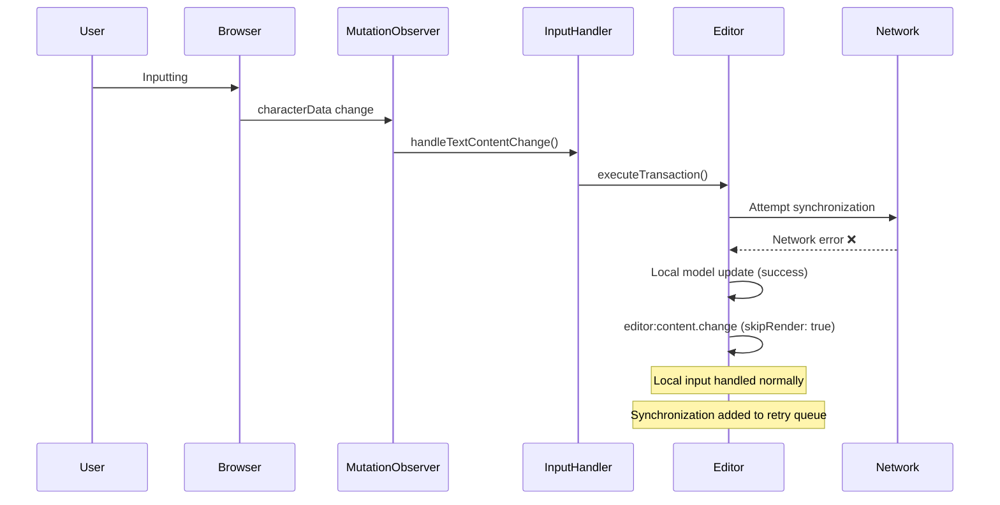

---

## Core Principles

### 1. Do Not Render During Input

**Reason:**
- Browser already directly updates DOM (contentEditable)
- Additional rendering unnecessary and can conflict with Selection
- Updating only model is sufficient

**Implementation:**
- Set `skipRender: true`
- Check in `editor:content.change` handler and skip rendering

### 2. Only Render External Changes

**Reason:**
- External changes only change model, DOM not yet updated
- Rendering needed

**Implementation:**
- `skipRender: false` (or undefined)
- Perform rendering in `editor:content.change` handler

### 3. No Re-rendering on Input End

**Reason:**
- Browser already updated DOM
- Re-rendering can conflict with Selection
- Model changes already reflected

**Implementation:**
- Remove re-rendering in `_onInputEnd()`
- Only initialize `_editingNodes`

---

## Timeline Diagrams

### Mermaid Gantt: During Input (Normal Operation)

```mermaid
gantt
    title Timeline During Input (Normal Operation)
    dateFormat X
    axisFormat %Ls
    
    section Browser
    DOM update + Selection maintain :0, 10
    
    section MutationObserver
    Change detection :10, 5
    
    section InputHandler
    Model update :15, 10
    
    section EditorViewDOM
    Check skipRender :25, 5
    Skip rendering :30, 0
```

### Mermaid Gantt: External Change (Normal Operation)

```mermaid
gantt
    title External Change Timeline (Normal Operation)
    dateFormat X
    axisFormat %Ls
    
    section Editor
    Model update :0, 10
    
    section EditorViewDOM
    Check skipRender :10, 5
    Call render() :15, 20
    
    section DOM
    DOM update :20, 10
    Restore Selection :30, 5
```

### Mermaid Gantt: Race Condition Occurrence Scenario (Before Fix)

```mermaid
gantt
    title Race Condition Occurrence Scenario (Before Fix)
    dateFormat X
    axisFormat %Ls
    
    section Browser
    DOM update :0, 10
    
    section MutationObserver
    Change detection :10, 5
    
    section InputHandler
    Model update :15, 10
    
    section EditorViewDOM
    Call render() (simultaneous) :20, 20
    
    section Selection
    Selection change (simultaneous) :20, 15
    
    section Conflict
    ❌ Conflict occurs :25, 10
```

### Mermaid Gantt: After Race Condition Fix

```mermaid
gantt
    title After Race Condition Fix
    dateFormat X
    axisFormat %Ls
    
    section Browser
    DOM update + Selection maintain :0, 10
    
    section MutationObserver
    Change detection :10, 5
    
    section InputHandler
    Model update :15, 10
    
    section EditorViewDOM
    Check skipRender :25, 5
    ✅ Skip rendering :30, 0
    
    section Selection
    ✅ No change (browser maintains) :0, 35
```

---

## Implementation Details

### 1. Set skipRender in InputHandler

**File:** `packages/editor-view-dom/src/event-handlers/input-handler.ts`

```typescript
// In commitPendingImmediate()
console.log('[Input] commitPendingImmediate: emit editor:content.change (skipRender=true, from=MutationObserver)', { nodeId });
this.editor.emit('editor:content.change', {
  skipRender: true, // Required: MutationObserver changes do not call render()
  from: 'MutationObserver',
  transaction: {
    type: 'text_replace',
    nodeId: textNodeId
  }
});
```

### 2. Check skipRender in EditorViewDOM

**File:** `packages/editor-view-dom/src/editor-view-dom.ts`

```typescript
this.editor.on('editor:content.change', (e: any) => {
  // Ignore if rendering (prevent infinite loop)
  if (this._isRendering) {
    return;
  }
  
  // Skip rendering if skipRender: true
  if (e?.skipRender) {
    console.log('[EditorViewDOM] content.change: SKIP (skipRender=true)', {
      from: e?.from || 'unknown',
      transactionType: e?.transaction?.type,
      nodeId: e?.transaction?.nodeId
    });
    return;
  }
  
  // Only render external changes
  this.render();
});
```

### 3. Remove Re-rendering on Input End

**File:** `packages/editor-view-dom/src/editor-view-dom.ts`

```typescript
private _onInputEnd(): void {
  this._inputEndDebounceTimer = window.setTimeout(() => {
    // Only initialize editingNodes
    this._editingNodes.clear();
    console.log('[EditorViewDOM] Input ended, editingNodes cleared');
    // Do not re-render
  }, 500);
}
```

---

## Verification Checklist

### ✅ Block Rendering During Input
- [x] Set `skipRender: true`
- [x] Check in `editor:content.change` handler
- [x] Confirm rendering skipped

### ✅ Preserve Selection
- [x] Browser maintains Selection during input
- [x] No Selection change as rendering does not occur
- [x] No race condition

### ✅ Handle External Changes
- [x] Perform rendering if `skipRender: false`
- [x] DOM updated to model state
- [x] Selection restored

### ✅ Input End Handling
- [x] No re-rendering
- [x] Initialize `_editingNodes`
- [x] No conflicts

---

## Notes

### 1. skipRender Only Applies to MutationObserver Changes

**Correct Usage:**
- ✅ characterData changes detected by MutationObserver: `skipRender: true`
- ✅ External changes (model-change): `skipRender: false` (or undefined)

**Incorrect Usage:**
- ❌ `skipRender: true` for all changes: External changes not reflected
- ❌ `skipRender: false` for all changes: Race condition occurs during input

### 2. Re-rendering Unnecessary on Input End

**Reason:**
- Browser already updated DOM
- Model changes already reflected
- Re-rendering can conflict with Selection

### 3. IME Composition Handling

**Current Implementation:**
- Also handle with `skipRender: true` during IME composition
- Call `commitPendingImmediate()` after composition completes
- Maintain `skipRender: true` even after composition completes

### 4. Cross-node Selection Handling

**Characteristics:**
- Selection spanning multiple nodes handled automatically by browser
- Input applied only to first node
- Selection shrinks to input position in first node after input

**Note:**
- When inputting after Selection spanning multiple nodes, remaining nodes not changed
- May differ from user intent (can be improved in future)

### 5. Non-text Element Insertion

**Characteristics:**
- Image or Embed insertion causes DOM structure changes
- Perform rendering with `skipRender: false`
- Selection moves to after inserted element

**Note:**
- Drag & Drop and Paste handling may differ
- Additional validation needed for complex structure paste

### 6. Error Handling During Input

**Principle:**
- User input must be protected even when errors occur
- Local input handled normally, errors handled separately
- User must be able to continue inputting

**Implementation:**
- Network error: Handle local input, retry synchronization
- Model validation failure: Maintain DOM input, only model update fails
- Rendering error: Input normal, error logged separately


---

## Related Documents

- `TEXT_INPUT_DATA_FLOW.md` - Data change flow during text input
- `TEXT_INPUT_FLOW.md` - EditorViewDOM character input response flow
- `protecting-user-input-from-external-changes.md` - User input protection (AI/collaborative editing)

---

## Summary

### Resolved Problems

1. **Race Condition Between Rendering and Selection Changes During Input**
   - No rendering occurs during input (`skipRender: true`)
   - Selection automatically maintained by browser
   - Smooth input experience without conflicts

2. **Unnecessary Re-rendering on Input End**
   - Removed re-rendering on input end
   - Additional rendering unnecessary as browser already updated DOM
   - Prevent conflicts with Selection

### Core Mechanisms

1. **skipRender Option**
   - MutationObserver changes: `skipRender: true` (block rendering)
   - External changes: `skipRender: false` (perform rendering)

2. **Browser Dependency**
   - Browser directly handles DOM updates during input
   - Browser automatically maintains Selection
   - We only update model

3. **Event Source Distinction**
   - `from: 'MutationObserver'` → `skipRender: true`
   - `from: 'model-change'` → `skipRender: false`

### Supported Scenarios

**Basic Input**
- ✅ Basic input (characterData)
- ✅ Input during Selection move (Shift+Arrow)
- ✅ Backspace/Delete key input
- ✅ Special key input (Home/End, Ctrl+Arrow, etc.)

**IME Input**
- ✅ IME composition (Korean, Japanese, Chinese)
- ✅ IME composition completion

**External Changes**
- ✅ External changes (model-change)
- ✅ External Decorator changes (comments, AI highlights, etc.)
- ✅ External Selection synchronization (collaborative users)

**Copy/Paste**
- ✅ Paste (simple text and complex structures)
- ✅ Copy

**Selection and Input**
- ✅ Input after drag selection
- ✅ Input after Range selection (text replacement)
- ✅ Cross-node Selection input (selection spanning multiple nodes)

**Mark Toggle**
- ✅ Mark toggle (Bold, Italic, etc.)
- ✅ Input during Mark toggle

**Undo/Redo**
- ✅ Undo (Mod+Z)
- ✅ Redo (Mod+Shift+Z)
- ✅ Input during Undo

**Multiple Input**
- ✅ Simultaneous input in multiple nodes
- ✅ Focus move to different node during input

**Non-text Elements**
- ✅ Image insertion (drag & drop, paste)
- ✅ Embed element insertion

**Scroll and Layout**
- ✅ Scroll during input
- ✅ Window resize during input
- ✅ Media query trigger during input

**Errors and Exceptions**
- ✅ Network error during input (collaboration)
- ✅ Model validation failure during input
- ✅ Rendering error during input

**Special Cases**
- ✅ Input end
- ✅ External change detected during input (different node)
- ✅ Input detected during rendering

---

## Change History

### 2024-01-XX: Race Condition Resolution

**Changes:**
1. Block rendering during input with `skipRender: true` option
2. Add `skipRender` check in `editor:content.change` handler
3. Remove re-rendering in `_onInputEnd()`

**Effects:**
- ✅ Resolved race condition between rendering and Selection changes during input
- ✅ User input not interrupted
- ✅ Selection stably maintained

