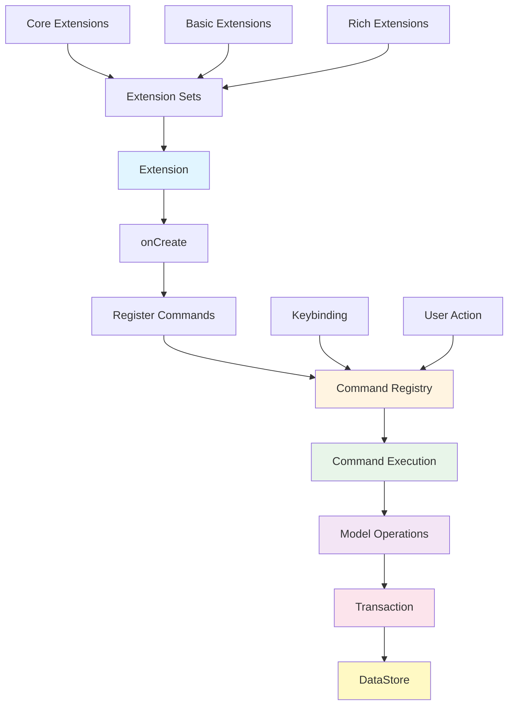

# Extensions

This package provides extension functionality for BaroCSS Editor. Extensions allow you to add new commands and features to the editor.

## Architecture



## Table of Contents

- [Defining Extensions](#defining-extensions)
- [Registering Commands](#registering-commands)
- [Using Model Operations](#using-model-operations)
- [Examples](#examples)
- [Adding Keybindings](#adding-keybindings)
- [Detailed Guide](#detailed-guide)

## Detailed Guide

For a comprehensive guide on Extension design and implementation, refer to the following document:

- **[Extension Design and Implementation Guide](./docs/extension-design-and-implementation.md)**
  - What is an Extension
  - Role and structure of Commands
  - Model Transactions and Operations
  - Why direct DataStore handling is prohibited
  - How to define Operations and write DSL
  - Complete sample: Highlight Extension implementation

## Defining Extensions

An Extension is a class that implements the `Extension` interface.

### Basic Structure

```typescript
import { Editor, Extension } from '@barocss/editor-core';

export interface MyExtensionOptions {
  enabled?: boolean;
  // Additional options...
}

export class MyExtension implements Extension {
  name = 'myExtension';
  priority = 100; // Priority (lower values execute first)

  private _options: MyExtensionOptions;

  constructor(options: MyExtensionOptions = {}) {
    this._options = {
      enabled: true,
      ...options
    };
  }

  onCreate(editor: Editor): void {
    if (!this._options.enabled) return;
    
    // Register commands, event listeners, etc.
  }

  onDestroy(_editor: Editor): void {
    // Cleanup (remove event listeners, etc.)
  }
}
```

### Lifecycle Methods

- **`onCreate(editor: Editor)`**: Called when the Extension is registered with the editor.
- **`onDestroy(editor: Editor)`**: Called when the Extension is removed.

## Registering Commands

To register a command in an Extension, use `editor.registerCommand()`.

### Basic Command Registration

```typescript
onCreate(editor: Editor): void {
  (editor as any).registerCommand({
    name: 'myCommand',
    execute: async (ed: Editor, payload?: any) => {
      // Command execution logic
      return true; // Return true on success, false on failure
    },
    canExecute: (_ed: Editor, payload?: any) => {
      // Check if command can be executed
      return true;
    }
  });
}
```

### Executing Commands

Commands can be executed as follows:

```typescript
// Direct execution
await editor.executeCommand('myCommand', { /* payload */ });

// Using CommandChain
await editor.commands()
  .myCommand()
  .run();
```

## Using Model Operations

To modify the model in an Extension, use operations from `@barocss/model`.

### Transactions and Operations

All model changes are performed through transactions:

```typescript
import { transaction, control, toggleMark, transformNode, moveBlockUp } from '@barocss/model';

// 1. Create Operations array
const ops = [
  ...control(nodeId, [
    toggleMark('bold', [startOffset, endOffset])
  ])
];

// 2. Execute Transaction
const result = await transaction(editor, ops).commit();
return result.success;
```

### Main Operations

#### Mark Operations

```typescript
import { toggleMark, applyMark, removeMark } from '@barocss/model';

// Toggle mark
toggleMark('bold', [startOffset, endOffset])

// Apply mark
applyMark('bold', [startOffset, endOffset])

// Remove mark
removeMark('bold', [startOffset, endOffset])
```

#### Node Operations

```typescript
import { transformNode, moveBlockUp, moveBlockDown } from '@barocss/model';

// Transform node type (e.g., paragraph → heading)
transformNode('heading', { level: 1 })

// Move block
moveBlockUp()
moveBlockDown()
```

#### Control Helper

You can use the `control()` helper to group operations for a specific node:

```typescript
import { control, toggleMark } from '@barocss/model';

const ops = [
  ...control(nodeId, [
    toggleMark('bold', [0, 5]),
    toggleMark('italic', [2, 7])
  ])
];
```

## Examples

### Example 1: Simple Mark Toggle Extension

```typescript
import { Editor, Extension, type ModelSelection } from '@barocss/editor-core';
import { transaction, control, toggleMark } from '@barocss/model';

export class BoldExtension implements Extension {
  name = 'bold';
  priority = 100;

  onCreate(editor: Editor): void {
    (editor as any).registerCommand({
      name: 'toggleBold',
      execute: async (ed: Editor, payload?: { selection?: ModelSelection }) => {
        return await this._executeToggleBold(ed, payload?.selection);
      },
      canExecute: (_ed: Editor, payload?: { selection?: ModelSelection }) => {
        return !!payload?.selection && payload.selection.type === 'range';
      }
    });
  }

  onDestroy(_editor: Editor): void {}

  private async _executeToggleBold(
    editor: Editor,
    selection?: ModelSelection
  ): Promise<boolean> {
    if (!selection || selection.type !== 'range') {
      return false;
    }

    const dataStore = (editor as any).dataStore;
    if (!dataStore) {
      return false;
    }

    // Only process within the same text node
    if (selection.startNodeId !== selection.endNodeId) {
      return false;
    }

    const node = dataStore.getNode(selection.startNodeId);
    if (!node || typeof node.text !== 'string') {
      return false;
    }

    const { startOffset, endOffset } = selection;
    const ops = [
      ...control(selection.startNodeId, [
        toggleMark('bold', [startOffset, endOffset])
      ])
    ];

    const result = await transaction(editor, ops).commit();
    return result.success;
  }
}
```

### Example 2: Block Type Transform Extension

```typescript
import { Editor, Extension, type ModelSelection } from '@barocss/editor-core';
import { transaction, control, transformNode } from '@barocss/model';

export class HeadingExtension implements Extension {
  name = 'heading';
  priority = 100;

  onCreate(editor: Editor): void {
    // Register setHeading1, setHeading2, setHeading3
    [1, 2, 3].forEach(level => {
      (editor as any).registerCommand({
        name: `setHeading${level}`,
        execute: async (ed: Editor, payload?: { selection?: ModelSelection }) => {
          return await this._executeSetHeading(ed, level, payload?.selection);
        },
        canExecute: (_ed: Editor, payload?: { selection?: ModelSelection }) => {
          return !!payload?.selection;
        }
      });
    });
  }

  onDestroy(_editor: Editor): void {}

  private async _executeSetHeading(
    editor: Editor,
    level: number,
    selection?: ModelSelection
  ): Promise<boolean> {
    if (!selection || selection.type !== 'range') {
      return false;
    }

    const dataStore = (editor as any).dataStore;
    const targetNodeId = this._getTargetBlockNodeId(dataStore, selection);
    if (!targetNodeId) {
      return false;
    }

    const ops = [
      ...control(targetNodeId, [
        transformNode('heading', { level })
      ])
    ];

    const result = await transaction(editor, ops).commit();
    return result.success;
  }

  private _getTargetBlockNodeId(dataStore: any, selection: ModelSelection): string | null {
    // Logic to find block node from selection
    // ...
  }
}
```

### Example 3: Simple Action Extension (No Model Changes)

```typescript
import { Editor, Extension } from '@barocss/editor-core';

export class EscapeExtension implements Extension {
  name = 'escape';
  priority = 100;

  onCreate(editor: Editor): void {
    (editor as any).registerCommand({
      name: 'escape',
      execute: (ed: Editor) => {
        const selection = ed.selection;
        
        // If selection exists, clear it
        if (selection && !this._isSelectionEmpty(selection)) {
          ed.clearSelection();
          return true;
        }
        
        // If no selection, blur focus
        ed.emit('editor:blur.request', {});
        return true;
      },
      canExecute: () => true
    });
  }

  onDestroy(_editor: Editor): void {}

  private _isSelectionEmpty(selection: any): boolean {
    if (!selection) return true;
    if (selection.type === 'range') {
      return selection.collapsed || 
             (selection.startNodeId === selection.endNodeId && 
              selection.startOffset === selection.endOffset);
    }
    return false;
  }
}
```

## Adding Keybindings

After registering a command in an Extension, to add a keybinding, add it to `packages/editor-core/src/keybinding/default-keybindings.ts`:

```typescript
export const DEFAULT_KEYBINDINGS: Keybinding[] = [
  // ...
  {
    key: 'Mod+b',
    command: 'toggleBold',
    when: 'editorFocus && editorEditable'
  },
  // ...
];
```

### Keybinding Format

- **Modifier**: `Mod` (macOS: Cmd, others: Ctrl), `Alt`, `Shift`
- **Keys**: `A-Z`, `0-9`, `Enter`, `Escape`, `Backspace`, `Delete`, `Tab`, `ArrowLeft`, `ArrowRight`, `ArrowUp`, `ArrowDown`, `Home`, `End`, etc.
- **Combinations**: `Mod+b`, `Mod+Shift+s`, `Alt+ArrowUp`, etc.

### When Conditions

- `editorFocus`: When the editor has focus
- `editorEditable`: When the editor is editable
- `!selectionEmpty`: When selection is not empty
- `historyCanUndo`: When undo is possible
- `isMac`: When on macOS

## Using Extensions

To register an Extension to the editor:

```typescript
import { Editor } from '@barocss/editor-core';
import { MyExtension } from '@barocss/extensions';

const editor = new Editor({
  extensions: [
    new MyExtension({ enabled: true })
  ]
});
```

Or use a convenience function:

```typescript
import { createMyExtension } from '@barocss/extensions';

const editor = new Editor({
  extensions: [
    createMyExtension({ enabled: true })
  ]
});
```

## References

- [Command Architecture Guide](./docs/command-architecture-guide.md)
- [Operation Selection Handling](./docs/operation-selection-handling.md)
- [@barocss/model](../model/README.md) - Model operations documentation

