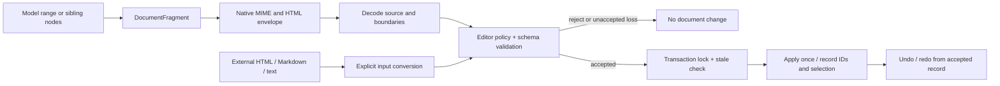

# Clipboard fragments, policy, and transactions

This describes the #264 implementation. The policy foundation is #263/#270. Actual DND intent and drop-position integration remain #265.

## Input to history



`CopyPasteExtension` reuses `FragmentEditor.forEditor(editor)`. A command does not replace a product policy. Planning does not change the document, selection, history, operation events, or ID allocator. `editor:clipboard.plan` is emitted after planning so callers can inspect the decision. Observer changes make the plan stale; application checks again under the transaction lock.

## Transport

`DocumentFragment` carries selection kind, source schema/format/version, open depths, nested content, marks, source IDs, references, and resource declarations. Datastore lifecycle fields and local metadata are not clipboard node fields; unsupported fields are rejected. Put portable application meaning in schema-declared attributes.

- Native copy/cut writes `text/plain`, `text/html`, and `application/x-wonffice-fragment+json` where supported.
- HTML includes a URI-encoded JSON envelope in `data-wonffice-fragment`. This keeps boundaries when the asynchronous Clipboard API only accepts HTML and text.
- The custom MIME takes priority over the HTML envelope. Invalid metadata is rejected, not retried through a weaker visible representation.
- If a browser rejects custom MIME, the HTML envelope is still usable.
- Text-only clipboard fallback loses structure, marks, references, and whole-node boundaries. It is a plain-text import, not a lossless round trip. External applications can strip HTML metadata too.
- A metadata-free HTML/Markdown parser imports its supported vocabulary. It does not preserve every foreign CSS property, application object, or resource. Fragment-plan losses describe known policy conversions, not a complete diff against arbitrary foreign HTML.

Native clipboard events are written synchronously before their writable window closes. Cut deletes only after a successful write. Copy itself never changes history. Block copy currently requires HTML clipboard support and refuses note database blocks rather than manufacturing a partial export.

## Partial ranges and whole blocks

For source text `ABCD`, copying `BC` is an open range. Pasting at `x|y` produces `xBC|y` when the boundary policy permits joining. Copying the whole source block with `copyBlocks` is closed. It produces three blocks: `x`, `ABCD`, `y`. The copied block keeps its own structure and attributes.

For a range from `A|BCD` to `EF|GH`, pasting at `x|y` produces `xBCD` and `EF|y`. Replacing across sibling target blocks uses the first target prefix and last target suffix. Marks are clipped at the source and target boundaries. Unaffected text runs retain IDs. Copied nodes get fresh IDs; internal references remap to those IDs. One paste is one history entry. Redo reuses accepted IDs and content instead of rereading the clipboard.

Supported text targets are text leaves in one container or sibling flow containers. The optional `rangeReplacement: 'preserve-boundaries'` policy also accepts inline input across different container paths: it inserts at the start, removes selected content, keeps the end suffix in its own container, and retains empty existing containers when the schema requires their roles or order. It never invents a node type or joins unlike containers. The standard clipboard policy enables this option; a custom policy must opt in. Isolated or atomic ancestor boundaries remain protected. Unaffected siblings outside the replacement span are not rewritten. Retained target nodes keep their local metadata and lifecycle fields; copied nodes receive new IDs. Both open edges must have compatible depths and strategies. Unsupported ancestor paths or structural input across different paths, mixed edge strategies, required-child violations, splitting isolated/atomic boundaries, dangling references, and incompatible target joins are rejected. Open fragments may omit unselected required siblings, but the final document may not.

## External data and the public command

```ts
await editor.executeCommand('paste', {
  selection,                 // optional; defaults to the editor selection
  clipboardHtml: html,       // may contain an internal envelope
  clipboardText: text,
  clipboardFragment: json,   // optional native fragment MIME value
  acceptLosses: false,       // default
});

await editor.executeCommand('paste', { nodes: nestedNodes });
```

`nodes` retains the existing nested `INode[]` command shape. It is metadata-free standard clipboard input, not evidence of whole-node selection or arbitrary schema compatibility. Flat child ID arrays are not clipboard trees and are rejected. Source IDs are not trusted as destination IDs.

The standard extension initially installs `standardClipboardPolicy` only if the product has no existing policy owner. Its adapter supports the converter's standard vocabulary. Paragraph wrappers describe imported text flow; a single attribute-free paragraph may become inline input. Multiple paragraphs retain open edges. Standard link nodes can become link marks with their `href` and `title`; image names are normalized where the target supports the standard inline image. A missing workspace reference type becomes a readable label with a reported reference loss, which requires `acceptLosses: true`.

A product with a custom `FragmentEditor` must explicitly compose `standardClipboardPolicy(hasType)` if it wants this standard external vocabulary. The adapter still runs full target validation. A custom schema can instead register its own source adapter. The common planner contains no paragraph, title, or product-specific node-name dispatch.

Plain text uses the destination text type. Multiline plain text uses the destination flow-block type and attributes, including empty lines. CRLF is normalized to LF. Markdown-looking text uses the standard Markdown converter; a custom schema must opt into the appropriate adapter to accept that rich input.

A schema ancestor with `code: true` selects literal input. Tabs, empty lines, and Markdown punctuation remain text. A single unmarked code text run stays a single run, with the caret immediately after the inserted literal text. Internal rich fragments imported this way report structure/mark/attribute/reference conversion losses. The explicit code-region policy accepts this literal conversion. Other known losses require the caller's `acceptLosses` choice.

The low-level `paste(nodes, range)` operation remains a legacy API for direct transaction callers. It does not take fragment metadata or use the new policy. The normal schema-backed clipboard command no longer invokes it. Schema-less legacy consumers retain the old route; they do not gain schema-policy guarantees.

## Custom schema ownership

```ts
import { FragmentEditor, defineEditingPolicy } from '@barocss/model';
import { standardClipboardPolicy } from '@barocss/extensions';

const policy = defineEditingPolicy({
  ...standardClipboardPolicy(type => schema.hasNodeType(type)),
  schemaId: 'acme/article',
  schemaRevision: '3',
  defaultBlock: 'body',
  rules: articleRules,
  references: { pointer: { targetId: { kind: 'node', outside: 'same-document' } } },
});
const editing = new FragmentEditor(editor, policy);
```

`schemaId` plus `schemaRevision` declares a portable compatibility contract owned by the product. Increment the revision when its meaning changes. Without an explicit portable version, separate schema instances require an adapter even when their type names match. The portable version does not disable local schema/policy change detection or final structural validation. Adapters are trusted local pure functions; the source identifier is routing metadata, not authentication.

For a custom text range, call `captureRange(selection)`. For whole contiguous siblings, call `captureNodes(ids)`. `plan` can use `{ kind: 'text', nodeId, from, endNodeId, to }`, where `to` belongs to `endNodeId` when provided. The plan records the resulting replacement, caret, reference map, losses, and rule trace. See [the custom schema guide](../../../docs/schema-editing-guide.md).

## Stale and rejected requests

Before an asynchronous read, the extension captures a checkpoint of the document identity/revision/content, selection, schema, and policy. A later change rejects that input. Read-only editors reject paste and cut. The same basis is checked again under the transaction lock before writes. Failed transactions use the transaction recovery contract, not best-effort batch inverses.

No plan is reused after a change to preview state. The caller may obtain a fresh request. Successful undo/redo restores accepted content and selection and does not reinterpret the old request under a new policy.

DND location/intent, cross-document atomic moves, table cell ranges, and canvas clipboard operations are separate contracts. This body-paste implementation does not mark them complete.

## Executable checks

- `packages/extensions/test/fragment-clipboard.test.ts`: actual command encode/decode, custom schemas, references, rejection, stale reads, loss reporting, undo/redo.
- `packages/extensions/test/clipboard-boundaries.test.ts`: required custom roles, target metadata, incoming references, isolated boundaries, and exact undo/redo.
- `packages/extensions/test/standard-clipboard.test.ts`: external HTML, public nodes, links, explicit loss acceptance.
- `packages/model/test/transaction/clipboard-products.test.ts`: Word, Site, Slides, and Note body commands.
- `packages/model/test/transaction/fragment-editing.test.ts`: pure plans, lock-time checks, transaction failures, references, and schema constraints.
- `apps/editor-react/tests/clipboard.spec.ts`: DOM and React native clipboard keyboard events, marks, whole blocks, cut, async changes, and undo/redo in desktop Chromium.
