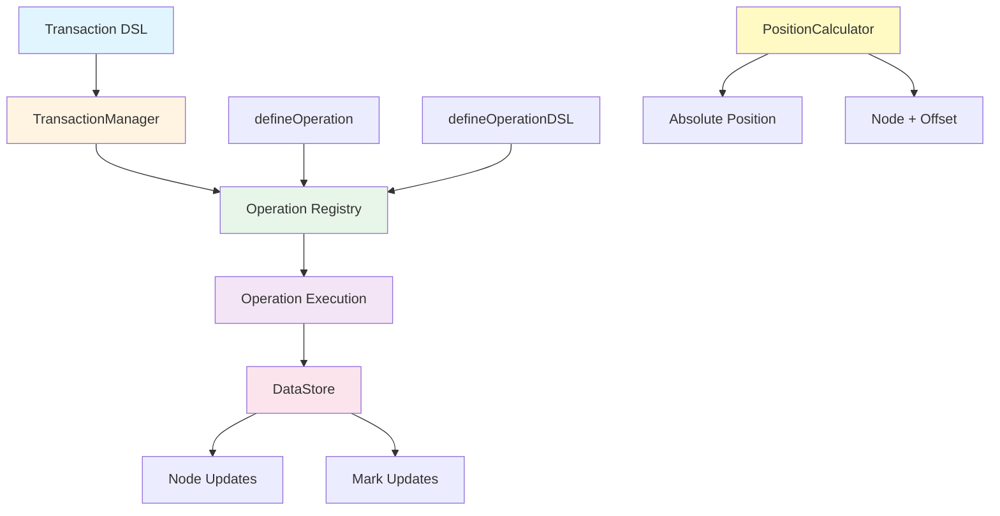

# @barocss/model

BaroCSS model package. Provides document data structures, transaction execution, operation definition/registration, and position calculation utilities. This package adopts a DSL-first architecture (`transaction(editor, ops).commit()`).

## Architecture



## Key Components
- DataStore: Store providing snapshot/overlay/lock (@barocss/datastore)
- TransactionManager: Acquire lock → start overlay → execute operations → commit/rollback
- Operation Registry: Runtime registration and DSL helpers via `defineOperation`/`defineOperationDSL`
- Transaction DSL: `transaction(editor, ops).commit()` + helpers `node`, `textNode`, `mark`, `control`
- PositionCalculator: Utility converting absolute position ↔ nodeId + offset

## Installation
```bash
pnpm add @barocss/model
```

## Basic Usage

### 1) Describe nodes with DSL
```ts
import { node, textNode, mark } from '@barocss/model';

const para = node('paragraph', { align: 'left' }, [
  textNode('inline-text', 'Hello ', [mark('bold')]),
  textNode('inline-text', 'World')
]);

const code = textNode('codeBlock', 'const x = 1;', { language: 'ts' });
```

### 2) Execute transaction
```ts
import { transaction, control } from '@barocss/model';
import '@barocss/model/operations/register-operations';

const result = await transaction(editor, [
  { type: 'create', payload: { node: para } },
  { type: 'create', payload: { node: code } },
  ...control('text-1', [
    { type: 'replaceText', payload: { start: 6, end: 11, newText: 'Universe' } },
    { type: 'applyMark', payload: { range: [0, 5], markType: 'bold' } }
  ])
]).commit();

if (!result.success) console.error(result.errors);
```

### 3) Define operation / register DSL
```ts
import { defineOperation, defineOperationDSL } from '@barocss/model/operations';

// Runtime implementation
defineOperation('setText', async (operation, context) => {
  const { nodeId, text } = operation.payload;
  return context.dataStore.updateNode(nodeId, { text });
});

// DSL helper
export const setText = defineOperationDSL((...args: [string] | [string, string]) => {
  if (args.length === 1) return { type: 'setText', payload: { text: args[0] } };
  const [nodeId, text] = args; return { type: 'setText', payload: { nodeId, text } };
});
```

## TransactionManager Overview
- Acquire global lock from DataStore (FIFO)
- Start `_beginTransaction()` → DataStore `begin()` → execute each operation → `end()` → `commit()`
- On exception, `rollback()`
- Execution results collected in `operations` array as each operation's `result`
- Schema is automatically injected via `dataStore.getActiveSchema()` and can be replaced via `setSchema(schema)` (type: `Schema`) when needed

## PositionCalculator
```ts
import { PositionCalculator } from '@barocss/model';

const calc = new PositionCalculator(editor.dataStore);
const abs = calc.calculateAbsolutePosition('text-1', 3);
const pos = calc.findNodeByAbsolutePosition(abs);
```

## Inclusions/Exclusions
- Included: Transaction DSL, TransactionManager, operation definition/DSL, PositionCalculator, types
- Excluded: NodeFactory, Operation/Transaction plugin system, separate Validator wrapper (use schema package directly)

## Tests
```bash
cd packages/model
pnpm test:run
# For specific files
pnpm test:run test/transaction/dsl-create.test.ts
```

## Documents
- ../paper/absolute-position-spec.md
- ../paper/selection-spec.md
- ../paper/transaction-spec.md
