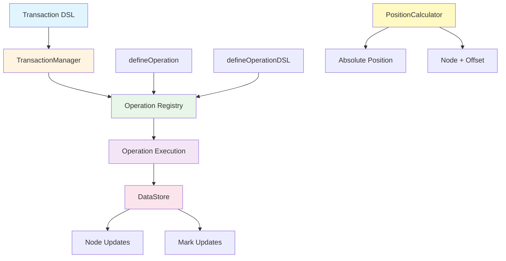

# @barocss/model

Barocss 모델 패키지. 문서 데이터 구조와 트랜잭션 실행, Operation 정의/등록, 위치 계산 유틸리티를 제공합니다. 이 패키지는 DSL 우선(`transaction(editor, ops).commit()`) 아키텍처를 채택합니다.

## Architecture



## 핵심 구성요소
- DataStore: 스냅샷/오버레이/락을 제공하는 저장소 (@barocss/datastore)
- TransactionManager: 락 획득 → 오버레이 시작 → Operation 실행 → 커밋/롤백
- Operation Registry: `defineOperation`/`defineOperationDSL` 기반 런타임 등록 및 DSL 헬퍼
- Transaction DSL: `transaction(editor, ops).commit()` + `node`, `textNode`, `mark`, `control`
- PositionCalculator: 절대 위치 ↔ nodeId + offset 변환 유틸리티

## 설치
```bash
pnpm add @barocss/model
```

## 기본 사용법

### 1) DSL로 노드 기술하기
```ts
import { node, textNode, mark } from '@barocss/model';

const para = node('paragraph', { align: 'left' }, [
  textNode('inline-text', 'Hello ', [mark('bold')]),
  textNode('inline-text', 'World')
]);

const code = textNode('codeBlock', 'const x = 1;', { language: 'ts' });
```

### 2) 트랜잭션 실행
```ts
import { transaction, control } from '@barocss/model';
import '@barocss/model/operations/register-operations';

const result = await transaction(editor, [
  { type: 'create', payload: { node: para } },
  { type: 'create', payload: { node: code } },
  ...control('text-1', [
    { type: 'replaceText', payload: { start: 6, end: 11, newText: 'Universe' } },
    { type: 'applyMark', payload: { range: [0, 5], markType: 'bold' } }
  ])
]).commit();

if (!result.success) console.error(result.errors);
```

### 3) Operation 정의/DSL 등록
```ts
import { defineOperation, defineOperationDSL } from '@barocss/model/operations';

// 런타임 구현
defineOperation('setText', async (operation, context) => {
  const { nodeId, text } = operation.payload;
  return context.dataStore.updateNode(nodeId, { text });
});

// DSL 헬퍼
export const setText = defineOperationDSL((...args: [string] | [string, string]) => {
  if (args.length === 1) return { type: 'setText', payload: { text: args[0] } };
  const [nodeId, text] = args; return { type: 'setText', payload: { nodeId, text } };
});
```

## TransactionManager 동작 개요
- DataStore에서 글로벌 락 획득(FIFO)
- `_beginTransaction()` 시작 → DataStore `begin()` → 각 Operation 실행 → `end()` → `commit()`
- 예외 발생 시 `rollback()`
- 실행 결과는 `operations` 배열에 각 Operation의 `result`로 수집
- 스키마는 `dataStore.getActiveSchema()`로 자동 주입되며 필요 시 `setSchema(schema)`로 교체 가능(타입: `Schema`)

## PositionCalculator
```ts
import { PositionCalculator } from '@barocss/model';

const calc = new PositionCalculator(editor.dataStore);
const abs = calc.calculateAbsolutePosition('text-1', 3);
const pos = calc.findNodeByAbsolutePosition(abs);
```

## 포함/제외 사항
- 포함: Transaction DSL, TransactionManager, Operation 정의/DSL, PositionCalculator, 타입들
- 제외: NodeFactory, Operation/Transaction Plugin 시스템, 별도 Validator 래퍼(스키마 패키지 직접 사용)

## 테스트
```bash
cd packages/model
pnpm test:run
# 특정 파일만
pnpm test:run test/transaction/dsl-create.test.ts
```

## 문서
- ../paper/absolute-position-spec.md
- ../paper/selection-spec.md
- ../paper/transaction-spec.md
