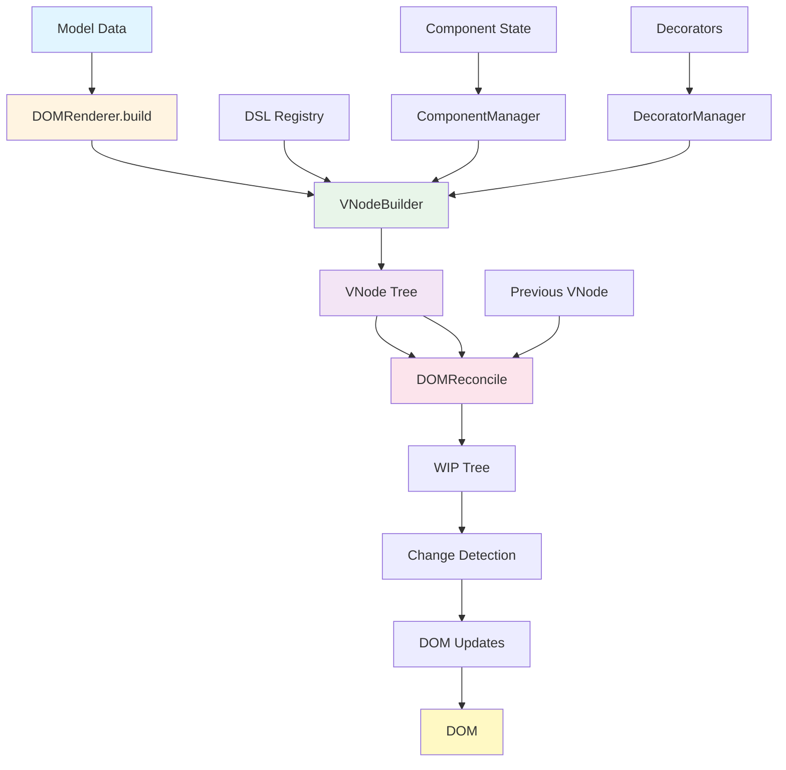

# @barocss/renderer-dom

DOM renderer package. Converts model data to DOM and provides stable DOM updates based on `sid`.

## Architecture



## Installation

```bash
pnpm add @barocss/renderer-dom
```

## Basic Usage

```typescript
import { DOMRenderer } from '@barocss/renderer-dom';
import { define, element, slot } from '@barocss/dsl';

// Define template
define('paragraph', element('p', { className: 'para' }, [slot('content')]));

// Create renderer and render
const renderer = new DOMRenderer();
const container = document.getElementById('app');

const model = {
  sid: 'p1',
  stype: 'paragraph',
  content: [
    { sid: 't1', stype: 'text', text: 'Hello World' }
  ]
};

renderer.render(container, model);
```

## Architecture Overview

renderer-dom operates in the following flow:

1. **Model → VNode**: `VNodeBuilder` converts model into a pure VNode tree
2. **VNode → DOM**: `Reconciler` compares previous VNode with new VNode and applies only minimal changes to DOM
3. **State Management**: `ComponentManager` globally manages component instances and state based on `sid`

Core Principles:
- VNode is a pure representation (does not include DOM markers)
- `sid`-based DOM stability (similar to React's `key`)
- Full document rebuild + prev/next comparison ensures minimal changes

## DSL Rules

### Template Definition

Register component templates with `define()`.

```typescript
// Element template
define('heading', element('h1', { className: 'title' }, [slot('content')]));

// Function component (signature: (props, model, context) => ElementTemplate)
define('counter', (props, model, ctx) => {
  const count = ctx.instance?.get('count') ?? 0;
  return element('div', {}, [
    element('button', { onClick: () => ctx.instance?.set({ count: count + 1 }) }, ['+']),
    element('span', {}, [String(count)])
  ]);
});

// Generic type support
define<MyProps, MyModel, MyContext>('typed-component', (props, model, ctx) => {
  // Type safety guaranteed
});
```

**Important**: 
- Template functions must always return `ElementTemplate`
- Never mix `props` and `model`
- `context.model` refers to the original model

### `element(tag, attrs?, children?)`

Creates an element template.

```typescript
// Static attributes
element('div', { className: 'container', id: 'app' }, [])

// Dynamic attributes (function)
element('div', { 
  className: (model) => model.active ? 'active' : 'inactive' 
}, [])

// Namespace is automatically handled (SVG/MathML)
element('svg', { width: 100, height: 100 }, [
  element('circle', { cx: 50, cy: 50, r: 40 })
])
```

### `slot('content')` - The Only Path for Child Expansion

To render child models, you **must** use `slot('content')`.

```typescript
define('list', element('ul', {}, [slot('content')]));

const model = {
  sid: 'list1',
  stype: 'list',
  content: [
    { sid: 'item1', stype: 'listItem', text: 'Item 1' },
    { sid: 'item2', stype: 'listItem', text: 'Item 2' }
  ]
};
```

**Note**: `data('content')` only provides access to the array original and should not be used for children expansion.

### `when()` - Conditional rendering

```typescript
import { when } from '@barocss/dsl';

define('conditional', (props, model, ctx) => {
  return element('div', {}, [
    when(
      () => model.show,
      element('span', {}, ['Visible']),
      element('span', {}, ['Hidden']) // elseTemplate (optional)
    )
  ]);
});
```

### `each()` - Iterative rendering

```typescript
import { each } from '@barocss/dsl';

define('list', (props, model, ctx) => {
  return element('ul', {}, [
    each(
      () => model.items,
      (item, index) => element('li', {}, [item.text]),
      (item) => item.id // key function (optional, as sid replacement)
    )
  ]);
});
```

## VNode Structure

VNode is a pure representation of DOM. DOM markers (`data-bc-*`, `data-decorator-*`) are not included in VNode.

```typescript
interface VNode {
  // Basic fields
  tag?: string;
  text?: string | number;
  attrs?: Record<string, any>;
  style?: Record<string, any>;
  children?: Array<string | number | VNode>;
  
  // Component identifiers
  sid?: string;
  stype?: string;
  props?: Record<string, any>;
  model?: Record<string, any>;
  
  // Decorator references
  decorators?: unknown[];
  
  // Decorator VNode only
  decoratorSid?: string;
  decoratorStype?: string;
  decoratorCategory?: 'inline' | 'block' | 'layer' | string;
  decoratorPosition?: 'before' | 'after' | 'inside' | string;
  decoratorModel?: Record<string, any>;
  
  // Portal VNode only
  portal?: { 
    target: HTMLElement | (() => HTMLElement) | string; 
    template: any; 
    portalId?: string 
  };
}
```

## Handling data-* attributes

- All `data-*` markers like `data-bc-sid`, `data-bc-stype` are **attached/updated by Reconciler only in DOM**
- Only identifier information like `sid`, `stype` is raised to the top level in VNode
- `data-component-*` attributes are not used (removed)

## Reconciler Behavior

### prevVNode vs nextVNode comparison

Reconciler compares previous VNode with new VNode and applies only minimal changes to DOM.

```typescript
// First render
renderer.render(container, { sid: 'p1', stype: 'paragraph', text: 'Hello' });
// → stored in prevVNodeTree

// Second render
renderer.render(container, { sid: 'p1', stype: 'paragraph', text: 'World' });
// → compare prevVNode with nextVNode → only text updated
```

### Root Host Processing

- Find or create host directly under container using `model.sid`
- Replace if tag differs
- Set `data-bc-sid`, `data-bc-stype` only in DOM

### Attribute/Style Updates

- `updateAttributes(element, prevAttrs, nextAttrs)`: Compare with previous attributes to add/modify/remove
- `updateStyles(element, prevStyles, nextStyles)`: Compare with previous styles to add/modify/remove

**Removal Handling**: Attributes/styles that existed previously but are not in the new VNode are removed from DOM.

### Child Reconciliation

- Recursively reconcile children expanded via `slot('content')`
- Matching priority: `sid` (component) / `decoratorSid` (decorator) → reuse same DOM
- Minimal change goal even in text/element mixtures
- In deeply nested structures, DOM elements may be replaced when parent path changes significantly, but instances based on `sid` are preserved

### Text Node Processing

Text nodes are updated separately to avoid affecting other element children of the parent.

### Deletion/Cleanup

Unvisited hosts/portal hosts are cleaned up when rendering ends.

## Namespace handling

Elements requiring namespaces like SVG, MathML are automatically handled.

```typescript
define('svg-icon', element('svg', { 
  xmlns: 'http://www.w3.org/2000/svg',
  width: 24,
  height: 24
}, [
  element('path', { d: 'M12 2L2 7v10l10 5 10-5V7z' })
]));
```

Special attributes (like `xlink:href`) and style removal/updates are also included.

## Marks and Decorators

### Mark Definition

Applies styles to text.

```typescript
import { defineMark } from '@barocss/dsl';

defineMark('bold', element('strong', { 
  style: { fontWeight: 'bold' } 
}, [data('text')]));

defineMark('link', element('a', { 
  href: attr('href', '#'),
  className: 'mark-link'
}, [data('text')]));
```

### Decorator Definition

Adds UI overlays.

```typescript
import { defineDecorator } from '@barocss/dsl';

defineDecorator('comment', element('div', { 
  className: 'comment-block' 
}, []));
```

### Usage example

```typescript
// Using marks in model
const model = {
  sid: 'p1',
  stype: 'paragraph',
  content: [
    {
      sid: 't1',
      stype: 'text',
      text: 'Hello World',
      marks: [
        { type: 'bold', range: [0, 5] },
        { type: 'link', range: [6, 11], attrs: { href: 'https://example.com' } }
      ]
    }
  ]
};

// Using decorators
const decorators = [
  {
    sid: 'dec1',
    stype: 'comment',
    category: 'block',
    position: 'before', // 'before' | 'after' | 'inside'
    model: { note: 'Comment text' }
  }
];

renderer.render(container, model, decorators);
```

### Decorator Rules

- Store `decoratorSid`, `decoratorStype`, `decoratorCategory`, `decoratorPosition`, `decoratorModel` at VNode top level
- In DOM, Reconciler attaches/updates corresponding `data-decorator-*` attributes
- **Block/layer decorators are applied only to component VNodes** (prohibited on mark VNodes)
- Inline marks and decorators can be processed simultaneously, safely handling overlap/split cases
- Determine insertion position based on `decoratorPosition` (`before`/`after`/`inside`)

## Component state management

### State Class Definition

```typescript
import { defineState } from '@barocss/renderer-dom';
import { BaseComponentState } from '@barocss/renderer-dom';

class CounterState extends BaseComponentState {
  // Optional: Set initial state
  initState(initial: any) {
    this.data = { count: initial?.count ?? 0 };
  }
  
  // Optional: Create snapshot (uses shallow copy if not provided)
  snapshot() {
    return { ...this.data };
  }
  
  // Custom methods
  increment() {
    this.set({ count: this.get('count') + 1 });
  }
}

defineState('counter', CounterState);
```

### Using State

```typescript
define('counter', (props, model, ctx) => {
  const count = ctx.instance?.get('count') ?? 0;
  return element('div', {}, [
    element('button', { 
      onClick: () => ctx.instance?.increment() 
    }, ['+']),
    element('span', {}, [String(count)])
  ]);
});
```

### State Management Principles

- `ComponentManager` globally manages `BaseComponentState` instances based on `sid`
- State access via `context.instance`
- `set(patch)` call emits `ComponentManager.emit('changeState', sid, ...)`
- `BaseComponentState.mount(vnode, element, context)`/`unmount()` hooks are integrated into lifecycle
- **DOMRenderer subscribes to `changeState` event and triggers throttled full re-render via `requestAnimationFrame`**
- **Partial update API is not provided** (`updateBySid` removed). Always full document rebuild + prev/next comparison

## Portal

You can render to a different DOM container.

```typescript
import { portal } from '@barocss/dsl';

define('modal', (props, model, ctx) => {
  return element('div', {}, [
    portal(
      () => document.body, // target: HTMLElement | (() => HTMLElement) | string
      element('div', { className: 'modal-overlay' }, [model.content]),
      'modal-root' // portalId (optional)
    )
  ]);
});
```

### Portal Operation Principle

- Identify/reuse host within target container using `portalId`
- Portals not visited in render cycle are cleaned up
- When target changes, clean up host from previous target and migrate to new target
- Same `portalId` guarantees reuse of same DOM host

## Performance and Stability

### DOM Stability

- `sid`/`decoratorSid` serve as criteria for DOM reuse, similar to React's `key`
- Components with the same `sid` reuse DOM elements and state instances

### Full Document Reconciliation

- Full document reconciliation is allowed
- VNode creation remains pure/fast
- Unnecessary DOM reads are prohibited (comparison performed via prevVNode vs nextVNode)

### Performance Benchmarks

- 1000 nodes: < 3 seconds
- 5000 nodes: < 60 seconds (slow CI environment baseline)
- 1000 nodes with block decorators: < 30 seconds
- Memory increase for 50 full render iterations: < 5MB

## API Reference

### `DOMRenderer`

#### `constructor(registry?: RendererRegistry, options?: DOMRendererOptions)`

Creates a renderer instance.

#### `render(container: HTMLElement, model: ModelData, decorators?: DecoratorData[], runtime?: Record<string, any>): void`

Renders model to DOM.

**Parameters:**
- `container`: Target DOM element for rendering
- `model`: Root model data (must include `sid`, `stype`)
- `decorators`: Decorator array (optional)
- `runtime`: Runtime context (optional)

### `defineState(stype: string, StateClass: new (...args: any[]) => BaseComponentState): void`

Registers a state class.

## Error Handling

- **Model missing `stype`**: Throws error immediately when rendering starts. Rendering is aborted
- **Model missing `sid`**: Skips and logs warning. Existing DOM is not changed
- **Unregistered `stype`**: Throws error
- **Invalid decorator range/position**: That decorator is ignored (does not crash)
- **Invalid portal target**: That portal is skipped and warning is logged

## Notes

1. **`stype` required**: Error occurs if model does not have `stype`
2. **`sid` recommended**: Warning occurs and DOM may not update if `sid` is missing
3. **Use `slot('content')`**: Always use `slot('content')` for child rendering
4. **State changes trigger auto re-render**: Full document is automatically re-rendered when `set()` is called
5. **Portal cleanup**: Portals are automatically cleaned up if not visited in render cycle
6. **VNode purity**: Do not inject DOM markers (`data-*`) into VNode
7. **Wrapper prohibition**: Introduction of wrappers is prohibited

## Testing/Validation Principles

- DOM comparison is validated using normalized strings based on `normalizeHTML(container.firstElementChild)`
- Attribute/style removal must be reflected via prev/next comparison
- Portals reuse hosts via `portalId` and are cleaned up if not visited

## License

MIT
