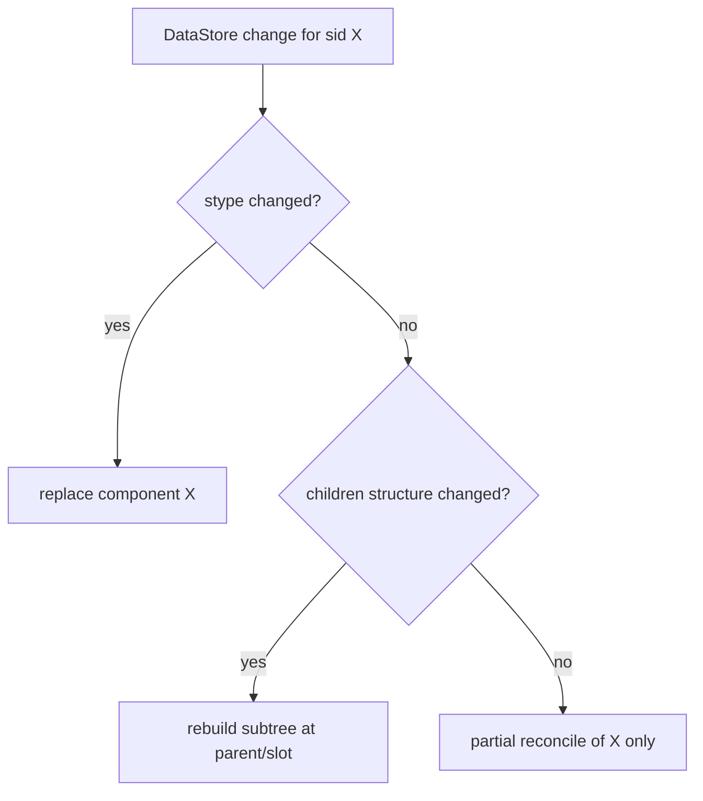
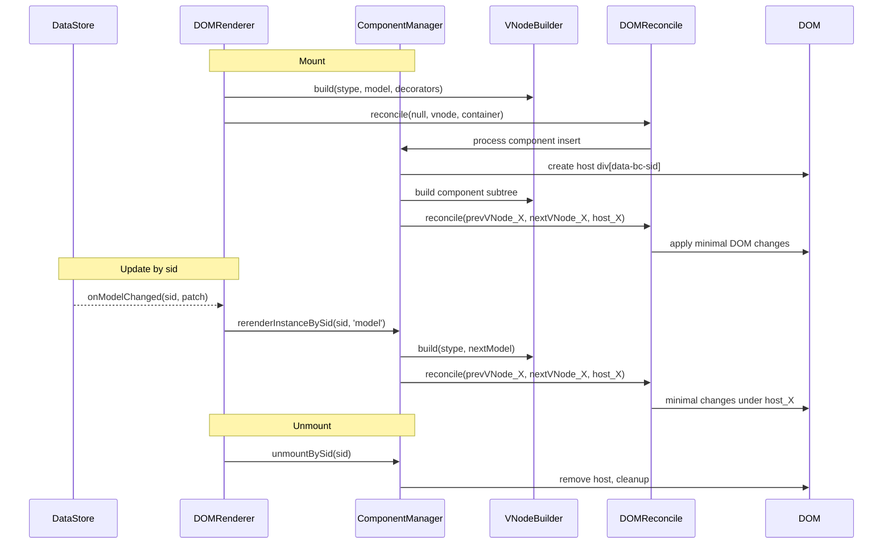
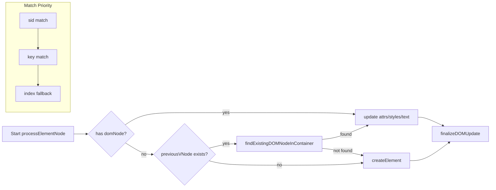
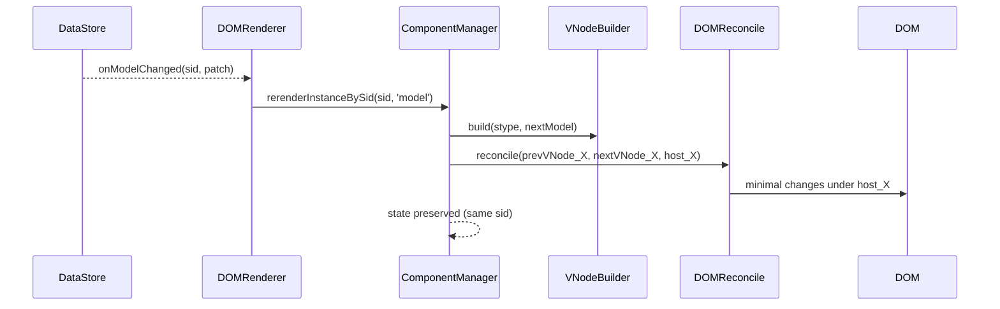
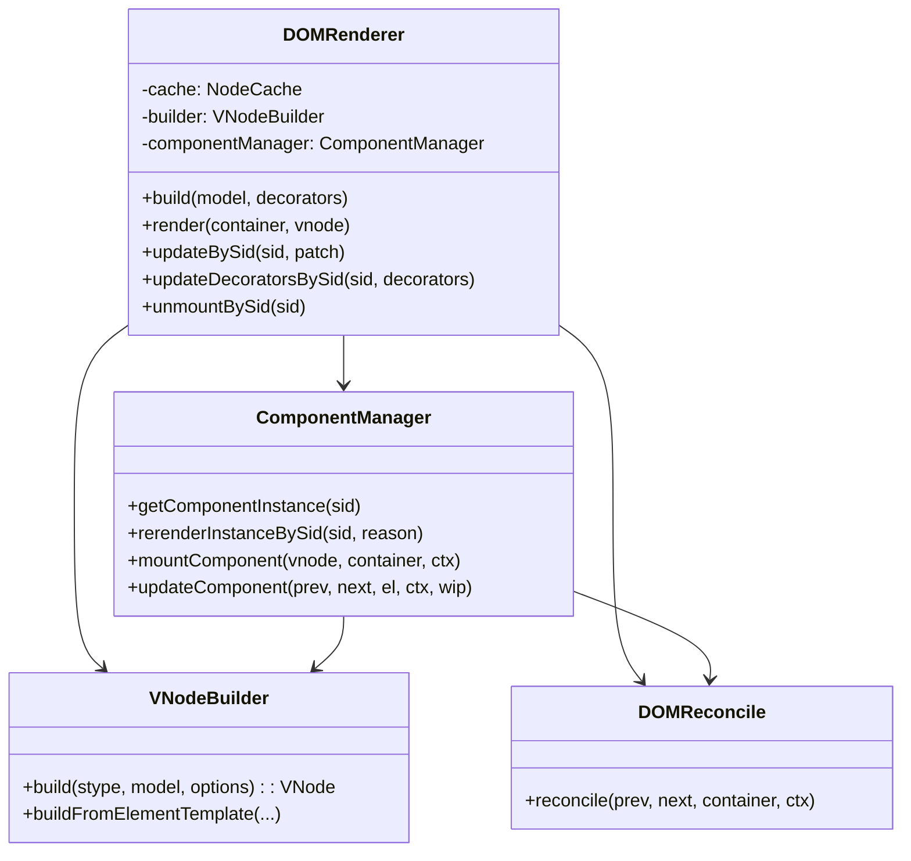
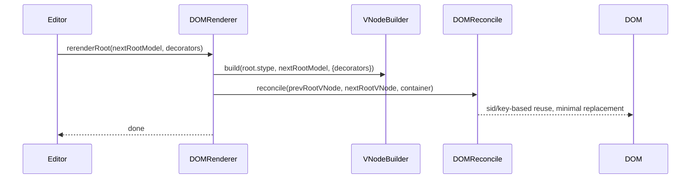
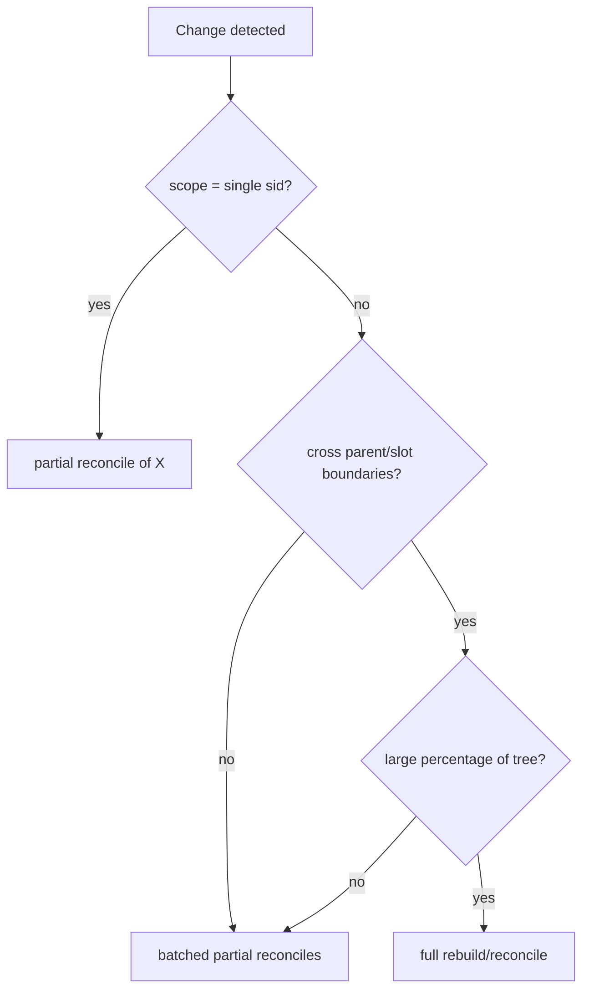
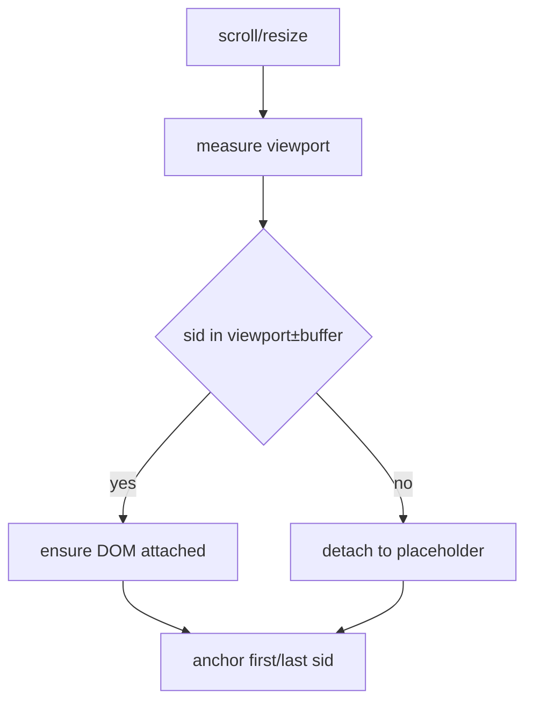
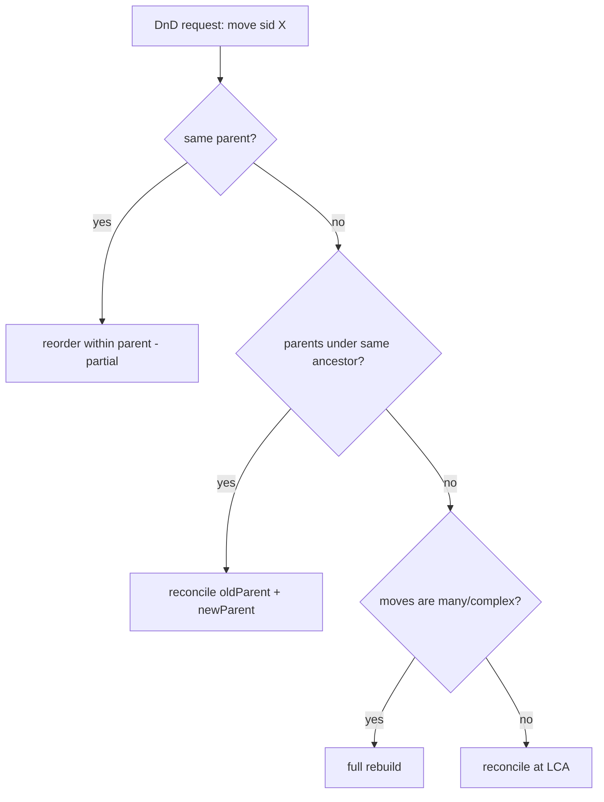

## SID-Driven Component Lifecycle and Reconciliation for the Editor

Goal: Accurately and quickly reflect editor data model to DOM. `renderer-dom` is not a general-purpose UI framework like React, but a renderer dedicated to editor models. Identity and state are based on `sid`.

### Core Principles
- Component identity: `sid` is first priority. Same `sid` means same component instance.
- Role identification: `stype` identifies which component (template/component name).
- State storage: Component instances and local state are stored and retrieved using `sid` as key.
- Partial updates: Subscribe to data/decorator changes by `sid` from DataStore and update only that instance.
- DOM markers: Attach `data-bc-sid` to DOM for both root and children as much as possible to enable fast direct lookup.

### Data/State/DOM Consistency
- `ComponentInstance.id = sid`
- `ComponentInstance` includes: `element(host)`, `props(pure data)`, `model(original)`, `decorators`, `state`, `mounted`
- `ComponentContext` includes global service accessors: `services = { editor, dataStore, selection, schema, decorators }`
- Host node created in DOM: `div[data-bc-sid][data-bc-stype=component][data-bc-component=<stype>]`

### Matching and Reconciliation Rules
Priority: `sid` > `key` > index within siblings
- Root/children common: Reuse same DOM/instance if same `sid`. Replace if `stype` changes.
- `key` used only when `sid` is absent. If both absent, use index-based.
- Children array/slot: Match item `sid` with highest priority. If absent, assign stable key (`stype-index-slot`).

### Lifecycle (Editor-Specific)
1) Resolve
   - Query `sid` → `model` from DataStore, check `stype` → Query template/component from Registry
   - Check instance registry: `instances.get(sid)`

2) Mount
   - Create host and attach to DOM (once): `div[data-bc-sid][data-bc-stype=component][data-bc-component]`
   - `props = sanitize(model)`, `state = initState()`, calculate decorator application range
   - Build template → DOM reconcile → `mounted = true`
   - Store instance: `instances.set(sid, instance)`

3) Update
   - Support "sid-specified updates" as first-class, separate from tree updates:
     - Model change: `updateBySid(sid, nextModel | patch)` → Rebuild/partial reconcile with instance context
     - Decorator change: `updateDecoratorsBySid(sid, decorators)` → Reapply only text/layer/block ranges
   - Preserve state if same `sid`, replace if `stype` changes

4) Unmount
   - Unsubscribe from DataStore/Decorator, remove DOM, delete instance

### Full Rebuild vs Partial Reconciliation Decision Criteria
- Partial reconciliation (recommended): Update only at component level if all conditions met
  - Change scope limited to specific `sid`
  - `stype` unchanged, no structural changes (no large changes to slot/children count)
  - No key-based/sorting changes needed at parent level
- Full rebuild (tree scope): Rebuild upper subtree if any of the following is true
  - `stype` change (component replacement needed)
  - Large structural changes in children (bulk insert/delete, cannot skip sorting)
  - Changes crossing upper slot/portal boundaries

### Decision Diagram



### Lifecycle Sequence (Mount/Update/Unmount)



### Public API (renderer-dom)
- `renderer.mount(container, rootModel, decorators?)`
- `renderer.updateBySid(sid, nextModelOrPatch)`
- `renderer.updateDecoratorsBySid(sid, decorators)`
- `renderer.unmountBySid(sid)`
- `renderer.getComponentInstance(sid)`

Internal/Manager:
- `componentManager.rerenderInstanceBySid(sid, reason: 'model'|'decorator'|'state')`
- `componentManager.getComponentInstance(sid)`

### DOM/Matching Implementation Points
- VNodeBuilder
  - Preserve `attrs['data-bc-sid'] = sid` in all build paths as much as possible
  - Slot/array children: Accumulate and add all items. Prevent omission/overwriting
- DOMProcessor / DOMOperations
  - `sid` priority matching in `findExistingDOMNodeInContainer`
  - Remove previous node when `sid` duplicates under same parent in `finalizeDOMUpdate` (prevent duplicates)
- ChildrenReconciler
  - Reflect `sid` in matching priority. `key` is auxiliary. Use index if both absent

- DOM Matching Flow



### State Management
- `initState()` performed only once, `setState()` triggers local reconcile
- State preserved in updates with same `sid`. New instance created if `sid` changes

### DataStore Integration
- `dataStore.subscribe({ onModelChanged(sid, patch), onDecoratorsChanged(sid, decorators) })`
- Call `renderer.updateBySid(sid, patch)` or `renderer.updateDecoratorsBySid(sid, decorators)` in handler

### Sequence Diagram (Partial Update)



### Children/Slot Integration Flow

```mermaid
flowchart TD
  A[ElementTemplate.children] --> B[_processChild]
  B -->|type=function| C[execute -> value]
  C --> D{array?}
  D -- yes --> E[for each item -> build]
  D -- no --> F{element/component/data}
  F -- element --> G[_buildElement]
  F -- component --> H[_buildComponent]
  F -- data(text) --> I[append text run]
  B -->|type=slot| J[_renderSlotGetChildren]
  J --> K[build(child.stype, child)]
  K --> L[ensure data-bc-sid]
  L --> M[orderedChildren.push]
  A --> N[flushTextParts]
  N --> O[vnode.children = orderedChildren]
```

### Architecture Overview



### Step-by-Step Implementation Plan
1) Finalize types/context
   - `ComponentInstance.id = sid`, expose `ComponentContext.services`
2) Reflect matching logic
   - Apply `sid` priority matching to VNode/DOMProcessor/ChildrenReconciler
3) Add partial reconciliation API
   - DOMRenderer: `updateBySid`, `updateDecoratorsBySid`, `unmountBySid`
   - ComponentManager: `rerenderInstanceBySid`
4) Fix slot/array children omission bug
   - Verify/fix `_renderSlotGetChildren` and children integration path (accumulate all items)
5) Align tests
   - Modify children/mixed/keys tests to match `sid` priority rule
   - Add partial update API tests

### Guaranteed Behaviors
- Components with same `sid` preserve state.
- If `stype` changes, existing component is unmounted and new component is mounted.
- `updateBySid` performs minimal DOM changes only within that host scope.
- Slot/array children: All items reflected to DOM, reused if `sid` exists.

### Full Update (Full Rebuild/Reconcile) Perspective

For global changes (document reformatting, bulk sorting, large-scale schema/plugin replacement, etc.), root-based full rebuild may be efficient. Even then, maximize DOM reuse using `sid` markers and instance registry.

- When to use
  - Multiple nodes structurally changed simultaneously (crossing multiple parent/slot boundaries)
  - When partial update boundary calculation is inefficient due to upper-level layout/schema changes
  - Initial load, large document paste/conversion, bulk decorator repositioning

- Strategy
  - Full VNode rebuild from root model snapshot: `nextRootVNode = builder.build(root.stype, root, {decorators})`
  - Perform `reconcile(prevRootVNode, nextRootVNode, container)`
  - Matching priority same: `sid > key > index` (same globally in tree)
  - Component instance mapping attempts state preservation based on `sid`

- API Proposal
  - `renderer.rerenderRoot(nextRootModel, decorators?)`
  - `renderer.reconcileRoot()` (re-execute with last saved model/decorator values)

- Trade-offs
  - Advantages: Boundary calculation cost is 0, simple implementation. Consistent results for global changes.
  - Disadvantages: Unnecessary upper tree calculation/cost when change scope is small.
  - Mitigation: Minimize actual DOM replacement by maintaining `sid`/`key` (many nodes "reused").

#### Full Update Sequence



#### Full vs Partial Update Decision (Extended)



### Additional Editor Rendering Considerations

- Viewport-based virtualization
  - Policy: Only viewport + buffer (above/below Npx) hold actual DOM, rest are placeholders
  - sid maintenance: Preserve instances/state even in non-visible areas, only detach/reattach DOM
  - Scroll anchoring: Use first/last `sid` of visible items as anchor to prevent layout jumps

- Selection/cursor preservation
  - Integration with SelectionManager: Recalculate anchor/focus with `sid`-range before/after reconcile
  - Inline text transformation (mark/decorator insertion): Restore based on run-range, not text node basis

- IME/composition input stability
  - Minimize reflow of text nodes under that `sid` during composition (CompositionEvent)
  - Display composition area as inline decorator (layer) to minimize conflicts

- Decorator layer policy
  - Layer priority: inline > layer > block
  - When same area conflicts, decide parallel display by latest timestamp or priority rules
  - Delegate pointer interaction to layer, do not block body events (pass-through option)

- Overlay/portal guide
  - Render tooltips/context menus/drop previews to body via `PortalManager`
  - Synchronize with scroll/zoom: Track anchor `sid` bbox → update portal position (rAF)

- Scheduling/priority
  - rAF batching: Coalesce multiple updates within same frame
  - Priority queue: caret/selection > viewport enter/exit > decorators > rest
  - Split long tasks: Split long subtrees into chunks distributed across multiple frames

- Error recovery
  - On partial reconcile failure, rebuild that subtree, escalate to upper LCA on repeated failures
  - Provide logging/fallback UI insertion point via render error hook (onError)

- Observation/metrics
  - Hooks: onReconcileStart/End, onNodeBefore/After, statistics counters (insert/update/move/remove)
  - Scene complexity metrics: visible node count, average depth, mark/decorator density

- Accessibility (A11y)
  - Document semantic tag/role/aria mapping policy in templates
  - Keyboard navigation: Synchronize `sid` traversal/range expansion shortcuts with DOM focus

- Security
  - Prohibit HTML injection in data→DOM binding (always escape text)
  - Trusted HTML only via explicit API (whitelist), must pass sanitizer

- Clipboard/serialization integration
  - Export/import selected `sid` ranges in schema-compliant form
  - Quick feedback via partial reconcile of that `sid` range immediately after paste

#### Viewport Virtualization Diagram



### Implementation Order and Minimum PoC Scope

1) SID-priority matching and state preservation
   - Implementation: Reflect `sid > key > index` priority in `DOMProcessor.findExistingDOMNodeInContainer`/`finalizeDOMUpdate`, ChildrenReconciler. Preserve `data-bc-sid` in all build paths.
   - PoC: 3 tests for item text change/reordering in single list pass without DOM replacement. Verify instance state (`initState` counter) maintained.

2) Partial reconciliation API
   - Implementation: Add `DOMRenderer.updateBySid(sid, patch|nextModel)`, `updateDecoratorsBySid(sid, decorators)`, `unmountBySid(sid)`. Call host-scoped reconcile inside `ComponentManager.rerenderInstanceBySid`.
   - PoC: 4 tests where only text/attributes/decorators of single paragraph update. Compare snapshots showing other nodes' DOM untouched.

3) Move API (minimum DnD unit)
   - Implementation: `renderer.moveBySid(sid, newParentSid, targetIndex)` → partial reconcile of oldParent and newParent subtrees (batch). Expand to LCA on failure.
   - PoC: 2 cases of reordering within same parent, 2 cases of parent change. Verify state preservation and DOM move (insertBefore) usage.

4) Fix slot/array children omission
   - Implementation: Ensure all items accumulated in `_renderSlotGetChildren`/children integration path. Assign stable key when sid absent.
   - PoC: 4 tests accurately reflecting count changes 1→2→1→0 in slot('content') array in DOM.

5) Align tests and unify host selector
   - Implementation: Unify pattern of querying `div[data-bc-sid="..."]` as host then verifying internal tags in tests.
   - PoC: basic/children/mixed/keys pass with sid-priority rule (minimum 0 failures).

6) Viewport virtualization (minimum)
   - Implementation: Attach DOM only for `sid` within visible area ±buffer, rest are placeholders. Preserve state/instances.
   - PoC: Near 60fps scrolling in 1,000-item list, DOM children count maintained within viewport-based upper limit.

7) Selection/cursor preservation (minimum)
   - Implementation: Store/restore `sid`-range with SelectionManager before/after reconcile. Prevent caret jump even on inline changes.
   - PoC: 2 tests where cursor position unchanged even during decorator toggle/text insertion in paragraph editing.

8) Portal/overlay (minimum)
   - Implementation: Render via `PortalManager` to body, update position by tracking anchor `sid` bbox.
   - PoC: 2 cases maintaining correct position on context menu open/scroll.

9) Expose observation/metrics
   - Implementation: Reconcile statistics, onReconcileStart/End hooks, insert/update/move/remove counters.
   - PoC: Collect statistics in test runner then verify thresholds (regression guard).

Success Criteria (Initial):
- Partial update/move/slot tests pass (>95%) with DOM replacement minimized (assertions included)
- No frame drops during 1k list scroll (local environment), visible DOM count limit maintained
- Cursor stability guaranteed in selection/IME scenarios

#### WIP Strategy (Summary)

- per-sid index map (frame-scoped)
  - `sid -> HTMLElement` (DOM index): Build once by scanning container at reconcile start (`querySelectorAll('[data-bc-sid]')`).
  - `sid -> WIP` (WIP index): Register nodes with sid at onWIPProcess stage each frame. Discard at frame end.
  - Matching priority: `sid` (DOM/WIP index) → key → index. Fallback to existing local search on failure.
- Replace rules
  - Same `sid` + same `stype`: Reuse DOM/instance, update only attributes/text.
  - Same `sid` + `stype` changed: Replace. Unmount existing instance → mount new instance.
  - `sid` conflict (duplicate under same parent): Remove duplicate nodes except preempted node, then insert policy.
- Flow
  1) Reconcile start: Build `sidDomIndex` → inject into WIP manager
  2) Build/process: `findExistingDOMNodeInContainer` queries `sidDomIndex`/`sidWipIndex` with first priority, fill `sidWipIndex` when creating WIP
  3) Execution stage: Apply replace/move (insertBefore) policy in `finalizeDOMUpdate`, clean up duplicate `sid`
  4) End: Call statistics/hooks (onReconcileEnd)

#### Root WIP Processing (Including Component Internal Reconciliation)

- Container: Root reconcile performed on `container` (root/host) specified by parent.
- Root creation rule: If root WIP has `vnode.tag`, must hold new/existing element as child of `container`.
  - If incorrectly matched as `wip.domNode === container`, force branch: create element and `container.appendChild(element)`.
  - Parent-child order: If parent domNode absent before child finalize, immediately create and attach, then insert child.
- Prevent text flattening: If parent has `children`, do not directly write parent `textContent` (prioritize child creation).

#### Diagnostic Checklist (When Root/Slot Issues Occur)

- onWIPProcess: Log root WIP's `vnode.tag`, `previousVNode`, `targetNode`/`domNode` type (element/text/container).
- finalizeDOMUpdate (root branch): Check `container.innerHTML`, `wip.domNode.nodeType`, `tagName` before/after append.
- Child finalize timing: Check if `wip.parent.domNode` exists, verify if parent creation path entered if absent.

#### Snapshots for Partial Updates

- Maintain `sid -> lastVNode` snapshot store inside `DOMRenderer`.
- Update snapshot map by traversing current tree when `render()` completes.
- Partial APIs (`updateBySid`, `updateDecoratorsBySid`) rebuild/reconcile only subtree starting from target `sid`'s snapshot.

### Drag & Drop Move Perspective (Parent/Slot Change of sid Object)

When moving specific `sid` node to different container via DnD, full root update is not always needed. Generally apply following strategy.

- Reordering within same parent: Partial reconcile
  - Target: One same parent subtree
  - Action: Change only sibling order. Maximum reuse of state/DOM by maintaining `sid`

- Move across parent/slot boundary: Local 2-point partial reconcile
  - Target: Original parent subtree (remove) + new parent subtree (insert)
  - Action: Remove from original position, insert at new position. Preserve state by maintaining `sid`, attempt DOM move (reuse)
  - Expand to LCA-scoped reconcile on failure/conflict

- Global bulk move/complex crossing: Consider root rebuild
  - When many nodes cross multiple containers repeatedly, full path is advantageous if boundary calculation cost grows

Recommended API:
- `renderer.moveBySid(sid, newParentSid, targetIndex)`
  - Internally: (1) oldParent partial reconcile, (2) newParent partial reconcile executed in batch
  - Edge: Parent/slot non-existent, index range check, LCA expansion criteria

DnD Decision Diagram:



State Preservation Rules:
- If `sid` immutable, local state is transferred/preserved. Considered same instance even when moved to new parent.
- Replace if `stype` changes.

DOM Reuse Hints:
- In `DOMOperations.finalizeDOMUpdate`, when existing DOM node's parent changes, prioritize move via `insertBefore` rather than remove→insert.

### Real-time/Collaborative Editing/AI Enhancement Considerations

- Event coalescing/batching
  - Batch multiple `sid` updates within same frame into single reconcile cycle
  - Merge consecutive patches for same `sid` (based on last state)

- Priority
  - Cursor/selection (decoration: layer/inline) > visual stability (maintain scroll) > rest
  - Small text changes use partial reconcile, large structural changes escalate to root/subtree basis

- Consistency/transaction
  - Process changes grouped by same transaction ID in single reconcile cycle
  - Rollback or correct (rebuild that subtree) on failure

- Conflict handling (collaborative editing)
  - Only receive merged result model from CRDT/OT upper layer as input
  - Rebuild with latest snapshot on same `sid` conflict, preserve state based on `sid`

- Performance metrics
  - Expose `DOMReconcile` statistics (insert/update/move/remove counts)
  - Record average/max time per frame to obtain tuning basis

### VNode-DOM 1:1 Matching Principle

**Core Goal**: When DSL → build → VNode is produced, each VNode matches actual DOM element 1:1 to simplify rendering.

#### Basic Principles

1. **VNode is direct representation of DOM**
   - VNode accurately reflects DOM element structure
   - VNode.children = 1:1 correspondence with DOM.children
   - VNode.attrs = direct mapping to DOM attributes
   - VNode.text = direct mapping to DOM textContent

2. **Identity guarantee based on sid**
   - If `sid` exists, mark DOM with `data-bc-sid`
   - Same `sid` = same DOM element = same VNode identity
   - Matching between VNode and DOM performed immediately via `sid`

3. **Simple recursive reconcile**
   - Directly traverse VNode tree without WIP (Work In Progress) tree
   - Find DOM immediately with sid index map
   - Intuitive processing with recursive function

#### Reconcile Algorithm Design

```typescript
// sid-based index map (frame-scoped)
class SidIndex {
  private sidToDOM = new Map<string, HTMLElement>();
  
  // Scan once at reconcile start
  build(container: HTMLElement) {
    this.clear();
    container.querySelectorAll('[data-bc-sid]').forEach(el => {
      const sid = el.getAttribute('data-bc-sid');
      if (sid) this.sidToDOM.set(sid, el as HTMLElement);
    });
  }
  
  getDOM(sid: string): HTMLElement | null {
    return this.sidToDOM.get(sid) || null;
  }
  
  set(sid: string, dom: HTMLElement): void {
    this.sidToDOM.set(sid, dom);
  }
  
  delete(sid: string): void {
    this.sidToDOM.delete(sid);
  }
  
  clear(): void {
    this.sidToDOM.clear();
  }
}

// Simple recursive reconcile
function reconcile(
  prevVNode: VNode | null,
  nextVNode: VNode,
  container: HTMLElement,
  sidIndex: SidIndex,
  context: ReconcileContext
): HTMLElement {
  const sid = nextVNode.attrs?.['data-bc-sid'];
  
  // 1. Find DOM (sid priority)
  let domNode = sid ? sidIndex.getDOM(sid) : null;
  
  // 2. Match and process
  if (prevVNode && domNode) {
    // Reuse same element - update only
    updateDOMNode(domNode, prevVNode, nextVNode);
  } else if (domNode && prevVNode) {
    // sid exists but prevVNode differs - replace
    domNode = replaceDOMNode(domNode, nextVNode, container);
  } else if (!domNode && prevVNode) {
    // prevVNode exists but DOM absent - create new
    domNode = createDOMNode(nextVNode, container);
    if (sid) sidIndex.set(sid, domNode);
  } else {
    // Completely new creation
    domNode = createDOMNode(nextVNode, container);
    if (sid) sidIndex.set(sid, domNode);
  }
  
  // 3. Process children (recursive)
  if (nextVNode.children && Array.isArray(nextVNode.children)) {
    reconcileChildren(
      prevVNode?.children || [],
      nextVNode.children,
      domNode,
      sidIndex,
      context
    );
  }
  
  return domNode;
}

// Children reconcile
function reconcileChildren(
  prevChildren: VNode[],
  nextChildren: VNode[],
  parentDOM: HTMLElement,
  sidIndex: SidIndex,
  context: ReconcileContext
) {
  // Matching: sid > key > index
  const matched = new Set<number>();
  const nextDOMChildren: HTMLElement[] = [];
  
  for (let i = 0; i < nextChildren.length; i++) {
    const nextChild = nextChildren[i];
    if (!nextChild || typeof nextChild !== 'object') continue;
    
    // 1. Match by sid
    const nextSid = (nextChild.attrs as any)?.['data-bc-sid'];
    let prevChild: VNode | null = null;
    let prevIndex = -1;
    
    if (nextSid) {
      prevIndex = prevChildren.findIndex(c => 
        c && (c.attrs as any)?.['data-bc-sid'] === nextSid
      );
      if (prevIndex >= 0) {
        prevChild = prevChildren[prevIndex];
        matched.add(prevIndex);
      }
    }
    
    // 2. Match by key (only when sid absent)
    if (!prevChild && (nextChild as any).key) {
      prevIndex = prevChildren.findIndex(c => 
        c && (c as any).key === (nextChild as any).key
      );
      if (prevIndex >= 0) {
        prevChild = prevChildren[prevIndex];
        matched.add(prevIndex);
      }
    }
    
    // 3. Match by index (only when sid/key absent)
    if (!prevChild && prevChildren[i] && 
        (prevChildren[i] as VNode).tag === nextChild.tag) {
      prevIndex = i;
      prevChild = prevChildren[i] as VNode;
      matched.add(i);
    }
    
    // Recursive reconcile
    const childDOM = reconcile(
      prevChild,
      nextChild,
      parentDOM,
      sidIndex,
      context
    );
    nextDOMChildren.push(childDOM);
  }
  
  // 4. Remove unmatched previous children
  for (let i = 0; i < prevChildren.length; i++) {
    if (!matched.has(i)) {
      const prevChild = prevChildren[i];
      if (prevChild && typeof prevChild === 'object') {
        const prevSid = (prevChild.attrs as any)?.['data-bc-sid'];
        const domToRemove = prevSid ? sidIndex.getDOM(prevSid) : null;
        if (domToRemove && domToRemove.parentNode === parentDOM) {
          parentDOM.removeChild(domToRemove);
          if (prevSid) sidIndex.delete(prevSid);
        }
      }
    }
  }
  
  // 5. Arrange DOM order (place at correct position with insertBefore)
  let currentDOMIndex = 0;
  for (const nextDOM of nextDOMChildren) {
    const existingIndex = Array.from(parentDOM.children).indexOf(nextDOM);
    if (existingIndex !== currentDOMIndex) {
      // Move to correct position
      const referenceNode = parentDOM.children[currentDOMIndex] || null;
      parentDOM.insertBefore(nextDOM, referenceNode);
    }
    currentDOMIndex++;
  }
}
```

#### Reasons for Simplification Without WIP

**Problems with Existing WIP Approach:**
- Cost of VNode → WIP tree conversion
- Complexity of WIP → DOM conversion process
- Difficult debugging (multiple conversion steps)

**Advantages of New Approach:**
1. **Direct matching**: Clear matching as VNode and DOM correspond 1:1
2. **sid index map**: Performance optimization with O(1) DOM lookup
3. **Simple recursion**: Intuitive algorithm without complex conversions
4. **Easy debugging**: VNode → DOM conversion clear in single step

#### Matching Priority (Direct VNode-DOM Matching)

```
1. sid matching (highest priority)
   - nextVNode.attrs['data-bc-sid'] → sidIndex.getDOM(sid)
   - Same sid = same DOM element = reuse

2. key matching (only when sid absent)
   - nextVNode.key → find same key in prevChildren
   - Same key = same DOM element = reuse

3. index matching (only when sid/key absent)
   - Same index + same tag = same DOM element = reuse
```

#### VNode-DOM Consistency Guarantee

**VNode Structure = DOM Structure**
- `VNode.tag` → `HTMLElement.tagName.toLowerCase()`
- `VNode.attrs` → `HTMLElement.attributes`
- `VNode.children` → `HTMLElement.children` (1:1 order correspondence)
- `VNode.text` → `HTMLElement.textContent` (only when children absent)

**Identity Preservation Based on sid**
- If VNode has `sid`, attach `data-bc-sid` to DOM as well
- Match by same `sid` to reuse DOM
- Manage Component instances by `sid` to preserve state

#### Implementation Steps

1. **Implement SidIndex Class**
   - `build(container)`: Scan DOM at reconcile start
   - `getDOM(sid)`: O(1) DOM lookup
   - `set(sid, dom)`: Update index after matching

2. **Implement Simple reconcile Function**
   - Directly recursively traverse VNode tree
   - Find DOM based on sid
   - Handle update/create/remove

3. **Implement Children Matching Logic**
   - Priority: sid > key > index
   - Reuse only matched children, remove rest

4. **Arrange DOM Order**
   - Ensure correct order with insertBefore
   - Clean up duplicate sid

#### Performance Optimization

- **sid index map**: O(1) DOM lookup (previous: O(n) search)
- **Frame-scoped index**: Perform scan only once per frame
- **Minimize recursive calls**: Process only matched nodes

#### Test Verification Points

## Integrated Reconciler Design Draft (VNodeBuilder + Reconciler Unification)

### Goals
- Single Reconciler performs component execution → template (ElementTemplate) generation → VNode composition → DOM reflection in single loop.
- Consistently manage DOM elements and Component state based on sid.
- Dynamic children like slot('content') are recursively built during Reconcile and reflected to DOM without omission.

### Core Concepts
- Definition API
  - `define('stype', element(...))`: Register element template engine
  - `define('stype', { component(props, ctx) { ... } })`: Register functional component
  - `defineState('stype', StateClass)`: Register sid-specific state extension (optional)
- Context composition
  - `ctx = { id: sid, state, props, model, registry, setState, getState, initState }`
  - `ComponentManager` manages state by `sid` as key, uses registered class if `defineState()` registered.
- DOM host principle
  - Host is actual component root element. Wrapper prohibited.
  - Attach at minimum `data-bc-sid` to host, preferably `data-bc-stype`/`data-bc-component`.

### Integrated Reconcile Algorithm (Summary)
1) Input: `stype`, `model`, `decorators?` → single root VNode or directly execute component
2) Component execution
   - Query engine corresponding to `stype` from registry.
   - If functional, execute `engine(props, ctx)` → obtain ElementTemplate
   - If element template, use as is
3) Template → VNode composition
   - Interpret attributes/style/data/children/slot
   - If children has `slot('content')`, iterate slot data array and build each item again via 2)~3) path (recursive)
   - Preserve/assign `data-bc-sid` for all child VNodes as much as possible
4) VNode → DOM reflection
   - Match/reuse DOM with `sid > key > index` priority
   - Update attrs/style, recursively reflect text/children
   - Clean up unmatched previous children, final order same as `VNode.children`
5) State/snapshot update
   - `ComponentManager` stores instances/state with `sid` as key
   - Store `sid → lastVNode` snapshot at Reconcile end for use in partial updates

### slot('content') Processing Rules
- Slot interpreted at intermediate Reconcile stage.
  - Example: `define('paragraph', element('p', [slot('content')]))`
  - If `model.content` is array, recursively process each item via component execution → template → VNode → DOM reflection.
- If item is string/number, use as text node; if object, find engine using `item.stype || item.type` and recursively build.
- Preserve `sid` with priority for all slot items. If absent, assign stable sid (`stype-index-slot`).

### Component State Extension (defineState)
- Register state class per `stype` with `defineState('stype', StateClass)`.
- `ComponentManager` instantiates that class at first mount of `sid` and stores in instance map.
- Delegate `ctx.initState`, `ctx.setState`, `ctx.getState` to this instance, trigger `sid`-based partial reconcile.

### Integration with Partial Update API
- `renderer.updateBySid(sid, nextModelOrPatch)`
  - Check `stype` from snapshot or instance, then execute component → template → VNode composition, reconcile only under that host.
  - Handle small changes like text/decorator changes with minimal DOM changes.

### Immutability Principles (Important)
- Wrapper prohibition: Do not allow arbitrary hostTag insertion/replacement. Use element returned from template as host as is.
- sid first-class: Reuse same DOM/state for same sid. Replace when `stype` changes.
- VNode-DOM 1:1: Maintain 1:1 correspondence between VNode structure and DOM structure as much as possible.

### PoC Checklist (Minimum)
- List/slot: Reflect 0→100→0 children changes to DOM without omission.
- Multiple nesting: All level1→level2→level3(text) structures materialized in DOM.
- Partial update: Sibling DOM untouched even when only specific `sid` text changes.

1. **1:1 Matching Verification**
   - VNode.children.length === DOM.children.length
   - VNode order = DOM order

2. **sid-based Reuse Verification**
   - Reuse same DOM element when re-rendering with same sid
   - Update only textContent/attributes

3. **Children Matching Verification**
   - Accuracy of sid priority matching
   - Verify key/index fallback behavior

