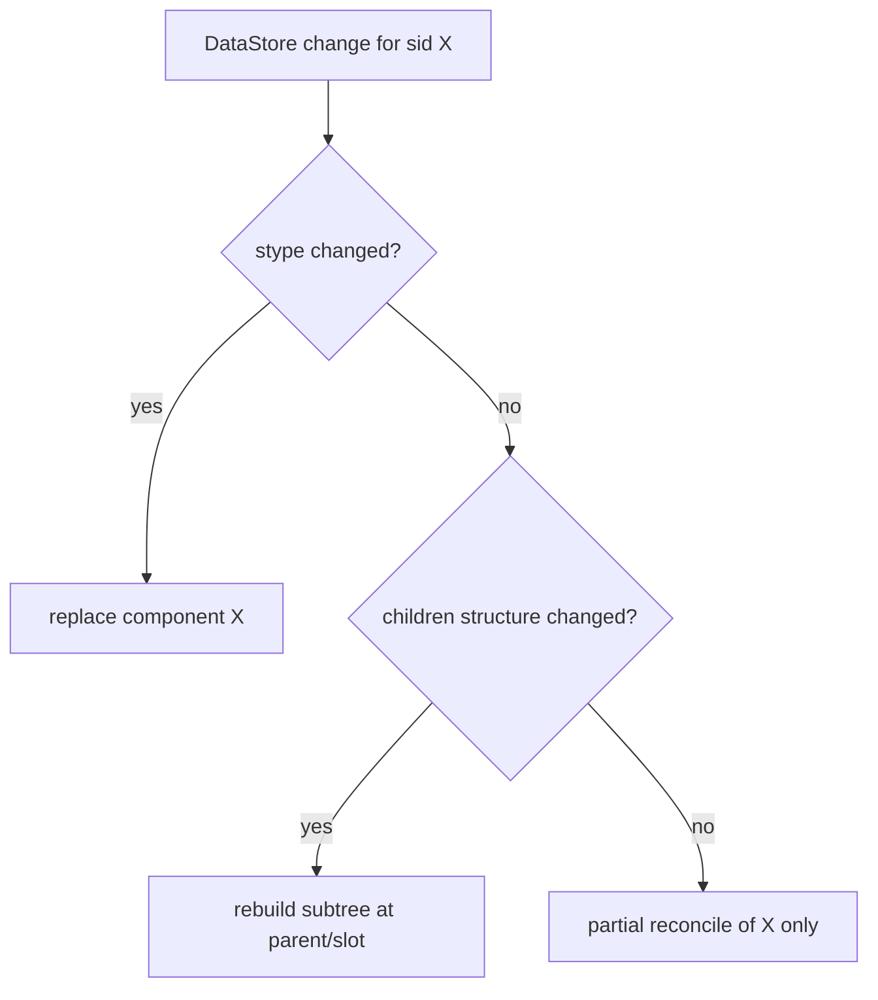
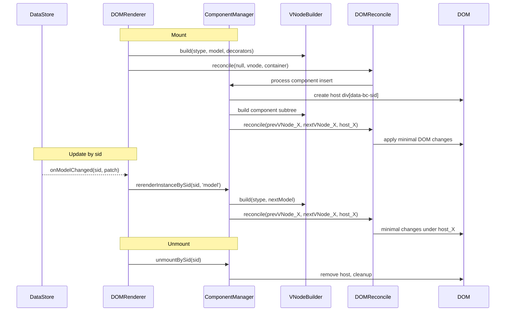
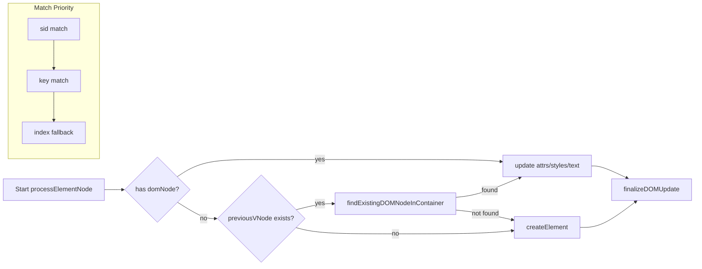
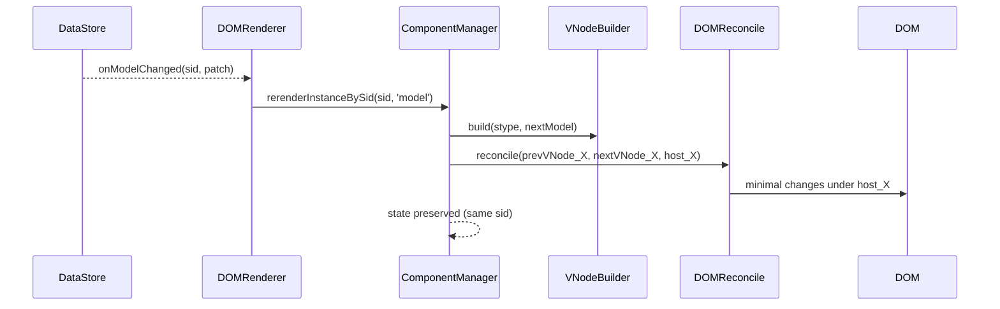
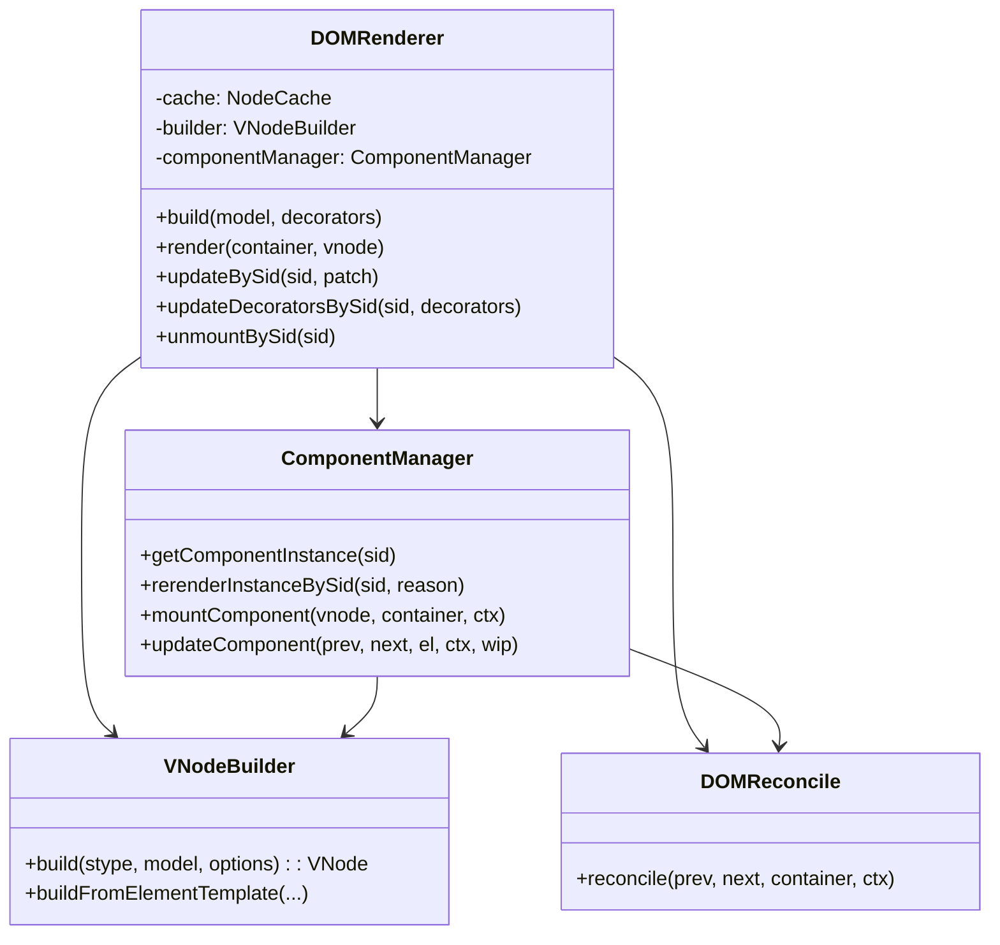
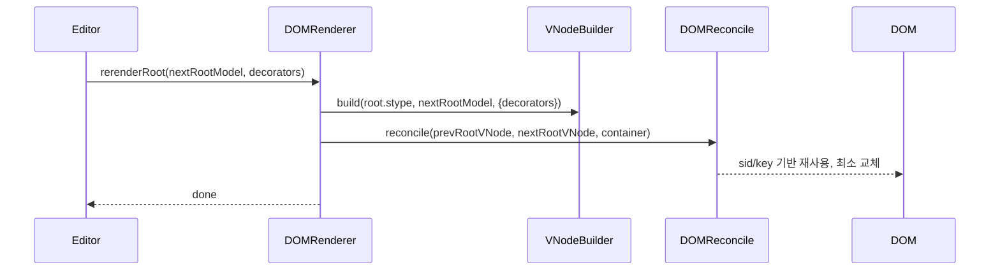
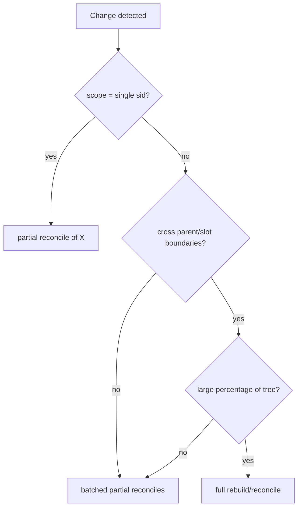
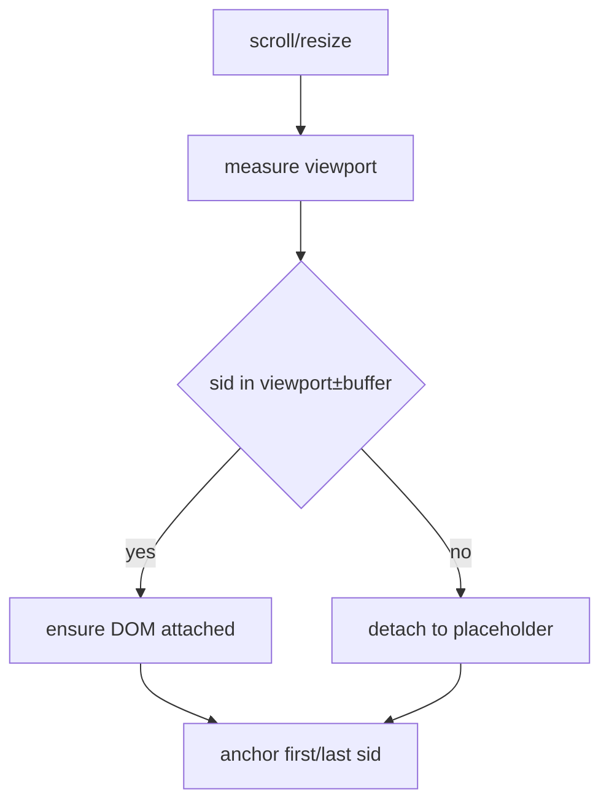
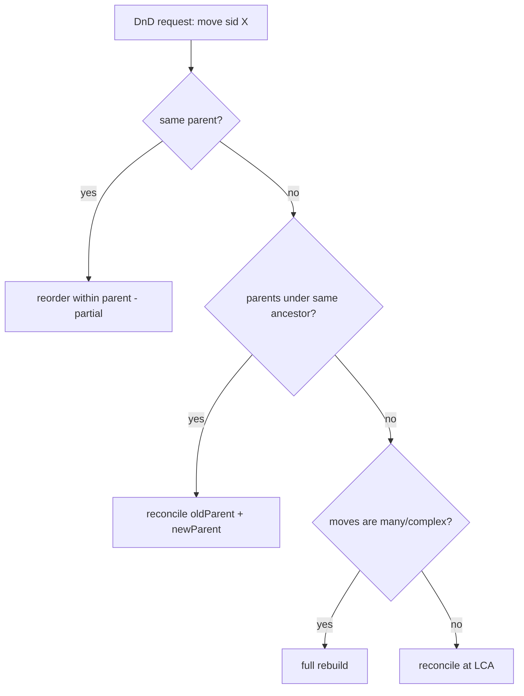

## SID-Driven Component Lifecycle and Reconciliation for the Editor

목표: 에디터 데이터 모델을 DOM에 정확하고 빠르게 반영한다. `renderer-dom`은 리액트 같은 범용 UI 프레임워크가 아니라, 에디터 모델 전용 렌더러다. 정체성(identity)과 상태(state)는 `sid`를 기준으로 한다.

### 핵심 원칙
- 컴포넌트 정체성: `sid`가 1순위. 동일 `sid`면 같은 컴포넌트 인스턴스다.
- 역할 식별: `stype`로 어떤 컴포넌트인지(템플릿/컴포넌트 이름) 식별한다.
- 상태 저장: 컴포넌트 인스턴스와 로컬 상태는 `sid`를 키로 저장·조회한다.
- 부분 갱신: DataStore에서 `sid`로 데이터/데코레이터 변경을 구독하고 해당 인스턴스만 갱신한다.
- DOM 표식: 루트/자식 모두 가능한 한 `data-bc-sid`를 DOM에 부착해 직접 탐색을 빠르게 한다.

### 데이터/상태/DOM 정합성
- `ComponentInstance.id = sid`
- `ComponentInstance`는 다음을 포함한다: `element(호스트)`, `props(순수 데이터)`, `model(원본)`, `decorators`, `state`, `mounted`
- `ComponentContext`는 전역 서비스 접근자 포함: `services = { editor, dataStore, selection, schema, decorators }`
- DOM에는 호스트 노드가 생성된다: `div[data-bc-sid][data-bc-stype=component][data-bc-component=<stype>]`

### 매칭 및 리콘실 규칙
우선순위: `sid` > `key` > 형제 내 인덱스
- 루트/자식 공통: 동일 `sid`면 같은 DOM/인스턴스 재사용. `stype`이 바뀌면 교체(replace).
- `key`는 `sid`가 없을 때만 사용. 둘 다 없으면 인덱스 기반.
- 자식 배열/슬롯: 아이템 `sid`를 최우선으로 매칭. 없는 경우 안정 키(`stype-index-slot`)를 부여.

### 라이프사이클 (에디터 전용)
1) Resolve
   - DataStore에서 `sid` → `model` 조회, `stype` 확인 → Registry에서 템플릿/컴포넌트 조회
   - 인스턴스 레지스트리 검토: `instances.get(sid)`

2) Mount
   - 호스트 생성 및 DOM 부착(한 번): `div[data-bc-sid][data-bc-stype=component][data-bc-component]`
   - `props = sanitize(model)`, `state = initState()`, `decorators` 적용 범위 산정
   - 템플릿 빌드 → DOM reconcile → `mounted = true`
   - 인스턴스 저장: `instances.set(sid, instance)`

3) Update
   - 트리 업데이트와 별개로 “sid-지정 업데이트”를 1급으로 지원:
     - 모델 변경: `updateBySid(sid, nextModel | patch)` → 인스턴스 컨텍스트로 재빌드/부분 리콘실
     - 데코레이터 변경: `updateDecoratorsBySid(sid, decorators)` → 텍스트/레이어/블록 범위만 재적용
   - 동일 `sid`면 상태(state) 보존, `stype` 변경 시 교체(replace) 처리

4) Unmount
   - DataStore/Decorator 구독 해제, DOM 제거, 인스턴스 삭제

### 전체 리빌드 vs 부분 리콘실 결정 기준
- 부분 리콘실(권장): 다음 조건을 모두 만족하면 컴포넌트 단위로만 갱신
  - 변경 범위가 특정 `sid`에 한정됨
  - `stype` 불변, 구조 변경 없음(슬롯/자식 수의 대폭 변경 아님)
  - 키 기반/정렬 변경이 부모 수준에서 필요하지 않음
- 전체 리빌드(트리 스코프): 다음 중 하나라도 참이면 상위 서브트리를 재빌드
  - `stype` 변경(컴포넌트 교체 필요)
  - 자식 구조의 큰 변동(대량 삽입/삭제, 정렬 스킵 불가)
  - 상위 슬록/포털 경계 교차 변경

### 의사결정 다이어그램



### 라이프사이클 시퀀스 (Mount/Update/Unmount)



### 공용 API (renderer-dom)
- `renderer.mount(container, rootModel, decorators?)`
- `renderer.updateBySid(sid, nextModelOrPatch)`
- `renderer.updateDecoratorsBySid(sid, decorators)`
- `renderer.unmountBySid(sid)`
- `renderer.getComponentInstance(sid)`

내부/매니저:
- `componentManager.rerenderInstanceBySid(sid, reason: 'model'|'decorator'|'state')`
- `componentManager.getComponentInstance(sid)`

### DOM/매칭 구현 포인트
- VNodeBuilder
  - 모든 빌드 경로에서 가능한 한 `attrs['data-bc-sid'] = sid`를 보존
  - 슬롯/배열 자식: 모든 아이템을 누적 추가. 누락/덮어쓰기 방지
- DOMProcessor / DOMOperations
  - `findExistingDOMNodeInContainer`에서 `sid` 우선 매칭
  - `finalizeDOMUpdate`에서 동일 부모 하위 `sid` 중복 시 이전 노드 제거(중복 방지)
- ChildrenReconciler
  - 매칭 우선순위에 `sid` 반영. `key`는 보조. 둘 다 없으면 인덱스

- DOM 매칭 플로우



### 상태 관리
- `initState()`는 1회만 수행, `setState()`는 로컬 리콘실을 트리거
- 동일 `sid` 업데이트에서는 상태 보존. `sid`가 바뀌면 새 인스턴스 생성

### DataStore 연동
- `dataStore.subscribe({ onModelChanged(sid, patch), onDecoratorsChanged(sid, decorators) })`
- 핸들러에서 `renderer.updateBySid(sid, patch)` 또는 `renderer.updateDecoratorsBySid(sid, decorators)` 호출

### 시퀀스 다이어그램 (부분 업데이트)



### Children/Slot 통합 플로우

```mermaid
flowchart TD
  A[ElementTemplate.children] --> B[_processChild]
  B -->|type=function| C[execute -> value]
  C --> D{array?}
  D -- yes --> E[for each item -> build]
  D -- no --> F{element/component/data}
  F -- element --> G[_buildElement]
  F -- component --> H[_buildComponent]
  F -- data(text) --> I[append text run]
  B -->|type=slot| J[_renderSlotGetChildren]
  J --> K[build(child.stype, child)]
  K --> L[ensure data-bc-sid]
  L --> M[orderedChildren.push]
  A --> N[flushTextParts]
  N --> O[vnode.children = orderedChildren]
```

### 아키텍처 개요



### 단계별 적용 계획
1) 타입/컨텍스트 확정
   - `ComponentInstance.id = sid`, `ComponentContext.services` 노출
2) 매칭 로직 반영
   - VNode/DOMProcessor/ChildrenReconciler에 `sid` 우선 매칭 적용
3) 부분 리콘실 API 추가
   - DOMRenderer: `updateBySid`, `updateDecoratorsBySid`, `unmountBySid`
   - ComponentManager: `rerenderInstanceBySid`
4) 슬롯/배열 자식 누락 버그 수정
   - `_renderSlotGetChildren`와 children 통합 경로 검증/수정(모든 아이템 누적)
5) 테스트 정렬
   - children/mixed/keys 테스트를 `sid` 우선 규칙에 맞게 수정
   - 부분 업데이트 API 테스트 추가

### 명확한 동작 보장 항목
- 동일 `sid`의 컴포넌트는 상태가 보존된다.
- `stype`이 변경되면 기존 컴포넌트는 언마운트되고 새 컴포넌트가 마운트된다.
- `updateBySid`는 해당 호스트 범위에서만 최소 DOM 변경을 수행한다.
- 슬롯/배열 자식은 모든 아이템이 DOM에 반영되며, `sid`가 있으면 재사용된다.

### 전체 업데이트(Full Rebuild/Reconcile) 관점

전역 변경(문서 리포맷, 대량 정렬, 대규모 스키마/플러그인 교체 등)에서는 루트 기준 전체 재빌드가 효율적일 수 있다. 이때도 `sid` 표식과 인스턴스 레지스트리를 활용해 가능한 DOM 재사용을 극대화한다.

- 사용 시점
  - 다수의 노드가 동시에 구조적으로 변경됨(여러 부모/슬롯 경계 교차)
  - 상위 레벨 레이아웃/스키마 변경으로 부분 갱신 경계 산정이 비효율적일 때
  - 초기 로드, 대규모 문서 붙여넣기/변환, 대량 데코레이터 재배치

- 전략
  - 루트 모델 스냅샷으로 VNode 전체 재빌드: `nextRootVNode = builder.build(root.stype, root, {decorators})`
  - `reconcile(prevRootVNode, nextRootVNode, container)` 수행
  - 매칭 우선순위는 동일: `sid > key > index` (트리 전역에서 동일)
  - 컴포넌트 인스턴스 매핑은 `sid` 기준으로 상태 보존 시도

- API 제안
  - `renderer.rerenderRoot(nextRootModel, decorators?)`
  - `renderer.reconcileRoot()` (마지막 모델/데코레이터 저장값으로 재실행)

- 트레이드오프
  - 장점: 경계 산정 비용이 0, 구현 단순. 전역 변화에 일관된 결과.
  - 단점: 변경 범위가 작을 때 불필요한 상위 트리 계산/비용 발생.
  - 완화: `sid`/`key` 유지로 실제 DOM 교체를 최소화(많은 노드가 "재사용"됨).

#### 전체 업데이트 시퀀스



#### 전체 vs 부분 업데이트 의사결정(확장)



### 에디터 렌더링 관점 추가 사항

- 뷰포트 기반 가상화(virtualization)
  - 정책: 화면 내 시야 + 버퍼(위/아래 Npx)만 실제 DOM 보유, 나머지는 placeholder
  - sid 유지: 비가시 영역에서도 인스턴스/상태는 보존, DOM만 탈착/재부착
  - 스크롤 앵커링: 가시 항목의 첫/마지막 `sid`를 앵커로 사용해 레이아웃 점프 방지

- 선택/커서 보존
  - SelectionManager와 통합: 리콘실 전후 `sid`-range로 앵커/포커스를 재계산
  - inline 텍스트 변환(마크/데코레이터 삽입) 시 텍스트 노드 기준이 아닌 run-range 기준 복원

- IME/조합 입력 안정성
  - 조합 중(CompositionEvent)에는 해당 `sid` 하위 텍스트 노드 리플로우 최소화
  - 조합 영역을 inline decorator(layer)로 표시하여 충돌 최소화

- 데코레이터 계층 정책
  - 계층 우선순위: inline > layer > block
  - 동일 영역 충돌 시 최신 타임스탬프 또는 우선순위 규칙으로 병행 표시 결정
  - 포인터 인터랙션은 layer에 위임, 본문 이벤트는 차단하지 않음(pass-through 옵션)

- 오버레이/포털 가이드
  - 툴팁/컨텍스트메뉴/드롭 프리뷰는 `PortalManager`로 body에 렌더
  - 스크롤/줌에 동기화: 앵커 `sid`의 bbox 추적 → 포털 위치 갱신(rAF)

- 스케줄링/우선순위
  - rAF 배치: 동일 프레임 내 다수 업데이트 코알레싱
  - 우선순위 큐: caret/selection > viewport 진입/이탈 > 데코레이터 > 나머지
  - 장시간 작업 분할: 긴 서브트리는 청크로 분할해 여러 프레임에 분산

- 오류 복구
  - 부분 리콘실 실패 시 해당 서브트리 rebuild, 반복 실패 시 상위 LCA로 승격
  - 렌더 오류 훅(onError)로 로깅/폴백 UI 삽입 지점 제공

- 관측/계측
  - 훅: onReconcileStart/End, onNodeBefore/After, 통계 카운터(삽입/갱신/이동/제거)
  - 장면 복잡도 지표: 가시 노드 수, 평균 depth, 마크/데코레이터 밀도

- 접근성(A11y)
  - 템플릿에서 semantic tag/role/aria 매핑 정책 문서화
  - 키보드 내비게이션: `sid` 순회/범위 확장 단축키와 DOM 포커스 동기화

- 보안
  - 데이터→DOM 바인딩 시 HTML 인젝션 금지(텍스트는 항상 이스케이프)
  - 신뢰 HTML은 명시적 API(whitelist)로만 주입, sanitizer 통과 필수

- 클립보드/직렬화 연계
  - 선택된 `sid` 범위를 스키마 준수 형태로 export/import
  - 붙여넣기 직후 해당 `sid` 범위를 부분 리콘실로 빠르게 피드백

#### 뷰포트 가상화 다이어그램



### 구현 순서와 최소 PoC 범위

1) SID-우선 매칭과 상태 보존
   - 구현: `DOMProcessor.findExistingDOMNodeInContainer`/`finalizeDOMUpdate`, ChildrenReconciler에 `sid > key > index` 우선순위 반영. 모든 빌드 경로에서 `data-bc-sid` 보존.
   - PoC: 단일 리스트에서 항목 텍스트 변경/재정렬 테스트 3건이 DOM 교체 없이 통과. 인스턴스 상태(`initState` 카운터) 유지 검증.

2) 부분 리콘실 API
   - 구현: `DOMRenderer.updateBySid(sid, patch|nextModel)`, `updateDecoratorsBySid(sid, decorators)`, `unmountBySid(sid)` 추가. `ComponentManager.rerenderInstanceBySid` 내부에서 호스트 단위 reconcile 호출.
   - PoC: 단일 단락의 텍스트/속성/데코레이터만 갱신되는 테스트 4건. 루트 다른 노드 DOM untouched 스냅샷 비교.

3) 이동 API (DnD 최소 단위)
   - 구현: `renderer.moveBySid(sid, newParentSid, targetIndex)` → oldParent와 newParent 서브트리 부분 리콘실(batch). 실패 시 LCA 확장.
   - PoC: 같은 부모 내 재정렬 2건, 부모 변경 2건. 상태 보존과 DOM 이동(insertBefore) 사용 여부 확인.

4) 슬롯/배열 자식 누락 수정
   - 구현: `_renderSlotGetChildren`/children 통합 경로에서 모든 아이템 누적 보장. sid 없는 경우 안정 키 부여.
   - PoC: slot('content') 배열에 1→2→1→0 개수 변화를 DOM에서 정확히 반영하는 테스트 4건.

5) 테스트 정렬 및 호스트 셀렉터 통일
   - 구현: 테스트에서 `div[data-bc-sid="..."]`를 호스트로 조회 후 내부 태그 검증 패턴 통일.
   - PoC: basic/children/mixed/keys가 sid-우선 규칙으로 통과(최소 실패 0).

6) 뷰포트 가상화(최소)
   - 구현: 가시 영역 ±버퍼 내 `sid`만 DOM 부착, 외부는 placeholder. 상태/인스턴스 보존.
   - PoC: 1,000 항목 리스트에서 60fps 근접 스크롤, DOM children 수가 화면 기준 상한 이내 유지.

7) 선택/커서 보존(최소)
   - 구현: reconcile 전후 SelectionManager로 `sid`-range 저장/복원. inline 변경에도 caret 점프 방지.
   - PoC: 단락 편집 중 데코레이터 토글/텍스트 삽입에서도 커서 위치 불변 테스트 2건.

8) 포털/오버레이(최소)
   - 구현: `PortalManager` 경유 body 렌더, 앵커 `sid` bbox 추적으로 위치 갱신.
   - PoC: 컨텍스트 메뉴 오픈/스크롤에서 올바른 위치 유지 2건.

9) 관측/계측 노출
   - 구현: Reconcile 통계, onReconcileStart/End 훅, 삽입/갱신/이동/제거 카운터.
   - PoC: 테스트 러너에서 통계 수집 후 임계값(regression guard) 확인.

성공 기준(초기):
- 부분 업데이트/이동/슬롯 테스트 무결(>95% 통과) 및 DOM 교체 최소화(assertions 포함)
- 1k 리스트 스크롤 중 프레임 드롭 없음(로컬 환경 기준), 가시 DOM 수 제한 유지
- 선택/IME 시나리오에서 커서 안정성 보장

#### WIP 전략(요약)

- per-sid 인덱스 맵 (frame-scoped)
  - `sid -> HTMLElement` (DOM 인덱스): 리콘실 시작 시 컨테이너에서 1회 스캔해 구축(`querySelectorAll('[data-bc-sid]')`).
  - `sid -> WIP` (WIP 인덱스): onWIPProcess 단계에서 sid가 있는 노드를 매 프레임 등록. 프레임 종료 시 폐기.
  - 매칭 우선: `sid`(DOM/WIP 인덱스) → key → index. 실패 시 기존 지역 탐색으로 폴백.
- replace 규칙
  - 동일 `sid` + `stype` 동일: DOM/인스턴스 재사용, 속성/텍스트만 갱신.
  - 동일 `sid` + `stype` 변경: 교체(replace). 기존 인스턴스 언마운트 → 새 인스턴스 마운트.
  - `sid` 충돌(동일 부모 하위 중복): 선점한 노드 외 중복 노드는 제거 후 삽입 정책.
- 플로우
  1) 리콘실 시작: `sidDomIndex` 구축 → WIP 매니저에 주입
  2) 빌드/프로세스: `findExistingDOMNodeInContainer`가 `sidDomIndex`/`sidWipIndex`를 1순위로 조회, WIP 생성 시 `sidWipIndex` 채움
  3) 실행 단계: `finalizeDOMUpdate`에서 교체/이동(insertBefore) 정책 적용, 중복 `sid` 정리
  4) 종료: 통계/훅(onReconcileEnd) 호출

#### 루트 WIP 처리(컴포넌트 내부 리콘실 포함)

- 컨테이너: 루트 리콘실은 상위에서 지정한 `container`(루트/호스트)를 대상으로 수행한다.
- 루트 생성 규칙: 루트 WIP에 `vnode.tag`가 있으면 반드시 신규/기존 element를 `container`의 자식으로 보유해야 한다.
  - `wip.domNode === container`로 잘못 매칭되면 강제 분기: element를 새로 생성하여 `container.appendChild(element)`.
  - 부모-자식 순서: 자식 finalize 전에 부모 domNode가 없으면 즉시 생성·부착 후 자식을 삽입한다.
- 텍스트 평탄화 방지: 부모에 `children`가 존재하는 경우 부모 `textContent`를 직접 쓰지 않는다(자식 생성 우선).

#### 진단 체크리스트(루트/슬롯 이슈 발생 시)

- onWIPProcess: 루트 WIP의 `vnode.tag`, `previousVNode`, `targetNode`/`domNode` 종류(엘리먼트/텍스트/컨테이너) 로그.
- finalizeDOMUpdate(루트 분기): append 전후 `container.innerHTML`, `wip.domNode.nodeType`, `tagName` 확인.
- 자식 finalize 시점: `wip.parent.domNode` 존재 여부, 없으면 부모 생성 경로 진입 여부 확인.

#### 부분 업데이트를 위한 스냅샷

- `DOMRenderer` 내부에 `sid -> lastVNode` 스냅샷 저장소를 유지한다.
- `render()` 완료 시 현재 트리를 순회해 스냅샷 맵을 갱신한다.
- 부분 API(`updateBySid`, `updateDecoratorsBySid`)는 대상 `sid`의 스냅샷을 기점으로 서브트리만 재빌드/리콘실한다.

### Drag & Drop 이동 관점 (sid 객체의 부모/슬롯 변경)

DnD로 특정 `sid` 노드를 다른 컨테이너로 옮길 때, 항상 루트 전체 업데이트가 필요하지는 않다. 보편적으로 다음 전략을 적용한다.

- 같은 부모 내 재정렬: 부분 리콘실
  - 대상: 동일 부모 서브트리 1곳
  - 동작: 형제 순서만 변경. `sid` 유지로 상태/DOM 최대 재사용

- 부모/슬롯 경계 이동: 국소 2점 부분 리콘실
  - 대상: 원 부모 서브트리(제거) + 새 부모 서브트리(삽입)
  - 동작: 원 위치에서 제거, 새 위치에 삽입. `sid` 유지로 상태 보존, DOM 이동(reuse) 시도
  - 실패/경합 시 상위 공통 조상(LCA) 단위로 확장 리콘실

- 전역 대량 이동/복잡한 교차: 루트 재빌드 고려
  - 다수의 노드가 여러 컨테이너 간 수차례 교차할 때 경계 산정 비용이 커지면 전체 경로가 유리

권장 API:
- `renderer.moveBySid(sid, newParentSid, targetIndex)`
  - 내부적으로: (1) oldParent 부분 리콘실, (2) newParent 부분 리콘실을 배치 실행
  - 에지: 부모/슬롯 미존재, 인덱스 범위 검사, LCA 확장 기준

DnD 의사결정 다이어그램:



상태 보존 규칙:
- `sid` 불변이면 로컬 상태는 이관/보존된다. 새 부모로 이동해도 동일 인스턴스로 간주.
- `stype`이 변경되면 교체(replace) 처리.

DOM 재사용 힌트:
- `DOMOperations.finalizeDOMUpdate`에서 기존 DOM 노드의 부모가 달라질 경우 제거→삽입이 아니라 `insertBefore`를 통해 이동을 우선 시도한다.

### 실시간/동시편집/AI 보강 사항

- 이벤트 코알레싱/배치
  - 동일 프레임 내 다수의 `sid` 업데이트는 한 번의 리콘실 주기로 배치
  - 동일 `sid`에 대한 연속 패치 병합(마지막 상태 기준)

- 우선순위
  - 커서/선택(decoration: layer/inline) > 시각적 안정성(스크롤 유지) > 나머지
  - 작은 텍스트 변경은 부분 리콘실, 대규모 구조 변경은 루트/서브트리 기준으로 승격

- 일관성/트랜잭션
  - 동일 트랜잭션 ID로 묶인 변경은 하나의 리콘실 사이클에서 처리
  - 실패 시 롤백 또는 보정(rebuild 해당 서브트리)

- 충돌 처리(동시편집)
  - CRDT/OT 상위에서 병합된 결과 모델만 입력으로 받는다
  - 동일 `sid` 경합 시 가장 최신 스냅샷으로 재빌드, 상태는 `sid` 기준 보존

- 성능 계측
  - `DOMReconcile` 통계(삽입/갱신/이동/제거 수) 노출
  - 프레임 별 평균/최대 시간 기록으로 튜닝 근거 확보

### VNode-DOM 1:1 매칭 원칙

**핵심 목표**: DSL → build → VNode가 나오면, 각 VNode는 실제 DOM element와 1:1로 매칭되어 렌더링을 단순화한다.

#### 기본 원칙

1. **VNode는 DOM의 직접적인 표현**
   - VNode는 DOM element의 구조를 정확히 반영한다
   - VNode.children = DOM.children의 1:1 대응
   - VNode.attrs = DOM attributes의 직접 매핑
   - VNode.text = DOM textContent의 직접 매핑

2. **sid 기반 정체성 보장**
   - `sid`가 있으면 `data-bc-sid`로 DOM에 표식
   - 같은 `sid` = 같은 DOM element = 같은 VNode 정체성
   - VNode와 DOM의 매칭은 `sid`를 통해 즉시 수행

3. **단순한 재귀적 reconcile**
   - WIP(Work In Progress) 트리 없이 VNode 트리를 직접 순회
   - sid 인덱스 맵으로 DOM 즉시 찾기
   - 재귀 함수로 직관적 처리

#### Reconcile 알고리즘 설계

```typescript
// sid 기반 인덱스 맵 (프레임 단위)
class SidIndex {
  private sidToDOM = new Map<string, HTMLElement>();
  
  // 리콘실 시작 시 1회 스캔
  build(container: HTMLElement) {
    this.clear();
    container.querySelectorAll('[data-bc-sid]').forEach(el => {
      const sid = el.getAttribute('data-bc-sid');
      if (sid) this.sidToDOM.set(sid, el as HTMLElement);
    });
  }
  
  getDOM(sid: string): HTMLElement | null {
    return this.sidToDOM.get(sid) || null;
  }
  
  set(sid: string, dom: HTMLElement): void {
    this.sidToDOM.set(sid, dom);
  }
  
  delete(sid: string): void {
    this.sidToDOM.delete(sid);
  }
  
  clear(): void {
    this.sidToDOM.clear();
  }
}

// 단순한 재귀적 reconcile
function reconcile(
  prevVNode: VNode | null,
  nextVNode: VNode,
  container: HTMLElement,
  sidIndex: SidIndex,
  context: ReconcileContext
): HTMLElement {
  const sid = nextVNode.attrs?.['data-bc-sid'];
  
  // 1. DOM 찾기 (sid 우선)
  let domNode = sid ? sidIndex.getDOM(sid) : null;
  
  // 2. 매칭 및 처리
  if (prevVNode && domNode) {
    // 같은 요소 재사용 - 업데이트만
    updateDOMNode(domNode, prevVNode, nextVNode);
  } else if (domNode && prevVNode) {
    // sid는 있지만 prevVNode가 다름 - 교체
    domNode = replaceDOMNode(domNode, nextVNode, container);
  } else if (!domNode && prevVNode) {
    // prevVNode는 있지만 DOM이 없음 - 새로 생성
    domNode = createDOMNode(nextVNode, container);
    if (sid) sidIndex.set(sid, domNode);
  } else {
    // 완전히 새로 생성
    domNode = createDOMNode(nextVNode, container);
    if (sid) sidIndex.set(sid, domNode);
  }
  
  // 3. 자식 처리 (재귀)
  if (nextVNode.children && Array.isArray(nextVNode.children)) {
    reconcileChildren(
      prevVNode?.children || [],
      nextVNode.children,
      domNode,
      sidIndex,
      context
    );
  }
  
  return domNode;
}

// 자식 reconcile
function reconcileChildren(
  prevChildren: VNode[],
  nextChildren: VNode[],
  parentDOM: HTMLElement,
  sidIndex: SidIndex,
  context: ReconcileContext
) {
  // 매칭: sid > key > index
  const matched = new Set<number>();
  const nextDOMChildren: HTMLElement[] = [];
  
  for (let i = 0; i < nextChildren.length; i++) {
    const nextChild = nextChildren[i];
    if (!nextChild || typeof nextChild !== 'object') continue;
    
    // 1. sid로 매칭
    const nextSid = (nextChild.attrs as any)?.['data-bc-sid'];
    let prevChild: VNode | null = null;
    let prevIndex = -1;
    
    if (nextSid) {
      prevIndex = prevChildren.findIndex(c => 
        c && (c.attrs as any)?.['data-bc-sid'] === nextSid
      );
      if (prevIndex >= 0) {
        prevChild = prevChildren[prevIndex];
        matched.add(prevIndex);
      }
    }
    
    // 2. key로 매칭 (sid가 없을 때만)
    if (!prevChild && (nextChild as any).key) {
      prevIndex = prevChildren.findIndex(c => 
        c && (c as any).key === (nextChild as any).key
      );
      if (prevIndex >= 0) {
        prevChild = prevChildren[prevIndex];
        matched.add(prevIndex);
      }
    }
    
    // 3. index로 매칭 (sid/key가 없을 때만)
    if (!prevChild && prevChildren[i] && 
        (prevChildren[i] as VNode).tag === nextChild.tag) {
      prevIndex = i;
      prevChild = prevChildren[i] as VNode;
      matched.add(i);
    }
    
    // 재귀 reconcile
    const childDOM = reconcile(
      prevChild,
      nextChild,
      parentDOM,
      sidIndex,
      context
    );
    nextDOMChildren.push(childDOM);
  }
  
  // 4. 제거되지 않은 이전 자식 제거
  for (let i = 0; i < prevChildren.length; i++) {
    if (!matched.has(i)) {
      const prevChild = prevChildren[i];
      if (prevChild && typeof prevChild === 'object') {
        const prevSid = (prevChild.attrs as any)?.['data-bc-sid'];
        const domToRemove = prevSid ? sidIndex.getDOM(prevSid) : null;
        if (domToRemove && domToRemove.parentNode === parentDOM) {
          parentDOM.removeChild(domToRemove);
          if (prevSid) sidIndex.delete(prevSid);
        }
      }
    }
  }
  
  // 5. DOM 순서 정리 (insertBefore로 올바른 위치에 배치)
  let currentDOMIndex = 0;
  for (const nextDOM of nextDOMChildren) {
    const existingIndex = Array.from(parentDOM.children).indexOf(nextDOM);
    if (existingIndex !== currentDOMIndex) {
      // 올바른 위치로 이동
      const referenceNode = parentDOM.children[currentDOMIndex] || null;
      parentDOM.insertBefore(nextDOM, referenceNode);
    }
    currentDOMIndex++;
  }
}
```

#### WIP 없이 단순화한 이유

**기존 WIP 방식의 문제점:**
- VNode → WIP 트리 변환 비용
- WIP → DOM 변환 과정의 복잡성
- 디버깅 어려움 (여러 단계 변환)

**새로운 접근의 장점:**
1. **직접적 매칭**: VNode와 DOM이 1:1로 대응되어 매칭이 명확
2. **sid 인덱스 맵**: O(1) DOM 조회로 성능 최적화
3. **단순한 재귀**: 복잡한 변환 없이 직관적인 알고리즘
4. **디버깅 용이**: VNode → DOM 변환이 한 단계로 명확

#### 매칭 우선순위 (VNode-DOM 직접 매칭)

```
1. sid 매칭 (최우선)
   - nextVNode.attrs['data-bc-sid'] → sidIndex.getDOM(sid)
   - 같은 sid = 같은 DOM element = 재사용

2. key 매칭 (sid 없을 때만)
   - nextVNode.key → prevChildren에서 같은 key 찾기
   - 같은 key = 같은 DOM element = 재사용

3. index 매칭 (sid/key 없을 때만)
   - 같은 인덱스 + 같은 tag = 같은 DOM element = 재사용
```

#### VNode-DOM 정합성 보장

**VNode 구조 = DOM 구조**
- `VNode.tag` → `HTMLElement.tagName.toLowerCase()`
- `VNode.attrs` → `HTMLElement.attributes`
- `VNode.children` → `HTMLElement.children` (1:1 순서 대응)
- `VNode.text` → `HTMLElement.textContent` (children 없을 때만)

**sid 기반 정체성 보존**
- VNode에 `sid`가 있으면 DOM에도 `data-bc-sid` 부착
- 같은 `sid`로 매칭하여 DOM 재사용
- Component 인스턴스도 `sid`로 관리하여 상태 보존

#### 구현 단계

1. **SidIndex 클래스 구현**
   - `build(container)`: 리콘실 시작 시 DOM 스캔
   - `getDOM(sid)`: O(1) DOM 조회
   - `set(sid, dom)`: 매칭 후 인덱스 업데이트

2. **단순 reconcile 함수 구현**
   - VNode 트리를 직접 재귀 순회
   - sid 기반 DOM 찾기
   - 업데이트/생성/제거 처리

3. **자식 매칭 로직 구현**
   - sid > key > index 우선순위
   - 매칭된 자식만 재사용, 나머지 제거

4. **DOM 순서 정리**
   - insertBefore로 올바른 순서 보장
   - 중복 sid 정리

#### 성능 최적화

- **sid 인덱스 맵**: O(1) DOM 조회 (기존: O(n) 탐색)
- **프레임 단위 인덱스**: 매 프레임 1회 스캔만 수행
- **재귀 호출 최소화**: 매칭된 노드만 처리

#### 테스트 검증 포인트

## 통합 Reconciler 설계 초안 (VNodeBuilder + Reconciler 일원화)

### 목표
- 하나의 Reconciler가 컴포넌트 실행 → 템플릿(ElementTemplate) 생성 → VNode 구성 → DOM 반영을 단일 루프에서 수행한다.
- sid 기반으로 DOM element와 Component state를 일관 관리한다.
- slot('content') 등 동적 children은 Reconcile 도중에 재귀적으로 build하여 누락 없이 DOM에 반영한다.

### 핵심 개념
- 정의 API
  - `define('stype', element(...))`: 엘리먼트 템플릿 엔진 등록
  - `define('stype', { component(props, ctx) { ... } })`: 함수형 컴포넌트 등록
  - `defineState('stype', StateClass)`: sid별 상태 확장(선택) 등록
- 컨텍스트 구성
  - `ctx = { id: sid, state, props, model, registry, setState, getState, initState }`
  - state는 `ComponentManager`가 `sid` 기준으로 관리하며, `defineState()`가 등록된 경우 해당 클래스를 사용한다.
- DOM 호스트 원칙
  - 호스트는 실제 컴포넌트 루트 엘리먼트이다. wrapper 금지.
  - 호스트에는 최소 `data-bc-sid`, 가능하면 `data-bc-stype`/`data-bc-component`를 부착한다.

### 통합 Reconcile 알고리즘(요약)
1) 입력: `stype`, `model`, `decorators?` → 루트 VNode 1개 또는 바로 컴포넌트 실행
2) 컴포넌트 실행
   - 레지스트리에서 `stype`에 해당하는 엔진을 조회한다.
   - 함수형인 경우 `engine(props, ctx)` 실행 → ElementTemplate 획득
   - 엘리먼트 템플릿인 경우 그대로 사용
3) 템플릿 → VNode 구성
   - attributes/style/data/children/slot 해석
   - children에 `slot('content')`가 있으면, 해당 slot 데이터 배열을 순회하며 각 아이템을 다시 2)~3) 경로로 빌드한다(재귀)
   - 모든 child VNode에 대해 가능한 한 `data-bc-sid`를 보존/부여한다
4) VNode → DOM 반영
   - `sid > key > index` 우선으로 DOM 매칭/재사용
   - attrs/style 업데이트, 텍스트/자식 재귀 반영
   - 제거되지 않은 이전 자식은 정리, 최종 순서는 `VNode.children`와 동일
5) 상태/스냅샷 갱신
   - `ComponentManager`는 `sid` 키로 인스턴스/상태를 저장
   - Reconcile 종료 시 `sid → lastVNode` 스냅샷을 저장해 부분 업데이트에서 활용

### slot('content') 처리 규칙
- slot은 Reconcile 중간 단계에서 해석된다.
  - 예: `define('paragraph', element('p', [slot('content')]))`
  - `model.content`가 배열이면 각 아이템을 다시 컴포넌트 실행 → 템플릿 → VNode → DOM 반영으로 재귀 처리한다.
- 아이템이 문자열/숫자이면 텍스트 노드로, 객체이면 `item.stype || item.type`을 사용해 엔진을 찾아 재귀 빌드한다.
- 모든 slot 아이템에 대해 `sid`를 우선 보존한다. 없으면 안정 sid(`stype-index-slot`)를 부여한다.

### 컴포넌트 상태 확장(defineState)
- `defineState('stype', StateClass)`로 `stype`별 상태 클래스를 등록한다.
- `ComponentManager`는 `sid` 최초 마운트 시 해당 클래스를 인스턴스화 후 인스턴스 맵에 저장한다.
- `ctx.initState`, `ctx.setState`, `ctx.getState`는 이 인스턴스에 위임하고, `sid` 기준 부분 리콘실을 트리거한다.

### 부분 업데이트 API와의 연계
- `renderer.updateBySid(sid, nextModelOrPatch)`
  - 스냅샷 또는 인스턴스의 `stype`을 확인하고, 컴포넌트 실행 → 템플릿 → VNode 구성 후 해당 호스트 하위만 리콘실한다.
  - 텍스트/데코레이터 변경 등 작은 변화는 최소 DOM 변경으로 처리한다.

### 불변 원칙(중요)
- wrapper 금지: 임의의 hostTag 삽입/교체는 허용하지 않는다. 템플릿에서 반환된 엘리먼트를 그대로 호스트로 사용한다.
- sid 1급: 동일 sid는 동일 DOM/상태로 재사용한다. `stype` 변경 시 교체 처리한다.
- VNode-DOM 1:1: VNode 구조와 DOM 구조는 가능한 한 1:1 대응을 유지한다.

### PoC 체크리스트(최소)
- 리스트/슬롯: 0→100→0 자식 변화에 대해 누락 없이 DOM에 반영된다.
- 다중 중첩: level1→level2→level3(텍스트) 구조가 모두 DOM에 실체화된다.
- 부분 갱신: 특정 `sid` 텍스트만 변경해도 형제 DOM은 untouched.

1. **1:1 매칭 검증**
   - VNode.children.length === DOM.children.length
   - VNode 순서 = DOM 순서

2. **sid 기반 재사용 검증**
   - 같은 sid로 재렌더링 시 같은 DOM element 재사용
   - textContent/attributes만 업데이트

3. **자식 매칭 검증**
   - sid 우선 매칭 정확성
   - key/index 폴백 동작 확인

