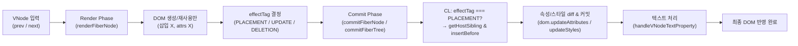
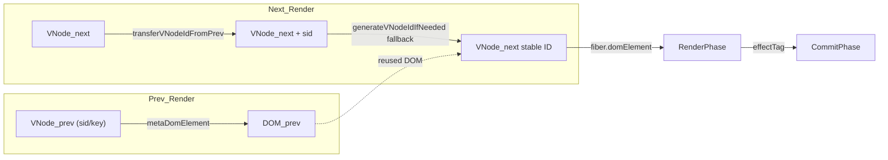
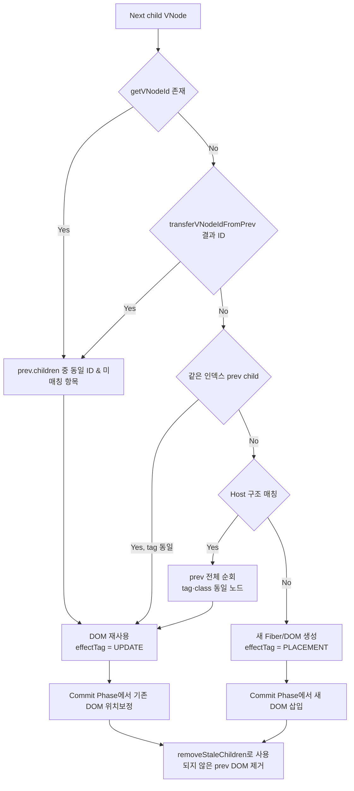
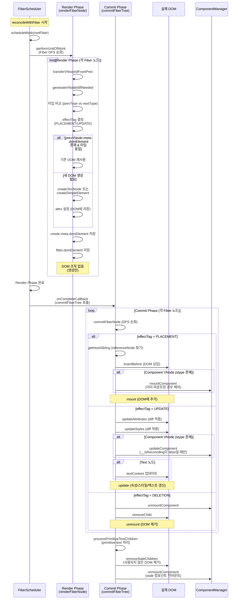

# React-style Reconciliation 요약

## 1. 전체 흐름

| 단계 | Render Phase (`renderFiberNode`) | Commit Phase (`commitFiberNode`) | 결과 |
| --- | --- | --- | --- |
| DOM 준비 | Fiber 트리를 순회하며 Text/Host DOM **생성만** 수행 (부모에 삽입하지 않음) | effectTag(PLACEMENT/UPDATE/DELETION)에 따라 실제 DOM 삽입/재배치/제거 | React `completeWork` + `commitMutationEffects`와 동일 |
| 순서 결정 | Fiber child/sibling 링크만 구성 | `getHostSibling`으로 다음 형제 DOM 찾은 뒤 `insertBefore` | DOM 순서 안정 |
| 속성/스타일 | 설정하지 않음 | `dom.updateAttributes` / `dom.updateStyles`가 diff를 계산해 Insert/Update/Delete 수행 | React `commitUpdate`와 동일 |
| 텍스트 | Text node 생성만 | `handleVNodeTextProperty`가 최종 텍스트 커밋 | Text-only VNode 처리 |

## 1-1. 단계별 다이어그램 (Mermaid)



## 1-2. VNode 비교/ID 전파 흐름



- `transferVNodeIdFromPrev`: 이전 VNode의 sid/key를 새 VNode로 복사해 동일 개체임을 표시.
- `generateVNodeIdIfNeeded`: sid/key가 없으면 컴포넌트(stype) → ComponentManager, 일반 Host → `tag-index` 기반 auto ID 생성 (DOM에는 노출되지 않음).
- `fiber.domElement`가 prev DOM을 가리키게 되어 Commit Phase에서도 같은 DOM을 재사용할 수 있음.

## 2. Render Phase 상세

```typescript
if (prevVNode?.meta?.domElement) {
  domElement = prevVNode.meta.domElement;
} else if (vnode.tag === '#text') {
  domElement = document.createTextNode(vnode.text);
} else if (vnode.tag) {
  domElement = dom.createSimpleElement(vnode.tag);
  if (vnode.sid && !isAutoGeneratedSid(vnode)) {
    dom.setAttribute(domElement, 'data-bc-sid', vnode.sid);
  }
  if (vnode.attrs) {
    for (const [key, value] of Object.entries(vnode.attrs)) {
      dom.setAttribute(domElement, key, String(value));
    }
  }
}
vnode.meta.domElement = domElement;
fiber.domElement = domElement;
```

- DOM 생성 후 `vnode.meta.domElement`/`fiber.domElement`에 저장.
- 부모에 삽입하거나 속성을 diff하지 않음.
- Portal도 별도 FiberScheduler로 동일 흐름 수행.

## 3. Commit Phase 상세

```typescript
if (fiber.effectTag === 'PLACEMENT') {
  const parent = fiber.parentFiber?.domElement ?? fiber.parent;
  let before = getHostSibling(fiber);
  if (before && before.parentNode !== parent) before = null;
  parent.insertBefore(domElement, before);
}

if (domElement instanceof HTMLElement) {
  dom.updateAttributes(domElement, prevVNode?.attrs, vnode.attrs);
  dom.updateStyles(domElement, prevVNode?.style, vnode.style);
}

if (domElement instanceof HTMLElement && vnode.text && !vnode.children) {
  handleVNodeTextProperty(domElement, vnode, prevVNode);
}
```

- **삽입**: Render Phase에서 준비된 DOM을 commit 시점에만 `insertBefore`.
- **속성/스타일**: React와 동일하게 diff → 부족분 삭제, 새 값 적용.
- **Deletion**: `prevVNode.meta.domElement` 기반으로 DOM 제거 + component unmount.

## 4. `getHostSibling` (React 알고리즘)

```typescript
let sibling = fiber.sibling;
while (sibling) {
  if (sibling.domElement) return sibling.domElement;
  if (sibling.child) {
    let child = sibling.child;
    while (child) {
      if (child.domElement) return child.domElement;
      child = child.child;
    }
  }
  sibling = sibling.sibling;
}
return null;
```

- Render Phase에서 `domElement`를 미리 세팅했기 때문에 commit에서 바로 reference node 확보 가능.
- reference node가 부모의 child가 아니면 `null`로 강등 → React와 동일한 append 동작.

## 5. 속성/스타일 Insert / Update / Delete

### `dom.updateAttributes`
- Prev attrs에 있지만 next attrs에 없는 키 → `removeAttributeWithNamespace`로 삭제.
- next 값이 `undefined/null` → 삭제로 간주.
- 나머지는 namespace-aware `setAttributeWithNamespace` 호출.

### `dom.updateStyles`
- Prev 스타일에 있지만 next에 없는 키 → `style.removeProperty`.
- next 값이 `undefined/null` → `removeProperty`.
- 나머지는 `style.setProperty`로 업데이트.

## 6. 텍스트 처리

- Text VNode는 Render Phase에서 `Text` 노드만 생성.
- Commit Phase에서 `handleTextOnlyVNode` / `handleVNodeTextProperty`가 최종 텍스트 커밋 및 위치 이동을 담당.

## 7. Deletion 흐름

- `effectTag === 'DELETION'` → `prevVNode.meta.domElement`를 parent에서 제거.
- Component VNode이면 `components.unmountComponent` 호출 후 DOM 제거.

## 8. React와의 대조표

| React 개념 | 현재 구현 |
| --- | --- |
| Fiber Render (`beginWork`/`completeWork`) | `renderFiberNode` (DOM 생성만) |
| Effect flags | `fiber.effectTag` (PLACEMENT/UPDATE/DELETION) |
| Effect list traversal | `commitFiberTree` (child→sibling DFS) |
| `commitPlacement` | `insertBefore` + `getHostSibling` |
| `commitUpdate` (attrs/styles) | `dom.updateAttributes` / `dom.updateStyles` |
| `getHostSibling` | 동일 알고리즘 |
| namespace-aware attributes | `setAttributeWithNamespace` / `removeAttributeWithNamespace` |

> 결론: Render Phase에서 DOM을 준비하고, Commit Phase에서 삽입/속성/스타일/텍스트/삭제를 수행하는 React 흐름을 그대로 재현했습니다.

## 9. Child Matching Matrix

Fiber 생성 시 prev/next VNode 자식 매칭은 아래 우선순위로 진행된다. 각 단계에서 매칭되면 DOM을 재사용하고 `effectTag = 'UPDATE'`, 끝까지 매칭되지 않으면 새 DOM을 만들고 `effectTag = 'PLACEMENT'`가 된다. 매칭에 실패한 prev VNode는 Commit Phase에서 `removeStaleChildren`이 제거한다.

| 우선순위 | 조건 | 매칭 기준 | 결과 |
| --- | --- | --- | --- |
| 1 | `getVNodeId(childVNode)`가 truthy (`sid`, `key`, `data-decorator-sid` 등) | `prevVNode.children` 중 동일 ID, 아직 매칭되지 않은 항목 검색 | DOM/컴포넌트 완전 재사용. 위치가 달라도 현재 인덱스로 이동. |
| 2 | 명시 ID 없음, `transferVNodeIdFromPrev`가 stype 기반 ID를 부여 | prev 자식의 `stype`이 같고 ID가 있는 경우 ID를 복사 → 1단계와 동일하게 동작 | 컴포넌트/Decorator가 명시 ID 없이도 안정적으로 재사용됨. |
| 3 | ID 없음, 같은 인덱스에 prev 자식 존재 | `prev.children[i]`의 `tag`와 현재 `tag`가 같거나 둘 다 텍스트 (`#text`) | 동일 타입일 때만 DOM 재사용. 타입이 다르면 매칭 실패. |
| 4 | ID/인덱스 매칭 실패, 둘 다 Host VNode | prev children 전체를 순회하며 `tag` + 클래스 조합이 같은 항목 탐색 (이미 매칭된 VNode 제외) | mark/decorator wrapper처럼 ID가 없는 Host 노드도 안정적으로 재사용. |
| 5 | 어느 조건에도 해당하지 않음 | 매칭 실패로 간주 | Render Phase에서 새 DOM 생성, Commit Phase에서 기존 DOM 제거 후 삽입. |

추가 규칙:
- 텍스트 자식은 `tag: '#text'`로 통일해 3단계에서 타입 검사가 일관적으로 동작한다.
- `generateVNodeIdIfNeeded`가 Host/Text VNode에 `tag-index` 기반 auto ID를 부여해 동일 구조가 반복될 때도 매칭이 안정적이다.
- Render Phase는 매칭 결과만 계산하고 DOM 이동/삭제는 하지 않는다. Commit Phase에서 `commitFiberTree`가 effectTag에 따라 DOM을 삽입·업데이트·삭제하고, 마지막에 `removeStaleChildren`/`processPrimitiveTextChildren`가 남은 동기화를 수행한다.

## 10. Matching Flow Diagram



위 다이어그램은 Render Phase와 Commit Phase 간의 역할 분리를 시각화한다. Render Phase는 매칭 경로를 결정하고 `fiber.effectTag`만 설정하며, Commit Phase는 `effectTag`에 따라 DOM을 삽입하거나 재배치한 뒤 남은 prev DOM을 안전하게 제거한다.

## 11. Mount / Update / Unmount Timing

Render Phase에서는 오직 diff 계산과 `effectTag` 지정만 수행하고 어떤 DOM 조작도 하지 않는다. Mount, Update, Unmount는 모두 Commit Phase에서 effectTag별로 처리된다.

| effectTag | 시점 | 실행 함수 | 수행 작업 |
| --- | --- | --- | --- |
| `PLACEMENT` | Commit Phase의 `commitFiberNode` → `commitPlacement` 구간 | `insertBefore` + `getHostSibling`, `components.mountComponent` (stype 존재 시) | 새 DOM 삽입, decorator/portal 포함, 컴포넌트 마운트 |
| `UPDATE` | Commit Phase의 `commitFiberNode` 본문 | `dom.updateAttributes`, `dom.updateStyles`, 텍스트 갱신, `components.updateComponent` (stype 존재 시), 자식 Fiber parent 갱신 | 기존 DOM 유지한 채 속성·스타일·텍스트 diff 반영, 컴포넌트 업데이트 |
| `DELETION` | Commit Phase의 `commitFiberNode` (vnode 없음) + 부모 `removeStaleChildren` | `components.unmountComponent`, `removeChild` | prev DOM 제거 및 컴포넌트 언마운트, primitive text 포함 |

### 11-1. Lifecycle Diagram



위 시퀀스는 FiberScheduler가 Render Phase를 스케줄링하고, Render Phase가 effectTag만 계산하며, Commit Phase가 mount/update/unmount를 실제 DOM에 적용하는 전체 흐름을 보여준다.

**주요 포인트:**
- **FiberScheduler**: `reconcileWithFiber`에서 생성되어 Render Phase를 비동기로 스케줄링 (테스트 환경에서는 동기 모드)
- **Render Phase**: DOM 생성만 수행하고 삽입/수정은 하지 않음. `mountComponent`/`updateComponent`는 호출하지 않음
- **Commit Phase**: effectTag에 따라 실제 DOM 조작 수행. `mountComponent`/`updateComponent`/`unmountComponent` 호출

### 11-2. Component Lifecycle

Fiber reconciler에서 컴포넌트 라이프사이클은 Commit Phase에서 처리된다:

**`mountComponent` 호출 시점:**
- `commitFiberNode`의 `PLACEMENT` 구간에서 DOM 삽입 후
- `vnode.stype`이 있고, 이미 마운트되지 않은 경우에만 호출
- 이미 마운트된 컴포넌트(`instance.mounted === true` 또는 `instance.element === domElement`)는 호출하지 않음

**`updateComponent` 호출 시점:**
- `commitFiberNode`의 `UPDATE` 구간에서 속성/스타일 업데이트 후
- `vnode.stype`이 있고, `__isReconciling` 플래그가 `false`일 때만 호출 (무한 루프 방지)
- 호출 시 전달되는 변경 사항:
  ```typescript
  components.updateComponent(prevVNode, nextVNode, host, context);
  // 내부에서 다음 항목들이 업데이트됨:
  // - instance.props = nextSanitizedProps (prevVNode.props와 diff)
  // - instance.model = nextModelData (prevVNode.model과 diff)
  // - instance.decorators = nextDecorators (prevVNode.decorators와 diff)
  // - instance.vnode = nextVNode
  // - component.update(host, prevVNode.props, nextVNode.props) (props 변경 시)
  ```

**`unmountComponent` 호출 시점:**
- `commitFiberNode`에서 `effectTag === 'DELETION'`일 때
- `removeStaleChildren`에서 사용되지 않은 컴포넌트 제거 시

