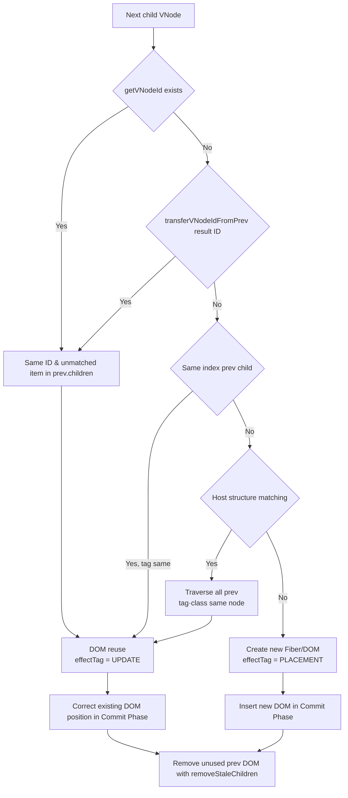

# renderer-dom Specification Document

This document is the technical specification for the `@barocss/renderer-dom` package. Implementation and testing are based on this document.


## Table of Contents

1. [Architecture Overview](#1-architecture-overview)
2. [DSL Rules](#2-dsl-rules)
3. [VNode Structure](#3-vnode-structure)
4. [Reconciliation: Render Phase](#4-reconciliation-render-phase)
5. [Reconciliation: Commit Phase](#5-reconciliation-commit-phase)
6. [VNode Matching Algorithm](#6-vnode-matching-algorithm)
7. [Data Attribute Processing](#7-data-attribute-processing)
8. [Marks and Decorators](#8-marks-and-decorators)
9. [Component State Management](#9-component-state-management)
10. [Portal](#10-portal)
11. [skipNodes Feature](#11-skipnodes-feature)
12. [Logging System](#12-logging-system)
13. [Constant Definitions](#13-constant-definitions)
14. [Error Handling](#14-error-handling)
15. [Performance Requirements](#15-performance-requirements)
16. [Testing/Validation Principles](#16-testingvalidation-principles)
17. [Prohibited Practices](#17-prohibited-practices)

---

## 1. Architecture Overview

### 1.1 Rendering Pipeline

```
ModelData → VNodeBuilder → VNode Tree → Fiber Reconciliation → DOM
                                    ↓
                            Render Phase (change calculation)
                                    ↓
                            Commit Phase (DOM application)
```

1. **VNodeBuilder**: Converts model data into a pure VNode tree
2. **Fiber Reconciliation**: React-style two-phase reconciliation
   - **Render Phase**: Compares previous VNode and new VNode to calculate changes (no DOM manipulation)
   - **Commit Phase**: Applies calculated changes to actual DOM
3. **ComponentManager**: Globally manages component instances and state based on `sid`

### 1.2 React-style Fiber Reconciliation

renderer-dom uses two-phase reconciliation based on React's Fiber architecture.

#### Render Phase (Change Calculation)

**Purpose**: Only calculates changes, no DOM manipulation

**Tasks:**
- VNode comparison (prevVNode vs nextVNode)
- effectTag setting (`EffectTag.PLACEMENT`, `EffectTag.UPDATE`, `EffectTag.DELETION`)
- DOM element creation/reference (not inserted into parent)
- No attribute/style setting

**Order**: DFS traversal in child → sibling order

#### Commit Phase (DOM Application)

**Purpose**: Applies calculated changes to actual DOM

**Tasks:**
- DOM insertion/reordering/removal according to effectTag
- Attribute/style diff and update
- Component lifecycle calls (mountComponent, updateComponent, unmountComponent)
- Text node processing

**Order**: DFS traversal in child → sibling order

### 1.3 Core Principles

- **VNode Purity**: VNode does not contain DOM markers (`data-bc-*`, `data-decorator-*`). These are only attached to DOM in the Reconciler phase.
- **sid-based Stability**: `sid` is the basis for DOM reuse, like React's `key`. The same `sid` reuses the same DOM element and state instance.
- **Full Document Rebuild**: On state changes, always rebuild the entire document and compare prevVNode and nextVNode to apply only minimal changes. Partial update APIs are not provided.
- **Two-Phase Separation**: Render Phase and Commit Phase are clearly separated. Render Phase does not perform DOM manipulation.

---

## 2. DSL Rules

### 2.1 Template Definition

#### `define(stype: string, template: ElementTemplate | ContextualComponent)`

Registers a template.

**Signature:**
```typescript
define<P, M, C>(
  stype: string,
  template: ElementTemplate | ContextualComponent<P, M, C>
): void
```

**Rules:**
- `stype` must be a unique string identifier.
- Template function must have signature `(props: P, model: M, context: C) => ElementTemplate`.
- Template function must always return `ElementTemplate`.
- `props` and `model` are never mixed. `props` is pure data, `model` is the original model.
- `context.model` points to the original model.

### 2.2 Element Template

#### `element(tag: string | Function, attrs?: Record<string, any>, children?: Array<any>)`

Creates an element template.

**Rules:**
- `tag` can be a string or function (dynamic tag).
- Static/dynamic attributes in `attrs` are preserved as-is and reflected in VNode.
- Namespaces (SVG/MathML) are automatically handled at DOM stage.
- `children` can include `ElementTemplate`, `DataTemplate`, or `slot()` results.

### 2.3 Child Expansion: `slot(key: string)`

#### Rules

- This is the **only path** to expand child models (`model.content: []`) into VNode.
- Reconciler recursively builds/reconciles children at slot points.
- `data(key)` only provides access to array originals and is not used for children expansion.

**Example:**
```typescript
define('list', element('ul', {}, [slot('content')]));

// model.content array is automatically expanded
const model = {
  sid: 'list1',
  stype: 'list',
  content: [
    { sid: 'item1', stype: 'listItem', text: 'Item 1' }
  ]
};
```

### 2.4 Conditional Rendering: `when(condition, thenTemplate, elseTemplate?)`

**Rules:**
- `condition` is a function or boolean value.
- `thenTemplate` is the template to render when condition is true.
- `elseTemplate` is optional and rendered when condition is false.

### 2.5 Iterative Rendering: `each(items, itemTemplate, keyFn?)`

**Rules:**
- `items` is a function returning an array or an array.
- `itemTemplate` is a function `(item, index) => ElementTemplate` called for each item.
- `keyFn` is optional and returns a unique key for each item. If not provided, `sid` is used.

### 2.6 Mark/Decorator Registration

#### `defineMark(name: string, template: ElementTemplate)`

Registers a text mark.

#### `defineDecorator(name: string, template: ElementTemplate)`

Registers a decorator.

---

## 3. VNode Structure

### 3.1 Basic Fields

```typescript
interface VNode {
  tag?: string;                    // HTML tag name or VNodeTag.TEXT, VNodeTag.PORTAL
  text?: string | number;          // Text content for text nodes
  attrs?: Record<string, any>;     // HTML attributes (excluding data-bc-*, data-decorator-*)
  style?: Record<string, any>;     // Inline styles
  children?: Array<string | number | VNode>;
  key?: string;                    // Key for VNode matching (not stored in DOM)
}
```

### 3.2 Component Identifier

```typescript
interface ComponentVNode extends VNode {
  sid?: string;                    // Unique identifier from model
  stype?: string;                  // Component type (template selection)
  props?: Record<string, any>;     // Pure data (props and model are separated)
  model?: Record<string, any>;     // Original model data
}
```

**Rules:**
- `sid`: Unique identifier from model. Retrieved directly from model, not created/modified.
- `stype`: Component type. Used for template selection.
- `props`: Pure data (props and model are separated)
- `model`: Original model data

### 3.3 Text VNode

```typescript
interface TextVNode extends VNode {
  tag: VNodeTag.TEXT;              // '#text'
  text: string | number;
  children?: never;                 // Text VNode cannot have children
}
```

**Rules:**
- Explicitly marked with `tag: VNodeTag.TEXT`
- Created with `createTextVNode(text)`
- `data('text')` always creates a structure wrapped in `<span>` (editing consistency)

### 3.4 Decorator Reference

```typescript
interface DecoratedVNode extends VNode {
  decorators?: unknown[];
}
```

**Decorator Rules:**
- Marks are only applied to text nodes.

### 3.5 Decorator Information Storage

**Important Changes:**
- Decorator information is stored at VNode top level as `decoratorSid`, `decoratorStype`, etc., but
- In DOM, it is stored as `attrs['data-decorator-sid']`, `attrs['data-decorator-stype']`, etc.
- Reconciler converts top-level VNode information to DOM attributes.

```typescript
interface DecoratorVNode extends VNode {
  decoratorSid?: string;
  decoratorStype?: string;
  decoratorCategory?: 'inline' | 'block' | 'layer' | string;
  decoratorPosition?: 'before' | 'after' | 'inside' | string;
  decoratorModel?: Record<string, any>;
}
```

**Rules:**
- Processing differs by `decoratorCategory`:
  - `inline`: Applied to text range
  - `block`: Inserted before/after component VNode
  - `layer`: Layer overlay
- Block/layer decorators are only applied to component VNodes (prohibited on mark VNodes).

### 3.6 Portal VNode

```typescript
interface PortalVNode extends VNode {
  tag: VNodeTag.PORTAL;            // 'portal'
  portal?: {
    target: HTMLElement | (() => HTMLElement) | string;
    template: any;
    portalId?: string;
  };
}
```

**Rules:**
- `target` can be HTMLElement, function, or CSS selector string.
- If `portalId` is provided, host is reused with the same ID.

---

## 4. Reconciliation: Render Phase

### 4.1 Overview

Render Phase only calculates changes and does not perform DOM manipulation.

**Input:**
```typescript
reconcileWithFiber(
  container: HTMLElement,
  vnode: VNode,
  prevVNode: VNode | undefined,
  context: any,
  deps: FiberReconcileDependencies,
  onComplete?: () => void
): void
```

**FiberReconcileDependencies:**
```typescript
interface FiberReconcileDependencies {
  dom: DOMOperations;
  components: ComponentManager;
  currentVisitedPortalIds: Set<string> | null;
  portalHostsById: Map<string, { target: HTMLElement; host: HTMLElement }>;
  rootModel?: any;
  prevVNodeTree?: Map<string, VNode>;
  rootSid?: string;
  context?: any;
  skipNodes?: Set<string>;  // List of nodes being edited (skip reconcile)
}
```

### 4.2 Fiber Tree Creation

```typescript
const rootFiber = createFiberTree(container, vnode, prevVNode, context);
```

**FiberNode Structure:**
```typescript
interface FiberNode {
  vnode: VNode;
  prevVNode: VNode | undefined;
  domElement: HTMLElement | Text | null;
  parent: HTMLElement;
  parentFiber: FiberNode | null;
  child: FiberNode | null;
  sibling: FiberNode | null;
  return: FiberNode | null;
  effectTag: EffectTagType;  // PLACEMENT, UPDATE, DELETION, or null
  context: any;
  index: number;
  primitiveTextChildren?: Array<{ text: string | number; index: number }>;
}
```

### 4.3 renderFiberNode Behavior

**Core Principles:**
- No DOM manipulation (creation only)
- No attribute/style setting
- Only effectTag setting

**Main Steps:**

1. **skipNodes Check**
   ```typescript
   const sid = getVNodeId(vnode);
   if (sid && skipNodes?.has(sid)) {
     // Keep previous VNode and DOM
     // Do not set effectTag
     return;
   }
   ```

2. **ID Transfer and Generation**
   ```typescript
   transferVNodeIdFromPrev(vnode, prevVNode);
   generateVNodeIdIfNeeded(vnode, fiber, components);
   ```

3. **Portal Processing**
   - Portals are processed by separate FiberScheduler

4. **Type Comparison**
   ```typescript
   const prevType = prevVNode ? (isTextVNode(prevVNode) ? 'text' : 'host') : null;
   const nextType = isTextVNode(vnode) ? 'text' : 'host';
   const typeChanged = prevType !== null && prevType !== nextType;
   ```

5. **effectTag Setting**
   ```typescript
   if (!prevVNode) {
     fiber.effectTag = EffectTag.PLACEMENT;
   } else if (typeChanged) {
     fiber.effectTag = EffectTag.PLACEMENT;  // Recreate on type change
   } else {
     fiber.effectTag = EffectTag.UPDATE;
   }
   ```

6. **DOM Element Creation/Reference**
   ```typescript
   if (prevVNode?.meta?.domElement && !typeChanged) {
     // Reuse existing DOM
     domElement = prevVNode.meta.domElement;
   } else if (vnode.tag === VNodeTag.TEXT) {
     // Create Text node
     domElement = document.createTextNode(String(vnode.text));
   } else if (vnode.tag) {
     // Create Host element
     domElement = dom.createSimpleElement(vnode.tag);
   }
   
   vnode.meta = vnode.meta || {};
   vnode.meta.domElement = domElement;
   fiber.domElement = domElement;
   ```

**Important:**
- Creates DOM elements but does not insert into parent
- Does not set attributes/styles
- Does not call `mountComponent`, `updateComponent`

### 4.4 FiberScheduler

**Role:**
- Schedules Render Phase asynchronously
- Supports synchronous mode in test environments

**Flow:**
```typescript
const scheduler = new FiberScheduler(fiberRender, () => {
  // Execute Commit Phase after Render Phase completes
  commitFiberTree(rootFiber, deps, context);
  if (onComplete) onComplete();
});
scheduler.scheduleWork(rootFiber, FiberPriority.Normal);
```

---

## 5. Reconciliation: Commit Phase

### 5.1 Overview

Commit Phase applies changes calculated in Render Phase to actual DOM.

**Input:**
```typescript
commitFiberTree(
  rootFiber: FiberNode,
  deps: FiberReconcileDependencies,
  context: any
): void
```

### 5.2 commitFiberTree Behavior

**Order:**
- DFS traversal in child → sibling order
- Calls `commitFiberNode` for each Fiber node

### 5.3 commitFiberNode Behavior

**Main Steps:**

1. **skipNodes Check**
   ```typescript
   const sid = getVNodeId(vnode);
   if (sid && skipNodes?.has(sid)) {
     // Do not update DOM
     return;
   }
   ```

2. **Skip if no effectTag**
   ```typescript
   if (!fiber.effectTag) {
     return;
   }
   ```

3. **DELETION Processing**
   ```typescript
   if (fiber.effectTag === EffectTag.DELETION && prevVNode) {
     components.unmountComponent(prevVNode, context);
     if (prevHost.parentNode) {
       prevHost.parentNode.removeChild(prevHost);
     }
   }
   ```

4. **PLACEMENT Processing (DOM Insertion)**
   ```typescript
   if (fiber.effectTag === EffectTag.PLACEMENT) {
     const actualParent = getActualParent(fiber);
     const before = getHostSibling(fiber);
     
     // Verify before is a child of actualParent
     if (before && before.parentNode !== actualParent) {
       before = null;
     }
     
     actualParent.insertBefore(domElement, before);
     
     // Component lifecycle: mount
     if (vnode.stype && domElement instanceof HTMLElement) {
       components.mountComponent(vnode, domElement, context);
     }
   }
   ```

5. **UPDATE Processing (Attribute/Style Update)**
   ```typescript
   if (fiber.effectTag === EffectTag.UPDATE) {
     if (domElement instanceof HTMLElement) {
       // Attribute update
       dom.updateAttributes(domElement, prevVNode?.attrs, vnode.attrs);
       
       // Style update
       dom.updateStyles(domElement, prevVNode?.style, vnode.style);
     }
     
     // Text node update
     if (domElement instanceof Text && vnode.text !== undefined) {
       if (domElement.textContent !== String(vnode.text)) {
         domElement.textContent = String(vnode.text);
       }
     }
     
     // Component lifecycle: update
     if (vnode.stype && !context.__isReconciling) {
       components.updateComponent(prevVNode, vnode, domElement, context);
     }
   }
   ```

6. **Text Processing**
   ```typescript
   if (domElement instanceof HTMLElement && vnode.text !== undefined && !vnode.children?.length) {
     handleVNodeTextProperty(domElement, vnode, prevVNode);
   }
   ```

### 5.4 getHostSibling (React Algorithm)

**Purpose:** Find next sibling's DOM node to use as `referenceNode` for `insertBefore`

**Algorithm:**
```typescript
function getHostSibling(fiber: FiberNode): HTMLElement | Text | null {
  let sibling = fiber.sibling;
  while (sibling) {
    if (sibling.domElement) {
      return sibling.domElement;
    }
    if (sibling.child) {
      let child = sibling.child;
      while (child) {
        if (child.domElement) {
          return child.domElement;
        }
        child = child.child;
      }
    }
    sibling = sibling.sibling;
  }
  return null;
}
```

**Core:**
- Finds next sibling's DOM node
- Returns `null` if no next sibling (same as appendChild)
- Possible because `domElement` is set in advance during Render Phase

### 5.5 removeStaleChildren

**Purpose:** Remove unused prev DOM elements

**Behavior:**
```typescript
function removeStaleChildren(fiber: FiberNode, deps: FiberReconcileDependencies): void {
  const host = fiber.domElement;
  if (!host || !(host instanceof HTMLElement)) return;
  
  // Track used DOM elements
  const usedDomElements = new Set<HTMLElement | Text>();
  // ... collect used DOM elements by traversing vnode.children
  
  // Remove unused DOM elements
  const childNodes = Array.from(host.childNodes);
  for (const node of childNodes) {
    if (!usedDomElements.has(node as HTMLElement | Text)) {
      host.removeChild(node);
    }
  }
}
```

### 5.6 processPrimitiveTextChildren

**Purpose:** Process primitive text children (strings/numbers)

**Behavior:**
- Convert strings/numbers in VNode children to Text nodes
- Insert at correct positions

---

## 6. VNode Matching Algorithm

### 6.1 Child Matching Matrix

When creating Fiber, prev/next VNode child matching proceeds with the following priority:

| Priority | Condition | Matching Criteria | Result |
| --- | --- | --- | --- |
| 1 | `getVNodeId(childVNode)` is truthy (`sid`, `key`, `attrs['data-decorator-sid']`, etc.) | Search for same ID, unmatched item in `prevVNode.children` | Complete DOM/component reuse. Moves to current index even if position differs. |
| 2 | No explicit ID, `transferVNodeIdFromPrev` assigns stype-based ID | If prev child has same `stype` and ID, copy ID → works same as step 1 | Components/Decorators are stably reused even without explicit ID. |
| 3 | No ID, prev child exists at same index | `prev.children[i]`'s `tag` and current `tag` are same or both are text (`VNodeTag.TEXT`) | DOM reused only when types are same. Matching fails if types differ. |
| 4 | ID/index matching fails, both are Host VNode | Traverse all prev children to find item with same `tag` + class combination (excluding already matched VNodes) | Host nodes without ID like mark/decorator wrappers are also stably reused. |
| 5 | Does not match any condition | Considered matching failure | Create new DOM in Render Phase, remove existing DOM and insert in Commit Phase. |

**Additional Rules:**
- Text children are unified with `tag: VNodeTag.TEXT` so type checking works consistently at step 3.
- `generateVNodeIdIfNeeded` assigns `tag-index`-based auto ID to Host/Text VNodes so matching is stable even when same structure repeats.
- Render Phase only calculates matching results and does not move/delete DOM. In Commit Phase, `commitFiberTree` inserts/updates/deletes DOM according to effectTag, and finally `removeStaleChildren`/`processPrimitiveTextChildren` performs remaining synchronization.

### 6.2 Matching Flow Diagram



---

## 7. Data Attribute Processing

### 7.1 DOM Marker Rules

**Rules:**
- All `data-*` markers like `data-bc-sid`, `data-bc-stype` are **attached/updated by Reconciler only in DOM**.
- VNode only has identifier information like `sid`, `stype` at top level.
- Decorator information is at VNode top level but stored in DOM as `attrs['data-decorator-*']`.

### 7.2 Attribute Attachment Timing

- **Root host**: Attach `data-bc-sid`, `data-bc-stype` in Commit Phase
- **Child hosts**: Attach to each child in Commit Phase
- **Decorators**: Attach/update `data-decorator-*` attributes in Commit Phase

### 7.3 Namespace Processing

**Rules:**
- Elements requiring namespaces like SVG, MathML are automatically handled.
- `DOMOperations.createSimpleElement(tag, parent?)` inherits parent element's namespace.
- `DOMOperations.setAttributeWithNamespace` sets attributes considering namespace.
- Special attributes like `xlink:href` are also handled considering namespace.

---

## 8. Marks and Decorators

### 8.1 Mark Processing

**Rules:**
- Marks are only applied to text nodes.
- Text range is specified in `range: [start, end]` format.
- Multiple marks can overlap and are safely handled.

### 8.2 Decorator Processing

**Rules:**
- Inline decorators: Applied to text range
- Block decorators: Inserted before/after component VNode (`position: 'before' | 'after'`)
- Layer decorators: Applied as overlay
- Block/layer decorators are only applied to component VNodes (prohibited on mark VNodes).
- Inline marks and decorators can be processed simultaneously and safely handle overlap/split cases.

### 8.3 Decorator Position Rules

**Rules:**
- Insertion position is determined based on `decoratorPosition`:
  - `'before'`: Insert before component VNode
  - `'after'`: Insert after component VNode
  - `'inside'`: Insert inside component VNode

### 8.4 Decorator Information Storage

**Important:**
- Stored at VNode top level as `decoratorSid`, `decoratorStype`, etc.
- Stored in DOM as `attrs['data-decorator-sid']`, `attrs['data-decorator-stype']`, etc.
- `getVNodeId()` checks both `vnode.sid` and `vnode.attrs?.[DOMAttribute.DECORATOR_SID]`

---

## 9. Component State Management

### 9.1 State Class Definition

```typescript
class MyState extends BaseComponentState {
  initState(initial: any): void {
    // Optional: set initial state
    this.data = { ...initial };
  }
  
  snapshot(): Record<string, any> {
    // Optional: create snapshot (uses shallow copy if not provided)
    return { ...this.data };
  }
  
  set(patch: Record<string, any>): void {
    // Accumulate changes then emit changeState event
    super.set(patch);
  }
}
```

**Rules:**
- `initState()` is optional. Called with initial data if provided.
- `snapshot()` is optional. Uses shallow copy snapshot if not provided.
- `set(patch)` accumulates changes then emits `ComponentManager.emit('changeState', sid, ...)`.

### 9.2 State Registration

```typescript
defineState('stype', StateClass);
```

**Rules:**
- `ComponentManager` globally manages `BaseComponentState` instances based on `sid`.
- State can be accessed via `context.instance`.

### 9.3 Lifecycle Hooks

**Rules:**
- `mountComponent`: Called in Commit Phase when `effectTag === EffectTag.PLACEMENT`
- `updateComponent`: Called in Commit Phase when `effectTag === EffectTag.UPDATE` (only when `__isReconciling` is `false`)
- `unmountComponent`: Called in Commit Phase when `effectTag === EffectTag.DELETION`

**Timing:**
- Lifecycle is not called in Render Phase
- Only called in Commit Phase

### 9.4 isReconciling Flag

**Purpose:** Prevent `setState` calls during `updateComponent` (prevent infinite loop)

**Behavior:**
```typescript
// ComponentManager
private isReconciling: boolean = false;

updateComponent(prevVNode, nextVNode, host, context) {
  this.isReconciling = true;
  try {
    // ... update logic
  } finally {
    this.isReconciling = false;
  }
}

// BaseComponentState
set(patch: Record<string, any>) {
  if (this.componentManager.getReconciling()) {
    logger.warn(LogCategory.COMPONENT, 'setState called during reconciliation, ignoring');
    return;
  }
  // ... set logic
}
```

### 9.5 Automatic Re-rendering

**Rules:**
- `DOMRenderer` subscribes to `changeState` event.
- On event, triggers throttled full re-render with `requestAnimationFrame`.
- Partial update APIs are not provided (`updateBySid` removed). Always follows full document rebuild + prev/next comparison principle.

---

## 10. Portal

### 10.1 Portal Definition

```typescript
portal(
  target: HTMLElement | (() => HTMLElement) | string,
  template: ElementTemplate,
  portalId?: string
)
```

**Rules:**
- `target` can be HTMLElement, function, or CSS selector string.
- If `portalId` is provided, host is reused with the same ID.

### 10.2 Portal Processing

**Rules:**
1. Detect Portal VNode in Render Phase
2. Perform Portal internal reconcile with separate FiberScheduler
3. Identify/reuse host in target container with `portalId`.
4. Portals not visited in render cycle are cleaned up.
5. If target changes, clean up previous target's host and transfer to new target.
6. Same `portalId` guarantees same DOM host reuse.

---

## 11. skipNodes Feature

### 11.1 Purpose

Protect nodes being edited from external changes (AI, collaborative editing)

### 11.2 Behavior

**Render Phase:**
```typescript
const sid = getVNodeId(vnode);
if (sid && skipNodes?.has(sid)) {
  // Keep previous VNode and DOM
  // Do not set effectTag
  return;
}
```

**Commit Phase:**
```typescript
const sid = getVNodeId(vnode);
if (sid && skipNodes?.has(sid)) {
  // Do not update DOM
  // Keep previous DOM
  return;
}
```

### 11.3 Rules

- Nodes included in skipNodes are skipped in both Render Phase and Commit Phase
- Keep previous VNode and DOM as-is
- Child nodes continue to be processed (only editing node is protected)
- Model is updated but not reflected in DOM
- After removing skipNodes and re-rendering, latest model is reflected in DOM

### 11.4 EditorViewDOM Integration

**Input Start:**
- Call `_onInputStart()` in `handleInput()`, `handleCompositionStart()`
- Extract `sid` of node being edited based on Selection and add to `editingNodes`

**Input End:**
- Call `_onInputEnd()` in `handleCompositionEnd()`, `handleBlur()`
- Remove `editingNodes` after debounce and re-render

**Rendering:**
- Pass `skipNodes: editingNodes` when calling `render()`

---

## 12. Logging System

### 12.1 Structured Logging

**LogCategory:**
```typescript
enum LogCategory {
  VNODE = 'vnode',
  FIBER = 'fiber',
  RECONCILE = 'reconcile',
  COMPONENT = 'component',
}
```

**Usage:**
```typescript
logger.debug(LogCategory.FIBER, 'message', { data });
logger.warn(LogCategory.COMPONENT, 'message', { data });
logger.error(LogCategory.RECONCILE, 'message', error);
```

### 12.2 Debug Flags

**Environment Variables:**
- `BAROCSS_DEBUG_VNODE`: Enable VNode-related logs
- `__DEBUG_RECONCILE__`: Enable Reconciliation-related logs
- `__DEBUG_MARKS__`: Enable Marks-related logs

**Global Flags:**
- `globalThis.__BAROCSS_DEBUG_VNODE__`: Enable VNode-related logs

---

## 13. Constant Definitions

### 13.1 EffectTag

```typescript
export const EffectTag = {
  PLACEMENT: 'PLACEMENT',  // Insert new DOM element
  UPDATE: 'UPDATE',        // Update existing DOM element
  DELETION: 'DELETION',    // Remove existing DOM element
} as const;
```

**Usage:**
- `fiber.effectTag = EffectTag.PLACEMENT`
- `if (fiber.effectTag === EffectTag.UPDATE)`

### 13.2 VNodeTag

```typescript
export const VNodeTag = {
  TEXT: '#text',      // Text node
  PORTAL: 'portal',   // Portal node
} as const;
```

**Usage:**
- `vnode.tag = VNodeTag.TEXT`
- `if (vnode.tag === VNodeTag.PORTAL)`

### 13.3 DOMAttribute

```typescript
export const DOMAttribute = {
  BC_SID: 'data-bc-sid',
  DECORATOR_SID: 'data-decorator-sid',
  DECORATOR_STYPE: 'data-decorator-stype',
  DECORATOR_CATEGORY: 'data-decorator-category',
  DECORATOR_POSITION: 'data-decorator-position',
  SKIP_RECONCILE: 'data-skip-reconcile',
  DECORATOR: 'data-decorator',
} as const;
```

**Usage:**
- `dom.setAttribute(element, DOMAttribute.BC_SID, sid)`
- `vnode.attrs?.[DOMAttribute.DECORATOR_SID]`

---

## 14. Error Handling

### 14.1 Model Validation

**Rules:**
- Model missing `stype`: Immediately throw error at render start. Render is aborted.
- Model missing `sid`: Skip and log warning. Existing DOM is not changed.
- Unregistered `stype`: Throw error.

### 14.2 Decorator Validation

**Rules:**
- Invalid decorator range/position: Ignore that decorator (does not crash).

### 14.3 Portal Validation

**Rules:**
- Invalid portal target: Skip that portal and log warning.

---

## 15. Performance Requirements

### 15.1 DOM Stability

**Rules:**
- `sid`/`decoratorSid` is the basis for DOM reuse, like React's `key`.
- Components with same `sid` reuse DOM element and state instance.

### 15.2 Rendering Performance

**Rules:**
- Full document reconciliation is allowed. VNode creation is kept pure/fast.
- Unnecessary DOM reads are prohibited. Comparison is performed with prevVNode vs nextVNode.
- DOM manipulation minimized by separating Render Phase and Commit Phase

### 15.3 Performance Criteria

**Test Criteria:**
- 1000 nodes: < 3 seconds
- 5000 nodes: < 60 seconds (based on slow CI environment)
- 1000 nodes with block decorators: < 30 seconds
- Memory increase on 50 full render iterations: < 5MB

---

## 16. Testing/Validation Principles

### 16.1 DOM Validation

**Rules:**
- DOM comparison is validated with normalized string based on `normalizeHTML(container.firstElementChild)`.
- Attribute/style removal should be reflected in prev/next comparison.

### 16.2 Portal Validation

**Rules:**
- Portals reuse host with `portalId` and are cleaned up if not visited.

### 16.3 skipNodes Validation

**Rules:**
- Nodes included in skipNodes should have DOM update skipped.
- Child nodes should continue to be processed.

---

## 17. Prohibited Practices

The following are explicitly prohibited:

1. **Wrapper Introduction**: Do not introduce wrapper components.
2. **DOM Marker Injection in VNode**: Do not include `data-bc-*`, `data-decorator-*` in VNode's `attrs`. (Exception: `attrs['data-decorator-*']` - set by Reconciler)
3. **SSR Util Exposure**: SSR-related utils are currently removed.
4. **sid Creation/Modification**: `sid` is retrieved directly from model and not created/modified. (Exception: `generateVNodeIdIfNeeded` - for auto ID generation)
5. **Partial Update API**: Do not provide partial update APIs like `updateBySid`.
6. **DOM Manipulation in Render Phase**: Do not perform DOM manipulation in Render Phase. (Creation only)
7. **Lifecycle Calls in Render Phase**: Do not call `mountComponent`, `updateComponent` in Render Phase.

---

This specification is the single reference document for renderer-dom. Implementation and testing are maintained/validated according to these rules.
