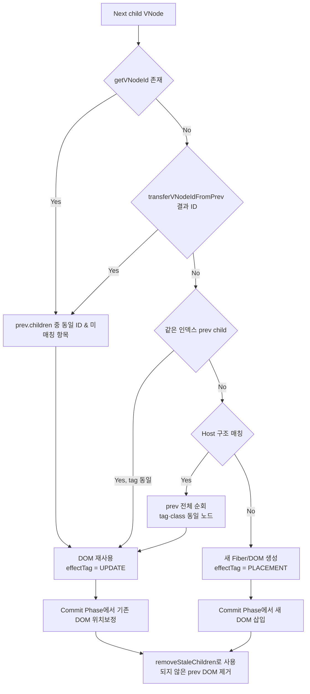

# renderer-dom 스펙 문서

본 문서는 `@barocss/renderer-dom` 패키지의 기술 스펙이다. 구현과 테스트는 본 문서를 기준으로 한다.


## 목차

1. [아키텍처 개요](#1-아키텍처-개요)
2. [DSL 규칙](#2-dsl-규칙)
3. [VNode 구조](#3-vnode-구조)
4. [Reconciliation: Render Phase](#4-reconciliation-render-phase)
5. [Reconciliation: Commit Phase](#5-reconciliation-commit-phase)
6. [VNode 매칭 알고리즘](#6-vnode-매칭-알고리즘)
7. [데이터 속성 처리](#7-데이터-속성-처리)
8. [마크와 데코레이터](#8-마크와-데코레이터)
9. [컴포넌트 상태 관리](#9-컴포넌트-상태-관리)
10. [포털](#10-포털)
11. [skipNodes 기능](#11-skipnodes-기능)
12. [로깅 시스템](#12-로깅-시스템)
13. [상수 정의](#13-상수-정의)
14. [오류 처리](#14-오류-처리)
15. [성능 요구사항](#15-성능-요구사항)
16. [테스트/검증 원칙](#16-테스트검증-원칙)
17. [금지 사항](#17-금지-사항)

---

## 1. 아키텍처 개요

### 1.1 렌더링 파이프라인

```
ModelData → VNodeBuilder → VNode Tree → Fiber Reconciliation → DOM
                                    ↓
                            Render Phase (변경 계산)
                                    ↓
                            Commit Phase (DOM 적용)
```

1. **VNodeBuilder**: 모델 데이터를 순수한 VNode 트리로 변환
2. **Fiber Reconciliation**: React-style 두 단계 reconciliation
   - **Render Phase**: 이전 VNode와 새 VNode를 비교하여 변경사항 계산 (DOM 조작 없음)
   - **Commit Phase**: 계산된 변경사항을 실제 DOM에 적용
3. **ComponentManager**: `sid` 기반으로 컴포넌트 인스턴스와 상태를 전역 관리

### 1.2 React-style Fiber Reconciliation

renderer-dom은 React의 Fiber 아키텍처를 기반으로 한 두 단계 reconciliation을 사용한다.

#### Render Phase (변경 계산)

**목적**: 변경사항 계산만 수행, DOM 조작 없음

**작업:**
- VNode 비교 (prevVNode vs nextVNode)
- effectTag 설정 (`EffectTag.PLACEMENT`, `EffectTag.UPDATE`, `EffectTag.DELETION`)
- DOM 요소 생성/참조 (부모에 삽입하지 않음)
- 속성/스타일 설정하지 않음

**순서**: child → sibling 순서로 DFS 순회

#### Commit Phase (DOM 적용)

**목적**: 계산된 변경사항을 실제 DOM에 적용

**작업:**
- effectTag에 따라 DOM 삽입/재배치/제거
- 속성/스타일 diff 및 업데이트
- Component lifecycle 호출 (mountComponent, updateComponent, unmountComponent)
- Text node 처리

**순서**: child → sibling 순서로 DFS 순회

### 1.3 핵심 원칙

- **VNode 순수성**: VNode는 DOM 표식(`data-bc-*`, `data-decorator-*`)을 포함하지 않는다. 이는 Reconciler 단계에서만 DOM에 부착된다.
- **sid 기반 안정성**: `sid`는 React의 `key`처럼 DOM 재사용의 기준이다. 동일 `sid`는 동일 DOM 요소와 상태 인스턴스를 재사용한다.
- **전체 문서 재빌드**: 상태 변경 시 항상 전체 문서를 재빌드하고 prevVNode와 nextVNode를 비교하여 최소 변경만 적용한다. 부분 업데이트 API는 제공하지 않는다.
- **두 단계 분리**: Render Phase와 Commit Phase는 명확히 분리되어 있다. Render Phase에서는 DOM 조작을 하지 않는다.

---

## 2. DSL 규칙

### 2.1 템플릿 정의

#### `define(stype: string, template: ElementTemplate | ContextualComponent)`

템플릿을 등록한다.

**시그니처:**
```typescript
define<P, M, C>(
  stype: string,
  template: ElementTemplate | ContextualComponent<P, M, C>
): void
```

**규칙:**
- `stype`은 고유한 문자열 식별자여야 한다.
- 템플릿 함수는 `(props: P, model: M, context: C) => ElementTemplate` 시그니처를 가져야 한다.
- 템플릿 함수는 항상 `ElementTemplate`을 반환해야 한다.
- `props`와 `model`은 절대 혼합하지 않는다. `props`는 순수 데이터, `model`은 원본 모델이다.
- `context.model`은 원본 모델을 가리킨다.

### 2.2 엘리먼트 템플릿

#### `element(tag: string | Function, attrs?: Record<string, any>, children?: Array<any>)`

엘리먼트 템플릿을 생성한다.

**규칙:**
- `tag`는 문자열 또는 함수(동적 태그)일 수 있다.
- `attrs`의 정적/동적 속성은 그대로 보존되어 VNode에 반영된다.
- 네임스페이스(SVG/MathML)는 DOM 단계에서 자동 처리된다.
- `children`은 `ElementTemplate`, `DataTemplate`, 또는 `slot()` 결과를 포함할 수 있다.

### 2.3 자식 확장: `slot(key: string)`

#### 규칙

- 하위 모델(`model.content: []`)을 VNode로 확장하는 **유일한 경로**이다.
- Reconciler는 slot 지점에서 자식들을 재귀적으로 빌드/리컨실한다.
- `data(key)`는 배열 원본 접근만 제공하며, children 확장에는 사용하지 않는다.

**예시:**
```typescript
define('list', element('ul', {}, [slot('content')]));

// model.content 배열이 자동으로 확장됨
const model = {
  sid: 'list1',
  stype: 'list',
  content: [
    { sid: 'item1', stype: 'listItem', text: 'Item 1' }
  ]
};
```

### 2.4 조건부 렌더링: `when(condition, thenTemplate, elseTemplate?)`

**규칙:**
- `condition`은 함수 또는 불리언 값이다.
- `thenTemplate`은 조건이 참일 때 렌더링할 템플릿이다.
- `elseTemplate`은 선택적이며, 조건이 거짓일 때 렌더링된다.

### 2.5 반복 렌더링: `each(items, itemTemplate, keyFn?)`

**규칙:**
- `items`는 배열을 반환하는 함수 또는 배열이다.
- `itemTemplate`은 각 항목에 대해 호출되는 함수 `(item, index) => ElementTemplate`이다.
- `keyFn`은 선택적이며, 각 항목의 고유 키를 반환하는 함수이다. 제공되지 않으면 `sid`를 사용한다.

### 2.6 마크/데코레이터 등록

#### `defineMark(name: string, template: ElementTemplate)`

텍스트 마크를 등록한다.

#### `defineDecorator(name: string, template: ElementTemplate)`

데코레이터를 등록한다.

---

## 3. VNode 구조

### 3.1 기본 필드

```typescript
interface VNode {
  tag?: string;                    // HTML 태그명 또는 VNodeTag.TEXT, VNodeTag.PORTAL
  text?: string | number;          // 텍스트 노드의 텍스트 내용
  attrs?: Record<string, any>;     // HTML 속성 (data-bc-*, data-decorator-* 제외)
  style?: Record<string, any>;     // 인라인 스타일
  children?: Array<string | number | VNode>;
  key?: string;                    // VNode 매칭용 키 (DOM에 저장되지 않음)
}
```

### 3.2 컴포넌트 식별자

```typescript
interface ComponentVNode extends VNode {
  sid?: string;                    // 모델의 고유 식별자
  stype?: string;                  // 컴포넌트 타입 (템플릿 선택)
  props?: Record<string, any>;     // 순수 데이터 (props와 model은 분리됨)
  model?: Record<string, any>;     // 원본 모델 데이터
}
```

**규칙:**
- `sid`: 모델의 고유 식별자. 모델에서 직접 가져오며 생성/변형하지 않는다.
- `stype`: 컴포넌트 타입. 템플릿 선택에 사용된다.
- `props`: 순수 데이터 (props와 model은 분리됨)
- `model`: 원본 모델 데이터

### 3.3 Text VNode

```typescript
interface TextVNode extends VNode {
  tag: VNodeTag.TEXT;              // '#text'
  text: string | number;
  children?: never;                 // Text VNode는 children을 가질 수 없음
}
```

**규칙:**
- `tag: VNodeTag.TEXT`로 명시적으로 표시
- `createTextVNode(text)`로 생성
- `data('text')`는 항상 `<span>`으로 감싸진 구조를 생성 (편집 일관성)

### 3.4 데코레이터 참조

```typescript
interface DecoratedVNode extends VNode {
  decorators?: unknown[];
}
```

**데코레이터 규칙:**
- 마크는 텍스트 노드에만 적용된다.

### 3.5 데코레이터 정보 저장

**중요 변경사항:**
- 데코레이터 정보는 VNode 최상위에 `decoratorSid`, `decoratorStype` 등으로 저장되지만,
- DOM에는 `attrs['data-decorator-sid']`, `attrs['data-decorator-stype']` 등으로 저장된다.
- Reconciler가 VNode의 최상위 정보를 DOM 속성으로 변환한다.

```typescript
interface DecoratorVNode extends VNode {
  decoratorSid?: string;
  decoratorStype?: string;
  decoratorCategory?: 'inline' | 'block' | 'layer' | string;
  decoratorPosition?: 'before' | 'after' | 'inside' | string;
  decoratorModel?: Record<string, any>;
}
```

**규칙:**
- `decoratorCategory`에 따라 처리 방식이 다르다:
  - `inline`: 텍스트 범위에 적용
  - `block`: 컴포넌트 VNode 앞/뒤에 삽입
  - `layer`: 레이어 오버레이
- 블록/레이어 데코레이터는 컴포넌트 VNode에만 적용된다 (마크 VNode에 적용 금지).

### 3.6 포털 VNode

```typescript
interface PortalVNode extends VNode {
  tag: VNodeTag.PORTAL;            // 'portal'
  portal?: {
    target: HTMLElement | (() => HTMLElement) | string;
    template: any;
    portalId?: string;
  };
}
```

**규칙:**
- `target`은 HTMLElement, 함수, 또는 CSS 선택자 문자열일 수 있다.
- `portalId`가 제공되면 동일 ID로 호스트를 재사용한다.

---

## 4. Reconciliation: Render Phase

### 4.1 개요

Render Phase는 변경사항을 계산만 하고 DOM 조작은 하지 않는다.

**입력:**
```typescript
reconcileWithFiber(
  container: HTMLElement,
  vnode: VNode,
  prevVNode: VNode | undefined,
  context: any,
  deps: FiberReconcileDependencies,
  onComplete?: () => void
): void
```

**FiberReconcileDependencies:**
```typescript
interface FiberReconcileDependencies {
  dom: DOMOperations;
  components: ComponentManager;
  currentVisitedPortalIds: Set<string> | null;
  portalHostsById: Map<string, { target: HTMLElement; host: HTMLElement }>;
  rootModel?: any;
  prevVNodeTree?: Map<string, VNode>;
  rootSid?: string;
  context?: any;
  skipNodes?: Set<string>;  // 입력 중인 노드 목록 (reconcile 스킵)
}
```

### 4.2 Fiber 트리 생성

```typescript
const rootFiber = createFiberTree(container, vnode, prevVNode, context);
```

**FiberNode 구조:**
```typescript
interface FiberNode {
  vnode: VNode;
  prevVNode: VNode | undefined;
  domElement: HTMLElement | Text | null;
  parent: HTMLElement;
  parentFiber: FiberNode | null;
  child: FiberNode | null;
  sibling: FiberNode | null;
  return: FiberNode | null;
  effectTag: EffectTagType;  // PLACEMENT, UPDATE, DELETION, 또는 null
  context: any;
  index: number;
  primitiveTextChildren?: Array<{ text: string | number; index: number }>;
}
```

### 4.3 renderFiberNode 동작

**핵심 원칙:**
- DOM 조작 없음 (생성만)
- 속성/스타일 설정 없음
- effectTag 설정만

**주요 단계:**

1. **skipNodes 체크**
   ```typescript
   const sid = getVNodeId(vnode);
   if (sid && skipNodes?.has(sid)) {
     // 이전 VNode와 DOM 유지
     // effectTag 설정 안 함
     return;
   }
   ```

2. **ID 전달 및 생성**
   ```typescript
   transferVNodeIdFromPrev(vnode, prevVNode);
   generateVNodeIdIfNeeded(vnode, fiber, components);
   ```

3. **Portal 처리**
   - Portal은 별도 FiberScheduler로 처리

4. **타입 비교**
   ```typescript
   const prevType = prevVNode ? (isTextVNode(prevVNode) ? 'text' : 'host') : null;
   const nextType = isTextVNode(vnode) ? 'text' : 'host';
   const typeChanged = prevType !== null && prevType !== nextType;
   ```

5. **effectTag 설정**
   ```typescript
   if (!prevVNode) {
     fiber.effectTag = EffectTag.PLACEMENT;
   } else if (typeChanged) {
     fiber.effectTag = EffectTag.PLACEMENT;  // 타입 변경 시 재생성
   } else {
     fiber.effectTag = EffectTag.UPDATE;
   }
   ```

6. **DOM 요소 생성/참조**
   ```typescript
   if (prevVNode?.meta?.domElement && !typeChanged) {
     // 기존 DOM 재사용
     domElement = prevVNode.meta.domElement;
   } else if (vnode.tag === VNodeTag.TEXT) {
     // Text 노드 생성
     domElement = document.createTextNode(String(vnode.text));
   } else if (vnode.tag) {
     // Host 요소 생성
     domElement = dom.createSimpleElement(vnode.tag);
   }
   
   vnode.meta = vnode.meta || {};
   vnode.meta.domElement = domElement;
   fiber.domElement = domElement;
   ```

**중요:**
- DOM 요소를 생성하지만 부모에 삽입하지 않음
- 속성/스타일을 설정하지 않음
- `mountComponent`, `updateComponent`를 호출하지 않음

### 4.4 FiberScheduler

**역할:**
- Render Phase를 비동기로 스케줄링
- 테스트 환경에서는 동기 모드 지원

**흐름:**
```typescript
const scheduler = new FiberScheduler(fiberRender, () => {
  // Render Phase 완료 후 Commit Phase 실행
  commitFiberTree(rootFiber, deps, context);
  if (onComplete) onComplete();
});
scheduler.scheduleWork(rootFiber, FiberPriority.Normal);
```

---

## 5. Reconciliation: Commit Phase

### 5.1 개요

Commit Phase는 Render Phase에서 계산된 변경사항을 실제 DOM에 적용한다.

**입력:**
```typescript
commitFiberTree(
  rootFiber: FiberNode,
  deps: FiberReconcileDependencies,
  context: any
): void
```

### 5.2 commitFiberTree 동작

**순서:**
- child → sibling 순서로 DFS 순회
- 각 Fiber 노드에 대해 `commitFiberNode` 호출

### 5.3 commitFiberNode 동작

**주요 단계:**

1. **skipNodes 체크**
   ```typescript
   const sid = getVNodeId(vnode);
   if (sid && skipNodes?.has(sid)) {
     // DOM 업데이트 안 함
     return;
   }
   ```

2. **effectTag가 없으면 스킵**
   ```typescript
   if (!fiber.effectTag) {
     return;
   }
   ```

3. **DELETION 처리**
   ```typescript
   if (fiber.effectTag === EffectTag.DELETION && prevVNode) {
     components.unmountComponent(prevVNode, context);
     if (prevHost.parentNode) {
       prevHost.parentNode.removeChild(prevHost);
     }
   }
   ```

4. **PLACEMENT 처리 (DOM 삽입)**
   ```typescript
   if (fiber.effectTag === EffectTag.PLACEMENT) {
     const actualParent = getActualParent(fiber);
     const before = getHostSibling(fiber);
     
     // before가 actualParent의 자식인지 확인
     if (before && before.parentNode !== actualParent) {
       before = null;
     }
     
     actualParent.insertBefore(domElement, before);
     
     // Component lifecycle: mount
     if (vnode.stype && domElement instanceof HTMLElement) {
       components.mountComponent(vnode, domElement, context);
     }
   }
   ```

5. **UPDATE 처리 (속성/스타일 업데이트)**
   ```typescript
   if (fiber.effectTag === EffectTag.UPDATE) {
     if (domElement instanceof HTMLElement) {
       // 속성 업데이트
       dom.updateAttributes(domElement, prevVNode?.attrs, vnode.attrs);
       
       // 스타일 업데이트
       dom.updateStyles(domElement, prevVNode?.style, vnode.style);
     }
     
     // Text 노드 업데이트
     if (domElement instanceof Text && vnode.text !== undefined) {
       if (domElement.textContent !== String(vnode.text)) {
         domElement.textContent = String(vnode.text);
       }
     }
     
     // Component lifecycle: update
     if (vnode.stype && !context.__isReconciling) {
       components.updateComponent(prevVNode, vnode, domElement, context);
     }
   }
   ```

6. **Text 처리**
   ```typescript
   if (domElement instanceof HTMLElement && vnode.text !== undefined && !vnode.children?.length) {
     handleVNodeTextProperty(domElement, vnode, prevVNode);
   }
   ```

### 5.4 getHostSibling (React 알고리즘)

**목적:** 다음 형제의 DOM 노드를 찾아 `insertBefore`의 `referenceNode`로 사용

**알고리즘:**
```typescript
function getHostSibling(fiber: FiberNode): HTMLElement | Text | null {
  let sibling = fiber.sibling;
  while (sibling) {
    if (sibling.domElement) {
      return sibling.domElement;
    }
    if (sibling.child) {
      let child = sibling.child;
      while (child) {
        if (child.domElement) {
          return child.domElement;
        }
        child = child.child;
      }
    }
    sibling = sibling.sibling;
  }
  return null;
}
```

**핵심:**
- 다음 형제의 DOM 노드를 찾음
- 다음 형제가 없으면 `null` 반환 (appendChild와 동일)
- Render Phase에서 `domElement`를 미리 설정했기 때문에 가능

### 5.5 removeStaleChildren

**목적:** 사용되지 않은 prev DOM 요소 제거

**동작:**
```typescript
function removeStaleChildren(fiber: FiberNode, deps: FiberReconcileDependencies): void {
  const host = fiber.domElement;
  if (!host || !(host instanceof HTMLElement)) return;
  
  // 사용된 DOM 요소 추적
  const usedDomElements = new Set<HTMLElement | Text>();
  // ... vnode.children을 순회하며 사용된 DOM 요소 수집
  
  // 사용되지 않은 DOM 요소 제거
  const childNodes = Array.from(host.childNodes);
  for (const node of childNodes) {
    if (!usedDomElements.has(node as HTMLElement | Text)) {
      host.removeChild(node);
    }
  }
}
```

### 5.6 processPrimitiveTextChildren

**목적:** Primitive text children (문자열/숫자) 처리

**동작:**
- VNode children 중 문자열/숫자를 Text 노드로 변환
- 올바른 위치에 삽입

---

## 6. VNode 매칭 알고리즘

### 6.1 Child Matching Matrix

Fiber 생성 시 prev/next VNode 자식 매칭은 아래 우선순위로 진행된다.

| 우선순위 | 조건 | 매칭 기준 | 결과 |
| --- | --- | --- | --- |
| 1 | `getVNodeId(childVNode)`가 truthy (`sid`, `key`, `attrs['data-decorator-sid']` 등) | `prevVNode.children` 중 동일 ID, 아직 매칭되지 않은 항목 검색 | DOM/컴포넌트 완전 재사용. 위치가 달라도 현재 인덱스로 이동. |
| 2 | 명시 ID 없음, `transferVNodeIdFromPrev`가 stype 기반 ID를 부여 | prev 자식의 `stype`이 같고 ID가 있는 경우 ID를 복사 → 1단계와 동일하게 동작 | 컴포넌트/Decorator가 명시 ID 없이도 안정적으로 재사용됨. |
| 3 | ID 없음, 같은 인덱스에 prev 자식 존재 | `prev.children[i]`의 `tag`와 현재 `tag`가 같거나 둘 다 텍스트 (`VNodeTag.TEXT`) | 동일 타입일 때만 DOM 재사용. 타입이 다르면 매칭 실패. |
| 4 | ID/인덱스 매칭 실패, 둘 다 Host VNode | prev children 전체를 순회하며 `tag` + 클래스 조합이 같은 항목 탐색 (이미 매칭된 VNode 제외) | mark/decorator wrapper처럼 ID가 없는 Host 노드도 안정적으로 재사용. |
| 5 | 어느 조건에도 해당하지 않음 | 매칭 실패로 간주 | Render Phase에서 새 DOM 생성, Commit Phase에서 기존 DOM 제거 후 삽입. |

**추가 규칙:**
- 텍스트 자식은 `tag: VNodeTag.TEXT`로 통일해 3단계에서 타입 검사가 일관적으로 동작한다.
- `generateVNodeIdIfNeeded`가 Host/Text VNode에 `tag-index` 기반 auto ID를 부여해 동일 구조가 반복될 때도 매칭이 안정적이다.
- Render Phase는 매칭 결과만 계산하고 DOM 이동/삭제는 하지 않는다. Commit Phase에서 `commitFiberTree`가 effectTag에 따라 DOM을 삽입·업데이트·삭제하고, 마지막에 `removeStaleChildren`/`processPrimitiveTextChildren`가 남은 동기화를 수행한다.

### 6.2 Matching Flow Diagram



---

## 7. 데이터 속성 처리

### 7.1 DOM 표식 규칙

**규칙:**
- `data-bc-sid`, `data-bc-stype` 등 모든 `data-*` 표식은 **Reconciler가 DOM에서만** 부착/갱신한다.
- VNode에는 `sid`, `stype` 등 식별 정보만 최상위로 가진다.
- 데코레이터 정보는 VNode 최상위에 있지만, DOM에는 `attrs['data-decorator-*']`로 저장된다.

### 7.2 속성 부착 시점

- **루트 호스트**: Commit Phase에서 `data-bc-sid`, `data-bc-stype` 부착
- **자식 호스트**: Commit Phase에서 각 자식에 부착
- **데코레이터**: Commit Phase에서 `data-decorator-*` 속성을 부착/갱신

### 7.3 네임스페이스 처리

**규칙:**
- SVG, MathML 등 네임스페이스가 필요한 요소는 자동으로 처리된다.
- `DOMOperations.createSimpleElement(tag, parent?)`가 부모 요소의 네임스페이스를 상속한다.
- `DOMOperations.setAttributeWithNamespace`가 네임스페이스를 고려하여 속성을 설정한다.
- `xlink:href` 등 특수 속성도 네임스페이스를 고려하여 처리된다.

---

## 8. 마크와 데코레이터

### 8.1 마크 처리

**규칙:**
- 마크는 텍스트 노드에만 적용된다.
- `range: [start, end]` 형식으로 텍스트 범위를 지정한다.
- 여러 마크가 겹칠 수 있으며, 안전하게 처리된다.

### 8.2 데코레이터 처리

**규칙:**
- 인라인 데코레이터: 텍스트 범위에 적용
- 블록 데코레이터: 컴포넌트 VNode 앞/뒤에 삽입 (`position: 'before' | 'after'`)
- 레이어 데코레이터: 오버레이로 적용
- 블록/레이어 데코레이터는 컴포넌트 VNode에만 적용된다 (마크 VNode에 적용 금지).
- 인라인 마크와 데코레이터는 동시에 처리 가능하며, 겹침/분할 케이스를 안전하게 다룬다.

### 8.3 데코레이터 위치 규칙

**규칙:**
- `decoratorPosition`을 기준으로 삽입 위치를 결정한다:
  - `'before'`: 컴포넌트 VNode 앞에 삽입
  - `'after'`: 컴포넌트 VNode 뒤에 삽입
  - `'inside'`: 컴포넌트 VNode 내부에 삽입

### 8.4 데코레이터 정보 저장

**중요:**
- VNode 최상위에 `decoratorSid`, `decoratorStype` 등으로 저장
- DOM에는 `attrs['data-decorator-sid']`, `attrs['data-decorator-stype']` 등으로 저장
- `getVNodeId()`는 `vnode.sid`와 `vnode.attrs?.[DOMAttribute.DECORATOR_SID]`를 모두 확인

---

## 9. 컴포넌트 상태 관리

### 9.1 상태 클래스 정의

```typescript
class MyState extends BaseComponentState {
  initState(initial: any): void {
    // 선택: 초기 상태 설정
    this.data = { ...initial };
  }
  
  snapshot(): Record<string, any> {
    // 선택: 스냅샷 생성 (미제공 시 얕은 복사 사용)
    return { ...this.data };
  }
  
  set(patch: Record<string, any>): void {
    // 변경 누적 후 changeState 이벤트 방출
    super.set(patch);
  }
}
```

**규칙:**
- `initState()`는 선택적이다. 제공되면 초기 데이터로 호출된다.
- `snapshot()`은 선택적이다. 미제공 시 얕은 복사 스냅샷을 사용한다.
- `set(patch)`는 변경을 누적한 후 `ComponentManager.emit('changeState', sid, ...)`를 방출한다.

### 9.2 상태 등록

```typescript
defineState('stype', StateClass);
```

**규칙:**
- `ComponentManager`가 `sid` 기반으로 `BaseComponentState` 인스턴스를 전역 관리한다.
- `context.instance`로 상태에 접근할 수 있다.

### 9.3 라이프사이클 훅

**규칙:**
- `mountComponent`: Commit Phase에서 `effectTag === EffectTag.PLACEMENT`일 때 호출
- `updateComponent`: Commit Phase에서 `effectTag === EffectTag.UPDATE`일 때 호출 (단, `__isReconciling`이 `false`일 때만)
- `unmountComponent`: Commit Phase에서 `effectTag === EffectTag.DELETION`일 때 호출

**타이밍:**
- Render Phase에서는 lifecycle을 호출하지 않음
- Commit Phase에서만 호출됨

### 9.4 isReconciling 플래그

**목적:** `updateComponent` 중 `setState` 호출 방지 (무한 루프 방지)

**동작:**
```typescript
// ComponentManager
private isReconciling: boolean = false;

updateComponent(prevVNode, nextVNode, host, context) {
  this.isReconciling = true;
  try {
    // ... update logic
  } finally {
    this.isReconciling = false;
  }
}

// BaseComponentState
set(patch: Record<string, any>) {
  if (this.componentManager.getReconciling()) {
    logger.warn(LogCategory.COMPONENT, 'setState called during reconciliation, ignoring');
    return;
  }
  // ... set logic
}
```

### 9.5 자동 재렌더링

**규칙:**
- `DOMRenderer`는 `changeState` 이벤트를 구독한다.
- 이벤트 발생 시 `requestAnimationFrame`으로 스로틀된 전체 re-render를 트리거한다.
- 부분 업데이트 API는 제공하지 않는다 (`updateBySid` 제거). 항상 전체 문서 재빌드 + prev/next 비교 원칙을 따른다.

---

## 10. 포털

### 10.1 포털 정의

```typescript
portal(
  target: HTMLElement | (() => HTMLElement) | string,
  template: ElementTemplate,
  portalId?: string
)
```

**규칙:**
- `target`은 HTMLElement, 함수, 또는 CSS 선택자 문자열일 수 있다.
- `portalId`가 제공되면 동일 ID로 호스트를 재사용한다.

### 10.2 포털 처리

**규칙:**
1. Render Phase에서 Portal VNode 감지
2. 별도 FiberScheduler로 Portal 내부 reconcile 수행
3. `portalId`로 대상 컨테이너 내 호스트를 식별/재사용한다.
4. 렌더 사이클에서 방문되지 않은 포털은 정리된다.
5. 타겟이 변경되면 이전 타겟의 호스트를 정리하고 새 타겟으로 이관한다.
6. 동일 `portalId`는 동일 DOM 호스트 재사용을 보장한다.

---

## 11. skipNodes 기능

### 11.1 목적

입력 중인 노드를 외부 변경(AI, 동시편집)으로부터 보호

### 11.2 동작 방식

**Render Phase:**
```typescript
const sid = getVNodeId(vnode);
if (sid && skipNodes?.has(sid)) {
  // 이전 VNode와 DOM 유지
  // effectTag 설정 안 함
  return;
}
```

**Commit Phase:**
```typescript
const sid = getVNodeId(vnode);
if (sid && skipNodes?.has(sid)) {
  // DOM 업데이트 안 함
  // 이전 DOM 유지
  return;
}
```

### 11.3 규칙

- skipNodes에 포함된 노드는 Render Phase와 Commit Phase 모두에서 스킵
- 이전 VNode와 DOM을 그대로 유지
- 자식 노드는 계속 처리 가능 (입력 중인 노드만 보호)
- 모델은 업데이트되지만 DOM에는 반영 안 됨
- skipNodes 제거 후 재렌더링하면 최신 모델이 DOM에 반영됨

### 11.4 EditorViewDOM 연동

**입력 시작:**
- `handleInput()`, `handleCompositionStart()`에서 `_onInputStart()` 호출
- Selection 기반으로 편집 중인 노드의 `sid` 추출하여 `editingNodes`에 추가

**입력 종료:**
- `handleCompositionEnd()`, `handleBlur()`에서 `_onInputEnd()` 호출
- debounce 후 `editingNodes` 제거 및 재렌더링

**렌더링:**
- `render()` 호출 시 `skipNodes: editingNodes` 전달

---

## 12. 로깅 시스템

### 12.1 구조화된 로깅

**LogCategory:**
```typescript
enum LogCategory {
  VNODE = 'vnode',
  FIBER = 'fiber',
  RECONCILE = 'reconcile',
  COMPONENT = 'component',
}
```

**사용:**
```typescript
logger.debug(LogCategory.FIBER, 'message', { data });
logger.warn(LogCategory.COMPONENT, 'message', { data });
logger.error(LogCategory.RECONCILE, 'message', error);
```

### 12.2 디버그 플래그

**환경 변수:**
- `BAROCSS_DEBUG_VNODE`: VNode 관련 로그 활성화
- `__DEBUG_RECONCILE__`: Reconciliation 관련 로그 활성화
- `__DEBUG_MARKS__`: Marks 관련 로그 활성화

**전역 플래그:**
- `globalThis.__BAROCSS_DEBUG_VNODE__`: VNode 관련 로그 활성화

---

## 13. 상수 정의

### 13.1 EffectTag

```typescript
export const EffectTag = {
  PLACEMENT: 'PLACEMENT',  // 새 DOM 요소 삽입
  UPDATE: 'UPDATE',        // 기존 DOM 요소 업데이트
  DELETION: 'DELETION',    // 기존 DOM 요소 제거
} as const;
```

**사용:**
- `fiber.effectTag = EffectTag.PLACEMENT`
- `if (fiber.effectTag === EffectTag.UPDATE)`

### 13.2 VNodeTag

```typescript
export const VNodeTag = {
  TEXT: '#text',      // 텍스트 노드
  PORTAL: 'portal',   // 포털 노드
} as const;
```

**사용:**
- `vnode.tag = VNodeTag.TEXT`
- `if (vnode.tag === VNodeTag.PORTAL)`

### 13.3 DOMAttribute

```typescript
export const DOMAttribute = {
  BC_SID: 'data-bc-sid',
  DECORATOR_SID: 'data-decorator-sid',
  DECORATOR_STYPE: 'data-decorator-stype',
  DECORATOR_CATEGORY: 'data-decorator-category',
  DECORATOR_POSITION: 'data-decorator-position',
  SKIP_RECONCILE: 'data-skip-reconcile',
  DECORATOR: 'data-decorator',
} as const;
```

**사용:**
- `dom.setAttribute(element, DOMAttribute.BC_SID, sid)`
- `vnode.attrs?.[DOMAttribute.DECORATOR_SID]`

---

## 14. 오류 처리

### 14.1 모델 검증

**규칙:**
- `stype` 누락 모델: 렌더 시작 시 즉시 에러를 던진다. 렌더는 중단된다.
- `sid` 누락 모델: 스킵하고 경고를 기록한다. 기존 DOM은 변경되지 않는다.
- 미등록 `stype`: 에러를 던진다.

### 14.2 데코레이터 검증

**규칙:**
- 잘못된 데코레이터 범위/포지션: 해당 데코레이터는 무시한다 (크래시하지 않음).

### 14.3 포털 검증

**규칙:**
- 포털 타겟 무효: 해당 포털은 스킵하고 경고를 기록한다.

---

## 15. 성능 요구사항

### 15.1 DOM 안정성

**규칙:**
- `sid`/`decoratorSid`는 React의 `key`처럼 DOM 재사용의 기준이다.
- 동일 `sid`를 가진 컴포넌트는 DOM 요소와 상태 인스턴스가 재사용된다.

### 15.2 렌더링 성능

**규칙:**
- 전체 문서 리컨실도 허용된다. VNode 생성은 순수/빠르게 유지한다.
- 불필요한 DOM 읽기는 금지된다. 비교는 prevVNode vs nextVNode로 수행한다.
- Render Phase와 Commit Phase 분리로 DOM 조작 최소화

### 15.3 성능 기준

**테스트 기준:**
- 1000 노드: < 3초
- 5000 노드: < 60초 (느린 CI 환경 기준)
- 블록 데코레이터 혼합 1000 노드: < 30초
- 반복 50회 전체 렌더 시 메모리 증가: 5MB 미만

---

## 16. 테스트/검증 원칙

### 16.1 DOM 검증

**규칙:**
- DOM 비교는 `normalizeHTML(container.firstElementChild)` 기반 정규화 문자열로 검증한다.
- prev/next 비교로 속성/스타일 제거가 반영되어야 한다.

### 16.2 포털 검증

**규칙:**
- 포털은 `portalId`로 호스트를 재사용하고, 방문되지 않으면 정리된다.

### 16.3 skipNodes 검증

**규칙:**
- skipNodes에 포함된 노드는 DOM 업데이트가 스킵되어야 한다.
- 자식 노드는 계속 처리되어야 한다.

---

## 17. 금지 사항

다음은 명시적으로 금지된다:

1. **래퍼(wrapper) 도입**: 래퍼 컴포넌트를 도입하지 않는다.
2. **VNode에 DOM 표식 주입**: VNode의 `attrs`에 `data-bc-*`, `data-decorator-*`를 포함하지 않는다. (단, `attrs['data-decorator-*']`는 예외 - Reconciler가 설정)
3. **SSR 유틸 노출**: SSR 관련 유틸은 현재 제거되었다.
4. **sid 생성/변형**: `sid`는 모델에서 직접 가져오며 생성/변형하지 않는다. (단, `generateVNodeIdIfNeeded`는 예외 - auto ID 생성용)
5. **부분 업데이트 API**: `updateBySid` 같은 부분 업데이트 API는 제공하지 않는다.
6. **Render Phase에서 DOM 조작**: Render Phase에서는 DOM 조작을 하지 않는다. (생성만)
7. **Render Phase에서 lifecycle 호출**: Render Phase에서는 `mountComponent`, `updateComponent`를 호출하지 않는다.

---

이 스펙은 renderer-dom의 단일 기준 문서다. 구현과 테스트는 이 규칙에 맞춰 유지/검증한다.
