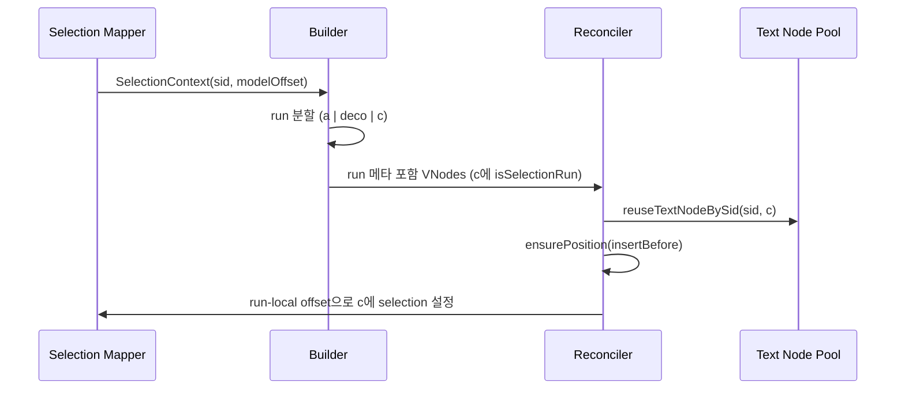
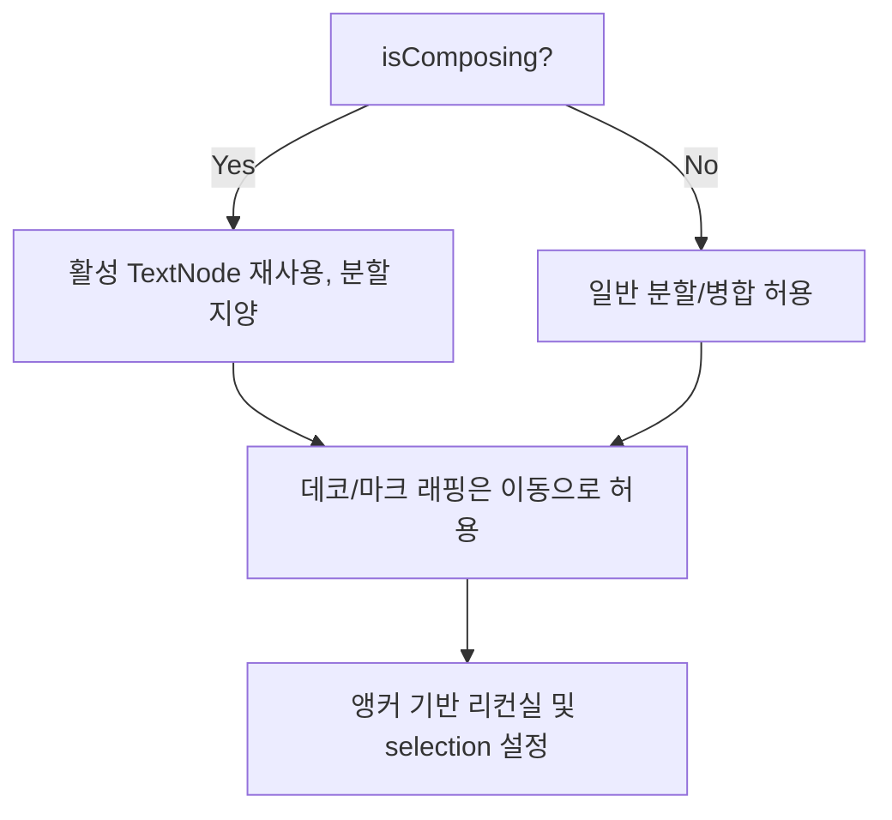

## Selection Anchoring: 분할(run) 이후에도 Selection을 안정적으로 유지하기 (Builder × Reconciler × Pool)

### 1. 목표
인라인 데코레이터나 마크 때문에 하나의 텍스트 span이 여러 run으로 분할될 수 있다(예: a | decorator | c). 이때 캐럿은 이전 텍스트 노드가 아니라 분할 후 다른 텍스트 노드(예: 세 번째 span의 Text 노드)에 있어야 한다. Selection Anchoring은 편집 중 구조가 바뀌더라도 논리적 위치의 selection을 정확히 유지한다.

### 2. 역할과 경계
- VNodeBuilder
  - 모델/DSL로부터 VNode를 순수하게 생성한다.
  - 렌더 시점에 읽기 전용 SelectionContext를 주입받는다.
  - 텍스트 run에 경량의 앵커 메타데이터를 부여한다(모델 변경 없음).
- Reconciler
  - DOM Text 노드를 새로 만들기보다 재사용/이동한다(Text Node Pool).
  - 앵커 메타데이터를 해석해 올바른 run에서 selection을 유지한다.
  - 파괴적 업데이트 대신 이동/위치 조정 위주로 처리한다.
- Editor-View-DOM
  - 인라인 데코레이터 offset과 타깃 기반 데코레이터를 저장/조정한다.
  - sid 기반 호스트/앵커 해석을 제공한다.
- Selection Mapper
  - DOM selection ↔ (sid, modelOffset) 상호 변환한다.
  - 렌더 시점에 Builder에 SelectionContext를 제공한다.

### 3. SelectionContext (주입, 읽기 전용)
- 형태: { sid: string; modelOffset: number } | null
- 렌더 시점에 VNodeBuilder로 전달된다.
- Builder는 현재 selection이 속한 run을 표기하기 위해 이 컨텍스트를 읽는다.

### 4. Run 단위 앵커 메타데이터
각 텍스트 run VNode에는 다음 메타를 부여한다.
- meta.sid: string
- meta.runStart: number (포함)
- meta.runEnd: number (배타)
- meta.isSelectionRun?: boolean
- meta.selectionAnchorOffset?: number (run-local 오프셋 = modelOffset - runStart)

이 메타는 모델을 변경하지 않으며, Reconciler가 올바른 Text 노드를 재사용/이동하고 필요 시 selection을 복구하도록 안내한다.

### 5. 전체 흐름(렌더 사이클)
1) Selection 스냅샷: Mapper가 DOM selection을 (sid, modelOffset)으로 계산한다.
2) 빌드: Builder가 마크/데코레이터에 따라 텍스트를 runs로 분리하고, modelOffset이 포함된 run에 앵커 메타를 표기한다.
3) 리컨실:
   - Text Node Pool: 활성 Text 노드를 삭제하지 않고 재사용/이동한다.
   - isSelectionRun인 run은 가능하면 기존 활성 Text 노드를 재사용, 불가하면 selectionAnchorOffset으로 새 노드에 selection 설정.
4) 결과: 하나의 span이 a | decorator | c로 쪼개졌고 modelOffset이 c에 속한다면, 캐럿은 c의 Text 노드의 정확한 오프셋으로 이동한다.

### 6. IME/조합 입력 처리
- isComposing 중:
  - 활성 Text 노드를 반드시 재사용하고 분할/교체하지 않는다.
  - 래퍼(마크/데코레이터)는 추가해도 되지만, 활성 노드는 이동(insertBefore)으로 처리한다.
  - 정리/재배치는 compositionend 이후로 미룬다.
- compositionend 이후:
  - 최종 run 테이블과 앵커를 확정하고 일반 리컨실 절차를 수행한다.

### 7. Target vs Inline Decorator
- 인라인 데코레이터(오프셋 기반, editor-view-dom 스토어): 텍스트 Δ에 맞춰 offset을 보정하며, run 메타로 selection을 고정한다.
- 타깃 데코레이터(앵커 기반, editor-view-dom 스토어): Δ 이후 호스트 sid 기준(before/after/around)으로 위치를 재계산한다. run 매핑과 독립적으로 selection anchoring이 유지된다.

### 8. 알고리즘
#### 8.1 Builder: 앵커 정보가 포함된 Run 생성
```typescript
type SelectionContext = { sid: string; modelOffset: number } | null;

function buildTextRuns(text: string, sid: string, selCtx: SelectionContext) {
  const runs = splitByMarksAndDecorators(text); // [{start,end,text}] (grapheme 안전)
  return runs.map(run => {
    const meta: any = { sid, runStart: run.start, runEnd: run.end };
    if (selCtx && selCtx.sid === sid &&
        selCtx.modelOffset >= run.start && selCtx.modelOffset < run.end) {
      meta.isSelectionRun = true;
      meta.selectionAnchorOffset = selCtx.modelOffset - run.start;
    }
    return createTextRunVNode(run.text, meta);
  });
}
```

메모:
- splitByMarksAndDecorators는 NFC + 안전 분할로 그래프림(문자 단위) 경계를 보장해야 한다.

#### 8.2 Reconciler: 앵커 우선 재사용 및 이동
```typescript
function reconcileRun(parent: HTMLElement, vrun: VNode, pool: SidTextNodePool) {
  const isSel = vrun.meta?.isSelectionRun === true;
  const sid = vrun.meta?.sid as string | undefined;
  let textNode: Text | null = null;

  if (sid) {
    // Selection run은 최우선 재사용 대상
    textNode = pool.reuseTextNodeBySid(sid, vrun);
  }
  if (!textNode) {
    textNode = document.createTextNode(extractText(vrun));
  } else {
    // 제자리 내용 갱신
    const desired = extractText(vrun);
    if (textNode.data !== desired) textNode.data = desired;
  }

  // 올바른 위치 보장(이동은 insertBefore)
  ensurePosition(parent, textNode, vrun);

  // 앵커가 있으면 selection 복구
  if (isSel && typeof vrun.meta.selectionAnchorOffset === 'number') {
    setCollapsedSelection(textNode, vrun.meta.selectionAnchorOffset);
  }

  if (sid) pool.register(sid, textNode);
}
```

#### 8.3 Selection Mapper (DOM ↔ Model)
```typescript
// DOM → Model (렌더 전)
function toModelOffset(anchorNode: Node, anchorOffset: number): { sid: string, modelOffset: number } | null {
  const sid = findSidHost(anchorNode);         // find closest element with data-bc-sid
  if (!sid) return null;
  const runIndex = getLastRunIndexForSid(sid); // 직전 렌더의 인덱스
  const modelOffset = domToModelOffset(runIndex, anchorNode, anchorOffset);
  return { sid, modelOffset };
}

// Model → DOM (필요 시 리컨실 후)
function toDomPosition(sid: string, modelOffset: number): { node: Text, offset: number } | null {
  const runIndex = getCurrentRunIndexForSid(sid);
  return modelToDomOffset(runIndex, modelOffset);
}
```

### 9. 다이어그램
#### 9.1 분할과 앵커


#### 9.2 조합 입력 보호


### 10. 엣지 케이스와 정책
- Unicode/IME: NFC 정규화와 그래프림 경계를 사용하고, 조합 중 활성 노드 분할을 피한다.
- 타깃 데코레이터: sid 호스트 앵커로 위치를 재배치(run 앵커링과 독립).
- sid 안정성: 편집 단위에서 sid를 안정적으로 유지해 O(1) 조회 보장.
- 배칭: 동일 틱에서 변경을 합쳐 리컨실 전 깜박임/이중 앵커링을 방지.

### 11. 통합 체크리스트
- 매 렌더마다 SelectionContext를 VNodeBuilder에 제공한다.
- Builder는 run 메타(sid, runStart, runEnd, isSelectionRun?, selectionAnchorOffset?)를 표기한다.
- Reconciler는 isSelectionRun을 최우선으로 재사용/이동하고 selection을 복구한다.
- Text Node Pool은 활성 노드의 삭제를 방지한다.
- Editor-View-DOM은 Δ 이후 인라인 데코 offset과 타깃 데코레이터 위치를 갱신한다.

### 12. 요약
Selection을 모델 오프셋에 고정하고, 빌드 시 분할된 run에 앵커 메타를 표기하면, Reconciler가 올바른 Text 노드를 재사용/이동하고 필요 시 selection을 명시적으로 복구할 수 있다. 이로써 구조적 변경(마크/데코레이터)과 입력 안정성이 분리되어, 편집 중에도 자유롭게 마크/데코레이터를 적용할 수 있다.


