# Text Node Pool을 통한 ContentEditable Selection 보존 기법

## Abstract

ContentEditable 기반 리치 텍스트 에디터에서 사용자 입력 중 발생하는 DOM 업데이트는 브라우저의 Selection 객체를 불안정하게 만든다. 본 논문에서는 **sid(Model ID) 기반 Text Node Pool** 개념을 도입하여 Selection이 참조하는 Text Node를 보존함으로써 **편집 중 Selection이 깨지는 문제**를 근본적으로 해결하는 기법을 제안한다. 

이 기법은 DOM 변환/복원(Model Position ↔ DOM Position)과는 별개로, **편집 중 Reconciler가 DOM을 업데이트할 때 sid 기준으로 Text Node Pool을 관리**하여 Selection이 있는 Text Node를 정확하고 빠르게 재사용한다. sid는 모델의 고유 식별자이므로, 같은 sid를 가진 Text Node는 같은 모델 노드를 나타내며, 이를 통해 O(n * m)에서 O(n)으로 시간 복잡도를 개선한다. Mark/Decorator 구조 변경 시에도 실제 Text Node는 보존하여 브라우저 Selection의 안정성을 보장한다.

**Keywords**: ContentEditable, Selection Preservation, Text Node Pool, sid-based Pool, Virtual DOM Reconciliation, Rich Text Editor, Real-time Editing

## 1. Introduction

### 1.1 배경

리치 텍스트 에디터는 사용자가 텍스트를 입력하고 서식을 적용할 수 있는 인터페이스를 제공한다. ContentEditable API를 사용하는 에디터는 브라우저의 네이티브 편집 기능을 활용하여 사용자 경험을 향상시킬 수 있지만, 동시에 복잡한 DOM 조작으로 인한 문제에 직면한다.

본 에디터는 `input` 이벤트 대신 **MutationObserver**를 사용하여 DOM 변경을 감지하고 모델을 업데이트한다. 이는 더 정확한 DOM 변경 추적과 Selection 보존을 가능하게 한다.

특히, 사용자가 텍스트를 입력하는 동안:
1. MutationObserver가 DOM 변경을 감지 (input 이벤트 사용 안 함)
2. 에디터 모델이 업데이트됨
3. Renderer가 새로운 VNode 트리를 생성
4. Reconciler가 DOM을 업데이트

이 과정에서 기존 Text Node가 삭제되고 새로운 Text Node가 생성되면, 브라우저 Selection이 참조하던 Text Node가 사라져 Selection이 깨지게 된다.

### 1.2 문제의 심각성

Selection이 깨지면:
- 사용자가 입력 중인 텍스트가 사라질 수 있음
- 커서 위치가 예상치 못한 곳으로 이동
- 텍스트 선택 영역이 해제됨
- 사용자 경험이 크게 저하됨

기존 해결 방안인 Selection 복원은:
- 브라우저마다 동작이 다름
- 복잡한 DOM 구조에서 불안정함
- 비동기 처리로 인한 타이밍 이슈
- 근본적인 해결책이 아님

### 1.3 제안하는 해결책

본 논문에서는 **sid(Model ID) 기반 Text Node Pool** 개념을 도입하여 Selection이 참조하는 Text Node를 보존하는 기법을 제안한다. 이 기법은 **편집 중** Selection을 복원하는 대신, **sid 기준으로 Text Node Pool을 관리**하여 Selection이 있는 Text Node를 정확하고 빠르게 재사용함으로써 Selection의 안정성을 보장한다.

**핵심 아이디어**:
- **sid 기반 Pool 관리**: sid는 모델의 고유 식별자이므로, 같은 sid를 가진 Text Node는 같은 모델 노드를 나타냄
- **정확한 매칭**: 위치/내용 기반 매칭보다 훨씬 정확하고 간편함
- **성능 최적화**: O(1) 조회로 시간 복잡도 O(n * m)에서 O(n)으로 개선

**중요한 구분**:
- **DOM 변환/복원 (Model Position ↔ DOM Position)**: 모델 기반 Selection 관리를 위한 별도 메커니즘. 이는 에디터의 Selection 관리 시스템의 일부이다.
- **sid 기반 Text Node Pool**: 편집 중 Reconciler가 DOM을 업데이트할 때 Selection이 깨지지 않도록 하는 메커니즘. DOM 변환/복원과는 독립적으로 동작한다.

두 메커니즘은 서로 다른 목적을 가진다:
1. **DOM 변환/복원**: 모델의 Selection을 DOM Selection으로 변환하거나 그 반대로 변환 (에디터 상태 관리)
2. **sid 기반 Text Node Pool**: 편집 중 DOM 업데이트 시 Selection이 깨지지 않도록 보존 (실시간 편집 안정성)

## 2. Problem Statement

### 2.1 ContentEditable의 동작 방식

ContentEditable 요소에서 사용자가 텍스트를 입력하면:

**중요**: 본 에디터는 `input` 이벤트를 사용하지 않고, **MutationObserver**를 통해 DOM 변경을 감지하여 모델을 업데이트한다. 이는 더 정확한 DOM 변경 추적과 Selection 보존을 가능하게 한다.

```typescript
// 1. 사용자 입력
User types "Hello" → DOM: <span>Hello</span>

// 2. 브라우저 Selection
Selection: { anchorNode: Text("Hello"), anchorOffset: 5 }

// 3. MutationObserver 감지 (input 이벤트 사용 안 함)
MutationObserver → handleTextContentChange()

// 4. text-analyzer로 Δ 생성 → 업데이트 (9.14.2, 9.14.7 참고)
//   - analyzeTextChanges → TextChange[] → Delta[] (insert/delete/replace)
//   - applyDeltasBySid로 mark range(모델) / inline decorator offset(editor-view-dom) 보정
Model: { text: "Hello", marks: [...] } // decorators는 editor-view-dom에서 관리

// 5. Renderer 재렌더링
VNode: { tag: 'span', children: [{ text: 'Hello' }] }

// 6. Reconciler DOM 업데이트 (Text Node Pool로 selection 유지)
Reconciler → 구조만 변경 시 insertBefore로 이동, Text 노드는 재사용 ✅
```

### 2.2 브라우저 Selection의 특성

브라우저 Selection은 DOM Node에 대한 직접 참조를 유지한다:

```typescript
interface Selection {
  anchorNode: Node | null;  // 직접 참조
  anchorOffset: number;
  focusNode: Node | null;    // 직접 참조
  focusOffset: number;
}
```

**문제점**:
- Node가 삭제되면 Selection이 무효화됨
- Node가 이동되면 Selection이 예상치 못한 위치를 가리킬 수 있음
- Selection 복원은 복잡하고 불안정함

### 2.3 기존 해결 방안의 한계

#### 2.3.1 Selection 저장 및 복원

```typescript
// 문제: Node가 삭제되면 복원 불가능
const savedSelection = {
  anchorNode: range.anchorNode,  // 삭제될 수 있음
  anchorOffset: range.anchorOffset
};
// DOM 업데이트 후
if (document.contains(savedSelection.anchorNode)) {
  // Node가 살아있을 때만 복원 가능
  range.setStart(savedSelection.anchorNode, savedSelection.anchorOffset);
}
```

**한계**:
- Node가 삭제되면 복원 불가능
- Node가 이동되면 위치가 맞지 않을 수 있음
- 브라우저마다 동작이 다름

#### 2.3.2 Model Position 기반 복원

```typescript
// DOM Position → Model Position 변환
const modelSelection = convertDOMToModel(domSelection);
// DOM 업데이트
render();
// Model Position → DOM Position 변환
const newDomSelection = convertModelToDOM(modelSelection);
```

**용도**:
- 모델 기반 Selection 관리 (에디터 상태 관리)
- Selection 저장 및 복원 (에디터 상태 복원)
- DOM 변환/복원은 에디터의 Selection 관리 시스템의 일부

**한계 (편집 중 Selection 보존 관점에서)**:
- 변환 과정에서 오차 발생 가능
- 복잡한 Mark/Decorator 구조에서 정확도 저하
- 비동기 처리로 인한 타이밍 이슈
- **편집 중 DOM 업데이트 시 Selection이 깨진 후 복원하는 방식이므로, 근본적인 해결책이 아님**

**중요**: DOM 변환/복원은 모델 기반 Selection 관리를 위한 것이며, 편집 중 Selection 보존과는 별개의 문제이다. 본 논문은 편집 중 Selection이 깨지지 않도록 하는 메커니즘을 제안한다.

## 3. Proposed Solution: Text Node Pool

### 3.1 핵심 아이디어

**"편집 중 Selection을 복원하는 대신, Selection이 있는 Text Node를 보존한다"**

이 아이디어는 다음과 같은 관찰에서 출발한다:

1. **ContentEditable의 특성**: 한 번에 하나의 Text Node만 편집됨
2. **Selection의 특성**: Selection은 특정 Text Node를 직접 참조함
3. **Reconciler의 특성**: DOM 구조를 변경하지만, 실제 Text Node는 재사용 가능함
4. **편집 중 DOM 업데이트**: 사용자가 텍스트를 입력하는 동안 Reconciler가 DOM을 업데이트하면 Selection이 깨질 수 있음

**DOM 변환/복원과의 관계**:
- DOM 변환/복원 (Model Position ↔ DOM Position)은 모델 기반 Selection 관리를 위한 별도 메커니즘
- Text Node Pool은 편집 중 DOM 업데이트 시 Selection이 깨지지 않도록 하는 메커니즘
- 두 메커니즘은 서로 다른 목적을 가지며 독립적으로 동작

따라서, **편집 중** Reconciler가 DOM을 업데이트할 때:
- Selection이 있는 Text Node는 **절대 삭제하지 않음**
- 기존 Text Node를 **재사용**하여 Selection 보존
- Mark/Decorator 구조만 변경하고 Text Node는 유지
- **DOM 변환/복원과는 별개로, 편집 중 Selection이 깨지지 않도록 보장**

### 3.2 Text Node Pool 개념

**Text Node Pool**은 Reconciler가 DOM을 업데이트할 때 기존 Text Node를 재사용하는 메커니즘이다.

#### 3.2.1 sid 기반 Text Node Pool

**핵심 아이디어**: sid(Model ID)는 모델의 고유 식별자이므로, 같은 sid를 가진 Text Node는 같은 모델 노드를 나타낸다. 따라서 **sid 기준으로 Text Node Pool을 관리**하면 매칭이 훨씬 간편하고 정확해진다.

```typescript
class TextNodePool {
  // sid → Text Node 매핑 (각 sid별로 Text Node Pool 관리)
  private sidToTextNodes: Map<string, Text[]> = new Map();
  
  // Selection이 있는 Text Node (최우선 보호)
  private activeTextNodes: Set<Text> = new Set();
  
  // Text Node → sid 역매핑 (Selection에서 sid 찾기용)
  private textNodeToSid: Map<Text, string> = new Map();
  
  /**
   * sid 기준으로 Text Node 재사용
   * 
   * 장점:
   * 1. sid는 모델의 고유 식별자이므로 정확한 매칭 보장
   * 2. 위치 기반 매칭보다 훨씬 간편하고 빠름
   * 3. Selection이 있는 Text Node도 sid로 쉽게 찾을 수 있음
   */
  reuseTextNodeBySid(sid: string, vnode: VNode): Text | null {
    // 1. sid에 해당하는 Text Node Pool 확인
    const textNodes = this.sidToTextNodes.get(sid);
    
    if (!textNodes || textNodes.length === 0) {
      return null;  // Pool이 없으면 새로 생성
    }
    
    // 2. Selection이 있는 Text Node 우선 확인
    for (const textNode of textNodes) {
      if (this.activeTextNodes.has(textNode)) {
        return textNode;  // Selection이 있는 Text Node 재사용
      }
    }
    
    // 3. 기존 Text Node 재사용 (첫 번째 것 사용)
    return textNodes[0];
  }
  
  /**
   * Text Node를 sid Pool에 등록
   */
  registerTextNode(sid: string, textNode: Text): void {
    if (!this.sidToTextNodes.has(sid)) {
      this.sidToTextNodes.set(sid, []);
    }
    this.sidToTextNodes.get(sid)!.push(textNode);
    this.textNodeToSid.set(textNode, sid);
  }
  
  /**
   * Selection이 있는 Text Node의 sid 찾기
   */
  findSidForActiveTextNode(textNode: Text): string | null {
    return this.textNodeToSid.get(textNode) || null;
  }
}
```

#### 3.2.2 sid 기반 매핑의 장점

1. **정확성**: sid는 모델의 고유 식별자이므로 정확한 매칭 보장
2. **간편성**: 위치 기반 매칭보다 훨씬 간단함
3. **성능**: O(1) 조회 (Map 기반)
4. **Selection 보존**: Selection이 있는 Text Node도 sid로 쉽게 찾을 수 있음

#### 3.2.3 sid 기반 Text Node Pool 구조

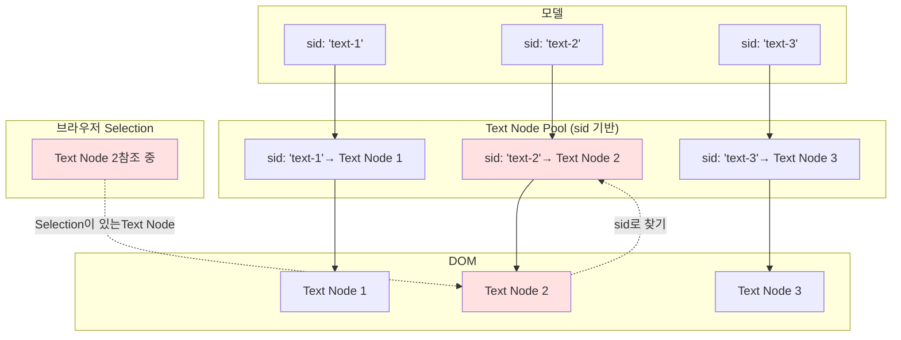

### 3.3 Selection 보호 메커니즘

#### 3.3.1 Selection 감지

Reconciler가 DOM을 업데이트하기 전에 Selection이 있는 Text Node를 수집:

```typescript
private collectActiveTextNodes(): Set<Text> {
  const activeTextNodes = new Set<Text>();
  const selection = window.getSelection();
  
  if (selection && selection.rangeCount > 0) {
    const range = selection.getRangeAt(0);
    
    // anchorNode가 Text Node인 경우
    if (range.anchorNode?.nodeType === Node.TEXT_NODE) {
      activeTextNodes.add(range.anchorNode as Text);
    }
    
    // focusNode가 Text Node인 경우 (다를 때만)
    if (range.focusNode?.nodeType === Node.TEXT_NODE && 
        range.focusNode !== range.anchorNode) {
      activeTextNodes.add(range.focusNode as Text);
    }
  }
  
  return activeTextNodes;
}
```

#### 3.3.2 Text Node 재사용 우선순위

```typescript
private findTextNodeToReuse(
  parent: HTMLElement,
  vnode: VNode,
  index: number,
  activeTextNodes: Set<Text>
): Text | null {
  const childNodes = Array.from(parent.childNodes);
  
  // 우선순위 1: Selection이 있는 Text Node (절대 보호)
  for (const textNode of activeTextNodes) {
    if (textNode.parentNode === parent) {
      const nodeIndex = childNodes.indexOf(textNode);
      // 같은 위치이거나 첫 번째 위치면 재사용
      if (nodeIndex === index || (nodeIndex === -1 && index === 0)) {
        return textNode;
      }
    }
  }
  
  // 우선순위 2: 같은 위치의 기존 Text Node
  if (index < childNodes.length) {
    const nodeAtIndex = childNodes[index];
    if (nodeAtIndex?.nodeType === Node.TEXT_NODE) {
      return nodeAtIndex as Text;
    }
  }
  
  // 우선순위 3: 새 Text Node 생성
  return null;
}
```

#### 3.3.3 Stale Node 제거 시 보호

```typescript
private removeStale(
  parent: HTMLElement,
  keep: Set<HTMLElement | Text>,
  protectedTextNodes: Set<Text>
): void {
  const children = Array.from(parent.childNodes);
  
  for (const child of children) {
    if (!keep.has(child as HTMLElement | Text)) {
      // Selection이 있는 Text Node는 절대 삭제하지 않음
      if (child.nodeType === Node.TEXT_NODE && 
          protectedTextNodes.has(child as Text)) {
        console.log('[Reconciler] Protected text node from removal (has selection)');
        continue;  // 삭제하지 않음
      }
      
      // 다른 노드는 정상적으로 제거
      if (child.nodeType === Node.ELEMENT_NODE) {
        this.unmountComponent(child as HTMLElement);
      }
      parent.removeChild(child);
    }
  }
}
```

## 4. Event Pipeline and Rendering Flow

### 4.1 전체 아키텍처

ContentEditable 기반 에디터에서 사용자 입력(키보드, 버튼, IME) 시 발생하는 이벤트를 처리하고, **TextNodePool을 활용하여 Selection을 보존**하는 전체 파이프라인입니다.

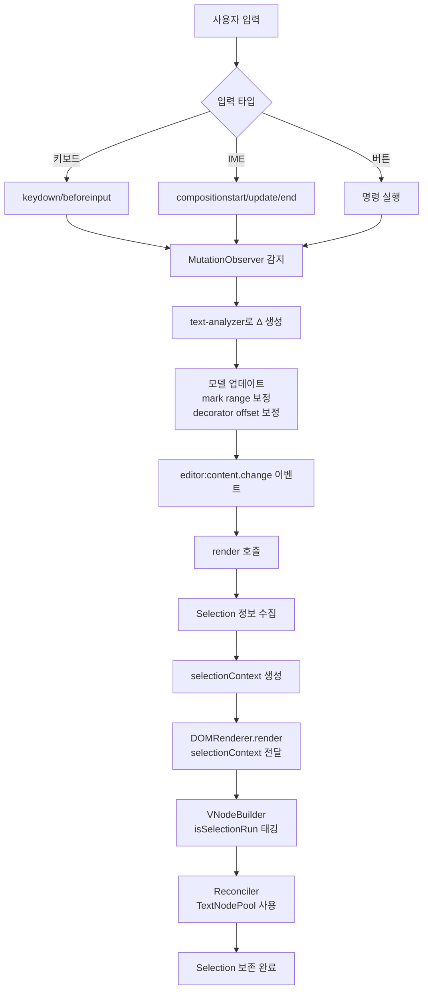

### 4.2 이벤트 파이프라인

#### 4.2.1 입력 이벤트 처리

**키보드 입력**:
```typescript
// editor-view-dom/src/editor-view-dom.ts

// 1. keydown: 키맵 핸들러 실행 (Ctrl+B, Enter 등)
handleKeydown(event: KeyboardEvent): void {
  const key = this.getKeyString(event);
  const handler = this.keymapManager.getHandler(key);
  if (handler) {
    event.preventDefault();
    handler(); // toggleBold(), insertParagraph() 등
  }
}

// 2. beforeinput: 입력 전 처리 (선택적)
handleBeforeInput(event: InputEvent): void {
  this.inputHandler.handleBeforeInput(event);
}

// 3. input: MutationObserver가 실제 DOM 변경을 감지하므로 여기서는 처리 안 함
handleInput(event: InputEvent): void {
  this.inputHandler.handleInput(event); // 주로 로깅용
}
```

**중요**: 실제 모델 업데이트는 **MutationObserver**를 통해 처리됩니다. `input` 이벤트는 사용하지 않습니다.

**IME 입력 (한글, 일본어 등)**:
```typescript
// IME 조합 상태 관리
private _isComposing: boolean = false;

handleCompositionStart(event: CompositionEvent): void {
  this._isComposing = true;
  // IME 조합 시작: DOM 변경을 최소화
}

handleCompositionUpdate(event: CompositionEvent): void {
  // IME 조합 중: Selection 정보 갱신 (offset이 변경될 수 있음)
  // 하지만 DOM 변경은 MutationObserver가 감지
}

handleCompositionEnd(event: CompositionEvent): void {
  this._isComposing = false;
  // IME 조합 완료: 정상적인 DOM 업데이트 재개
}
```

**IME 보호 규칙**:
- `_isComposing === true`일 때는 `editor:content.change` 이벤트에서 렌더링을 건너뜀
- IME 조합 중에는 DOM 변경을 최소화하여 브라우저의 IME 처리를 방해하지 않음

#### 4.2.2 MutationObserver 파이프라인

**DOM 변경 감지**:
```typescript
// mutation-observer/mutation-observer-manager.ts

setup(element: HTMLElement): void {
  this.observer = new MutationObserver((mutations) => {
    for (const mutation of mutations) {
      if (mutation.type === 'childList') {
        // 노드 추가/제거 감지
        this.handleChildListMutation(mutation);
      } else if (mutation.type === 'characterData') {
        // 텍스트 변경 감지
        this.handleCharacterDataMutation(mutation);
      }
    }
  });

  this.observer.observe(element, {
    childList: true,
    subtree: true,
    characterData: true,
    characterDataOldValue: true
  });
}
```

**text-analyzer로 Δ 생성**:
```typescript
// 텍스트 변경 감지 시
handleCharacterDataMutation(mutation: MutationRecord): void {
  const textNode = mutation.target as Text;
  const oldText = mutation.oldValue || '';
  const newText = textNode.data;

  // text-analyzer로 Δ 생성
  const deltas = this.textAnalyzer.analyzeTextChanges(
    oldText,
    newText,
    this.getCurrentSelection() // Selection 정보 전달
  );

  // Δ를 모델에 적용
  this.applyDeltasToModel(deltas);
}
```

**Δ 생성 과정**:
1. `oldText`와 `newText` 비교
2. LCP/LCS 알고리즘으로 최소 변경 감지
3. Selection 정보를 고려한 바이어싱
4. Unicode 안전성 보장 (NFC 정규화)
5. `insert`, `delete`, `replace` 연산으로 Δ 생성

**모델 업데이트 및 Offset 보정**:
```typescript
applyDeltasToModel(deltas: Delta[]): void {
  // 1. 모델 텍스트 업데이트
  this.editor.updateText(sid, newText);

  // 2. Mark range 보정 (모델에서 관리)
  for (const mark of model.marks) {
    mark.range = applyDeltasBySid(mark.range, deltas, sid);
  }

  // 3. Inline decorator offset 보정 (editor-view-dom에서 관리)
  for (const decorator of this.decoratorManager.getAll()) {
    if (decorator.category === 'inline' && decorator.target?.sid === sid) {
      decorator.target.startOffset = applyDeltasBySid(
        decorator.target.startOffset, 
        deltas, 
        sid
      );
      decorator.target.endOffset = applyDeltasBySid(
        decorator.target.endOffset, 
        deltas, 
        sid
      );
    }
  }
}
```

**Offset 보정 규칙**:
- `insert`: 삽입 위치 이후의 offset은 `+length` 증가
- `delete`: 삭제 위치 이후의 offset은 `-length` 감소
- `replace`: 삭제 후 삽입으로 처리

#### 4.2.3 렌더링 트리거

```typescript
// editor-view-dom/src/editor-view-dom.ts

this.editor.on('editor:content.change', (e: any) => {
  // IME 조합 중이면 렌더링 건너뜀
  if (this._isComposing) {
    console.log('[EditorViewDOM] content.change (composing=true) skip render');
    return;
  }
  
  // 렌더링 실행
  this.render();
  // 렌더 후 selection 재적용 시도
  this.applyModelSelectionWithRetry();
});
```

### 4.3 Selection 보존 흐름

#### 4.3.1 Selection 정보 수집 (렌더링 전)

```typescript
// editor-view-dom/src/editor-view-dom.ts - render() 메서드

// 4. Selection 정보 수집 (Content 레이어 렌더링용)
const selection = window.getSelection();
let selectionContext: { 
  textNode?: Text; 
  restoreSelection?: (textNode: Text, offset: number) => void;
  model?: { sid: string; modelOffset: number };
} | undefined = undefined;

if (selection && selection.rangeCount > 0) {
  const range = selection.getRangeAt(0);
  const textNode = range.startContainer.nodeType === Node.TEXT_NODE 
    ? range.startContainer as Text 
    : null;
  const domOffset = range.startOffset;
  
  if (textNode && this.layers.content.contains(textNode)) {
    // Model selection으로 변환하여 sid와 modelOffset 얻기
    try {
      const modelSel = this.selectionHandler.convertDOMSelectionToModel(selection);
      if (modelSel && modelSel.anchor) {
        selectionContext = {
          textNode, // 현재 Selection이 참조하는 Text Node
          restoreSelection: (node: Text, offset: number) => {
            // Selection 복원 콜백
            const range = document.createRange();
            range.setStart(node, offset);
            range.setEnd(node, offset);
            const sel = window.getSelection();
            if (sel) {
              sel.removeAllRanges();
              sel.addRange(range);
            }
          },
          model: {
            sid: modelSel.anchor.nodeId || '',      // 모델의 sid
            modelOffset: modelSel.anchor.offset || 0 // 모델의 offset
          }
        };
      }
    } catch (error) {
      console.debug('[EditorViewDOM] Failed to convert selection for preservation:', error);
    }
  }
}
```

**핵심 포인트**:
1. **렌더링 전**에 현재 Selection 정보를 수집
2. DOM Selection을 Model Selection으로 변환 (`convertDOMSelectionToModel`)
3. `textNode`와 `modelOffset`을 함께 전달하여 정확한 매칭 보장

#### 4.3.2 DOMRenderer에 SelectionContext 전달

```typescript
// editor-view-dom/src/editor-view-dom.ts

// 5. Content 레이어 먼저 렌더링 (동기)
this._domRenderer?.render(
  this.layers.content, 
  modelData, 
  allDecorators, 
  undefined, 
  selectionContext  // Selection 정보 전달
);
```

```typescript
// renderer-dom/src/dom-renderer.ts

render(
  container: HTMLElement,
  model: ModelData,
  decorators: Decorator[] = [],
  runtime?: Record<string, any>,
  selection?: { 
    textNode?: Text; 
    restoreSelection?: (textNode: Text, offset: number) => void; 
    model?: { sid: string; modelOffset: number } 
  }
): void {
  // Build VNode with selection context
  const vnode = this.builder.build(model.stype, model, {
    decorators,
    selectionContext: selection?.model // VNodeBuilder에 전달
  });

  // Reconcile with selection context (TextNodePool 포함)
  const reconcilerSelectionContext = this.selectionTextNodePool
    ? { ...(selection || {}), pool: this.selectionTextNodePool }
    : selection;
  this.reconciler.reconcile(
    container, 
    vnode, 
    model, 
    runtime, 
    decorators, 
    reconcilerSelectionContext
  );
}
```

#### 4.3.3 VNodeBuilder: isSelectionRun 태깅

```typescript
// renderer-dom/src/vnode/factory.ts

// _buildMarkedRunVNode 또는 _buildMarkedRunsWithDecorators에서
if (buildOptions?.selectionContext && buildOptions.sid === getSid(model)) {
  const { sid, modelOffset } = buildOptions.selectionContext;
  const runAbsStart = (run as any).start; // 절대 시작 offset
  const runAbsEnd = (run as any).end;      // 절대 끝 offset

  // Selection이 이 run에 포함되는지 확인
  if (modelOffset >= runAbsStart && modelOffset <= runAbsEnd) {
    (inner as any).meta.isSelectionRun = true;
    (inner as any).meta.selectionAnchorOffset = modelOffset - runAbsStart;
    (inner as any).meta.selectionAbsStart = runAbsStart;
  }
}
```

**태깅 결과**:
- Selection이 포함된 Text Run에 `isSelectionRun: true` 메타데이터 추가
- `selectionAnchorOffset`: run 내부에서의 상대 offset
- `selectionAbsStart`: run의 절대 시작 offset (검증용)

#### 4.3.4 Reconciler: TextNodePool 사용

```typescript
// renderer-dom/src/reconcile/reconciler.ts

reconcileVNodeChildren(
  parent: HTMLElement,
  childVNodes: VNode[],
  context: any
): void {
  const isSelectionRun = (childVNode as any).meta?.isSelectionRun === true;
  const selectionTextNode = (context as any)?.selectionTextNode as Text | undefined;
  const restoreSelection = (context as any)?.restoreSelection as ((textNode: Text, offset: number) => void) | undefined;
  const pool = (context as any)?.pool as TextNodePoolLike | undefined;

  let textNodeToUse: Text | null = null;

  // 1. Selection Run인 경우, 주입된 selectionTextNode를 최우선으로 재사용
  if (isSelectionRun && selectionTextNode) {
    const isDescendant = parent.contains(selectionTextNode);
    const isDirectChild = selectionTextNode.parentNode === parent;
    const isConnected = selectionTextNode.isConnected;

    if ((isDescendant || isDirectChild) && isConnected) {
      textNodeToUse = selectionTextNode;
    } else if (!isConnected) {
      textNodeToUse = selectionTextNode; // DOM에서 제거되었지만 재사용 가능
    }
  }

  // 2. Text Node Pool이 주입된 경우 사용
  if (!textNodeToUse && pool) {
    const sid = parent.getAttribute('data-bc-sid') || nextVNode.sid;
    if (sid) {
      const candidate = pool.addOrReuseTextNode(
        sid,
        String(childVNode.text),
        isSelectionRun ? selectionTextNode : undefined
      );
      // 가드: pool에서 가져온 노드가 selectionTextNode인데 isSelectionRun이 아니면 사용하지 않음
      if (candidate === selectionTextNode && !isSelectionRun) {
        // do nothing, let it fall through
      } else {
        textNodeToUse = candidate;
      }
    }
  }

  // 3. 기존 DOM Text Node 재사용
  if (!textNodeToUse) {
    const existingTextNode = childNodes[childIndex]?.nodeType === Node.TEXT_NODE
      ? childNodes[childIndex] as Text
      : null;
    
    if (existingTextNode === selectionTextNode && !isSelectionRun) {
      // do nothing
    } else {
      textNodeToUse = existingTextNode;
    }
  }

  if (textNodeToUse) {
    // Text Node 재사용: 내용 업데이트 및 위치 조정
    if (textNodeToUse.data !== desiredText) {
      textNodeToUse.data = desiredText;
    }
    
    // 위치 조정 (필요 시)
    if (textNodeToUse.parentNode !== parent || 
        Array.from(parent.childNodes).indexOf(textNodeToUse) !== childIndex) {
      parent.insertBefore(textNodeToUse, childNodes[childIndex] || null);
    }

    // Selection 복원
    if (isSelectionRun && restoreSelection) {
      restoreSelection(textNodeToUse, selectionAnchorOffset);
    }
  } else {
    // 새 Text Node 생성
    const textNode = document.createTextNode(desiredText);
    parent.insertBefore(textNode, childNodes[childIndex] || null);
    
    // Pool에 등록
    if (pool && sid) {
      pool.register(sid, textNode);
    }
  }
}
```

**재사용 우선순위**:
1. **Selection Text Node** (isSelectionRun인 경우)
2. **TextNodePool** (sid 기반 재사용)
3. **기존 DOM Text Node** (위치 기반 매칭)
4. **새 Text Node 생성**

#### 4.3.5 removeStale: Selection 보호

```typescript
// renderer-dom/src/reconcile/reconciler.ts

private removeStale(
  parent: HTMLElement, 
  keep: Set<HTMLElement | Text>, 
  context?: any,
  expectedSids?: Set<string>
): void {
  const children = Array.from(parent.childNodes);
  const selectionTextNode = (context as any)?.selectionTextNode as Text | undefined;

  for (const ch of children) {
    // Selection Text Node는 절대 제거하지 않음
    if (selectionTextNode && ch === selectionTextNode) {
      continue;
    }
    // Selection Text Node를 포함하는 Element도 제거하지 않음
    if (selectionTextNode && ch.nodeType === Node.ELEMENT_NODE && 
        (ch as HTMLElement).contains(selectionTextNode)) {
      continue;
    }

    // data-bc-sid를 가진 엘리먼트 중 expectedSids에 없는 것은 강제 제거
    if (ch.nodeType === Node.ELEMENT_NODE) {
      const element = ch as HTMLElement;
      const sid = element.getAttribute('data-bc-sid');
      if (sid && expectedSids && !expectedSids.has(sid)) {
        try { parent.removeChild(ch); } catch {}
        continue;
      }
    }

    // keep에 없는 노드 제거
    if (!keep.has(ch as HTMLElement | Text)) {
      try { parent.removeChild(ch); } catch {}
    }
  }
}
```

**보호 규칙**:
- `selectionTextNode` 자체는 절대 제거하지 않음
- `selectionTextNode`를 포함하는 Element도 제거하지 않음
- `expectedSids`에 없는 stale 엘리먼트는 강제 제거

### 4.4 전체 흐름 다이어그램

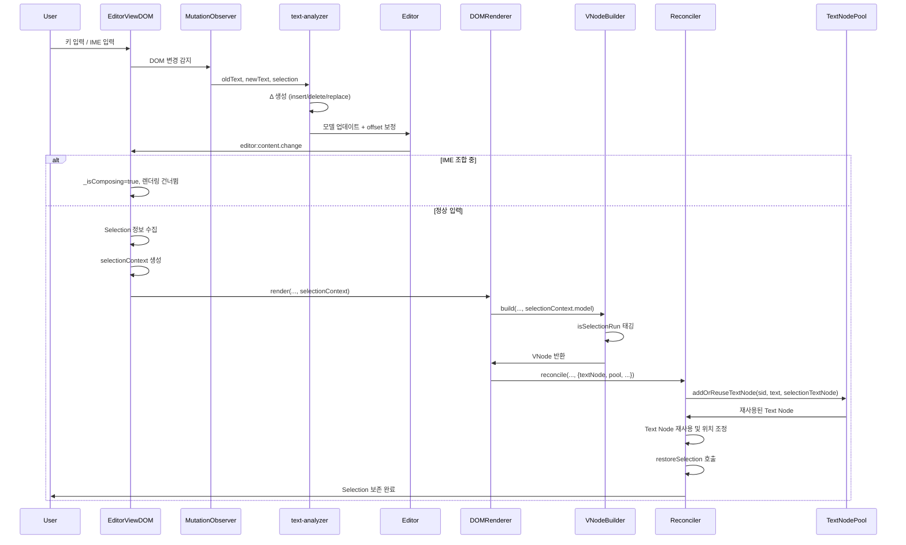

### 4.5 TextNodePool 사용 타이밍

**Pool 초기화**:
```typescript
// renderer-dom/src/dom-renderer.ts

constructor(registry?: RendererRegistry, _options?: DOMRendererOptions) {
  // ...
  if (_options?.enableSelectionPreservation) {
    this.selectionTextNodePool = new SidTextNodePool();
  }
}
```

```typescript
// editor-view-dom/src/editor-view-dom.ts

private _setupContentRenderer(options: EditorViewDOMOptions): void {
  // Content 레이어용 DOMRenderer는 항상 enableSelectionPreservation 활성화
  this._domRenderer = new DOMRenderer(this._rendererRegistry, {
    enableSelectionPreservation: true
  });
}
```

**활성화 조건**:
- Content 레이어 렌더링 시에만 Pool 사용
- 다른 레이어(Decorator, Selection, Context, Custom)는 Pool 사용 안 함

**Pool 사용 흐름**:
```typescript
// 1. 렌더링 전: Selection 정보 수집
const selectionContext = collectSelectionContext();

// 2. DOMRenderer.render 호출 시 selectionContext 전달
this._domRenderer?.render(
  this.layers.content, 
  modelData, 
  allDecorators, 
  undefined, 
  selectionContext  // textNode, restoreSelection, model 포함
);

// 3. DOMRenderer 내부에서 Pool과 함께 Reconciler에 전달
const reconcilerSelectionContext = this.selectionTextNodePool
  ? { ...(selection || {}), pool: this.selectionTextNodePool }
  : selection;
this.reconciler.reconcile(..., reconcilerSelectionContext);

// 4. Reconciler에서 Pool 사용
if (pool) {
  const candidate = pool.addOrReuseTextNode(
    sid,
    desiredText,
    isSelectionRun ? selectionTextNode : undefined
  );
}
```

## 5. Implementation Details

### 5.1 Reconciler 통합

#### 5.1.1 reconcileVNodeChildren 수정

```typescript
private reconcileVNodeChildren(
  parent: HTMLElement,
  prevVNode: VNode | undefined,
  nextVNode: VNode,
  context?: any,
  isRecursive: boolean = false
): void {
  // 1. Selection이 있는 Text Node 수집
  const activeTextNodes = this.collectActiveTextNodes();
  
  // 2. 기존 로직 (Text Node 재사용 포함)
  const childVNodes = (nextVNode.children || []) as (VNode | string | number)[];
  const nextDomChildren: (HTMLElement | Text)[] = [];
  
  for (let childIndex = 0; childIndex < childVNodes.length; childIndex++) {
    const child = childVNodes[childIndex];
    
    // Text-only VNode 처리
    if (typeof child === 'object' && child !== null && 
        !(child as VNode).tag && (child as VNode).text !== undefined) {
      const childVNode = child as VNode;
      
      // Text Node 재사용 시도
      const textNode = this.findTextNodeToReuse(
        parent,
        childVNode,
        childIndex,
        activeTextNodes
      );
      
      if (textNode) {
        // 기존 Text Node 재사용 (textContent만 업데이트)
        textNode.textContent = String(childVNode.text);
        nextDomChildren.push(textNode);
      } else {
        // 새 Text Node 생성
        const newTextNode = document.createTextNode(String(childVNode.text));
        const referenceNode = childIndex < Array.from(parent.childNodes).length 
          ? Array.from(parent.childNodes)[childIndex] 
          : null;
        parent.insertBefore(newTextNode, referenceNode);
        nextDomChildren.push(newTextNode);
      }
      continue;
    }
    
    // Element VNode 처리 (기존 로직)
    // ...
  }
  
  // 3. Stale Node 제거 (Selection이 있는 Text Node 보호)
  this.removeStale(parent, new Set(nextDomChildren), context, prevMap, activeTextNodes);
}
```

### 5.2 Mark/Decorator 구조 변경 시 Text Node 보존

Mark/Decorator 구조가 변경되어도 실제 Text Node는 재사용:

```typescript
// 예시: Bold mark 추가
// Before: <span>Hello</span>
// After:  <span><strong><span>Hello</span></strong></span>

// Text Node "Hello"는 재사용됨
// - 기존 Text Node를 찾아서
// - 새로운 <strong> 요소 안으로 이동
// - Selection이 유지됨 ✅
```

구현:

```typescript
private reconcileMarkDecoratorStructure(
  parent: HTMLElement,
  vnode: VNode,
  activeTextNodes: Set<Text>
): void {
  // 1. 기존 Text Node 찾기
  const existingTextNodes = this.findExistingTextNodesInSubtree(parent, activeTextNodes);
  
  // 2. Mark/Decorator 구조 생성
  const markWrapper = this.createMarkWrapper(vnode);
  
  // 3. 기존 Text Node를 새 구조로 이동
  for (const textNode of existingTextNodes) {
    markWrapper.appendChild(textNode);  // 이동 (복사 아님)
  }
  
  // 4. 새 구조를 DOM에 추가
  parent.appendChild(markWrapper);
}
```

### 5.3 Selection이 있는 Text Node 유지 알고리즘

Selection이 있는 Text Node가 다양한 변화에 맞게 유지되는 알고리즘을 설계한다.

#### 5.3.1 기본 원칙

1. **Selection이 있는 Text Node는 절대 삭제하지 않음**
2. **Text Node의 참조는 유지하되, 위치와 내용만 업데이트**
3. **Mark/Decorator 구조 변경 시에도 Text Node는 재사용**

#### 5.3.2 텍스트 내용 변경 시

사용자가 텍스트를 입력하여 내용이 변경될 때:

```typescript
/**
 * 텍스트 내용 변경 시 Selection이 있는 Text Node 유지
 * 
 * 시나리오:
 * 1. 사용자가 "Hello" 입력 → Text Node: "Hello"
 * 2. 사용자가 " World" 추가 입력 → Text Node: "Hello World"
 * 3. Reconciler가 DOM 업데이트 → Text Node 재사용 ✅
 */
private handleTextContentChange(
  textNode: Text,
  newContent: string,
  activeTextNodes: Set<Text>
): void {
  // Selection이 있는 Text Node인지 확인
  if (activeTextNodes.has(textNode)) {
    // textContent만 업데이트 (노드 자체는 유지)
    textNode.textContent = newContent;
    // Selection이 유지됨 (같은 Text Node 참조)
  } else {
    // Selection이 없는 경우 정상 업데이트
    textNode.textContent = newContent;
  }
}
```

#### 5.3.3 Mark/Decorator 구조 변경 시

Mark가 추가/제거되거나 Decorator가 변경될 때:

```typescript
/**
 * Mark/Decorator 구조 변경 시 Selection이 있는 Text Node 유지
 * 
 * 시나리오:
 * Before: <span>Hello</span>
 * After:  <span><strong><span>Hello</span></strong></span>
 * 
 * Text Node "Hello"는 재사용되고, 새로운 <strong> wrapper로 이동
 */
private handleMarkDecoratorStructureChange(
  textNode: Text,
  newParent: HTMLElement,
  newIndex: number,
  activeTextNodes: Set<Text>
): void {
  // Selection이 있는 Text Node인지 확인
  if (activeTextNodes.has(textNode)) {
    const currentParent = textNode.parentNode;
    
    // 1. Text Node를 새 구조로 이동 (복사 아님)
    if (currentParent !== newParent) {
      // 다른 parent로 이동
      const referenceNode = newIndex < newParent.childNodes.length
        ? newParent.childNodes[newIndex]
        : null;
      newParent.insertBefore(textNode, referenceNode);
    } else {
      // 같은 parent 내에서 위치만 조정
      const siblings = Array.from(newParent.childNodes);
      const currentIndex = siblings.indexOf(textNode);
      
      if (currentIndex !== newIndex) {
        const referenceNode = newIndex < siblings.length
          ? siblings[newIndex]
          : null;
        newParent.insertBefore(textNode, referenceNode);
      }
    }
    
    // 2. Selection이 유지됨 (같은 Text Node 참조)
    // 브라우저 Selection은 여전히 같은 Text Node를 가리킴
  } else {
    // Selection이 없는 경우 정상 처리
    this.adjustTextNodePosition(textNode, newParent, newIndex);
  }
}
```

#### 5.3.4 Text Node 분리/병합 시

텍스트가 분리되거나 병합될 때:

```typescript
/**
 * Text Node 분리/병합 시 Selection이 있는 Text Node 유지
 * 
 * 시나리오 1: 분리
 * Before: <span>Hello World</span> (Text Node: "Hello World")
 * After:  <span>Hello</span><span> World</span>
 *         (Text Node 1: "Hello", Text Node 2: " World")
 * 
 * 시나리오 2: 병합
 * Before: <span>Hello</span><span> World</span>
 * After:  <span>Hello World</span> (Text Node: "Hello World")
 */
private handleTextNodeSplitMerge(
  originalTextNode: Text,
  newTextNodes: Text[],
  activeTextNodes: Set<Text>
): void {
  // Selection이 있는 Text Node인지 확인
  if (activeTextNodes.has(originalTextNode)) {
    const selection = window.getSelection();
    if (!selection || selection.rangeCount === 0) return;
    
    const range = selection.getRangeAt(0);
    const originalOffset = range.startOffset;
    const originalText = originalTextNode.textContent || '';
    
    // 1. Selection 위치를 새 Text Node로 매핑
    let currentOffset = 0;
    let targetTextNode: Text | null = null;
    let targetOffset = 0;
    
    for (const newNode of newTextNodes) {
      const newNodeLength = newNode.textContent?.length || 0;
      
      if (originalOffset >= currentOffset && 
          originalOffset < currentOffset + newNodeLength) {
        // Selection이 이 Text Node에 있음
        targetTextNode = newNode;
        targetOffset = originalOffset - currentOffset;
        break;
      }
      
      currentOffset += newNodeLength;
    }
    
    // 2. Selection을 새 Text Node로 업데이트
    if (targetTextNode) {
      const newRange = document.createRange();
      newRange.setStart(targetTextNode, targetOffset);
      newRange.setEnd(targetTextNode, targetOffset);
      selection.removeAllRanges();
      selection.addRange(newRange);
      
      // activeTextNodes 업데이트
      activeTextNodes.delete(originalTextNode);
      activeTextNodes.add(targetTextNode);
    }
  }
}
```

#### 4.3.5 복잡한 구조 변경 시

여러 Mark/Decorator가 중첩되거나 복잡한 구조 변경 시:

```typescript
/**
 * 복잡한 구조 변경 시 Selection이 있는 Text Node 유지
 * 
 * 시나리오:
 * Before: <span><strong>Hello</strong> World</span>
 * After:  <span><em><strong>Hello</strong></em> World</span>
 * 
 * Text Node "Hello"는 재사용되고, <em> wrapper가 추가됨
 */
private handleComplexStructureChange(
  textNode: Text,
  newStructure: VNode,
  activeTextNodes: Set<Text>
): void {
  // Selection이 있는 Text Node인지 확인
  if (activeTextNodes.has(textNode)) {
    // 1. 새 구조에서 Text Node가 위치할 곳 찾기
    const targetPath = this.findTextNodePathInVNode(newStructure, textNode);
    
    if (targetPath) {
      // 2. 새 구조를 DOM에 생성 (Text Node는 재사용)
      const newDOM = this.buildDOMFromVNode(newStructure, {
        reuseTextNode: (vnode: VNode) => {
          // VNode가 기존 Text Node와 매칭되면 재사용
          if (this.matchesTextNode(vnode, textNode)) {
            return textNode;  // 기존 Text Node 재사용
          }
          return null;  // 새 Text Node 생성
        }
      });
      
      // 3. 기존 구조를 새 구조로 교체
      const currentParent = textNode.parentNode;
      if (currentParent) {
        currentParent.replaceWith(newDOM);
      }
      
      // 4. Selection이 유지됨 (같은 Text Node 참조)
    }
  }
}
```

#### 4.3.6 통합 알고리즘

위의 모든 케이스를 통합한 알고리즘:

```typescript
/**
 * Selection이 있는 Text Node 유지 통합 알고리즘
 */
private preserveSelectionTextNodes(
  parent: HTMLElement,
  nextVNode: VNode,
  prevVNode: VNode | undefined,
  activeTextNodes: Set<Text>
): void {
  // 1. Selection이 있는 Text Node 수집
  const selection = window.getSelection();
  if (selection && selection.rangeCount > 0) {
    const range = selection.getRangeAt(0);
    if (range.startContainer.nodeType === Node.TEXT_NODE) {
      activeTextNodes.add(range.startContainer as Text);
    }
    if (range.endContainer.nodeType === Node.TEXT_NODE && 
        range.endContainer !== range.startContainer) {
      activeTextNodes.add(range.endContainer as Text);
    }
  }
  
  // 2. VNode 트리를 순회하며 Text Node 매핑
  const textNodeMap = this.buildTextNodeMap(nextVNode, parent, activeTextNodes);
  
  // 3. 각 Text Node에 대해 적절한 처리
  for (const [vnode, textNode] of textNodeMap.entries()) {
    if (activeTextNodes.has(textNode)) {
      // Selection이 있는 Text Node
      
      // 3.1 텍스트 내용 변경 확인
      const newContent = this.extractTextFromVNode(vnode);
      if (textNode.textContent !== newContent) {
        this.handleTextContentChange(textNode, newContent, activeTextNodes);
      }
      
      // 3.2 구조 변경 확인
      const newParent = this.findTargetParent(vnode, parent);
      const newIndex = this.findTargetIndex(vnode, newParent);
      
      if (textNode.parentNode !== newParent || 
          Array.from(newParent.childNodes).indexOf(textNode) !== newIndex) {
        this.handleMarkDecoratorStructureChange(
          textNode, 
          newParent, 
          newIndex, 
          activeTextNodes
        );
      }
    } else {
      // Selection이 없는 Text Node는 정상 처리
      this.handleNormalTextNode(vnode, textNode, parent);
    }
  }
  
  // 4. Stale Text Node 제거 (Selection이 있는 것은 제외)
  this.removeStaleTextNodes(parent, textNodeMap.values(), activeTextNodes);
}

/**
 * VNode에서 Text Node 매핑 구축
 */
private buildTextNodeMap(
  vnode: VNode,
  parent: HTMLElement,
  activeTextNodes: Set<Text>
): Map<VNode, Text> {
  const map = new Map<VNode, Text>();
  const allTextNodes = this.findAllTextNodesInSubtree(parent);
  
  // VNode 트리를 순회하며 기존 Text Node와 매칭
  this.traverseVNode(vnode, (vnode) => {
    if (this.isTextVNode(vnode)) {
      // 기존 Text Node 찾기
      const matched = this.findMatchingTextNode(
        vnode, 
        allTextNodes, 
        activeTextNodes
      );
      
      if (matched) {
        map.set(vnode, matched);
      }
    }
  });
  
  return map;
}

/**
 * Text Node 매칭 로직
 */
private findMatchingTextNode(
  vnode: VNode,
  existingTextNodes: Text[],
  activeTextNodes: Set<Text>
): Text | null {
  const vnodeText = this.extractTextFromVNode(vnode);
  
  // 우선순위 1: Selection이 있는 Text Node (내용이 일치하는 경우)
  for (const textNode of activeTextNodes) {
    if (textNode.textContent === vnodeText || 
        this.isPartialMatch(textNode.textContent || '', vnodeText)) {
      return textNode;
    }
  }
  
  // 우선순위 2: 위치와 내용이 일치하는 기존 Text Node
  for (const textNode of existingTextNodes) {
    if (textNode.textContent === vnodeText) {
      return textNode;
    }
  }
  
  return null;
}
```

#### 4.3.7 Text Node 위치 조정

Mark/Decorator 구조 변경 시 Text Node의 위치를 조정:

```typescript
private adjustTextNodePosition(
  textNode: Text,
  targetParent: HTMLElement,
  targetIndex: number
): void {
  const currentParent = textNode.parentNode;
  
  if (currentParent === targetParent) {
    // 같은 parent 내에서 위치만 조정
    const siblings = Array.from(targetParent.childNodes);
    const currentIndex = siblings.indexOf(textNode);
    
    if (currentIndex !== targetIndex) {
      const referenceNode = targetIndex < siblings.length 
        ? siblings[targetIndex] 
        : null;
      targetParent.insertBefore(textNode, referenceNode);
    }
  } else {
    // 다른 parent로 이동
    const referenceNode = targetIndex < targetParent.childNodes.length
      ? targetParent.childNodes[targetIndex]
      : null;
    targetParent.insertBefore(textNode, referenceNode);
  }
}
```

### 5.4 MutationObserver × text-analyzer × Δ 보정 통합

편집 중 파이프라인을 다음 순서로 결합한다. 세부 규칙은 9.14(Δ/보정), 9.14.7(text-analyzer 통합)을 참고한다.

**전체 흐름**:

1. **Selection 수집**: 현재 브라우저 Selection에서 `activeTextNodes`와 `selectionOffset`/`selectionLength` 획득
2. **MutationObserver**: 동일 sid 호스트의 `oldText`와 `newText` 수집 (IME `isComposing` 고려)
3. **text-analyzer 분석**: `analyzeTextChanges` 호출하여 `TextChange[]` 계산 (O(n) 시간 복잡도, Selection 바이어싱, 유니코드 안전 처리)
4. **Δ 변환**: `TextChange`를 `Delta` 형식으로 변환 (insert/delete/replace 분해)
5. **보정 단계**: Δ를 기반으로 즉시 보정
   - **mark range**: 모델에 저장된 mark의 `[start, end)` 범위 보정
   - **inline decorator offset**: editor-view-dom 스토어에 저장된 inline decorator의 `offset` 보정
   - **target decorator 위치**: editor-view-dom 스토어의 target 형 decorator에 대해 앵커/포지션 재계산
6. **렌더/리컨실**: 갱신된 모델로 VNode 생성 → Reconciler는 Text Node Pool로 기존 Text 재사용하여 selection 유지

**주의사항**:

- **sid 안정성**: sid는 편집 단위에서 안정적으로 유지되어야 한다. 동일 텍스트 단위는 재렌더링 동안 sid가 변경되지 않아야 한다.
- **IME 조합 중 처리**: IME 조합 중(`isComposing`)에는 Δ를 누적하고, Text Node Pool 정리 및 교체를 보류한다. 조합 종료 시 일괄 보정을 수행한다.
- **동일 틱 실행**: Selection 수집 → Δ 적용 → 렌더가 같은 틱에서 일관되게 실행되어야 한다. 비동기 처리로 인한 타이밍 이슈를 방지한다.

**구현 예시**:

```typescript
// MutationObserver 콜백
function handleTextContentChange(mutation: MutationRecord) {
  const textNode = mutation.target as Text;
  const oldText = mutation.oldValue || '';
  const newText = textNode.textContent || '';
  const sid = getSidFromTextNode(textNode);
  
  // Selection 정보 수집
  const selection = window.getSelection();
  const selectionOffset = selection?.getRangeAt(0)?.startOffset || 0;
  const selectionLength = selection?.getRangeAt(0)?.toString().length || 0;
  
  // text-analyzer로 TextChange 분석
  const changes = analyzeTextChanges({
    oldText,
    newText,
    selectionOffset,
    selectionLength
  });
  
  // Δ 변환
  const deltas: Delta[] = convertTextChangesToDeltas(changes, sid);
  
  // 오프셋 보정
  // 1. 모델의 mark range 보정
  applyDeltasToMarks(deltas, sid);
  
  // 2. editor-view-dom의 inline decorator offset 보정
  applyDeltasToDecorators(deltas, sid);
  
  // 모델 업데이트 및 렌더링
  updateModel(textNode, newText);
  render();
}
```

## 6. Algorithm Design: Selection Text Node Preservation

### 6.1 알고리즘 개요

Selection이 있는 Text Node를 다양한 변화에 맞게 유지하는 알고리즘은 다음 단계로 구성된다:

1. **Selection 감지**: 현재 Selection이 참조하는 Text Node 수집
2. **Text Node 매핑**: VNode와 기존 Text Node 간 매핑 구축
3. **변화 감지**: 텍스트 내용, 구조, 위치 변경 감지
4. **적응적 업데이트**: Selection이 있는 Text Node는 재사용, 없는 것은 정상 처리
5. **Stale 제거**: 사용되지 않는 Text Node 제거 (Selection이 있는 것은 제외)

#### 5.1.1 전체 알고리즘 플로우

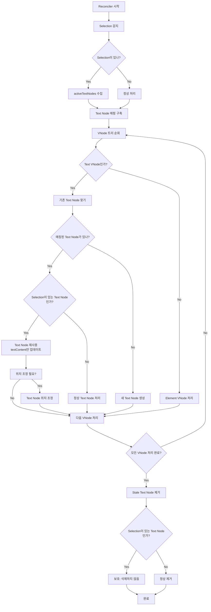

#### 5.1.2 Text Node 매핑 프로세스 (sid 기반)

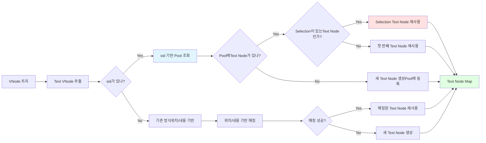

#### 5.1.3 Selection 보존 프로세스

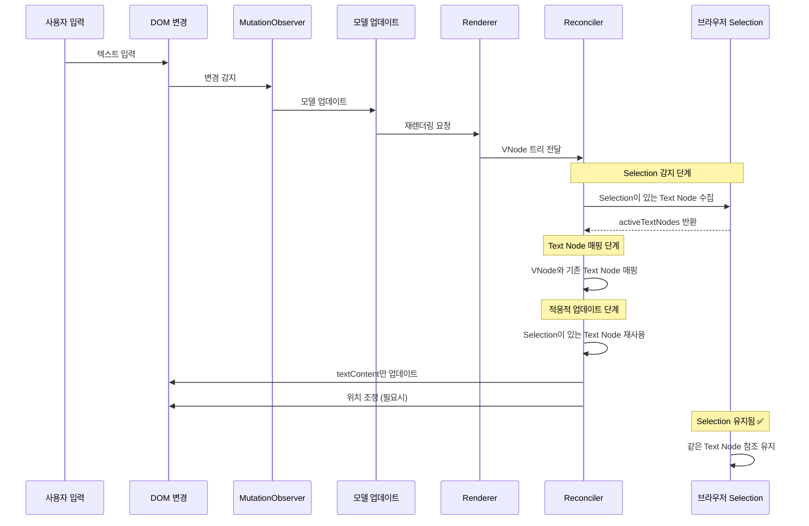

### 6.2 슈도 코드

#### 5.2.1 전체 알고리즘 슈도 코드 (sid 기반)

```
ALGORITHM preserveSelectionTextNodes(parent, nextVNode, prevVNode, textNodePool)
INPUT:
  - parent: HTMLElement (부모 DOM 요소)
  - nextVNode: VNode (새로운 VNode 트리)
  - prevVNode: VNode | undefined (이전 VNode 트리)
  - textNodePool: TextNodePool (sid 기반 Text Node Pool)

OUTPUT: Selection이 유지된 DOM 업데이트

BEGIN
  // 1. Selection 감지
  activeTextNodes ← collectActiveTextNodes()
  
  // 2. Selection이 있는 Text Node의 sid 수집
  activeSids ← empty Set
  FOR EACH textNode IN activeTextNodes DO
    sid ← textNodePool.findSidForActiveTextNode(textNode)
    IF sid ≠ null THEN
      activeSids.add(sid)
    END IF
  END FOR
  
  // 3. sid 기반 Text Node 매핑 구축
  textNodeMap ← buildTextNodeMapBySid(nextVNode, parent, activeTextNodes, textNodePool)
  
  // 4. 각 VNode에 대해 처리
  FOR EACH (vnode, textNode) IN textNodeMap DO
    sid ← extractSidFromVNode(vnode)
    
    IF activeSids.contains(sid) THEN
      // Selection이 있는 Text Node (sid 기반 확인)
      newContent ← extractTextFromVNode(vnode)
      
      // 텍스트 내용 변경 확인
      IF textNode.textContent ≠ newContent THEN
        textNode.textContent ← newContent
      END IF
      
      // 구조 변경 확인
      newParent ← findTargetParent(vnode, parent)
      newIndex ← findTargetIndex(vnode, newParent)
      
      IF textNode.parentNode ≠ newParent OR 
         getIndex(textNode) ≠ newIndex THEN
        moveTextNode(textNode, newParent, newIndex)
      END IF
    ELSE
      // Selection이 없는 Text Node는 정상 처리
      handleNormalTextNode(vnode, textNode, parent)
    END IF
  END FOR
  
  // 5. 새 Text Node 생성 (매칭되지 않은 VNode)
  createNewTextNodes(nextVNode, textNodeMap, parent, textNodePool)
  
  // 6. Stale Text Node 제거 (sid 기반)
  FOR EACH sid IN textNodePool.getAllSids() DO
    textNodes ← textNodePool.getTextNodesBySid(sid)
    
    // 현재 VNode에 해당 sid가 있는지 확인
    IF NOT hasVNodeWithSid(nextVNode, sid) THEN
      // 더 이상 사용되지 않는 sid
      FOR EACH textNode IN textNodes DO
        IF NOT activeTextNodes.contains(textNode) THEN
          // Selection이 없는 Text Node만 제거
          removeTextNode(textNode)
          textNodePool.unregisterTextNode(sid, textNode)
        END IF
      END FOR
    END IF
  END FOR
END
```

#### 5.2.2 Selection Text Node 수집 슈도 코드

```
ALGORITHM collectActiveTextNodes()
OUTPUT: Set<Text> (Selection이 있는 Text Node 집합)

BEGIN
  activeTextNodes ← empty Set
  
  selection ← window.getSelection()
  
  IF selection ≠ null AND selection.rangeCount > 0 THEN
    range ← selection.getRangeAt(0)
    
    // anchorNode가 Text Node인 경우
    IF range.anchorNode.nodeType = TEXT_NODE THEN
      activeTextNodes.add(range.anchorNode)
    END IF
    
    // focusNode가 Text Node인 경우 (다를 때만)
    IF range.focusNode.nodeType = TEXT_NODE AND 
       range.focusNode ≠ range.anchorNode THEN
      activeTextNodes.add(range.focusNode)
    END IF
  END IF
  
  RETURN activeTextNodes
END
```

#### 5.2.3 Text Node 매핑 구축 슈도 코드 (sid 기반)

```
ALGORITHM buildTextNodeMapBySid(nextVNode, parent, activeTextNodes, textNodePool)
INPUT:
  - nextVNode: VNode (새로운 VNode 트리)
  - parent: HTMLElement (부모 DOM 요소)
  - activeTextNodes: Set<Text> (Selection이 있는 Text Node 집합)
  - textNodePool: TextNodePool (sid 기반 Text Node Pool)

OUTPUT: Map<VNode, Text> (VNode와 Text Node의 매핑)

BEGIN
  map ← empty Map
  
  // 1. Selection이 있는 Text Node의 sid 수집
  FOR EACH textNode IN activeTextNodes DO
    sid ← textNodePool.findSidForActiveTextNode(textNode)
    IF sid ≠ null THEN
      // sid 기반 Pool에서 Text Node 찾기
      matched ← textNodePool.reuseTextNodeBySid(sid, null)
      IF matched ≠ null THEN
        // VNode를 찾아서 매핑 (나중에 처리)
        // 일단 sid → Text Node 매핑 저장
        activeSidToTextNode.put(sid, matched)
      END IF
    END IF
  END FOR
  
  // 2. VNode 트리를 순회하며 sid 기반 매칭
  FOR EACH vnode IN traverseVNodeTree(nextVNode) DO
    IF isTextVNode(vnode) THEN
      sid ← extractSidFromVNode(vnode)
      
      IF sid ≠ null THEN
        // sid 기반으로 Text Node 찾기
        matched ← textNodePool.reuseTextNodeBySid(sid, vnode)
        
        IF matched ≠ null THEN
          map.put(vnode, matched)
        ELSE
          // 새 Text Node 생성 및 Pool에 등록
          newTextNode ← createNewTextNode(vnode)
          textNodePool.registerTextNode(sid, newTextNode)
          map.put(vnode, newTextNode)
        END IF
      ELSE
        // sid가 없는 경우 기존 방식 사용 (fallback)
        matched ← findMatchingTextNodeByContent(vnode, parent, activeTextNodes)
        IF matched ≠ null THEN
          map.put(vnode, matched)
        ELSE
          newTextNode ← createNewTextNode(vnode)
          map.put(vnode, newTextNode)
        END IF
      END IF
    END IF
  END FOR
  
  RETURN map
END

ALGORITHM findMatchingTextNodeBySid(sid, textNodePool, activeTextNodes)
INPUT:
  - sid: string (모델의 고유 식별자)
  - textNodePool: TextNodePool (sid 기반 Text Node Pool)
  - activeTextNodes: Set<Text> (Selection이 있는 Text Node 집합)

OUTPUT: Text | null (매칭된 Text Node 또는 null)

BEGIN
  // sid 기반으로 Text Node Pool에서 찾기
  textNodes ← textNodePool.getTextNodesBySid(sid)
  
  IF textNodes = null OR textNodes.length = 0 THEN
    RETURN null
  END IF
  
  // 우선순위 1: Selection이 있는 Text Node
  FOR EACH textNode IN textNodes DO
    IF activeTextNodes.contains(textNode) THEN
      RETURN textNode
    END IF
  END FOR
  
  // 우선순위 2: 첫 번째 Text Node 재사용
  RETURN textNodes[0]
END
```

**기존 방식 (위치/내용 기반)과의 비교**:

```
// 기존 방식 (위치/내용 기반)
ALGORITHM findMatchingTextNode(vnode, existingTextNodes, activeTextNodes)
  // O(n) 순회 - 모든 Text Node 확인
  FOR EACH textNode IN existingTextNodes DO
    IF textNode.textContent = vnodeText THEN
      RETURN textNode
    END IF
  END FOR
END

// sid 기반 방식
ALGORITHM findMatchingTextNodeBySid(sid, textNodePool, activeTextNodes)
  // O(1) 조회 - Map 기반
  textNodes ← textNodePool.getTextNodesBySid(sid)
  RETURN textNodes[0]  // 또는 Selection이 있는 것
END
```

**성능 비교**:
- **기존 방식**: O(n * m) - n은 VNode 개수, m은 Text Node 개수
- **sid 기반 방식**: O(n) - VNode 순회만 필요, Text Node 조회는 O(1)

#### 5.2.4 Text Node 분리/병합 처리 슈도 코드

```
ALGORITHM handleTextNodeSplitMerge(originalTextNode, newTextNodes, activeTextNodes)
INPUT:
  - originalTextNode: Text (원본 Text Node)
  - newTextNodes: List<Text> (새로운 Text Node 목록)
  - activeTextNodes: Set<Text> (Selection이 있는 Text Node 집합)

BEGIN
  IF NOT activeTextNodes.contains(originalTextNode) THEN
    RETURN  // Selection이 없는 Text Node는 처리하지 않음
  END IF
  
  selection ← window.getSelection()
  IF selection = null OR selection.rangeCount = 0 THEN
    RETURN
  END IF
  
  range ← selection.getRangeAt(0)
  originalOffset ← range.startOffset
  
  // Selection 위치를 새 Text Node로 매핑
  currentOffset ← 0
  targetTextNode ← null
  targetOffset ← 0
  
  FOR EACH newNode IN newTextNodes DO
    newNodeLength ← length(newNode.textContent)
    
    IF originalOffset ≥ currentOffset AND 
       originalOffset < currentOffset + newNodeLength THEN
      // Selection이 이 Text Node에 있음
      targetTextNode ← newNode
      targetOffset ← originalOffset - currentOffset
      BREAK
    END IF
    
    currentOffset ← currentOffset + newNodeLength
  END FOR
  
  // Selection을 새 Text Node로 업데이트
  IF targetTextNode ≠ null THEN
    newRange ← document.createRange()
    newRange.setStart(targetTextNode, targetOffset)
    newRange.setEnd(targetTextNode, targetOffset)
    selection.removeAllRanges()
    selection.addRange(newRange)
    
    // activeTextNodes 업데이트
    activeTextNodes.remove(originalTextNode)
    activeTextNodes.add(targetTextNode)
  END IF
END
```

### 6.3 핵심 알고리즘

#### 5.3.1 Selection Text Node 수집

```typescript
/**
 * Selection이 있는 Text Node 수집
 * 
 * 시간 복잡도: O(1)
 * 공간 복잡도: O(1) - 최대 2개 (anchorNode, focusNode)
 */
function collectActiveTextNodes(): Set<Text> {
  const activeTextNodes = new Set<Text>();
  const selection = window.getSelection();
  
  if (selection && selection.rangeCount > 0) {
    const range = selection.getRangeAt(0);
    
    // anchorNode가 Text Node인 경우
    if (range.anchorNode?.nodeType === Node.TEXT_NODE) {
      activeTextNodes.add(range.anchorNode as Text);
    }
    
    // focusNode가 Text Node인 경우 (다를 때만)
    if (range.focusNode?.nodeType === Node.TEXT_NODE && 
        range.focusNode !== range.anchorNode) {
      activeTextNodes.add(range.focusNode as Text);
    }
  }
  
  return activeTextNodes;
}
```

#### 5.3.2 Text Node 매핑 구축 (sid 기반)

```typescript
/**
 * VNode와 기존 Text Node 간 매핑 구축 (sid 기반)
 * 
 * 매핑 전략:
 * 1. sid 기반 Pool 조회 (O(1))
 * 2. Selection이 있는 Text Node 우선 매칭
 * 3. Fallback: 위치와 내용 기반 매칭 (sid가 없는 경우)
 * 
 * 시간 복잡도: O(n) - n은 VNode 개수, Text Node 조회는 O(1)
 * 공간 복잡도: O(n)
 */
function buildTextNodeMapBySid(
  nextVNode: VNode,
  parent: HTMLElement,
  activeTextNodes: Set<Text>,
  textNodePool: TextNodePool
): Map<VNode, Text> {
  const map = new Map<VNode, Text>();
  
  // VNode 트리를 순회하며 sid 기반 매칭
  traverseVNodeTree(nextVNode, (vnode) => {
    if (isTextVNode(vnode)) {
      const sid = extractSidFromVNode(vnode);
      
      if (sid) {
        // sid 기반으로 Text Node 찾기
        const matched = textNodePool.reuseTextNodeBySid(sid, vnode);
        
        if (matched) {
          map.set(vnode, matched);
        } else {
          // 새 Text Node 생성 및 Pool에 등록
          const newTextNode = document.createTextNode(extractTextFromVNode(vnode));
          textNodePool.registerTextNode(sid, newTextNode);
          map.set(vnode, newTextNode);
        }
      } else {
        // sid가 없는 경우 기존 방식 사용 (fallback)
        const matched = findMatchingTextNodeByContent(vnode, parent, activeTextNodes);
        if (matched) {
          map.set(vnode, matched);
        } else {
          const newTextNode = document.createTextNode(extractTextFromVNode(vnode));
          map.set(vnode, newTextNode);
        }
      }
    }
  });
  
  return map;
}

/**
 * 기존 방식 (위치/내용 기반) - Fallback용
 * 
 * 시간 복잡도: O(n * m) - n은 VNode 개수, m은 기존 Text Node 개수
 */
function buildTextNodeMap(
  nextVNode: VNode,
  parent: HTMLElement,
  activeTextNodes: Set<Text>
): Map<VNode, Text> {
  const map = new Map<VNode, Text>();
  const existingTextNodes = findAllTextNodesInSubtree(parent);
  
  // VNode 트리를 순회하며 Text Node 매칭
  traverseVNodeTree(nextVNode, (vnode) => {
    if (isTextVNode(vnode)) {
      const matched = findMatchingTextNode(
        vnode,
        existingTextNodes,
        activeTextNodes
      );
      
      if (matched) {
        map.set(vnode, matched);
        // 매칭된 Text Node는 제거하여 중복 매칭 방지
        const index = existingTextNodes.indexOf(matched);
        if (index > -1) {
          existingTextNodes.splice(index, 1);
        }
      }
    }
  });
  
  return map;
}

/**
 * Text Node 매칭 로직
 * 
 * 우선순위:
 * 1. Selection이 있는 Text Node (내용 일치 또는 부분 일치)
 * 2. 위치와 내용이 일치하는 기존 Text Node
 * 3. 부분 매칭 (텍스트가 분리/병합된 경우)
 */
function findMatchingTextNode(
  vnode: VNode,
  existingTextNodes: Text[],
  activeTextNodes: Set<Text>
): Text | null {
  const vnodeText = extractTextFromVNode(vnode);
  
  // 우선순위 1: Selection이 있는 Text Node
  for (const textNode of activeTextNodes) {
    if (textNode.textContent === vnodeText) {
      return textNode;  // 완전 일치
    }
    
    // 부분 일치 확인 (텍스트가 분리/병합된 경우)
    if (isPartialMatch(textNode.textContent || '', vnodeText)) {
      return textNode;
    }
  }
  
  // 우선순위 2: 위치와 내용이 일치하는 기존 Text Node
  for (const textNode of existingTextNodes) {
    if (textNode.textContent === vnodeText) {
      return textNode;
    }
  }
  
  return null;
}
```

#### 5.3.2 Text Node 매핑 구축

```typescript
/**
 * 변화 감지 및 적응적 업데이트
 * 
 * 변화 유형:
 * 1. 텍스트 내용 변경
 * 2. Mark/Decorator 구조 변경
 * 3. Text Node 분리/병합
 * 4. 복잡한 구조 변경
 */
function handleChanges(
  textNode: Text,
  vnode: VNode,
  parent: HTMLElement,
  activeTextNodes: Set<Text>
): void {
  if (activeTextNodes.has(textNode)) {
    // Selection이 있는 Text Node
    
    // 1. 텍스트 내용 변경 확인
    const newContent = extractTextFromVNode(vnode);
    if (textNode.textContent !== newContent) {
      handleTextContentChange(textNode, newContent, activeTextNodes);
    }
    
    // 2. 구조 변경 확인
    const newParent = findTargetParent(vnode, parent);
    const newIndex = findTargetIndex(vnode, newParent);
    
    const currentParent = textNode.parentNode as HTMLElement;
    const currentIndex = currentParent 
      ? Array.from(currentParent.childNodes).indexOf(textNode)
      : -1;
    
    if (currentParent !== newParent || currentIndex !== newIndex) {
      handleStructureChange(textNode, newParent, newIndex, activeTextNodes);
    }
  } else {
    // Selection이 없는 Text Node는 정상 처리
    handleNormalTextNode(vnode, textNode, parent);
  }
}
```

#### 5.3.4 Text Node 분리/병합 처리

```typescript
/**
 * Text Node 분리/병합 처리
 * 
 * 시나리오:
 * - 분리: 하나의 Text Node가 여러 개로 분리
 * - 병합: 여러 Text Node가 하나로 병합
 * 
 * Selection 위치를 새 Text Node로 매핑
 */
function handleTextNodeSplitMerge(
  originalTextNode: Text,
  newTextNodes: Text[],
  activeTextNodes: Set<Text>
): void {
  if (!activeTextNodes.has(originalTextNode)) return;
  
  const selection = window.getSelection();
  if (!selection || selection.rangeCount === 0) return;
  
  const range = selection.getRangeAt(0);
  const originalOffset = range.startOffset;
  const originalText = originalTextNode.textContent || '';
  
  // Selection 위치를 새 Text Node로 매핑
  let currentOffset = 0;
  let targetTextNode: Text | null = null;
  let targetOffset = 0;
  
  for (const newNode of newTextNodes) {
    const newNodeLength = newNode.textContent?.length || 0;
    
    if (originalOffset >= currentOffset && 
        originalOffset < currentOffset + newNodeLength) {
      // Selection이 이 Text Node에 있음
      targetTextNode = newNode;
      targetOffset = originalOffset - currentOffset;
      break;
    }
    
    currentOffset += newNodeLength;
  }
  
  // Selection을 새 Text Node로 업데이트
  if (targetTextNode) {
    const newRange = document.createRange();
    newRange.setStart(targetTextNode, targetOffset);
    newRange.setEnd(targetTextNode, targetOffset);
    selection.removeAllRanges();
    selection.addRange(newRange);
    
    // activeTextNodes 업데이트
    activeTextNodes.delete(originalTextNode);
    activeTextNodes.add(targetTextNode);
  }
}
```

#### 5.3.4 Text Node 분리/병합 처리

#### 5.3.5 Text Node 위치 조정 다이어그램

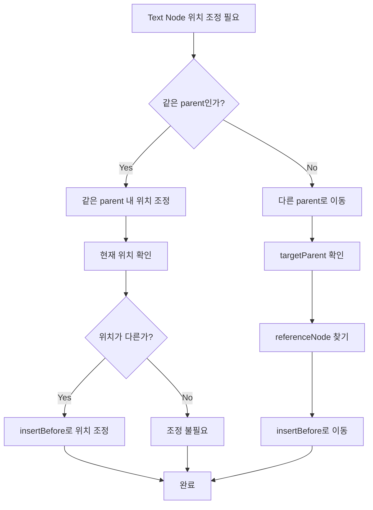

#### 5.3.6 Mark/Decorator 구조 변경 시 Text Node 보존 다이어그램

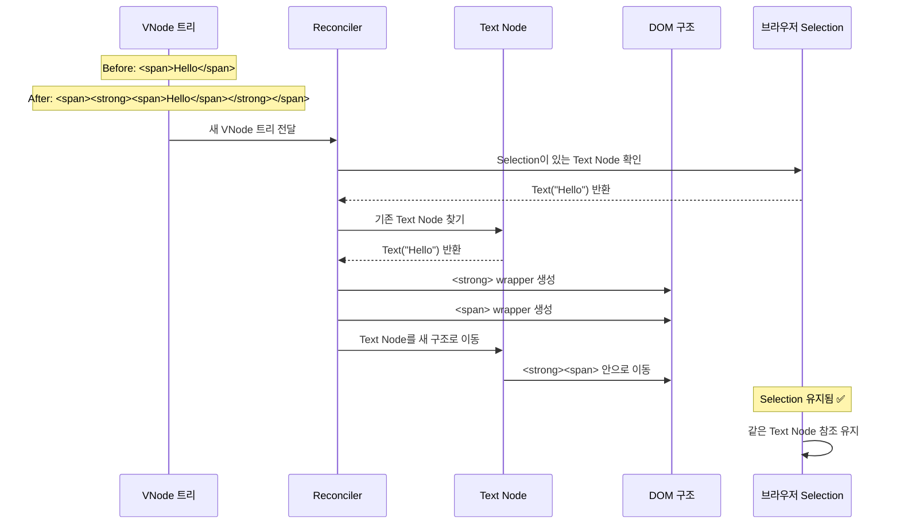

### 6.4 통합 알고리즘

```typescript
/**
 * Selection이 있는 Text Node 유지 통합 알고리즘
 * 
 * 전체 프로세스:
 * 1. Selection 감지
 * 2. Text Node 매핑 구축
 * 3. 변화 감지 및 적응적 업데이트
 * 4. Stale Text Node 제거
 * 
 * 시간 복잡도: O(n * m) - n은 VNode 개수, m은 Text Node 개수
 * 공간 복잡도: O(n + m)
 */
function preserveSelectionTextNodes(
  parent: HTMLElement,
  nextVNode: VNode,
  prevVNode: VNode | undefined
): void {
  // 1. Selection이 있는 Text Node 수집
  const activeTextNodes = collectActiveTextNodes();
  
  // 2. Text Node 매핑 구축
  const textNodeMap = buildTextNodeMap(nextVNode, parent, activeTextNodes);
  
  // 3. 각 Text Node에 대해 적절한 처리
  for (const [vnode, textNode] of textNodeMap.entries()) {
    handleChanges(textNode, vnode, parent, activeTextNodes);
  }
  
  // 4. 새 Text Node 생성 (매칭되지 않은 VNode)
  createNewTextNodes(nextVNode, textNodeMap, parent);
  
  // 5. Stale Text Node 제거 (Selection이 있는 것은 제외)
  removeStaleTextNodes(parent, textNodeMap.values(), activeTextNodes);
}
```

#### 5.4.1 통합 알고리즘 다이어그램 (sid 기반)

```mermaid
flowchart TB
    subgraph Input["입력"]
        A[parent: HTMLElement]
        B[nextVNode: VNode]
        C[prevVNode: VNode | undefined]
        D[textNodePool: TextNodePool]
    end
    
    subgraph Step1["1. Selection 감지"]
        E[window.getSelection]
        F[range.anchorNode 확인]
        G[range.focusNode 확인]
        H[activeTextNodes: Set<Text>]
        I[activeSids: Set<string>]
    end
    
    subgraph Step2["2. sid 기반 Text Node 매핑"]
        J[VNode 트리 순회]
        K[Text VNode 추출]
        L{sid가 있나?}
        M[sid 기반 Pool 조회]
        N[기존 방식위치/내용 기반]
        O[textNodeMap: Map<VNode, Text>]
    end
    
    subgraph Step3["3. 적응적 업데이트"]
        P{activeSids에sid가 있나?}
        Q[textContent 업데이트]
        R[위치 조정]
        S[정상 처리]
    end
    
    subgraph Step4["4. 새 Text Node 생성"]
        T[매칭되지 않은 VNode]
        U[새 Text Node 생성]
        V[Pool에 등록]
    end
    
    subgraph Step5["5. Stale 제거 (sid 기반)"]
        W{현재 VNode에sid가 있나?}
        X{Selection이 있는Text Node인가?}
        Y[보호: 삭제하지 않음]
        Z[정상 제거]
    end
    
    Input --> Step1
    Step1 --> Step2
    Step2 --> Step3
    Step3 --> Step4
    Step4 --> Step5
    
    E --> F
    F --> G
    G --> H
    H --> I
    
    J --> K
    K --> L
    L -->|Yes| M
    L -->|No| N
    M --> O
    N --> O
    
    P -->|Yes| Q
    P -->|No| S
    Q --> R
    
    T --> U
    U --> V
    
    W -->|No| X
    X -->|Yes| Y
    X -->|No| Z
    
    style H fill:#e1f5ff
    style I fill:#e1f5ff
    style O fill:#e1f5ff
    style M fill:#fff4e1
    style Y fill:#ffe1e1
    style Z fill:#e1ffe1
```

#### 5.4.2 Text Node 분리/병합 처리 다이어그램

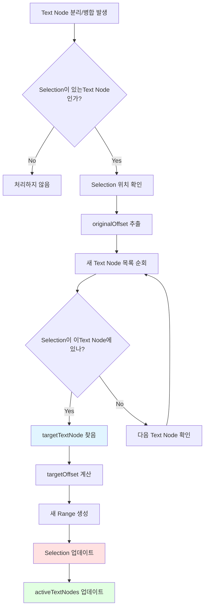

## 7. Evaluation

### 7.1 장점

#### 6.1.1 Selection 안정성

- ✅ **Selection이 깨지지 않음**: Text Node가 삭제되지 않으므로 Selection이 유지됨
- ✅ **브라우저 호환성**: 브라우저 Selection API에 의존하지 않음
- ✅ **복원 불필요**: Selection을 복원할 필요가 없음

#### 6.1.2 성능

- ✅ **DOM 조작 최소화**: Text Node 재사용으로 불필요한 생성/삭제 방지
- ✅ **메모리 효율**: 기존 Text Node 재사용
- ✅ **렌더링 성능**: Text Node 재사용으로 리플로우 최소화

#### 6.1.3 ContentEditable 특성에 부합

- ✅ **편집 중인 Text Node만 변경**: 다른 Text Node는 그대로 유지
- ✅ **Mark/Decorator 범위 조정 가능**: Text Node는 유지하고 구조만 변경
- ✅ **사용자 경험 향상**: 입력 중 Selection이 깨지지 않음

### 7.2 주의사항

#### 6.2.1 Text Node 누적

Text Node가 계속 누적될 수 있음:

```typescript
// 해결: 주기적인 정리 (Selection이 없는 Text Node만)
private cleanupUnusedTextNodes(parent: HTMLElement): void {
  const activeTextNodes = this.collectActiveTextNodes();
  const allTextNodes = this.findAllTextNodes(parent);
  
  for (const textNode of allTextNodes) {
    if (!activeTextNodes.has(textNode) && this.isStale(textNode)) {
      // Selection이 없고 사용되지 않는 Text Node 제거
      textNode.parentNode?.removeChild(textNode);
    }
  }
}
```

#### 6.2.2 Mark/Decorator 구조 변경 시 복잡도

Mark/Decorator 구조가 복잡해질수록 Text Node 위치 조정이 복잡해짐:

```typescript
// 해결: 점진적 업데이트
// 1. 기존 Text Node 위치 파악
// 2. 새 구조 생성
// 3. Text Node를 새 구조로 이동
// 4. 기존 구조 제거
```

### 7.3 성능 분석

#### 6.3.1 시간 복잡도

**sid 기반 방식**:
- **Selection 감지**: O(1) - Selection 객체에서 직접 접근
- **sid 추출**: O(1) - VNode에서 직접 접근
- **Text Node 찾기**: O(1) - Map 기반 조회 (sid → Text Node)
- **Text Node 재사용**: O(1) - textContent만 업데이트
- **Stale 제거**: O(m) - m은 sid 개수 (일반적으로 n보다 작음)

**전체 복잡도**: O(n) - n은 VNode 개수, Text Node 조회는 O(1)

**기존 방식 (위치/내용 기반)**:
- **Selection 감지**: O(1) - Selection 객체에서 직접 접근
- **Text Node 찾기**: O(n * m) - 모든 Text Node 순회
- **Text Node 재사용**: O(1) - textContent만 업데이트
- **Stale 제거**: O(n) - childNodes 순회

**전체 복잡도**: O(n * m) - n은 VNode 개수, m은 Text Node 개수

**성능 개선**: sid 기반 방식이 **O(n * m)에서 O(n)으로 개선**됨

**성능 비교 다이어그램**:

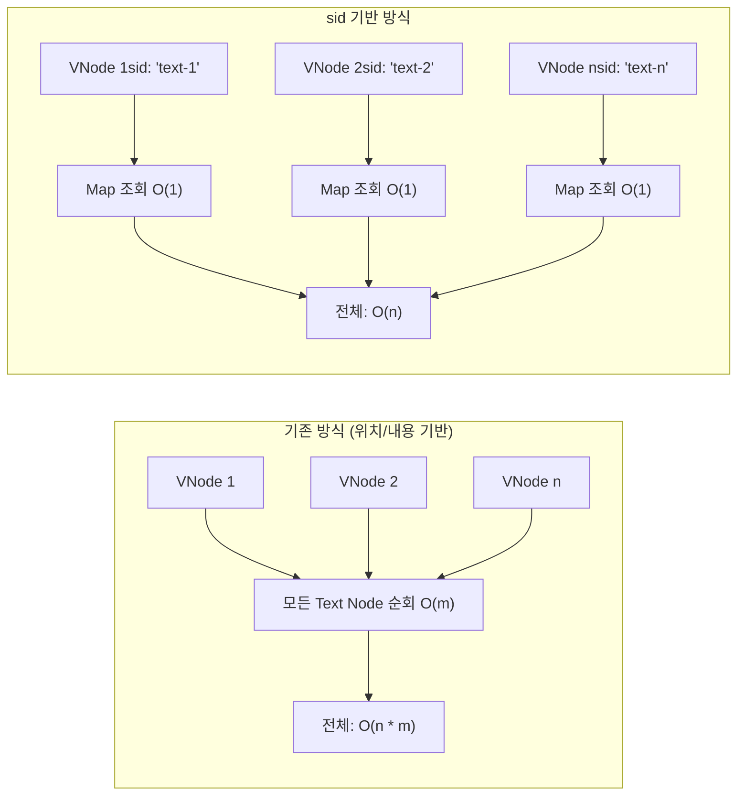

#### 6.3.2 공간 복잡도

**sid 기반 방식**:
- **activeTextNodes Set**: O(1) - 최대 2개 (anchorNode, focusNode)
- **activeSids Set**: O(1) - 최대 2개
- **textNodeMap**: O(n) - n은 VNode 개수
- **sidToTextNodes Map**: O(m) - m은 고유 sid 개수
- **textNodeToSid Map**: O(k) - k는 Text Node 개수

**전체 공간 복잡도**: O(n + m + k) - 일반적으로 m, k < n이므로 O(n)

**기존 방식 (위치/내용 기반)**:
- **activeTextNodes Set**: O(1) - 최대 2개 (anchorNode, focusNode)
- **textNodeMap**: O(n) - n은 Text Node 개수

**전체 공간 복잡도**: O(n)

**공간 오버헤드**: sid 기반 방식이 약간 더 많은 공간을 사용하지만, 성능 향상이 이를 상쇄함

### 7.4 실제 사용 사례

#### 6.4.1 텍스트 입력 중 Mark 적용

```typescript
// 사용자가 "Hello" 입력 중
// 1. Selection: Text("Hello"), offset: 5
// 2. Bold mark 적용
// 3. Reconciler 업데이트
// 4. Text Node "Hello" 재사용 ✅
// 5. <strong> wrapper 추가
// 6. Selection 유지됨 ✅
```

#### 6.4.2 Decorator 추가

```typescript
// 사용자가 텍스트 입력 중
// 1. Selection: Text("Hello"), offset: 5
// 2. Inline decorator 추가
// 3. Reconciler 업데이트
// 4. Text Node "Hello" 재사용 ✅
// 5. Decorator wrapper 추가
// 6. Selection 유지됨 ✅
```

## 8. Related Work

### 8.1 Virtual DOM Reconciliation

Virtual DOM 기반 프레임워크들(React, Vue 등)은 DOM 업데이트 시 노드 재사용을 통해 성능을 최적화한다. 본 논문의 Text Node Pool은 이 개념을 ContentEditable의 Selection 보존에 특화한 것이다.

### 8.2 ContentEditable Selection 관리

기존 연구들은 주로 Selection 복원에 초점을 맞추었지만, 본 논문은 Selection이 있는 노드를 보존하는 근본적인 접근을 제안한다.

### 8.3 Rich Text Editor 아키텍처

ProseMirror와 Slate.js는 모두 ContentEditable을 사용하지만, Selection 관리 방식이 다릅니다:

**ProseMirror**:
- ContentEditable을 사용하지만, DOM과 모델 간의 동기화를 통해 Selection을 관리
- `state.selection`을 모델 기반으로 관리하고, DOM 업데이트 시 Selection을 복원
- 복잡한 Selection 변환 로직을 통해 브라우저 Selection과 모델 Selection을 동기화

**Slate.js**:
- ContentEditable을 사용하지만, React의 제어 컴포넌트 패턴을 활용
- `editor.selection`을 모델 기반으로 관리하고, DOM 업데이트 시 Selection을 복원
- React의 리렌더링 사이클과 통합하여 Selection을 관리

**본 논문의 차별점**:
- ProseMirror와 Slate.js는 **편집 중 Selection 복원**에 의존하지만, 본 논문은 **Text Node 보존**을 통해 편집 중 Selection이 깨지지 않도록 함
- 편집 중 Selection 복원 대신 Selection이 있는 Text Node를 재사용하여 근본적인 해결책을 제시
- 브라우저 Selection API에 의존하지 않고, DOM 구조를 보존하여 편집 중 Selection 안정성 보장
- **DOM 변환/복원 (Model Position ↔ DOM Position)은 모델 기반 Selection 관리를 위한 별도 메커니즘으로 유지**
- **Text Node Pool은 편집 중 DOM 업데이트 시 Selection이 깨지지 않도록 하는 별도의 메커니즘**

## 9. Conclusion

본 논문에서는 ContentEditable 기반 리치 텍스트 에디터에서 **편집 중 Selection이 깨지는 문제**를 해결하기 위해 **Text Node Pool** 개념을 제안하였다. 이 기법은 편집 중 Selection을 복원하는 대신, Selection이 있는 Text Node를 보존함으로써 편집 중 Selection의 안정성을 보장한다.

**중요한 구분**:
- **DOM 변환/복원 (Model Position ↔ DOM Position)**: 모델 기반 Selection 관리를 위한 별도 메커니즘. 에디터의 Selection 관리 시스템의 일부로 유지됨.
- **Text Node Pool**: 편집 중 Reconciler가 DOM을 업데이트할 때 Selection이 깨지지 않도록 하는 메커니즘. DOM 변환/복원과는 독립적으로 동작하며, 편집 중 Selection 보존을 보장함.

**주요 기여**:

1. **Text Node Pool 개념 도입**: Selection이 있는 Text Node를 재사용하는 메커니즘
2. **sid 기반 Text Node Pool**: sid(Model ID) 기준으로 Text Node Pool을 관리하여 정확하고 빠른 매칭 보장
3. **Selection 보호 메커니즘**: Reconciler가 DOM을 업데이트할 때 Selection이 있는 Text Node를 절대 삭제하지 않음
4. **Mark/Decorator 구조 변경 시 Text Node 보존**: 구조는 변경하되 실제 Text Node는 재사용
5. **성능 최적화**: sid 기반 매핑으로 O(n * m)에서 O(n)으로 시간 복잡도 개선

**향후 연구 방향**:

1. **Text Node 정리 전략**: 사용되지 않는 Text Node를 효율적으로 정리하는 방법
2. **복잡한 Mark/Decorator 구조에서의 최적화**: 중첩된 구조에서 Text Node 위치 조정 최적화
3. **성능 벤치마크**: 실제 사용 환경에서의 성능 측정 및 최적화

## References

1. W3C. "Selection API". https://www.w3.org/TR/selection-api/
2. MDN. "ContentEditable". https://developer.mozilla.org/en-US/docs/Web/API/HTMLElement/contentEditable
3. React Team. "Reconciliation". https://react.dev/learn/preserving-and-resetting-state
4. ProseMirror. "Document Model". https://prosemirror.net/docs/guide/#document
5. Slate.js. "Architecture". https://docs.slatejs.org/concepts/architecture

## Appendix

### A. 구현 예시 코드

전체 구현 예시는 `packages/renderer-dom/src/reconcile/reconciler.ts`를 참고하십시오.

### B. 테스트 케이스

Selection 보존을 검증하는 테스트 케이스는 `packages/renderer-dom/test/core/reconciler-selection-preservation.test.ts`를 참고하십시오.

### C. 성능 벤치마크

성능 측정 결과는 `packages/renderer-dom/docs/performance-benchmark.md`를 참고하십시오.

## 9. sid 기반 Text Node Pool 설계 상세

### 9.1 목표와 범위

- 편집 중 Selection 보존을 위해, 동일 sid의 텍스트는 가능한 한 동일 DOM Text 노드를 재사용한다.
- sid는 모델 단위 식별자이며, 동일 sid 하위에서 텍스트가 분리/병합/래핑되더라도 Text Node Pool은 해당 범위 내에서 노드를 관리한다.

### 9.2 불변식(Invariants)

- I1: 동일 sid에 속한 Text Node는 Pool에 중복 등록되지 않는다.
- I2: Selection이 참조하는 Text Node는 Reconcile 사이클 동안 제거되지 않는다.
- I3: sid가 변경되면(모델 노드 교체) 기존 sid의 Text Node는 Pool에서 제거되거나 비활성화된다.
- I4: data-bc-sid 속성을 보유한 호스트 요소 범위 내에서만 해당 sid의 Text Node가 존재한다.

### 9.3 데이터 구조 정의

```typescript
interface TextNodePoolEntry {
  sid: string;                  // 모델 식별자
  nodes: Text[];                // 해당 sid에 속한 DOM Text 노드 목록 (좌→우 순서 유지)
  lastUsedAt: number;           // LRU 정리용 타임스탬프
}

class SidTextNodePool {
  private sidToEntry: Map<string, TextNodePoolEntry> = new Map();
  private textToSid: Map<Text, string> = new Map();

  getEntry(sid: string): TextNodePoolEntry | undefined { return this.sidToEntry.get(sid); }
  getTextNodesBySid(sid: string): Text[] { return this.sidToEntry.get(sid)?.nodes || []; }
  getSidByTextNode(text: Text): string | undefined { return this.textToSid.get(text); }

  register(sid: string, node: Text): void {
    let entry = this.sidToEntry.get(sid);
    if (!entry) { entry = { sid, nodes: [], lastUsedAt: Date.now() }; this.sidToEntry.set(sid, entry); }
    if (!entry.nodes.includes(node)) { entry.nodes.push(node); this.textToSid.set(node, sid); }
    entry.lastUsedAt = Date.now();
  }

  unregister(node: Text): void {
    const sid = this.textToSid.get(node);
    if (!sid) return;
    const entry = this.sidToEntry.get(sid);
    if (!entry) return;
    entry.nodes = entry.nodes.filter(n => n !== node);
    this.textToSid.delete(node);
    if (entry.nodes.length === 0) this.sidToEntry.delete(sid);
  }

  touchSid(sid: string): void { const e = this.sidToEntry.get(sid); if (e) e.lastUsedAt = Date.now(); }
  getAllSids(): string[] { return Array.from(this.sidToEntry.keys()); }
}
```

### 9.4 API 설계

- addOrReuseTextNode(sid, desiredText, hints): sid에 맞는 Text 재사용 또는 생성/등록
- findForSelection(range): 현재 Selection이 가리키는 Text Node와 sid 반환
- cleanup({ maxEntries, maxIdleMs }): LRU/Idle 기준 정리

```typescript
function addOrReuseTextNode(pool: SidTextNodePool, sid: string, desiredText: string): Text {
  const candidates = pool.getTextNodesBySid(sid);
  // 1) Selection 우선 노드
  const sel = window.getSelection();
  if (sel?.rangeCount) {
    const selNode = sel.getRangeAt(0).startContainer;
    if (selNode.nodeType === Node.TEXT_NODE && candidates.includes(selNode as Text)) {
      const t = selNode as Text; if (t.data !== desiredText) t.data = desiredText; pool.touchSid(sid); return t;
    }
  }
  // 2) 첫 후보 재사용
  if (candidates[0]) { const t = candidates[0]; if (t.data !== desiredText) t.data = desiredText; pool.touchSid(sid); return t; }
  // 3) 신규 생성
  const t = document.createTextNode(desiredText); pool.register(sid, t); return t;
}
```

### 9.5 라이프사이클 플로우

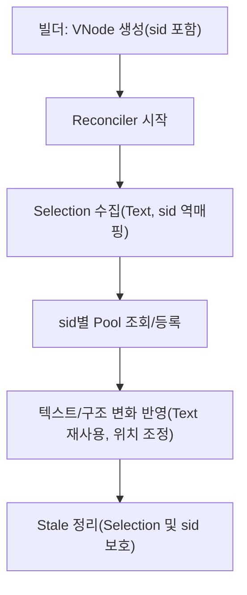

### 9.6 Reconciler 통합 포인트

- 시작 시: Selection → Text → sid 역매핑 확보 (pool.getSidByTextNode)
- 자식 처리: Text VNode 처리 시 `addOrReuseTextNode(pool, sid, text)` 사용
- 정리 단계: `pool.getAllSids()` 순회, nextVNode 트리에 없는 sid는 Selection이 없는 Text만 제거/해제

### 9.7 IME/조합 입력 고려

- 조합 중(isComposing): Pool 정리 보류, 동일 Text 노드 강제 재사용
- 조합 종료 시: pool.touchSid(sid)로 최신성 갱신, 필요 시 분리/병합 매핑 수행

### 9.8 Decorator/Mark 변화 처리

- 래핑 구조만 변하는 경우 Text 노드는 이동(insertBefore)으로 보존
- 범위 이동 시: 동일 sid 내에서 순서만 조정하여 Pool 순서(nodes[]) 갱신

### 9.9 오류/예외 처리

- sid 누락: 위치/내용 기반 Fallback 사용, 생성 후 host sid 부여 가능 시 즉시 등록
- orphan Text: parent 제거 시 unregister 수행

### 9.10 정리 정책(Cleanup)

- LRU: lastUsedAt 기준 오래된 sid 제거(Selection/가시 범위 제외)
- Idle: maxIdleMs 초과 sid 엔트리 제거

### 9.11 복잡도 요약

- 조회/재사용: O(1)
- sid 스캔 정리: O(m) (sid 수)
- 전체 Reconcile: O(n) (VNode 수)

### 9.12 시퀀스 다이어그램 (sid 기반)

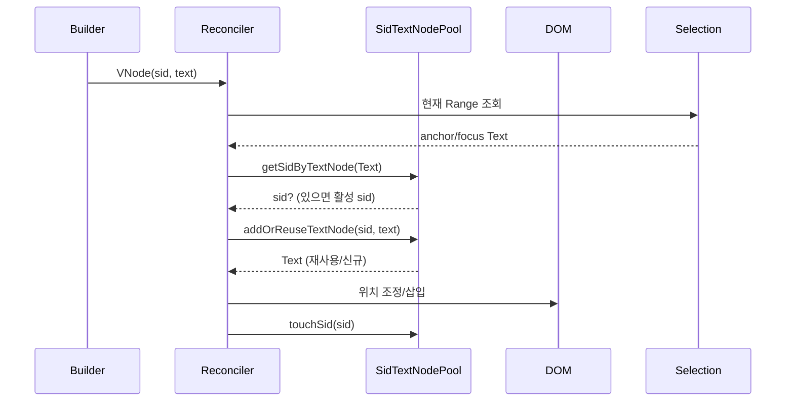

### 9.13 테스트 포인트

- 동일 sid 내 입력/삭제/분리/병합 시 Selection 유지
- mark/decorator 래핑/해제 시 Text 재사용 확인
- 조합 입력 중 Pool 정리 보류 확인


### 9.14 Offset 보정 알고리즘 (sid 기반)

편집 중 텍스트 삽입/삭제로 인해 동일 sid 내 텍스트의 오프셋이 변하면, mark의 range와 inline decorator의 offset은 즉시 보정되어야 한다. 본 절은 sid 기반으로 오프셋을 보정하는 규칙, 처리 흐름, 의사코드(슈도 코드)를 정의한다.

#### 9.14.1 모델 가정

- 텍스트는 편집 단위별로 안정적인 `sid`를 갖는다.
- mark(range)는 `[start, end)`의 half-open 인터벌로 저장하며, `sid`별 텍스트 오프셋 기준이다.
- inline decorator는 `{ sid, offset }` 형태로 저장한다. (필요 시 length 또는 range를 가질 수 있으나, 여기서는 단일 오프셋 기준을 예시한다.)
- 블록/레이어 데코레이터는 텍스트 오프셋 기반 보정 대상이 아니다(노드 앵커를 사용).

#### 9.14.2 Δ(델타) 생성

- 본 에디터는 `input` 이벤트 대신 MutationObserver로 DOM 변화를 감지하고, 동일 sid 내부에서의 텍스트 삽입/삭제를 Δ로 만든다.
- Δ는 `{ type: 'insert'|'delete', sid, pos, len }` 원자 연산들의 목록이다.
  - insert: `pos` 위치에 길이 `len`의 문자가 추가됨
  - delete: `[pos, pos+len)` 구간의 문자가 제거됨

#### 9.14.3 오프셋 보정 규칙
- Insert(sid, pos, len)
  - mark range:
    - `start >= pos` → `start += len`
    - `end >= pos` → `end += len` 
    - `pos ∈ [start, end)`
  - inline decorator offset:
    - `offset >= pos` → `offset += len`
    - `offset ∈ [start, end)`
  - 블록/레이어 데코레이터는 변경되지 않음
- Delete(sid, pos, len)
  - mark range:
    - `start >= pos` → `start += len`
    - `end >= pos` → `end += len` 
    - `pos ∈ [start, end)`
  - inline decorator offset:
    - `offset >= pos` → `offset += len`
    - `offset ∈ [start, end)`
  - 블록/레이어 데코레이터는 변경되지 않음
  - 추가된 데코레이터는 보정되지 않음
  - 제거된 데코레이터는 보정되지 않음

- Replace(sid, pos, len, newText)
  - mark range:
    - `start >= pos` → `start += len`
    - `end >= pos` → `end += len` 
    - `pos ∈ [start, end)`
  - inline decorator offset:
    - `offset >= pos` → `offset += len`
    - `offset ∈ [start, end)`
  - 블록/레이어 데코레이터는 변경되지 않음
  - 추가된 데코레이터는 보정되지 않음
  - 제거된 데코레이터는 보정되지 않음

- 추가된 데코레이터는 보정되지 않음
- 제거된 데코레이터는 보정되지 않음

#### 9.14.4 오프셋 보정 처리 흐름

1. 텍스트 삽입/삭제 발생 시, 해당 sid의 모든 데코레이터의 offset을 보정
2. 블록/레이어 데코레이터는 변경되지 않음
3. 모든 데코레이터의 offset이 보정된 후, 모델의 mark range를 보정

#### 9.14.5 오프셋 보정 처리 의사코드

```
function applyDeltasBySid(
  deltas: Delta[],
  sid: string,
  hostResolver: (sid: string) => HTMLElement | null
): void {
  for (const delta of deltas) {
    if (delta.type === 'insert') {
      const targetEl = hostResolver(sid);
      if (targetEl) {
        const range = document.createRange();
        range.setStart(targetEl, delta.pos);
        range.setEnd(targetEl, delta.pos + delta.len);
        const sel = window.getSelection();
        sel?.addRange(range);
      }
    } else if (delta.type === 'delete') {
      const targetEl = hostResolver(sid);
      if (targetEl) {
        const range = document.createRange();
        range.setStart(targetEl, delta.pos);
        range.setEnd(targetEl, delta.pos + delta.len);
        const sel = window.getSelection();
        sel?.removeRange(range);
      }
    }
  }
}
```

#### 9.14.6 오프셋 보정 처리 예시

```
// 예시: 텍스트 삽입 시
// 1. 사용자가 "Hello" 입력 → Text Node: "Hello"
// 2. 사용자가 " World" 추가 입력 → Text Node: "Hello World"
// 3. Reconciler가 DOM 업데이트 → Text Node 재사용 ✅
// 4. 새로운 데코레이터 추가 → 데코레이터 위치 보정 필요
// 5. 데코레이터 위치 보정 후 모델 업데이트 및 렌더링

// 예시: 텍스트 삭제 시
// 1. 사용자가 "Hello World" 입력 → Text Node: "Hello World"
// 2. 사용자가 "Hello" 삭제 → Text Node: "Hello"
// 3. Reconciler가 DOM 업데이트 → Text Node 재사용 ✅
// 4. 데코레이터 위치 보정 필요
// 5. 데코레이터 위치 보정 후 모델 업데이트 및 렌더링

// 예시: 데코레이터 추가 시
// 1. 사용자가 "Hello" 입력 → Text Node: "Hello"
// 2. 사용자가 " World" 추가 입력 → Text Node: "Hello World"
// 3. Reconciler가 DOM 업데이트 → Text Node 재사용 ✅
// 4. 새로운 데코레이터 추가 → 데코레이터 위치 보정 필요
// 5. 데코레이터 위치 보정 후 모델 업데이트 및 렌더링
```