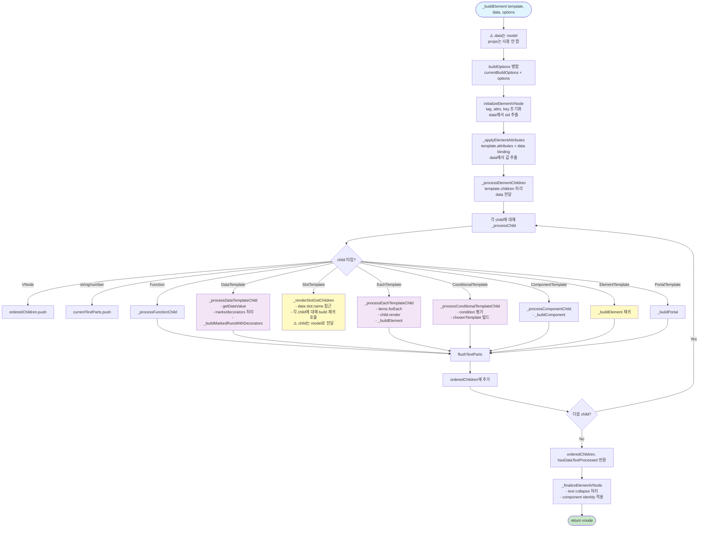

# VNodeBuilder.build() 함수 흐름도

## 전체 흐름도

```mermaid
flowchart TD
    Start([build nodeType, data, options]) --> Init[초기화<br/>- isTopLevel 체크<br/>- currentBuildOptions 설정<br/>- usedIds.clear 최상위만]
    
    Init --> Validate{데이터 검증}
    Validate -->|null/undefined| Error1[에러: Data cannot be null]
    Validate -->|OK| FindRenderer[registry.get nodeType]
    
    FindRenderer --> HasRenderer{renderer 존재?}
    
    HasRenderer -->|No| FindComponent[registry.getComponent nodeType]
    FindComponent --> HasComponent{component 존재?}
    HasComponent -->|No| Error2[에러: Renderer not found]
    HasComponent -->|Yes| SeparateProps1[separatePropsAndModel data, decorators<br/>→ props: sanitizeProps data<br/>→ model: 원본 모델 복사]
    SeparateProps1 --> BuildComponent1[_buildComponent<br/>template.props = props<br/>data = model<br/>⚠️ props는 props만, model은 model만]
    BuildComponent1 --> Return1[return VNode]
    
    HasRenderer -->|Yes| GetTemplate[renderer.template 가져오기]
    GetTemplate --> TemplateType{Template 타입?}
    
    TemplateType -->|ExternalTemplate| SeparateProps2[separatePropsAndModel data, decorators<br/>→ props: sanitizeProps data<br/>→ model: 원본 모델 복사]
    SeparateProps2 --> CreateExternal[createComponentVNode<br/>props: props<br/>model: model<br/>isExternal: true<br/>⚠️ props는 props만, model은 model만]
    CreateExternal --> VNode1[vnode 생성]
    
    TemplateType -->|ComponentTemplate| CheckComponentFunc{component 함수 존재?}
    CheckComponentFunc -->|Yes| TryExecute[component 함수 실행 시도]
    TryExecute --> SeparateProps3[separatePropsAndModel data, decorators<br/>→ props: sanitizeProps data<br/>→ model: 원본 모델 복사]
    SeparateProps3 --> GetState[ComponentState 가져오기<br/>model.sid 사용]
    GetState --> MakeContext[_makeContext<br/>props, model 전달]
    MakeContext --> ExecuteComponent[component props, model, context 실행<br/>⚠️ component props, model, context<br/>props는 첫 번째 인자, model은 두 번째 인자]
    ExecuteComponent --> IsElementTemplate{ElementTemplate 반환?}
    IsElementTemplate -->|Yes| BuildElement1[_buildElement<br/>template: elementTemplate<br/>data: model 사용<br/>⚠️ props는 사용 안 함]
    BuildElement1 --> AttachInfo[attachComponentInfo<br/>props, model 저장<br/>⚠️ props와 model 분리 저장]
    AttachInfo --> SetSidMarks[sid, marks 설정<br/>model에서 추출]
    SetSidMarks --> VNode2[vnode 생성]
    IsElementTemplate -->|No| BuildComponent2[_buildComponent<br/>template.props = props<br/>data = model<br/>⚠️ props는 props만, model은 model만]
    BuildComponent2 --> VNode3[vnode 생성]
    TryExecute -->|실패| SeparateProps5[separatePropsAndModel data, decorators<br/>→ props: sanitizeProps data<br/>→ model: 원본 모델 복사]
    SeparateProps5 --> BuildComponent3[_buildComponent<br/>template.props = props<br/>data = model<br/>⚠️ props는 props만, model은 model만]
    BuildComponent3 --> VNode4[vnode 생성]
    CheckComponentFunc -->|No| SeparateProps6[separatePropsAndModel data, decorators<br/>→ props: sanitizeProps data<br/>→ model: 원본 모델 복사]
    SeparateProps6 --> BuildComponent4[_buildComponent<br/>template.props = props<br/>data = model<br/>⚠️ props는 props만, model은 model만]
    BuildComponent4 --> VNode5[vnode 생성]
    
    TemplateType -->|Function| SeparateProps7[separatePropsAndModel data, decorators<br/>→ props: 생성되지만 사용 안 함<br/>→ model: 함수 실행에 사용]
    SeparateProps7 --> ExecuteFunction[template model 실행<br/>⚠️ model만 전달, props는 사용 안 함]
    ExecuteFunction --> BuildElement2[_buildElement<br/>template: elementTemplate<br/>data: model<br/>⚠️ props는 사용 안 함]
    BuildElement2 --> VNode6[vnode 생성]
    
    TemplateType -->|ElementTemplate| SeparateProps8[separatePropsAndModel data, decorators<br/>→ props: 생성되지만 사용 안 함<br/>→ model: element 빌드에 사용]
    SeparateProps8 --> BuildElement3[_buildElement<br/>template: elementTemplate<br/>data: model<br/>⚠️ props는 사용 안 함]
    BuildElement3 --> VNode7[vnode 생성]
    
    VNode1 --> CheckVNode{vnode 존재?}
    VNode2 --> CheckVNode
    VNode3 --> CheckVNode
    VNode4 --> CheckVNode
    VNode5 --> CheckVNode
    VNode6 --> CheckVNode
    VNode7 --> CheckVNode
    
    CheckVNode -->|No| Error3[에러: Failed to build VNode]
    CheckVNode -->|Yes| HasDecorators{decorators && children?}
    
    HasDecorators -->|No| ClearOptions[currentBuildOptions = undefined]
    HasDecorators -->|Yes| FilterDecorators[기존 decorator 노드 제거]
    
    FilterDecorators --> ProcessChildren[각 child 처리]
    ProcessChildren --> GetChildSid[child.sid 추출]
    GetChildSid --> FindNodeDecorators[findDecoratorsForNode childSid]
    FindNodeDecorators --> Categorize[categorizeDecorators]
    Categorize --> HasBlockDecorators{block/layer decorators?}
    
    HasBlockDecorators -->|Yes| BuildDecoratorNodes[buildDecoratorVNodes]
    BuildDecoratorNodes --> SeparateBeforeAfter[before/after 분리]
    SeparateBeforeAfter --> AddToChildren[newChildren에 추가<br/>before...child...after]
    HasBlockDecorators -->|No| AddChild[child만 추가]
    
    AddToChildren --> ProcessInline[_processInlineDecorators]
    AddChild --> ProcessInline
    
    ProcessInline --> NextChild{다음 child?}
    NextChild -->|Yes| ProcessChildren
    NextChild -->|No| ReplaceChildren[vnode.children = newChildren]
    
    ReplaceChildren --> RecursiveProcess[재귀적 children 처리]
    RecursiveProcess --> ProcessDecorators[_processDecorators<br/>각 child에 대해]
    ProcessDecorators --> ClearOptions
    
    ClearOptions --> End([return vnode])
    
    style Start fill:#e1f5ff
    style End fill:#c8e6c9
    style Error1 fill:#ffcdd2
    style Error2 fill:#ffcdd2
    style Error3 fill:#ffcdd2
    style BuildElement1 fill:#fff9c4
    style BuildElement2 fill:#fff9c4
    style BuildElement3 fill:#fff9c4
    style BuildComponent1 fill:#fff9c4
    style BuildComponent2 fill:#fff9c4
    style BuildComponent3 fill:#fff9c4
    style BuildComponent4 fill:#fff9c4
    style ProcessInline fill:#f3e5f5
    style ProcessDecorators fill:#f3e5f5
```



## _buildElement() 상세 흐름도



## Decorator 처리 상세 흐름도

```mermaid
flowchart TD
    Start([Decorator 처리 시작]) --> HasDecorators{decorators && children?}
    
    HasDecorators -->|No| End1([건너뛰기])
    HasDecorators -->|Yes| FilterExisting[기존 decorator 노드 필터링<br/>isDecoratorNode 체크]
    
    FilterExisting --> LoopChildren[각 child 순회]
    
    LoopChildren --> IsVNode{isVNode?}
    IsVNode -->|No| AddAsIs[newChildren.push child]
    IsVNode -->|Yes| HasStype{child.stype 존재?}
    
    HasStype -->|No| AddAsIs
    HasStype -->|Yes| ExtractSid[child.sid 추출<br/>vnode.sid || attrs data-bc-sid || extractNodeId]
    
    ExtractSid --> HasSid{sid 존재?}
    HasSid -->|No| AddAsIs
    HasSid -->|Yes| FindDecorators[findDecoratorsForNode sid]
    
    FindDecorators --> Categorize[categorizeDecorators<br/>block / layer / inline 분리]
    
    Categorize --> HasBlock{block/layer decorators?}
    
    HasBlock -->|Yes| BuildDecorators[buildDecoratorVNodes<br/>- decoratorProcessor.buildDecoratorVNode<br/>- _buildElement로 VNode 생성]
    
    BuildDecorators --> SeparatePosition[position별 분리<br/>before / after]
    
    SeparatePosition --> AddBlockDecorators[newChildren.push<br/>...beforeDecorators<br/>childVNode<br/>...afterDecorators]
    
    HasBlock -->|No| AddChildOnly[newChildren.push childVNode]
    
    AddBlockDecorators --> ProcessInline[_processInlineDecorators<br/>inline decorator 처리]
    AddChildOnly --> ProcessInline
    
    ProcessInline --> NextChild{다음 child?}
    NextChild -->|Yes| LoopChildren
    NextChild -->|No| ReplaceChildren[vnode.children = newChildren]
    
    ReplaceChildren --> RecursiveLoop[각 child 재귀 처리]
    
    RecursiveLoop --> IsDecoratorNode{isDecoratorNode?}
    IsDecoratorNode -->|Yes| Skip[건너뛰기]
    IsDecoratorNode -->|No| HasStype2{child.stype 존재?}
    
    HasStype2 -->|No| Skip
    HasStype2 -->|Yes| ExtractSid2[child.sid 추출]
    
    ExtractSid2 --> HasSid2{sid 존재?}
    HasSid2 -->|No| Skip
    HasSid2 -->|Yes| ProcessRecursive[_processDecorators 재귀 호출]
    
    ProcessRecursive --> NextRecursive{다음 child?}
    NextRecursive -->|Yes| RecursiveLoop
    NextRecursive -->|No| End2([완료])
    
    Skip --> NextRecursive
    
    style Start fill:#e1f5ff
    style End1 fill:#c8e6c9
    style End2 fill:#c8e6c9
    style BuildDecorators fill:#fff9c4
    style ProcessInline fill:#f3e5f5
    style ProcessRecursive fill:#f3e5f5
```

## 재귀 호출 관계도

```mermaid
graph TD
    build[build] -->|모든 경로| separatePropsAndModel[separatePropsAndModel<br/>data, decorators → props, model]
    
    separatePropsAndModel -->|ExternalTemplate| createComponentVNode[createComponentVNode<br/>props: props만<br/>model: model만]
    separatePropsAndModel -->|ComponentTemplate| _buildComponent[_buildComponent<br/>template.props = props만<br/>data = model만]
    separatePropsAndModel -->|Function| _buildElement[_buildElement<br/>data = model만<br/>props는 사용 안 함]
    separatePropsAndModel -->|ElementTemplate| _buildElement[_buildElement<br/>data = model만<br/>props는 사용 안 함]
    
    _buildElement --> _processElementChildren[_processElementChildren<br/>data = model]
    _processElementChildren --> _processChild[_processChild<br/>data = model]
    
    _processChild -->|SlotTemplate| _renderSlotGetChildren[_renderSlotGetChildren<br/>data = model]
    _renderSlotGetChildren -->|재귀| build<br/>child를 model로 전달
    
    _processChild -->|ElementTemplate| _buildElement
    _processChild -->|ComponentTemplate| _buildComponent
    _processChild -->|EachTemplate| _processEachTemplateChild[_processEachTemplateChild]
    _processEachTemplateChild --> _buildElement
    
    _processChild -->|ConditionalTemplate| _processConditionalTemplateChild[_processConditionalTemplateChild]
    _processConditionalTemplateChild --> _buildElement
    _processConditionalTemplateChild --> _buildComponent
    
    _processChild -->|DataTemplate| _processDataTemplateChild[_processDataTemplateChild]
    _processDataTemplateChild --> _buildMarkedRunsWithDecorators[_buildMarkedRunsWithDecorators]
    
    build -->|Decorator 처리| _processDecorators[_processDecorators]
    _processDecorators -->|재귀| _processDecorators
    
    _processDecorators --> _processInlineDecorators[_processInlineDecorators]
    
    build -->|Decorator VNode 생성| buildDecoratorVNodes[buildDecoratorVNodes]
    buildDecoratorVNodes --> _buildElement
    
    style build fill:#e1f5ff
    style _buildElement fill:#fff9c4
    style _buildComponent fill:#fff9c4
    style _renderSlotGetChildren fill:#ffccbc
    style _processDecorators fill:#f3e5f5
```

## Props와 Model 분리 전략

### separatePropsAndModel() 호출 시점
모든 template 타입별 분기에서 **반드시** 먼저 호출됩니다:
1. Component 경로: `props`는 ComponentTemplate.props에, `model`은 _buildComponent의 data로
2. External 경로: `props`와 `model` 모두 createComponentVNode에 전달
3. Element 경로: `model`만 _buildElement의 data로 사용 (props는 사용 안 함)
4. Function 경로: `model`만 함수 실행에 사용

### Props vs Model 사용 구분

| 경로 | Props 사용 | Model 사용 |
|------|-----------|-----------|
| Component | ComponentTemplate.props | _buildComponent(data) |
| External | createComponentVNode(props) | createComponentVNode(model) |
| Element | 사용 안 함 | _buildElement(data) |
| Function | 사용 안 함 | template(model) 실행 |

### Props 분리 규칙

#### Props (순수 props만)
- **생성**: `sanitizeProps(data)` - stype, sid, type 필드 제거
- **용도**: Component에만 전달
- **사용 위치**:
  - ComponentTemplate.props에 할당
  - Component 함수의 **첫 번째 인자**: `component(props, model, context)`
  - createComponentVNode의 props 인자
- **사용 안 함**: Element 빌드에는 절대 사용하지 않음

#### Model (순수 model만)
- **생성**: `{ ...data }` - 원본 데이터 복사
- **용도**: 모든 빌드 함수에 전달
- **사용 위치**:
  - _buildElement의 data 인자
  - _buildComponent의 data 인자
  - Component 함수의 **두 번째 인자**: `component(props, model, context)`
  - Decorator target 매칭 (model.sid 사용)
- **핵심**: props와 절대 혼합하지 않음

#### Component 함수 시그니처
```typescript
component(props: ComponentProps, model: ModelData, context: ComponentContext): ElementTemplate
```
- **첫 번째 인자 (props)**: 순수 props만 (stype, sid, type 제외)
- **두 번째 인자 (model)**: 순수 model만 (원본 데이터)
- **세 번째 인자 (context)**: 컴포넌트 컨텍스트 (state, instance 등)

### separatePropsAndModel() 동작 방식
```typescript
separatePropsAndModel(data, decorators)
  → {
      props: sanitizeProps(data),  // stype, sid, type 제거
      model: { ...data },          // 원본 복사
      decorators                    // 그대로 전달
    }
```

**핵심 원칙**:
- **Props는 props만**: Component에만 전달, Element 빌드에는 사용 안 함
- **Model은 model만**: 모든 빌드 함수에 전달 (Element, Component 모두)
- **절대 혼합하지 않음**: props와 model은 항상 분리되어 전달
- Component 함수 시그니처: `component(props, model, context)` - props는 첫 번째, model은 두 번째
- Decorator는 model의 sid를 기준으로 매칭

## 주요 함수 역할

### build()
- **역할**: 메인 진입점, 전체 VNode 트리 빌드
- **입력**: nodeType, data, options
- **출력**: VNode
- **특징**: 
  - 재귀 호출 가능 (slot children 처리 시)
  - 모든 분기에서 `separatePropsAndModel` 먼저 호출
  - props는 component에, model은 element 빌드에 사용

### _buildElement()
- **역할**: ElementTemplate을 VNode로 변환
- **주요 작업**:
  - VNode 초기화
  - Attributes 적용
  - Children 처리 (재귀적)
  - Text collapse 처리

### _buildComponent()
- **역할**: ComponentTemplate을 VNode로 변환
- **주요 작업**:
  - Component 함수 실행 시도
  - ComponentManager와 연동
  - Component VNode 생성

### _renderSlotGetChildren()
- **역할**: Slot의 children을 VNode 배열로 변환
- **특징**: `build()` 재귀 호출 발생 지점

### Decorator 처리
- **Block/Layer**: sibling으로 추가 (before/after)
- **Inline**: 텍스트 내부에 적용
- **재귀적**: 중첩 구조에서도 동일하게 처리

