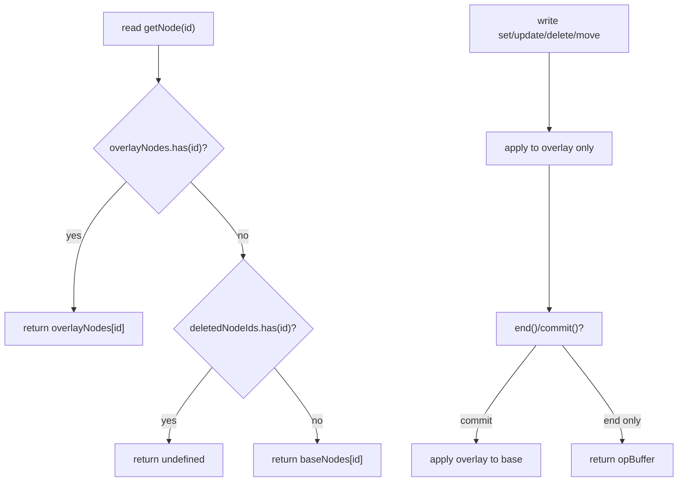
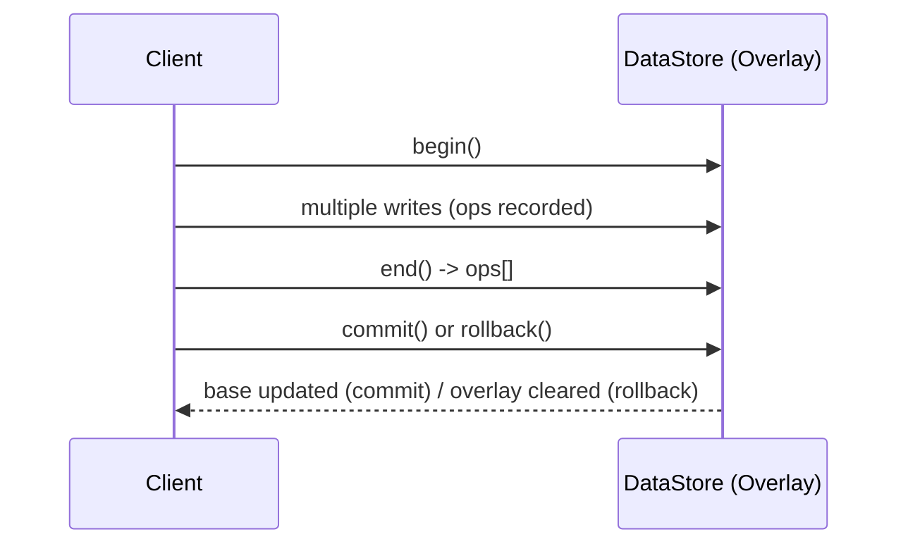

## 부록: 오버레이 경로와 공백 연산 메모

### A. 오버레이 읽기/쓰기 경로 다이어그램



### B. 트랜잭션 수명주기 (요약)



### C. Whitespace 연산 멱등성 규칙
- normalizeWhitespace, trimText: 동일 범위를 반복 호출해도 내용 변화가 없으면 update 오퍼레이션을 발생시키지 않는다.

# DataStore Structure Specification

## 핵심 정책(요약)

- Root 보호: 현재 루트 노드는 `deleteNode`, `deleteDocument`로 삭제 불가. 시도 시 에러.
- Overlay 트랜잭션: `begin()` 이후 연산은 overlay에 수집되고 `commit()`에서 순서대로 반영(create → update → move → delete). `rollback()`은 overlay 폐기.
- Operation 이벤트: overlay 활성 여부와 무관하게 모든 원자 연산 이벤트 발행. 페이로드는 불변 취급.
- No-op 억제: `updateNode`는 전달된 모든 필드가 기존 값과 deep-equal이면 쓰기를 생략(성공 반환). 배열/객체 포함.
- Content 업데이트: `updates.content`가 있으면 검증 우회 후 직접 반영(내부는 ID 배열).
- Attributes 병합: `updateNode`는 기존 attributes와 shallow-merge. 타입 변경 금지.
- Alias(overlay-scoped): `$alias`는 overlay 맵에 등록 후 저장 시 제거. `resolveAlias`는 id/alias를 실제 id로 해석.

## 1. 개요

DataStore는 Barocss Model의 핵심 데이터 저장소로, ID 기반의 Map 구조를 사용하여 노드와 문서를 효율적으로 관리합니다. 계층적 구조를 유지하면서도 O(1) 접근 성능을 제공하는 하이브리드 아키텍처를 채택했습니다.

## 2. 핵심 개념

### 2.1 ID 기반 Map 구조
- **원리**: 모든 노드를 `Map<string, INode>` 형태로 저장
- **장점**: O(1) 접근 시간, 메모리 효율성, 확장성
- **관계 관리**: `parentId`와 `content` 배열을 통한 계층 구조 유지

### 2.2 하이브리드 아키텍처
- **내부**: ID 기반 Map으로 저장 (성능 최적화)
- **외부**: 트리 구조로 노출 (사용자 친화적)
- **변환**: 자동 변환 메서드를 통한 양방향 변환

### 2.3 Figma 스타일 ID 시스템
- **형태**: `[sessionId]:[counter]` (예: "0:1", "0:2", "1:3")
- **장점**: 매우 짧고 읽기 쉬움, 세션별 그룹화
- **전역 카운터**: DataStore 인스턴스 간 중복 방지

### 2.4 원자적 Operation 시스템
- **이벤트 기반**: 모든 변경사항을 Operation으로 추적
- **타입**: create, update, delete, move
불변식
- `type ∈ {create, update, delete, move}`
- `nodeId !== ''`
- `move.position` 제공 시 `position ≥ 0`

- **실시간 추적**: 외부 시스템(CRDT 등)과의 동기화 지원

### 2.5 Selection과 데이터의 분리
- **원칙**: selection(에디터 커서/범위)은 UI/세션 상태로서 데이터 동기화와 분리
- **전송**: selection은 presence/세션 채널 등 별도 경량 채널로 전달(`anchorId/anchorOffset/focusId/focusOffset`)
- **리맵**: 데이터 변경 후 selection remap은 로컬에서 처리(오퍼레이션 payload에는 포함하지 않음)

## 3. 아키텍처

### 3.1 핵심 구성 요소

```
DataStore
├── nodes: Map<string, INode>
├── rootNodeId: string | undefined
├── version: number
├── _registeredSchemas: Map<string, Schema>
├── _activeSchema: Schema | undefined
├── _eventEmitter: EventEmitter
├── _globalCounter: number (static)
├── _sessionId: number
├── DocumentIterator: 문서 순회 시스템
└── 연산 클래스들
    ├── core: CoreOperations
    ├── query: QueryOperations
    ├── content: ContentOperations
    ├── splitMerge: SplitMergeOperations
    ├── marks: MarkOperations
    ├── range: RangeOperations
    └── utility: UtilityOperations

EventEmitter
├── listeners: Map<string, Set<Function>>
├── on(event, callback)
├── off(event, callback)
└── emit(event, ...args)
```

### 3.2 연산 클래스 구조

DataStore의 기능을 7개의 전문 연산 클래스로 분리하여 모듈화했습니다:

#### 3.2.1 CoreOperations
- **목적**: 기본 CRUD 기능 제공
- **주요 메서드**: `setNode`, `getNode`, `deleteNode`, `updateNode`, `createNodeWithChildren`
- **특징**: 스키마 검증, ID 생성, 원자적 연산 지원

#### 3.2.2 QueryOperations
- **목적**: 검색 및 조회 기능 제공
- **주요 메서드**: `findNodes`, `findNodesByType`, `findNodesByAttribute`, `findChildrenByParentId`, `searchText`
- **특징**: 조건부 검색, 중첩 구조 조회, 텍스트 검색
- **성능 정책**: DocumentIterator(성능 우선)와 전체 순회(완전성 우선) 조합 사용

#### 3.2.3 ContentOperations
- **목적**: 부모-자식 관계 관리
- **주요 메서드**: `addChild`, `removeChild`, `moveNode`, `copyNode`, `reorderChildren`
- **특징**: 계층 구조 조작, 노드 이동/복사, 일괄 처리

#### 3.2.4 SplitMergeOperations
- **목적**: 텍스트/블록 분할/병합
- **주요 메서드**: `splitTextNode`, `mergeTextNodes`, `splitBlockNode`, `mergeBlockNodes`
- **특징**: 텍스트 편집 지원, 마크 보존, 자동 병합

#### 3.2.5 MarkOperations
- **목적**: 마크 정규화 및 통계
- **주요 메서드**: `normalizeMarks`, `getMarkStatistics`, `removeEmptyMarks`
- **특징**: 마크 중복 제거, 겹침 병합, 통계 제공

#### 3.2.6 MultiNodeRangeOperations
- **목적**: 다중 노드 범위 작업
- **주요 메서드**: `deleteMultiNodeRange`, `insertTextAtMultiNodeRange`, `applyMarkToMultiNodeRange`
- **특징**: 여러 노드에 걸친 작업, 복잡한 텍스트 조작

#### 3.2.7 UtilityOperations
- **목적**: 유틸리티 기능 제공
- **주요 메서드**: `getNodeCount`, `clone`, `getAllNodes`, `getNodePath`, `isDescendant`
- **특징**: 데이터 분석, 복제, 관계 검사

### 3.3 데이터 흐름

```
1. 외부 중첩 객체 입력
   ↓
2. ID 할당 (재귀적)
   ↓
3. 스키마 검증
   ↓
4. DataStore 형식으로 변환
   ↓
5. Map에 저장
   ↓
6. Operation 이벤트 발생
```

## 4. 핵심 인터페이스

### 4.1 INode 인터페이스
```typescript
interface INode {
  id: string;                    // 고유 식별자
  type: string;                  // 노드 타입
  text?: string;                 // 텍스트 내용 (텍스트 노드)
  content?: string[];            // 자식 노드 ID 배열
  parentId?: string;             // 부모 노드 ID
  attributes?: Record<string, any>; // 속성
  marks?: IMark[];               // 마크 배열
  version?: number;              // 버전 정보
}
```

### 4.2 IMark 인터페이스
```typescript
interface IMark {
  type: string;                  // 마크 타입 (bold, italic 등)
  range: [number, number];       // 적용 범위 [start, end]
  attributes?: Record<string, any>; // 마크 속성
}
```

## 6. Operation 수집과 이벤트 모델

### 6.1 원자적 Operation 타입(요약)

- 공통 규약
  - 공통 필드: `type`, `nodeId`, `timestamp`
  - 선택 필드: `parentId`, `position`, `data`
  - `data`는 post-state 스냅샷(변경 후 상태)을 담습니다(특히 create/update).

- create
  - 의미: 새 노드가 생성됨
  - 필드: `type: "create"`, `nodeId`, `timestamp`, `data`(필수)
  - `data`: `{ type, attributes?, text?, content?, parentId? }`
  - 비고: 부모 연결이 함께 일어나면 parent의 `content`는 별도 `update`로 수집될 수 있음

- update
  - 의미: 기존 노드의 속성/텍스트/자식 배열 변경
  - 필드: `type: "update"`, `nodeId`, `timestamp`, `data`(필수)
  - `data`: 변경 후 스냅샷(전체 혹은 변경된 필드 집합, 구현은 전체 스냅샷 권장)
  - 비고: `content` 변경도 update로 수집

- delete
  - 의미: 노드 삭제(부모 content에서의 제거 포함)
  - 필드: `type: "delete"`, `nodeId`, `timestamp`, `parentId?`
  - 비고: 필요하면 상위 레이어에서 tombstone 처리 가능

- move
  - 의미: 위치/순서 변경(부모/포지션 이동, 동일 부모 내 reorder 포함)
  - 필드: `type: "move"`, `nodeId`, `timestamp`, `parentId`(필수), `position?`
  - 비고: 순서 변경은 move 시퀀스로 표현

모든 변경은 위 4가지 중 하나로 수집됩니다. 복합 동작은 다수의 원자 op 시퀀스로 기록됩니다.

### 6.2 수집/트랜잭션 API(begin/end/commit/rollback)

DataStore는 항상 활성화된 `TransactionalOverlay`를 사용합니다. `begin/end`는 오퍼레이션 수집 버퍼를 관리하고, `commit/rollback`은 오버레이의 반영/폐기를 제어합니다.

```ts
// 수집 시작: opBuffer 초기화(오버레이는 유지)
dataStore.begin();
// 여러 create/update/delete/move 수행 (모든 쓰기는 오버레이에만 반영)
const ops = dataStore.end();  // 수집 종료: 누적된 op 목록 반환(버퍼 초기화)

// 커밋: 오버레이 상태를 base에 적용하고 오버레이를 초기화
dataStore.commit();

// 롤백: 오버레이의 변경분 및 opBuffer 폐기(베이스는 변동 없음)
dataStore.rollback();

// 진행 중 중간 확인
const current = dataStore.getCollectedOperations();
```

오퍼레이션 수집이 비활성인 경우에도 오버레이는 항상-on이며, `operation` 이벤트는 즉시 emit됩니다. 수집 중(begin~end)에는 emit 대신 버퍼에 push됩니다.

### 6.3 동작별 수집 규칙

- 텍스트/마크/범위 유틸: 내부적으로 update를 유발 → update로 수집
- Content 이동
  - moveNode / moveChildren: 위치 변경을 명시적 move로 수집
  - reorderChildren: 동일 부모 내 순서를 변경할 때, 요소별 새 위치에 대한 move 시퀀스로 수집
- 생성/삭제
  - setNode(create) / deleteNode(delete)로 수집
- 복사/복제
  - copyNode: 신규 노드에 대해 per-node create, 부모 content 변경은 parent update로 수집 (move는 발생시키지 않음)
  - cloneNodeWithChildren: 각 노드별 per-node create, 복제 노드의 content/부모 연결은 update로 수집 (move 없음)

### 6.4 begin/end/commit/rollback 권장 사용 시점

- begin():
  - 사용자 상호작용 단위(키 입력 시퀀스, 드래그-드롭, 붙여넣기 등) 시작 시 호출하여 해당 동작에서 발생하는 op를 하나의 배치로 수집합니다.
  - Undo/Redo 단위, CRDT 배치 단위와 일치시키는 것을 권장합니다.
- end():
  - 해당 상호작용이 완료되면 호출하여 수집된 op를 상위 레이어로 반환합니다.
- commit():
  - 모델 업데이트 시점에 호출하여 오버레이의 변경분을 베이스 스토어에 반영합니다.
  - 일반적으로 상위 `TransactionManager`에서 `end()`로 수집한 op를 네트워크로 전파한 직후에 수행합니다.
- rollback():
  - 상호작용 취소, 검증 실패, 충돌 감지 등의 경우 오버레이 변경분을 폐기합니다.

전제: `TransactionManager`가 트랜잭션 구간(begin~commit/rollback) 동안 전역 write 락을 보장하여 외부 쓰기와의 경합을 방지합니다.

### 6.5 수집/커밋 시나리오 예시

```ts
dataStore.begin();
// update
dataStore.updateNode(textId, { text: 'Hello World' }, false);
// create + parent update
const newTextId = dataStore.addChild(paragraphId, { type: 'inline-text', text: '!' });
// move (부모 변경)
dataStore.moveNode(newTextId, otherParagraphId, 0);
// delete (부모 content 제거 포함)
dataStore.removeChild(paragraphId, newTextId);
dataStore.deleteNode(newTextId);
const ops = dataStore.end();
// ops: [update, create, move, delete, ...]
```

### 6.6 적용 순서와 일관성

- 생성(create)은 부모 → 자식 순으로 배출되어 재구성이 용이합니다.
- 위치 변경(move)은 대상 노드와 부모/포지션 정보가 함께 제공됩니다.
- 복제/복사 시 트리 전체를 한 번에가 아니라 per-node create로 기록하여 CRDT/리플레이 친화성을 유지합니다.

### 6.7 이벤트 스트림과 배치

### 6.8 CRDT 연계를 위한 JSON 스펙

- 단일 Operation JSON(공통 구조)

```json
{
  "type": "create|update|delete|move",
  "nodeId": "0:42",
  "timestamp": 1739182345123,
  "parentId": "0:7",
  "position": 2,
  "data": {
    "type": "paragraph",
    "attributes": {"align": "left"},
    "text": "Hello",
    "content": ["0:43", "0:44"],
    "parentId": "0:7"
  }
}
```

## 7. DataStore 공개 API (추가/변경 요약)

### 7.1 수집(트랜잭션 경량 API)

- `begin(): void` 수집 시작
- `getCollectedOperations(): AtomicOperation[]` 현재 누적분 조회(복사본)
- `end(): AtomicOperation[]` 수집 종료 및 누적분 반환(버퍼 초기화)

### 7.2 Range/Text/Mark 유틸 (RangeOperations 위임)

- 텍스트
  - `deleteText(contentRange)` → string
  - `extractText(contentRange)` → string
  - `insertText(contentRange, text)` → string
  - `replaceText(contentRange, newText)` → string
  - `copyText(contentRange)` → string
  - `moveText(fromRange, toRange)` → string
  - `duplicateText(contentRange)` → string

- 마크/포맷팅
  - `applyMark(contentRange, mark)` → mark
  - `removeMark(contentRange, markType)` → number
  - `clearFormatting(contentRange)` → number
  - `toggleMark(contentRange, markType, attrs?)` → void
  - `constrainMarksToRange(contentRange)` → number

- 검색/정규화
  - `findText(contentRange, searchText)` → number
  - `getTextLength(contentRange)` → number
  - `trimText(contentRange)` → number
  - `normalizeWhitespace(contentRange)` → string
  - `wrap(contentRange, prefix, suffix)` → string
  - `unwrap(contentRange, prefix, suffix)` → string
  - `replace(contentRange, pattern, replacement)` → number
  - `findAll(contentRange, pattern)` → {start,end}[]
  - `expandToWord(contentRange)` → ContentRange
  - `expandToLine(contentRange)` → ContentRange
  - `normalizeRange(contentRange)` → ContentRange

### 7.3 Content 관리 (변경 포인트)

- `addChild(parentId, child, position?)` → string (create+parent update 수집)
- `removeChild(parentId, childId)` → boolean (delete 수집)
- `reorderChildren(parentId, childIds)` → void (동일 부모 내 각 항목에 대해 move 시퀀스 수집)
- `moveNode(nodeId, newParentId, position?)` → void (move 수집)
- `moveChildren(fromParentId, toParentId, childIds, position?)` → void (각 항목에 대해 move 수집)
- `copyNode(nodeId, newParentId?)` → string (복사 노드 per-node create + parent update, move 없음)
- `cloneNodeWithChildren(nodeId, newParentId?)` → string (트리 전체 per-node create + content/parent update, move 없음)

### 7.4 Core/Utility (요약)

- Core: `setNode`, `updateNode`, `deleteNode`, `getNode`, `createNodeWithChildren`
- Utility: `getAllNodes`, `getAllNodesMap`, `getRootNodeId`, `getNodePath`, `getNodeDepth`, `compareDocumentOrder`, `getNextNode`, `getPreviousNode`, `createDocumentIterator`, `createRangeIterator`, `traverse`, 등

- create(JSON 예시)

```json
{
  "type": "create",
  "nodeId": "0:1001",
  "timestamp": 1739182345123,
  "data": {
    "type": "inline-text",
    "text": "Hello",
    "parentId": "0:500"
  }
}
```

- update(JSON 예시)

```json
{
  "type": "update",
  "nodeId": "0:1001",
  "timestamp": 1739182346123,
  "data": {
    "type": "inline-text",
    "text": "Hello World",
    "parentId": "0:500"
  }
}
```

- delete(JSON 예시)

```json
{
  "type": "delete",
  "nodeId": "0:1001",
  "timestamp": 1739182347123,
  "parentId": "0:500"
}
```

- move(JSON 예시)

```json
{
  "type": "move",
  "nodeId": "0:1001",
  "timestamp": 1739182348123,
  "parentId": "0:501",
  "position": 0
}
```

- 배치(트랜잭션) 전달 포맷

```json
{
  "sessionId": 0,
  "version": 15,
  "operations": [
    { "type": "update", "nodeId": "0:10", "timestamp": 1739182000000, "data": {"type": "inline-text", "text": "A"} },
    { "type": "create", "nodeId": "0:11", "timestamp": 1739182000100, "data": {"type": "inline-text", "text": "!", "parentId": "0:5"} },
    { "type": "move",   "nodeId": "0:11", "timestamp": 1739182000200, "parentId": "0:6", "position": 0 },
    { "type": "delete", "nodeId": "0:12", "timestamp": 1739182000300, "parentId": "0:5" }
  ]
}
```

- JSON Schema(요약)

```json
{
  "$schema": "http://json-schema.org/draft-07/schema#",
  "title": "AtomicOperation",
  "type": "object",
  "required": ["type", "nodeId", "timestamp"],
  "properties": {
    "type": {"type": "string", "enum": ["create", "update", "delete", "move"]},
    "nodeId": {"type": "string"},
    "timestamp": {"type": "number"},
    "parentId": {"type": "string"},
    "position": {"type": "number", "minimum": 0},
    "data": {
      "type": "object",
      "properties": {
        "type": {"type": "string"},
        "attributes": {"type": "object"},
        "text": {"type": "string"},
        "content": {"type": "array", "items": {"type": "string"}},
        "parentId": {"type": "string"}
      },
      "additionalProperties": true
    }
  },
  "additionalProperties": false
}
```


- 수집 모드가 아닐 때: 단건 emit(`operation` 이벤트)
- 수집 모드일 때: begin~end 사이에 버퍼에 누적 후, end() 반환값으로 일괄 전달(상위 레이어에서 배치 커밋 이벤트로 래핑 가능)

### 4.3 Document 인터페이스
```typescript
interface Document {
  id: string;
  type: 'document';
  content: string[];             // 루트 노드 ID 배열
  attributes?: Record<string, any>;
  metadata?: {
    title?: string;
    author?: string;
    createdAt?: Date;
    updatedAt?: Date;
  };
  version: number;
}
```

## 5. DocumentIterator 시스템

### 5.1 개요

DocumentIterator는 문서 구조를 효율적으로 순회하기 위한 반복자(iterator) 시스템입니다. Depth-First 순회를 기본으로 하며, 다양한 필터링과 범위 제한 기능을 제공합니다.

### 5.2 핵심 기능

#### 5.2.1 기본 순회
```typescript
// 기본 문서 순회
const iterator = dataStore.createDocumentIterator();
for (const nodeId of iterator) {
  const node = dataStore.getNode(nodeId);
  console.log(node.type, node.text);
}
```

#### 5.2.2 필터링
```typescript
// 특정 타입만 순회
const headingIterator = dataStore.createDocumentIterator({
  filter: { type: 'heading' }
});

// 여러 타입 제외
const textIterator = dataStore.createDocumentIterator({
  filter: { excludeTypes: ['document', 'list'] }
});
```

#### 5.2.3 범위 제한
```typescript
// 특정 범위 내 노드만 순회
const rangeIterator = dataStore.createDocumentIterator({
  range: {
    startNodeId: 'heading-1',
    endNodeId: 'paragraph-2'
  }
});
```

#### 5.2.4 깊이 제한
```typescript
// 최대 깊이 제한
const shallowIterator = dataStore.createDocumentIterator({
  maxDepth: 2
});
```

### 5.3 Visitor 패턴

#### 5.3.1 기본 Visitor
```typescript
interface DocumentVisitor {
  visit(nodeId: string, node: any, context?: any): void | boolean;
  enter?(nodeId: string, node: any, context?: any): void;
  exit?(nodeId: string, node: any, context?: any): void;
  shouldVisitChildren?(nodeId: string, node: any): boolean;
}
```

#### 5.3.2 사용 예제
```typescript
// 텍스트 추출 Visitor
class TextExtractor implements DocumentVisitor {
  private texts: string[] = [];

  visit(nodeId: string, node: any) {
    if (node.type === 'inline-text' && node.text) {
      this.texts.push(node.text);
    }
  }

  getTexts() {
    return this.texts;
  }
}

// Visitor 실행
const extractor = new TextExtractor();
dataStore.traverse(extractor);
const allTexts = extractor.getTexts();
```

#### 5.3.3 다중 Visitor
```typescript
// 여러 Visitor를 동시에 실행
const textExtractor = new TextExtractor();
const linkCollector = new LinkCollector();
const nodeCounter = new NodeCounter();

dataStore.traverse(textExtractor, linkCollector, nodeCounter);
```

### 5.4 유틸리티 메서드

```typescript
// 배열로 변환
const allNodes = dataStore.createDocumentIterator().toArray();

// 조건에 맞는 첫 번째 노드 찾기
const firstHeading = dataStore.createDocumentIterator({
  filter: { type: 'heading' }
}).find();

// 조건에 맞는 모든 노드 찾기
const allHeadings = dataStore.createDocumentIterator({
  filter: { type: 'heading' }
}).findAll();
```

## 6. Range 기반 연산

### 6.1 Range 개념

DataStore의 Range 연산은 두 가지 레벨로 구분됩니다:

#### 6.1.1 Node Range (노드 범위)
```typescript
interface DocumentRange {
  startNodeId: string;
  endNodeId: string;
  includeStart?: boolean;
  includeEnd?: boolean;
}
```
- **용도**: DocumentIterator의 순회 범위 지정
- **특징**: 노드 단위로만 범위 지정

#### 6.1.2 Text Range (텍스트 범위)
```typescript
interface TextRange {
  startNodeId: string;
  startOffset: number;  // 텍스트 내 문자 위치
  endNodeId: string;
  endOffset: number;    // 텍스트 내 문자 위치
}
```
- **용도**: DataStore 연산의 정확한 텍스트 처리
- **특징**: 문자 단위까지 정확한 위치 지정

### 6.2 Range 연산 아키텍처

#### 6.2.1 역할 분담
- **DocumentIterator**: Node Range를 사용한 노드 순회
- **DataStore Operations**: Text Range를 사용한 정확한 텍스트 처리

#### 6.2.2 createRangeIterator API
```typescript
// createRangeIterator 메서드 시그니처
createRangeIterator(
  range: DocumentRange,
  options?: DocumentIteratorOptions
): DocumentIterator

// 사용 예제
const rangeIterator = dataStore.createRangeIterator(
  { startNodeId: 'node1', endNodeId: 'node2' },
  { filter: { type: 'inline-text' } }
);
```

#### 6.2.3 처리 흐름
```typescript
// 방식 1: 기본 DocumentIterator 활용
// 1. TextRange를 NodeRange로 변환
const nodeRange = calculateNodeRange(textRange);

// 2. DocumentIterator로 범위 내 노드들 수집
const nodesInRange = Array.from(
  dataStore.createDocumentIterator({ range: nodeRange })
);

// 3. 각 노드에서 정확한 텍스트 범위 처리
processTextRangeInNodes(nodesInRange, textRange);

// 방식 2: createRangeIterator 활용 (권장)
// 1. TextRange를 NodeRange로 변환
const nodeRange = calculateNodeRange(textRange);

// 2. createRangeIterator로 직접 순회
const rangeIterator = dataStore.createRangeIterator(nodeRange);

// 3. 순회하면서 즉시 처리
for (const nodeId of rangeIterator) {
  processNodeInTextRange(nodeId, textRange);
}
```

### 6.3 Range 연산 예제

#### 6.3.1 기본 DocumentIterator 활용
```typescript
deleteTextRange(textRange: TextRange) {
  // 1. 범위 내 노드들 수집
  const nodeRange = this.calculateNodeRange(textRange);
  const nodesInRange = Array.from(
    this.createDocumentIterator({ range: nodeRange })
  );
  
  // 2. 각 노드에서 텍스트 범위 삭제
  this.processTextRangeInNodes(nodesInRange, textRange);
}

insertTextAtRange(textRange: TextRange, text: string) {
  // 1. 범위 내 노드들 수집
  const nodeRange = this.calculateNodeRange(textRange);
  const nodesInRange = Array.from(
    this.createDocumentIterator({ range: nodeRange })
  );
  
  // 2. 삽입 위치 찾기 및 텍스트 삽입
  this.insertTextInNodes(nodesInRange, textRange, text);
}
```

#### 6.3.2 createRangeIterator 활용 (권장 방식)
```typescript
// createRangeIterator를 직접 활용한 더 효율적인 방식
deleteTextRange(textRange: TextRange) {
  // 1. TextRange를 NodeRange로 변환
  const nodeRange = this.calculateNodeRange(textRange);
  
  // 2. createRangeIterator로 범위 내 노드들 순회
  const rangeIterator = this.createRangeIterator(nodeRange);
  
  // 3. 순회하면서 텍스트 범위 처리
  for (const nodeId of rangeIterator) {
    this.processNodeInTextRange(nodeId, textRange);
  }
}

insertTextAtRange(textRange: TextRange, text: string) {
  // 1. TextRange를 NodeRange로 변환
  const nodeRange = this.calculateNodeRange(textRange);
  
  // 2. createRangeIterator로 범위 내 노드들 순회
  const rangeIterator = this.createRangeIterator(nodeRange);
  
  // 3. 순회하면서 텍스트 삽입 처리
  for (const nodeId of rangeIterator) {
    this.insertTextInNode(nodeId, textRange, text);
  }
}

replaceTextRange(textRange: TextRange, newText: string) {
  // 1. TextRange를 NodeRange로 변환
  const nodeRange = this.calculateNodeRange(textRange);
  
  // 2. createRangeIterator로 범위 내 노드들 순회
  const rangeIterator = this.createRangeIterator(nodeRange);
  
  // 3. 순회하면서 텍스트 교체 처리
  for (const nodeId of rangeIterator) {
    this.replaceTextInNode(nodeId, textRange, newText);
  }
}
```

#### 6.3.3 createRangeIterator의 장점
```typescript
// 1. 메모리 효율성: 배열로 변환하지 않고 직접 순회
const rangeIterator = this.createRangeIterator(nodeRange);
for (const nodeId of rangeIterator) {
  // 각 노드를 즉시 처리
  this.processNode(nodeId);
}

// 2. 조기 종료 가능: 조건에 맞으면 순회 중단
const rangeIterator = this.createRangeIterator(nodeRange);
for (const nodeId of rangeIterator) {
  if (this.shouldStopProcessing(nodeId)) {
    break; // 순회 중단
  }
  this.processNode(nodeId);
}

// 3. 필터링과 조합: 범위 + 타입 필터
const headingRangeIterator = this.createRangeIterator(nodeRange, {
  filter: { type: 'heading' }
});

// 4. 깊이 제한과 조합: 범위 + 깊이 제한
const shallowRangeIterator = this.createRangeIterator(nodeRange, {
  maxDepth: 2
});
```

### 6.4 장점

#### 6.4.1 효율성
- **일괄 처리**: 범위 내 노드들을 한 번에 수집
- **최적화된 순회**: DocumentIterator의 검증된 알고리즘 활용
- **중복 방지**: 동일한 노드를 여러 번 방문하지 않음
- **메모리 효율성**: `createRangeIterator`로 배열 변환 없이 직접 순회
- **조기 종료**: 조건에 맞으면 순회를 즉시 중단 가능

#### 6.4.2 일관성
- **통일된 순회**: 모든 Range 연산이 동일한 순회 로직 사용
- **예측 가능성**: DocumentIterator의 순서 보장
- **재사용성**: 검증된 순회 알고리즘 재사용
- **API 일관성**: `createRangeIterator`로 범위 순회 API 통일

#### 6.4.3 확장성
- **새로운 연산**: DocumentIterator 기반으로 쉽게 추가
- **고급 기능**: 필터링, 조건부 처리 등 활용 가능
- **성능 최적화**: Iterator의 최적화 혜택 자동 적용
- **조합 가능성**: 범위 + 필터링 + 깊이 제한 등 다양한 옵션 조합

#### 6.4.4 createRangeIterator 특화 장점
- **직관적 API**: 범위 순회를 위한 전용 메서드
- **옵션 조합**: 범위와 다른 옵션들을 자연스럽게 조합
- **성능 최적화**: 범위 순회에 특화된 최적화
- **코드 가독성**: 의도가 명확한 API 사용

## 7. 성능 특성

### 7.1 시간 복잡도
- **노드 조회**: O(1) - Map 기반
- **노드 저장**: O(1) - Map 기반
- **노드 삭제**: O(1) - Map 기반
- **자식 조회**: O(k) - k는 자식 개수
- **검색**: O(n) - n은 전체 노드 개수
- **트리 순회**: O(n) - n은 노드 개수
- **DocumentIterator 순회**: O(n) - n은 순회 대상 노드 개수
- **Range 기반 순회**: O(k) - k는 범위 내 노드 개수
- **createRangeIterator**: O(k) - k는 범위 내 노드 개수
- **Visitor 패턴**: O(n) - n은 방문한 노드 개수

### 7.2 공간 복잡도
- **기본 저장**: O(n) - n은 노드 개수
- **중첩 구조**: O(n) - ID 참조로 최적화
- **마크 저장**: O(m) - m은 마크 개수

### 7.3 메모리 최적화
- **구조적 공유**: 변경되지 않은 부분 공유
- **지연 로딩**: 필요시에만 로드
- **압축 저장**: 중복 데이터 제거

## 8. Query 최적화 전략

### 8.1 성능 vs 완전성 정책

QueryOperations는 성능과 완전성 사이의 균형을 고려하여 두 가지 접근 방식을 사용합니다:

#### DocumentIterator 사용 (성능 우선)
- **findNodesByType**: 타입 필터링으로 효율적 순회
- **findChildrenByParentId**: 부모의 content 배열 직접 접근
- **findNodesByDepth**: 깊이 제한으로 불필요한 순회 방지

#### 전체 순회 사용 (완전성 우선)
- **findNodes**: 고아 노드 포함 모든 노드 검색
- **findRootNodes**: 고아 노드도 루트로 간주
- **findNodesByAttribute**: 속성 검색 (고아 노드 포함)
- **findNodesByText**: 텍스트 검색 (고아 노드 포함)
- **searchText**: 텍스트 검색 (고아 노드 포함)

### 8.2 최적화 전략

#### 8.2.1 성능 우선 시나리오
- 일반적인 검색 작업
- 대용량 문서에서의 빠른 조회
- UI 반응성이 중요한 경우

#### 8.2.2 완전성 우선 시나리오
- 데이터 무결성 검사
- 정리 작업 및 디버깅
- 고아 노드 감지가 필요한 경우

## 9. 확장성

### 9.1 수평적 확장
- **새로운 노드 타입**: 스키마 확장으로 지원
- **새로운 마크 타입**: 마크 시스템 확장
- **새로운 속성**: attributes 필드 활용

### 9.2 수직적 확장
- **깊은 중첩**: 재귀적 구조 지원
- **대용량 문서**: ID 기반 참조로 효율적 관리
- **복잡한 관계**: 다중 참조 지원

## 10. 관련 문서

- [DataStore Operations Specification](./datastore-operations-spec.md) - 연산 클래스별 상세 기능
- [DocumentIterator Specification](../packages/datastore/docs/document-iterator-spec.md) - DocumentIterator 상세 명세
- [DataStore Usage Scenarios](./datastore-usage-scenarios.md) - 시나리오별 사용법
- [DataStore API Reference](./datastore-api-reference.md) - API 레퍼런스

---

이 스펙은 Barocss DataStore 시스템의 핵심 아키텍처와 기본 개념을 다룹니다. 상세한 사용법과 API 레퍼런스는 관련 문서를 참조하세요.