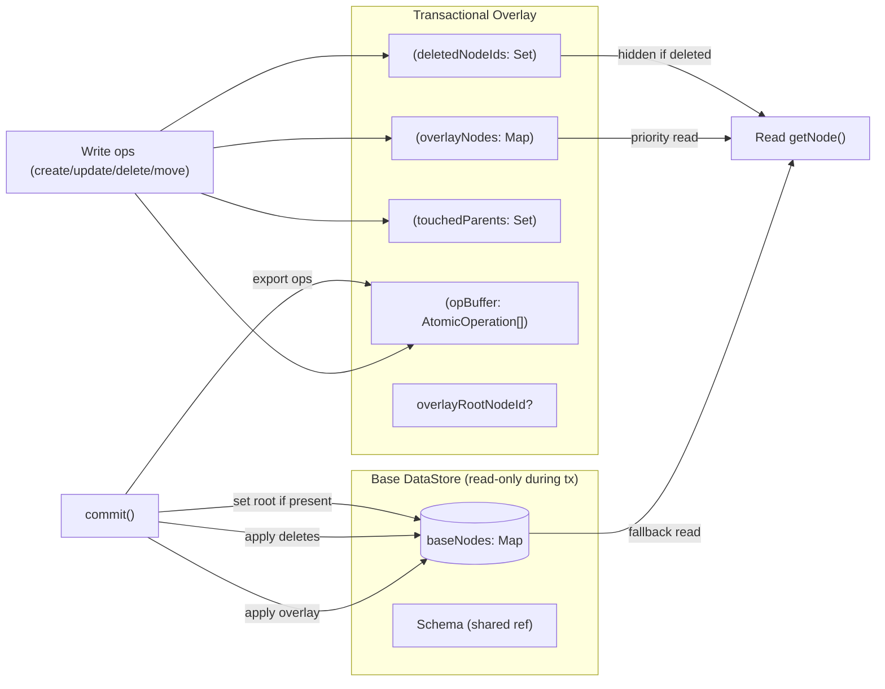
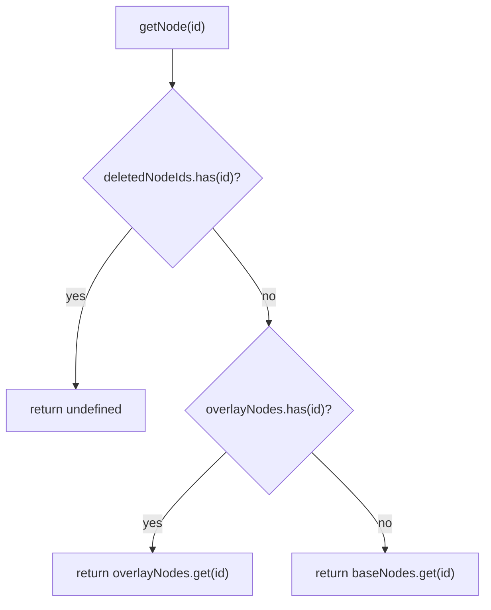
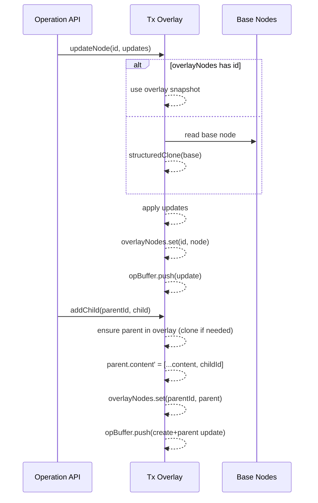
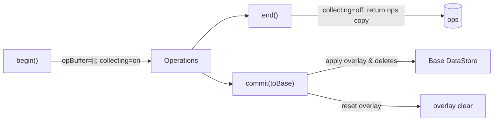

# DataStore Transactional Clone (Copy-on-Write Overlay) Spec

## 0. 전제(Assumptions)
- TransactionManager가 트랜잭션 구간 동안 전역 write 락을 보장한다. 외부 쓰기는 트랜잭션이 끝날 때까지 차단된다.
- 선택적 안전망으로 begin 시점의 `baseVersion`을 캡처하고, 커밋 시 동일 여부를 확인할 수 있다(정책에 따라 사용).

## 1. 목적
- 트랜잭션 시작 시 전체 복사 비용을 제거하고, 변경된 노드에 한해서만 비용을 지불한다.
- 원본 DataStore는 읽기 전용으로 참조하고, 트랜잭션 로컬 오버레이에 변경분만 축적한다.
- 기존 원자 op 수집(create/update/delete/move)과 호환된다.

### 1.1 요약(핵심 아이디어)
- 읽기 경로는 overlay > deleted-check > base 순으로 일관성 있게 동작한다.
- 쓰기는 항상 오버레이(COW)로만 반영되고, `commit()` 시점에만 base에 적용된다.
- `begin()/end()`는 원자 op를 배치로 수집하고, `commit()/rollback()`은 오버레이 내용을 반영/폐기한다.
- 구조적 공유를 통해 변경된 노드만 복제하여 성능과 메모리를 절약한다.

## 2. 핵심 개념
- Copy-on-Write(COW): 실제 쓰기 시점에 해당 노드를 복제하여 오버레이에 저장.
- Overlay Map: 트랜잭션 동안 수정/생성된 노드의 최신 스냅샷을 담는 `Map<string, INode>`.
- Deleted Set: 트랜잭션 동안 삭제된 노드 ID 집합.
- Touched Parents: `content`가 변경된 부모 ID 집합(순서 및 연결 변경 추적).
- Schema: 원본과 공유(참조 유지). 검증은 오버레이 결과를 입력으로 수행.
- Global Write Lock: 동시 쓰기 충돌은 TransactionManager의 락으로 예방(필요 시 버전 검증과 병행 가능).

## 3. 데이터 구조
- baseNodes: 원본 `Map<string, INode>` (읽기 전용 참조)
- overlayNodes: `Map<string, INode>` (COW 결과 저장)
- deletedNodeIds: `Set<string>`
- touchedParents: `Set<string>`
- overlayRootNodeId?: `string` (루트 변경 시)
- opBuffer: `AtomicOperation[]` (기존 begin/end 수집)
- sessionId/globalCounter: 기존 규칙 유지(클론별 카운터 독립)

## 3.1 구조 다이어그램

## 4. 읽기 규칙
- getNode(id):
  1) `deletedNodeIds.has(id)` → undefined
  2) `overlayNodes.get(id)` → 반환
  3) fallback: `baseNodes.get(id)`
- content 접근: 부모가 overlay에 있으면 overlay.content, 아니면 base.content 사용
- 파생 API(find/getChildren/…): 위 규칙을 일관되게 사용

### 4.1 읽기 플로우

## 5. 쓰기 규칙(COW)
- updateNode(id, updates):
  - source = `overlayNodes.get(id)` 또는 `structuredClone(baseNodes.get(id))`
  - updates 적용 → `overlayNodes.set(id, source)`
  - opBuffer에 `update` 수집
- createNode/addChild:
  - 새 노드 생성 후 `overlayNodes.set(newId, node)`
  - 부모 content는 overlay에서 복제-수정
  - opBuffer에 `create`/부모 `update` 수집
- deleteNode(id):
  - `deletedNodeIds.add(id)`
  - 부모 content overlay에서 제거
  - opBuffer에 `delete`/부모 `update` 수집
- move/reorder:
  - 부모 content overlay에서 조작
  - opBuffer에 `move` 수집(필요 시 다중 move)

### 5.1 쓰기/부모 content 업데이트 시퀀스

## 6. 트랜잭션 수명주기
- begin(): opBuffer 초기화, 수집 on, (옵션) `baseVersion = store.version` 캡처
- getCollectedOperations(): 버퍼 복사 반환
- end(): 수집 off, 버퍼 반환(overlay는 유지)
- commit():
  - overlayNodes → base에 반영(setNodeInternal)
  - deletedNodeIds → base에서 제거
  - root 변경 시 base.rootNodeId 갱신
  - (옵션) `assert(store.version === baseVersion)`로 사전 검증
  - opBuffer는 상위 계층(CRDT/네트워크)로 전달됨
  - overlay 상태 reset
- rollback(): overlay/sets/opBuffer 초기화

### 6.1 begin/end/commit 다이어그램

## 7. 스키마 및 검증
- 활성 스키마는 공유(참조). 검증은 overlay snapshot에 대해 수행
- `validateNode(node, schema)`는 overlay 결과를 입력으로 사용

## 8. 성능 특성
- 트랜잭션 시작 비용: O(1)
- 총 비용: 수정된 노드/부모 수에 비례
- 복제: `structuredClone` 우선, 폴백 수동 복사

## 9. 불변성/일관성 규칙
- overlay의 모든 `content` 변경은 새 배열로 생성(참조 공유 금지)
- 삭제된 노드는 읽기 경로에서 즉시 사라져야 함
- 부모-자식 관계 업데이트 시 양방향 일관성 유지(parent.content, child.parentId)

## 10. 경계 사례
- 대량 삭제: `deletedNodeIds` 기준으로 순회 필터 필요
- 다중 이동/재정렬: `move` op를 순서대로 수집
- 루트 교체: `overlayRootNodeId` 설정 후 커밋 시 적용
- 동시 갱신 충돌: 트랜잭션 상위에서 순서/락(policy)로 해결(본 스펙 범위 밖)

## 11. 마이그레이션 경로
1) 현 clone() 유지(전체 복사) + 본 오버레이 구조를 별도 `TransactionalDataStore`로 시범 도입
2) `Core/Content/Range` 연산이 내부에서 `getNode`/`_setNodeInternal`을 통해 overlay-aware 동작하도록 위임
3) 안정화 후, 트랜잭션 경로에서 기본 clone을 오버레이 클론으로 전환

## 12. 테스트 전략
- 읽기 우선순위: overlay > delete-check > base
- update/create/delete/move의 op 수집 및 부모 업데이트 수집 검증
- marks/attributes/content가 원본과 참조 공유되지 않음을 검증
- 대형 문서(1k+/5k+ 노드)에서 begin 성능이 O(1)에 근접하는지 벤치

---
본 스펙은 기존 원자 op 수집 메커니즘과 호환되며, 트랜잭션 비용을 실제 수정 범위로 제한하기 위해 Copy-on-Write 오버레이 계층을 도입한다.

## 부록 A. 이론적 배경 및 참고 자료
- Copy-on-Write(COW): 변경 시점에만 블록/노드를 복제하는 전략. 파일시스템 ZFS/Btrfs의 스냅샷/클론 구현에 널리 사용.
  - 참고: “The Zettabyte File System (ZFS)” 문서, Btrfs 디자인 노트
- Shadow Paging / 버전드 스냅샷: 트랜잭션 동안 원본은 불변, 커밋 시 새 루트로 스위칭.
  - 참고: Theodore Lorie, “Physical Integrity in a Large Segmented Database,” 1977
- MVCC(Multi-Version Concurrency Control): 트랜잭션별 스냅샷 읽기와 새 버전 쓰기 모델.
  - 참고: PostgreSQL MVCC 문서; Berenson et al., “A Critique of ANSI SQL Isolation Levels,” 1995
- 영속(함수형) 자료구조: 구조적 공유로 변경 경로만 복제하는 트리/맵 설계의 이론적 토대.
  - 참고: Chris Okasaki, “Purely Functional Data Structures,” 1999
- 로그 기반 커밋(ARIES): WAL/리커버리 관점에서 커밋 원자성과 적용 순서를 다루는 고전.
  - 참고: C. Mohan et al., “ARIES: A Transaction Recovery Method…,” 1992
- Overlay/Union 파일시스템: 상위 레이어 우선 읽기와 상위 레이어로의 쓰기(COW) 모델.
  - 참고: Linux OverlayFS, UnionFS 설계 문서
- CRDT/OT: 수집된 원자 op 배치의 전파/머지 모델 설계 시 참고되는 동시 편집 이론.
  - 참고: Shapiro et al., “Conflict-free Replicated Data Types,” 2011
