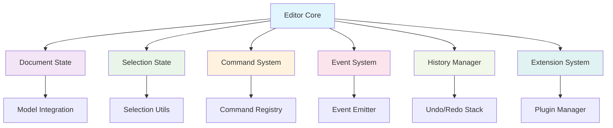

# Editor Core Specification

## 1. 개요

`editor-core`는 에디터의 모든 데이터와 로직을 관리하는 핵심 패키지입니다. UI와 플랫폼에 독립적으로 동작하며, 순수한 에디터 상태 관리와 명령어 시스템을 제공합니다. React, DOM, 또는 다른 플랫폼에서 동일한 에디터 로직을 재사용할 수 있도록 설계되었습니다.

## 2. 설계 목표

- **플랫폼 독립성**: UI 프레임워크에 의존하지 않는 순수 로직
- **상태 중앙화**: 모든 에디터 상태를 중앙에서 관리
- **명령어 시스템**: 확장 가능한 명령어 기반 API
- **이벤트 기반**: 상태 변경을 이벤트로 알림
- **확장성**: 플러그인과 확장을 통한 기능 추가
- **테스트 용이성**: 순수 함수와 명확한 인터페이스

## 3. 아키텍처

### 3.1 전체 구조


### 3.2 핵심 컴포넌트

#### A. Document State (문서 상태)
- 현재 문서의 모든 노드와 구조
- `@barocss/model`과의 통합
- 문서 변경 감지 및 이벤트 발생

#### B. Selection State (선택 상태)
- 현재 커서 위치 및 선택 영역
- 선택 변경 감지 및 이벤트 발생
- 선택 유효성 검증

#### C. Command System (명령어 시스템)
- 확장 가능한 명령어 등록 및 실행
- 명령어 체이닝 지원
- 명령어 실행 전후 훅

#### D. Event System (이벤트 시스템)
- 상태 변경 이벤트 발생
- 외부 구독자에게 알림
- 이벤트 필터링 및 변환

#### E. History Manager (히스토리 관리)
- Undo/Redo 스택 관리
- 트랜잭션 기반 히스토리
- 히스토리 제한 및 최적화

#### F. Extension System (확장 시스템)
- 플러그인 등록 및 관리
- 확장 간 의존성 관리
- 확장 생명주기 관리

## 4. 핵심 API

### 4.1 Editor 클래스

```typescript
export class Editor {
  // 상태 접근
  get document(): DocumentState;
  get selection(): SelectionState;
  get isFocused(): boolean;
  get isEditable(): boolean;
  
  // 명령어 실행
  chain(): CommandChain;
  executeCommand(command: string, payload?: any): boolean;
  canExecuteCommand(command: string, payload?: any): boolean;
  
  // 상태 변경
  setContent(content: DocumentState): void;
  updateSelection(selection: SelectionState): void;
  setEditable(editable: boolean): void;
  
  // 이벤트 관리
  on(event: string, callback: Function): void;
  off(event: string, callback: Function): void;
  emit(event: string, data?: any): void;
  
  // 확장 관리
  use(extension: Extension): void;
  unuse(extension: Extension): void;
  
  // 히스토리
  undo(): void;
  redo(): void;
  canUndo(): boolean;
  canRedo(): boolean;
  
  // 생명주기
  destroy(): void;
}

interface EditorOptions {
  content?: DocumentState;
  extensions?: Extension[];
  editable?: boolean;
  history?: HistoryOptions;
  model?: ModelOptions;
}
```

### 4.2 Document State

```typescript
export interface DocumentState {
  type: 'document';
  content: Node[];
  version: number;
  createdAt: Date;
  updatedAt: Date;
}

export interface Node {
  id: string;
  type: string;
  attributes?: Record<string, any>;
  content?: Node[];
  text?: string;
  marks?: Mark[];
}

export interface Mark {
  type: string;
  attributes?: Record<string, any>;
  range?: [number, number];
}
```

### 4.3 Selection State

```typescript
export interface SelectionState {
  anchor: number;        // 선택 시작 위치
  head: number;          // 선택 끝 위치
  empty: boolean;        // 빈 선택 여부
  from: number;          // 선택 시작 (anchor와 head 중 작은 값)
  to: number;            // 선택 끝 (anchor와 head 중 큰 값)
  ranges: SelectionRange[]; // 다중 선택 지원
}

export interface SelectionRange {
  anchor: number;
  head: number;
  from: number;
  to: number;
}
```

### 4.4 Command System

```typescript
export interface Command {
  name: string;
  execute: (editor: Editor, payload?: any) => boolean;
  canExecute?: (editor: Editor, payload?: any) => boolean;
  before?: (editor: Editor, payload?: any) => void;
  after?: (editor: Editor, payload?: any) => void;
}

export class CommandChain {
  private editor: Editor;
  private commands: Array<{ command: string; payload?: any }> = [];
  
  constructor(editor: Editor);
  
  // 명령어 추가
  insertText(text: string): CommandChain;
  deleteSelection(): CommandChain;
  toggleBold(): CommandChain;
  toggleItalic(): CommandChain;
  setHeading(level: number): CommandChain;
  insertParagraph(): CommandChain;
  focus(): CommandChain;
  
  // 실행
  run(): boolean;
  canRun(): boolean;
}
```

### 4.5 Extension System

```typescript
export interface Extension {
  name: string;
  priority?: number;
  dependencies?: string[];
  
  // 생명주기
  onBeforeCreate?(editor: Editor): void;
  onCreate?(editor: Editor): void;
  onDestroy?(editor: Editor): void;
  
  // 명령어 등록
  commands?: Command[];
  
  // 이벤트 처리
  onTransaction?(editor: Editor, transaction: Transaction): void;
  onSelectionChange?(editor: Editor, selection: SelectionState): void;
  onContentChange?(editor: Editor, content: DocumentState): void;
  
  // 상태 확장
  addState?: (editor: Editor) => any;
  addStorage?: (editor: Editor) => any;
}

// 기본 확장들
export class BoldExtension implements Extension {
  name = 'bold';
  commands = [
    {
      name: 'toggleBold',
      execute: (editor: Editor) => {
        // Bold 토글 로직
        return true;
      }
    }
  ];
}

export class ItalicExtension implements Extension {
  name = 'italic';
  commands = [
    {
      name: 'toggleItalic',
      execute: (editor: Editor) => {
        // Italic 토글 로직
        return true;
      }
    }
  ];
}
```

## 5. 이벤트 시스템

### 5.1 이벤트 타입

```typescript
export interface EditorEvents {
  // 문서 이벤트
  'contentChange': { content: DocumentState; transaction: Transaction };
  'nodeCreate': { node: Node; position: number };
  'nodeUpdate': { node: Node; oldNode: Node };
  'nodeDelete': { node: Node; position: number };
  
  // 선택 이벤트
  'selectionChange': { selection: SelectionState; oldSelection: SelectionState };
  'focus': { selection: SelectionState };
  'blur': { selection: SelectionState };
  
  // 명령어 이벤트
  'commandExecute': { command: string; payload?: any; success: boolean };
  'commandBefore': { command: string; payload?: any };
  'commandAfter': { command: string; payload?: any; success: boolean };
  
  // 히스토리 이벤트
  'historyChange': { canUndo: boolean; canRedo: boolean };
  'undo': { transaction: Transaction };
  'redo': { transaction: Transaction };
  
  // 확장 이벤트
  'extensionAdd': { extension: Extension };
  'extensionRemove': { extension: Extension };
  
  // 생명주기 이벤트
  'create': { editor: Editor };
  'destroy': { editor: Editor };
}
```

### 5.2 이벤트 사용 예시

```typescript
const editor = new Editor({
  content: initialContent,
  extensions: [BoldExtension, ItalicExtension]
});

// 문서 변경 감지
editor.on('contentChange', ({ content, transaction }) => {
  console.log('문서가 변경되었습니다:', content);
  // 자동 저장, 실시간 협업 등
});

// 선택 변경 감지
editor.on('selectionChange', ({ selection, oldSelection }) => {
  console.log('선택이 변경되었습니다:', selection);
  // 툴바 상태 업데이트, 버블 메뉴 표시 등
});

// 명령어 실행 감지
editor.on('commandExecute', ({ command, payload, success }) => {
  if (success) {
    console.log(`명령어 ${command}가 성공적으로 실행되었습니다`);
  }
});
```

## 6. Model 통합

### 6.1 Model 연동

```typescript
export class Editor {
  private model: Model;
  private transactionManager: TransactionManager;
  
  constructor(options: EditorOptions) {
    // Model 초기화
    this.model = new Model(options.model);
    this.transactionManager = new TransactionManager(this.model);
    
    // Model 이벤트 구독
    this.setupModelEventHandling();
  }
  
  private setupModelEventHandling(): void {
    this.transactionManager.on('transaction_commit', (event) => {
      // Model 변경을 Editor 이벤트로 변환
      this.emit('contentChange', {
        content: this.model.getDocument(),
        transaction: event.transaction
      });
    });
  }
  
  // 트랜잭션 실행
  executeTransaction(transaction: Transaction): void {
    this.transactionManager.execute(transaction);
  }
}
```

### 6.2 Document 동기화

```typescript
export class Editor {
  // Model에서 Document 가져오기
  get document(): DocumentState {
    return this.model.getDocument();
  }
  
  // Document 설정
  setContent(content: DocumentState): void {
    const transaction = this.model.createTransaction();
    transaction.replaceDocument(content);
    this.executeTransaction(transaction);
  }
  
  // 부분 업데이트
  updateNode(nodeId: string, updates: Partial<Node>): void {
    const transaction = this.model.createTransaction();
    transaction.updateNode(nodeId, updates);
    this.executeTransaction(transaction);
  }
}
```

## 7. 사용 예시

### 7.1 기본 사용법

```typescript
import { Editor } from '@barocss/editor-core';
import { BoldExtension, ItalicExtension } from '@barocss/editor-core/extensions';

// 에디터 생성
const editor = new Editor({
  content: {
    type: 'document',
    content: [
      {
        id: 'p1',
        type: 'paragraph',
        content: [
          {
            id: 't1',
            type: 'text',
            text: 'Hello World'
          }
        ]
      }
    ]
  },
  extensions: [BoldExtension, ItalicExtension],
  editable: true
});

// 이벤트 구독
editor.on('contentChange', ({ content }) => {
  console.log('문서 변경:', content);
});

// 명령어 실행
editor.chain()
  .focus()
  .insertText('Hello ')
  .toggleBold()
  .insertText('World')
  .run();

// 상태 확인
console.log('현재 문서:', editor.document);
console.log('현재 선택:', editor.selection);
console.log('포커스 상태:', editor.isFocused);
```

### 7.2 확장 개발

```typescript
// 커스텀 확장 개발
export class LinkExtension implements Extension {
  name = 'link';
  
  commands = [
    {
      name: 'setLink',
      execute: (editor: Editor, payload: { url: string }) => {
        const { url } = payload;
        const { selection } = editor;
        
        if (selection.empty) {
          return false;
        }
        
        // 링크 설정 로직
        const transaction = editor.model.createTransaction();
        transaction.addMark(selection.from, selection.to, {
          type: 'link',
          attributes: { href: url }
        });
        
        editor.executeTransaction(transaction);
        return true;
      },
      canExecute: (editor: Editor, payload: { url: string }) => {
        return !editor.selection.empty && payload.url;
      }
    }
  ];
  
  onCreate(editor: Editor): void {
    // 확장 초기화
    console.log('LinkExtension이 초기화되었습니다');
  }
}

// 확장 사용
const editor = new Editor({
  extensions: [BoldExtension, ItalicExtension, LinkExtension]
});

// 링크 설정
editor.executeCommand('setLink', { url: 'https://example.com' });
```

### 7.3 플랫폼별 래퍼

```typescript
// DOM 플랫폼용 래퍼
export class DOMEditorWrapper {
  private editor: Editor;
  private element: HTMLElement;
  
  constructor(element: HTMLElement, options: EditorOptions) {
    this.editor = new Editor(options);
    this.element = element;
    
    this.setupDOMIntegration();
  }
  
  private setupDOMIntegration(): void {
    // DOM 이벤트를 Editor 명령어로 변환
    this.element.addEventListener('input', (e) => {
      const transaction = this.createTransactionFromInput(e);
      this.editor.executeTransaction(transaction);
    });
    
    // Editor 이벤트를 DOM 업데이트로 변환
    this.editor.on('contentChange', ({ content }) => {
      this.renderContent(content);
    });
  }
}

// React 플랫폼용 래퍼
export function useEditor(options: EditorOptions) {
  const [editor] = useState(() => new Editor(options));
  const [document, setDocument] = useState(editor.document);
  const [selection, setSelection] = useState(editor.selection);
  
  useEffect(() => {
    const handleContentChange = ({ content }: { content: DocumentState }) => {
      setDocument(content);
    };
    
    const handleSelectionChange = ({ selection }: { selection: SelectionState }) => {
      setSelection(selection);
    };
    
    editor.on('contentChange', handleContentChange);
    editor.on('selectionChange', handleSelectionChange);
    
    return () => {
      editor.off('contentChange', handleContentChange);
      editor.off('selectionChange', handleSelectionChange);
    };
  }, [editor]);
  
  return { editor, document, selection };
}
```

## 8. 성능 최적화

### 8.1 배치 업데이트

```typescript
export class Editor {
  private updateQueue: Array<() => void> = [];
  private isUpdating = false;
  
  private scheduleUpdate(update: () => void): void {
    this.updateQueue.push(update);
    
    if (!this.isUpdating) {
      this.isUpdating = true;
      requestAnimationFrame(() => {
        this.flushUpdates();
      });
    }
  }
  
  private flushUpdates(): void {
    while (this.updateQueue.length > 0) {
      const update = this.updateQueue.shift();
      update?.();
    }
    this.isUpdating = false;
  }
}
```

### 8.2 메모이제이션

```typescript
export class Editor {
  private selectionCache = new Map<string, SelectionState>();
  private documentCache = new Map<string, DocumentState>();
  
  get selection(): SelectionState {
    const key = this.getSelectionKey();
    if (!this.selectionCache.has(key)) {
      this.selectionCache.set(key, this.calculateSelection());
    }
    return this.selectionCache.get(key)!;
  }
  
  private getSelectionKey(): string {
    return `${this.model.getSelection().anchor}-${this.model.getSelection().head}`;
  }
}
```

## 9. 테스트 전략

### 9.1 단위 테스트

```typescript
describe('Editor', () => {
  let editor: Editor;
  
  beforeEach(() => {
    editor = new Editor({
      content: {
        type: 'document',
        content: [
          {
            id: 'p1',
            type: 'paragraph',
            content: [{ id: 't1', type: 'text', text: 'Hello' }]
          }
        ]
      },
      extensions: [BoldExtension]
    });
  });
  
  it('문서 내용을 올바르게 설정한다', () => {
    const newContent = {
      type: 'document',
      content: [
        {
          id: 'p2',
          type: 'paragraph',
          content: [{ id: 't2', type: 'text', text: 'World' }]
        }
      ]
    };
    
    editor.setContent(newContent);
    expect(editor.document).toEqual(newContent);
  });
  
  it('명령어를 올바르게 실행한다', () => {
    const result = editor.executeCommand('toggleBold');
    expect(result).toBe(true);
  });
  
  it('이벤트를 올바르게 발생시킨다', () => {
    const callback = jest.fn();
    editor.on('contentChange', callback);
    
    editor.setContent(newContent);
    expect(callback).toHaveBeenCalledWith({
      content: newContent,
      transaction: expect.any(Object)
    });
  });
});
```

### 9.2 통합 테스트

```typescript
describe('Editor Integration', () => {
  it('전체 워크플로우가 올바르게 동작한다', () => {
    const editor = new Editor({
      extensions: [BoldExtension, ItalicExtension]
    });
    
    // 1. 텍스트 삽입
    editor.chain().insertText('Hello ').run();
    
    // 2. Bold 적용
    editor.chain().toggleBold().run();
    
    // 3. 추가 텍스트 삽입
    editor.chain().insertText('World').run();
    
    // 4. 결과 확인
    const document = editor.document;
    expect(document.content[0].content[0].marks).toContainEqual({
      type: 'bold',
      range: [0, 6]
    });
  });
});
```

## 10. 확장성

### 10.1 플러그인 아키텍처

```typescript
export interface Plugin {
  name: string;
  version: string;
  dependencies?: string[];
  
  install(editor: Editor): void;
  uninstall?(editor: Editor): void;
}

export class PluginManager {
  private plugins = new Map<string, Plugin>();
  private editor: Editor;
  
  constructor(editor: Editor) {
    this.editor = editor;
  }
  
  install(plugin: Plugin): void {
    if (this.plugins.has(plugin.name)) {
      throw new Error(`Plugin ${plugin.name} is already installed`);
    }
    
    // 의존성 확인
    this.checkDependencies(plugin);
    
    // 플러그인 설치
    plugin.install(this.editor);
    this.plugins.set(plugin.name, plugin);
  }
  
  private checkDependencies(plugin: Plugin): void {
    if (plugin.dependencies) {
      for (const dep of plugin.dependencies) {
        if (!this.plugins.has(dep)) {
          throw new Error(`Plugin ${plugin.name} requires ${dep} to be installed first`);
        }
      }
    }
  }
}
```

### 10.2 커스텀 명령어

```typescript
export class CustomCommandExtension implements Extension {
  name = 'customCommands';
  
  commands = [
    {
      name: 'insertEmoji',
      execute: (editor: Editor, payload: { emoji: string }) => {
        const { emoji } = payload;
        editor.chain().insertText(emoji).run();
        return true;
      }
    },
    {
      name: 'duplicateLine',
      execute: (editor: Editor) => {
        const { selection } = editor;
        const lineText = this.getLineText(editor, selection.from);
        editor.chain().insertText('\n' + lineText).run();
        return true;
      }
    }
  ];
  
  private getLineText(editor: Editor, position: number): string {
    // 라인 텍스트 추출 로직
    return '';
  }
}
```

## 11. 에러 처리

### 11.1 명령어 실행 에러

```typescript
export class Editor {
  executeCommand(command: string, payload?: any): boolean {
    try {
      const commandDef = this.commandRegistry.get(command);
      if (!commandDef) {
        console.warn(`Command ${command} not found`);
        return false;
      }
      
      if (commandDef.canExecute && !commandDef.canExecute(this, payload)) {
        return false;
      }
      
      commandDef.before?.(this, payload);
      const result = commandDef.execute(this, payload);
      commandDef.after?.(this, payload);
      
      return result;
    } catch (error) {
      console.error(`Error executing command ${command}:`, error);
      this.emit('commandError', { command, payload, error });
      return false;
    }
  }
}
```

### 11.2 확장 에러

```typescript
export class Editor {
  use(extension: Extension): void {
    try {
      extension.onBeforeCreate?.(this);
      this.registerExtension(extension);
      extension.onCreate?.(this);
      this.emit('extensionAdd', { extension });
    } catch (error) {
      console.error(`Error installing extension ${extension.name}:`, error);
      throw error;
    }
  }
}
```

## 12. 마이그레이션 가이드

### 12.1 기존 에디터에서 마이그레이션

```typescript
// 기존 방식 (통합 에디터)
const editor = new EditorViewDOM(container, {
  schema: mySchema,
  model: myModel,
  store: myStore
});

// 새로운 방식 (분리된 아키텍처)
const editor = new Editor({
  content: myContent,
  extensions: [BoldExtension, ItalicExtension]
});

const domEditor = new DOMEditor({
  core: editor,
  element: container,
  rendererRegistry: myRegistry,
  transactionManager: myTransactionManager
});
```

## 13. 마일스톤

1. **기본 Editor 클래스**: 핵심 상태 관리 및 API 구현
2. **명령어 시스템**: 확장 가능한 명령어 등록 및 실행
3. **이벤트 시스템**: 상태 변경 이벤트 발생 및 구독
4. **확장 시스템**: 플러그인 아키텍처 및 기본 확장
5. **Model 통합**: @barocss/model과의 완전한 통합
6. **히스토리 관리**: Undo/Redo 기능 구현
7. **성능 최적화**: 배치 업데이트 및 메모이제이션
8. **테스트 완성**: 단위 테스트 및 통합 테스트
9. **문서화**: API 문서 및 사용 가이드
10. **플러그인 생태계**: 기본 플러그인 라이브러리
