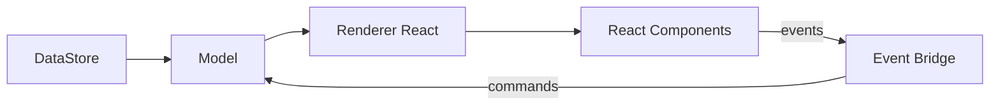

## 개요

React 기반 `EditorView`는 `@barocss/schema`, `@barocss/model`, `@barocss/datastore`와 `@barocss/renderer-react`를 통합하여 React 트리 위에서 실행되는 에디팅 환경을 제공합니다. 구성 요소, 훅, 컨텍스트를 통해 선언적 렌더링과 상호작용을 구현하며, 상세 DSL은 `paper/react-dsl-spec.md`를 참고합니다.

## 설계 목표

- React 일관성: Context/Hook/JSX로 통합
- 선언적 DSL: 컴포넌트 기반 렌더러 정의
- 성능: memoization, key, 분할 렌더
- 확장성: 플러그인/키맵/명령, 주입 가능한 컨텍스트

## 아키텍처

- Schema/Model/DataStore: 문서/트랜잭션/검증
- Renderer React: 노드 타입 → 컴포넌트 매핑, 훅 제공
- EditorView React: Provider 생성, 이벤트/명령 브릿지, Model 구독



## 데이터 흐름

1) Provider 마운트: schema/model/store 주입, Registry 초기화
2) 렌더: `NodeRenderer`가 노드 타입별 컴포넌트로 위임
3) 이벤트: 컴포넌트 이벤트 → 명령 → Model 트랜잭션
4) 업데이트: Model 변경 → 컨텍스트/훅 통해 필요한 컴포넌트만 재렌더

## 라이프사이클

- mount(<Provider>): 컨텍스트 구성, 모델 구독
- update(): 모델 변경 배포, React 재조정에 위임
- unmount(): 구독 해제, 리소스 정리

## 이벤트/명령

- 컴포넌트 핸들러에서 고수준 명령 호출(toggleBold, splitBlock 등)
- 플러그인 훅: beforeTransaction/afterTransaction, command filter

## 선택/포커스

- DOM Selection ↔ Model Selection 동기화: 브릿지 레이어에서 관리
- 입력/합성 이벤트 고려, 컨트롤드/언컨트롤드 균형

## 성능 전략

- React.memo, useMemo, useCallback 적극 활용
- key 안정성 유지, 리스트/테이블 가상화 고려
- 배치 업데이트, 트랜잭션 단위 최소 재렌더

## API

```ts
type EditorViewReactOptions = {
  schema: Schema;
  model: Model;
  store: DataStore;
};

type EditorViewReactApi = {
  Provider: (props: { children: ReactNode }) => ReactNode;
};
```

추가 제공 예정 API

- `useEditor()` 상위 수준 훅(뷰 레벨 확장 훅)
- `registerCommands(map)`, `registerKeymap(map)`
- `useTransactionEffect`(afterTransaction 구독)

## DSL 연동 가이드

- 컴포넌트 DSL: `rendererReact('paragraph', ParagraphComponent)` 형태로 등록
- 속성 계산: 파생 props는 팩토리 또는 컨텍스트 셀렉터로 계산
- 이벤트: 컴포넌트 onClick → 명령 실행 → Model 업데이트

자세한 React DSL은 `paper/react-dsl-spec.md` 참고.

## 보안/접근성

- XSS 방지: 위험 속성 제한, `dangerouslySetInnerHTML` 금지 원칙
- A11y: 역할/aria, 키보드 내비게이션, 포커스 트랩

## 마일스톤

1) Provider/Registry/NodeRenderer 골격 완성
2) 선택/포커스 동기화, 명령 브릿지
3) 플러그인 시스템과 키맵
4) 성능 최적화 및 대규모 문서 벤치


