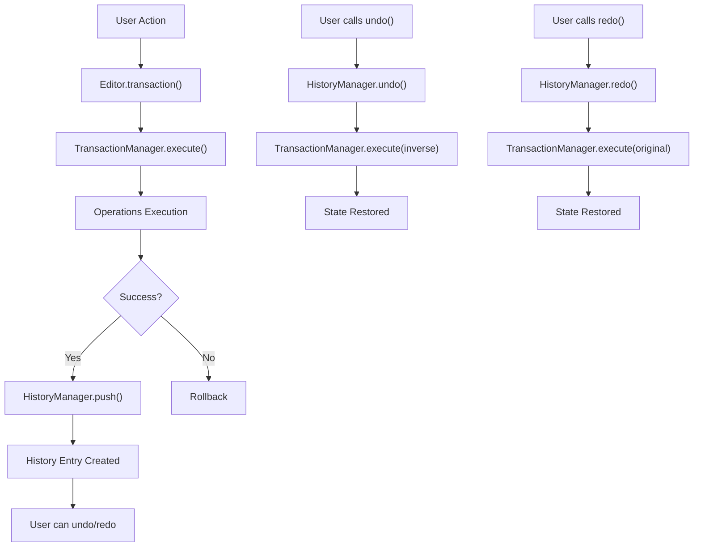

# History System Specification

## 개요

Barocss Editor의 History System은 사용자의 편집 작업을 추적하고 실행 취소/다시 실행 기능을 제공하는 핵심 시스템입니다. 동시편집(협업 편집)을 지원하기 위해 Checkpoint 시스템을 제거하고 단순화된 History 시스템을 제공합니다. 이 시스템은 `editor-core` 패키지의 `HistoryManager`와 `Editor` 클래스를 통해 구현됩니다.

## 아키텍처

### 핵심 컴포넌트

1. **HistoryManager** (`editor-core/src/history-manager.ts`)
   - 히스토리 엔트리 저장 및 관리
   - 실행 취소/다시 실행 로직
   - 히스토리 크기 제한 및 동적 조정
   - 히스토리 압축 및 메모리 최적화
   - 상태 검증 및 무결성 보장

2. **Editor** (`editor-core/src/editor.ts`)
   - HistoryManager 인스턴스 관리
   - History 관련 API 제공
   - TransactionManager와의 통합

3. **TransactionManager** (`model/src/transaction.ts`)
   - 성공한 트랜잭션을 HistoryManager에 자동 추가
   - 역함수 operations 수집 및 저장

### 데이터 흐름



## API Reference

### Editor History Methods

#### `undo(): Promise<boolean>`
실행 취소를 수행합니다.

```typescript
const success = await editor.undo();
if (success) {
  console.log('실행 취소 완료');
} else {
  console.log('실행 취소할 작업이 없음');
}
```

#### `redo(): Promise<boolean>`
다시 실행을 수행합니다.

```typescript
const success = await editor.redo();
if (success) {
  console.log('다시 실행 완료');
} else {
  console.log('다시 실행할 작업이 없음');
}
```

#### `canUndo(): boolean`
실행 취소 가능 여부를 확인합니다.

```typescript
if (editor.canUndo()) {
  // 실행 취소 버튼 활성화
  undoButton.disabled = false;
}
```

#### `canRedo(): boolean`
다시 실행 가능 여부를 확인합니다.

```typescript
if (editor.canRedo()) {
  // 다시 실행 버튼 활성화
  redoButton.disabled = false;
}
```


#### `getHistoryStats(): HistoryStats`
히스토리 통계 정보를 반환합니다.

```typescript
const stats = editor.getHistoryStats();
console.log(`총 엔트리: ${stats.totalEntries}`);
console.log(`현재 인덱스: ${stats.currentIndex}`);
console.log(`실행 취소 가능: ${stats.canUndo}`);
console.log(`다시 실행 가능: ${stats.canRedo}`);
```

#### `clearHistory(): void`
히스토리를 초기화합니다.

```typescript
editor.clearHistory();
console.log('히스토리가 초기화되었습니다');
```

#### `compressHistory(): void`
연속된 유사한 작업들을 압축하여 메모리 사용량을 최적화합니다.

```typescript
// 연속된 텍스트 작업 후 압축
await editor.transaction([setText('node1', 'Hello')]).commit();
await editor.transaction([setText('node1', 'Hello World')]).commit();
await editor.transaction([setText('node1', 'Hello World!')]).commit();

editor.compressHistory(); // 3개 작업을 1개로 압축
```

#### `resizeHistory(maxSize: number): void`
히스토리 크기를 동적으로 조정합니다.

```typescript
// 히스토리 크기를 50개로 축소
editor.resizeHistory(50);
```

#### `getHistoryMemoryUsage(): number`
현재 히스토리의 메모리 사용량을 바이트 단위로 반환합니다.

```typescript
const memoryUsage = editor.getHistoryMemoryUsage();
console.log(`히스토리 메모리 사용량: ${memoryUsage} bytes`);
```

#### `validateHistory(): { isValid: boolean; errors: string[] }`
히스토리 상태의 무결성을 검증합니다.

```typescript
const validation = editor.validateHistory();
if (!validation.isValid) {
  console.error('히스토리 무결성 오류:', validation.errors);
}
```

### HistoryManager Configuration

#### EditorOptions

```typescript
interface HistoryManagerOptions {
  maxSize?: number;           // 최대 히스토리 크기 (기본값: 100)
}
```

#### 사용 예시

```typescript
const editor = new Editor({
  history: {
    maxSize: 50           // 최대 50개 히스토리 엔트리
  }
});
```

## History Entry 구조

### HistoryEntry Interface

```typescript
interface HistoryEntry {
  id: string;                    // 고유 식별자
  timestamp: Date;               // 생성 시간
  operations: TransactionOperation[];      // 실행된 operations
  inverseOperations: TransactionOperation[]; // 역함수 operations
  description?: string;          // 설명 (선택사항)
  metadata?: Record<string, any>; // 추가 메타데이터 (선택사항)
}
```

### History Entry 생성 과정

1. **트랜잭션 실행**: `TransactionManager.execute()` 호출
2. **Operations 실행**: 각 operation의 `execute()` 메서드 호출
3. **Inverse 수집**: 각 operation의 `inverse` 속성 수집
4. **History Entry 생성**: `HistoryManager.push()` 호출
5. **저장**: 히스토리 배열에 추가

## 히스토리 추가 규칙

### 자동 추가되는 경우

- 트랜잭션이 성공적으로 완료된 경우
- 실행된 operations가 1개 이상인 경우
- undo/redo 플래그가 설정되지 않은 경우

### 제외되는 경우

```typescript
private _shouldAddToHistory(operations: TransactionOperation[]): boolean {
  // 빈 operations는 히스토리에 추가하지 않음
  if (operations.length === 0) return false;
  
  // undo/redo operation은 히스토리에 추가하지 않음
  if (this._isUndoRedoOperation) return false;
  
  return true;
}
```

### Undo/Redo 중복 방지

undo/redo 작업은 히스토리에 추가되지 않도록 플래그 기반으로 제어됩니다:

```typescript
// Editor의 undo/redo 메서드에서
Editor.prototype.undo = async function(): Promise<boolean> {
  const entry = this._historyManager.undo();
  if (!entry) return false;

  try {
    // undo/redo 플래그 설정
    this._transactionManager._isUndoRedoOperation = true;
    
    // 역함수 operations 실행
    const result = await this._transactionManager.execute(entry.inverseOperations);
    return result.success;
  } finally {
    // 플래그 해제
    this._transactionManager._isUndoRedoOperation = false;
  }
};
```


## 성능 고려사항

### 메모리 사용량

- 히스토리 엔트리는 전체 operation과 inverse를 저장
- `maxSize` 설정으로 메모리 사용량 제한
- 오래된 엔트리는 자동 삭제
- `compressHistory()`로 연속된 유사 작업 압축
- `getHistoryMemoryUsage()`로 메모리 사용량 모니터링

### 실행 성능

- 히스토리 추가는 트랜잭션 완료 후 비동기 처리
- undo/redo는 새로운 트랜잭션으로 실행
- 히스토리 압축으로 메모리 사용량 최적화
- 동적 크기 조정으로 필요에 따라 히스토리 크기 조절

### 최적화 기능

#### 히스토리 압축
```typescript
// 연속된 텍스트 작업 압축
editor.compressHistory();
```

#### 메모리 모니터링
```typescript
const memoryUsage = editor.getHistoryMemoryUsage();
if (memoryUsage > 1024 * 1024) { // 1MB 초과 시
  editor.resizeHistory(50); // 크기 축소
}
```

#### 상태 검증
```typescript
const validation = editor.validateHistory();
if (!validation.isValid) {
  console.warn('히스토리 무결성 문제:', validation.errors);
}
```

## 에러 처리

### Undo/Redo 실패

```typescript
try {
  const success = await editor.undo();
  if (!success) {
    console.log('실행 취소할 작업이 없습니다');
  }
} catch (error) {
  console.error('실행 취소 중 오류 발생:', error);
}
```


## 테스트

### 단위 테스트

```typescript
describe('History System', () => {
  let editor: Editor;

  beforeEach(() => {
    editor = new Editor({
      history: { maxSize: 5 }
    });
  });

  it('should undo/redo operations', async () => {
    // 트랜잭션 실행
    await editor.transaction([
      create(textNode('paragraph', 'Hello'))
    ]).commit();

    expect(editor.canUndo()).toBe(true);
    
    // 실행 취소
    const undone = await editor.undo();
    expect(undone).toBe(true);
    expect(editor.canRedo()).toBe(true);
  });

  it('should compress history', async () => {
    // 연속된 작업 수행
    await editor.transaction([setText('node1', 'Hello')]).commit();
    await editor.transaction([setText('node1', 'Hello World')]).commit();
    await editor.transaction([setText('node1', 'Hello World!')]).commit();

    const beforeCompress = editor.getHistoryStats().totalEntries;
    editor.compressHistory();
    const afterCompress = editor.getHistoryStats().totalEntries;
    
    expect(afterCompress).toBeLessThan(beforeCompress);
  });

  it('should validate history integrity', () => {
    const validation = editor.validateHistory();
    expect(validation.isValid).toBe(true);
    expect(validation.errors).toHaveLength(0);
  });

  it('should monitor memory usage', async () => {
    const initialMemory = editor.getHistoryMemoryUsage();
    expect(initialMemory).toBe(0);

    await editor.transaction([
      create(textNode('paragraph', 'Hello'))
    ]).commit();

    const afterMemory = editor.getHistoryMemoryUsage();
    expect(afterMemory).toBeGreaterThan(0);
  });

});
```

## 마이그레이션 가이드

### 기존 코드에서 History 사용

```typescript
// 기존 코드
const editor = new Editor();

// History 기능 추가
const editor = new Editor({
  history: {
    maxSize: 100
  }
});

// History API 사용
await editor.undo();
await editor.redo();
```

## 제한사항

1. **메모리 사용량**: 히스토리 엔트리는 메모리를 사용 (압축 기능으로 완화)
2. **성능**: 대량의 operations는 undo/redo 성능에 영향
3. **동시성**: 동시 undo/redo는 지원하지 않음
4. **외부 상태**: 에디터 외부 상태는 히스토리에 포함되지 않음
5. **압축 제한**: 모든 유형의 작업이 압축 가능한 것은 아님

## 구현된 고급 기능

### ✅ 히스토리 압축
- 연속된 유사한 작업들을 하나로 합쳐 메모리 사용량 감소
- `compressHistory()` 메서드로 수동 압축 가능

```typescript
// 연속된 텍스트 작업 압축 예시
await editor.transaction([setText('node1', 'Hello')]).commit();
await editor.transaction([setText('node1', 'Hello World')]).commit();
await editor.transaction([setText('node1', 'Hello World!')]).commit();

// 3개 작업을 1개로 압축
editor.compressHistory();
```

### ✅ 메모리 모니터링
- `getHistoryMemoryUsage()`로 실시간 메모리 사용량 추적
- 대용량 히스토리 관리에 유용

```typescript
// 메모리 사용량 모니터링
const memoryUsage = editor.getHistoryMemoryUsage();
console.log(`현재 히스토리 메모리 사용량: ${(memoryUsage / 1024).toFixed(2)} KB`);

// 메모리 임계값 초과 시 압축
if (memoryUsage > 1024 * 1024) { // 1MB 초과
  editor.compressHistory();
}
```

### ✅ 동적 크기 조정
- `resizeHistory()`로 런타임에 히스토리 크기 조정
- 메모리 상황에 따라 유연한 대응 가능

```typescript
// 메모리 부족 시 히스토리 크기 축소
if (memoryUsage > 512 * 1024) { // 512KB 초과
  editor.resizeHistory(25); // 25개로 축소
}

// 메모리 여유 시 히스토리 크기 확장
if (memoryUsage < 100 * 1024) { // 100KB 미만
  editor.resizeHistory(100); // 100개로 확장
}
```

### ✅ 상태 검증
- `validateHistory()`로 히스토리 무결성 검증
- 데이터 손상 방지 및 디버깅 지원

```typescript
// 정기적인 히스토리 무결성 검사
const validation = editor.validateHistory();
if (!validation.isValid) {
  console.error('히스토리 무결성 오류:', validation.errors);
  // 필요시 히스토리 초기화
  editor.clearHistory();
}
```

### ✅ Undo/Redo 중복 방지
- 플래그 기반으로 undo/redo 작업이 히스토리에 추가되지 않도록 제어
- 히스토리 오염 방지

```typescript
// undo/redo는 히스토리에 추가되지 않음
await editor.undo(); // 이 작업은 히스토리에 추가되지 않음
await editor.redo(); // 이 작업도 히스토리에 추가되지 않음

// 새로운 작업은 정상적으로 히스토리에 추가됨
await editor.transaction([setText('node1', 'New content')]).commit();
```

## 실제 사용 시나리오

### 대용량 문서 편집
```typescript
// 대용량 문서 편집 시 메모리 관리
class LargeDocumentEditor {
  private editor: Editor;
  private memoryThreshold = 5 * 1024 * 1024; // 5MB

  constructor() {
    this.editor = new Editor({
      history: { maxSize: 200 }
    });
  }

  async performOperation(operations: any[]) {
    await this.editor.transaction(operations).commit();
    
    // 메모리 사용량 체크
    const memoryUsage = this.editor.getHistoryMemoryUsage();
    if (memoryUsage > this.memoryThreshold) {
      // 압축 시도
      this.editor.compressHistory();
      
      // 여전히 임계값 초과 시 크기 축소
      const newMemoryUsage = this.editor.getHistoryMemoryUsage();
      if (newMemoryUsage > this.memoryThreshold) {
        this.editor.resizeHistory(100);
      }
    }
  }
}
```

### 실시간 협업 에디터
```typescript
// 협업 에디터에서 히스토리 관리
class CollaborativeEditor {
  private editor: Editor;

  constructor() {
    this.editor = new Editor({
      history: { maxSize: 50 } // 협업에서는 작은 히스토리 유지
    });
  }

  // 정기적인 히스토리 정리
  startHistoryMaintenance() {
    setInterval(() => {
      // 무결성 검사
      const validation = this.editor.validateHistory();
      if (!validation.isValid) {
        console.warn('히스토리 무결성 문제 감지:', validation.errors);
        this.editor.clearHistory();
        return;
      }

      // 메모리 사용량 체크
      const memoryUsage = this.editor.getHistoryMemoryUsage();
      if (memoryUsage > 1024 * 1024) { // 1MB 초과
        this.editor.compressHistory();
      }
    }, 30000); // 30초마다 실행
  }
}
```

### 모바일 환경 최적화
```typescript
// 모바일 환경에서 메모리 최적화
class MobileEditor {
  private editor: Editor;

  constructor() {
    this.editor = new Editor({
      history: { maxSize: 20 } // 모바일에서는 작은 히스토리
    });
  }

  // 메모리 압박 시 히스토리 정리
  handleMemoryPressure() {
    // 즉시 압축
    this.editor.compressHistory();
    
    // 크기 축소
    this.editor.resizeHistory(10);
    
    // 메모리 사용량 확인
    const memoryUsage = this.editor.getHistoryMemoryUsage();
    console.log(`히스토리 메모리 사용량: ${memoryUsage} bytes`);
  }
}
```

## 향후 개선 사항

1. **지연 로딩**: 필요할 때만 히스토리 엔트리 로드
2. **고급 압축**: 더 복잡한 패턴의 작업 압축
3. **분산**: 여러 에디터 인스턴스 간 히스토리 공유
4. **백업/복원**: 히스토리 상태의 영구 저장 및 복원
5. **자동 압축**: 메모리 임계값 도달 시 자동 압축
6. **압축 전략**: 작업 유형별 최적화된 압축 알고리즘
