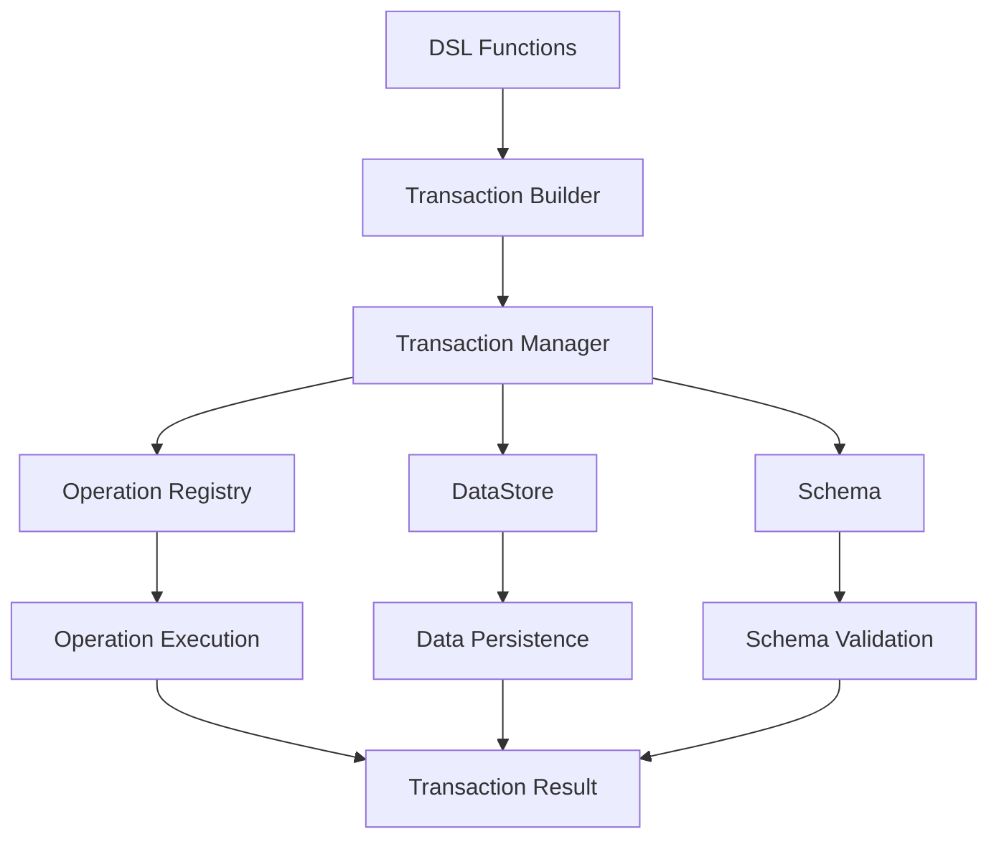

# Barocss Model Specification

## 1. Overview

Barocss Model은 **스키마 기반 선언적 모델 시스템**으로, DSL, Transaction, DataStore가 통합된 완전한 솔루션을 제공합니다. 실제 구현된 코드를 기반으로 한 최종 명세서입니다.

### 1.1 Core Philosophy
- **스키마 우선**: 모든 노드와 마크는 스키마로 정의
- **선언적 구조**: DSL을 통한 명확한 모델 구성
- **원자성**: Transaction을 통한 일관성 보장
- **타입 안전성**: TypeScript로 완전한 타입 지원
- **확장성**: 새로운 operation과 노드 타입 쉽게 추가

### 1.2 Key Benefits
- **일관성**: 스키마 기반 데이터 무결성
- **성능**: DataStore의 효율적인 데이터 관리
- **유연성**: 다양한 노드 타입과 마크 지원
- **안전성**: 원자적 트랜잭션과 에러 처리
- **개발자 경험**: 직관적인 DSL과 타입 안전성

## 2. Architecture

### 2.1 Core Components

#### 2.1.1 Transaction DSL
```typescript
// 핵심 DSL 함수들
export function transaction(editor: Editor, operations: TransactionOperation[]): TransactionBuilder;
export function create(node: INode, options?: any): CreateOperation;
export function control(target: HandleOrId, actions: ControlAction[]): TransactionOperation[];
export function node(type: string, attributes?: Record<string, any>, content?: INode[]): INode;
export function textNode(type: string, text: string, marks?: MarkDescriptor[], attributes?: Record<string, any>): INode;
export function mark(type: string, attrs?: Record<string, any>): MarkDescriptor;
```

**특징:**
- 선언적 트랜잭션 구성
- 타입 안전한 노드 생성
- 유연한 마크 시스템
- 컨트롤 기반 노드 조작

#### 2.1.2 Operation System
```typescript
// Operation 정의 패턴
defineOperation('operationType', async (operation: any, context: TransactionContext) => {
  // Runtime execution logic
});

// DSL 생성 패턴
export const operationName = defineOperationDSL((...args) => ({
  type: 'operationType',
  payload: { /* operation data */ }
}));
```

**특징:**
- 이중 패턴: Runtime 정의 + DSL 생성
- Global registry를 통한 자동 등록
- TransactionContext를 통한 DataStore 접근
- 스키마 검증 및 에러 처리

#### 2.1.3 Transaction System
```typescript
export class TransactionManager {
  async execute(operations: any[]): Promise<TransactionResult>;
  setSchema(schema: any): void;
  setSelectionManager(selectionManager: any): void;
}

export interface TransactionBuilder {
  commit(): Promise<TransactionResult>;
}
```

**특징:**
- 원자적 트랜잭션 실행
- 글로벌 락을 통한 동시성 제어
- DataStore overlay 시스템
- 자동 롤백 및 에러 처리

### 2.2 Integration Flow



## 3. Type System

### 3.1 Core Types
```typescript
// DSL Types
export type HandleOrId = string;
export type MarkDescriptor = { 
  type: string; 
  attrs?: Record<string, any>; 
  range?: [number, number] 
};

// Transaction Types
export type TransactionOperation = DirectOperation | DeleteOperation | SelectionOperation;
export type DirectOperation = { type: string; payload?: any };
export type DeleteOperation = { type: 'delete'; nodeId: string };
export type SelectionOperation = { type: 'setSelection'; selection: any };

// Result Types
export interface TransactionResult {
  success: boolean;
  errors: string[];
  data?: any;
  transactionId?: string;
  operations?: TransactionOperation[];
}
```

### 3.2 Node Types
```typescript
// INode from DataStore
interface INode {
  id: string;
  type: string;
  attributes?: Record<string, any>;
  content?: string[];
  text?: string;
  marks?: IMark[];
  parentId?: string;
}

// IMark from DataStore
interface IMark {
  type: string;
  attrs: Record<string, any>;
  range?: [number, number];
}
```

## 4. Operation Categories

### 4.1 Text Operations
- **setText**: 텍스트 전체 설정
- **insertText**: 텍스트 삽입
- **replaceText**: 텍스트 교체
- **deleteTextRange**: 텍스트 범위 삭제

### 4.2 Attribute Operations
- **setAttrs**: 노드 속성 설정
- **updateAttrs**: 노드 속성 업데이트

### 4.3 Mark Operations
- **setMarks**: 마크 전체 설정
- **applyMark**: 마크 적용
- **removeMark**: 마크 제거
- **toggleMark**: 마크 토글
- **updateMark**: 마크 업데이트

### 4.4 Content Operations
- **create**: 노드 생성
- **addChild**: 자식 노드 추가
- **wrap**: 텍스트 래핑
- **unwrap**: 텍스트 언래핑

### 4.5 Range Operations
- **indent**: 들여쓰기
- **outdent**: 내어쓰기
- **mergeTextNodes**: 텍스트 노드 병합
- **replacePattern**: 패턴 교체

## 5. Usage Examples

### 5.1 Basic Setup
```typescript
import { DataStore } from '@barocss/datastore';
import { Schema } from '@barocss/schema';
import { transaction, create, node, textNode } from '@barocss/model';
import '@barocss/model/src/operations/register-operations';

// 스키마 정의
const schema = new Schema('my-schema', {
  nodes: {
    document: { name: 'document', content: 'block+' },
    paragraph: { name: 'paragraph', content: 'inline*', group: 'block' },
    'inline-text': { name: 'inline-text', group: 'inline' }
  },
  marks: {
    bold: { name: 'bold', group: 'text-style' }
  },
  topNode: 'document'
});

// DataStore 초기화
const dataStore = new DataStore(undefined, schema);
const editor = { dataStore, _dataStore: dataStore };
```

### 5.2 Simple Document Creation
```typescript
// 기본 문서 생성
const result = await transaction(editor, [
  create(node('document', {}, [
    node('paragraph', {}, [
      textNode('inline-text', 'Hello World')
    ])
  ]))
]).commit();

console.log(result.success); // true
console.log(result.operations.length); // 1
```

### 5.3 Complex Document with Marks
```typescript
import { mark } from '@barocss/model';

// 마크가 있는 복잡한 문서
const result = await transaction(editor, [
  create(node('document', {}, [
    node('paragraph', {}, [
      textNode('inline-text', 'This is '),
      textNode('inline-text', 'bold text', [mark('bold')]),
      textNode('inline-text', ' and '),
      textNode('inline-text', 'italic text', [mark('italic')])
    ])
  ]))
]).commit();
```

### 5.4 Content Modification
```typescript
// 1. 노드 생성
const createResult = await transaction(editor, [
  create(textNode('inline-text', 'Original text'))
]).commit();

const textNodeId = createResult.operations[0].result.sid;

// 2. 콘텐츠 수정
const modifyResult = await transaction(editor, [
  ...control(textNodeId, [
    { type: 'setText', payload: { text: 'Modified text' } },
    { type: 'applyMark', payload: { markType: 'bold', start: 0, end: 8 } }
  ])
]).commit();
```

## 6. Schema Integration

### 6.1 Schema Definition
```typescript
const schema = new Schema('my-schema', {
  nodes: {
    // 블록 노드들
    document: { name: 'document', content: 'block+' },
    paragraph: { name: 'paragraph', content: 'inline*', group: 'block' },
    heading: { 
      name: 'heading', 
      content: 'inline*', 
      group: 'block', 
      attrs: { level: { type: 'number', required: true } } 
    },
    
    // 인라인 노드들
    'inline-text': { name: 'inline-text', group: 'inline' },
    
    // 원자 노드들
    codeBlock: { 
      name: 'codeBlock', 
      group: 'block', 
      atom: true, 
      attrs: { language: { type: 'string', required: false } } 
    }
  },
  marks: {
    bold: { name: 'bold', group: 'text-style' },
    italic: { name: 'italic', group: 'text-style' },
    link: { 
      name: 'link', 
      group: 'text-style', 
      attrs: { href: { type: 'string', required: true } } 
    }
  },
  topNode: 'document'
});
```

### 6.2 Schema Validation
- 모든 노드 생성 시 자동 스키마 검증
- 필수 속성 검증
- 콘텐츠 모델 검증
- 마크 허용 여부 검증

## 7. Error Handling

### 7.1 Schema Validation Errors
```typescript
try {
  const result = await transaction(editor, [
    create(node('heading', {}, [ // level 속성 누락
      textNode('inline-text', 'Title')
    ]))
  ]).commit();
} catch (error) {
  console.error('Schema validation failed:', error.message);
}
```

### 7.2 Operation Errors
```typescript
try {
  const result = await transaction(editor, [
    ...control('nonexistent-node', [
      { type: 'setText', payload: { text: 'Hello' } }
    ])
  ]).commit();
} catch (error) {
  console.error('Operation failed:', error.message);
}
```

### 7.3 Transaction Rollback
```typescript
// 실패한 트랜잭션은 자동으로 롤백됨
const result = await transaction(editor, [
  create(textNode('inline-text', 'Valid text')),
  ...control('invalid-node', [
    { type: 'setText', payload: { text: 'This will fail' } }
  ])
]).commit();

console.log(result.success); // false
// 모든 변경사항이 롤백됨
```

## 8. Performance Considerations

### 8.1 Batch Operations
```typescript
// 여러 operation을 한 번에 실행 (권장)
const result = await transaction(editor, [
  create(textNode('inline-text', 'Text 1')),
  create(textNode('inline-text', 'Text 2')),
  create(textNode('inline-text', 'Text 3'))
]).commit();
```

### 8.2 Memory Management
- DataStore의 효율적인 메모리 사용
- Overlay 기반 트랜잭션 격리
- 자동 가비지 컬렉션
- 메모리 누수 방지

### 8.3 Lock Management
- 글로벌 락을 통한 동시성 제어
- 최소한의 락 보유 시간
- 자동 락 해제
- 데드락 방지

## 9. Testing

### 9.1 Unit Testing
```typescript
import { describe, it, expect, beforeEach } from 'vitest';

describe('Model Integration', () => {
  let editor: any;
  let dataStore: DataStore;

  beforeEach(() => {
    const schema = new Schema('test-schema', {
      nodes: {
        document: { name: 'document', content: 'block+' },
        paragraph: { name: 'paragraph', content: 'inline*', group: 'block' },
        'inline-text': { name: 'inline-text', group: 'inline' }
      },
      marks: {
        bold: { name: 'bold', group: 'text-style' }
      },
      topNode: 'document'
    });

    dataStore = new DataStore(undefined, schema);
    editor = { dataStore, _dataStore: dataStore };
  });

  it('should create and modify text', async () => {
    const createResult = await transaction(editor, [
      create(textNode('inline-text', 'Hello'))
    ]).commit();

    expect(createResult.success).toBe(true);
    const textNodeId = createResult.operations[0].result.sid;

    const modifyResult = await transaction(editor, [
      ...control(textNodeId, [
        { type: 'setText', payload: { text: 'World' } }
      ])
    ]).commit();

    expect(modifyResult.success).toBe(true);
    
    const finalNode = dataStore.getNode(textNodeId);
    expect(finalNode.text).toBe('World');
  });
});
```

### 9.2 Integration Testing
```typescript
describe('Real-world Scenarios', () => {
  it('should handle complex document structure', async () => {
    const result = await transaction(editor, [
      create(node('document', {}, [
        node('heading', { level: 1 }, [
          textNode('inline-text', 'Title')
        ]),
        node('paragraph', {}, [
          textNode('inline-text', 'Content with '),
          textNode('inline-text', 'bold text', [mark('bold')])
        ])
      ]))
    ]).commit();

    expect(result.success).toBe(true);
    expect(result.operations).toHaveLength(1);
    
    const documentNode = result.operations[0].result;
    expect(documentNode.type).toBe('document');
    expect(documentNode.content).toHaveLength(2);
  });
});
```

## 10. Best Practices

### 10.1 Schema Design
- **명확한 구조**: 노드와 마크의 관계를 명확히 정의
- **필수 속성**: 중요한 속성은 `required: true`로 설정
- **기본값**: 적절한 기본값 제공
- **그룹화**: 관련 노드들을 그룹으로 묶기

### 10.2 Operation Usage
- **배치 처리**: 관련 operation들을 한 트랜잭션에서 처리
- **에러 처리**: 적절한 try-catch 구문 사용
- **검증**: 결과 검증을 통한 데이터 무결성 확인
- **성능**: 대용량 작업 시 청크 단위 처리

### 10.3 Code Organization
- **모듈화**: 관련 기능들을 모듈로 분리
- **타입 안전성**: TypeScript 타입을 적극 활용
- **테스트**: 단위 테스트와 통합 테스트 작성
- **문서화**: 복잡한 로직에 대한 주석 작성

## 11. Future Extensions

### 11.1 Planned Features
- **플러그인 시스템**: 커스텀 operation과 노드 타입
- **성능 최적화**: 대용량 문서 처리 개선
- **분산 트랜잭션**: 여러 DataStore 간 트랜잭션
- **실시간 협업**: 동시 편집 지원

### 11.2 API Stability
- 현재 API는 안정화됨
- 새로운 기능은 기존 패턴을 따름

## 12. Integration with Other Packages

### 12.1 DataStore Integration
```typescript
import { DataStore } from '@barocss/datastore';

// DataStore는 모델의 핵심 데이터 저장소
const dataStore = new DataStore(undefined, schema);
```

### 12.2 Schema Integration
```typescript
import { Schema } from '@barocss/schema';

// Schema는 노드와 마크의 구조를 정의
const schema = new Schema('my-schema', schemaDefinition);
```

### 12.3 Editor Core Integration
```typescript
import { Editor } from '@barocss/editor-core';

// Editor는 모델과 뷰를 연결
const editor = new Editor({ dataStore, schema });
```

---

이 명세서는 실제 구현된 Barocss Model을 기반으로 작성되었으며, 모든 예제는 테스트를 통과한 검증된 코드입니다. DSL, Transaction, DataStore가 완벽하게 통합된 모델 시스템의 완전한 가이드입니다.