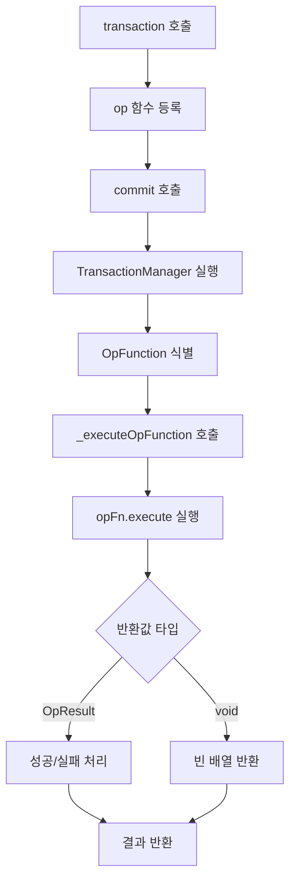

# Op Function DSL Specification

## 개요

`op()` 함수는 Barocss Editor의 함수형 DSL로, 복잡한 로직과 흐름 제어를 위한 명령형 프로그래밍 스타일을 제공합니다. 기존의 선언적 DSL과 달리 일반 JavaScript 문법을 사용하여 복잡한 작업을 수행할 수 있습니다.

## 목차

1. [기본 개념](#1-기본-개념)
2. [함수 시그니처](#2-함수-시그니처)
3. [TransactionContext](#3-transactioncontext)
4. [OpResult 구조](#4-opresult-구조)
5. [지원하는 반환 타입](#5-지원하는-반환-타입)
6. [실행 흐름](#6-실행-흐름)
7. [기존 DSL과의 혼용](#7-기존-dsl과의-혼용)
8. [주요 특징](#8-주요-특징)
9. [사용 사례](#9-사용-사례)
10. [주의사항](#10-주의사항)
11. [테스트 가이드](#11-테스트-가이드)

## 1. 기본 개념

### 1.1 선언적 DSL vs 함수형 DSL

**선언적 DSL (기존)**
```typescript
// 선언적 방식 - 무엇을 할지 명시
const result = await transaction(editor, [
  create(textNode('inline-text', 'Hello')),
  control('node-sid', setText('Updated'))
]).commit();
```

**함수형 DSL (op)**
```typescript
// 명령형 방식 - 어떻게 할지 명시
const result = await transaction(editor, [
  op(async (ctx) => {
    // 복잡한 로직 수행
    const node = ctx.dataStore.createNodeWithChildren(
      textNode('inline-text', 'Hello'),
      ctx.schema
    );
    
    if (someCondition) {
      // 추가 작업
    }
    
    return {
      success: true,
      data: node
    };
  })
]).commit();
```

### 1.2 사용 시기

- **선언적 DSL**: 단순하고 직관적인 작업
- **함수형 DSL**: 복잡한 조건부 로직, 반복문, 비동기 작업, 외부 API 호출

## 2. 함수 시그니처

```typescript
function op(
  operationFn: (context: TransactionContext) => OpResult | void | Promise<OpResult | void>
): OpFunction
```

### 2.1 매개변수

- `operationFn`: 실행할 함수
  - `context`: `TransactionContext` 객체
  - 반환값: `OpResult | void | Promise<OpResult | void>`

### 2.2 반환값

- `OpFunction`: 실행 가능한 함수형 operation 객체

## 3. TransactionContext

`op` 함수는 `TransactionContext`를 매개변수로 받습니다:

```typescript
interface TransactionContext {
  dataStore: DataStore;           // DataStore 인스턴스 (직접 조작 가능)
  selectionManager: SelectionManager; // SelectionManager 인스턴스
  selection?: ModelSelection;     // 현재 선택 영역
  schema?: any;                   // Schema 인스턴스
  selectAbsoluteRange: (start: number, end: number) => void; // 절대 위치 선택
  resolveAbsolute: (position: number) => { nodeId: string; offset: number } | null; // 위치 해석
}
```

### 3.1 주요 속성

- **`dataStore`**: 데이터 조작의 핵심 객체
- **`selectionManager`**: 선택 영역 관리
- **`selection`**: 현재 선택 상태
- **`schema`**: 스키마 검증용
- **`selectAbsoluteRange`**: 절대 위치로 선택
- **`resolveAbsolute`**: 절대 위치를 노드/오프셋으로 변환

## 4. OpResult 구조

```typescript
interface OpResult {
  success: boolean;                    // 성공/실패 여부
  data?: any;                         // 결과 데이터
  error?: string;                     // 에러 메시지 (success: false일 때)
  inverse?: TransactionOperation;     // 역함수 operation (undo용)
}
```

### 4.1 속성 설명

- **`success`**: 작업 성공 여부 (필수)
- **`data`**: 작업 결과 데이터 (선택)
- **`error`**: 실패 시 에러 메시지 (선택)
- **`inverse`**: undo를 위한 역함수 operation (선택)

## 5. 지원하는 반환 타입

### 5.1 void (아무것도 반환하지 않음)

```typescript
op(async (ctx) => {
  // 부수 효과만 수행 (로깅, 상태 변경 등)
  // 아무것도 리턴하지 않음
})
```

**사용 사례**: 로깅, 상태 변경, 부수 효과만 필요한 경우

### 5.2 OpResult (성공/실패 결과)

```typescript
op(async (ctx) => {
  const node = ctx.dataStore.createNodeWithChildren(
    textNode('inline-text', 'Hello'),
    ctx.schema
  );
  
  return {
    success: true,
    data: node
  };
})
```

**사용 사례**: 단순한 작업 수행 후 결과 반환

### 5.3 OpResult with inverse (역함수 지정)

```typescript
op(async (ctx) => {
  const node = ctx.dataStore.createNodeWithChildren(
    textNode('inline-text', 'With inverse'),
    ctx.schema
  );
  
  return {
    success: true,
    data: node,
    inverse: { type: 'delete', payload: { nodeId: node.sid } }
  };
})
```

**사용 사례**: undo 기능이 필요한 작업

### 5.4 실패 케이스

```typescript
op(async (ctx) => {
  const condition = false;
  if (condition) {
    return {
      success: true,
      data: ctx.dataStore.createNodeWithChildren(textNode('inline-text', 'Created'), ctx.schema)
    };
  } else {
    return {
      success: false,
      error: 'Condition not met'
    };
  }
})
```

**사용 사례**: 조건부 실행에서 실패 처리

## 6. 실행 흐름



### 6.1 단계별 설명

1. **Transaction 시작**: `transaction(editor, [op(...)])` 호출
2. **Operation 등록**: `op` 함수가 `OpFunction` 객체로 변환
3. **Transaction Commit**: `commit()` 호출 시 `TransactionManager`가 실행
4. **OpFunction 실행**: `_executeOpFunction`에서 `opFn.execute(context)` 호출
5. **결과 처리**: `OpResult` 또는 `void` 반환값 처리
6. **Operation 생성**: `OpResult`는 즉시 operation을 생성하지 않음 (inverse는 undo용)

## 7. 기존 DSL과의 혼용

```typescript
const result = await transaction(editor, [
  // 기존 선언적 DSL
  create(textNode('inline-text', 'Regular operation')),
  
  // 함수형 DSL
  op(async (ctx) => {
    // 커스텀 로직 실행
    return { success: true };
  }),
  
  // 다시 선언적 DSL
  control('node-sid', setText('Updated text'))
]).commit();
```

### 7.1 혼용 시 주의사항

- 선언적 DSL과 함수형 DSL을 자유롭게 혼용 가능
- 실행 순서는 배열 순서대로
- `op` 함수는 `result.operations`에 추가되지 않음

## 8. 주요 특징

### 8.1 비동기 지원

```typescript
op(async (ctx) => {
  // 비동기 작업 완전 지원
  const response = await fetch('/api/data');
  const data = await response.json();
  
  const node = ctx.dataStore.createNodeWithChildren(
    textNode('inline-text', data.content),
    ctx.schema
  );
  
  return { success: true, data: node };
})
```

### 8.2 직접 DataStore 조작

```typescript
op(async (ctx) => {
  // DataStore를 직접 조작하여 복잡한 작업 수행
  const node1 = ctx.dataStore.createNodeWithChildren(
    textNode('inline-text', 'First'),
    ctx.schema
  );
  
  const node2 = ctx.dataStore.createNodeWithChildren(
    textNode('inline-text', 'Second'),
    ctx.schema
  );
  
  // 노드 간 관계 설정 등 복잡한 로직
  return { success: true, data: [node1, node2] };
})
```

### 8.3 조건부 실행

```typescript
op(async (ctx) => {
  const user = await getUser();
  const hasPermission = await checkPermission(user.sid);
  
  if (hasPermission) {
    const node = ctx.dataStore.createNodeWithChildren(
      textNode('inline-text', `Welcome ${user.name}`),
      ctx.schema
    );
    return { success: true, data: node };
  } else {
    return { success: false, error: 'Insufficient permissions' };
  }
})
```

### 8.4 에러 처리

```typescript
op(async (ctx) => {
  try {
    // 복잡한 로직 수행
    const result = await complexOperation();
    return { success: true, data: result };
  } catch (error) {
    return { success: false, error: error.message };
  }
})
```

### 8.5 역함수 지원

```typescript
op(async (ctx) => {
  const node = ctx.dataStore.createNodeWithChildren(
    textNode('inline-text', 'With inverse'),
    ctx.schema
  );
  
  return {
    success: true,
    data: node,
    inverse: { type: 'delete', payload: { nodeId: node.sid } }
  };
})
```

### 8.6 트랜잭션 안전성

- 모든 변경사항이 트랜잭션 내에서 안전하게 실행
- 에러 발생 시 자동 롤백
- 메모리 누수 방지

## 9. 사용 사례

### 9.1 복잡한 조건부 로직

```typescript
op(async (ctx) => {
  const user = await getUser();
  const hasPermission = await checkPermission(user.sid);
  const isPremium = await checkPremiumStatus(user.sid);
  
  if (hasPermission && isPremium) {
    const node = ctx.dataStore.createNodeWithChildren(
      textNode('inline-text', `Premium content for ${user.name}`),
      ctx.schema
    );
    return { success: true, data: node };
  } else if (hasPermission) {
    const node = ctx.dataStore.createNodeWithChildren(
      textNode('inline-text', `Basic content for ${user.name}`),
      ctx.schema
    );
    return { success: true, data: node };
  } else {
    return { success: false, error: 'Access denied' };
  }
})
```

### 9.2 다중 노드 생성

```typescript
op(async (ctx) => {
  const nodes = [];
  const items = await fetchItems();
  
  for (const item of items) {
    const node = ctx.dataStore.createNodeWithChildren(
      textNode('inline-text', item.name),
      ctx.schema
    );
    nodes.push(node);
  }
  
  return {
    success: true,
    data: nodes,
    inverse: {
      type: 'batch',
      payload: { 
        operations: nodes.map(n => ({ 
          type: 'delete', 
          payload: { nodeId: n.sid } 
        })) 
      }
    }
  };
})
```

### 9.3 외부 API 호출과 연동

```typescript
op(async (ctx) => {
  try {
    const response = await fetch('/api/validate', {
      method: 'POST',
      headers: { 'Content-Type': 'application/json' },
      body: JSON.stringify({ content: 'test' })
    });
    
    if (response.ok) {
      const data = await response.json();
      const node = ctx.dataStore.createNodeWithChildren(
        textNode('inline-text', data.message),
        ctx.schema
      );
      return { success: true, data: node };
    } else {
      return { success: false, error: 'Validation failed' };
    }
  } catch (error) {
    return { success: false, error: error.message };
  }
})
```

### 9.4 반복문과 배열 처리

```typescript
op(async (ctx) => {
  const results = [];
  const conditions = [true, false, true, true, false];
  
  for (let i = 0; i < conditions.length; i++) {
    if (conditions[i]) {
      const node = ctx.dataStore.createNodeWithChildren(
        textNode('inline-text', `Item ${i + 1}`),
        ctx.schema
      );
      results.push(node);
    }
  }
  
  return {
    success: true,
    data: results,
    inverse: {
      type: 'batch',
      payload: { 
        operations: results.map(n => ({ 
          type: 'delete', 
          payload: { nodeId: n.sid } 
        })) 
      }
    }
  };
})
```

## 10. 주의사항

### 10.1 지원하지 않는 패턴

```typescript
// ❌ 잘못된 사용법
op((ctx) => { 
  return { type: 'create', payload: { node: textNode('text', 'Hello') } };
})

// ✅ 올바른 사용법
op((ctx) => {
  const node = ctx.dataStore.createNodeWithChildren(
    textNode('inline-text', 'Hello'),
    ctx.schema
  );
  return { success: true, data: node };
})
```

### 10.2 OpResult 구조 준수

- `defineOperation`과 동일한 `OpResult` 구조만 사용
- `{ type, payload }` 형태 직접 반환 불가

### 10.3 inverse 처리

- `inverse`는 실제로 실행되지 않고 나중에 undo할 때 사용
- `OpResult`를 반환해도 `result.operations`에는 추가되지 않음

### 10.4 DataStore 조작

- `ctx.dataStore`를 직접 조작할 때는 스키마 검증을 고려
- 트랜잭션 내에서 안전하게 실행되지만 스키마 위반 시 에러 발생 가능

## 11. 테스트 가이드

### 11.1 기본 테스트

```typescript
it('should execute op function successfully', async () => {
  const result = await transaction(mockEditor, [
    op(async (ctx) => {
      const node = ctx.dataStore.createNodeWithChildren(
        textNode('inline-text', 'Hello'),
        ctx.schema
      );
      
      return {
        success: true,
        data: node
      };
    })
  ]).commit();

  expect(result.success).toBe(true);
  expect(result.operations).toHaveLength(0); // OpResult는 operation을 생성하지 않음
});
```

### 11.2 에러 처리 테스트

```typescript
it('should handle op function errors', async () => {
  const result = await transaction(mockEditor, [
    op(async (ctx) => {
      return {
        success: false,
        error: 'Test error'
      };
    })
  ]).commit();

  expect(result.success).toBe(false);
  expect(result.errors).toContain('Test error');
});
```

### 11.3 비동기 작업 테스트

```typescript
it('should handle async operations', async () => {
  const result = await transaction(mockEditor, [
    op(async (ctx) => {
      await new Promise(resolve => setTimeout(resolve, 10));
      
      const node = ctx.dataStore.createNodeWithChildren(
        textNode('inline-text', 'Async created'),
        ctx.schema
      );
      
      return { success: true, data: node };
    })
  ]).commit();

  expect(result.success).toBe(true);
  expect(result.operations).toHaveLength(0);
});
```

### 11.4 복잡한 시나리오 테스트

```typescript
it('should handle complex multi-node creation', async () => {
  const result = await transaction(mockEditor, [
    op(async (ctx) => {
      const nodes = [];
      const conditions = [true, false, true, true, false];
      
      for (let i = 0; i < conditions.length; i++) {
        if (conditions[i]) {
          const node = ctx.dataStore.createNodeWithChildren(
            textNode('inline-text', `Item ${i + 1}`),
            ctx.schema
          );
          nodes.push(node);
        }
      }
      
      return {
        success: true,
        data: nodes,
        inverse: {
          type: 'batch',
          payload: { 
            operations: nodes.map(n => ({ 
              type: 'delete', 
              payload: { nodeId: n.sid } 
            })) 
          }
        }
      };
    })
  ]).commit();

  expect(result.success).toBe(true);
  expect(result.operations).toHaveLength(0);
  expect(result.data).toHaveLength(3); // 3개 노드만 생성됨
});
```

---

이 스펙 문서는 `op` 함수형 DSL의 완전한 가이드입니다. 복잡한 로직과 흐름 제어가 필요한 경우 이 DSL을 활용하여 더 유연하고 강력한 작업을 수행할 수 있습니다.
