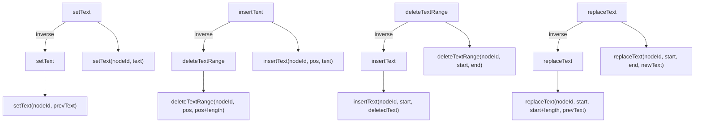
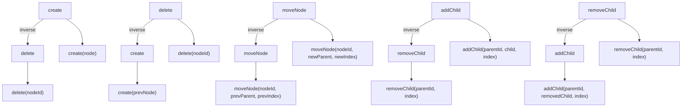
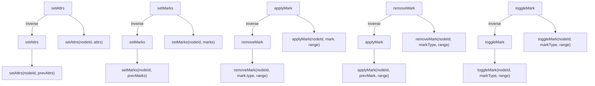
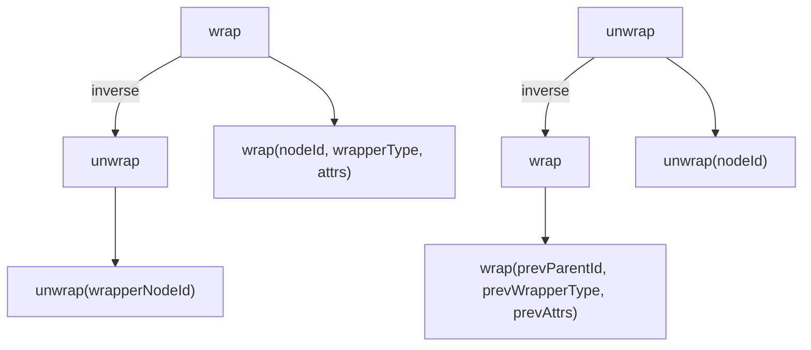
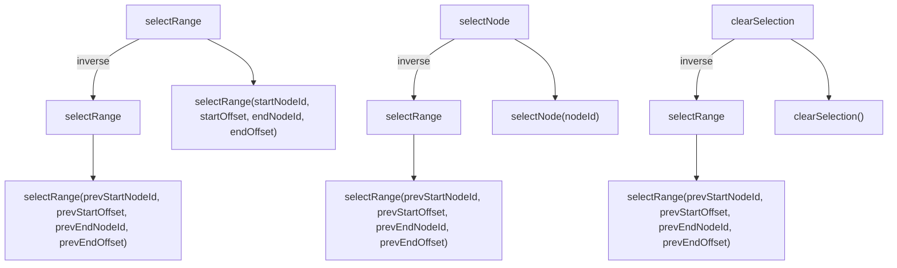
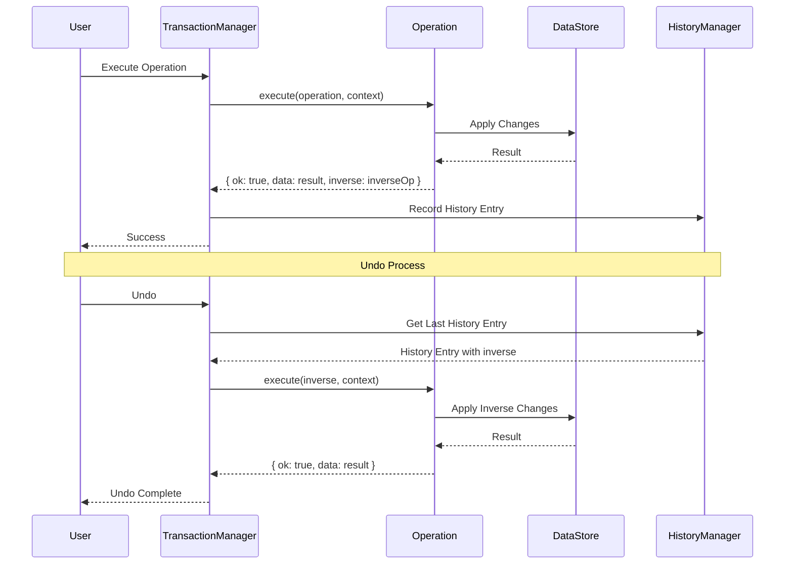

# Operation Inverse Specification

## 개요

이 문서는 BaroCSS 에디터의 오퍼레이션과 그 역함수(inverse) 관계를 정의합니다. 모든 오퍼레이션은 실행 가능한 역함수를 가져야 하며, 이를 통해 undo/redo 기능을 구현합니다.

## 역함수 구현 원칙

### 1. DSL 형태 사용
```typescript
// ❌ 객체 형태
inverse: { type: 'setText', payload: { nodeId, text: prevText } }

// ✅ DSL 형태  
inverse: setText(nodeId, prevText)
```

### 2. 상태 저장 패턴
```typescript
// 실행 전 이전 상태 저장
const prevText = node.text ?? '';
const prevAttrs = { ...node.attributes };
const prevMarks = [...(node.marks ?? [])];

// 실행 후 역함수 반환 (OperationExecuteResult 구조)
return {
  ok: true,
  data: updatedNode,
  inverse: { type: 'setText', payload: { nodeId, text: prevText } }
};
```

### 3. OperationExecuteResult 구조
모든 operation은 다음 구조로 결과를 반환해야 합니다:
```typescript
interface OperationExecuteResult {
  ok: boolean;
  data: any;        // 업데이트된 노드 또는 결과 데이터
  inverse: {        // 역함수 operation 정의
    type: string;
    payload: any;
  };
}
```

### 3. 최소 정보 원칙
역함수는 이전 상태를 완전히 복원하는데 필요한 최소한의 정보만 저장합니다.

## 오퍼레이션별 역함수 매핑

### 텍스트 조작 오퍼레이션

| 원본 오퍼레이션 | 역함수 | 매개변수 | 설명 |
|---|---|---|---|
| `setText(nodeId, text)` | `setText(nodeId, prevText)` | `prevText: string` | 이전 텍스트로 복원 |
| `insertText(nodeId, pos, text)` | `deleteTextRange(nodeId, pos, pos + text.length)` | `pos: number, length: number` | 삽입된 텍스트 삭제 |
| `deleteTextRange(nodeId, start, end)` | `insertText(nodeId, start, deletedText)` | `start: number, deletedText: string` | 삭제된 텍스트 재삽입 |
| `replaceText(nodeId, start, end, newText)` | `replaceText(nodeId, start, start + newText.length, prevText)` | `start: number, prevText: string` | 이전 텍스트로 교체 |

### 노드 구조 오퍼레이션

| 원본 오퍼레이션 | 역함수 | 매개변수 | 설명 |
|---|---|---|---|
| `create(node)` | `delete(nodeId)` | `nodeId: string` | 생성된 노드 삭제 |
| `delete(nodeId)` | `create(prevNode)` | `prevNode: INode` | 삭제된 노드 재생성 |
| `moveNode(nodeId, newParentId, newIndex)` | `moveNode(nodeId, prevParentId, prevIndex)` | `prevParentId: string, prevIndex: number` | 이전 위치로 이동 |
| `addChild(parentId, child, index)` | `removeChild(parentId, index)` | `index: number` | 추가된 자식 제거 |
| `removeChild(parentId, index)` | `addChild(parentId, removedChild, index)` | `removedChild: INode, index: number` | 제거된 자식 재추가 |

### 속성/마크 오퍼레이션

| 원본 오퍼레이션 | 역함수 | 매개변수 | 설명 |
|---|---|---|---|
| `setAttrs(nodeId, attrs)` | `setAttrs(nodeId, prevAttrs)` | `prevAttrs: Record<string, any>` | 이전 속성으로 복원 |
| `setMarks(nodeId, marks)` | `setMarks(nodeId, prevMarks)` | `prevMarks: IMark[]` | 이전 마크로 복원 |
| `applyMark(nodeId, mark, range)` | `removeMark(nodeId, mark.type, range)` | `mark.type: string, range: [number, number]` | 적용된 마크 제거 |
| `removeMark(nodeId, markType, range)` | `applyMark(nodeId, prevMark, range)` | `prevMark: IMark, range: [number, number]` | 제거된 마크 재적용 |
| `toggleMark(nodeId, markType, range)` | `toggleMark(nodeId, markType, range)` | `markType: string, range: [number, number]` | 토글은 자기 역함수 |

### 래핑/언래핑 오퍼레이션

| 원본 오퍼레이션 | 역함수 | 매개변수 | 설명 |
|---|---|---|---|
| `wrap(nodeId, wrapperType, attrs)` | `unwrap(wrapperNodeId)` | `wrapperNodeId: string` | 래퍼 노드 언래핑 |
| `unwrap(nodeId)` | `wrap(prevParentId, prevWrapperType, prevAttrs)` | `prevParentId: string, prevWrapperType: string, prevAttrs: any` | 이전 래퍼로 재래핑 |

### 선택 오퍼레이션

| 원본 오퍼레이션 | 역함수 | 매개변수 | 설명 |
|---|---|---|---|
| `selectRange(startNodeId, startOffset, endNodeId, endOffset)` | `selectRange(prevStartNodeId, prevStartOffset, prevEndNodeId, prevEndOffset)` | 이전 선택으로 복원 |
| `selectNode(nodeId)` | `selectRange(prevStartNodeId, prevStartOffset, prevEndNodeId, prevEndOffset)` | 이전 선택으로 복원 |
| `clearSelection()` | `selectRange(prevStartNodeId, prevStartOffset, prevEndNodeId, prevEndOffset)` | 이전 선택으로 복원 |

## 역함수 실행 흐름

### 1. 정방향 실행
```typescript
const result = await operation.execute(operation, context);
// result.inverse에 역함수 정보 저장
```

### 2. 역방향 실행 (Undo)
```typescript
const inverseResult = await inverseOperation.execute(inverseOperation, context);
// 이전 상태로 복원
```

### 3. 재역방향 실행 (Redo)
```typescript
const redoResult = await originalOperation.execute(originalOperation, context);
// 원래 상태로 복원
```

## 구현 예시

### setText 오퍼레이션
```typescript
defineOperation('setText', async (operation: any, context: TransactionContext) => {
  const { nodeId, text } = operation.payload;
  const node = context.dataStore.getNode(nodeId);
  const prevText = node.text ?? '';
  
  context.dataStore.updateNode(nodeId, { text });
  
  return {
    ok: true,
    data: context.dataStore.getNode(nodeId),
    inverse: setText(nodeId, prevText)  // DSL 형태
  };
});
```

### insertText 오퍼레이션
```typescript
defineOperation('insertText', async (operation: any, context: TransactionContext) => {
  const { nodeId, pos, text } = operation.payload;
  
  context.dataStore.range.insertText(nodeId, pos, text);
  
  return {
    ok: true,
    data: context.dataStore.getNode(nodeId),
    inverse: deleteTextRange(nodeId, pos, pos + text.length)  // DSL 형태
  };
});
```

## 특수 케이스

### 1. 자기 역함수 (Self-Inverse)
- `toggleMark`: 토글은 두 번 실행하면 원래 상태로 돌아감
- `clearSelection`: 선택 해제 후 다시 해제는 의미 없음

### 2. 복합 역함수
일부 오퍼레이션은 여러 단계의 역함수가 필요할 수 있습니다:
```typescript
// 예: splitNode의 역함수는 mergeNode
inverse: mergeNode(leftNodeId, rightNodeId)
```

### 3. 조건부 역함수
일부 오퍼레이션은 실행 조건에 따라 다른 역함수를 가질 수 있습니다:
```typescript
// 예: 조건에 따라 다른 역함수
inverse: condition ? operationA(params) : operationB(params)
```

## 검증 규칙

### 1. 역함수 존재성
모든 오퍼레이션은 유효한 역함수를 반환해야 합니다.

### 2. 역함수 실행 가능성
역함수는 현재 컨텍스트에서 실행 가능해야 합니다.

### 3. 상태 일관성
역함수 실행 후 원래 상태와 동일해야 합니다.

## 테스트 전략

### 1. 단위 테스트
```typescript
test('setText inverse should restore previous text', async () => {
  const originalText = 'Hello';
  const newText = 'World';
  
  // 정방향 실행
  const result = await setText(nodeId, newText);
  expect(result.data.text).toBe(newText);
  
  // 역방향 실행
  const inverseResult = await result.inverse.execute(result.inverse, context);
  expect(inverseResult.data.text).toBe(originalText);
});
```

### 2. 통합 테스트
```typescript
test('operation-inverse roundtrip should maintain state', async () => {
  const initialState = captureState();
  
  // 정방향 + 역방향 실행
  const result = await operation.execute(operation, context);
  await result.inverse.execute(result.inverse, context);
  
  const finalState = captureState();
  expect(finalState).toEqual(initialState);
});
```

## 성능 고려사항

### 1. 메모리 사용량
역함수에 저장되는 데이터 크기를 최소화합니다.

### 2. 실행 속도
역함수 실행이 원본 오퍼레이션과 유사한 성능을 가져야 합니다.

### 3. 중첩 오퍼레이션
복잡한 오퍼레이션의 경우 역함수도 복잡해질 수 있으므로 적절한 추상화가 필요합니다.

## 단순한 역함수 시스템

### 핵심 원리

역함수는 **데이터 변경만 되돌리는 것**에 집중합니다. Selection은 기본적으로 유지되며, 필요시 간단한 클램프만 적용합니다.

### 역함수 구현 방식

#### 1. 단순한 DSL 형태
```typescript
// setText의 역함수
inverse: setText(nodeId, prevText)

// insertText의 역함수  
inverse: deleteTextRange(nodeId, pos, pos + text.length)

// deleteTextRange의 역함수
inverse: insertText(nodeId, start, deletedText)
```

#### 2. Selection 기본 유지
```typescript
// TransactionManager에서 역함수 실행 시
async executeInverse(inverseOps: any[], context: TransactionContext) {
  for (const inverseOp of inverseOps) {
    await this._executeOperation(inverseOp, context);
    // selection은 기본적으로 유지, 필요시 간단한 클램프만
  }
}
```

### 구현 예시

```typescript
// setText 오퍼레이션
defineOperation('setText', async (operation: any, context: TransactionContext) => {
  const { nodeId, text } = operation.payload;
  const node = context.dataStore.getNode(nodeId);
  const prevText = node.text ?? '';
  
  context.dataStore.updateNode(nodeId, { text });
  
  return {
    ok: true,
    data: context.dataStore.getNode(nodeId),
    inverse: setText(nodeId, prevText)  // 단순한 DSL 형태
  };
});

// insertText 오퍼레이션
defineOperation('insertText', async (operation: any, context: TransactionContext) => {
  const { nodeId, pos, text } = operation.payload;
  
  context.dataStore.range.insertText(nodeId, pos, text);
  
  return {
    ok: true,
    data: context.dataStore.getNode(nodeId),
    inverse: deleteTextRange(nodeId, pos, pos + text.length)  // 단순한 DSL 형태
  };
});
```

### Selection 처리

```typescript
// TransactionManager에서 기본 클램프만 적용
class TransactionManager {
  private _clampSelection(selection: SelectionContext, dataStore: DataStore) {
    // 간단한 클램프만 적용
    const anchorNode = dataStore.getNode(selection.current.anchorId);
    const focusNode = dataStore.getNode(selection.current.focusId);
    
    if (anchorNode?.text) {
      selection.current.anchorOffset = Math.min(
        selection.current.anchorOffset,
        anchorNode.text.length
      );
    }
    
    if (focusNode?.text) {
      selection.current.focusOffset = Math.min(
        selection.current.focusOffset,
        focusNode.text.length
      );
    }
  }
}
```

### 장점

1. **단순성**: 복잡한 selection 매핑 로직 불필요
2. **예측 가능성**: 역함수 실행 결과가 명확
3. **성능**: selection 계산 오버헤드 없음
4. **일관성**: 모든 오퍼레이션이 동일한 방식
5. **유지보수성**: 간단한 구조로 디버깅과 수정이 용이

## 다른 에디터들의 접근 방식

### 1. **Google Docs**

**방식**: Operational Transform (OT) + Selection 매핑
- 모든 변경사항을 operation으로 추적
- Selection은 절대 위치가 아닌 상대적 위치로 관리
- 동시편집 시 operation을 변환하여 충돌 해결

**장점**:
- 실시간 동시편집에 최적화
- Selection 충돌 해결이 잘 됨

**단점**:
- 구현 복잡도가 높음
- 네트워크 지연 시 복잡한 동기화 필요

### 2. **Notion**

**방식**: 블록 기반 + Selection 보존
- 모든 콘텐츠를 블록 단위로 관리
- Selection은 블록 ID + 오프셋으로 추적
- Undo/Redo 시 블록이 존재하면 selection 복원, 없으면 가장 가까운 블록으로 이동

**장점**:
- 블록 기반으로 구조가 명확
- Selection 복원이 상대적으로 단순

**단점**:
- 블록 삭제 시 selection 복원이 어려움
- 복잡한 텍스트 조작에서 한계

### 3. **VS Code**

**방식**: 모델 기반 + Selection 매핑 함수
- 모든 변경사항을 모델 변경으로 추적
- Selection은 모델 위치 기반으로 관리
- Undo/Redo 시 모델 변경에 따른 selection 매핑

**장점**:
- 정확한 selection 복원
- 복잡한 텍스트 조작도 잘 처리

**단점**:
- 모델 변경 추적이 복잡
- 성능 최적화가 어려움

### 4. **ProseMirror**

**방식**: Transform 기반 + Selection 매핑
- 모든 변경사항을 transform으로 추적
- Selection은 document position으로 관리
- Transform의 역함수로 undo 구현

**장점**:
- 수학적으로 정확한 역함수
- Selection 매핑이 정확함

**단점**:
- Transform 개념이 복잡
- 학습 곡선이 가파름

### 5. **Slate.js**

**방식**: Immutable Data + Selection 보존
- 모든 변경사항을 immutable data로 추적
- Selection은 path + offset으로 관리
- Undo/Redo 시 이전 상태로 완전 복원

**장점**:
- 상태 관리가 단순
- 디버깅이 쉬움

**단점**:
- 메모리 사용량이 큼
- 대용량 문서에서 성능 이슈

## BaroCSS의 선택

BaroCSS는 **단순한 역함수 시스템**을 선택했습니다:

### 이유:
1. **단순성**: 복잡한 selection 매핑 로직 불필요
2. **예측 가능성**: 역함수 실행 결과가 명확
3. **성능**: selection 계산 오버헤드 없음
4. **일관성**: 모든 오퍼레이션이 동일한 방식
5. **유지보수성**: 간단한 구조로 디버깅과 수정이 용이

### 구현 전략:
```typescript
// 1. 개별 오퍼레이션에서 단순한 역함수 DSL만 정의
defineOperation('setText', async (operation, context) => {
  const { nodeId, text } = operation.payload;
  const prevText = node.text ?? '';
  
  context.dataStore.updateNode(nodeId, { text });
  
  return {
    ok: true,
    data: result,
    inverse: setText(nodeId, prevText)  // 단순한 DSL 형태
  };
});

// 2. TransactionManager에서 기본 클램프만 적용
async executeInverse(inverseOps: any[], context: TransactionContext) {
  for (const inverseOp of inverseOps) {
    await this._executeOperation(inverseOp, context);
    // selection은 기본적으로 유지, 필요시 간단한 클램프만
  }
}

// 3. Selection은 사용자가 직접 조정
// 복잡한 자동 매핑 없이 기본 유지
```

이 방식은 구현이 간단하고 예측 가능하며, 동시편집 환경에서도 안정적으로 작동합니다.

## 오퍼레이션-역함수 관계 다이어그램

### 텍스트 조작 오퍼레이션 관계도



### 노드 구조 오퍼레이션 관계도



### 속성/마크 오퍼레이션 관계도



### 래핑/언래핑 오퍼레이션 관계도



### 선택 오퍼레이션 관계도



## 역함수 실행 흐름 다이어그램



## 오퍼레이션 카테고리별 역함수 매트릭스

```mermaid
graph LR
    subgraph "Text Operations"
        T1[setText] --> T1I[setText]
        T2[insertText] --> T2I[deleteTextRange]
        T3[deleteTextRange] --> T3I[insertText]
        T4[replaceText] --> T4I[replaceText]
    end
    
    subgraph "Node Operations"
        N1[create] --> N1I[delete]
        N2[delete] --> N2I[create]
        N3[moveNode] --> N3I[moveNode]
        N4[addChild] --> N4I[removeChild]
        N5[removeChild] --> N5I[addChild]
    end
    
    subgraph "Attribute Operations"
        A1[setAttrs] --> A1I[setAttrs]
        A2[setMarks] --> A2I[setMarks]
        A3[applyMark] --> A3I[removeMark]
        A4[removeMark] --> A4I[applyMark]
        A5[toggleMark] --> A5I[toggleMark]
    end
    
    subgraph "Structure Operations"
        S1[wrap] --> S1I[unwrap]
        S2[unwrap] --> S2I[wrap]
    end
    
    subgraph "Selection Operations"
        SE1[selectRange] --> SE1I[selectRange]
        SE2[selectNode] --> SE2I[selectRange]
        SE3[clearSelection] --> SE3I[selectRange]
    end
    ```

## 8. Implementation Notes

### 8.1 Operation Registration
모든 inverse operations은 해당 forward operation과 함께 `register-operations.ts`에서 등록되어야 합니다:

```typescript
// register-operations.ts
import './create';    // create + delete inverse
import './update';    // update + update inverse  
import './setText';   // setText + setText inverse
// ... 기타 operations
```

### 8.2 Testing Inverse Operations
Inverse operations 테스트 시 주의사항:

```typescript
// ✅ 올바른 테스트 패턴
const forwardResult = await transaction(editor, [
  create(textNode('inline-text', 'Hello'))
]).commit();

const nodeId = forwardResult.operations[0].result.data.sid;
const inverseResult = await transaction(editor, [
  { type: 'delete', payload: { nodeId } }
]).commit();

// 결과 검증
expect(forwardResult.success).toBe(true);
expect(inverseResult.success).toBe(true);
expect(dataStore.getNode(nodeId)).toBeUndefined();
```

### 8.3 Common Implementation Issues

#### 8.3.1 Operation Not Registered
```
Error: Unknown operation type: update
```
**해결방법:** `register-operations.ts`에 해당 operation import 추가

#### 8.3.2 Incorrect Payload Structure
```typescript
// ❌ 잘못된 방법
defineOperation('setText', async (operation, context) => {
  const { nodeId, text } = operation; // 직접 접근
});

// ✅ 올바른 방법  
defineOperation('setText', async (operation, context) => {
  const { nodeId, text } = operation.payload; // payload에서 추출
});
```

#### 8.3.3 Missing OperationExecuteResult Structure
```typescript
// ❌ 잘못된 방법
return updatedNode;

// ✅ 올바른 방법
return {
  ok: true,
  data: updatedNode,
  inverse: { type: 'setText', payload: { nodeId, text: prevText } }
};
```
