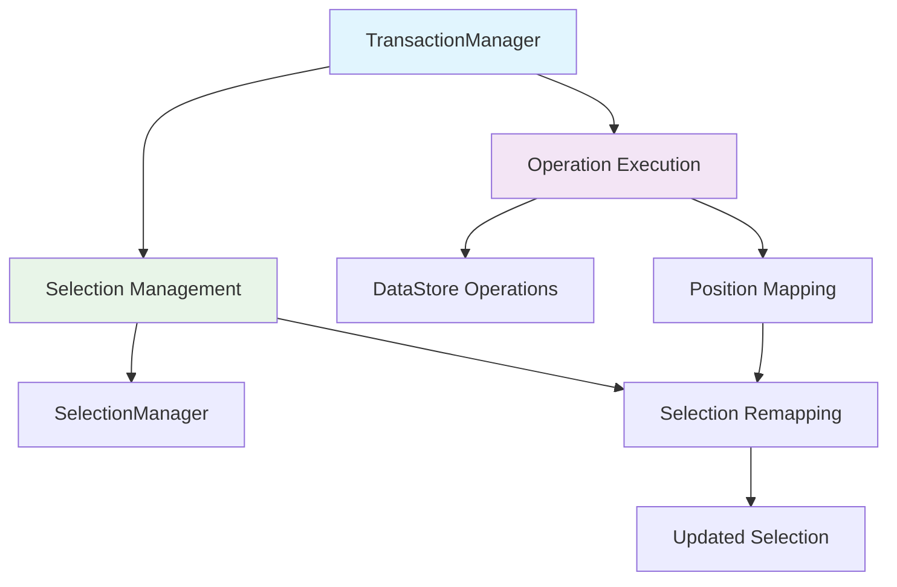

# Operation-Selection Integration Specification

## 1. 개요

이 문서는 Barocss Model에서 **Operation 실행과 Selection 관리의 통합**에 대한 명확한 스펙을 정의합니다. 현재 각 Operation마다 Selection 처리가 일관되지 않은 문제를 해결하고, 중앙집중식으로 Selection을 관리하는 방안을 제시합니다.

## 2. 현재 문제점

### 2.1 일관성 부족
- **Selection 관련 Operations**: `selectRange`, `selectNode`, `clearSelection`만 직접 처리
- **텍스트 Operations**: `text` operation만 Selection 자동 매핑
- **대부분의 Operations**: `create`, `update`, `delete`, `split`, `merge` 등은 Selection 처리 없음
- **사용자 경험**: Operation 타입에 따라 Selection 동작이 다름

### 2.2 중복 코드
- `text` operation에만 Selection 매핑 로직 존재
- 다른 Operations는 Selection 처리 로직 없음
- 새로운 Operation 추가 시 Selection 처리 여부 결정 필요

### 2.3 복잡성
- `text` operation만 DataStore + Selection 둘 다 관리
- Selection 관련 Operations는 Selection만 관리
- 나머지 Operations는 DataStore만 관리
- 일관되지 않은 책임 분산

## 3. 설계 원칙

### 3.1 단일 책임 원칙
- **Operation**: 데이터 변경에만 집중
- **Model Layer**: Operation + Selection 조합 관리

### 3.2 중앙집중식 처리
- 모든 Operation 후에 Selection 자동 매핑
- 일관된 Selection 정책 적용
- 중복 코드 제거

### 3.3 확장성
- 새로운 Operation 추가 시 Selection 처리 자동화
- Selection 정책 변경이 쉬움

## 4. 아키텍처

### 4.1 전체 구조



### 4.2 핵심 컴포넌트

#### A. TransactionManager
- Operation 실행과 Selection 관리를 조합
- 모든 Operation 후에 Selection 자동 매핑
- PositionMapping 계산 및 적용

#### B. Operation Layer
- 순수하게 데이터 변경에만 집중
- Selection 처리 로직 제거
- DataStore 메서드 호출

#### C. SelectionManager
- Selection 상태 관리
- Selection 매핑 및 업데이트
- Position 기반 Selection 처리

## 5. 구현 방안

### 5.1 핵심 설계 원칙

#### **사용자 액션 vs 외부 동기화 구분**
- **사용자 액션**: Transaction → Operations → DataStore + Selection 매핑
- **외부 동기화**: DataStore만 업데이트 (Selection 변경 없음)

#### **Operation의 역할**
- **데이터 처리**: DataStore 업데이트
- **Selection 매핑**: 즉시 SelectionManager 업데이트
- **단순함**: accumulated 로직 불필요

### 5.2 defineOperation 확장

```typescript
// defineOperation에 Selection 매핑 기능 추가
export function defineOperation<T extends TransactionOperation>(
  name: string, 
  executor: (operation: T, context: TransactionContext) => Promise<void | INode>
): void {
  globalOperationRegistry.register(name, { 
    name, 
    execute: executor
  });
}

// Operation 정의 인터페이스
export interface OperationDefinition {
  name: string;
  execute: <T extends TransactionOperation>(operation: T, context: TransactionContext) => Promise<void | INode>;
}
```

### 5.3 Operation 구현 패턴

```typescript
// Operation은 데이터 + Selection 매핑을 모두 처리
defineOperation('insertText', async (operation: InsertTextOperation, context: TransactionContext) => {
  // 1. DataStore 업데이트
  context.dataStore.insertText(operation.nodeId, operation.position, operation.text);
  
  // 2. Selection 매핑 및 즉시 업데이트
  const currentSelection = context.selectionManager.getCurrentSelection();
  if (currentSelection) {
    const newSelection = SelectionMappingUtils.shiftAfterInsert(currentSelection, operation);
    context.selectionManager.setSelection(newSelection);
  }
});

defineOperation('delete', async (operation: DeleteOperation, context: TransactionContext) => {
  // 1. DataStore 업데이트
  context.dataStore.deleteNode(operation.nodeId);
  
  // 2. Selection 매핑 및 즉시 업데이트
  const currentSelection = context.selectionManager.getCurrentSelection();
  if (currentSelection) {
    const newSelection = SelectionMappingUtils.clearSelection(currentSelection, operation);
    context.selectionManager.setSelection(newSelection);
  }
});
```

### 5.4 TransactionManager 수정

```typescript
class TransactionManager {
  private _dataStore: DataStore;
  private _selectionManager: SelectionManager;
  private _schema: Schema;

  async executeTransaction(operations: TransactionOperation[]): Promise<void> {
    // 각 Operation을 순차적으로 실행
    // (각 Operation에서 데이터 + Selection을 모두 처리)
    for (const operation of operations) {
      await this._executeOperationInternal(operation);
    }
    
    // 마지막 Operation의 Selection 결과가 최종 상태
    // (별도의 accumulated 로직 불필요)
  }

  // 외부 동기화용 (Selection 변경 없음)
  async applyExternalChanges(dataStoreOperations: DataStoreOperation[]): Promise<void> {
    for (const operation of dataStoreOperations) {
      // DataStore만 업데이트
      this._dataStore.applyOperation(operation);
      // Selection 변경 없음
    }
  }
}
```

### 5.5 동시편집 지원

```typescript
// 사용자 액션 (현재 편집하는 유저)
class UserActionManager {
  async executeUserAction(operations: TransactionOperation[]): Promise<void> {
    // Transaction → Operations → DataStore + Selection 매핑
    await this._transactionManager.executeTransaction(operations);
  }
}

// 외부 동기화 (다른 사용자/CRDT)
class ExternalSyncManager {
  async applyExternalChanges(dataStoreOperations: DataStoreOperation[]): Promise<void> {
    // DataStore만 업데이트 (Selection 변경 없음)
    await this._transactionManager.applyExternalChanges(dataStoreOperations);
  }
}
```

### 5.6 Selection 매핑 유틸리티

```typescript
// 공통 Selection 매핑 유틸리티 함수들
export class SelectionMappingUtils {
  // 삽입 후 Selection 이동
  static shiftAfterInsert(
    currentSelection: Selection, 
    operation: { nodeId: string; position: number; text: string }
  ): Selection | null {
    if (currentSelection.nodeId !== operation.nodeId) return currentSelection;
    
    if (currentSelection.start >= operation.position) {
      return {
        ...currentSelection,
        start: currentSelection.start + operation.text.length,
        end: currentSelection.end + operation.text.length
      };
    }
    return currentSelection;
  }
  
  // 삭제 후 Selection 이동
  static collapseToStart(
    currentSelection: Selection,
    operation: { nodeId: string; start: number; end: number }
  ): Selection | null {
    if (currentSelection.nodeId !== operation.nodeId) return currentSelection;
    
    return {
      ...currentSelection,
      start: operation.start,
      end: operation.start
    };
  }
  
  // 분할 후 Selection 이동
  static moveToSplitPoint(
    currentSelection: Selection,
    operation: { nodeId: string; splitPosition: number }
  ): Selection | null {
    if (currentSelection.nodeId !== operation.nodeId) return currentSelection;
    
    return {
      ...currentSelection,
      start: operation.splitPosition,
      end: operation.splitPosition
    };
  }
  
  // Selection 클리어
  static clearSelection(
    currentSelection: Selection,
    operation: { nodeId: string }
  ): Selection | null {
    if (currentSelection.nodeId === operation.nodeId) {
      return null; // Selection 클리어
    }
    return currentSelection;
  }
  
  // Selection 유지
  static preserveSelection(
    currentSelection: Selection,
    operation: any
  ): Selection | null {
    return currentSelection;
  }
}
```

## 6. Operation별 Selection 매핑 규칙

### 6.1 텍스트 편집 Operations
- **insertText**: 삽입 위치 이후 Selection 이동 (`shiftAfterInsert`)
- **deleteTextRange**: 삭제 범위 시작으로 Selection 이동 (`collapseToStart`)
- **setText**: 텍스트 전체 교체, Selection 범위 조정 필요
- **addMark**: 마크 추가, Selection 영향 없음 (`preserveSelection`)

### 6.2 노드 구조 Operations
- **create**: 새 노드 생성 시 Selection 영향 없음 (`preserveSelection`)
- **update**: 노드 속성 변경, Selection 영향 없음 (`preserveSelection`)
- **delete**: 노드 삭제 시 Selection 클리어 (`clearSelection`)
- **addChild**: 부모 노드의 content 배열 변경, Selection 영향 없음 (`preserveSelection`)

### 6.3 분할/병합 Operations
- **splitText**: 분할 지점으로 Selection 이동 (`moveToSplitPoint`)
- **mergeText**: 병합 지점으로 Selection 이동 (`moveToMergePoint`)
- **splitNode**: 노드 분할 시 Selection 조정
- **mergeNode**: 노드 병합 시 Selection 조정

### 6.4 Selection 관련 Operations
- **selectRange**: Selection 범위 설정 (직접 처리)
- **selectNode**: 노드 선택 (직접 처리)
- **clearSelection**: Selection 클리어 (직접 처리)

## 7. Selection 정책

### 7.1 사용자 액션 vs 외부 동기화
1. **사용자 액션**: Operation에서 데이터 + Selection 매핑을 모두 처리
2. **외부 동기화**: DataStore만 업데이트 (Selection 변경 없음)

### 7.2 매핑 규칙
- **텍스트 삽입**: 삽입 위치 이후 Selection 이동 (`shiftAfterInsert`)
- **텍스트 삭제**: 삭제 범위 시작으로 Selection 이동 (`collapseToStart`)
- **노드 삭제**: Selection 클리어 (`clearSelection`)
- **노드 분할**: 분할 지점으로 Selection 이동 (`moveToSplitPoint`)
- **노드 병합**: 병합 지점으로 Selection 이동 (`moveToMergePoint`)

## 8. 구현 단계

### Phase 1: Operation 수정
1. Operation에서 데이터 + Selection 매핑을 모두 처리하도록 수정
2. `SelectionMappingUtils` 클래스 구현
3. 각 Operation에 Selection 매핑 로직 추가

### Phase 2: TransactionManager 수정
1. 단순히 Operations를 순차 실행하도록 수정
2. 외부 동기화용 `applyExternalChanges` 메서드 추가
3. 사용자 액션과 외부 동기화 구분

### Phase 3: 동시편집 지원
1. `UserActionManager` 구현
2. `ExternalSyncManager` 구현
3. CRDT와의 통합

### Phase 4: 테스트 및 검증
1. 각 Operation별 Selection 매핑 테스트
2. 동시편집 시나리오 테스트
3. 복잡한 Transaction 조합 테스트

## 9. 예상 효과

### 9.1 동시편집 지원
- 사용자 액션과 외부 동기화를 명확히 구분
- CRDT와 완벽하게 호환
- Selection이 올바르게 동기화됨

### 9.2 단순성 향상
- Operation에서 데이터 + Selection을 모두 처리
- accumulated 로직 불필요
- TransactionManager가 단순해짐

### 9.3 유지보수성 향상
- Selection 로직이 Operation에 집중
- 각 Operation의 책임이 명확해짐
- 코드 중복 제거

### 9.4 확장성 향상
- 새로운 Operation 추가 시 Selection 매핑만 추가
- 동적 스키마 지원
- 공통 유틸리티로 재사용성 향상

## 10. 결론

**Operation에서 데이터 + Selection 매핑을 모두 처리**함으로써 **동시편집을 지원하는 일관성 있는 시스템**을 구축할 수 있습니다.

### 핵심 장점:
- ✅ **동시편집 지원**: 사용자 액션과 외부 동기화를 명확히 구분
- ✅ **단순성**: accumulated 로직 불필요, TransactionManager 단순화
- ✅ **CRDT 호환**: DataStore 기반으로 Selection 자동 동기화
- ✅ **확장성**: 새로운 Operation 추가 시 Selection 매핑만 추가

이 방식으로 구현하면 **동시편집 환경에서도 Selection이 올바르게 관리**되고, **CRDT와 완벽하게 호환**되는 시스템을 만들 수 있습니다.

이 스펙을 바탕으로 단계적으로 구현을 진행하면, 현재의 문제점들을 해결하고 더 나은 사용자 경험을 제공할 수 있을 것입니다.
