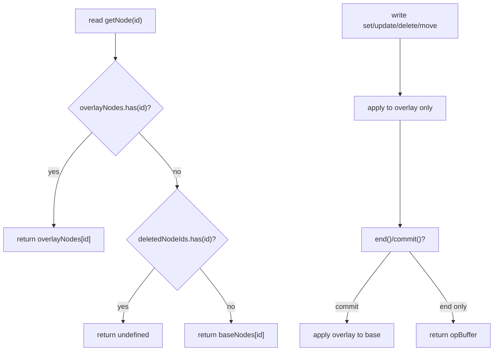
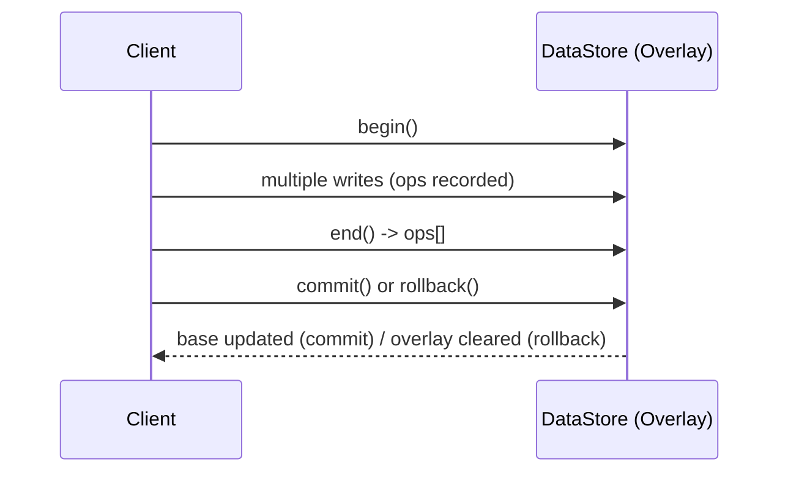

## Appendix: Overlay Path and Whitespace Operation Notes

### A. Overlay Read/Write Path Diagram



### B. Transaction Lifecycle (Summary)



### C. Whitespace Operation Idempotency Rule
- normalizeWhitespace, trimText: when called repeatedly on the same range with no content change, they do not emit update operations.

# DataStore Structure Specification

## Core Policies (Summary)

- Root protection: current root node cannot be deleted via `deleteNode`, `deleteDocument`. Attempts return an error.
- Overlay transaction: operations after `begin()` are collected in overlay and applied in order on `commit()` (create → update → move → delete). `rollback()` discards overlay.
- Operation events: emit atomic operation events regardless of overlay state. Payloads are treated as immutable.
- No-op suppression: `updateNode` skips writes (returns success) if all provided fields are deep-equal to existing values. Includes arrays/objects.
- Content update: if `updates.content` exists, bypass validation and apply directly (internally it’s an ID array).
- Attributes merge: `updateNode` shallow-merges with existing attributes. Type changes are forbidden.
- Alias (overlay-scoped): `$alias` is registered in overlay map and removed on save. `resolveAlias` resolves id/alias to actual id.

## 1. Overview

DataStore is the core data storage for Barocss Model, using an ID-based Map structure to manage nodes and documents efficiently. It adopts a hybrid architecture that maintains hierarchical structure while providing O(1) access performance.

## 2. Core Concepts

### 2.1 ID-based Map Structure
- **Principle**: store all nodes as `Map<string, INode>`
- **Benefits**: O(1) access time, memory efficiency, scalability
- **Relationship management**: maintain hierarchy via `parentId` and `content` arrays

### 2.2 Hybrid Architecture
- **Internal**: stored as ID-based Map (performance optimized)
- **External**: exposed as tree structure (user-friendly)
- **Conversion**: bidirectional conversion via automatic conversion methods

### 2.3 Figma-style ID System
- **Format**: `[sessionId]:[counter]` (e.g., "0:1", "0:2", "1:3")
- **Benefits**: very short and readable, grouped by session
- **Global counter**: prevents duplicates across DataStore instances

### 2.4 Atomic Operation System
- **Event-based**: tracks all changes as operations
- **Types**: create, update, delete, move
- Invariants:
  - `type ∈ {create, update, delete, move}`
  - `nodeId !== ''`
  - If `move.position` is provided, `position ≥ 0`

- **Real-time tracking**: supports synchronization with external systems (CRDT, etc.)

### 2.5 Separation of Selection and Data
- **Principle**: selection (editor caret/range) is UI/session state, separate from data synchronization
- **Transmission**: selection is sent via a separate lightweight channel (presence/session channel) as `anchorId/anchorOffset/focusId/focusOffset`
- **Remap**: selection remap after data changes is handled locally (not included in operation payload)

## 3. Architecture

### 3.1 Core Components

```
DataStore
├── nodes: Map<string, INode>
├── rootNodeId: string | undefined
├── version: number
├── _registeredSchemas: Map<string, Schema>
├── _activeSchema: Schema | undefined
├── _eventEmitter: EventEmitter
├── _globalCounter: number (static)
├── _sessionId: number
├── DocumentIterator: document traversal system
└── Operation classes
    ├── core: CoreOperations
    ├── query: QueryOperations
    ├── content: ContentOperations
    ├── splitMerge: SplitMergeOperations
    ├── marks: MarkOperations
    ├── range: RangeOperations
    └── utility: UtilityOperations

EventEmitter
├── listeners: Map<string, Set<Function>>
├── on(event, callback)
├── off(event, callback)
└── emit(event, ...args)
```

### 3.2 Operation Class Structure

DataStore functionality is modularized into 7 specialized operation classes:

#### 3.2.1 CoreOperations
- **Purpose**: provides basic CRUD
- **Main methods**: `setNode`, `getNode`, `deleteNode`, `updateNode`, `createNodeWithChildren`
- **Characteristics**: schema validation, ID generation, atomic operations

#### 3.2.2 QueryOperations
- **Purpose**: provides search and query
- **Main methods**: `findNodes`, `findNodesByType`, `findNodesByAttribute`, `findChildrenByParentId`, `searchText`
- **Characteristics**: conditional search, nested structure queries, text search
- **Performance policy**: combines DocumentIterator (performance-first) and full traversal (completeness-first)

#### 3.2.3 ContentOperations
- **Purpose**: manages parent-child relationships
- **Main methods**: `addChild`, `removeChild`, `moveNode`, `copyNode`, `reorderChildren`
- **Characteristics**: hierarchy manipulation, node move/copy, batch processing

#### 3.2.4 SplitMergeOperations
- **Purpose**: text/block split/merge
- **Main methods**: `splitTextNode`, `mergeTextNodes`, `splitBlockNode`, `mergeBlockNodes`
- **Characteristics**: text editing support, mark preservation, auto-merge

#### 3.2.5 MarkOperations
- **Purpose**: mark normalization and statistics
- **Main methods**: `normalizeMarks`, `getMarkStatistics`, `removeEmptyMarks`
- **Characteristics**: mark deduplication, overlap merging, statistics

#### 3.2.6 MultiNodeRangeOperations
- **Purpose**: multi-node range operations
- **Main methods**: `deleteMultiNodeRange`, `insertTextAtMultiNodeRange`, `applyMarkToMultiNodeRange`
- **Characteristics**: operations spanning multiple nodes, complex text manipulation

#### 3.2.7 UtilityOperations
- **Purpose**: provides utility functions
- **Main methods**: `getNodeCount`, `clone`, `getAllNodes`, `getNodePath`, `isDescendant`
- **Characteristics**: data analysis, cloning, relationship checks

### 3.3 Data Flow

```
1. External nested object input
   ↓
2. ID assignment (recursive)
   ↓
3. Schema validation
   ↓
4. Convert to DataStore format
   ↓
5. Store in Map
   ↓
6. Emit operation events
```

## 4. Core Interfaces

### 4.1 INode Interface
```typescript
interface INode {
  id: string;                    // unique identifier
  type: string;                  // node type
  text?: string;                 // text content (text nodes)
  content?: string[];            // child node ID array
  parentId?: string;             // parent node ID
  attributes?: Record<string, any>; // attributes
  marks?: IMark[];               // mark array
  version?: number;              // version info
}
```

### 4.2 IMark Interface
```typescript
interface IMark {
  type: string;                  // mark type (bold, italic, etc.)
  range: [number, number];       // application range [start, end]
  attributes?: Record<string, any>; // mark attributes
}
```

## 6. Operation Collection and Event Model

### 6.1 Atomic Operation Types (Summary)

- Common convention
  - Common fields: `type`, `nodeId`, `timestamp`
  - Optional fields: `parentId`, `position`, `data`
  - `data` holds post-state snapshot (state after change), especially for create/update.

- create
  - Meaning: new node created
  - Fields: `type: "create"`, `nodeId`, `timestamp`, `data` (required)
  - `data`: `{ type, attributes?, text?, content?, parentId? }`
  - Note: if parent connection happens together, parent’s `content` may be collected as a separate `update`

- update
  - Meaning: change to existing node’s attributes/text/child array
  - Fields: `type: "update"`, `nodeId`, `timestamp`, `data` (required)
  - `data`: post-change snapshot (full or changed field set; implementation should prefer full snapshot)
  - Note: `content` changes are also collected as update

- delete
  - Meaning: node deletion (includes removal from parent content)
  - Fields: `type: "delete"`, `nodeId`, `timestamp`, `parentId?`
  - Note: upper layers can handle tombstones if needed

- move
  - Meaning: position/order change (parent/position move, reorder within same parent)
  - Fields: `type: "move"`, `nodeId`, `timestamp`, `parentId` (required), `position?`
  - Note: order changes are expressed as move sequences

All changes are collected as one of the above 4 types. Composite actions are recorded as sequences of multiple atomic ops.

### 6.2 Collection/Transaction API (begin/end/commit/rollback)

DataStore always uses an active `TransactionalOverlay`. `begin/end` manages operation collection buffers; `commit/rollback` controls overlay application/discard.

```ts
// Start collection: initialize opBuffer (overlay persists)
dataStore.begin();
// Perform multiple create/update/delete/move (all writes reflect only in overlay)
const ops = dataStore.end();  // End collection: return accumulated op list (buffer cleared)

// Commit: apply overlay state to base and clear overlay
dataStore.commit();

// Rollback: discard overlay changes and opBuffer (base unchanged)
dataStore.rollback();

// Check progress mid-way
const current = dataStore.getCollectedOperations();
```

Even when operation collection is inactive, overlay is always-on, and `operation` events are emitted immediately. During collection (begin~end), ops are pushed to buffer instead of being emitted.

### 6.3 Collection Rules by Operation

- Text/mark/range utils: internally trigger update → collected as update
- Content movement
  - moveNode / moveChildren: position changes collected as explicit move
  - reorderChildren: when reordering within same parent, collected as move sequence per element for new positions
- Create/delete
  - Collected as setNode(create) / deleteNode(delete)
- Copy/clone
  - copyNode: per-node create for new nodes, parent content changes collected as parent update (no move)
  - cloneNodeWithChildren: per-node create for each node, cloned node’s content/parent links collected as update (no move)

### 6.4 Recommended Usage Timing for begin/end/commit/rollback

- begin():
  - Call at the start of a user interaction unit (key input sequence, drag-drop, paste, etc.) to collect ops from that action as one batch.
  - Recommended to align with Undo/Redo units, CRDT batch units.
- end():
  - Call when the interaction completes to return collected ops to upper layers.
- commit():
  - Call at model update time to apply overlay changes to base store.
  - Typically performed by upper `TransactionManager` immediately after propagating ops collected via `end()` to the network.
- rollback():
  - Discard overlay changes on interaction cancellation, validation failure, conflict detection, etc.

Prerequisite: `TransactionManager` ensures a global write lock during transaction period (begin~commit/rollback) to prevent contention with external writes.

### 6.5 Collection/Commit Scenario Example

```ts
dataStore.begin();
// update
dataStore.updateNode(textId, { text: 'Hello World' }, false);
// create + parent update
const newTextId = dataStore.addChild(paragraphId, { type: 'inline-text', text: '!' });
// move (parent change)
dataStore.moveNode(newTextId, otherParagraphId, 0);
// delete (includes parent content removal)
dataStore.removeChild(paragraphId, newTextId);
dataStore.deleteNode(newTextId);
const ops = dataStore.end();
// ops: [update, create, move, delete, ...]
```

### 6.6 Application Order and Consistency

- Creates (create) are emitted parent → child order for easy reconstruction.
- Position changes (move) include target node and parent/position info together.
- For copy/clone, record entire tree as per-node create rather than all at once to maintain CRDT/replay friendliness.

### 6.7 Event Stream and Batching

### 6.8 JSON Spec for CRDT Integration

- Single Operation JSON (common structure)

```json
{
  "type": "create|update|delete|move",
  "nodeId": "0:42",
  "timestamp": 1739182345123,
  "parentId": "0:7",
  "position": 2,
  "data": {
    "type": "paragraph",
    "attributes": {"align": "left"},
    "text": "Hello",
    "content": ["0:43", "0:44"],
    "parentId": "0:7"
  }
}
```

## 7. DataStore Public API (Additional/Changed Summary)

### 7.1 Collection (Lightweight Transaction API)

- `begin(): void` start collection
- `getCollectedOperations(): AtomicOperation[]` query current accumulated ops (copy)
- `end(): AtomicOperation[]` end collection and return accumulated ops (buffer cleared)

### 7.2 Range/Text/Mark Utils (Delegates to RangeOperations)

- Text
  - `deleteText(contentRange)` → string
  - `extractText(contentRange)` → string
  - `insertText(contentRange, text)` → string
  - `replaceText(contentRange, newText)` → string
  - `copyText(contentRange)` → string
  - `moveText(fromRange, toRange)` → string
  - `duplicateText(contentRange)` → string

- Mark/formatting
  - `applyMark(contentRange, mark)` → mark
  - `removeMark(contentRange, markType)` → number
  - `clearFormatting(contentRange)` → number
  - `toggleMark(contentRange, markType, attrs?)` → void
  - `constrainMarksToRange(contentRange)` → number

- Search/normalization
  - `findText(contentRange, searchText)` → number
  - `getTextLength(contentRange)` → number
  - `trimText(contentRange)` → number
  - `normalizeWhitespace(contentRange)` → string
  - `wrap(contentRange, prefix, suffix)` → string
  - `unwrap(contentRange, prefix, suffix)` → string
  - `replace(contentRange, pattern, replacement)` → number
  - `findAll(contentRange, pattern)` → {start,end}[]
  - `expandToWord(contentRange)` → ContentRange
  - `expandToLine(contentRange)` → ContentRange
  - `normalizeRange(contentRange)` → ContentRange

### 7.3 Content Management (Change Points)

- `addChild(parentId, child, position?)` → string (collects create+parent update)
- `removeChild(parentId, childId)` → boolean (collects delete)
- `reorderChildren(parentId, childIds)` → void (collects move sequence per item for same-parent reorder)
- `moveNode(nodeId, newParentId, position?)` → void (collects move)
- `moveChildren(fromParentId, toParentId, childIds, position?)` → void (collects move per item)
- `copyNode(nodeId, newParentId?)` → string (per-node create for copied nodes + parent update, no move)
- `cloneNodeWithChildren(nodeId, newParentId?)` → string (per-node create for entire tree + content/parent update, no move)

### 7.4 Core/Utility (Summary)

- Core: `setNode`, `updateNode`, `deleteNode`, `getNode`, `createNodeWithChildren`
- Utility: `getAllNodes`, `getAllNodesMap`, `getRootNodeId`, `getNodePath`, `getNodeDepth`, `compareDocumentOrder`, `getNextNode`, `getPreviousNode`, `createDocumentIterator`, `createRangeIterator`, `traverse`, etc.

- create (JSON example)

```json
{
  "type": "create",
  "nodeId": "0:1001",
  "timestamp": 1739182345123,
  "data": {
    "type": "inline-text",
    "text": "Hello",
    "parentId": "0:500"
  }
}
```

- update (JSON example)

```json
{
  "type": "update",
  "nodeId": "0:1001",
  "timestamp": 1739182346123,
  "data": {
    "type": "inline-text",
    "text": "Hello World",
    "parentId": "0:500"
  }
}
```

- delete (JSON example)

```json
{
  "type": "delete",
  "nodeId": "0:1001",
  "timestamp": 1739182347123,
  "parentId": "0:500"
}
```

- move (JSON example)

```json
{
  "type": "move",
  "nodeId": "0:1001",
  "timestamp": 1739182348123,
  "parentId": "0:501",
  "position": 0
}
```

- Batch (transaction) delivery format

```json
{
  "sessionId": 0,
  "version": 15,
  "operations": [
    { "type": "update", "nodeId": "0:10", "timestamp": 1739182000000, "data": {"type": "inline-text", "text": "A"} },
    { "type": "create", "nodeId": "0:11", "timestamp": 1739182000100, "data": {"type": "inline-text", "text": "!", "parentId": "0:5"} },
    { "type": "move",   "nodeId": "0:11", "timestamp": 1739182000200, "parentId": "0:6", "position": 0 },
    { "type": "delete", "nodeId": "0:12", "timestamp": 1739182000300, "parentId": "0:5" }
  ]
}
```

- JSON Schema (Summary)

```json
{
  "$schema": "http://json-schema.org/draft-07/schema#",
  "title": "AtomicOperation",
  "type": "object",
  "required": ["type", "nodeId", "timestamp"],
  "properties": {
    "type": {"type": "string", "enum": ["create", "update", "delete", "move"]},
    "nodeId": {"type": "string"},
    "timestamp": {"type": "number"},
    "parentId": {"type": "string"},
    "position": {"type": "number", "minimum": 0},
    "data": {
      "type": "object",
      "properties": {
        "type": {"type": "string"},
        "attributes": {"type": "object"},
        "text": {"type": "string"},
        "content": {"type": "array", "items": {"type": "string"}},
        "parentId": {"type": "string"}
      },
      "additionalProperties": true
    }
  },
  "additionalProperties": false
}
```


- When not in collection mode: single emit (`operation` event)
- When in collection mode: accumulate in buffer between begin~end, then deliver in batch via end() return value (upper layers can wrap as batch commit event)

### 4.3 Document Interface
```typescript
interface Document {
  id: string;
  type: 'document';
  content: string[];             // root node ID array
  attributes?: Record<string, any>;
  metadata?: {
    title?: string;
    author?: string;
    createdAt?: Date;
    updatedAt?: Date;
  };
  version: number;
}
```

## 5. DocumentIterator System

### 5.1 Overview

DocumentIterator is an iterator system for efficiently traversing document structure. It uses depth-first traversal by default and provides various filtering and range limiting features.

### 5.2 Core Features

#### 5.2.1 Basic Traversal
```typescript
// Basic document traversal
const iterator = dataStore.createDocumentIterator();
for (const nodeId of iterator) {
  const node = dataStore.getNode(nodeId);
  console.log(node.type, node.text);
}
```

#### 5.2.2 Filtering
```typescript
// Traverse only specific types
const headingIterator = dataStore.createDocumentIterator({
  filter: { type: 'heading' }
});

// Exclude multiple types
const textIterator = dataStore.createDocumentIterator({
  filter: { excludeTypes: ['document', 'list'] }
});
```

#### 5.2.3 Range Limiting
```typescript
// Traverse only nodes within specific range
const rangeIterator = dataStore.createDocumentIterator({
  range: {
    startNodeId: 'heading-1',
    endNodeId: 'paragraph-2'
  }
});
```

#### 5.2.4 Depth Limiting
```typescript
// Limit maximum depth
const shallowIterator = dataStore.createDocumentIterator({
  maxDepth: 2
});
```

### 5.3 Visitor Pattern

#### 5.3.1 Basic Visitor
```typescript
interface DocumentVisitor {
  visit(nodeId: string, node: any, context?: any): void | boolean;
  enter?(nodeId: string, node: any, context?: any): void;
  exit?(nodeId: string, node: any, context?: any): void;
  shouldVisitChildren?(nodeId: string, node: any): boolean;
}
```

#### 5.3.2 Usage Example
```typescript
// Text extraction visitor
class TextExtractor implements DocumentVisitor {
  private texts: string[] = [];

  visit(nodeId: string, node: any) {
    if (node.type === 'inline-text' && node.text) {
      this.texts.push(node.text);
    }
  }

  getTexts() {
    return this.texts;
  }
}

// Execute visitor
const extractor = new TextExtractor();
dataStore.traverse(extractor);
const allTexts = extractor.getTexts();
```

#### 5.3.3 Multiple Visitors
```typescript
// Execute multiple visitors simultaneously
const textExtractor = new TextExtractor();
const linkCollector = new LinkCollector();
const nodeCounter = new NodeCounter();

dataStore.traverse(textExtractor, linkCollector, nodeCounter);
```

### 5.4 Utility Methods

```typescript
// Convert to array
const allNodes = dataStore.createDocumentIterator().toArray();

// Find first node matching condition
const firstHeading = dataStore.createDocumentIterator({
  filter: { type: 'heading' }
}).find();

// Find all nodes matching condition
const allHeadings = dataStore.createDocumentIterator({
  filter: { type: 'heading' }
}).findAll();
```

## 6. Range-based Operations

### 6.1 Range Concept

DataStore range operations are divided into two levels:

#### 6.1.1 Node Range
```typescript
interface DocumentRange {
  startNodeId: string;
  endNodeId: string;
  includeStart?: boolean;
  includeEnd?: boolean;
}
```
- **Use**: specify traversal range for DocumentIterator
- **Characteristic**: range specified only at node level

#### 6.1.2 Text Range
```typescript
interface TextRange {
  startNodeId: string;
  startOffset: number;  // character position within text
  endNodeId: string;
  endOffset: number;    // character position within text
}
```
- **Use**: precise text handling in DataStore operations
- **Characteristic**: precise position down to character level

### 6.2 Range Operation Architecture

#### 6.2.1 Role Separation
- **DocumentIterator**: node traversal using Node Range
- **DataStore Operations**: precise text handling using Text Range

#### 6.2.2 createRangeIterator API
```typescript
// createRangeIterator method signature
createRangeIterator(
  range: DocumentRange,
  options?: DocumentIteratorOptions
): DocumentIterator

// Usage example
const rangeIterator = dataStore.createRangeIterator(
  { startNodeId: 'node1', endNodeId: 'node2' },
  { filter: { type: 'inline-text' } }
);
```

#### 6.2.3 Processing Flow
```typescript
// Approach 1: Using basic DocumentIterator
// 1. Convert TextRange to NodeRange
const nodeRange = calculateNodeRange(textRange);

// 2. Collect nodes in range via DocumentIterator
const nodesInRange = Array.from(
  dataStore.createDocumentIterator({ range: nodeRange })
);

// 3. Process exact text range in each node
processTextRangeInNodes(nodesInRange, textRange);

// Approach 2: Using createRangeIterator (recommended)
// 1. Convert TextRange to NodeRange
const nodeRange = calculateNodeRange(textRange);

// 2. Traverse directly with createRangeIterator
const rangeIterator = dataStore.createRangeIterator(nodeRange);

// 3. Process immediately while traversing
for (const nodeId of rangeIterator) {
  processNodeInTextRange(nodeId, textRange);
}
```

### 6.3 Range Operation Examples

#### 6.3.1 Using Basic DocumentIterator
```typescript
deleteTextRange(textRange: TextRange) {
  // 1. Collect nodes in range
  const nodeRange = this.calculateNodeRange(textRange);
  const nodesInRange = Array.from(
    this.createDocumentIterator({ range: nodeRange })
  );
  
  // 2. Delete text range in each node
  this.processTextRangeInNodes(nodesInRange, textRange);
}

insertTextAtRange(textRange: TextRange, text: string) {
  // 1. Collect nodes in range
  const nodeRange = this.calculateNodeRange(textRange);
  const nodesInRange = Array.from(
    this.createDocumentIterator({ range: nodeRange })
  );
  
  // 2. Find insertion position and insert text
  this.insertTextInNodes(nodesInRange, textRange, text);
}
```

#### 6.3.2 Using createRangeIterator (Recommended)
```typescript
// More efficient approach using createRangeIterator directly
deleteTextRange(textRange: TextRange) {
  // 1. Convert TextRange to NodeRange
  const nodeRange = this.calculateNodeRange(textRange);
  
  // 2. Traverse nodes in range with createRangeIterator
  const rangeIterator = this.createRangeIterator(nodeRange);
  
  // 3. Process text range while traversing
  for (const nodeId of rangeIterator) {
    this.processNodeInTextRange(nodeId, textRange);
  }
}

insertTextAtRange(textRange: TextRange, text: string) {
  // 1. Convert TextRange to NodeRange
  const nodeRange = this.calculateNodeRange(textRange);
  
  // 2. Traverse nodes in range with createRangeIterator
  const rangeIterator = this.createRangeIterator(nodeRange);
  
  // 3. Process text insertion while traversing
  for (const nodeId of rangeIterator) {
    this.insertTextInNode(nodeId, textRange, text);
  }
}

replaceTextRange(textRange: TextRange, newText: string) {
  // 1. Convert TextRange to NodeRange
  const nodeRange = this.calculateNodeRange(textRange);
  
  // 2. Traverse nodes in range with createRangeIterator
  const rangeIterator = this.createRangeIterator(nodeRange);
  
  // 3. Process text replacement while traversing
  for (const nodeId of rangeIterator) {
    this.replaceTextInNode(nodeId, textRange, newText);
  }
}
```

#### 6.3.3 Benefits of createRangeIterator
```typescript
// 1. Memory efficiency: direct traversal without array conversion
const rangeIterator = this.createRangeIterator(nodeRange);
for (const nodeId of rangeIterator) {
  // Process each node immediately
  this.processNode(nodeId);
}

// 2. Early termination: stop traversal if condition met
const rangeIterator = this.createRangeIterator(nodeRange);
for (const nodeId of rangeIterator) {
  if (this.shouldStopProcessing(nodeId)) {
    break; // stop traversal
  }
  this.processNode(nodeId);
}

// 3. Combine with filtering: range + type filter
const headingRangeIterator = this.createRangeIterator(nodeRange, {
  filter: { type: 'heading' }
});

// 4. Combine with depth limiting: range + depth limit
const shallowRangeIterator = this.createRangeIterator(nodeRange, {
  maxDepth: 2
});
```

### 6.4 Benefits

#### 6.4.1 Efficiency
- **Batch processing**: collect nodes in range at once
- **Optimized traversal**: leverages DocumentIterator’s proven algorithm
- **No duplicates**: doesn’t visit same node multiple times
- **Memory efficiency**: direct traversal with `createRangeIterator` without array conversion
- **Early termination**: can stop traversal immediately if condition met

#### 6.4.2 Consistency
- **Unified traversal**: all range operations use same traversal logic
- **Predictability**: DocumentIterator order guarantees
- **Reusability**: reuses proven traversal algorithm
- **API consistency**: unifies range traversal API with `createRangeIterator`

#### 6.4.3 Extensibility
- **New operations**: easy to add based on DocumentIterator
- **Advanced features**: can leverage filtering, conditional processing, etc.
- **Performance optimization**: automatically benefits from Iterator optimizations
- **Combinability**: combine range + filtering + depth limiting and other options

#### 6.4.4 Specialized Benefits of createRangeIterator
- **Intuitive API**: dedicated method for range traversal
- **Option combination**: naturally combines range with other options
- **Performance optimization**: specialized optimizations for range traversal
- **Code readability**: clear intent with dedicated API

## 7. Performance Characteristics

### 7.1 Time Complexity
- **Node lookup**: O(1) - Map-based
- **Node storage**: O(1) - Map-based
- **Node deletion**: O(1) - Map-based
- **Child lookup**: O(k) - k is number of children
- **Search**: O(n) - n is total node count
- **Tree traversal**: O(n) - n is node count
- **DocumentIterator traversal**: O(n) - n is number of nodes traversed
- **Range-based traversal**: O(k) - k is number of nodes in range
- **createRangeIterator**: O(k) - k is number of nodes in range
- **Visitor pattern**: O(n) - n is number of nodes visited

### 7.2 Space Complexity
- **Basic storage**: O(n) - n is node count
- **Nested structure**: O(n) - optimized with ID references
- **Mark storage**: O(m) - m is mark count

### 7.3 Memory Optimization
- **Structural sharing**: share unchanged parts
- **Lazy loading**: load only when needed
- **Compressed storage**: remove duplicate data

## 8. Query Optimization Strategy

### 8.1 Performance vs Completeness Policy

QueryOperations uses two approaches to balance performance and completeness:

#### Using DocumentIterator (Performance-first)
- **findNodesByType**: efficient traversal with type filtering
- **findChildrenByParentId**: direct access to parent’s content array
- **findNodesByDepth**: prevents unnecessary traversal with depth limiting

#### Using Full Traversal (Completeness-first)
- **findNodes**: searches all nodes including orphans
- **findRootNodes**: treats orphans as roots
- **findNodesByAttribute**: attribute search (including orphans)
- **findNodesByText**: text search (including orphans)
- **searchText**: text search (including orphans)

### 8.2 Optimization Strategies

#### 8.2.1 Performance-first Scenarios
- General search operations
- Fast queries in large documents
- When UI responsiveness is important

#### 8.2.2 Completeness-first Scenarios
- Data integrity checks
- Cleanup and debugging
- When orphan node detection is needed

## 9. Extensibility

### 9.1 Horizontal Extension
- **New node types**: supported via schema extension
- **New mark types**: mark system extension
- **New attributes**: leverage attributes field

### 9.2 Vertical Extension
- **Deep nesting**: supports recursive structures
- **Large documents**: efficient management with ID-based references
- **Complex relationships**: supports multiple references

## 10. Related Documents

- [DataStore Operations Specification](./datastore-operations-spec.md) - detailed functionality by operation class
- [DocumentIterator Specification](../packages/datastore/docs/document-iterator-spec.md) - detailed DocumentIterator spec
- [DataStore Usage Scenarios](./datastore-usage-scenarios.md) - usage by scenario
- [DataStore API Reference](./datastore-api-reference.md) - API reference

---

This spec covers the core architecture and basic concepts of the Barocss DataStore system. For detailed usage and API reference, see related documents.
