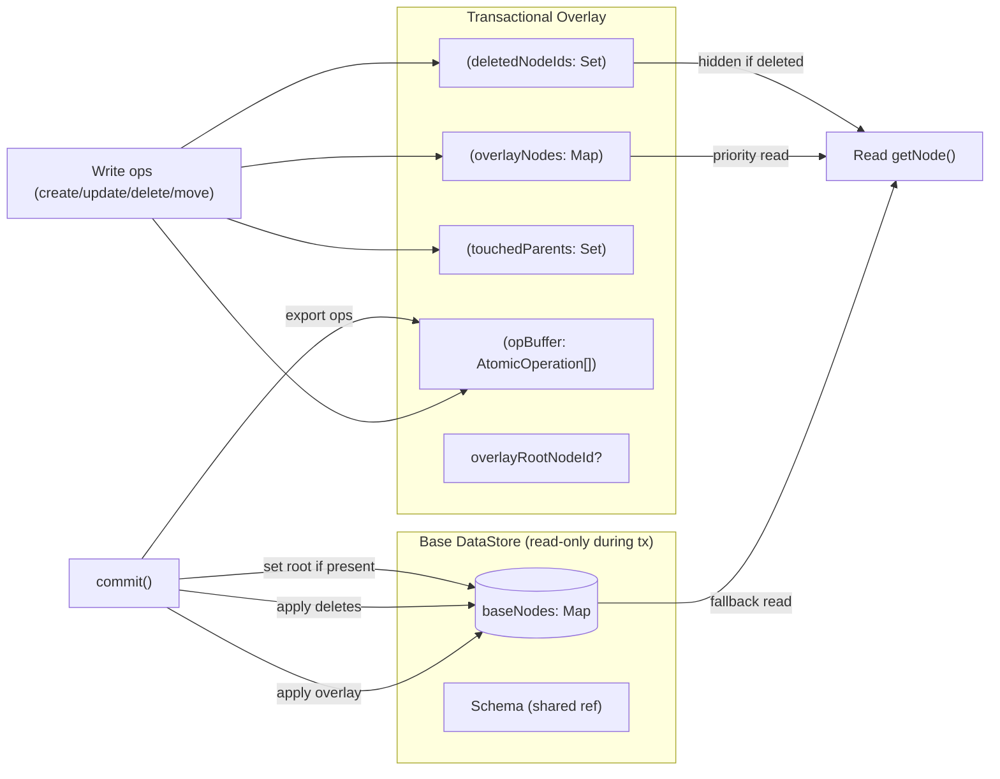
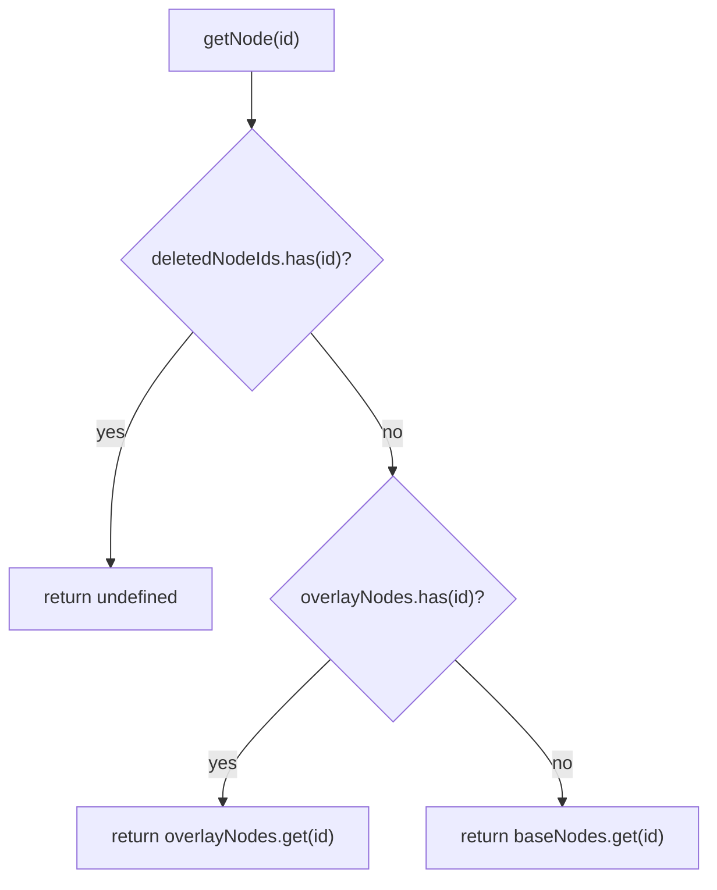
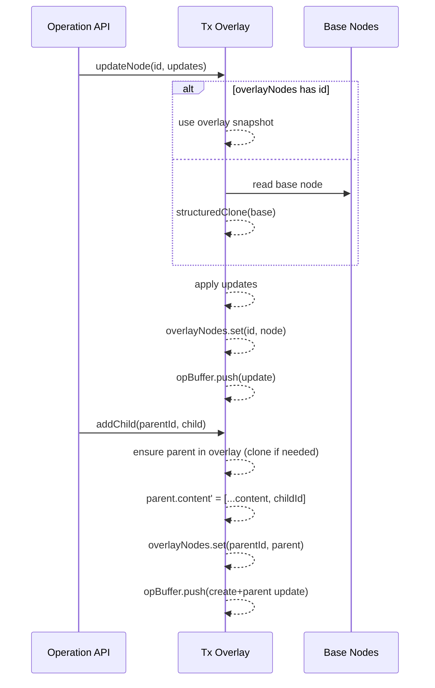
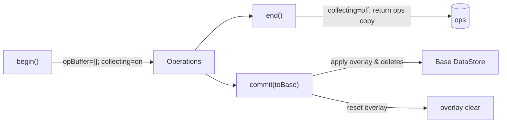

# DataStore Transactional Clone (Copy-on-Write Overlay) Spec

## 0. Assumptions
- TransactionManager ensures a global write lock during transaction period. External writes are blocked until the transaction ends.
- As an optional safeguard, capture `baseVersion` at begin time and verify it matches at commit (use per policy).

## 1. Purpose
- Eliminate full copy cost at transaction start; pay cost only for changed nodes.
- Reference original DataStore as read-only; accumulate changes only in transaction-local overlay.
- Compatible with existing atomic op collection (create/update/delete/move).

### 1.1 Summary (Core Ideas)
- Read path operates consistently in order: overlay > deleted-check > base.
- Writes are always reflected only in overlay (COW) and applied to base only at `commit()`.
- `begin()/end()` collects atomic ops in batches; `commit()/rollback()` applies/discards overlay content.
- Replicate only changed nodes via structural sharing to save performance and memory.

## 2. Core Concepts
- Copy-on-Write (COW): copy the node at actual write time and store in overlay.
- Overlay Map: `Map<string, INode>` holding latest snapshot of nodes modified/created during transaction.
- Deleted Set: set of node IDs deleted during transaction.
- Touched Parents: set of parent IDs whose `content` changed (tracks order and connection changes).
- Schema: shared with original (reference maintained). Validation uses overlay results as input.
- Global Write Lock: concurrent write conflicts prevented by TransactionManager lock (can be combined with version verification if needed).

## 3. Data Structure
- baseNodes: original `Map<string, INode>` (read-only reference)
- overlayNodes: `Map<string, INode>` (stores COW results)
- deletedNodeIds: `Set<string>`
- touchedParents: `Set<string>`
- overlayRootNodeId?: `string` (when root changes)
- opBuffer: `AtomicOperation[]` (existing begin/end collection)
- sessionId/globalCounter: maintain existing rules (counter independent per clone)

## 3.1 Structure Diagram

## 4. Read Rules
- getNode(id):
  1) `deletedNodeIds.has(id)` → undefined
  2) `overlayNodes.get(id)` → return
  3) fallback: `baseNodes.get(id)`
- content access: if parent is in overlay, use overlay.content; otherwise use base.content
- Derived APIs (find/getChildren/…): consistently use the above rules

### 4.1 Read Flow

## 5. Write Rules (COW)
- updateNode(id, updates):
  - source = `overlayNodes.get(id)` or `structuredClone(baseNodes.get(id))`
  - apply updates → `overlayNodes.set(id, source)`
  - collect `update` in opBuffer
- createNode/addChild:
  - create new node then `overlayNodes.set(newId, node)`
  - parent content is cloned-modified in overlay
  - collect `create`/parent `update` in opBuffer
- deleteNode(id):
  - `deletedNodeIds.add(id)`
  - remove from parent content in overlay
  - collect `delete`/parent `update` in opBuffer
- move/reorder:
  - manipulate parent content in overlay
  - collect `move` in opBuffer (multiple moves if needed)

### 5.1 Write/Parent Content Update Sequence

## 6. Transaction Lifecycle
- begin(): initialize opBuffer, turn collection on, (optional) capture `baseVersion = store.version`
- getCollectedOperations(): return buffer copy
- end(): turn collection off, return buffer (overlay persists)
- commit():
  - apply overlayNodes → base (setNodeInternal)
  - remove deletedNodeIds → base
  - update base.rootNodeId if root changed
  - (optional) pre-validate with `assert(store.version === baseVersion)`
  - opBuffer is passed to upper layer (CRDT/network)
  - reset overlay state
- rollback(): clear overlay/sets/opBuffer

### 6.1 begin/end/commit Diagram

## 7. Schema and Validation
- Active schema is shared (reference). Validation is performed on overlay snapshot.
- `validateNode(node, schema)` uses overlay results as input.

## 8. Performance Characteristics
- Transaction start cost: O(1)
- Total cost: proportional to number of modified nodes/parents
- Cloning: prefer `structuredClone`, fallback to manual copy

## 9. Immutability/Consistency Rules
- All `content` changes in overlay create new arrays (no reference sharing)
- Deleted nodes must disappear immediately in read path
- Maintain bidirectional consistency when updating parent-child relationships (parent.content, child.parentId)

## 10. Edge Cases
- Bulk deletion: need traversal filter based on `deletedNodeIds`
- Multiple moves/reorders: collect `move` ops in order
- Root replacement: set `overlayRootNodeId` then apply on commit
- Concurrent update conflicts: resolved by order/lock (policy) at transaction upper layer (outside this spec)

## 11. Migration Path
1) Keep current clone() (full copy) + introduce this overlay structure as separate `TransactionalDataStore` as pilot
2) Have `Core/Content/Range` operations delegate to overlay-aware behavior internally via `getNode`/`_setNodeInternal`
3) After stabilization, switch default clone to overlay clone in transaction path

## 12. Test Strategy
- Read priority: overlay > delete-check > base
- Verify op collection for update/create/delete/move and parent update collection
- Verify marks/attributes/content don’t share references with original
- Benchmark that begin performance approaches O(1) in large documents (1k+/5k+ nodes)

---
This spec is compatible with existing atomic op collection mechanism and introduces Copy-on-Write overlay layer to limit transaction cost to actual modification scope.

## Appendix A. Theoretical Background and References
- Copy-on-Write (COW): strategy to copy blocks/nodes only at change time. Widely used in filesystem ZFS/Btrfs snapshot/clone implementation.
  - Reference: "The Zettabyte File System (ZFS)" documentation, Btrfs design notes
- Shadow Paging / Versioned Snapshots: original is immutable during transaction, switch to new root on commit.
  - Reference: Theodore Lorie, "Physical Integrity in a Large Segmented Database," 1977
- MVCC (Multi-Version Concurrency Control): per-transaction snapshot read and new version write model.
  - Reference: PostgreSQL MVCC documentation; Berenson et al., "A Critique of ANSI SQL Isolation Levels," 1995
- Persistent (Functional) Data Structures: theoretical foundation for tree/map designs that copy only change paths via structural sharing.
  - Reference: Chris Okasaki, "Purely Functional Data Structures," 1999
- Log-based Commit (ARIES): classic covering commit atomicity and application order from WAL/recovery perspective.
  - Reference: C. Mohan et al., "ARIES: A Transaction Recovery Method…," 1992
- Overlay/Union Filesystems: upper layer priority read and write (COW) to upper layer model.
  - Reference: Linux OverlayFS, UnionFS design documentation
- CRDT/OT: concurrent editing theory referenced when designing propagation/merge models for collected atomic op batches.
  - Reference: Shapiro et al., "Conflict-free Replicated Data Types," 2011
