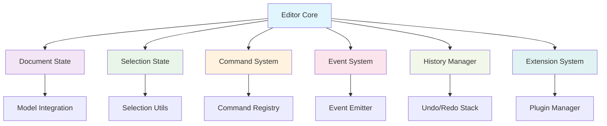

# Editor Core Specification

## 1. Overview

`editor-core` is the core package that manages all editor data and logic. It operates independently of UI and platform concerns, providing pure editor state management and a command system. It is designed so the same editor logic can be reused across React, DOM, or other platforms.

## 2. Design Goals

- **Platform independence**: pure logic that does not depend on UI frameworks
- **Centralized state**: manage all editor state centrally
- **Command system**: extensible command-based API
- **Event-driven**: notify changes via events
- **Extensibility**: add features through plugins and extensions
- **Testability**: pure functions and clear interfaces

## 3. Architecture

### 3.1 Overall Structure


### 3.2 Core Components

#### A. Document State
- All nodes and structure of the current document
- Integration with `@barocss/model`
- Detect document changes and emit events

#### B. Selection State
- Current cursor position and selection range
- Detect selection changes and emit events
- Validate selections

#### C. Command System
- Extensible command registration and execution
- Supports command chaining
- Hooks before and after command execution

#### D. Event System
- Emit state change events
- Notify external subscribers
- Event filtering and transformation

#### E. History Manager
- Manage Undo/Redo stacks
- Transaction-based history
- History limits and optimization

#### F. Extension System
- Register and manage plugins
- Manage dependencies between extensions
- Manage extension lifecycle

## 4. Key APIs

### 4.1 Editor Class

```typescript
export class Editor {
  // State access
  get document(): DocumentState;
  get selection(): SelectionState;
  get isFocused(): boolean;
  get isEditable(): boolean;
  
  // Command execution
  chain(): CommandChain;
  executeCommand(command: string, payload?: any): boolean;
  canExecuteCommand(command: string, payload?: any): boolean;
  
  // State changes
  setContent(content: DocumentState): void;
  updateSelection(selection: SelectionState): void;
  setEditable(editable: boolean): void;
  
  // Event management
  on(event: string, callback: Function): void;
  off(event: string, callback: Function): void;
  emit(event: string, data?: any): void;
  
  // Extension management
  use(extension: Extension): void;
  unuse(extension: Extension): void;
  
  // History
  undo(): void;
  redo(): void;
  canUndo(): boolean;
  canRedo(): boolean;
  
  // Lifecycle
  destroy(): void;
}

interface EditorOptions {
  content?: DocumentState;
  extensions?: Extension[];
  editable?: boolean;
  history?: HistoryOptions;
  model?: ModelOptions;
}
```

### 4.2 Document State

```typescript
export interface DocumentState {
  type: 'document';
  content: Node[];
  version: number;
  createdAt: Date;
  updatedAt: Date;
}

export interface Node {
  id: string;
  type: string;
  attributes?: Record<string, any>;
  content?: Node[];
  text?: string;
  marks?: Mark[];
}

export interface Mark {
  type: string;
  attributes?: Record<string, any>;
  range?: [number, number];
}
```

### 4.3 Selection State

```typescript
export interface SelectionState {
  anchor: number;        // selection start
  head: number;          // selection end
  empty: boolean;        // whether selection is empty
  from: number;          // min(anchor, head)
  to: number;            // max(anchor, head)
  ranges: SelectionRange[]; // multi-selection support
}

export interface SelectionRange {
  anchor: number;
  head: number;
  from: number;
  to: number;
}
```

### 4.4 Command System

```typescript
export interface Command {
  name: string;
  execute: (editor: Editor, payload?: any) => boolean;
  canExecute?: (editor: Editor, payload?: any) => boolean;
  before?: (editor: Editor, payload?: any) => void;
  after?: (editor: Editor, payload?: any) => void;
}

export class CommandChain {
  private editor: Editor;
  private commands: Array<{ command: string; payload?: any }> = [];
  
  constructor(editor: Editor);
  
  // Add commands
  insertText(text: string): CommandChain;
  deleteSelection(): CommandChain;
  toggleBold(): CommandChain;
  toggleItalic(): CommandChain;
  setHeading(level: number): CommandChain;
  insertParagraph(): CommandChain;
  focus(): CommandChain;
  
  // Execute
  run(): boolean;
  canRun(): boolean;
}
```

### 4.5 Extension System

```typescript
export interface Extension {
  name: string;
  priority?: number;
  dependencies?: string[];
  
  // Lifecycle
  onBeforeCreate?(editor: Editor): void;
  onCreate?(editor: Editor): void;
  onDestroy?(editor: Editor): void;
  
  // Command registration
  commands?: Command[];
  
  // Event handling
  onTransaction?(editor: Editor, transaction: Transaction): void;
  onSelectionChange?(editor: Editor, selection: SelectionState): void;
  onContentChange?(editor: Editor, content: DocumentState): void;
  
  // State extension
  addState?: (editor: Editor) => any;
  addStorage?: (editor: Editor) => any;
}

// Basic extensions
export class BoldExtension implements Extension {
  name = 'bold';
  commands = [
    {
      name: 'toggleBold',
      execute: (editor: Editor) => {
        // Bold toggle logic
        return true;
      }
    }
  ];
}

export class ItalicExtension implements Extension {
  name = 'italic';
  commands = [
    {
      name: 'toggleItalic',
      execute: (editor: Editor) => {
        // Italic toggle logic
        return true;
      }
    }
  ];
}
```

## 5. Event System

### 5.1 Event Types

```typescript
export interface EditorEvents {
  // Document events
  'contentChange': { content: DocumentState; transaction: Transaction };
  'nodeCreate': { node: Node; position: number };
  'nodeUpdate': { node: Node; oldNode: Node };
  'nodeDelete': { node: Node; position: number };
  
  // Selection events
  'selectionChange': { selection: SelectionState; oldSelection: SelectionState };
  'focus': { selection: SelectionState };
  'blur': { selection: SelectionState };
  
  // Command events
  'commandExecute': { command: string; payload?: any; success: boolean };
  'commandBefore': { command: string; payload?: any };
  'commandAfter': { command: string; payload?: any; success: boolean };
  
  // History events
  'historyChange': { canUndo: boolean; canRedo: boolean };
  'undo': { transaction: Transaction };
  'redo': { transaction: Transaction };
  
  // Extension events
  'extensionAdd': { extension: Extension };
  'extensionRemove': { extension: Extension };
  
  // Lifecycle events
  'create': { editor: Editor };
  'destroy': { editor: Editor };
}
```

### 5.2 Event Usage Examples

```typescript
const editor = new Editor({
  content: initialContent,
  extensions: [BoldExtension, ItalicExtension]
});

// Detect content changes
editor.on('contentChange', ({ content, transaction }) => {
  console.log('Document changed:', content);
  // Auto-save, real-time collaboration, etc.
});

// Detect selection changes
editor.on('selectionChange', ({ selection, oldSelection }) => {
  console.log('Selection changed:', selection);
  // Update toolbar state, show bubble menu, etc.
});

// Detect command execution
editor.on('commandExecute', ({ command, payload, success }) => {
  if (success) {
    console.log(`Command ${command} executed successfully`);
  }
});
```

## 6. Model Integration

### 6.1 Model Integration

```typescript
export class Editor {
  private model: Model;
  private transactionManager: TransactionManager;
  
  constructor(options: EditorOptions) {
    // Initialize Model
    this.model = new Model(options.model);
    this.transactionManager = new TransactionManager(this.model);
    
    // Subscribe to Model events
    this.setupModelEventHandling();
  }
  
  private setupModelEventHandling(): void {
    this.transactionManager.on('transaction_commit', (event) => {
      // Convert Model changes to Editor events
      this.emit('contentChange', {
        content: this.model.getDocument(),
        transaction: event.transaction
      });
    });
  }
  
  // Execute transaction
  executeTransaction(transaction: Transaction): void {
    this.transactionManager.execute(transaction);
  }
}
```

### 6.2 Document Synchronization

```typescript
export class Editor {
  // Get Document from Model
  get document(): DocumentState {
    return this.model.getDocument();
  }
  
  // Set Document
  setContent(content: DocumentState): void {
    const transaction = this.model.createTransaction();
    transaction.replaceDocument(content);
    this.executeTransaction(transaction);
  }
  
  // Partial update
  updateNode(nodeId: string, updates: Partial<Node>): void {
    const transaction = this.model.createTransaction();
    transaction.updateNode(nodeId, updates);
    this.executeTransaction(transaction);
  }
}
```

## 7. Usage Examples

### 7.1 Basic Usage

```typescript
import { Editor } from '@barocss/editor-core';
import { BoldExtension, ItalicExtension } from '@barocss/editor-core/extensions';

// Create editor
const editor = new Editor({
  content: {
    type: 'document',
    content: [
      {
        id: 'p1',
        type: 'paragraph',
        content: [
          {
            id: 't1',
            type: 'text',
            text: 'Hello World'
          }
        ]
      }
    ]
  },
  extensions: [BoldExtension, ItalicExtension],
  editable: true
});

// Subscribe to events
editor.on('contentChange', ({ content }) => {
  console.log('Document changed:', content);
});

// Execute commands
editor.chain()
  .focus()
  .insertText('Hello ')
  .toggleBold()
  .insertText('World')
  .run();

// Check state
console.log('Current document:', editor.document);
console.log('Current selection:', editor.selection);
console.log('Focus state:', editor.isFocused);
```

### 7.2 Extension Development

```typescript
// Custom extension development
export class LinkExtension implements Extension {
  name = 'link';
  
  commands = [
    {
      name: 'setLink',
      execute: (editor: Editor, payload: { url: string }) => {
        const { url } = payload;
        const { selection } = editor;
        
        if (selection.empty) {
          return false;
        }
        
        // Link application logic
        const transaction = editor.model.createTransaction();
        transaction.addMark(selection.from, selection.to, {
          type: 'link',
          attributes: { href: url }
        });
        
        editor.executeTransaction(transaction);
        return true;
      },
      canExecute: (editor: Editor, payload: { url: string }) => {
        return !editor.selection.empty && payload.url;
      }
    }
  ];
  
  onCreate(editor: Editor): void {
    // Extension initialization
    console.log('LinkExtension initialized');
  }
}

// Using extension
const editor = new Editor({
  extensions: [BoldExtension, ItalicExtension, LinkExtension]
});

// Set link
editor.executeCommand('setLink', { url: 'https://example.com' });
```

### 7.3 Platform-specific Wrappers

```typescript
// DOM platform wrapper
export class DOMEditorWrapper {
  private editor: Editor;
  private element: HTMLElement;
  
  constructor(element: HTMLElement, options: EditorOptions) {
    this.editor = new Editor(options);
    this.element = element;
    
    this.setupDOMIntegration();
  }
  
  private setupDOMIntegration(): void {
    // Convert DOM events to Editor commands
    this.element.addEventListener('input', (e) => {
      const transaction = this.createTransactionFromInput(e);
      this.editor.executeTransaction(transaction);
    });
    
    // Convert Editor events to DOM updates
    this.editor.on('contentChange', ({ content }) => {
      this.renderContent(content);
    });
  }
}

// React platform wrapper
export function useEditor(options: EditorOptions) {
  const [editor] = useState(() => new Editor(options));
  const [document, setDocument] = useState(editor.document);
  const [selection, setSelection] = useState(editor.selection);
  
  useEffect(() => {
    const handleContentChange = ({ content }: { content: DocumentState }) => {
      setDocument(content);
    };
    
    const handleSelectionChange = ({ selection }: { selection: SelectionState }) => {
      setSelection(selection);
    };
    
    editor.on('contentChange', handleContentChange);
    editor.on('selectionChange', handleSelectionChange);
    
    return () => {
      editor.off('contentChange', handleContentChange);
      editor.off('selectionChange', handleSelectionChange);
    };
  }, [editor]);
  
  return { editor, document, selection };
}
```

## 8. Performance Optimization

### 8.1 Batch Updates

```typescript
export class Editor {
  private updateQueue: Array<() => void> = [];
  private isUpdating = false;
  
  private scheduleUpdate(update: () => void): void {
    this.updateQueue.push(update);
    
    if (!this.isUpdating) {
      this.isUpdating = true;
      requestAnimationFrame(() => {
        this.flushUpdates();
      });
    }
  }
  
  private flushUpdates(): void {
    while (this.updateQueue.length > 0) {
      const update = this.updateQueue.shift();
      update?.();
    }
    this.isUpdating = false;
  }
}
```

### 8.2 Memoization

```typescript
export class Editor {
  private selectionCache = new Map<string, SelectionState>();
  private documentCache = new Map<string, DocumentState>();
  
  get selection(): SelectionState {
    const key = this.getSelectionKey();
    if (!this.selectionCache.has(key)) {
      this.selectionCache.set(key, this.calculateSelection());
    }
    return this.selectionCache.get(key)!;
  }
  
  private getSelectionKey(): string {
    return `${this.model.getSelection().anchor}-${this.model.getSelection().head}`;
  }
}
```

## 9. Test Strategy

### 9.1 Unit Tests

```typescript
describe('Editor', () => {
  let editor: Editor;
  
  beforeEach(() => {
    editor = new Editor({
      content: {
        type: 'document',
        content: [
          {
            id: 'p1',
            type: 'paragraph',
            content: [{ id: 't1', type: 'text', text: 'Hello' }]
          }
        ]
      },
      extensions: [BoldExtension]
    });
  });
  
  it('sets document content correctly', () => {
    const newContent = {
      type: 'document',
      content: [
        {
          id: 'p2',
          type: 'paragraph',
          content: [{ id: 't2', type: 'text', text: 'World' }]
        }
      ]
    };
    
    editor.setContent(newContent);
    expect(editor.document).toEqual(newContent);
  });
  
  it('executes commands correctly', () => {
    const result = editor.executeCommand('toggleBold');
    expect(result).toBe(true);
  });
  
  it('emits events correctly', () => {
    const callback = jest.fn();
    editor.on('contentChange', callback);
    
    editor.setContent(newContent);
    expect(callback).toHaveBeenCalledWith({
      content: newContent,
      transaction: expect.any(Object)
    });
  });
});
```

### 9.2 Integration Tests

```typescript
describe('Editor Integration', () => {
  it('handles full workflow correctly', () => {
    const editor = new Editor({
      extensions: [BoldExtension, ItalicExtension]
    });
    
    // 1. Insert text
    editor.chain().insertText('Hello ').run();
    
    // 2. Apply Bold
    editor.chain().toggleBold().run();
    
    // 3. Insert additional text
    editor.chain().insertText('World').run();
    
    // 4. Verify result
    const document = editor.document;
    expect(document.content[0].content[0].marks).toContainEqual({
      type: 'bold',
      range: [0, 6]
    });
  });
});
```

## 10. Extensibility

### 10.1 Plugin Architecture

```typescript
export interface Plugin {
  name: string;
  version: string;
  dependencies?: string[];
  
  install(editor: Editor): void;
  uninstall?(editor: Editor): void;
}

export class PluginManager {
  private plugins = new Map<string, Plugin>();
  private editor: Editor;
  
  constructor(editor: Editor) {
    this.editor = editor;
  }
  
  install(plugin: Plugin): void {
    if (this.plugins.has(plugin.name)) {
      throw new Error(`Plugin ${plugin.name} is already installed`);
    }
    
    // Check dependencies
    this.checkDependencies(plugin);
    
    // Install plugin
    plugin.install(this.editor);
    this.plugins.set(plugin.name, plugin);
  }
  
  private checkDependencies(plugin: Plugin): void {
    if (plugin.dependencies) {
      for (const dep of plugin.dependencies) {
        if (!this.plugins.has(dep)) {
          throw new Error(`Plugin ${plugin.name} requires ${dep} to be installed first`);
        }
      }
    }
  }
}
```

### 10.2 Custom Commands

```typescript
export class CustomCommandExtension implements Extension {
  name = 'customCommands';
  
  commands = [
    {
      name: 'insertEmoji',
      execute: (editor: Editor, payload: { emoji: string }) => {
        const { emoji } = payload;
        editor.chain().insertText(emoji).run();
        return true;
      }
    },
    {
      name: 'duplicateLine',
      execute: (editor: Editor) => {
        const { selection } = editor;
        const lineText = this.getLineText(editor, selection.from);
        editor.chain().insertText('\n' + lineText).run();
        return true;
      }
    }
  ];
  
  private getLineText(editor: Editor, position: number): string {
    // Line text extraction logic
    return '';
  }
}
```

## 11. Error Handling

### 11.1 Command Execution Errors

```typescript
export class Editor {
  executeCommand(command: string, payload?: any): boolean {
    try {
      const commandDef = this.commandRegistry.get(command);
      if (!commandDef) {
        console.warn(`Command ${command} not found`);
        return false;
      }
      
      if (commandDef.canExecute && !commandDef.canExecute(this, payload)) {
        return false;
      }
      
      commandDef.before?.(this, payload);
      const result = commandDef.execute(this, payload);
      commandDef.after?.(this, payload);
      
      return result;
    } catch (error) {
      console.error(`Error executing command ${command}:`, error);
      this.emit('commandError', { command, payload, error });
      return false;
    }
  }
}
```

### 11.2 Extension Errors

```typescript
export class Editor {
  use(extension: Extension): void {
    try {
      extension.onBeforeCreate?.(this);
      this.registerExtension(extension);
      extension.onCreate?.(this);
      this.emit('extensionAdd', { extension });
    } catch (error) {
      console.error(`Error installing extension ${extension.name}:`, error);
      throw error;
    }
  }
}
```

## 12. Migration Guide

### 12.1 Migration from Existing Editor

```typescript
// Existing approach (monolithic editor)
const editor = new EditorViewDOM(container, {
  schema: mySchema,
  model: myModel,
  store: myStore
});

// New approach (separated architecture)
const editor = new Editor({
  content: myContent,
  extensions: [BoldExtension, ItalicExtension]
});

const domEditor = new DOMEditor({
  core: editor,
  element: container,
  rendererRegistry: myRegistry,
  transactionManager: myTransactionManager
});
```

## 13. Milestones

1. **Core Editor class**: implement core state management and API
2. **Command system**: extensible command registration and execution
3. **Event system**: emit and subscribe to state change events
4. **Extension system**: plugin architecture and basic extensions
5. **Model integration**: full integration with @barocss/model
6. **History management**: implement Undo/Redo
7. **Performance optimization**: batch updates and memoization
8. **Test completeness**: unit and integration tests
9. **Documentation**: API docs and usage guides
10. **Plugin ecosystem**: basic plugin library
