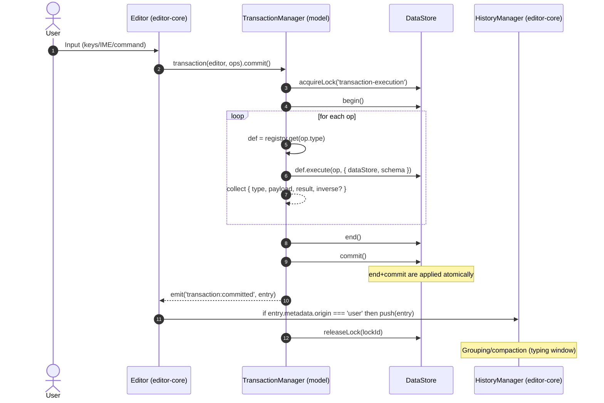
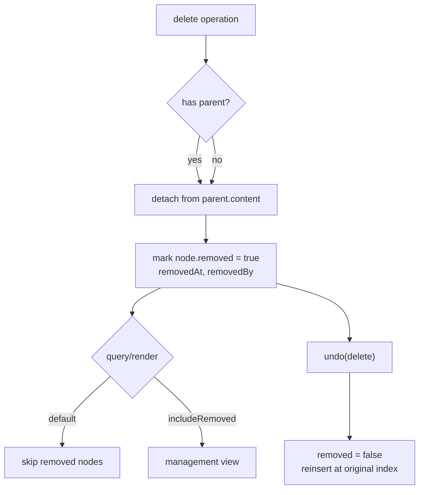

# History Management System Specification

## Overview

History 시스템은 Barocss Editor에서 사용자의 작업을 추적하고 Undo/Redo 기능을 제공합니다. 본 문서는 DSL 우선 아키텍처(transaction(editor, ops).commit())와 TransactionManager.execute() 흐름에 맞춘 책임 분리와 데이터 포맷을 정의합니다.

## Core Concepts

### 1. Ownership & Architecture

```
User Action → Transaction(DSL) → TransactionManager.execute → HistoryManager.push
                                   │                         (editor-core)
                         DataStore(begin/commit/rollback)
```

- HistoryManager 소유: editor-core
- Model(TransactionManager)은 commit 직후 HistoryEntry 생성을 위한 훅/이벤트만 노출
- DataStore는 락/오버레이/커밋 일관성을 제공. History 데이터 소스는 TransactionManager 결과

### 2. History Entry Types

#### Snapshot History
- 전체 문서 상태를 스냅샷으로 저장
- 정확한 복원이 가능하지만 메모리 사용량이 큼

#### Delta History
- 변경사항만 저장하는 델타 방식
- 메모리 효율적이지만 복원 시 계산 필요

#### Hybrid History
- 중요한 지점은 스냅샷, 그 사이는 델타
- 메모리와 성능의 균형

### 3. History Granularity

```typescript
enum HistoryGranularity {
  CHARACTER = 'character',    // 문자 단위
  WORD = 'word',            // 단어 단위
  SENTENCE = 'sentence',    // 문장 단위
  PARAGRAPH = 'paragraph',  // 문단 단위
  TRANSACTION = 'transaction' // 트랜잭션 단위
}
```

## API Design

### HistoryManager (editor-core)

```typescript
class HistoryManager {
  // 히스토리 관리
  pushHistory(entry: HistoryEntry): void;
  undo(): Promise<HistoryEntry | null>;
  redo(): Promise<HistoryEntry | null>;
  
  // 히스토리 조회
  getHistory(): HistoryEntry[];
  getHistoryAt(index: number): HistoryEntry | null;
  getCurrentIndex(): number;
  
  // 히스토리 제어
  clearHistory(): void;
  clearRedoHistory(): void;
  setMaxHistorySize(size: number): void;
  
  // 상태 확인
  canUndo(): boolean;
  canRedo(): boolean;
  getHistorySize(): number;
}
```

### HistoryEntry (TransactionManager 결과 정규화)

```typescript
interface HistoryEntry {
  id: string;                     // history entry id
  transactionId: string;          // TransactionManager가 부여한 id
  startedAt: number;              // ms
  endedAt: number;                // ms
  durationMs: number;
  success: boolean;
  description?: string;

  // Transaction operations 원본 및 결과(순서 보존)
  operations: Array<{
    type: string;
    payload?: Record<string, any>;
    result: any;                  // defineOperation.execute 반환값
    inverse?: any;                // optional: 역연산 데이터(있으면 undo에 사용)
  }>;

  // 선택 상태 (있을 때)
  selectionBefore?: DocumentSelection;
  selectionAfter?: DocumentSelection;

  // 환경/호환성 정보
  schemaVersion?: string;         // @barocss/schema 기준
  dataStoreVersion?: string;
  editorVersion?: string;

  // 메타
  metadata?: {
    userId?: string;
    groupKey?: string;            // 입력 병합 그룹핑 키
    origin?: 'user' | 'remote' | 'system'; // 트랜잭션 출처
  };
}

interface DocumentSnapshot {
  documentId: string;
  content: INode[];
  metadata: DocumentMetadata;
  version: number;
}

interface HistoryDelta {
  operations: DeltaOperation[];
  baseVersion: number;
  targetVersion: number;
}

interface HistoryCommand {
  commandType: string;
  parameters: Record<string, any>;
  result: any;
}
```

## Delta Operations

### 1. Delta Operation Types

```typescript
interface DeltaOperation {
  type: 'insert' | 'delete' | 'update' | 'move';
  path: string;           // 노드 경로 (예: "0.1.2")
  data?: any;            // 삽입/업데이트할 데이터
  oldData?: any;         // 이전 데이터 (업데이트/삭제 시)
  position?: number;     // 삽입/이동 위치
}

// 예시 델타 연산들
const insertOperation: DeltaOperation = {
  type: 'insert',
  path: '0.1',
  data: { type: 'text', text: 'Hello' },
  position: 0
};

const deleteOperation: DeltaOperation = {
  type: 'delete',
  path: '0.1.2',
  oldData: { type: 'text', text: 'World' }
};

const updateOperation: DeltaOperation = {
  type: 'update',
  path: '0.1.2',
  data: { text: 'Updated' },
  oldData: { text: 'Original' }
};
```

### 2. Delta Compression

```typescript
interface DeltaCompression {
  // 연속된 동일 타입 연산 병합
  mergeOperations(operations: DeltaOperation[]): DeltaOperation[];
  
  // 중복 데이터 제거
  deduplicateData(delta: HistoryDelta): HistoryDelta;
  
  // 압축 알고리즘 적용
  compress(delta: HistoryDelta): CompressedDelta;
  decompress(compressed: CompressedDelta): HistoryDelta;
}
```

## Snapshot Management

### 1. Snapshot Strategy

```typescript
interface SnapshotStrategy {
  // 스냅샷 생성 주기
  interval: 'every_n_operations' | 'time_based' | 'size_based';
  threshold: number;
  
  // 스냅샷 압축
  compression: 'none' | 'gzip' | 'lz4' | 'custom';
  
  // 스냅샷 정리
  cleanup: {
    maxSnapshots: number;
    retentionPeriod: number; // days
  };
}
```

### 2. Incremental Snapshots

```typescript
class IncrementalSnapshotManager {
  // 기본 스냅샷 생성
  createBaseSnapshot(document: Document): DocumentSnapshot;
  
  // 증분 스냅샷 생성
  createIncrementalSnapshot(
    baseSnapshot: DocumentSnapshot,
    changes: DeltaOperation[]
  ): DocumentSnapshot;
  
  // 스냅샷 복원
  restoreSnapshot(snapshot: DocumentSnapshot): Document;
}
```

## Command Pattern Integration

### 1. Command Interface

```typescript
interface Command {
  execute(): Promise<CommandResult>;
  undo(): Promise<CommandResult>;
  redo(): Promise<CommandResult>;
  
  canExecute(): boolean;
  canUndo(): boolean;
  canRedo(): boolean;
}

interface CommandResult {
  success: boolean;
  data?: any;
  error?: string;
}
```

### 2. Command History

```typescript
class CommandHistoryManager {
  // 명령 실행
  executeCommand(command: Command): Promise<CommandResult>;
  
  // 명령 히스토리
  getCommandHistory(): Command[];
  getUndoableCommands(): Command[];
  getRedoableCommands(): Command[];
  
  // 명령 그룹핑
  groupCommands(commands: Command[]): CommandGroup;
  executeCommandGroup(group: CommandGroup): Promise<CommandResult>;
}
```

## Performance Optimization

### 1. Memory Management

```typescript
interface MemoryManagement {
  // 히스토리 크기 제한
  maxHistorySize: number;
  maxMemoryUsage: number; // MB
  
  // 압축 전략
  compressionStrategy: 'immediate' | 'lazy' | 'background';
  
  // 가비지 컬렉션
  garbageCollection: {
    enabled: boolean;
    interval: number; // ms
    threshold: number; // memory usage %
  };
}
```

### 2. Lazy Loading

```typescript
class LazyHistoryManager {
  // 지연 로딩
  loadHistoryEntry(id: string): Promise<HistoryEntry>;
  preloadHistoryEntries(ids: string[]): Promise<void>;
  
  // 캐싱
  cacheHistoryEntry(entry: HistoryEntry): void;
  getCachedEntry(id: string): HistoryEntry | null;
  
  // 백그라운드 처리
  processHistoryInBackground(): void;
}
```

## Integration Points

### 1. Transaction Integration (model → editor-core)

```typescript
// model/TransactionManager 내부 개요
async execute(ops) {
  const startedAt = Date.now();
  try {
    // lock → begin → execute ops → end → commit
    const executed = await runAll(ops);
    const endedAt = Date.now();
    emit('transaction:committed', {
      transactionId: currentId,
      startedAt,
      endedAt,
      durationMs: endedAt - startedAt,
      success: true,
      operations: executed, // [{ type, payload, result, inverse? }]
      selectionBefore: maybeSelectionBefore,
      selectionAfter: maybeSelectionAfter,
      schemaVersion: schema?.name,
      origin: 'user' | 'remote' | 'system', // REQUIRED: 호출 측에서 지정
    } satisfies HistoryEntry);
    return ok;
  } catch (e) {
    const endedAt = Date.now();
    emit('transaction:committed', {
      transactionId: currentId,
      startedAt,
      endedAt,
      durationMs: endedAt - startedAt,
      success: false,
      operations: ops.map(o => ({ type: o.type, payload: o.payload, result: null })),
      origin: 'user' | 'remote' | 'system',
    } satisfies HistoryEntry);
    return fail;
  } finally {
    // release lock
  }
}
```

### 2. Selection Integration

```typescript
interface HistoryWithSelection extends HistoryEntry {
  // 선택 상태 저장
  selection: DocumentSelection;
  
  // 선택 상태 복원
  restoreSelection(): void;
}
```

### 3. Schema Integration
## Deletion/Tombstone Policy

### 1. 소프트 삭제 원칙
- 삭제는 물리 삭제가 아니라 "detach + tombstone"으로 처리한다.
  - detach: 부모 `content`에서 노드 ID를 제거하여 논리 트리에서 분리
  - tombstone: 노드 객체는 DataStore에 남기고 `removed=true`, `removedAt`, `removedBy` 메타를 기록
- 물리 삭제는 GC 정책에 따라 별도 시점에 수행(오래된 tombstone 정리)

노드 상태 필드
- `removed: boolean` (기본 false)
- `removedAt?: number`
- `removedBy?: string`

### 2. DataStore/조회 규칙
- 기본 조회: `removed=false` 노드만 반환하고 트리 순회/검증/렌더에 참여
- 관리/복원용 조회: `includeRemoved=true` 옵션으로 tombstone 포함 접근 허용
- API 예: `getNode(id)`(기본), `getNodeIncludingRemoved(id)`(옵션)
 - content 조작/탐색: 항상 `removed=false` 집합만 대상으로 동작

### 3. Operation/Undo 연계
- delete operation 실행 시:
  - 원래 `parentId`, `siblingIndex`(혹은 content index)를 inverse 데이터로 보존
  - parent.content에서 detach + 대상 노드에 `removed=true` 설정
- undo(delete):
  - `removed=false`로 복구 후 parent.content의 원래 index로 재삽입
  - 필요 시 sibling 재정렬/검증

inverse 최소 스키마 예시
```ts
type DeleteInverse = {
  nodeId: string;
  parentId: string;
  index: number;
  // 선택적: 복원 정확도 향상을 위한 힌트
  prevSiblingId?: string;
  nextSiblingId?: string;
};
```

### 4. 렌더링/선택
- 렌더러: `removed=true` 노드는 스킵
- Selection remap: 대상이 tombstone이면 가장 가까운 유효 노드로 이동(앞/뒤 우선순위 규칙 명시)

선택 리맵 규칙(권장)
- 캐럿(단일 지점): 먼저 다음 유효 텍스트 노드 → 없으면 이전 유효 텍스트 노드
- 범위: start/end 각각 위 규칙 적용; 결과가 동일 노드가 되면 정상화

### 5. 동기화/충돌
- tombstone 유지로 원격 복원/중복 삭제 충돌 완화
- 정책: `removedAt` 비교, 최근 기록 우선 또는 서버 권위 정책 등 선택 가능
 - OT/CRDT: tombstone은 캐주얼티 추적에 유리. 복원 시점/승자 정책을 명확화

### 6. GC 정책(옵션)
- 기준: 경과 시간, 히스토리 확정 여부(redo 불가), 외부 동기화 커밋 여부
- 수행: 백그라운드에서 tombstone 물리 삭제 및 인덱스/캐시 정리

GC 의사코드
```ts
for (const node of allNodesIncludingRemoved()) {
  if (!node.removed) continue;
  if (!historyManager.canRedoNode(node.sid) && isOlderThan(node.removedAt, policy.retentionMs) && sync.isCommitted(node.sid)) {
    dataStore.physicallyDelete(node.sid);
  }
}
```

### 7. 스키마/검증
- `removed=true` 노드는 구조 검증 대상에서 제외(또는 별도 규칙 적용)
- validate 시 옵션 `includeRemoved=false` 기본값

### 8. API 영향 요약
- `getNode(id)` → removed 제외 (기본)
- `getNodeIncludingRemoved(id)` → tombstone 포함(내부/관리용)
- `listChildren(parentId)` → removed 제외
- `listChildrenIncludingRemoved(parentId)` → tombstone 포함


```typescript
class SchemaAwareHistory {
  // 스키마 변경 감지
  onSchemaChange(oldSchema: Schema, newSchema: Schema): void;
  
  // 스키마 호환성 검사
  validateHistoryCompatibility(entry: HistoryEntry): boolean;
  
  // 스키마 마이그레이션
  migrateHistoryEntry(entry: HistoryEntry, targetSchema: Schema): HistoryEntry;
}
```

## Advanced Features

### 1. Collaborative History

```typescript
interface CollaborativeHistory {
  // 사용자별 히스토리 분리
  userHistories: Map<string, HistoryEntry[]>;
  
  // 충돌 해결
  resolveConflicts(conflicts: HistoryConflict[]): HistoryEntry[];
  
  // 실시간 동기화
  syncHistory(remoteHistory: HistoryEntry[]): void;
}
```

### 2. History Analytics

```typescript
interface HistoryAnalytics {
  // 사용 패턴 분석
  analyzeUsagePatterns(): UsagePattern[];
  
  // 성능 메트릭
  getPerformanceMetrics(): PerformanceMetrics;
  
  // 에러 분석
  analyzeErrors(): ErrorReport[];
}

interface UsagePattern {
  mostUsedCommands: string[];
  averageSessionLength: number;
  undoRedoFrequency: number;
  errorRate: number;
}
```

### 3. History Export/Import

```typescript
interface HistoryExport {
  // 히스토리 내보내기
  exportHistory(format: 'json' | 'xml' | 'binary'): string | Buffer;
  
  // 히스토리 가져오기
  importHistory(data: string | Buffer, format: 'json' | 'xml' | 'binary'): void;
  
  // 선택적 내보내기
  exportHistoryRange(startIndex: number, endIndex: number): HistoryEntry[];
}
```

## Testing Strategy

### 1. Unit Tests

- 개별 히스토리 엔트리 테스트
- 델타 연산 테스트
- 압축/압축 해제 테스트

### 2. Integration Tests

- Transaction과의 통합 테스트(락, 실패 롤백 포함)
- Selection과의 통합 테스트
- Schema와의 통합 테스트
 - Origin 필터링 테스트: origin = 'user'만 HistoryManager에 기록, 'remote'/'system'은 무시

### 3. Performance Tests

- 대용량 히스토리 처리 테스트
- 메모리 사용량 테스트
- Undo/Redo 성능 테스트

### 4. Stress Tests

- 동시 사용자 테스트
- 장시간 사용 테스트
- 메모리 부족 상황 테스트

## Configuration

```typescript
interface HistoryConfig {
  // 기본 설정
  maxHistorySize: number;
  snapshotInterval: number;
  compressionEnabled: boolean;
  
  // 성능 설정
  lazyLoading: boolean;
  backgroundProcessing: boolean;
  memoryThreshold: number;
  
  // 고급 설정
  collaborativeMode: boolean;
  analyticsEnabled: boolean;
  exportEnabled: boolean;
}
```

## Future Enhancements

### 1. AI-Powered History

- 사용자 패턴 학습
- 자동 히스토리 정리
- 스마트 Undo/Redo

### 2. Cloud History

- 클라우드 히스토리 동기화
- 오프라인 히스토리 캐싱
- 다중 디바이스 지원

### 3. Version Control Integration

- Git과의 통합
- 브랜치 기반 히스토리
- 머지 충돌 해결

## End-to-End Flow Diagram

```
┌────────────────────────────────────────────────────────────────────────────┐
│                              User Interaction                               │
└──────────────┬─────────────────────────────────────────────────────────────┘
               │ (keyboard/mouse IME, commands)
               ▼
        transaction(editor, ops).commit()
               │  (ops: [{ type, payload } ...])
               ▼
┌────────────────────────────────────────────────────────────────────────────┐
│                         Model: TransactionManager                           │
├────────────────────────────────────────────────────────────────────────────┤
│ 1) acquireLock('transaction-execution')                                     │
│ 2) _beginTransaction() → transactionId, startedAt                           │
│ 3) dataStore.begin()  (overlay start)                                       │
│ 4) for op in ops:                                                           │
│      - def = globalOperationRegistry.get(op.type)                           │
│      - result = await def.execute(op, { dataStore, schema })                │
│      - executed.push({ ...op, result, inverse? })                           │
│ 5) dataStore.end(); dataStore.commit(); endedAt                             │
│ 6) emit('transaction:committed', {                                          │
│      transactionId, startedAt, endedAt, durationMs, success: true,          │
│      operations: executed, selectionBefore?, selectionAfter?,               │
│      schemaVersion, metadata: { origin: 'user' | 'remote' | 'system' }      │
│    })                                                                       │
│ 7) releaseLock(lockId)                                                      │
└────────────────────────────────────────────────────────────────────────────┘
               │
               ▼
┌────────────────────────────────────────────────────────────────────────────┐
│                           editor-core: HistoryManager                       │
├────────────────────────────────────────────────────────────────────────────┤
│ on 'transaction:committed' → if metadata.origin === 'user' then push(entry) │
│ - grouping(compaction): merge typing within window (e.g., 500ms)            │
│ - keep redo stack only if no new user entries                               │
└────────────────────────────────────────────────────────────────────────────┘

Undo:
  - pop last HistoryEntry
  - for each operation in reverse: use inverse if provided, otherwise derive   
  - run as a new transaction (origin: 'system'), do not record to history      

Redo:
  - take from redo stack and reapply as new user transaction (optional policy)

Deletion/Tombstone path (within op.execute):
  - detach from parent.content, mark node.removed=true, set removedAt/removedBy
  - default queries/render skip removed nodes                                  
  - undo(delete): removed=false, reinsert at original index

Failure path:
  - on error: dataStore.rollback(); emit success:false entry (not recorded by  
    HistoryManager by default), release lock
```

### Mermaid (sequence)



### Mermaid (tombstone delete)


