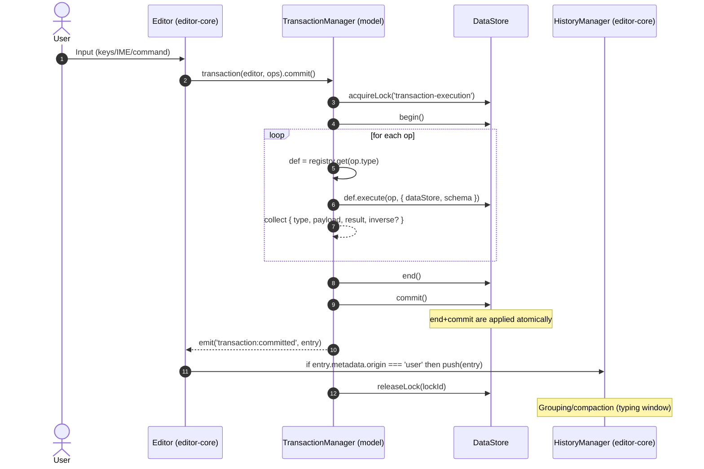
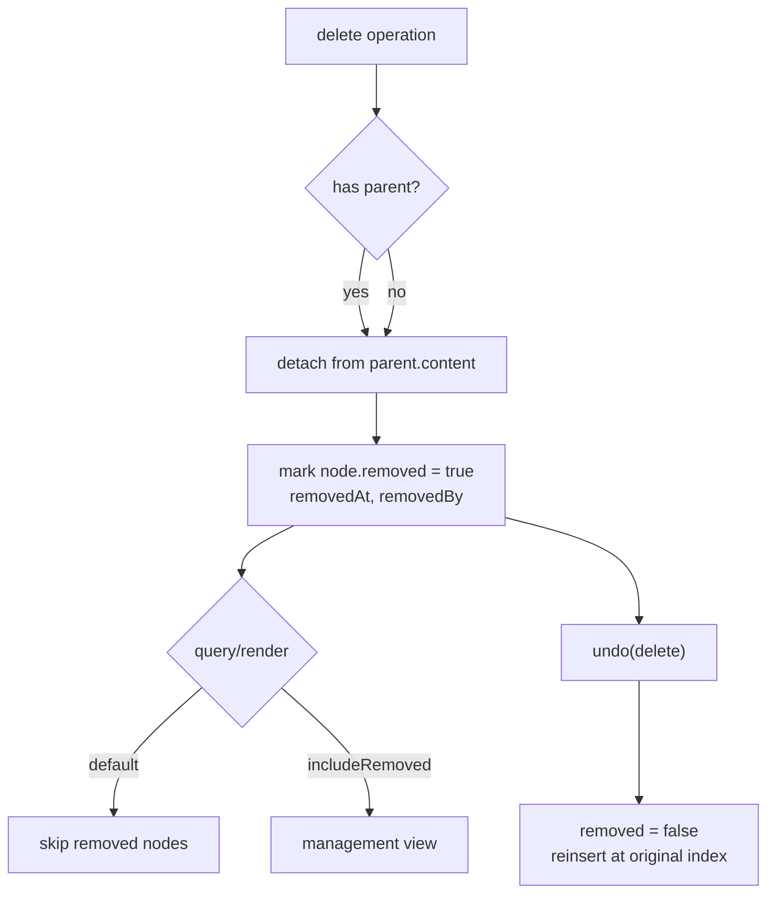

# History Management System Specification

## Overview

The History system tracks user actions in Barocss Editor and provides Undo/Redo. This document defines responsibility separation and data formats aligned with the DSL-first architecture (`transaction(editor, ops).commit()`) and the `TransactionManager.execute()` flow.

## Core Concepts

### 1. Ownership & Architecture

```
User Action → Transaction(DSL) → TransactionManager.execute → HistoryManager.push
                                   │                         (editor-core)
                         DataStore(begin/commit/rollback)
```

- HistoryManager ownership: `editor-core`
- Model (TransactionManager) exposes hooks/events only for HistoryEntry creation after commit
- DataStore provides lock/overlay/commit consistency. History data source is TransactionManager results

### 2. History Entry Types

#### Snapshot History
- Stores full document state as snapshots
- Enables accurate restore but uses more memory

#### Delta History
- Stores only changes (delta)
- Memory-efficient but requires computation on restore

#### Hybrid History
- Snapshots at important points, deltas in between
- Balances memory and performance

### 3. History Granularity

```typescript
enum HistoryGranularity {
  CHARACTER = 'character',    // character level
  WORD = 'word',            // word level
  SENTENCE = 'sentence',    // sentence level
  PARAGRAPH = 'paragraph',  // paragraph level
  TRANSACTION = 'transaction' // transaction level
}
```

## API Design

### HistoryManager (editor-core)

```typescript
class HistoryManager {
  // History management
  pushHistory(entry: HistoryEntry): void;
  undo(): Promise<HistoryEntry | null>;
  redo(): Promise<HistoryEntry | null>;
  
  // History query
  getHistory(): HistoryEntry[];
  getHistoryAt(index: number): HistoryEntry | null;
  getCurrentIndex(): number;
  
  // History control
  clearHistory(): void;
  clearRedoHistory(): void;
  setMaxHistorySize(size: number): void;
  
  // State check
  canUndo(): boolean;
  canRedo(): boolean;
  getHistorySize(): number;
}
```

### HistoryEntry (normalized TransactionManager result)

```typescript
interface HistoryEntry {
  id: string;                     // history entry id
  transactionId: string;          // id assigned by TransactionManager
  startedAt: number;              // ms
  endedAt: number;                // ms
  durationMs: number;
  success: boolean;
  description?: string;

  // Original transaction operations and results (order preserved)
  operations: Array<{
    type: string;
    payload?: Record<string, any>;
    result: any;                  // return value from defineOperation.execute
    inverse?: any;                // optional: inverse data (used for undo if present)
  }>;

  // Selection state (when present)
  selectionBefore?: DocumentSelection;
  selectionAfter?: DocumentSelection;

  // Environment/compatibility info
  schemaVersion?: string;         // based on @barocss/schema
  dataStoreVersion?: string;
  editorVersion?: string;

  // Metadata
  metadata?: {
    userId?: string;
    groupKey?: string;            // input merge grouping key
    origin?: 'user' | 'remote' | 'system'; // transaction source
  };
}

interface DocumentSnapshot {
  documentId: string;
  content: INode[];
  metadata: DocumentMetadata;
  version: number;
}

interface HistoryDelta {
  operations: DeltaOperation[];
  baseVersion: number;
  targetVersion: number;
}

interface HistoryCommand {
  commandType: string;
  parameters: Record<string, any>;
  result: any;
}
```

## Delta Operations

### 1. Delta Operation Types

```typescript
interface DeltaOperation {
  type: 'insert' | 'delete' | 'update' | 'move';
  path: string;           // node path (e.g., "0.1.2")
  data?: any;            // data to insert/update
  oldData?: any;         // previous data (for update/delete)
  position?: number;     // insert/move position
}

// Example delta operations
const insertOperation: DeltaOperation = {
  type: 'insert',
  path: '0.1',
  data: { type: 'text', text: 'Hello' },
  position: 0
};

const deleteOperation: DeltaOperation = {
  type: 'delete',
  path: '0.1.2',
  oldData: { type: 'text', text: 'World' }
};

const updateOperation: DeltaOperation = {
  type: 'update',
  path: '0.1.2',
  data: { text: 'Updated' },
  oldData: { text: 'Original' }
};
```

### 2. Delta Compression

```typescript
interface DeltaCompression {
  // Merge consecutive same-type operations
  mergeOperations(operations: DeltaOperation[]): DeltaOperation[];
  
  // Remove duplicate data
  deduplicateData(delta: HistoryDelta): HistoryDelta;
  
  // Apply compression algorithm
  compress(delta: HistoryDelta): CompressedDelta;
  decompress(compressed: CompressedDelta): HistoryDelta;
}
```

## Snapshot Management

### 1. Snapshot Strategy

```typescript
interface SnapshotStrategy {
  // Snapshot creation interval
  interval: 'every_n_operations' | 'time_based' | 'size_based';
  threshold: number;
  
  // Snapshot compression
  compression: 'none' | 'gzip' | 'lz4' | 'custom';
  
  // Snapshot cleanup
  cleanup: {
    maxSnapshots: number;
    retentionPeriod: number; // days
  };
}
```

### 2. Incremental Snapshots

```typescript
class IncrementalSnapshotManager {
  // Create base snapshot
  createBaseSnapshot(document: Document): DocumentSnapshot;
  
  // Create incremental snapshot
  createIncrementalSnapshot(
    baseSnapshot: DocumentSnapshot,
    changes: DeltaOperation[]
  ): DocumentSnapshot;
  
  // Restore snapshot
  restoreSnapshot(snapshot: DocumentSnapshot): Document;
}
```

## Command Pattern Integration

### 1. Command Interface

```typescript
interface Command {
  execute(): Promise<CommandResult>;
  undo(): Promise<CommandResult>;
  redo(): Promise<CommandResult>;
  
  canExecute(): boolean;
  canUndo(): boolean;
  canRedo(): boolean;
}

interface CommandResult {
  success: boolean;
  data?: any;
  error?: string;
}
```

### 2. Command History

```typescript
class CommandHistoryManager {
  // Execute command
  executeCommand(command: Command): Promise<CommandResult>;
  
  // Command history
  getCommandHistory(): Command[];
  getUndoableCommands(): Command[];
  getRedoableCommands(): Command[];
  
  // Command grouping
  groupCommands(commands: Command[]): CommandGroup;
  executeCommandGroup(group: CommandGroup): Promise<CommandResult>;
}
```

## Performance Optimization

### 1. Memory Management

```typescript
interface MemoryManagement {
  // History size limit
  maxHistorySize: number;
  maxMemoryUsage: number; // MB
  
  // Compression strategy
  compressionStrategy: 'immediate' | 'lazy' | 'background';
  
  // Garbage collection
  garbageCollection: {
    enabled: boolean;
    interval: number; // ms
    threshold: number; // memory usage %
  };
}
```

### 2. Lazy Loading

```typescript
class LazyHistoryManager {
  // Lazy loading
  loadHistoryEntry(id: string): Promise<HistoryEntry>;
  preloadHistoryEntries(ids: string[]): Promise<void>;
  
  // Caching
  cacheHistoryEntry(entry: HistoryEntry): void;
  getCachedEntry(id: string): HistoryEntry | null;
  
  // Background processing
  processHistoryInBackground(): void;
}
```

## Integration Points

### 1. Transaction Integration (model → editor-core)

```typescript
// Overview inside model/TransactionManager
async execute(ops) {
  const startedAt = Date.now();
  try {
    // lock → begin → execute ops → end → commit
    const executed = await runAll(ops);
    const endedAt = Date.now();
    emit('transaction:committed', {
      transactionId: currentId,
      startedAt,
      endedAt,
      durationMs: endedAt - startedAt,
      success: true,
      operations: executed, // [{ type, payload, result, inverse? }]
      selectionBefore: maybeSelectionBefore,
      selectionAfter: maybeSelectionAfter,
      schemaVersion: schema?.name,
      origin: 'user' | 'remote' | 'system', // REQUIRED: specified by caller
    } satisfies HistoryEntry);
    return ok;
  } catch (e) {
    const endedAt = Date.now();
    emit('transaction:committed', {
      transactionId: currentId,
      startedAt,
      endedAt,
      durationMs: endedAt - startedAt,
      success: false,
      operations: ops.map(o => ({ type: o.type, payload: o.payload, result: null })),
      origin: 'user' | 'remote' | 'system',
    } satisfies HistoryEntry);
    return fail;
  } finally {
    // release lock
  }
}
```

### 2. Selection Integration

```typescript
interface HistoryWithSelection extends HistoryEntry {
  // Store selection state
  selection: DocumentSelection;
  
  // Restore selection state
  restoreSelection(): void;
}
```

### 3. Schema Integration

## Deletion/Tombstone Policy

### 1. Soft Delete Principle
- Deletion is handled as "detach + tombstone", not physical deletion.
  - detach: remove node ID from parent `content` to detach from logical tree
  - tombstone: keep node object in DataStore and record `removed=true`, `removedAt`, `removedBy` metadata
- Physical deletion is performed separately per GC policy (cleanup of old tombstones)

Node state fields:
- `removed: boolean` (default false)
- `removedAt?: number`
- `removedBy?: string`

### 2. DataStore/Query Rules
- Default queries: return only `removed=false` nodes and participate in tree traversal/validation/rendering
- Management/restore queries: allow access including tombstones with `includeRemoved=true` option
- API example: `getNode(id)` (default), `getNodeIncludingRemoved(id)` (option)
- Content manipulation/traversal: always operates on `removed=false` set only

### 3. Operation/Undo Integration
- When delete operation executes:
  - Preserve original `parentId`, `siblingIndex` (or content index) in inverse data
  - Detach from parent.content + set `removed=true` on target node
- undo(delete):
  - Restore `removed=false` and reinsert at original index in parent.content
  - Reorder/validate siblings if needed

Inverse minimal schema example:
```ts
type DeleteInverse = {
  nodeId: string;
  parentId: string;
  index: number;
  // Optional: hints for improved restore accuracy
  prevSiblingId?: string;
  nextSiblingId?: string;
};
```

### 4. Rendering/Selection
- Renderer: skip `removed=true` nodes
- Selection remap: if target is a tombstone, move to nearest valid node (specify forward/backward priority rules)

Selection remap rules (recommended):
- Caret (single point): first try next valid text node → if none, previous valid text node
- Range: apply above rule to start/end each; normalize if result is the same node

### 5. Synchronization/Conflicts
- Tombstone retention mitigates remote restore/duplicate delete conflicts
- Policy: compare `removedAt`, prefer recent record or server authority policy, etc.
- OT/CRDT: tombstones help with causality tracking. Clarify restore timing/winner policy

### 6. GC Policy (optional)
- Criteria: elapsed time, history finalization (redo impossible), external sync commit status
- Execution: physically delete tombstones in background and clean up indices/caches

GC pseudocode:
```ts
for (const node of allNodesIncludingRemoved()) {
  if (!node.removed) continue;
  if (!historyManager.canRedoNode(node.sid) && isOlderThan(node.removedAt, policy.retentionMs) && sync.isCommitted(node.sid)) {
    dataStore.physicallyDelete(node.sid);
  }
}
```

### 7. Schema/Validation
- `removed=true` nodes are excluded from structure validation (or apply separate rules)
- Validation uses default `includeRemoved=false` option

### 8. API Impact Summary
- `getNode(id)` → excludes removed (default)
- `getNodeIncludingRemoved(id)` → includes tombstones (internal/management)
- `listChildren(parentId)` → excludes removed
- `listChildrenIncludingRemoved(parentId)` → includes tombstones

```typescript
class SchemaAwareHistory {
  // Detect schema changes
  onSchemaChange(oldSchema: Schema, newSchema: Schema): void;
  
  // Check schema compatibility
  validateHistoryCompatibility(entry: HistoryEntry): boolean;
  
  // Migrate history entry
  migrateHistoryEntry(entry: HistoryEntry, targetSchema: Schema): HistoryEntry;
}
```

## Advanced Features

### 1. Collaborative History

```typescript
interface CollaborativeHistory {
  // Separate history per user
  userHistories: Map<string, HistoryEntry[]>;
  
  // Conflict resolution
  resolveConflicts(conflicts: HistoryConflict[]): HistoryEntry[];
  
  // Real-time synchronization
  syncHistory(remoteHistory: HistoryEntry[]): void;
}
```

### 2. History Analytics

```typescript
interface HistoryAnalytics {
  // Analyze usage patterns
  analyzeUsagePatterns(): UsagePattern[];
  
  // Performance metrics
  getPerformanceMetrics(): PerformanceMetrics;
  
  // Error analysis
  analyzeErrors(): ErrorReport[];
}

interface UsagePattern {
  mostUsedCommands: string[];
  averageSessionLength: number;
  undoRedoFrequency: number;
  errorRate: number;
}
```

### 3. History Export/Import

```typescript
interface HistoryExport {
  // Export history
  exportHistory(format: 'json' | 'xml' | 'binary'): string | Buffer;
  
  // Import history
  importHistory(data: string | Buffer, format: 'json' | 'xml' | 'binary'): void;
  
  // Selective export
  exportHistoryRange(startIndex: number, endIndex: number): HistoryEntry[];
}
```

## Testing Strategy

### 1. Unit Tests
- Individual history entry tests
- Delta operation tests
- Compression/decompression tests

### 2. Integration Tests
- Integration with Transaction (including lock, failure rollback)
- Integration with Selection
- Integration with Schema
- Origin filtering tests: record only `origin = 'user'` in HistoryManager, ignore 'remote'/'system'

### 3. Performance Tests
- Large history processing tests
- Memory usage tests
- Undo/Redo performance tests

### 4. Stress Tests
- Concurrent user tests
- Long-duration usage tests
- Out-of-memory scenario tests

## Configuration

```typescript
interface HistoryConfig {
  // Basic settings
  maxHistorySize: number;
  snapshotInterval: number;
  compressionEnabled: boolean;
  
  // Performance settings
  lazyLoading: boolean;
  backgroundProcessing: boolean;
  memoryThreshold: number;
  
  // Advanced settings
  collaborativeMode: boolean;
  analyticsEnabled: boolean;
  exportEnabled: boolean;
}
```

## Future Enhancements

### 1. AI-Powered History
- Learn user patterns
- Automatic history cleanup
- Smart Undo/Redo

### 2. Cloud History
- Cloud history synchronization
- Offline history caching
- Multi-device support

### 3. Version Control Integration
- Git integration
- Branch-based history
- Merge conflict resolution

## End-to-End Flow Diagram

```
┌────────────────────────────────────────────────────────────────────────────┐
│                              User Interaction                               │
└──────────────┬─────────────────────────────────────────────────────────────┘
               │ (keyboard/mouse IME, commands)
               ▼
        transaction(editor, ops).commit()
               │  (ops: [{ type, payload } ...])
               ▼
┌────────────────────────────────────────────────────────────────────────────┐
│                         Model: TransactionManager                           │
├────────────────────────────────────────────────────────────────────────────┤
│ 1) acquireLock('transaction-execution')                                     │
│ 2) _beginTransaction() → transactionId, startedAt                           │
│ 3) dataStore.begin()  (overlay start)                                       │
│ 4) for op in ops:                                                           │
│      - def = globalOperationRegistry.get(op.type)                           │
│      - result = await def.execute(op, { dataStore, schema })                │
│      - executed.push({ ...op, result, inverse? })                           │
│ 5) dataStore.end(); dataStore.commit(); endedAt                             │
│ 6) emit('transaction:committed', {                                          │
│      transactionId, startedAt, endedAt, durationMs, success: true,          │
│      operations: executed, selectionBefore?, selectionAfter?,               │
│      schemaVersion, metadata: { origin: 'user' | 'remote' | 'system' }      │
│    })                                                                       │
│ 7) releaseLock(lockId)                                                      │
└────────────────────────────────────────────────────────────────────────────┘
               │
               ▼
┌────────────────────────────────────────────────────────────────────────────┐
│                           editor-core: HistoryManager                        │
├────────────────────────────────────────────────────────────────────────────┤
│ on 'transaction:committed' → if metadata.origin === 'user' then push(entry) │
│ - grouping(compaction): merge typing within window (e.g., 500ms)            │
│ - keep redo stack only if no new user entries                               │
└────────────────────────────────────────────────────────────────────────────┘

Undo:
  - pop last HistoryEntry
  - for each operation in reverse: use inverse if provided, otherwise derive   
  - run as a new transaction (origin: 'system'), do not record to history      

Redo:
  - take from redo stack and reapply as new user transaction (optional policy)

Deletion/Tombstone path (within op.execute):
  - detach from parent.content, mark node.removed=true, set removedAt/removedBy
  - default queries/render skip removed nodes                                  
  - undo(delete): removed=false, reinsert at original index

Failure path:
  - on error: dataStore.rollback(); emit success:false entry (not recorded by  
    HistoryManager by default), release lock
```

### Mermaid (sequence)



### Mermaid (tombstone delete)


