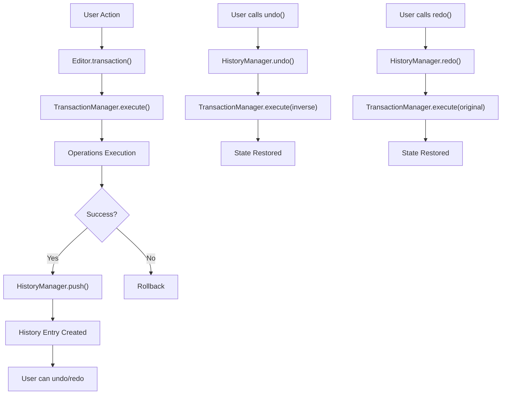

# History System Specification

## Overview

The History System in Barocss Editor tracks user editing actions and provides undo/redo. To support collaborative editing, the Checkpoint system was removed in favor of a simplified History system. This system is implemented via the `HistoryManager` and `Editor` classes in the `editor-core` package.

## Architecture

### Core Components

1. **HistoryManager** (`editor-core/src/history-manager.ts`)
   - Stores and manages history entries
   - Undo/redo logic
   - History size limits and dynamic adjustment
   - History compression and memory optimization
   - State validation and integrity

2. **Editor** (`editor-core/src/editor.ts`)
   - Manages HistoryManager instance
   - Provides History APIs
   - Integrates with TransactionManager

3. **TransactionManager** (`model/src/transaction.ts`)
   - Automatically adds successful transactions to HistoryManager
   - Collects and stores inverse operations

### Data Flow



## API Reference

### Editor History Methods

#### `undo(): Promise<boolean>`
Performs undo.

```typescript
const success = await editor.undo();
if (success) {
  console.log('Undo completed');
} else {
  console.log('No operation to undo');
}
```

#### `redo(): Promise<boolean>`
Performs redo.

```typescript
const success = await editor.redo();
if (success) {
  console.log('Redo completed');
} else {
  console.log('No operation to redo');
}
```

#### `canUndo(): boolean`
Checks if undo is possible.

```typescript
if (editor.canUndo()) {
  // Enable undo button
  undoButton.disabled = false;
}
```

#### `canRedo(): boolean`
Checks if redo is possible.

```typescript
if (editor.canRedo()) {
  // Enable redo button
  redoButton.disabled = false;
}
```


#### `getHistoryStats(): HistoryStats`
Returns history statistics.

```typescript
const stats = editor.getHistoryStats();
console.log(`Total entries: ${stats.totalEntries}`);
console.log(`Current index: ${stats.currentIndex}`);
console.log(`Can undo: ${stats.canUndo}`);
console.log(`Can redo: ${stats.canRedo}`);
```

#### `clearHistory(): void`
Clears history.

```typescript
editor.clearHistory();
console.log('History cleared');
```

#### `compressHistory(): void`
Compresses consecutive similar operations to optimize memory usage.

```typescript
// Compress after consecutive text operations
await editor.transaction([setText('node1', 'Hello')]).commit();
await editor.transaction([setText('node1', 'Hello World')]).commit();
await editor.transaction([setText('node1', 'Hello World!')]).commit();

editor.compressHistory(); // Compress 3 operations into 1
```

#### `resizeHistory(maxSize: number): void`
Dynamically adjusts history size.

```typescript
// Reduce history size to 50
editor.resizeHistory(50);
```

#### `getHistoryMemoryUsage(): number`
Returns current history memory usage in bytes.

```typescript
const memoryUsage = editor.getHistoryMemoryUsage();
console.log(`History memory usage: ${memoryUsage} bytes`);
```

#### `validateHistory(): { isValid: boolean; errors: string[] }`
Validates history integrity.

```typescript
const validation = editor.validateHistory();
if (!validation.isValid) {
  console.error('History integrity errors:', validation.errors);
}
```

### HistoryManager Configuration

#### EditorOptions

```typescript
interface HistoryManagerOptions {
  maxSize?: number;           // Maximum history size (default: 100)
}
```

#### Usage Example

```typescript
const editor = new Editor({
  history: {
    maxSize: 50           // Maximum 50 history entries
  }
});
```

## History Entry Structure

### HistoryEntry Interface

```typescript
interface HistoryEntry {
  id: string;                    // unique identifier
  timestamp: Date;               // creation time
  operations: TransactionOperation[];      // executed operations
  inverseOperations: TransactionOperation[]; // inverse operations
  description?: string;          // description (optional)
  metadata?: Record<string, any>; // additional metadata (optional)
}
```

### History Entry Creation Process

1. **Transaction execution**: call `TransactionManager.execute()`
2. **Operations execution**: call `execute()` for each operation
3. **Inverse collection**: collect `inverse` from each operation
4. **History entry creation**: call `HistoryManager.push()`
5. **Storage**: add to history array

## History Addition Rules

### Automatically Added

- When transaction completes successfully
- When at least one operation executed
- When undo/redo flag is not set

### Excluded Cases

```typescript
private _shouldAddToHistory(operations: TransactionOperation[]): boolean {
  // Empty operations are not added to history
  if (operations.length === 0) return false;
  
  // undo/redo operations are not added to history
  if (this._isUndoRedoOperation) return false;
  
  return true;
}
```

### Preventing Undo/Redo Duplication

Undo/redo actions are controlled via flags to prevent history addition:

```typescript
// In Editor's undo/redo methods
Editor.prototype.undo = async function(): Promise<boolean> {
  const entry = this._historyManager.undo();
  if (!entry) return false;

  try {
    // Set undo/redo flag
    this._transactionManager._isUndoRedoOperation = true;
    
    // Execute inverse operations
    const result = await this._transactionManager.execute(entry.inverseOperations);
    return result.success;
  } finally {
    // Clear flag
    this._transactionManager._isUndoRedoOperation = false;
  }
};
```


## Performance Considerations

### Memory Usage

- History entries store full operations and inverses
- `maxSize` limits memory usage
- Old entries are automatically deleted
- `compressHistory()` compresses consecutive similar operations
- `getHistoryMemoryUsage()` monitors memory usage

### Execution Performance

- History addition is asynchronous after transaction completion
- Undo/redo run as new transactions
- History compression optimizes memory usage
- Dynamic size adjustment allows runtime history size changes

### Optimization Features

#### History Compression
```typescript
// Compress consecutive text operations
editor.compressHistory();
```

#### Memory Monitoring
```typescript
const memoryUsage = editor.getHistoryMemoryUsage();
if (memoryUsage > 1024 * 1024) { // Exceeds 1MB
  editor.resizeHistory(50); // Reduce size
}
```

#### State Validation
```typescript
const validation = editor.validateHistory();
if (!validation.isValid) {
  console.warn('History integrity issues:', validation.errors);
}
```

## Error Handling

### Undo/Redo Failure

```typescript
try {
  const success = await editor.undo();
  if (!success) {
    console.log('No operation to undo');
  }
} catch (error) {
  console.error('Error during undo:', error);
}
```


## Testing

### Unit Tests

```typescript
describe('History System', () => {
  let editor: Editor;

  beforeEach(() => {
    editor = new Editor({
      history: { maxSize: 5 }
    });
  });

  it('should undo/redo operations', async () => {
    // Execute transaction
    await editor.transaction([
      create(textNode('paragraph', 'Hello'))
    ]).commit();

    expect(editor.canUndo()).toBe(true);
    
    // Undo
    const undone = await editor.undo();
    expect(undone).toBe(true);
    expect(editor.canRedo()).toBe(true);
  });

  it('should compress history', async () => {
    // Perform consecutive operations
    await editor.transaction([setText('node1', 'Hello')]).commit();
    await editor.transaction([setText('node1', 'Hello World')]).commit();
    await editor.transaction([setText('node1', 'Hello World!')]).commit();

    const beforeCompress = editor.getHistoryStats().totalEntries;
    editor.compressHistory();
    const afterCompress = editor.getHistoryStats().totalEntries;
    
    expect(afterCompress).toBeLessThan(beforeCompress);
  });

  it('should validate history integrity', () => {
    const validation = editor.validateHistory();
    expect(validation.isValid).toBe(true);
    expect(validation.errors).toHaveLength(0);
  });

  it('should monitor memory usage', async () => {
    const initialMemory = editor.getHistoryMemoryUsage();
    expect(initialMemory).toBe(0);

    await editor.transaction([
      create(textNode('paragraph', 'Hello'))
    ]).commit();

    const afterMemory = editor.getHistoryMemoryUsage();
    expect(afterMemory).toBeGreaterThan(0);
  });

});
```

## Migration Guide

### Using History in Existing Code

```typescript
// Existing code
const editor = new Editor();

// Add History functionality
const editor = new Editor({
  history: {
    maxSize: 100
  }
});

// Use History API
await editor.undo();
await editor.redo();
```

## Limitations

1. **Memory usage**: history entries consume memory (mitigated by compression)
2. **Performance**: large numbers of operations affect undo/redo performance
3. **Concurrency**: simultaneous undo/redo is not supported
4. **External state**: state outside the editor is not included in history
5. **Compression limits**: not all operation types can be compressed

## Implemented Advanced Features

### ✅ History Compression
- Merges consecutive similar operations to reduce memory usage
- Manual compression via `compressHistory()` method

```typescript
// Example: compress consecutive text operations
await editor.transaction([setText('node1', 'Hello')]).commit();
await editor.transaction([setText('node1', 'Hello World')]).commit();
await editor.transaction([setText('node1', 'Hello World!')]).commit();

// Compress 3 operations into 1
editor.compressHistory();
```

### ✅ Memory Monitoring
- Track real-time memory usage with `getHistoryMemoryUsage()`
- Useful for managing large histories

```typescript
// Monitor memory usage
const memoryUsage = editor.getHistoryMemoryUsage();
console.log(`Current history memory usage: ${(memoryUsage / 1024).toFixed(2)} KB`);

// Compress when memory threshold exceeded
if (memoryUsage > 1024 * 1024) { // Exceeds 1MB
  editor.compressHistory();
}
```

### ✅ Dynamic Size Adjustment
- Adjust history size at runtime with `resizeHistory()`
- Flexible response to memory conditions

```typescript
// Reduce history size when memory is low
if (memoryUsage > 512 * 1024) { // Exceeds 512KB
  editor.resizeHistory(25); // Reduce to 25
}

// Expand history size when memory is available
if (memoryUsage < 100 * 1024) { // Below 100KB
  editor.resizeHistory(100); // Expand to 100
}
```

### ✅ State Validation
- Validate history integrity with `validateHistory()`
- Prevents data corruption and aids debugging

```typescript
// Regular history integrity checks
const validation = editor.validateHistory();
if (!validation.isValid) {
  console.error('History integrity errors:', validation.errors);
  // Clear history if needed
  editor.clearHistory();
}
```

### ✅ Undo/Redo Duplication Prevention
- Flag-based control prevents undo/redo operations from being added to history
- Prevents history pollution

```typescript
// undo/redo are not added to history
await editor.undo(); // This operation is not added to history
await editor.redo(); // This operation is also not added to history

// New operations are normally added to history
await editor.transaction([setText('node1', 'New content')]).commit();
```

## Real-world Usage Scenarios

### Large Document Editing
```typescript
// Memory management when editing large documents
class LargeDocumentEditor {
  private editor: Editor;
  private memoryThreshold = 5 * 1024 * 1024; // 5MB

  constructor() {
    this.editor = new Editor({
      history: { maxSize: 200 }
    });
  }

  async performOperation(operations: any[]) {
    await this.editor.transaction(operations).commit();
    
    // Check memory usage
    const memoryUsage = this.editor.getHistoryMemoryUsage();
    if (memoryUsage > this.memoryThreshold) {
      // Try compression
      this.editor.compressHistory();
      
      // Reduce size if still over threshold
      const newMemoryUsage = this.editor.getHistoryMemoryUsage();
      if (newMemoryUsage > this.memoryThreshold) {
        this.editor.resizeHistory(100);
      }
    }
  }
}
```

### Real-time Collaborative Editor
```typescript
// History management in collaborative editor
class CollaborativeEditor {
  private editor: Editor;

  constructor() {
    this.editor = new Editor({
      history: { maxSize: 50 } // Keep small history in collaboration
    });
  }

  // Regular history maintenance
  startHistoryMaintenance() {
    setInterval(() => {
      // Integrity check
      const validation = this.editor.validateHistory();
      if (!validation.isValid) {
        console.warn('History integrity issue detected:', validation.errors);
        this.editor.clearHistory();
        return;
      }

      // Check memory usage
      const memoryUsage = this.editor.getHistoryMemoryUsage();
      if (memoryUsage > 1024 * 1024) { // Exceeds 1MB
        this.editor.compressHistory();
      }
    }, 30000); // Run every 30 seconds
  }
}
```

### Mobile Environment Optimization
```typescript
// Memory optimization in mobile environment
class MobileEditor {
  private editor: Editor;

  constructor() {
    this.editor = new Editor({
      history: { maxSize: 20 } // Small history on mobile
    });
  }

  // Clean up history on memory pressure
  handleMemoryPressure() {
    // Compress immediately
    this.editor.compressHistory();
    
    // Reduce size
    this.editor.resizeHistory(10);
    
    // Check memory usage
    const memoryUsage = this.editor.getHistoryMemoryUsage();
    console.log(`History memory usage: ${memoryUsage} bytes`);
  }
}
```

## Future Improvements

1. **Lazy loading**: load history entries only when needed
2. **Advanced compression**: compress more complex operation patterns
3. **Distribution**: share history across multiple editor instances
4. **Backup/restore**: persistent storage and restore of history state
5. **Auto compression**: automatic compression when memory threshold is reached
6. **Compression strategies**: operation-type-specific optimized compression algorithms
