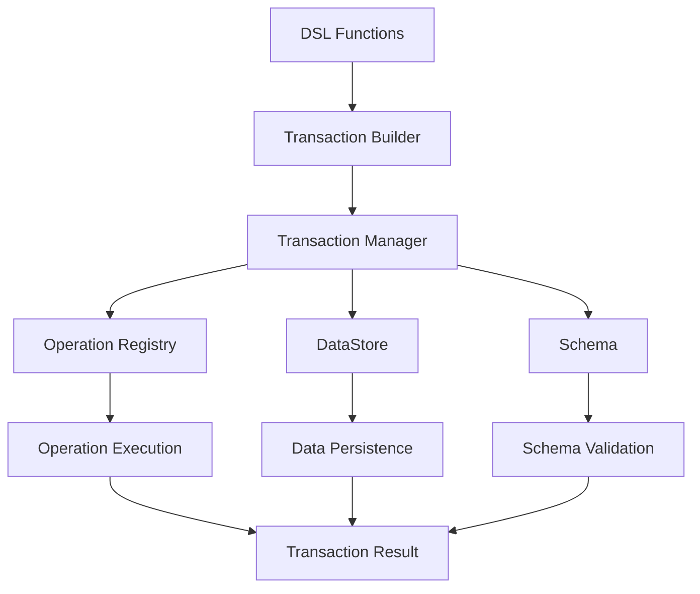

# Barocss Model Specification

## 1. Overview

Barocss Model is a **schema-based declarative model system** that provides a complete solution integrating DSL, Transaction, and DataStore. This is the final specification based on actual implementation.

### 1.1 Core Philosophy
- **Schema-first**: all nodes and marks are defined by schema
- **Declarative structure**: clear model composition via DSL
- **Atomicity**: consistency guaranteed through transactions
- **Type safety**: full TypeScript support
- **Extensibility**: easy to add new operations and node types

### 1.2 Key Benefits
- **Consistency**: schema-based data integrity
- **Performance**: efficient data management via DataStore
- **Flexibility**: supports various node types and marks
- **Safety**: atomic transactions and error handling
- **Developer experience**: intuitive DSL and type safety

## 2. Architecture

### 2.1 Core Components

#### 2.1.1 Transaction DSL
```typescript
// Core DSL functions
export function transaction(editor: Editor, operations: TransactionOperation[]): TransactionBuilder;
export function create(node: INode, options?: any): CreateOperation;
export function control(target: HandleOrId, actions: ControlAction[]): TransactionOperation[];
export function node(type: string, attributes?: Record<string, any>, content?: INode[]): INode;
export function textNode(type: string, text: string, marks?: MarkDescriptor[], attributes?: Record<string, any>): INode;
export function mark(type: string, attrs?: Record<string, any>): MarkDescriptor;
```

**Features:**
- Declarative transaction composition
- Type-safe node creation
- Flexible mark system
- Control-based node manipulation

#### 2.1.2 Operation System
```typescript
// Operation definition pattern
defineOperation('operationType', async (operation: any, context: TransactionContext) => {
  // Runtime execution logic
});

// DSL creation pattern
export const operationName = defineOperationDSL((...args) => ({
  type: 'operationType',
  payload: { /* operation data */ }
}));
```

**Features:**
- Dual pattern: runtime definition + DSL creation
- Auto-registration via global registry
- DataStore access via TransactionContext
- Schema validation and error handling

#### 2.1.3 Transaction System
```typescript
export class TransactionManager {
  async execute(operations: any[]): Promise<TransactionResult>;
  setSchema(schema: any): void;
  setSelectionManager(selectionManager: any): void;
}

export interface TransactionBuilder {
  commit(): Promise<TransactionResult>;
}
```

**Features:**
- Atomic transaction execution
- Concurrency control via global lock
- DataStore overlay system
- Automatic rollback and error handling

### 2.2 Integration Flow



## 3. Type System

### 3.1 Core Types
```typescript
// DSL Types
export type HandleOrId = string;
export type MarkDescriptor = { 
  type: string; 
  attrs?: Record<string, any>; 
  range?: [number, number] 
};

// Transaction Types
export type TransactionOperation = DirectOperation | DeleteOperation | SelectionOperation;
export type DirectOperation = { type: string; payload?: any };
export type DeleteOperation = { type: 'delete'; nodeId: string };
export type SelectionOperation = { type: 'setSelection'; selection: any };

// Result Types
export interface TransactionResult {
  success: boolean;
  errors: string[];
  data?: any;
  transactionId?: string;
  operations?: TransactionOperation[];
}
```

### 3.2 Node Types
```typescript
// INode from DataStore
interface INode {
  id: string;
  type: string;
  attributes?: Record<string, any>;
  content?: string[];
  text?: string;
  marks?: IMark[];
  parentId?: string;
}

// IMark from DataStore
interface IMark {
  type: string;
  attrs: Record<string, any>;
  range?: [number, number];
}
```

## 4. Operation Categories

### 4.1 Text Operations
- **setText**: set entire text
- **insertText**: insert text
- **replaceText**: replace text
- **deleteTextRange**: delete text range

### 4.2 Attribute Operations
- **setAttrs**: set node attributes
- **updateAttrs**: update node attributes

### 4.3 Mark Operations
- **setMarks**: set all marks
- **applyMark**: apply mark
- **removeMark**: remove mark
- **toggleMark**: toggle mark
- **updateMark**: update mark

### 4.4 Content Operations
- **create**: create node
- **addChild**: add child node
- **wrap**: wrap text
- **unwrap**: unwrap text

### 4.5 Range Operations
- **indent**: indent
- **outdent**: outdent
- **mergeTextNodes**: merge text nodes
- **replacePattern**: replace pattern

## 5. Usage Examples

### 5.1 Basic Setup
```typescript
import { DataStore } from '@barocss/datastore';
import { Schema } from '@barocss/schema';
import { transaction, create, node, textNode } from '@barocss/model';
import '@barocss/model/src/operations/register-operations';

// Define schema
const schema = new Schema('my-schema', {
  nodes: {
    document: { name: 'document', content: 'block+' },
    paragraph: { name: 'paragraph', content: 'inline*', group: 'block' },
    'inline-text': { name: 'inline-text', group: 'inline' }
  },
  marks: {
    bold: { name: 'bold', group: 'text-style' }
  },
  topNode: 'document'
});

// Initialize DataStore
const dataStore = new DataStore(undefined, schema);
const editor = { dataStore, _dataStore: dataStore };
```

### 5.2 Simple Document Creation
```typescript
// Create basic document
const result = await transaction(editor, [
  create(node('document', {}, [
    node('paragraph', {}, [
      textNode('inline-text', 'Hello World')
    ])
  ]))
]).commit();

console.log(result.success); // true
console.log(result.operations.length); // 1
```

### 5.3 Complex Document with Marks
```typescript
import { mark } from '@barocss/model';

// Complex document with marks
const result = await transaction(editor, [
  create(node('document', {}, [
    node('paragraph', {}, [
      textNode('inline-text', 'This is '),
      textNode('inline-text', 'bold text', [mark('bold')]),
      textNode('inline-text', ' and '),
      textNode('inline-text', 'italic text', [mark('italic')])
    ])
  ]))
]).commit();
```

### 5.4 Content Modification
```typescript
// 1. Create node
const createResult = await transaction(editor, [
  create(textNode('inline-text', 'Original text'))
]).commit();

const textNodeId = createResult.operations[0].result.sid;

// 2. Modify content
const modifyResult = await transaction(editor, [
  ...control(textNodeId, [
    { type: 'setText', payload: { text: 'Modified text' } },
    { type: 'applyMark', payload: { markType: 'bold', start: 0, end: 8 } }
  ])
]).commit();
```

## 6. Schema Integration

### 6.1 Schema Definition
```typescript
const schema = new Schema('my-schema', {
  nodes: {
    // Block nodes
    document: { name: 'document', content: 'block+' },
    paragraph: { name: 'paragraph', content: 'inline*', group: 'block' },
    heading: { 
      name: 'heading', 
      content: 'inline*', 
      group: 'block', 
      attrs: { level: { type: 'number', required: true } } 
    },
    
    // Inline nodes
    'inline-text': { name: 'inline-text', group: 'inline' },
    
    // Atomic nodes
    codeBlock: { 
      name: 'codeBlock', 
      group: 'block', 
      atom: true, 
      attrs: { language: { type: 'string', required: false } } 
    }
  },
  marks: {
    bold: { name: 'bold', group: 'text-style' },
    italic: { name: 'italic', group: 'text-style' },
    link: { 
      name: 'link', 
      group: 'text-style', 
      attrs: { href: { type: 'string', required: true } } 
    }
  },
  topNode: 'document'
});
```

### 6.2 Schema Validation
- Automatic schema validation on all node creation
- Required attribute validation
- Content model validation
- Mark allowance validation

## 7. Error Handling

### 7.1 Schema Validation Errors
```typescript
try {
  const result = await transaction(editor, [
    create(node('heading', {}, [ // missing level attribute
      textNode('inline-text', 'Title')
    ]))
  ]).commit();
} catch (error) {
  console.error('Schema validation failed:', error.message);
}
```

### 7.2 Operation Errors
```typescript
try {
  const result = await transaction(editor, [
    ...control('nonexistent-node', [
      { type: 'setText', payload: { text: 'Hello' } }
    ])
  ]).commit();
} catch (error) {
  console.error('Operation failed:', error.message);
}
```

### 7.3 Transaction Rollback
```typescript
// Failed transactions are automatically rolled back
const result = await transaction(editor, [
  create(textNode('inline-text', 'Valid text')),
  ...control('invalid-node', [
    { type: 'setText', payload: { text: 'This will fail' } }
  ])
]).commit();

console.log(result.success); // false
// All changes are rolled back
```

## 8. Performance Considerations

### 8.1 Batch Operations
```typescript
// Execute multiple operations at once (recommended)
const result = await transaction(editor, [
  create(textNode('inline-text', 'Text 1')),
  create(textNode('inline-text', 'Text 2')),
  create(textNode('inline-text', 'Text 3'))
]).commit();
```

### 8.2 Memory Management
- Efficient memory usage in DataStore
- Transaction isolation via overlay
- Automatic garbage collection
- Memory leak prevention

### 8.3 Lock Management
- Concurrency control via global lock
- Minimal lock hold time
- Automatic lock release
- Deadlock prevention

## 9. Testing

### 9.1 Unit Testing
```typescript
import { describe, it, expect, beforeEach } from 'vitest';

describe('Model Integration', () => {
  let editor: any;
  let dataStore: DataStore;

  beforeEach(() => {
    const schema = new Schema('test-schema', {
      nodes: {
        document: { name: 'document', content: 'block+' },
        paragraph: { name: 'paragraph', content: 'inline*', group: 'block' },
        'inline-text': { name: 'inline-text', group: 'inline' }
      },
      marks: {
        bold: { name: 'bold', group: 'text-style' }
      },
      topNode: 'document'
    });

    dataStore = new DataStore(undefined, schema);
    editor = { dataStore, _dataStore: dataStore };
  });

  it('should create and modify text', async () => {
    const createResult = await transaction(editor, [
      create(textNode('inline-text', 'Hello'))
    ]).commit();

    expect(createResult.success).toBe(true);
    const textNodeId = createResult.operations[0].result.sid;

    const modifyResult = await transaction(editor, [
      ...control(textNodeId, [
        { type: 'setText', payload: { text: 'World' } }
      ])
    ]).commit();

    expect(modifyResult.success).toBe(true);
    
    const finalNode = dataStore.getNode(textNodeId);
    expect(finalNode.text).toBe('World');
  });
});
```

### 9.2 Integration Testing
```typescript
describe('Real-world Scenarios', () => {
  it('should handle complex document structure', async () => {
    const result = await transaction(editor, [
      create(node('document', {}, [
        node('heading', { level: 1 }, [
          textNode('inline-text', 'Title')
        ]),
        node('paragraph', {}, [
          textNode('inline-text', 'Content with '),
          textNode('inline-text', 'bold text', [mark('bold')])
        ])
      ]))
    ]).commit();

    expect(result.success).toBe(true);
    expect(result.operations).toHaveLength(1);
    
    const documentNode = result.operations[0].result;
    expect(documentNode.type).toBe('document');
    expect(documentNode.content).toHaveLength(2);
  });
});
```

## 10. Best Practices

### 10.1 Schema Design
- **Clear structure**: clearly define relationships between nodes and marks
- **Required attributes**: set important attributes to `required: true`
- **Defaults**: provide appropriate defaults
- **Grouping**: group related nodes

### 10.2 Operation Usage
- **Batching**: process related operations in one transaction
- **Error handling**: use appropriate try-catch blocks
- **Validation**: verify results to ensure data integrity
- **Performance**: process in chunks for large operations

### 10.3 Code Organization
- **Modularization**: separate related functionality into modules
- **Type safety**: use TypeScript types actively
- **Testing**: write unit and integration tests
- **Documentation**: add comments for complex logic

## 11. Future Extensions

### 11.1 Planned Features
- **Plugin system**: custom operations and node types
- **Performance optimization**: improve large document handling
- **Distributed transactions**: transactions across multiple DataStores
- **Real-time collaboration**: support simultaneous editing

### 11.2 API Stability
- Current API is stable
- New features follow existing patterns

## 12. Integration with Other Packages

### 12.1 DataStore Integration
```typescript
import { DataStore } from '@barocss/datastore';

// DataStore is the core data storage for the model
const dataStore = new DataStore(undefined, schema);
```

### 12.2 Schema Integration
```typescript
import { Schema } from '@barocss/schema';

// Schema defines the structure of nodes and marks
const schema = new Schema('my-schema', schemaDefinition);
```

### 12.3 Editor Core Integration
```typescript
import { Editor } from '@barocss/editor-core';

// Editor connects model and view
const editor = new Editor({ dataStore, schema });
```

---

This specification is based on the implemented Barocss Model, and all examples come from tested, verified code. It is a complete guide to the model system with DSL, Transaction, and DataStore fully integrated.
