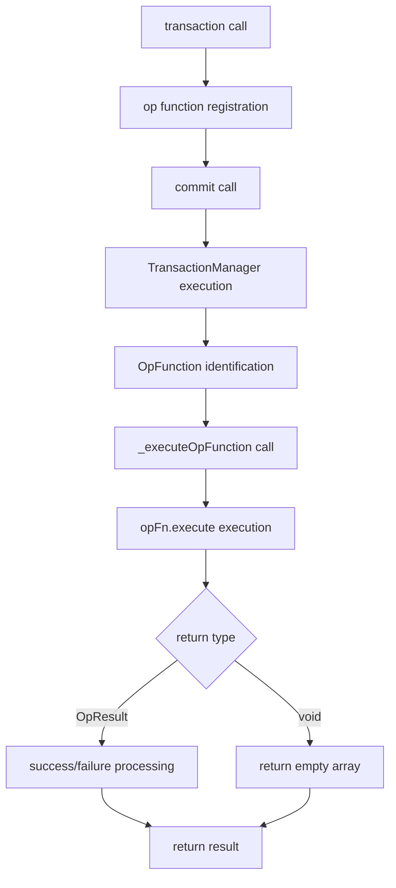

# Op Function DSL Specification

## Overview

The `op()` function is a functional DSL in Barocss Editor that provides imperative programming style for complex logic and flow control. Unlike the existing declarative DSL, it allows complex tasks using regular JavaScript syntax.

## Table of Contents

1. [Basic Concepts](#1-basic-concepts)
2. [Function Signature](#2-function-signature)
3. [TransactionContext](#3-transactioncontext)
4. [OpResult Structure](#4-opresult-structure)
5. [Supported Return Types](#5-supported-return-types)
6. [Execution Flow](#6-execution-flow)
7. [Mixing with Existing DSL](#7-mixing-with-existing-dsl)
8. [Key Features](#8-key-features)
9. [Use Cases](#9-use-cases)
10. [Notes](#10-notes)
11. [Testing Guide](#11-testing-guide)

## 1. Basic Concepts

### 1.1 Declarative DSL vs Functional DSL

**Declarative DSL (existing)**
```typescript
// Declarative approach - specify what to do
const result = await transaction(editor, [
  create(textNode('inline-text', 'Hello')),
  control('node-sid', setText('Updated'))
]).commit();
```

**Functional DSL (op)**
```typescript
// Imperative approach - specify how to do
const result = await transaction(editor, [
  op(async (ctx) => {
    // Perform complex logic
    const node = ctx.dataStore.createNodeWithChildren(
      textNode('inline-text', 'Hello'),
      ctx.schema
    );
    
    if (someCondition) {
      // Additional work
    }
    
    return {
      success: true,
      data: node
    };
  })
]).commit();
```

### 1.2 When to Use

- **Declarative DSL**: simple and intuitive tasks
- **Functional DSL**: complex conditional logic, loops, async operations, external API calls

## 2. Function Signature

```typescript
function op(
  operationFn: (context: TransactionContext) => OpResult | void | Promise<OpResult | void>
): OpFunction
```

### 2.1 Parameters

- `operationFn`: function to execute
  - `context`: `TransactionContext` object
  - Return value: `OpResult | void | Promise<OpResult | void>`

### 2.2 Return Value

- `OpFunction`: executable functional operation object

## 3. TransactionContext

The `op` function receives `TransactionContext` as a parameter:

```typescript
interface TransactionContext {
  dataStore: DataStore;           // DataStore instance (can manipulate directly)
  selectionManager: SelectionManager; // SelectionManager instance
  selection?: ModelSelection;     // current selection
  schema?: any;                   // Schema instance
  selectAbsoluteRange: (start: number, end: number) => void; // select by absolute position
  resolveAbsolute: (position: number) => { nodeId: string; offset: number } | null; // resolve position
}
```

### 3.1 Key Properties

- **`dataStore`**: core object for data manipulation
- **`selectionManager`**: manage selection
- **`selection`**: current selection state
- **`schema`**: for schema validation
- **`selectAbsoluteRange`**: select by absolute position
- **`resolveAbsolute`**: convert absolute position to node/offset

## 4. OpResult Structure

```typescript
interface OpResult {
  success: boolean;                    // success/failure status
  data?: any;                         // result data
  error?: string;                     // error message (when success: false)
  inverse?: TransactionOperation;     // inverse operation (for undo)
}
```

### 4.1 Property Descriptions

- **`success`**: whether operation succeeded (required)
- **`data`**: operation result data (optional)
- **`error`**: error message on failure (optional)
- **`inverse`**: inverse operation for undo (optional)

## 5. Supported Return Types

### 5.1 void (returns nothing)

```typescript
op(async (ctx) => {
  // Only perform side effects (logging, state changes, etc.)
  // Return nothing
})
```

**Use case**: when only side effects like logging, state changes are needed

### 5.2 OpResult (success/failure result)

```typescript
op(async (ctx) => {
  const node = ctx.dataStore.createNodeWithChildren(
    textNode('inline-text', 'Hello'),
    ctx.schema
  );
  
  return {
    success: true,
    data: node
  };
})
```

**Use case**: return result after simple operation

### 5.3 OpResult with inverse (specify inverse)

```typescript
op(async (ctx) => {
  const node = ctx.dataStore.createNodeWithChildren(
    textNode('inline-text', 'With inverse'),
    ctx.schema
  );
  
  return {
    success: true,
    data: node,
    inverse: { type: 'delete', payload: { nodeId: node.sid } }
  };
})
```

**Use case**: operations that need undo functionality

### 5.4 Failure case

```typescript
op(async (ctx) => {
  const condition = false;
  if (condition) {
    return {
      success: true,
      data: ctx.dataStore.createNodeWithChildren(textNode('inline-text', 'Created'), ctx.schema)
    };
  } else {
    return {
      success: false,
      error: 'Condition not met'
    };
  }
})
```

**Use case**: failure handling in conditional execution

## 6. Execution Flow



### 6.1 Step-by-Step Description

1. **Transaction start**: call `transaction(editor, [op(...)])`
2. **Operation registration**: `op` function is converted to `OpFunction` object
3. **Transaction commit**: `TransactionManager` executes when `commit()` is called
4. **OpFunction execution**: `opFn.execute(context)` is called in `_executeOpFunction`
5. **Result processing**: handle `OpResult` or `void` return value
6. **Operation creation**: `OpResult` does not immediately create an operation (inverse is for undo)

## 7. Mixing with Existing DSL

```typescript
const result = await transaction(editor, [
  // Existing declarative DSL
  create(textNode('inline-text', 'Regular operation')),
  
  // Functional DSL
  op(async (ctx) => {
    // Execute custom logic
    return { success: true };
  }),
  
  // Back to declarative DSL
  control('node-sid', setText('Updated text'))
]).commit();
```

### 7.1 Notes When Mixing

- Can freely mix declarative DSL and functional DSL
- Execution order follows array order
- `op` function is not added to `result.operations`

## 8. Key Features

### 8.1 Async Support

```typescript
op(async (ctx) => {
  // Full async operation support
  const response = await fetch('/api/data');
  const data = await response.json();
  
  const node = ctx.dataStore.createNodeWithChildren(
    textNode('inline-text', data.content),
    ctx.schema
  );
  
  return { success: true, data: node };
})
```

### 8.2 Direct DataStore Manipulation

```typescript
op(async (ctx) => {
  // Perform complex tasks by directly manipulating DataStore
  const node1 = ctx.dataStore.createNodeWithChildren(
    textNode('inline-text', 'First'),
    ctx.schema
  );
  
  const node2 = ctx.dataStore.createNodeWithChildren(
    textNode('inline-text', 'Second'),
    ctx.schema
  );
  
  // Complex logic like setting relationships between nodes
  return { success: true, data: [node1, node2] };
})
```

### 8.3 Conditional Execution

```typescript
op(async (ctx) => {
  const user = await getUser();
  const hasPermission = await checkPermission(user.sid);
  
  if (hasPermission) {
    const node = ctx.dataStore.createNodeWithChildren(
      textNode('inline-text', `Welcome ${user.name}`),
      ctx.schema
    );
    return { success: true, data: node };
  } else {
    return { success: false, error: 'Insufficient permissions' };
  }
})
```

### 8.4 Error Handling

```typescript
op(async (ctx) => {
  try {
    // Perform complex logic
    const result = await complexOperation();
    return { success: true, data: result };
  } catch (error) {
    return { success: false, error: error.message };
  }
})
```

### 8.5 Inverse Support

```typescript
op(async (ctx) => {
  const node = ctx.dataStore.createNodeWithChildren(
    textNode('inline-text', 'With inverse'),
    ctx.schema
  );
  
  return {
    success: true,
    data: node,
    inverse: { type: 'delete', payload: { nodeId: node.sid } }
  };
})
```

### 8.6 Transaction Safety

- All changes execute safely within transaction
- Automatic rollback on error
- Prevents memory leaks

## 9. Use Cases

### 9.1 Complex Conditional Logic

```typescript
op(async (ctx) => {
  const user = await getUser();
  const hasPermission = await checkPermission(user.sid);
  const isPremium = await checkPremiumStatus(user.sid);
  
  if (hasPermission && isPremium) {
    const node = ctx.dataStore.createNodeWithChildren(
      textNode('inline-text', `Premium content for ${user.name}`),
      ctx.schema
    );
    return { success: true, data: node };
  } else if (hasPermission) {
    const node = ctx.dataStore.createNodeWithChildren(
      textNode('inline-text', `Basic content for ${user.name}`),
      ctx.schema
    );
    return { success: true, data: node };
  } else {
    return { success: false, error: 'Access denied' };
  }
})
```

### 9.2 Multiple Node Creation

```typescript
op(async (ctx) => {
  const nodes = [];
  const items = await fetchItems();
  
  for (const item of items) {
    const node = ctx.dataStore.createNodeWithChildren(
      textNode('inline-text', item.name),
      ctx.schema
    );
    nodes.push(node);
  }
  
  return {
    success: true,
    data: nodes,
    inverse: {
      type: 'batch',
      payload: { 
        operations: nodes.map(n => ({ 
          type: 'delete', 
          payload: { nodeId: n.sid } 
        })) 
      }
    }
  };
})
```

### 9.3 External API Call Integration

```typescript
op(async (ctx) => {
  try {
    const response = await fetch('/api/validate', {
      method: 'POST',
      headers: { 'Content-Type': 'application/json' },
      body: JSON.stringify({ content: 'test' })
    });
    
    if (response.ok) {
      const data = await response.json();
      const node = ctx.dataStore.createNodeWithChildren(
        textNode('inline-text', data.message),
        ctx.schema
      );
      return { success: true, data: node };
    } else {
      return { success: false, error: 'Validation failed' };
    }
  } catch (error) {
    return { success: false, error: error.message };
  }
})
```

### 9.4 Loops and Array Processing

```typescript
op(async (ctx) => {
  const results = [];
  const conditions = [true, false, true, true, false];
  
  for (let i = 0; i < conditions.length; i++) {
    if (conditions[i]) {
      const node = ctx.dataStore.createNodeWithChildren(
        textNode('inline-text', `Item ${i + 1}`),
        ctx.schema
      );
      results.push(node);
    }
  }
  
  return {
    success: true,
    data: results,
    inverse: {
      type: 'batch',
      payload: { 
        operations: results.map(n => ({ 
          type: 'delete', 
          payload: { nodeId: n.sid } 
        })) 
      }
    }
  };
})
```

## 10. Notes

### 10.1 Unsupported Patterns

```typescript
// ❌ Incorrect usage
op((ctx) => { 
  return { type: 'create', payload: { node: textNode('text', 'Hello') } };
})

// ✅ Correct usage
op((ctx) => {
  const node = ctx.dataStore.createNodeWithChildren(
    textNode('inline-text', 'Hello'),
    ctx.schema
  );
  return { success: true, data: node };
})
```

### 10.2 OpResult Structure Compliance

- Use only the same `OpResult` structure as `defineOperation`
- Cannot directly return `{ type, payload }` form

### 10.3 inverse Handling

- `inverse` is not executed immediately but used later for undo
- Returning `OpResult` does not add to `result.operations`

### 10.4 DataStore Manipulation

- Consider schema validation when directly manipulating `ctx.dataStore`
- Executes safely within transaction but may throw error on schema violation

## 11. Testing Guide

### 11.1 Basic Test

```typescript
it('should execute op function successfully', async () => {
  const result = await transaction(mockEditor, [
    op(async (ctx) => {
      const node = ctx.dataStore.createNodeWithChildren(
        textNode('inline-text', 'Hello'),
        ctx.schema
      );
      
      return {
        success: true,
        data: node
      };
    })
  ]).commit();

  expect(result.success).toBe(true);
  expect(result.operations).toHaveLength(0); // OpResult does not create operation
});
```

### 11.2 Error Handling Test

```typescript
it('should handle op function errors', async () => {
  const result = await transaction(mockEditor, [
    op(async (ctx) => {
      return {
        success: false,
        error: 'Test error'
      };
    })
  ]).commit();

  expect(result.success).toBe(false);
  expect(result.errors).toContain('Test error');
});
```

### 11.3 Async Operation Test

```typescript
it('should handle async operations', async () => {
  const result = await transaction(mockEditor, [
    op(async (ctx) => {
      await new Promise(resolve => setTimeout(resolve, 10));
      
      const node = ctx.dataStore.createNodeWithChildren(
        textNode('inline-text', 'Async created'),
        ctx.schema
      );
      
      return { success: true, data: node };
    })
  ]).commit();

  expect(result.success).toBe(true);
  expect(result.operations).toHaveLength(0);
});
```

### 11.4 Complex Scenario Test

```typescript
it('should handle complex multi-node creation', async () => {
  const result = await transaction(mockEditor, [
    op(async (ctx) => {
      const nodes = [];
      const conditions = [true, false, true, true, false];
      
      for (let i = 0; i < conditions.length; i++) {
        if (conditions[i]) {
          const node = ctx.dataStore.createNodeWithChildren(
            textNode('inline-text', `Item ${i + 1}`),
            ctx.schema
          );
          nodes.push(node);
        }
      }
      
      return {
        success: true,
        data: nodes,
        inverse: {
          type: 'batch',
          payload: { 
            operations: nodes.map(n => ({ 
              type: 'delete', 
              payload: { nodeId: n.sid } 
            })) 
          }
        }
      };
    })
  ]).commit();

  expect(result.success).toBe(true);
  expect(result.operations).toHaveLength(0);
  expect(result.data).toHaveLength(3); // Only 3 nodes created
});
```

---

This specification document is a complete guide to the `op` functional DSL. When complex logic and flow control are needed, you can use this DSL to perform more flexible and powerful operations.
