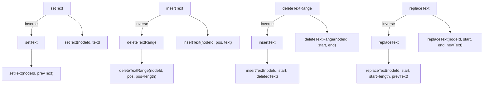
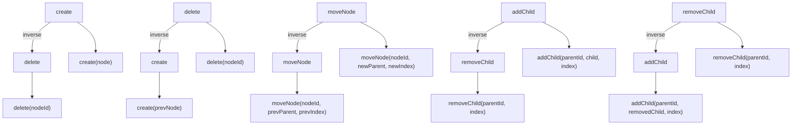
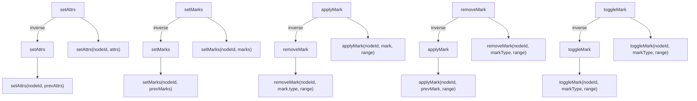
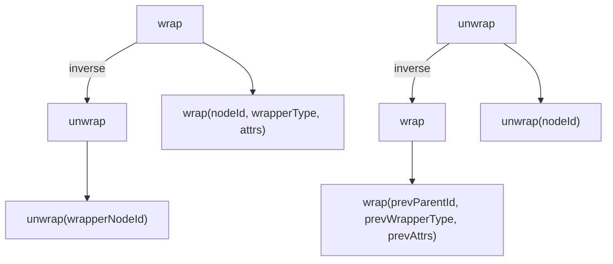
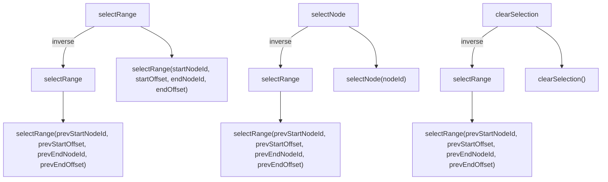
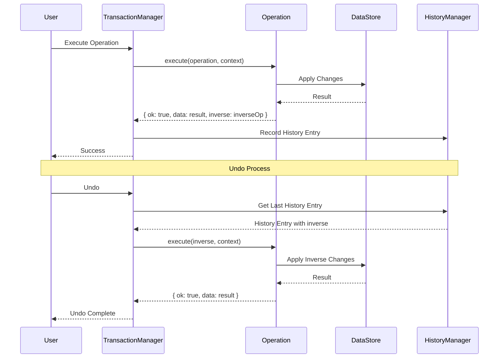
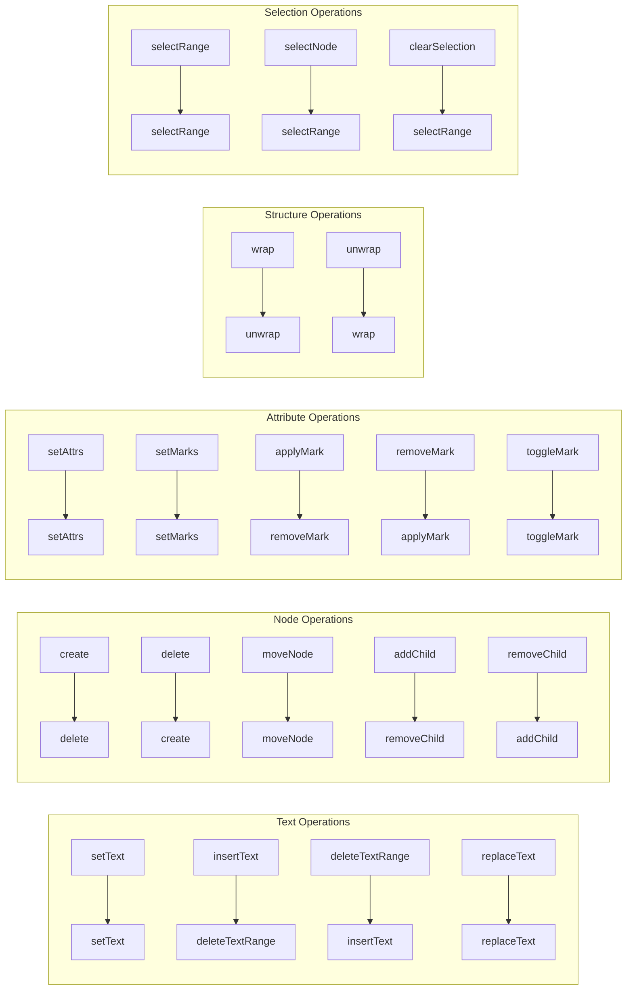

# Operation Inverse Specification

## Overview

This document defines the forward operations and their inverse counterparts in the BaroCSS editor. Every operation must provide an executable inverse to support undo/redo.

## Principles for Inverse Implementation

### 1. Use DSL form
```typescript
// ❌ Plain object
inverse: { type: 'setText', payload: { nodeId, text: prevText } }

// ✅ DSL form
inverse: setText(nodeId, prevText)
```

### 2. Save previous state before execution
```typescript
// Save previous state
const prevText = node.text ?? '';
const prevAttrs = { ...node.attributes };
const prevMarks = [...(node.marks ?? [])];

// Return inverse in OperationExecuteResult
return {
  ok: true,
  data: updatedNode,
  inverse: { type: 'setText', payload: { nodeId, text: prevText } }
};
```

### 3. OperationExecuteResult structure
All operations must return this shape:
```typescript
interface OperationExecuteResult {
  ok: boolean;
  data: any;        // updated node or result data
  inverse: {        // inverse operation
    type: string;
    payload: any;
  };
}
```

### 4. Minimal data
Store only the data required to fully restore the previous state.

## Inverse Mapping by Operation

### Text operations

| Forward | Inverse | Parameters | Description |
|---|---|---|---|
| `setText(nodeId, text)` | `setText(nodeId, prevText)` | `prevText: string` | restore previous text |
| `insertText(nodeId, pos, text)` | `deleteTextRange(nodeId, pos, pos + text.length)` | `pos: number, length: number` | remove inserted text |
| `deleteTextRange(nodeId, start, end)` | `insertText(nodeId, start, deletedText)` | `start: number, deletedText: string` | reinsert deleted text |
| `replaceText(nodeId, start, end, newText)` | `replaceText(nodeId, start, start + newText.length, prevText)` | `start: number, prevText: string` | replace with previous text |

### Node structure operations

| Forward | Inverse | Parameters | Description |
|---|---|---|---|
| `create(node)` | `delete(nodeId)` | `nodeId: string` | delete created node |
| `delete(nodeId)` | `create(prevNode)` | `prevNode: INode` | recreate deleted node |
| `moveNode(nodeId, newParentId, newIndex)` | `moveNode(nodeId, prevParentId, prevIndex)` | `prevParentId: string, prevIndex: number` | move back to previous location |
| `addChild(parentId, child, index)` | `removeChild(parentId, index)` | `index: number` | remove added child |
| `removeChild(parentId, index)` | `addChild(parentId, removedChild, index)` | `removedChild: INode, index: number` | re-add removed child |

### Attribute/mark operations

| Forward | Inverse | Parameters | Description |
|---|---|---|---|
| `setAttrs(nodeId, attrs)` | `setAttrs(nodeId, prevAttrs)` | `prevAttrs: Record<string, any>` | restore previous attributes |
| `setMarks(nodeId, marks)` | `setMarks(nodeId, prevMarks)` | `prevMarks: IMark[]` | restore previous marks |
| `applyMark(nodeId, mark, range)` | `removeMark(nodeId, mark.type, range)` | `mark.type: string, range: [number, number]` | remove applied mark |
| `removeMark(nodeId, markType, range)` | `applyMark(nodeId, prevMark, range)` | `prevMark: IMark, range: [number, number]` | reapply removed mark |
| `toggleMark(nodeId, markType, range)` | `toggleMark(nodeId, markType, range)` | `markType: string, range: [number, number]` | toggle is self-inverse |

### Wrapping/unwrapping operations

| Forward | Inverse | Parameters | Description |
|---|---|---|---|
| `wrap(nodeId, wrapperType, attrs)` | `unwrap(wrapperNodeId)` | `wrapperNodeId: string` | unwrap wrapper node |
| `unwrap(nodeId)` | `wrap(prevParentId, prevWrapperType, prevAttrs)` | `prevParentId: string, prevWrapperType: string, prevAttrs: any` | re-wrap with previous wrapper |

### Selection operations

| Forward | Inverse | Parameters | Description |
|---|---|---|---|
| `selectRange(startNodeId, startOffset, endNodeId, endOffset)` | `selectRange(prevStartNodeId, prevStartOffset, prevEndNodeId, prevEndOffset)` | restore previous selection |
| `selectNode(nodeId)` | `selectRange(prevStartNodeId, prevStartOffset, prevEndNodeId, prevEndOffset)` | restore previous selection |
| `clearSelection()` | `selectRange(prevStartNodeId, prevStartOffset, prevEndNodeId, prevEndOffset)` | restore previous selection |

## Inverse Execution Flow

### 1. Forward execution
```typescript
const result = await operation.execute(operation, context);
// result.inverse holds inverse info
```

### 2. Backward execution (Undo)
```typescript
const inverseResult = await inverseOperation.execute(inverseOperation, context);
// Restores previous state
```

### 3. Forward again (Redo)
```typescript
const redoResult = await originalOperation.execute(originalOperation, context);
// Restores original forward state
```

## Implementation Examples

### `setText`
```typescript
defineOperation('setText', async (operation: any, context: TransactionContext) => {
  const { nodeId, text } = operation.payload;
  const node = context.dataStore.getNode(nodeId);
  const prevText = node.text ?? '';
  
  context.dataStore.updateNode(nodeId, { text });
  
  return {
    ok: true,
    data: context.dataStore.getNode(nodeId),
    inverse: setText(nodeId, prevText)  // DSL form
  };
});
```

### `insertText`
```typescript
defineOperation('insertText', async (operation: any, context: TransactionContext) => {
  const { nodeId, pos, text } = operation.payload;
  
  context.dataStore.range.insertText(nodeId, pos, text);
  
  return {
    ok: true,
    data: context.dataStore.getNode(nodeId),
    inverse: deleteTextRange(nodeId, pos, pos + text.length)  // DSL form
  };
});
```

## Special Cases

### 1. Self-inverse
- `toggleMark`: toggling twice returns to original state
- `clearSelection`: clearing twice has no further effect

### 2. Composite inverses
Some operations need multi-step inverses:
```typescript
// Example: inverse of splitNode is mergeNode
inverse: mergeNode(leftNodeId, rightNodeId)
```

### 3. Conditional inverses
Some operations choose inverse based on conditions:
```typescript
// Example: different inverse depending on condition
inverse: condition ? operationA(params) : operationB(params)
```

## Validation Rules

### 1. Inverse must exist
Every operation must return a valid inverse.

### 2. Inverse must be executable
The inverse must be runnable in the current context.

### 3. State consistency
After running the inverse, state should match the original state.

## Test Strategy

### 1. Unit tests
```typescript
test('setText inverse should restore previous text', async () => {
  const originalText = 'Hello';
  const newText = 'World';
  
  // Forward
  const result = await setText(nodeId, newText);
  expect(result.data.text).toBe(newText);
  
  // Inverse
  const inverseResult = await result.inverse.execute(result.inverse, context);
  expect(inverseResult.data.text).toBe(originalText);
});
```

### 2. Integration tests
```typescript
test('operation-inverse roundtrip should maintain state', async () => {
  const initialState = captureState();
  
  // Forward + inverse
  const result = await operation.execute(operation, context);
  await result.inverse.execute(result.inverse, context);
  
  const finalState = captureState();
  expect(finalState).toEqual(initialState);
});
```

## Performance Considerations

### 1. Memory
Keep inverse data minimal.

### 2. Speed
Inverse execution should be comparable to forward execution.

### 3. Nested operations
Complex operations can lead to complex inverses; abstract appropriately.

## Simple Inverse System

### Key principle
The inverse focuses on **reversing data changes only**. Selection is preserved by default, with simple clamping when needed.

### How to implement

#### 1. Simple DSL form
```typescript
// setText inverse
inverse: setText(nodeId, prevText)

// insertText inverse
inverse: deleteTextRange(nodeId, pos, pos + text.length)

// deleteTextRange inverse
inverse: insertText(nodeId, start, deletedText)
```

#### 2. Keep selection as-is
```typescript
// TransactionManager executing inverses
async executeInverse(inverseOps: any[], context: TransactionContext) {
  for (const inverseOp of inverseOps) {
    await this._executeOperation(inverseOp, context);
    // selection is preserved; only simple clamping when needed
  }
}
```

#### 3. Examples
```typescript
// setText
defineOperation('setText', async (operation: any, context: TransactionContext) => {
  const { nodeId, text } = operation.payload;
  const node = context.dataStore.getNode(nodeId);
  const prevText = node.text ?? '';
  
  context.dataStore.updateNode(nodeId, { text });
  
  return {
    ok: true,
    data: context.dataStore.getNode(nodeId),
    inverse: setText(nodeId, prevText)
  };
});

// insertText
defineOperation('insertText', async (operation: any, context: TransactionContext) => {
  const { nodeId, pos, text } = operation.payload;
  
  context.dataStore.range.insertText(nodeId, pos, text);
  
  return {
    ok: true,
    data: context.dataStore.getNode(nodeId),
    inverse: deleteTextRange(nodeId, pos, pos + text.length)
  };
});
```

#### 4. Selection clamping
```typescript
// TransactionManager applies simple clamping
class TransactionManager {
  private _clampSelection(selection: SelectionContext, dataStore: DataStore) {
    const anchorNode = dataStore.getNode(selection.current.anchorId);
    const focusNode = dataStore.getNode(selection.current.focusId);
    
    if (anchorNode?.text) {
      selection.current.anchorOffset = Math.min(
        selection.current.anchorOffset,
        anchorNode.text.length
      );
    }
    
    if (focusNode?.text) {
      selection.current.focusOffset = Math.min(
        selection.current.focusOffset,
        focusNode.text.length
      );
    }
  }
}
```

### Benefits
1. **Simplicity**: no complex selection mapping logic
2. **Predictability**: inverse results are clear
3. **Performance**: no selection computation overhead
4. **Consistency**: same approach for all operations
5. **Maintainability**: simple structure makes debugging easy

## Approaches in Other Editors

### 1. Google Docs
**Approach**: Operational Transform (OT) + selection mapping
- Track all changes as operations
- Manage selection as relative positions, not absolute
- Resolve conflicts in collaboration by transforming operations

**Pros**: optimized for real-time collaboration; handles selection conflicts well
**Cons**: high implementation complexity; requires complex sync under network latency

### 2. Notion
**Approach**: block-based + selection preservation
- Manage content as blocks
- Track selection as block ID + offset
- Undo/redo restores selection if block exists; otherwise moves to nearest block

**Pros**: clear block structure; simpler selection restore
**Cons**: hard to restore selection if a block is deleted; limits in complex text edits

### 3. VS Code
**Approach**: model-based + selection mapping
- Track all changes as model changes
- Manage selection by model positions
- Map selection during undo/redo based on model changes

**Pros**: accurate selection restore; handles complex text edits well
**Cons**: complex model tracking; performance tuning is harder

### 4. ProseMirror
**Approach**: Transform-based + selection mapping
- Track all changes as transforms
- Manage selection as document positions
- Use inverse transforms for undo

**Pros**: mathematically precise inverses; accurate selection mapping
**Cons**: transform concept is complex; steeper learning curve

### 5. Slate.js
**Approach**: immutable data + selection preservation
- Track changes as immutable data
- Manage selection as path + offset
- Undo/redo fully restores previous state

**Pros**: simple state management; easy debugging
**Cons**: higher memory usage; performance issues on large documents

## BaroCSS Choice

BaroCSS chooses a **simple inverse system**:

**Reasons:**
1. **Simplicity**: no complex selection mapping
2. **Predictability**: clear inverse outcomes
3. **Performance**: no selection overhead
4. **Consistency**: same approach for all operations
5. **Maintainability**: easy debugging and fixes

**Implementation strategy:**
```typescript
// 1. Define simple inverse DSL per operation
defineOperation('setText', async (operation, context) => {
  const { nodeId, text } = operation.payload;
  const prevText = node.text ?? '';
  
  context.dataStore.updateNode(nodeId, { text });
  
  return {
    ok: true,
    data: result,
    inverse: setText(nodeId, prevText)
  };
});

// 2. TransactionManager: simple clamping only
async executeInverse(inverseOps: any[], context: TransactionContext) {
  for (const inverseOp of inverseOps) {
    await this._executeOperation(inverseOp, context);
    // selection preserved; only simple clamping if needed
  }
}

// 3. Selection can be adjusted by the user when needed
// No complex automatic mapping
```

This approach is simple, predictable, and stable even in collaborative environments.

## Operation–Inverse Diagrams

### Text operations



### Node structure operations



### Attribute/mark operations



### Wrapping/unwrapping operations



### Selection operations



## Inverse Execution Flow Diagram



## Operation–Inverse Matrix by Category



## 8. Implementation Notes

### 8.1 Operation registration
All inverse operations must be registered alongside their forward operations in `register-operations.ts`:

```typescript
// register-operations.ts
import './create';    // create + delete inverse
import './update';    // update + update inverse  
import './setText';   // setText + setText inverse
// ... other operations
```

### 8.2 Testing inverse operations

```typescript
// ✅ Correct testing pattern
const forwardResult = await transaction(editor, [
  create(textNode('inline-text', 'Hello'))
]).commit();

const nodeId = forwardResult.operations[0].result.data.sid;
const inverseResult = await transaction(editor, [
  { type: 'delete', payload: { nodeId } }
]).commit();

// Validate results
expect(forwardResult.success).toBe(true);
expect(inverseResult.success).toBe(true);
expect(dataStore.getNode(nodeId)).toBeUndefined();
```

### 8.3 Common implementation issues

#### 8.3.1 Operation not registered
```
Error: Unknown operation type: update
```
**Solution:** add the operation import to `register-operations.ts`.

#### 8.3.2 Incorrect payload structure
```typescript
// ❌ Incorrect
defineOperation('setText', async (operation, context) => {
  const { nodeId, text } = operation; // direct access
});

// ✅ Correct
defineOperation('setText', async (operation, context) => {
  const { nodeId, text } = operation.payload; // pull from payload
});
```

#### 8.3.3 Missing OperationExecuteResult shape
```typescript
// ❌ Incorrect
return updatedNode;

// ✅ Correct
return {
  ok: true,
  data: updatedNode,
  inverse: { type: 'setText', payload: { nodeId, text: prevText } }
};
```
