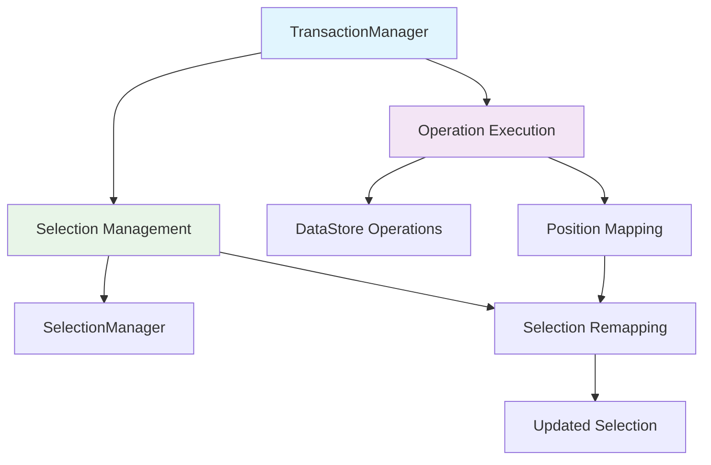

# Operation-Selection Integration Specification

## 1. Overview

This document defines a clear specification for **integration of Operation execution and Selection management** in Barocss Model. It addresses the current issue of inconsistent Selection handling across operations and proposes a centralized approach to Selection management.

## 2. Current Issues

### 2.1 Lack of Consistency
- **Selection-related Operations**: only `selectRange`, `selectNode`, `clearSelection` handle directly
- **Text Operations**: only `text` operation has automatic Selection mapping
- **Most Operations**: `create`, `update`, `delete`, `split`, `merge`, etc. have no Selection handling
- **User experience**: Selection behavior differs by operation type

### 2.2 Code Duplication
- Selection mapping logic exists only in `text` operation
- Other operations have no Selection handling logic
- Need to decide Selection handling when adding new operations

### 2.3 Complexity
- Only `text` operation manages both DataStore + Selection
- Selection-related operations manage only Selection
- Remaining operations manage only DataStore
- Inconsistent responsibility distribution

## 3. Design Principles

### 3.1 Single Responsibility Principle
- **Operation**: focus only on data changes
- **Model Layer**: manage combination of Operation + Selection

### 3.2 Centralized Processing
- Automatic Selection mapping after all operations
- Apply consistent Selection policies
- Remove code duplication

### 3.3 Extensibility
- Automatic Selection handling when adding new operations
- Easy to change Selection policies

## 4. Architecture

### 4.1 Overall Structure



### 4.2 Core Components

#### A. TransactionManager
- Combines operation execution and Selection management
- Automatic Selection mapping after all operations
- Calculate and apply PositionMapping

#### B. Operation Layer
- Focus purely on data changes
- Remove Selection handling logic
- Call DataStore methods

#### C. SelectionManager
- Manage Selection state
- Selection mapping and updates
- Position-based Selection handling

## 5. Implementation Approach

### 5.1 Core Design Principles

#### **Distinguish User Actions vs External Synchronization**
- **User actions**: Transaction → Operations → DataStore + Selection mapping
- **External synchronization**: update only DataStore (no Selection change)

#### **Operation Role**
- **Data processing**: update DataStore
- **Selection mapping**: immediately update SelectionManager
- **Simplicity**: no accumulated logic needed

### 5.2 defineOperation Extension

```typescript
// Add Selection mapping to defineOperation
export function defineOperation<T extends TransactionOperation>(
  name: string, 
  executor: (operation: T, context: TransactionContext) => Promise<void | INode>
): void {
  globalOperationRegistry.register(name, { 
    name, 
    execute: executor
  });
}

// Operation definition interface
export interface OperationDefinition {
  name: string;
  execute: <T extends TransactionOperation>(operation: T, context: TransactionContext) => Promise<void | INode>;
}
```

### 5.3 Operation Implementation Pattern

```typescript
// Operations handle both data + Selection mapping
defineOperation('insertText', async (operation: InsertTextOperation, context: TransactionContext) => {
  // 1. Update DataStore
  context.dataStore.insertText(operation.nodeId, operation.position, operation.text);
  
  // 2. Map Selection and update immediately
  const currentSelection = context.selectionManager.getCurrentSelection();
  if (currentSelection) {
    const newSelection = SelectionMappingUtils.shiftAfterInsert(currentSelection, operation);
    context.selectionManager.setSelection(newSelection);
  }
});

defineOperation('delete', async (operation: DeleteOperation, context: TransactionContext) => {
  // 1. Update DataStore
  context.dataStore.deleteNode(operation.nodeId);
  
  // 2. Map Selection and update immediately
  const currentSelection = context.selectionManager.getCurrentSelection();
  if (currentSelection) {
    const newSelection = SelectionMappingUtils.clearSelection(currentSelection, operation);
    context.selectionManager.setSelection(newSelection);
  }
});
```

### 5.4 TransactionManager Modification

```typescript
class TransactionManager {
  private _dataStore: DataStore;
  private _selectionManager: SelectionManager;
  private _schema: Schema;

  async executeTransaction(operations: TransactionOperation[]): Promise<void> {
    // Execute each operation sequentially
    // (each operation handles both data + Selection)
    for (const operation of operations) {
      await this._executeOperationInternal(operation);
    }
    
    // Final operation's Selection result is the final state
    // (no separate accumulated logic needed)
  }

  // For external synchronization (no Selection change)
  async applyExternalChanges(dataStoreOperations: DataStoreOperation[]): Promise<void> {
    for (const operation of dataStoreOperations) {
      // Update only DataStore
      this._dataStore.applyOperation(operation);
      // No Selection change
    }
  }
}
```

### 5.5 Collaborative Editing Support

```typescript
// User action (currently editing user)
class UserActionManager {
  async executeUserAction(operations: TransactionOperation[]): Promise<void> {
    // Transaction → Operations → DataStore + Selection mapping
    await this._transactionManager.executeTransaction(operations);
  }
}

// External synchronization (other users/CRDT)
class ExternalSyncManager {
  async applyExternalChanges(dataStoreOperations: DataStoreOperation[]): Promise<void> {
    // Update only DataStore (no Selection change)
    await this._transactionManager.applyExternalChanges(dataStoreOperations);
  }
}
```

### 5.6 Selection Mapping Utilities

```typescript
// Common Selection mapping utility functions
export class SelectionMappingUtils {
  // Move Selection after insertion
  static shiftAfterInsert(
    currentSelection: Selection, 
    operation: { nodeId: string; position: number; text: string }
  ): Selection | null {
    if (currentSelection.nodeId !== operation.nodeId) return currentSelection;
    
    if (currentSelection.start >= operation.position) {
      return {
        ...currentSelection,
        start: currentSelection.start + operation.text.length,
        end: currentSelection.end + operation.text.length
      };
    }
    return currentSelection;
  }
  
  // Move Selection after deletion
  static collapseToStart(
    currentSelection: Selection,
    operation: { nodeId: string; start: number; end: number }
  ): Selection | null {
    if (currentSelection.nodeId !== operation.nodeId) return currentSelection;
    
    return {
      ...currentSelection,
      start: operation.start,
      end: operation.start
    };
  }
  
  // Move Selection after split
  static moveToSplitPoint(
    currentSelection: Selection,
    operation: { nodeId: string; splitPosition: number }
  ): Selection | null {
    if (currentSelection.nodeId !== operation.nodeId) return currentSelection;
    
    return {
      ...currentSelection,
      start: operation.splitPosition,
      end: operation.splitPosition
    };
  }
  
  // Clear Selection
  static clearSelection(
    currentSelection: Selection,
    operation: { nodeId: string }
  ): Selection | null {
    if (currentSelection.nodeId === operation.nodeId) {
      return null; // Clear Selection
    }
    return currentSelection;
  }
  
  // Preserve Selection
  static preserveSelection(
    currentSelection: Selection,
    operation: any
  ): Selection | null {
    return currentSelection;
  }
}
```

## 6. Selection Mapping Rules by Operation

### 6.1 Text Editing Operations
- **insertText**: move Selection after insertion position (`shiftAfterInsert`)
- **deleteTextRange**: move Selection to deletion range start (`collapseToStart`)
- **setText**: replace entire text, need to adjust Selection range
- **addMark**: add mark, no Selection impact (`preserveSelection`)

### 6.2 Node Structure Operations
- **create**: no Selection impact when creating new node (`preserveSelection`)
- **update**: change node attributes, no Selection impact (`preserveSelection`)
- **delete**: clear Selection when deleting node (`clearSelection`)
- **addChild**: change parent node's content array, no Selection impact (`preserveSelection`)

### 6.3 Split/Merge Operations
- **splitText**: move Selection to split point (`moveToSplitPoint`)
- **mergeText**: move Selection to merge point (`moveToMergePoint`)
- **splitNode**: adjust Selection when splitting node
- **mergeNode**: adjust Selection when merging node

### 6.4 Selection-related Operations
- **selectRange**: set Selection range (handle directly)
- **selectNode**: select node (handle directly)
- **clearSelection**: clear Selection (handle directly)

## 7. Selection Policies

### 7.1 User Actions vs External Synchronization
1. **User actions**: operations handle both data + Selection mapping
2. **External synchronization**: update only DataStore (no Selection change)

### 7.2 Mapping Rules
- **Text insertion**: move Selection after insertion position (`shiftAfterInsert`)
- **Text deletion**: move Selection to deletion range start (`collapseToStart`)
- **Node deletion**: clear Selection (`clearSelection`)
- **Node split**: move Selection to split point (`moveToSplitPoint`)
- **Node merge**: move Selection to merge point (`moveToMergePoint`)

## 8. Implementation Phases

### Phase 1: Operation Modification
1. Modify operations to handle both data + Selection mapping
2. Implement `SelectionMappingUtils` class
3. Add Selection mapping logic to each operation

### Phase 2: TransactionManager Modification
1. Modify to simply execute operations sequentially
2. Add `applyExternalChanges` method for external synchronization
3. Distinguish user actions and external synchronization

### Phase 3: Collaborative Editing Support
1. Implement `UserActionManager`
2. Implement `ExternalSyncManager`
3. Integrate with CRDT

### Phase 4: Testing and Verification
1. Test Selection mapping for each operation
2. Test collaborative editing scenarios
3. Test complex transaction combinations

## 9. Expected Effects

### 9.1 Collaborative Editing Support
- Clear distinction between user actions and external synchronization
- Perfect compatibility with CRDT
- Selection synchronizes correctly

### 9.2 Improved Simplicity
- Operations handle both data + Selection
- No accumulated logic needed
- TransactionManager becomes simpler

### 9.3 Improved Maintainability
- Selection logic concentrated in operations
- Clear responsibility for each operation
- Code duplication removed

### 9.4 Improved Extensibility
- Add only Selection mapping when adding new operations
- Support dynamic schemas
- Improved reusability with common utilities

## 10. Conclusion

By having **operations handle both data + Selection mapping**, we can build a **consistent system that supports collaborative editing**.

### Key Benefits:
- ✅ **Collaborative editing support**: clear distinction between user actions and external synchronization
- ✅ **Simplicity**: no accumulated logic needed, simplified TransactionManager
- ✅ **CRDT compatibility**: automatic Selection synchronization based on DataStore
- ✅ **Extensibility**: add only Selection mapping when adding new operations

Implementing this way enables **correct Selection management even in collaborative editing environments** and creates a system that is **perfectly compatible with CRDT**.

By implementing step by step based on this spec, we can resolve current issues and provide a better user experience.
