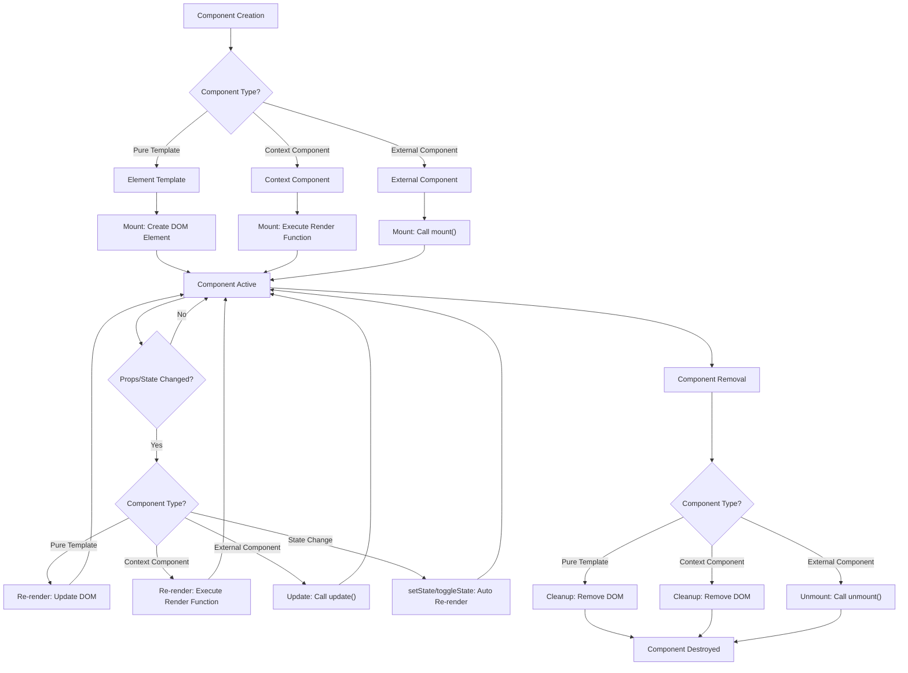
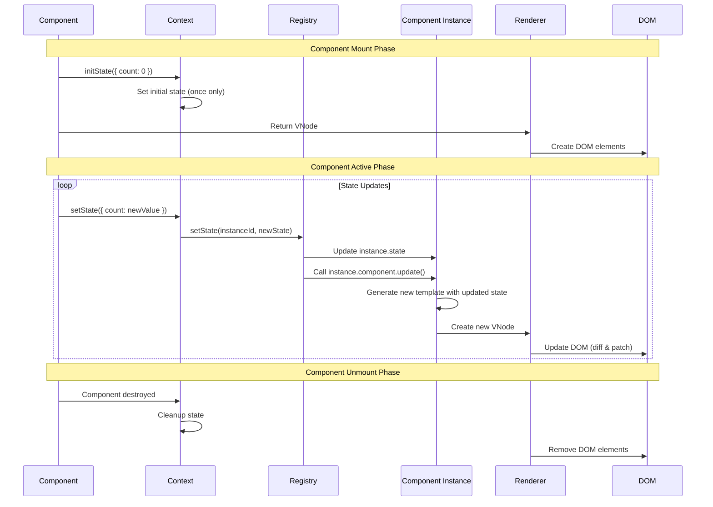

# Renderer Component Specification

## Purpose and Scope

This specification removes duplication from the `@barocss/renderer-dom` component docs and keeps only the essentials for component definition, lifecycle, and context. For DSL builders and template syntax, see `renderer-dom-dsl-spec.md`.

## Component Definition

### Component Types
- **Unified API**: `define(name, template)` - supports all component types
- **Registry API**: `registry.registerContextComponent(name, render, initialState?)` - direct registry access
- **Inline component**: pass a function directly in the DSL
- **External component**: register an implementation of the `ExternalComponent` interface
- **Function-based component**: `define(name, (props, context) => template)` - function that returns template

### Unified Component Definition

The `define()` function is the recommended way to define all component types:

**Important**: `define()` automatically converts all templates to components:
- `ElementTemplate` → automatically wrapped as `ComponentTemplate` (function component)
- All renderers are unified as components, simplifying the build process

```typescript
// ElementTemplate (automatically converted to ComponentTemplate)
define('button', element('button', { className: 'btn' }, [text('Button')]))
// Internally becomes: define('button', (props, ctx) => element('button', { className: 'btn' }, [text('Button')]))

// Explicit function component
define('counter', (props, context) => {
  context.initState({ count: 0 });
  return element('div', [text(`Count: ${context.state.count}`)]);
});
```

For DSL syntax details, see [Renderer DOM DSL Specification](./renderer-dom-dsl-spec.md).

### Registry API (Advanced)

For advanced use cases, you can use the registry directly:

```typescript
// Direct registry access
registry.registerContextComponent('button', (props, context) => {
  return element('button', { onClick: props.onClick }, [text(props.text)]);
});

// With initial state: object or (props) => object
registry.registerContextComponent(
  'counter',
  (props, context) => {
    const count = context.state.count || 0;
    return element('div', [
      text(`${count}`),
      element('button', { onClick: () => context.setState({ count: count + 1 }) }, [text('+')])
    ]);
  },
  { count: 0 }
);
```

**Note**: The `define()` function is recommended for most use cases as it provides a unified API and automatically handles registration.

### ComponentTemplate Interface

When using `define(name, template)`, the template is automatically converted to a `ComponentTemplate`:
- If `ElementTemplate` is passed → automatically wrapped as `(props, ctx) => ElementTemplate`
- If function is passed → used directly as component function

```typescript
interface ComponentTemplate {
  type: 'component';
  name: string; // component name (looked up in registry)
  props?: ComponentProps | ((data: ModelData) => ComponentProps); // props passed to component
  children?: ElementChild[]; // children (passed via slot/content)
  key?: string | ((data: ModelData) => string); // data-bc-sid key
  // Component function (for function-based components)
  component?: ContextualComponent;
  // Inline component metadata (optional)
  __inlineComponent?: ContextualComponent;
  __initialState?: ComponentState | ((props: ComponentProps) => ComponentState);
}
```

### Function-based Components

Function-based components receive the complete model data and can access nested properties:

```typescript
// Function-based component with full data access
define('bTable', (props, context) => {
  // props contains the complete model data
  return element('table', { className: 'table' }, [
    // Can access nested properties like props.attributes.caption
    ...(props?.attributes?.caption ? [
      element('caption', { className: 'table-caption' }, [
        data('attributes.caption') // Accesses props.attributes.caption
      ])
    ] : []),
    slot('content')
  ]);
});
```

**Key Features:**
- **Full Data Access**: The function receives the complete model data as `props`
- **Nested Property Access**: Can use `data('attributes.caption')` to access nested properties
- **Context Support**: Receives `ComponentContext` for state management
- **Template Return**: Must return an `ElementTemplate`

### Inline Component

Inline components are defined as functions and used directly in the DSL. For DSL syntax details, see [Renderer DOM DSL Specification](./renderer-dom-dsl-spec.md).

### External Component Interface

External components integrate with third-party libraries and provide flexible DOM management:

```typescript
interface ExternalComponent {
  // Template function (used by registerContextComponent)
  template?: ContextualComponent;
  
  // Mount component (append to DOM) - simplified signature
  mount(props: Record<string, any>, container: HTMLElement): HTMLElement;
  
  // Update component (props changed) - read-only access to state via instance.state
  update?(instance: ComponentInstance, prevProps: Record<string, any>, nextProps: Record<string, any>): void;
  
  // Unmount component (remove from DOM)
  unmount(instance: ComponentInstance): void;
  
  // Whether component manages DOM directly
  managesDOM?: boolean; // if true, children are not processed by reconcile
}
```

### DOM Creation Flexibility

ExternalComponent supports **three different approaches** for DOM creation:

#### 1. Traditional DOM API
```typescript
const TraditionalComponent: ExternalComponent = {
  mount: (props, container) => {
    const div = document.createElement('div');
    const span = document.createElement('span');
    const button = document.createElement('button');
    
    span.textContent = props.count || '0';
    button.textContent = '+';
    
    div.appendChild(span);
    div.appendChild(button);
    container.appendChild(div);
    
    return div;
  }
};
```

#### 2. innerHTML Approach
```typescript
const InnerHTMLComponent: ExternalComponent = {
  mount: (props, container) => {
    const div = document.createElement('div');
    div.innerHTML = `
      <div class="counter">
        <span class="count">${props.count || 0}</span>
        <button class="increment">+</button>
      </div>
    `;
    
    container.appendChild(div);
    return div;
  }
};
```

#### 3. Renderer DOM DSL
```typescript
const DSLComponent: ExternalComponent = {
  mount: (props, container) => {
    // Use our DSL for declarative DOM creation
    const template = element('div', { className: 'counter' }, [
      element('span', { className: 'count' }, [text(`${props.count || 0}`)]),
      element('button', { className: 'increment' }, [text('+')])
    ]);
    
    // Convert DSL to DOM
    const builder = new VNodeBuilder(registry);
    const vnode = builder.buildFromElementTemplate(template, props);
    const div = vnodeToDOM(vnode, container);
    
    container.appendChild(div);
    return div;
  }
};
```

### Approach Comparison

| Approach | Pros | Cons | Best For |
|----------|------|------|----------|
| **DOM API** | Fine-grained control, performance optimization | Verbose, complex | Complex DOM manipulation |
| **innerHTML** | Simple, fast, HTML-friendly | XSS risk, no type safety | Quick prototyping, simple structures |
| **DSL** | Type-safe, consistent, declarative | Learning curve, slight overhead | Complex UI, maintainability focus |

**Usage Examples:**

```typescript
// Pattern 1: Simple DOM-managing component (no context needed)
const SimpleCounter: ExternalComponent = {
  mount: (container, props, id) => {
    const div = document.createElement('div');
    div.innerHTML = `
      <div class="counter">
        <span class="count">0</span>
        <button class="increment">+</button>
      </div>
    `;
    
    const countSpan = div.querySelector('.count')!;
    const button = div.querySelector('.increment')!;
    let count = 0;
    
    button.addEventListener('click', () => {
      count++;
      countSpan.textContent = count.toString();
    });
    
    container.appendChild(div);
    return div;
  },
  
  update: (instance, prevProps, nextProps) => {
    // Simple prop-based updates
    const countSpan = instance.element.querySelector('.count')!;
    if (nextProps.initialCount !== prevProps.initialCount) {
      countSpan.textContent = nextProps.initialCount?.toString() || '0';
    }
  },
  
  unmount: (instance) => {
    instance.element.remove();
  }
};

// Pattern 2: DSL-based component (declarative approach)
const DSLCounter: ExternalComponent = {
  mount: (container, props, id) => {
    const template = element('div', { className: 'dsl-counter' }, [
      element('span', { className: 'count' }, [text(`${props.initialCount || 0}`)]),
      element('button', { className: 'increment' }, [text('+')]),
      element('button', { className: 'decrement' }, [text('-')])
    ]);
    
    const builder = new VNodeBuilder(registry);
    const vnode = builder.buildFromElementTemplate(template, props);
    const div = vnodeToDOM(vnode, container);
    
    // Add event listeners
    let count = props.initialCount || 0;
    const incrementBtn = div.querySelector('.increment')!;
    const decrementBtn = div.querySelector('.decrement')!;
    const countSpan = div.querySelector('.count')!;
    
    incrementBtn.addEventListener('click', () => {
      count++;
      countSpan.textContent = count.toString();
    });
    
    decrementBtn.addEventListener('click', () => {
      count--;
      countSpan.textContent = count.toString();
    });
    
    container.appendChild(div);
    return div;
  },
  
  update: (instance, prevProps, nextProps) => {
    const countSpan = instance.element.querySelector('.count')!;
    if (nextProps.initialCount !== prevProps.initialCount) {
      countSpan.textContent = nextProps.initialCount?.toString() || '0';
    }
  },
  
  unmount: (instance) => {
    instance.element.remove();
  }
};

// Pattern 3: Component with external state coordination (context useful)
const CoordinatedCounter: ExternalComponent = {
  mount: (container, props, id, context) => {
    const div = document.createElement('div');
    div.innerHTML = `
      <div class="coordinated-counter">
        <span class="count">0</span>
        <button class="increment">+</button>
        <button class="reset">Reset</button>
      </div>
    `;
    
    const countSpan = div.querySelector('.count')!;
    const incrementBtn = div.querySelector('.increment')!;
    const resetBtn = div.querySelector('.reset')!;
    
    const updateDisplay = () => {
      const count = context?.getState?.('count') || 0;
      countSpan.textContent = count.toString();
    };
    
    incrementBtn.addEventListener('click', () => {
      if (context?.getState && context?.setState) {
        const currentCount = context.getState('count') || 0;
        context.setState({ count: currentCount + 1 });
        updateDisplay();
      }
    });
    
    resetBtn.addEventListener('click', () => {
      if (context?.setState) {
        context.setState({ count: 0 });
        updateDisplay();
      }
    });
    
    // Initialize display
    updateDisplay();
    
    container.appendChild(div);
    return div;
  },
  
  update: (instance, prevProps, nextProps) => {
    // Read-only access to state via instance.state
    const countSpan = instance.element.querySelector('.count')!;
    const count = instance.state.count || 0;
    countSpan.textContent = count.toString();
  },
  
  unmount: (instance, context) => {
    // Clean up any context-related resources
    instance.element.remove();
  }
};
```

**Key Design Principles:**

1. **Context Optional**: `mount` and `unmount` can optionally receive `context` for state management
2. **Read-only Update**: `update` method has read-only access to state via `instance.state`
3. **No State Mutation in Update**: Prevents infinite update loops by removing `setState` from update cycle
4. **Clear Role Separation**:
   - `mount`: Initialization and state setup
   - `update`: Read-only state access and DOM updates
   - `unmount`: Cleanup operations

For DSL syntax details, see [Renderer DOM DSL Specification](./renderer-dom-dsl-spec.md).

## Lifecycle

### Component Lifecycle

1. **Mount**: On first render, call `mount(container, props, id, context?)` or execute the render function of registered/inline components
2. **Update**: On props/state changes, registered/inline components re-render; external components call `update(instance, prevProps, nextProps)` with read-only state access
3. **Unmount**: On removal, call `unmount(instance, context?)` and clean up resources

#### Lifecycle Diagram



### DOM Management Policy

- **managesDOM=false**: The renderer manages child DOM; the component reacts to props
- **managesDOM=true**: The component manages child DOM directly; the renderer preserves the area

### State Management Lifecycle

#### State Management Diagram



#### State Management Code Example

```typescript
// 1. Initial state setup (once per component instance)
define('counter', (props, context) => {
  context.initState({ count: 0 }); // Called only once
  return element('div', [text(`Count: ${context.state.count}`)]);
});

// 2. State updates (trigger automatic re-render)
context.setState({ count: context.state.count + 1 });

// 3. Toggle state (for boolean values)
context.toggleState('isVisible');

// 4. State access
const currentState = context.getState();
const currentCount = context.state.count;
```

#### State Management Implementation Details

The state management system works as follows:

1. **`initState(initialState)`**: Sets initial state during component mount (called only once)
2. **`setState(newState)`**: Updates state and triggers automatic re-render via `instance.component.update()`
3. **`toggleState(key)`**: Toggles boolean state and triggers automatic re-render
4. **`getState()`**: Retrieves current state object

When `setState` or `toggleState` is called:
- The Registry updates the component instance's state
- The Registry calls `instance.component.update()` to trigger re-render
- A new template is generated with the updated state
- The DOM is updated through the reconciliation process

For DSL syntax details, see [Renderer DOM DSL Specification](./renderer-dom-dsl-spec.md).

## Context

The `context` object provides state management, event handling, and communication capabilities for components.

### State Management
- **Read**: `context.state` or `context.getState()`
- **Initialize**: `context.initState(initial)` (once per instance)
- **Update**: `context.setState(partial)` → triggers re-render of the specific instance only

```typescript
// Using define() with context
define('counter', (props, context) => {
  context.initState({ count: 0 });
  return element('div', [
    text(`Count: ${context.state.count}`),
    element('button', { 
      onClick: () => context.setState({ count: context.state.count + 1 }) 
    }, [text('+')])
  ]);
});
```

For DSL syntax details, see [Renderer DOM DSL Specification](./renderer-dom-dsl-spec.md).

### Component Communication
Components communicate through:

- **Props**: Parent-to-child data flow
- **State**: Component-local state management

For DSL syntax details, see [Renderer DOM DSL Specification](./renderer-dom-dsl-spec.md).

### Complete Context API

```typescript
interface ComponentContext {
  id: string;                    // Unique component instance ID
  state: Record<string, any>;    // Current state
  props: Record<string, any>;    // Current props
  registry: RendererRegistry;    // Registry reference
  setState: (newState: Record<string, any>) => void;  // Update state
  getState: () => Record<string, any>;                // Get current state
  initState: (initialState: Record<string, any>) => void; // Set initial state (once)
}
```

## References

- [Renderer DOM Specification](./renderer-dom-spec.md) - Core rendering system
- [Renderer DOM DSL Specification](./renderer-dom-dsl-spec.md) - DSL syntax and template expressions

