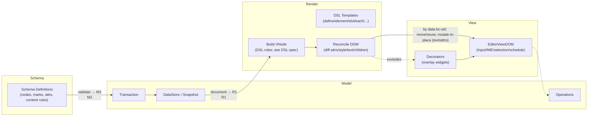
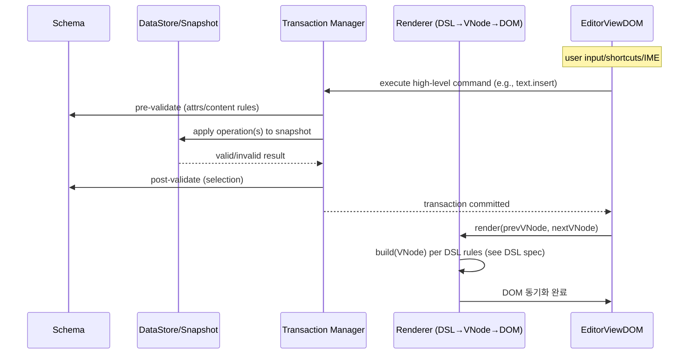
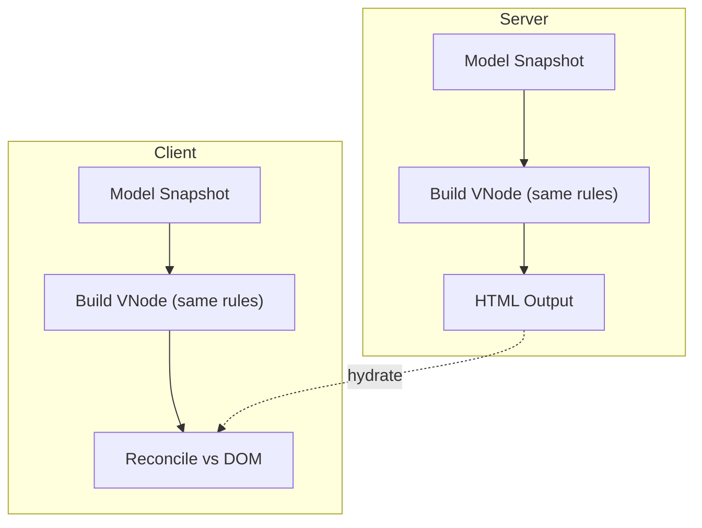
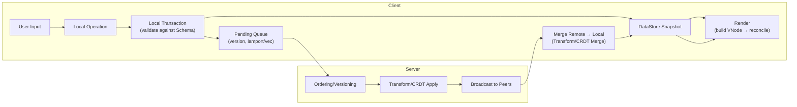
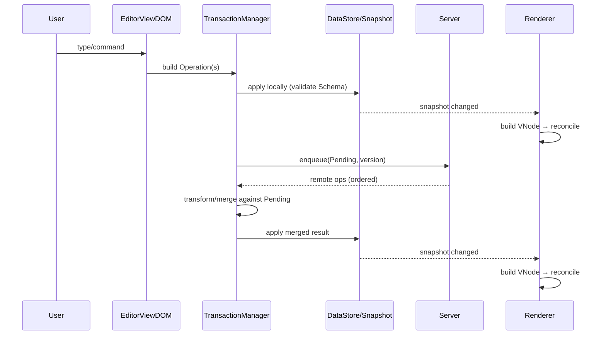

# Schema ↔ Model ↔ Render Integration Specification

## 1. Purpose

This document specifies, at the boundary/relationship level, how `Schema` (document type system), `Model` (document data/transactions), and `Render` (VNode→DOM synchronization) interact in the Barocss editor. Implementation references: `@barocss/schema`, `@barocss/model`, `@barocss/renderer-dom`, `@barocss/editor-view-dom`.

## 2. Concept overview

- Schema: static specification of node/mark types, attributes, and content rules.
- Model: concrete document data and transaction system that conforms to Schema.
- Render: builds VNodes from the Model via DSL templates and reconciles them to the DOM.

Core principles:
- Validation happens at the Model boundary; Render receives trusted input (Model→VNode).
- The DSL is declarative; runtime branching is minimized.
- Editing policy (IME/selection/shortcuts) lives outside Render, in `editor-view-*`.

## 2.1 High-level flow (logical)



Interpretation:
- Schema is enforced in transaction phases (pre/post validation).
- Render reads a Model snapshot and performs one-way sync DSL→VNode→DOM.
- View handles input/selection/scheduling; decorators render as a separate tree.

## 3. Contract summary (relations)

- Scope: inter-layer contract for Model→VNode→DOM, not DSL internals.
- DSL surface and rules (branching, dynamic tags, children normalization, mark handling) are specified elsewhere.
- Contract:
  - Build output must be a valid VNode tree containing only node types supported by the reconciler.
  - The input Model is a read-only snapshot; building must not mutate it.
  - Schema provides pre/post-transaction validation; Render operates assuming schema-valid input.

See DSL specs: `paper/renderer-dom-dsl-spec.md`, `paper/renderer-mark-spec.md`.

See also: `paper/renderer-dom-spec.md`, `paper/reconcile-algorithm.md`.

## 4. Boundaries and data flow

### 4.1 End-to-end pipeline

1) Load/define Schema → 2) Create/validate Model → 3) Define/register DSL templates → 4) Build (Model→VNode) → 5) Reconcile (VNode→DOM) → 6) Render decorators (separate tree).

Invariants:
- The Model remains schema-valid (Render assumes validated input).
- The VNode tree conforms to build rules and supported node types.
- Reconcile is pure DOM sync; editing policy is out-of-scope.

### 4.2 Detailed I/O flow



Key points:
- Transactions ensure consistency via pre/post validation; the renderer consumes only validated data.


### 4.3 Responsibility separation

- Schema: source of truth for rules.
- Model: application of rules and changes (transactions, history).
- Render: visualization (pure sync) and external component hosting.
- Editor View: input/selection/shortcuts/scheduling/decorators.

### 4.4 Selection stability contract (keyed reconcile)

Goal: keep the browser DOM selection stable across renders when possible.

Contract:
- The reconciler prefers minimal DOM edits and preserves node identity.
- Lists are diffed by stable domain IDs (`data-bc-sid`), so existing elements are moved/reused instead of re-created.
- Text updates mutate the existing Text node (`nodeValue`) rather than replacing it; attribute/style updates mutate the same Element.
- If the nodes referenced by `selection.anchorNode`/`focusNode` survive (same instances), the native selection remains intact.
- When structural changes are unavoidable (type change, split/merge, deleted node, or remote edits that replace the active node), selection is re-mapped from model absolute positions after reconcile and re-applied to the new DOM nodes.

Implications:
- Upstream edits (e.g., inserting a block above) should not disturb selection if the selected node’s identity is preserved via keyed reuse and move-only operations.
- Replacement happens only on incompatibility (different tag/component type) or when algorithmically required by the merge; in those cases the view layer must re-apply selection using the model position mapper.

## 5. Identifiers and keys

- Model: every node has a globally unique `id`; parent-child relations are expressed by `content` (ID arrays).
- Render: prefer domain IDs as keys (e.g., `data-bc-sid`) to stabilize reuse/moves.
- DOM mapping: use `data-bc-sid` and `data-bc-stype` for bi-directional lookup. See `paper/dom-mapping-spec.md`.

## 6. Selection/Hydration/SSR integration

- Selection: DOM Selection ↔ Model absolute-position conversion. See `paper/dom-selection-sync-spec.md`.
- Hydration/SSR: server and client use the same DSL rules to build VNodes; outputs should be structurally equivalent (keys/order preserved).

### 6.1 SSR/Hydration 파이프라인 다이어그램



Guarantees:
- Server and client build VNodes using the same DSL rules (defined in the DSL spec), preserving structural equivalence and key/order consistency.


## 7. Concurrent editing (collaboration) flow

This document specifies the minimal flow from a boundary/relationship perspective. OT/CRDT algorithmic details are delegated to separate specs; the contract below must hold.

### 7.1 Logical flow (relations)



Contract summary:
- Local input is committed as a transaction validated against Schema (optimistic updates allowed).
- The server ensures convergence via ordering/versioning and OT transform or CRDT application.
- The client merges remote changes against its Pending Queue, applies to the snapshot, then re-renders.
- Render remains one-way Model→VNode→DOM and is agnostic of merge/network policy.

### 7.2 Detailed sequence (optimistic apply + remote merge)



Consistency guard points:
- Version/vector clocks prevent duplicate/out-of-order application.
- Changes that fail Schema validation after transform/merge are rejected (or corrected).
- Cursor/selection are re-mapped by the decorator/mapping layer with version-aware mapping.

See also: `paper/absolute-position-spec.md`, `paper/dom-selection-sync-spec.md` for position mapping details.

## 8. References

- Schema: `paper/schema-spec.md`
- Model: `paper/model-spec.md`, `paper/datastore-spec.md`, `paper/datasnapshot-spec.md`
- Render: `paper/renderer-dom-spec.md`, `paper/renderer-dom-dsl-spec.md`, `paper/reconcile-algorithm.md`
- Selection/Mapping/Decorators: `paper/dom-selection-sync-spec.md`, `paper/dom-mapping-spec.md`, `paper/renderer-decorator-spec.md`
- Architecture overviews: `paper/barocss-architecture-spec.md`, `paper/declarative-editor-rendering-architecture.md`


## Appendix A. Reconcile observability & control (proposed API)

Purpose: expose minimal, low-overhead hooks and stats so callers can debug, profile, and enforce policies without changing core reconcile logic.

### A.1 Hooks (optional, off by default)

Renderer options shape:
```ts
type ReconcilePhase = 'insert' | 'update' | 'remove' | 'replace';

interface ReconcileHooks {
  onReconcileStart?(e: { container: HTMLElement; prevVNode: any | null; nextVNode: any; ts: number }): void;
  onReconcileEnd?(e: { container: HTMLElement; prevVNode: any | null; nextVNode: any; ts: number; stats: ReconcileStats }): void;

  onNodeBefore?(e: { vnode: any; dom: Node | null; phase: ReconcilePhase }): void;
  onNodeAfter?(e: { vnode: any; dom: Node | null; phase: ReconcilePhase; durationMs: number; delta?: unknown }): void;

  onNodeForcedReplace?(e: {
    reason: 'tag-mismatch' | 'component-mismatch' | 'namespace-mismatch';
    path: string; // e.g. '0/3/2'
    prev: { tag?: string; key?: string; component?: string };
    next: { tag?: string; key?: string; component?: string };
  }): void;
}

interface RendererOptions {
  hooks?: ReconcileHooks;
  debug?: {
    collectStats?: boolean;        // default false
    logForcedReplace?: boolean;    // default false
  };
}
```

### A.2 Stats (collected when enabled)

```ts
interface ReconcileStats {
  counts: {
    insert: number;
    update: number;
    move: number;
    remove: number;
    replace: number;
    textMutate: number;
    attrMutate: number;
    styleMutate: number;
  };
  timings: {
    buildMs?: number;    // if renderer measures build separately
    reconcileMs: number;
    totalMs?: number;    // build + reconcile
  };
  moves?: string[];      // data-bc-sid ids moved (optional)
}
```

Collection points:
- increment counts in child-diff loops, attribute/style update routines, and text mutations.
- emit `onNodeForcedReplace` when `shouldReplace(prev,next)` triggers due to type/tag/component mismatch.
- return/emit stats at `onReconcileEnd`.

Performance notes:
- Hooks run only when provided; fast path is a no-op.
- Avoid path string construction unless `logForcedReplace` is enabled.
- Intended for dev/test; default production config keeps all disabled.

