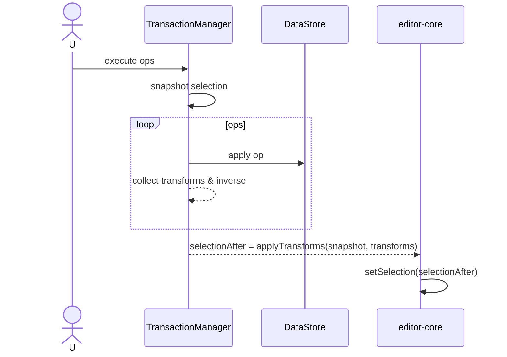

# Selection Mapping Specification

## Overview

Selection is owned by editor-core. During transactions, a "local Selection" created via `editor.selection.clone()` is injected into the context for operations to compute and update. UI Selection is applied only once after commit. This document defines a nodeId+offset-based approach that sequentially updates the local Selection to produce the final SelectionAfter.

## Principles

- Ownership: selection state is managed by editor-core.
- No mid-op UI mutation: do not change editor-core Selection during `defineOperation` execution (only update local Selection).
- Node/offset only: use only (nodeId, offset), not absolute coordinates.
- Deterministic: same inputs (transaction, initial selection) always produce the same selectionAfter.

## Data Model

### Selection Snapshot
```ts
type ModelSelection = {
  anchorId: string; anchorOffset: number;
  focusId: string;  focusOffset: number;
};
```

### Local Selection in Context
Operations update the local Selection directly. This local Selection is created via `editor.selection.clone()` and provided in the transaction context.
```ts
type ModelSelection = {
  anchorId: string; anchorOffset: number;
  focusId: string;  focusOffset: number;
};

type SelectionContext = {
  // Snapshot at transaction start
  before: ModelSelection;
  // Current value updated by operations (final SelectionAfter)
  current: ModelSelection;
  // Utils: safe correction methods (optional)
  setSelection(next: ModelSelection): void;           // includes clamp/correction
  setCaret(nodeId: string, offset: number): void;     // single caret
  setRange(aId: string, aOff: number, fId: string, fOff: number): void;
};
```
Each `defineOperation` calls `context.selection.set*` APIs as needed to update the local Selection (but does not change editor-core Selection).

## Transaction-time Application

1) TransactionManager creates `before` via `editor.selection.clone()` at transaction start and initializes `current` with the same value.
2) During each operation execution, update `current` via `context.selection.set*` if needed.
3) At transaction end, finalize `selectionBefore=before`, `selectionAfter=current`.
4) editor-core sets `selectionAfter` once via `setSelection` after commit.

No composite mapper is needed; operations update the local Selection immediately, so the implementation is simple.

## Operation Guidelines

- insertText(nodeId, pos, text)
  - if `selection.current.anchorId===nodeId && anchorOffset≥pos` → `anchorOffset+=len(text)`
  - same rule for focus; move caret to `pos+len(text)` if needed
- deleteTextRange(nodeId, start, end)
  - same nodeId: if `offset∈[start,end)` → clamp to `start`, if `offset≥end` → `offset-= (end-start)`
- replaceText(nodeId, start, end, newText)
  - apply the two rules in order (delete then shift by insertion length)
- wrap/unwrap/moveNode
  - if selection spans a moved node, correct to the nearest valid text node (correction rules encapsulated in selectionManager utils)

All transformations work with nodeId+offset only; range selections apply to (anchor, focus) separately.

## Application Rules

Pseudo-code (local Selection update within transaction):
```ts
// TransactionManager
const before = editor.selection.clone();
const current = { ...before };
const selection = makeSelectionContext(before, current, dataStore /*correction utils*/);

for (const op of ops) {
  await def.execute(op, { dataStore, schema, selection });
}

return { selectionBefore: before, selectionAfter: current };
```

Correction rules are encapsulated in `selectionContext.set*` implementations. Use DataStore/PositionCalculator as needed to move to the nearest valid text node and offset.

## Examples

### Insert Text then Delete Range
1) insertText(text-1, pos=5, "+") → shift fromOffset=5, delta=+1
2) deleteTextRange(text-1, start=6, end=10) → clampDelete(6..10)

Initial selection: (text-1, 7) → becomes 8 after 1), clamped to 6 after 2).

### Wrap then Move
1) wrap([text-1, text-2]) → wrapperId=para-2
2) moveNode(text-2, newParent=listItem-3, toIndex=0)

If range selection spans text-2, adjust to the new position via remapIfMoved rules.

## Integration

- defineOperation: result includes transforms and inverse.
- TransactionManager: captures selectionSnapshot, applies transforms sequentially to compute selectionAfter, editor-core applies once after commit.
- History: record selectionBefore/After in HistoryEntry to ensure deterministic undo/redo.

## Mermaid



