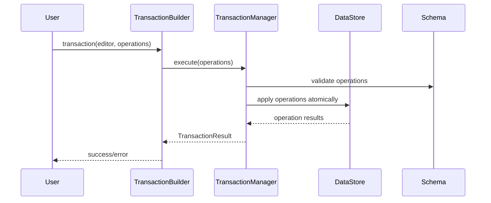

# Transaction DSL Final Specification

## 1. Overview

Transaction DSL is a **declarative transaction system**. This is the final specification based on actual implemented code.

### 1.1 Core Philosophy
- **Declarative structure**: compose transactions with function-based DSL
- **Consistency**: consistent patterns and syntax
- **Type safety**: full TypeScript type support
- **Extensibility**: easy to add new operations
- **Atomicity**: all operations succeed or all fail

### 1.2 Key Benefits
- **Consistent syntax**: minimize learning cost with consistent patterns
- **Declarative structure**: clear function call structure instead of complex chaining
- **Type safety**: full TypeScript support
- **Extensibility**: easy to add new operations and helper functions
- **Implementation-based**: specification based on tested actual code

## 2. Architecture

### 2.1 Core DSL Functions

#### 2.1.1 Transaction Function
```typescript
function transaction(editor: Editor, operations: (TransactionOperation | TransactionOperation[])[]): TransactionBuilder
```

**Actual implementation:**
- `editor`: Editor instance (for DataStore access)
- `operations`: array of operations to execute (supports nested arrays)
- Returns: `TransactionBuilder` interface

#### 2.1.2 TransactionBuilder Interface
```typescript
interface TransactionBuilder {
  commit(): Promise<TransactionResult>;
}
```

**Actual implementation:**
- `commit()`: executes transaction and returns result
- Uses `TransactionManager` internally for atomic execution

#### 2.1.3 Create Function
```typescript
function create(node: INode, options?: any): CreateOperation
```

**Important usage:**
- `create()` function creates nested structures at once
- No need to set `parentId` separately (nested relationships are expressed via `content` array)
- Includes automatic ID generation and Schema validation

**Correct usage:**
```typescript
// ✅ Correct way (nested structure)
const nested = create({
  type: 'paragraph',
  content: [
    {
      type: 'inline-text', 
      text: 'Hello'
    }
  ]
});

// ❌ Incorrect way (using parentId)
const parent = create({ type: 'paragraph', content: [] });
const child = create({ type: 'inline-text', text: 'Hello', parentId: 'parent-sid' });
```

**Actual implementation:**
- `node`: node to create (INode type)
- `options`: creation options (optional)
- Returns: `CreateOperation` object

#### 2.1.4 Control Function
```typescript
function control(target: HandleOrId, actions: Array<{ type: string; payload?: any }>): TransactionOperation[]
```

**Actual implementation:**
- `target`: target node ID (passed as `nodeId` in control DSL)
- `actions`: array of actions to execute
- Automatically adds `nodeId` to each action and returns

**Important structure:**
Control DSL is transformed as follows:
```typescript
// Input
control('node-1', [{ type: 'setAttrs', payload: { attrs: { level: 2 } } }])

// Transformed result
[{ type: 'setAttrs', payload: { attrs: { level: 2 }, nodeId: 'node-1' } }]
```

**How to access in Operation:**
```typescript
defineOperation('setAttrs', async (operation: any, context: TransactionContext) => {
  const { nodeId, attrs } = operation.payload; // ✅ Correct
  // operation.nodeId ❌ Incorrect
});
```

#### 2.1.5 Helper Functions

##### Node Helper
```typescript
function node(type: string, attributes?: Record<string, any>, content?: INode[]): INode
```

**Actual implementation:**
- Creates container nodes (paragraph, heading, list, etc.)
- `attributes`: node attributes
- `content`: array of child nodes

##### TextNode Helper (overloads)
```typescript
function textNode(type: string, text: string): INode;
function textNode(type: string, text: string, marks: MarkDescriptor[]): INode;
function textNode(type: string, text: string, attributes: Record<string, any>): INode;
function textNode(type: string, text: string, marks: MarkDescriptor[], attributes: Record<string, any>): INode;
```

**Actual implementation:**
- Creates text nodes (inline-text, codeBlock, etc.)
- Supports flexible usage with 4 overloads
- `marks`: mark array (optional)
- `attributes`: attribute object (optional)

##### Mark Helper
```typescript
function mark(type: string, attrs?: Record<string, any>): MarkDescriptor
```

**Actual implementation:**
- Creates marks
- Automatically extracts `range` attribute from `attrs`
- `range`: range in [start, end) format (optional)

## 3. Type Definitions

### 3.1 Core Types
```typescript
export type HandleOrId = string;

export type MarkDescriptor = { 
  type: string; 
  attrs?: Record<string, any>; 
  range?: [number, number] 
};

export type DirectOperation = { type: string; payload?: any };
export type DeleteOperation = { type: 'delete'; nodeId: string };
export type SelectionOperation = { type: 'setSelection'; selection: any };

export type TransactionOperation = DirectOperation | DeleteOperation | SelectionOperation;

export interface OperationExecuteResult {
  ok: boolean;
  data: any;        // updated node or result data
  inverse: {        // inverse operation definition
    type: string;
    payload: any;
  };
}
```

### 3.2 Operation Types
```typescript
export interface CreateOperation {
  type: 'create';
  payload: {
    node: INode;
    options?: any;
  };
}
```

## 4. Usage Examples

### 4.1 Basic Node Creation
```typescript
import { transaction, create, node, textNode } from '@barocss/model';

// Create simple text node
const result = await transaction(editor, [
  create(textNode('inline-text', 'Hello World'))
]).commit();

// Create container node
const result = await transaction(editor, [
  create(node('paragraph', {}, [
    textNode('inline-text', 'Hello'),
    textNode('inline-text', 'World')
  ]))
]).commit();
```

### 4.2 Text with Marks
```typescript
import { transaction, create, textNode, mark } from '@barocss/model';

// Text with marks
const result = await transaction(editor, [
  create(textNode('inline-text', 'Bold text', [mark('bold')]))
]).commit();

// Text with both marks and attributes
const result = await transaction(editor, [
  create(textNode('inline-text', 'Styled text', [mark('bold')], { class: 'highlight' }))
]).commit();
```

### 4.3 Control Operations
```typescript
import { transaction, create, control, textNode } from '@barocss/model';

// Create node then control
const createResult = await transaction(editor, [
  create(textNode('inline-text', 'Hello World'))
]).commit();

const textNodeId = createResult.operations?.[0].result.data.sid;

// Replace text
const controlResult = await transaction(editor, [
  control(textNodeId, [
    { type: 'setText', payload: { text: 'Hello Universe' } }
  ])
]).commit();
```

### 4.4 Complex Nested Structure
```typescript
import { transaction, create, node, textNode, mark } from '@barocss/model';

const result = await transaction(editor, [
  create(node('document', {}, [
    node('heading', { level: 1 }, [
      textNode('inline-text', 'Title')
    ]),
    node('paragraph', {}, [
      textNode('inline-text', 'This is '),
      textNode('inline-text', 'bold text', [mark('bold')]),
      textNode('inline-text', ' and this is '),
      textNode('inline-text', 'italic text', [mark('italic')])
    ])
  ]))
]).commit();
```

## 5. Operation System

### 5.1 defineOperation Pattern
```typescript
defineOperation('operationType', async (operation: any, context: TransactionContext) => {
  // Operation execution logic
  const payload = operation.payload;
  // ...
  return result;
});
```

### 5.2 defineOperationDSL Pattern
```typescript
export const operationName = defineOperationDSL('operationType', (param1, param2) => ({
  type: 'operationType',
  payload: { param1, param2 }
}));
```

### 5.3 Available Operations
- **create**: create node
- **setText**: set text
- **setAttrs**: set attributes
- **setMarks**: set marks
- **applyMark**: apply mark
- **removeMark**: remove mark
- **toggleMark**: toggle mark
- **wrap**: wrap text
- **unwrap**: unwrap text
- **addChild**: add child node
- **replaceText**: replace text
- **insertText**: insert text
- **deleteTextRange**: delete text range

## 6. Transaction Flow

### 6.1 Execution Flow


### 6.2 Error Handling
- **Schema Validation**: entire transaction fails if schema validation fails
- **Operation Errors**: entire transaction fails if any individual operation fails
- **Rollback**: automatically rollback all changes on failure

## 7. Integration with DataStore

### 7.1 Schema Integration
- Automatically sets DataStore's active schema in TransactionManager
- All operations go through schema validation
- Immediate failure on schema violations

### 7.2 Lock Management
- TransactionManager automatically manages locks
- Prevents concurrent transactions
- Ensures atomic execution

## 8. Testing

### 8.1 Test Structure
```typescript
describe('Transaction DSL', () => {
  let editor: Editor;
  let dataStore: DataStore;
  let schema: Schema;

  beforeEach(() => {
    // Test setup
  });

  it('should create simple text node', async () => {
    const result = await transaction(editor, [
      create(textNode('inline-text', 'Hello World'))
    ]).commit();

    expect(result.success).toBe(true);
    expect(result.operations).toHaveLength(1);
  });
});
```

### 8.2 Test Categories
- **Basic Syntax Tests**: basic behavior of DSL helper functions
- **Create Tests**: node creation operation tests
- **Control Tests**: node control operation tests
- **Integration Tests**: complex scenario tests
- **Scenario Tests**: real-world use case tests


## 9. Best Practices

### 9.1 Operation Design
- Each operation should have a single responsibility
- Use `defineOperation` and `defineOperationDSL` patterns consistently
- Implement error handling clearly

### 9.2 DSL Usage
- Use `node()` for container nodes, `textNode()` for text nodes
- Use `textNode()` overloads appropriately
- Use `control()` to control existing nodes

### 9.3 Operation Structure
- All operations return `OperationExecuteResult` structure
- Access updated nodes via `result.data`
- Define inverse operations via `result.inverse`

### 9.4 Control DSL Structure
- Control DSL passes nodeId via `operation.payload.nodeId`
- Extract parameters from `operation.payload` in operations
- Direct access to `operation.nodeId` is not supported

### 9.5 Operation Registration
- All operations must be registered in `register-operations.ts`
- Operations defined with `defineOperation` are automatically registered in global registry
- Operations used in tests must be registered

### 9.6 Node ID Handling
- `create` operation automatically generates IDs (Figma style)
- Explicit ID specification in tests may be ignored
- Access generated node ID via `result.data.sid`
- Other operations like `update`, `delete` must use generated IDs

### 9.7 Functional DSL (op function)

The `op()` function is a functional DSL for complex logic and flow control. Unlike the existing declarative DSL, it allows imperative programming style for complex tasks.

#### 9.7.1 Basic Concept

```typescript
// Function signature
function op(operationFn: (context: TransactionContext) => OpResult | void | Promise<OpResult | void>): OpFunction

// Usage example
const result = await transaction(editor, [
  op(async (ctx) => {
    // Perform complex logic
    const node = ctx.dataStore.createNodeWithChildren(
      textNode('inline-text', 'Hello'),
      ctx.schema
    );
    
    return {
      success: true,
      data: node
    };
  })
]).commit();
```

#### 9.7.2 TransactionContext

The `op` function receives `TransactionContext` as a parameter:

```typescript
interface TransactionContext {
  dataStore: DataStore;           // DataStore instance (can manipulate directly)
  selectionManager: SelectionManager; // SelectionManager instance
  selection?: ModelSelection;     // current selection
  schema?: any;                   // Schema instance
  selectAbsoluteRange: (start: number, end: number) => void; // select by absolute position
  resolveAbsolute: (position: number) => { nodeId: string; offset: number } | null; // resolve position
}
```

#### 9.7.3 OpResult Structure

```typescript
interface OpResult {
  success: boolean;                    // success/failure status
  data?: any;                         // result data
  error?: string;                     // error message (when success: false)
  inverse?: TransactionOperation;     // inverse operation (for undo)
}
```

#### 9.7.4 Supported Return Types

**1. void (returns nothing)**
```typescript
op(async (ctx) => {
  // Only perform side effects (logging, state changes, etc.)
  // Return nothing
})
```

**2. OpResult (success/failure result)**
```typescript
op(async (ctx) => {
  const node = ctx.dataStore.createNodeWithChildren(
    textNode('inline-text', 'Hello'),
    ctx.schema
  );
  
  return {
    success: true,
    data: node
  };
})
```

**3. OpResult with inverse (specify inverse)**
```typescript
op(async (ctx) => {
  const node = ctx.dataStore.createNodeWithChildren(
    textNode('inline-text', 'With inverse'),
    ctx.schema
  );
  
  return {
    success: true,
    data: node,
    inverse: { type: 'delete', payload: { nodeId: node.sid } }
  };
})
```

**4. Failure case**
```typescript
op(async (ctx) => {
  const condition = false;
  if (condition) {
    return {
      success: true,
      data: ctx.dataStore.createNodeWithChildren(textNode('inline-text', 'Created'), ctx.schema)
    };
  } else {
    return {
      success: false,
      error: 'Condition not met'
    };
  }
})
```

#### 9.7.5 Execution Flow

1. **Transaction start**: call `transaction(editor, [op(...)])`
2. **Operation registration**: `op` function is converted to `OpFunction` object
3. **Transaction commit**: `TransactionManager` executes when `commit()` is called
4. **OpFunction execution**: `opFn.execute(context)` is called in `_executeOpFunction`
5. **Result processing**: handle `OpResult` or `void` return value
6. **Operation creation**: `OpResult` does not immediately create an operation (inverse is for undo)

#### 9.7.6 Mixing with Existing DSL

```typescript
const result = await transaction(editor, [
  // Existing declarative DSL
  create(textNode('inline-text', 'Regular operation')),
  
  // Functional DSL
  op(async (ctx) => {
    // Execute custom logic
    return { success: true };
  }),
  
  // Back to declarative DSL
  control('node-sid', setText('Updated text'))
]).commit();
```

#### 9.7.7 Key Features

- **Async support**: full support for `async/await` pattern
- **Direct DataStore manipulation**: direct data manipulation via `ctx.dataStore`
- **Conditional execution**: implement complex logic with regular JavaScript syntax
- **Error handling**: clear error handling via `try/catch` and `OpResult.error`
- **Inverse support**: define undo behavior via `inverse` property
- **Transaction safety**: all changes execute safely within transaction

#### 9.7.8 Notes

- `op((ctx) => { return { type, payload } })` form is not supported
- Use only the same `OpResult` structure as `defineOperation`
- `inverse` is not executed immediately but used later for undo
- Returning `OpResult` does not add to `result.operations` (inverse is for undo)

### 9.8 Testing
- Minimize mock usage, use actual DataStore
- Verify results via `result.operations`
- Test various scenarios

## 10. History System Integration

### 10.1 Overview
Transaction DSL is fully integrated with the History System, providing undo/redo functionality.

### 10.2 Automatic History Management
```typescript
// Automatically added to history when transaction executes
await editor.transaction([
  create(textNode('paragraph', 'Hello')),
  setText('node-1', 'World')
]).commit();

// Can undo
await editor.undo();

// Can redo
await editor.redo();
```

### 10.3 History Configuration
```typescript
const editor = new Editor({
  history: {
    maxSize: 100           // maximum history size
  }
});
```


### 10.5 History Exclusion Rules
The following operation types are automatically excluded from history:
- `log`, `measure`: for debugging/measurement
- `undo`, `redo`: history-related
- `selectRange`, `selectNode`, `clearSelection`: selection changes

## 11. Future Extensions

### 11.1 Planned Features
- Add more operation types
- Extend plugin system
- Performance optimization
- History compression and optimization

### 11.2 API Stability
- Current API is stabilized
- New features follow existing patterns

---

This specification is based on actual implemented code, and all examples are verified code that has passed tests.
