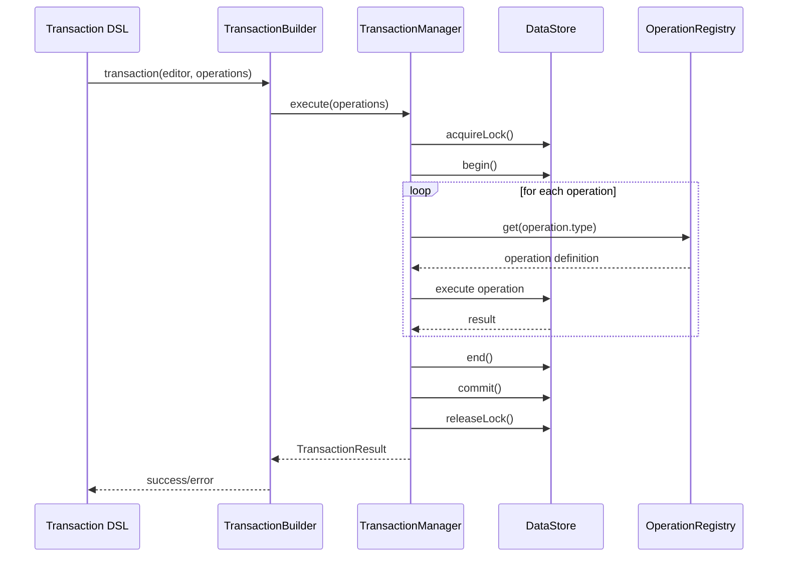
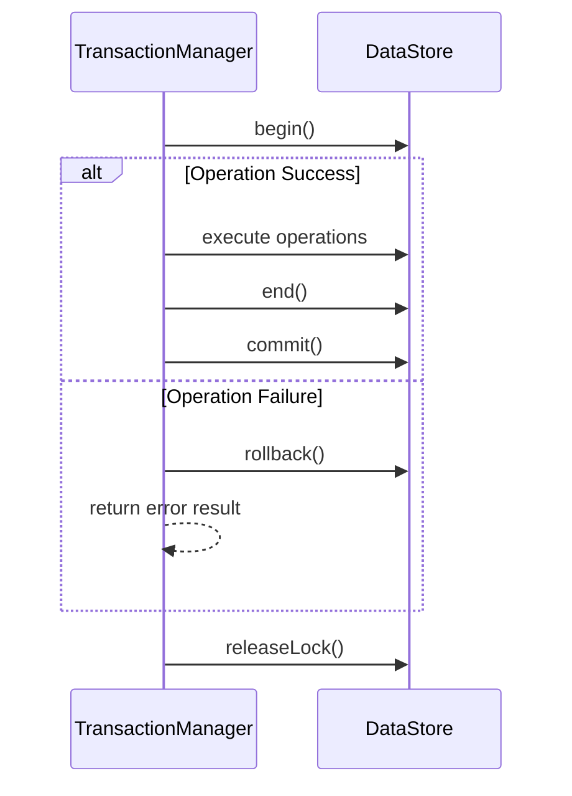

# Transaction System Specification

## 1. Overview

The Transaction system is a core part of the Barocss Model that guarantees data consistency and atomicity. This final specification is based on the actual implementation.

### 1.1 Key Characteristics
- **Atomicity**: all changes succeed or all fail
- **Consistency**: schema validation enforces data integrity
- **Isolation**: global lock controls concurrency
- **Durability**: DataStore overlay commits safely
- **Extensibility**: easy to add new operations

### 1.2 Main Components
- **TransactionManager**: executes and manages transactions
- **TransactionBuilder**: builds transactions via DSL
- **GlobalOperationRegistry**: registers and looks up operations
- **DataStore Integration**: schema validation and data storage

## 2. Architecture

### 2.1 Core Components

#### 2.1.1 TransactionManager
```typescript
export class TransactionManager {
  private _dataStore: DataStore;
  private _currentTransaction: Transaction | null = null;
  private _selectionManager?: any;
  private _schema?: any;

  constructor(dataStore: DataStore);
  setSelectionManager(selectionManager: any): void;
  setSchema(schema: any): void;
  async execute(operations: any[]): Promise<TransactionResult>;
  async createNode(node: INode): Promise<TransactionResult>;
  async updateNode(nodeId: string, updates: Partial<INode>): Promise<TransactionResult>;
  async deleteNode(nodeId: string): Promise<TransactionResult>;
  isInTransaction(): boolean;
  getCurrentTransaction(): Transaction | null;
}
```

**Responsibilities:**
- Execute and manage transactions
- Acquire/release global lock
- Manage DataStore overlay transactions
- Execute operations and collect results
- Handle errors and rollback

#### 2.1.2 TransactionBuilder
```typescript
export interface TransactionBuilder {
  commit(): Promise<TransactionResult>;
}

class TransactionBuilderImpl implements TransactionBuilder {
  private editor: Editor;
  private ops: TransactionOperation[];
  
  constructor(editor: Editor, ops: TransactionOperation[]);
  async commit(): Promise<TransactionResult>;
}
```

**Responsibilities:**
- Build transactions via DSL
- Integrate with Editor and DataStore
- Auto-apply schema
- Run through TransactionManager

### 2.2 Type Definitions

#### 2.2.1 Transaction Interface
```typescript
export interface Transaction {
  id: string;
  operations: TransactionOperation[];
  timestamp: Date;
  description?: string;
}
```

#### 2.2.2 TransactionResult Interface
```typescript
export interface TransactionResult {
  success: boolean;
  errors: string[];
  data?: any;
  transactionId?: string;
  operations?: TransactionOperation[];
}
```

#### 2.2.3 TransactionOperation Types
```typescript
export type DirectOperation = { type: string; payload?: any };
export type DeleteOperation = { type: 'delete'; nodeId: string };
export type SelectionOperation = { type: 'setSelection'; selection: any };
export type TransactionOperation = DirectOperation | DeleteOperation | SelectionOperation;
```

## 3. Transaction Flow

### 3.1 Execution Flow


### 3.2 Error Handling Flow


## 4. Lock Management

### 4.1 Global Lock System
```typescript
// Acquire lock
const lockId = await this._dataStore.acquireLock('transaction-execution');

// Release lock
this._dataStore.releaseLock(lockId);
```

**Notes:**
- Global lock controls concurrency
- Blocks other transactions during execution
- Automatic release in `finally`
- Deadlock prevention

### 4.2 DataStore Overlay System
```typescript
// Begin transaction
this._dataStore.begin();

// Execute operations
for (const operation of operations) {
  await this._executeOperation(operation);
}

// Commit or rollback
this._dataStore.end();
this._dataStore.commit(); // on success
// this._dataStore.rollback(); // on failure
```

**Notes:**
- Overlay isolates changes
- Atomic commit/rollback
- Schema validation
- Performance optimized

## 5. Operation System Integration

### 5.1 GlobalOperationRegistry
```typescript
class GlobalOperationRegistry {
  private operations = new Map<string, OperationDefinition>();

  register(name: string, definition: OperationDefinition): void;
  get(name: string): OperationDefinition | undefined;
  getAll(): Map<string, OperationDefinition>;
  clear(): void;
}
```

**Responsibilities:**
- Register and lookup operation definitions
- Runtime operation execution
- Type safety
- Dynamic operation loading

### 5.2 Operation Execution
```typescript
private async _executeOperation(operation: any): Promise<any> {
  const def = globalOperationRegistry.get(operation.type);
  if (!def) {
    throw new Error(`Unknown operation type: ${operation.type}`);
  }
  
  const context = {
    dataStore: this._dataStore,
    selectionManager: this._selectionManager,
    schema: this._schema
  };
  
  const result = await def.execute(operation, context);
  
  // Return operation with result attached
  return {
    ...operation,
    result
  };
}
```

**Notes:**
- Dynamic lookup
- Provides TransactionContext
- Collects and returns results
- Propagates errors

## 6. Schema Integration

### 6.1 Schema Propagation
```typescript
// Set schema from DataStore in TransactionBuilder
if (dataStore && dataStore._activeSchema) {
  tm.setSchema(dataStore._activeSchema);
}
```

**Notes:**
- TransactionManager receives active schema from DataStore
- All operations undergo schema validation
- Immediate failure on schema violations

### 6.2 Schema Validation
```typescript
// Automatic schema validation in DataStore.updateNode
const result = context.dataStore.updateNode(nodeId, { text });
if (!result.valid) {
  throw new Error('Schema validation failed');
}
```

**Notes:**
- Automatic validation
- Clear errors on failure
- Entire transaction fails on validation errors

## 7. Error Handling

### 7.1 Error Types
- **Schema Validation Errors**: schema violations
- **Operation Errors**: individual operation failures
- **Lock Errors**: lock acquire/release failures
- **DataStore Errors**: data store issues

### 7.2 Error Recovery
```typescript
try {
  // Execute transaction
  const result = await this.execute(operations);
  return result;
} catch (error: any) {
  // Roll back overlay on error
  try { this._dataStore.rollback(); } catch (_) {}
  
  return {
    success: false,
    errors: [error instanceof Error ? error.message : 'Unknown error'],
    transactionId: this._currentTransaction?.sid,
    operations
  };
} finally {
  // Release lock
  if (lockId) {
    this._dataStore.releaseLock(lockId);
  }
}
```

**Notes:**
- Automatic rollback
- Collect error messages
- Cleanup resources
- Preserve atomicity

## 8. Performance Considerations

### 8.1 Batch Operations
```typescript
// Execute multiple operations at once (recommended)
const result = await transaction(editor, [
  create(textNode('inline-text', 'Text 1')),
  create(textNode('inline-text', 'Text 2')),
  create(textNode('inline-text', 'Text 3'))
]).commit();
```

**Benefits:**
- Single lock acquisition
- Single overlay transaction
- Atomic execution
- Performance optimized

### 8.2 Lock Duration
- Keep lock time minimal
- Hold lock only during operation execution
- Ensure automatic release
- Prevent deadlocks

### 8.3 Memory Management
- Overlay is memory-efficient
- Minimize unnecessary copies
- GC-friendly
- Prevent leaks

## 9. Testing

### 9.1 Unit Testing
```typescript
describe('TransactionManager', () => {
  let transactionManager: TransactionManager;
  let dataStore: DataStore;

  beforeEach(() => {
    dataStore = new DataStore();
    transactionManager = new TransactionManager(dataStore);
  });

  it('should execute operations atomically', async () => {
    const result = await transactionManager.execute([
      { type: 'create', payload: { node: textNode('inline-text', 'Hello') } }
    ]);

    expect(result.success).toBe(true);
    expect(result.operations).toHaveLength(1);
  });

  it('should rollback on error', async () => {
    const result = await transactionManager.execute([
      { type: 'invalidOperation', payload: {} }
    ]);

    expect(result.success).toBe(false);
    expect(result.errors.length).toBeGreaterThan(0);
  });
});
```

### 9.2 Integration Testing
```typescript
describe('Transaction Integration', () => {
  it('should handle complex transaction', async () => {
    const result = await transaction(editor, [
      create(textNode('inline-text', 'Hello')),
      ...control('node-1', [
        { type: 'setText', payload: { text: 'World' } }
      ])
    ]).commit();

    expect(result.success).toBe(true);
    expect(result.operations).toHaveLength(2);
  });
});
```

## 10. Best Practices

### 10.1 Transaction Design
- **Atomicity**: handle related changes in one transaction
- **Consistency**: enforce schema validation
- **Isolation**: control concurrency for consistency
- **Durability**: commit safely

### 10.2 Error Handling
- **Clear errors**: user-friendly error messages
- **Proper rollback**: rollback all changes on failure
- **Resource cleanup**: release locks and memory
- **Logging**: log appropriately for debugging

### 10.3 Performance
- **Batching**: process related operations together
- **Minimize lock time**: keep lock ownership short
- **Memory efficiency**: avoid unnecessary copies
- **Caching**: cache frequently used data

## 11. Future Extensions

### 11.1 Planned Features
- **Distributed transactions**: across multiple DataStores
- **Transaction history**: manage execution history
- **Performance monitoring**: transaction metrics
- **Plugin system**: custom transaction logic

### 11.2 API Stability
- Current API is stable
- New features follow existing patterns

---

This specification is based on the implemented Transaction system, and all examples come from tested, verified code.
