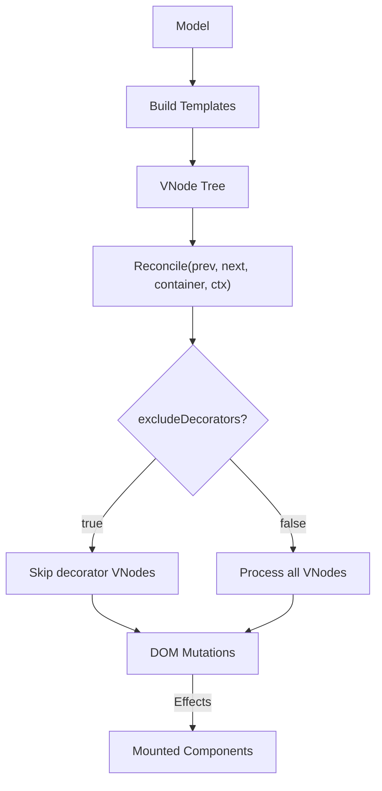
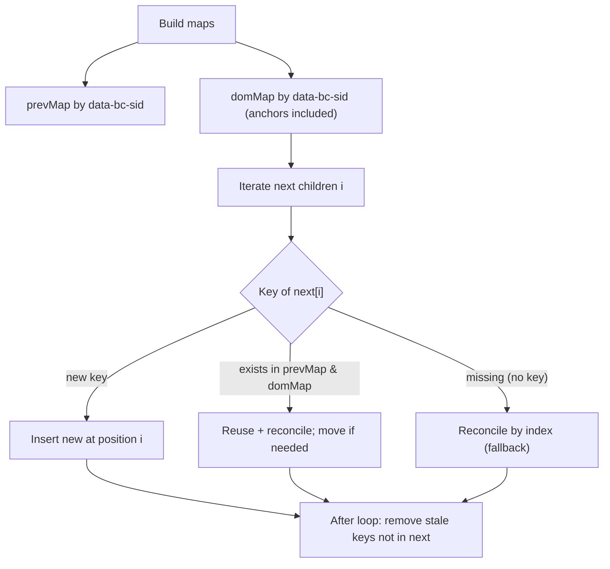
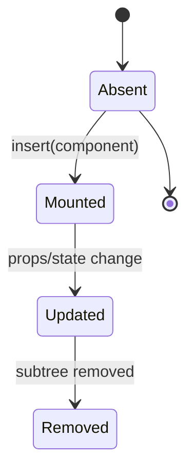
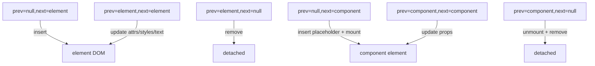

# Reconcile Algorithm - Core Concepts and Design

## 1. Overview

This document specifies the reconcile algorithm used by `@barocss/renderer-dom` to synchronize a declarative VNode tree to the DOM. It defines VNode categories, lifecycle rules, component mounting, and correctness invariants.

Goals:
- Minimal DOM mutations with predictable rules
- Clear separation between element nodes and components
- Explicit handling for external components
- `when` conditions are expanded at build-time into regular VNode children

## 2. Data Model

### 2.1 VNode (Normalized)

```pseudo
record VNode {
  tag?: string                    // absent for text and special nodes
  attrs?: Map<string, string>     // includes className → normalized to class
  style?: Map<string, string>
  text?: string                   // text-only node when tag is absent
  children?: VNode[]

  // Optional facets
  component?: {
    name: string
    props: Map<string, any>
    element?: HTMLElement | null
  }

  // Note: `when` is expanded at build-time; no runtime when field on VNode
}
```

### 2.2 Keying & Identity
- `data-bc-sid`: Logical identity across renders (e.g., model id). Used for keyed reconciliation.
- `data-bc-stype`: Logical type boundary. If types differ, node is replaced.
- `when` conditions are evaluated at build-time and expanded into normal VNode children.

## 3. High-Level Flow



Pseudo (single node):

```pseudo
function reconcile(prev, next, container, ctx):
  if prev==null and next==null: return
  if prev==null: insert(next); return
  if next==null: remove(prev); return

  if incompatible(prev, next): replace(prev, next); return

  updateAttributes(container, prev, next)
  updateStyles(container, prev, next)
  updateText(container, prev, next)
  reconcileChildren(prev.children, next.children, getElement(container), ctx)
```

Incompatibility rules (replace):
- tag changes (element↔element mismatch)
- role changes (element↔component)
- component name changes
- `data-bc-stype` differs when present

## 4. Decorator Inclusion

Decorators are now fully included in the VNode tree during build phase:

- Decorators are processed during VNode building and become part of the normal VNode children
- All decorators (inline, block, layer) are included in the VNode tree and reconciled like any other VNode
- No special filtering or exclusion is needed during reconciliation
- Decorator VNodes are identified by `attrs['data-decorator-sid']` but are processed normally in reconcile

## 5. Children Reconciliation (Keyed)



Notes:
- Keys must be stable across renders for minimal DOM.
- All children (including decorator VNodes) are processed in reconciliation - no filtering needed

## 5. Conditional Branches: `when` (Build-time Expansion)

`when` is evaluated during VNode build. The condition decides a single template (then/else) which is immediately built into VNode(s) and spliced into the parent children. There are no runtime anchors or special reconcile paths. Components produced via `when` are just normal component VNodes and follow the standard mount/update/unmount rules.

**Key benefits of build-time expansion:**
- No runtime conditional logic in the reconcile layer
- Simpler reconciliation algorithm
- Components inside `when` branches are handled uniformly
- No special DOM markers or anchoring needed

## 6. Components

Two categories:
1) Context components: function `(props, ctx) => template`, normalized to `component` VNode with `.component` metadata.
2) External components: imperative `{ mount, update?, unmount, managesDOM? }`, normalized to `component` VNode and mounted by reconcile.

### 6.1 Lifecycle



Mount path:
```pseudo
if vnode.component exists:
  placeholder = createComponentPlaceholder(attrs, component.name)
  append placeholder
  component.mount(placeholder, props) → element
  vnode.component.element = element  // retained for updates
```

Update path:
```pseudo
if component.update exists:
  component.update(element, prevProps, nextProps)
```

Unmount path:
```pseudo
component.unmount?.(element)
remove placeholder/element
```

Notes:
- `managesDOM=true`: renderer avoids reconciling children under the mounted element.
- Placeholders carry `data-bc-component-placeholder` or external wrapper attributes to aid hydration/mount scans.

### 6.2 Mounting inside `when`

Since `when` expands during build, components inside `when` branches are handled by the normal component path. No special mounting logic is needed for `when` - they become regular component VNodes in the children array.

## 7. Context Propagation

Nested calls to `vnodeToDOM` require ambient context (e.g., registry, feature flags). A small stack is used:
- `CURRENT_CONTEXT_STACK.push(ctx)` before recursing
- `CURRENT_CONTEXT_STACK.pop()` after returning
This ensures that mounting during nested conversions uses the correct context.

## 8. Mixed Content Handling

Mixed content refers to elements that contain both text content and child elements. The reconcile algorithm ensures proper rendering order and efficient DOM updates.

### 8.1 Text and Element Ordering

When an element has both child elements and text content, the order is preserved:
- Element children are rendered first
- Text content is appended after element children
- This maintains the correct visual order in the DOM

```typescript
// VNode with mixed content
{
  tag: 'li',
  children: [
    { tag: 'strong', text: 'Bold text' },
    { tag: null, text: ' and regular text' }  // Text VNode
  ]
}

// Renders as: <li><strong>Bold text</strong> and regular text</li>
```

### 8.2 Text Updates in Mixed Content

When text content changes in mixed content scenarios:
- The reconcile system finds the appropriate text node
- Updates the text content without affecting element children
- Maintains the correct order of text and elements

```typescript
// updateText function handles mixed content updates
function updateText(target: HTMLElement, prev: VNode, next: VNode): void {
  if (next.children && next.children.length > 0) {
    // Mixed content: find the last text node and update it
    const lastChild = target.lastChild;
    if (lastChild && lastChild.nodeType === Node.TEXT_NODE) {
      lastChild.textContent = next.text;
    } else {
      target.appendChild(document.createTextNode(next.text));
    }
  } else {
    // No children, update existing text node or create one
    const textNode = target.childNodes[0];
    if (textNode && textNode.nodeType === Node.TEXT_NODE) {
      textNode.textContent = next.text;
    } else {
      target.appendChild(document.createTextNode(next.text));
    }
  }
}
```

### 8.3 Performance Optimizations

- **Single text VNode optimization**: When an element has only one text child, it's stored directly in `vnode.text` for efficiency
- **Ordered children array**: All children (elements and text) are stored in a single ordered array to maintain correct rendering sequence
- **Text flushing**: Text parts are accumulated and flushed as VNodes when element children are encountered

### 8.4 HTML Boolean Attributes

The reconcile algorithm correctly handles HTML boolean attributes:
- `true` values set the attribute (e.g., `disabled=""`)
- `false` values remove the attribute
- String values are converted to boolean for boolean attributes

```typescript
// Boolean attributes handling
const booleanAttrs = new Set(['disabled', 'required', 'checked', 'selected', 'readonly', 'multiple', 'autofocus', 'autoplay', 'controls', 'defer', 'hidden', 'loop', 'muted', 'open', 'reversed', 'scoped', 'seamless', 'async', 'default', 'defer', 'formnovalidate', 'novalidate', 'itemscope']);

if (ns === 'html' && booleanAttrs.has(key)) {
  if (resolvedValue === true || resolvedValue === 'true') {
    el.setAttribute(key, '');
  } else if (resolvedValue === false || resolvedValue === 'false') {
    el.removeAttribute(key);
  } else {
    setAttrWithNS(el, key, String(resolvedValue));
  }
}
```

### 8.5 Special Attribute Handling

Certain HTML attributes receive special treatment:
- **`href` attribute**: Explicitly handled for HTML elements to ensure proper link functionality
- **Namespace attributes**: SVG and MathML attributes are handled with proper namespace awareness

### 8.6 Portal Container Special Handling

Portal containers require special handling to ensure proper reconciliation while preserving existing DOM state and enabling multiple portals to share the same target:

- **Portal container identification**: Elements with `data-portal-container="true"` are recognized as portal containers
- **Independent content management**: Each portal container manages its own content independently
- **State preservation**: Portal updates use `reconcile` to preserve existing DOM state (focus, scroll position, etc.)
- **Multiple portal support**: Multiple portals can share the same target without interference through unique container IDs
- **Existing DOM preservation**: Portal containers preserve existing DOM content in the target

```typescript
// Portal container special handling in reconcile function
if (container.getAttribute('data-portal-container') === 'true') {
  // This is a portal container - handle it specially
  if (!prevVNode && nextVNode) {
    // Insert new content into portal container
    const newElement = vnodeToDOM(nextVNode, context);
    if (newElement) {
      container.appendChild(newElement);
    }
  } else if (prevVNode && nextVNode) {
    // Update existing content in portal container
    const target = getTargetElement(container, context);
    if (target) {
      // Update the existing element using reconcile
      updateAttributes(target, prevVNode, nextVNode);
      updateStyles(target, prevVNode, nextVNode);
      updateText(target, prevVNode, nextVNode);
      reconcileChildren(target, prevVNode, nextVNode, context);
    } else {
      // No existing element, replace with new one
      container.innerHTML = '';
      const newElement = vnodeToDOM(nextVNode, context);
      if (newElement) {
        container.appendChild(newElement);
      }
    }
  } else if (prevVNode && !nextVNode) {
    // Remove content from portal container
    container.innerHTML = '';
  }
  return; // Portal container handling is complete
}
```

**Key Benefits:**
- **UI State Preservation**: Input focus, scroll positions, and other DOM state are preserved during portal updates
- **Performance Optimization**: Only necessary DOM mutations are performed
- **Isolation**: Portal containers are managed independently without affecting other portal containers or existing DOM content

## 8. Attribute & Style Update Rules

```pseudo
for key in union(prev.attrs, next.attrs):
  if changed:
    if key=='className': setAttribute('class', tokens(value))
    else if value==null: removeAttribute(key)
    else setAttribute(key, String(value))

for styleKey in union(prev.style, next.style):
  if changed:
    setStyle(kebab(styleKey), value)
```

## 9. Error Handling & Diagnostics
- Localized try/catch around component `mount/update/unmount` to avoid crashing reconcile
- Verbose diagnostics with phases: insert/remove/replace/update/children
- `console.warn` for recoverable issues (e.g., missing component registry entry)

## 10. Correctness Invariants (Global)
- Type safety: change in `data-bc-stype` forces replacement
- Key stability: keyed children preserve identity and enable move/reuse
- Build-time expansion: `when` conditions are evaluated during VNode building, not at reconcile time
- External isolation: `managesDOM=true` prevents renderer from mutating owned subtrees

## 11. Reference Diagrams

### 11.1 Insert/Update/Remove (Element vs Component)



### 11.2 `when` Branch (Build-time)

`when` is expanded at build-time in the VNodeBuilder. The reconcile stage only sees the resulting VNode(s), identical to any other child nodes. No special handling is needed in the reconcile layer.

## 12. Implementation Notes
- Builder normalizes DSL constructs into VNodes (element/component). `when` is evaluated during build and expanded into children.
- The reconcile layer remains generic (text/element/component) without any conditional-specific paths.
- Server rendering can emit component placeholders; hydration scans should mount components using synthesized VNodes.
- Build-time expansion simplifies the reconciliation algorithm and eliminates runtime conditional logic.

## 13. Appendix: Pseudocode Snippets

### 13.1 `when` Build-time Expansion (core idea)

```pseudo
function expandWhen(condition, thenTemplate, elseTemplate, data):
  cond = evaluateCondition(condition, data)
  selectedTemplate = cond ? thenTemplate : elseTemplate
  if selectedTemplate:
    return buildVNode(selectedTemplate, registry, data)
  return null

// In VNodeBuilder._buildElement:
if child.type === 'conditional':
  expandedVNodes = expandWhen(child.condition, child.template, child.elseTemplate, data)
  if expandedVNodes:
    elementChildren.push(...expandedVNodes)
```

### 13.2 Component Mount

```pseudo
function mountComponent(vnode, container, ctx):
  comp = resolveComponent(vnode.component.name, ctx.registry)
  el = comp.mount(container, vnode.component.props)
  vnode.component.element = el
```

### 13.3 Portal Container Management

```pseudo
function updatePortal(prevVNode, nextVNode, container, context):
  target = nextVNode.attrs.target
  template = nextVNode.attrs.template
  portalId = nextVNode.attrs.portalId || prevVNode.attrs.portalId || generatePortalId()
  
  // Find or create portal container with unique ID
  portalContainer = target.querySelector(`[data-portal="${portalId}"]`)
  if (!portalContainer) {
    // Create new portal container preserving existing DOM content
    portalContainer = createPortalContainer(portalId, target)
  }
  
  // Update portal content using reconcile for state preservation
  prevContentVNode = prevVNode.children[0] if prevVNode.children else null
  contentVNode = buildVNode(template, context.data)
  reconcile(prevContentVNode, contentVNode, portalContainer, context)
  
  // Store content VNode and portal ID for future updates
  nextVNode.children = [contentVNode]
  nextVNode.attrs.portalId = portalId
```

**Key Improvements:**
- **Unique Portal ID Management**: Portal IDs are preserved across updates for container reuse
- **Existing DOM Preservation**: Portal containers are added without affecting existing target content
- **State Preservation**: Portal updates use reconcile algorithm to preserve DOM state
- **Container Reuse**: Existing portal containers are reused based on portal ID

## 14. Portal System Improvements

### 14.1 Multiple Portal Support

The reconcile algorithm now supports multiple portals sharing the same target without interference:

- **Independent Portal Containers**: Each portal creates its own container with a unique `data-portal` ID
- **Existing DOM Preservation**: Portal containers are added to targets without affecting existing content
- **Isolated Updates**: Portal updates only affect their own container, not other portals or existing DOM

### 14.2 Portal Container Structure

```html
<!-- Target element with existing content -->
<div id="target">
  <div id="existing-content">Existing content</div>
  
  <!-- Portal containers (added by portal system) -->
  <div data-portal="portal-a" data-portal-container="true" style="position: relative;">
    <div>Portal A content</div>
  </div>
  
  <div data-portal="portal-b" data-portal-container="true" style="position: relative;">
    <div>Portal B content</div>
  </div>
</div>
```

### 14.3 Portal Update Optimization

- **Reconcile-based Updates**: Portal content updates use the standard reconcile algorithm
- **State Preservation**: Input focus, scroll positions, and other DOM state are preserved
- **Performance**: Only necessary DOM mutations are performed, avoiding full re-renders
- **Container Reuse**: Portal containers are reused based on unique portal IDs for efficiency
- **Independent Management**: Each portal container is managed independently without affecting others

### 14.4 Portal Container Management

The reconcile algorithm implements sophisticated portal container management:

- **Container Creation**: Portal containers are created with unique `data-portal` attributes
- **Container Identification**: Containers are identified by `data-portal-container="true"` attribute
- **Content Isolation**: Each portal's content is isolated within its own container
- **Target Preservation**: Existing DOM content in portal targets is never modified
- **Cleanup Handling**: Portal removal properly cleans up containers and content

### 14.5 Portal Performance Characteristics

- **Minimal DOM Mutations**: Only changed portal content is updated
- **Efficient Container Lookup**: Portal containers are found using `data-portal` selectors
- **State Preservation**: DOM state (focus, scroll, etc.) is preserved during updates
- **Memory Efficiency**: Unused portal containers are properly cleaned up
- **Scalability**: Multiple portals can coexist without performance degradation

---

## Summary of Portal System Enhancements

The reconcile algorithm has been significantly enhanced to support advanced portal functionality:

### Core Improvements
- **Multiple Portal Support**: Multiple portals can share the same target without interference
- **Portal Container Independence**: Each portal creates and manages its own container
- **Existing DOM Preservation**: Portal targets preserve their existing content
- **State Preservation**: Portal updates preserve DOM state (focus, scroll, etc.)
- **Performance Optimization**: Portal updates use reconcile algorithm for minimal DOM mutations

### Technical Implementation
- **Portal Container Special Handling**: Elements with `data-portal-container="true"` receive special treatment
- **Unique Portal ID Management**: Portal IDs enable container reuse and independent management
- **Reconcile-based Updates**: Portal content updates use the standard reconcile algorithm
- **Container Isolation**: Each portal's content is isolated within its own container

### Benefits
- **Scalability**: Multiple portals can coexist without performance degradation
- **Reliability**: Portal updates preserve UI state and existing DOM content
- **Efficiency**: Only necessary DOM mutations are performed
- **Flexibility**: Portals can be used for complex UI patterns (modals, tooltips, overlays)

This specification is normative for `@barocss/renderer-dom` and should be used as a reference for future refactors and tests around reconcile, `when`, components, and portal systems.


