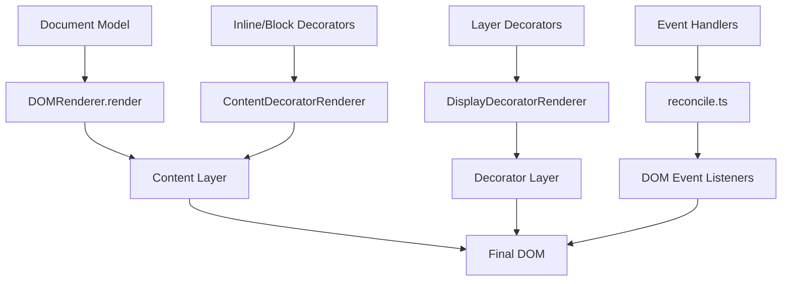

# Renderer Decorator System Specification

## Overview

The Decorator System in `@barocss/renderer-dom` provides a comprehensive solution for rendering auxiliary UI elements (annotations, tooltips, overlays, interactive widgets) that are separate from the main document model. The system uses two specialized renderers to handle different types of decorators based on their positioning requirements.

## Core Architecture

### 1) Dual Renderer System
The system uses two specialized renderers to handle different decorator categories:

- **ContentDecoratorRenderer**: Handles inline and block decorators that are embedded within the document content
- **DisplayDecoratorRenderer**: Handles overlay and absolute decorators that float above the document content

### 2) Decorator Categories
Decorators are categorized by their rendering behavior:

- **Inline Decorators**: Embedded within text content using `position: 'inside-start'` or `'inside-end'`
- **Block Decorators**: Block-level elements using `position: 'before'` or `'after'`
- **Layer Decorators**: Overlay elements using `position: 'overlay'` or `'absolute'`

### 3) Template-Based Rendering
All decorators use `defineDecorator()` to register templates, ensuring consistent rendering and event handling through the VNode system.

## Template Definitions

### defineDecorator Function
- `defineDecorator(name, template)` registers a template for decorators
- Automatically injects `data-decorator="true"` attribute
- Supports both `ElementTemplate` and `ComponentTemplate`
- Event handlers are properly preserved (onMouseEnter, onClick, etc.)

### Basic Template Example
```typescript
import { defineDecorator, element, text } from '@barocss/renderer-dom';

// Comment decorator with event handlers
defineDecorator('comment', element('div', {
  className: 'barocss-comment-indicator',
  style: {
    position: 'absolute',
    width: '20px', height: '20px',
    backgroundColor: 'rgba(33,150,243,0.9)',
    border: '2px solid white',
    borderRadius: '50%',
    display: 'flex',
    alignItems: 'center',
    justifyContent: 'center',
    fontSize: '10px',
    color: 'white',
    zIndex: '1000',
    cursor: 'pointer',
    pointerEvents: 'auto'
  },
  onMouseEnter: (e: MouseEvent) => {
    // Event handler logic
  },
  onClick: (e: MouseEvent) => {
    // Click handler logic
  }
}, [text('💬')]));
```

## Decorator Data Model

The decorator system uses a unified data model that works with both renderers:

```typescript
interface IDecorator {
  id: string;                    // unique identifier
  type: string;                  // template name (registered with defineDecorator)
  category: 'layer' | 'inline' | 'block';  // rendering category
  target: {
    nodeId: string;
    startOffset: number;
    endOffset: number;
  } | {
    startNodeId: string;
    startOffset: number;
    endNodeId: string;
    endOffset: number;
  };
  data: Record<string, any>;     // template data
  createdAt: number;             // timestamp
  updatedAt: number;             // timestamp
  version: number;               // version for conflict resolution
}

// Position types for different renderers
type ContentDecoratorPosition = 
  | 'before'       // insert before target (block)
  | 'after'        // insert after target (block)
  | 'inside-start' // append at start inside target (inline)
  | 'inside-end';  // append at end inside target (inline)

type DisplayDecoratorPosition =
  | 'overlay'      // overlay on top of target
  | 'absolute';    // absolute position in container
```

## Rendering Flow

The decorator rendering process involves two separate renderers working in coordination:

### 1) Content Decorator Rendering
For inline and block decorators:
1. Model VNode tree is reconciled into the content container
2. ContentDecoratorRenderer processes decorators with `category: 'inline'` or `'block'`
3. Decorators are embedded within the document structure using appropriate positioning

### 2) Display Decorator Rendering  
For layer decorators:
1. DisplayDecoratorRenderer processes decorators with `category: 'layer'`
2. Target elements are located in the content layer
3. Decorators are positioned absolutely in the decorator layer
4. Event handlers are attached for interactivity

### 3) Event Handling
- Event handlers defined in `defineDecorator` templates are preserved
- `factory.ts` ensures `on*` attributes are not executed during VNode building
- Event listeners are attached during DOM reconciliation

### Rendering Architecture


## DOM Placement Rules

### Content Decorator Placement
- **`before`**: Insert as sibling before the target element (block-level)
- **`after`**: Insert as sibling after the target element (block-level)  
- **`inside-start`**: Insert as first child inside the target element (inline)
- **`inside-end`**: Insert as last child inside the target element (inline)

### Display Decorator Placement
- **`overlay`**: Absolutely positioned over the target element
- **`absolute`**: Absolutely positioned relative to the decorator layer container

### Container Attributes
All decorator containers receive:
- `data-decorator-container="true"`
- `contenteditable="false"` (prevents accidental editing)
- `data-decorator-sid="{decorator.sid}"` (for identification)

## Integration Example

### Complete Setup
```typescript
import { defineDecorator, element, text } from '@barocss/renderer-dom';
import { EditorViewDOM } from '@barocss/editor-view-dom';

// 1) Define decorator templates
defineDecorator('comment', element('div', {
  className: 'barocss-comment-indicator',
  style: {
    position: 'absolute',
    width: '20px', height: '20px',
    backgroundColor: 'rgba(33,150,243,0.9)',
    border: '2px solid white',
    borderRadius: '50%',
    cursor: 'pointer',
    pointerEvents: 'auto'
  },
  onMouseEnter: (e: MouseEvent) => {
    // Show tooltip
  },
  onClick: (e: MouseEvent) => {
    // Show popup
  }
}, [text('💬')]));

defineDecorator('highlight', element('div', {
  className: 'barocss-highlight',
  style: {
    position: 'absolute',
    backgroundColor: 'rgba(255, 213, 79, 0.22)',
    border: '1px solid rgba(255, 193, 7, 0.45)',
    borderRadius: '4px',
    pointerEvents: 'none'
  }
}, [text(' ')])); // Empty space for height

// 2) Create editor view
const editorView = new EditorViewDOM(editor, container, {
  layers: {
    content: contentElement,
    decorator: decoratorElement
  }
});

// 3) Add decorators to data store
await editor.transaction([
  addDecorator({
    id: 'comment-1',
    type: 'comment',
    category: 'layer',
    target: { nodeId: 'text-1', startOffset: 0, endOffset: 5 },
    data: { content: 'This is a comment', author: 'user1' }
  }),
  addDecorator({
    id: 'highlight-1', 
    type: 'highlight',
    category: 'layer',
    target: { nodeId: 'text-2', startOffset: 0, endOffset: 10 },
    data: { color: 'yellow' }
  })
]).commit();

// 4) Render (handled automatically by EditorViewDOM)
editorView.render();
```

## Performance Optimizations

### 1) Per-Decorator Rendering
- Each decorator uses its own `DOMRenderer` instance for isolation
- Only changed decorators are re-rendered
- Stable decorator IDs enable precise diff detection

### 2) Event Handler Preservation
- Event handlers are preserved during VNode building
- `factory.ts` checks for `on*` attributes before executing functions
- Event listeners are attached during DOM reconciliation

### 3) Positioning Optimization
- DisplayDecoratorRenderer uses `ResizeObserver` for responsive positioning
- Debounced scroll/resize handlers prevent excessive updates
- Multi-line text ranges use `Range.getClientRects()` for accuracy

## Error Handling

- Rendering is best-effort: failed decorators are skipped with warnings
- Template validation ensures proper decorator registration
- Missing target elements are handled gracefully

## Best Practices

### 1) Template Design
- Use `contenteditable="false"` for interactive decorators
- Set appropriate `pointerEvents` values
- Include proper z-index management

### 2) Event Handling
- Define event handlers in `defineDecorator` templates
- Use `onMouseEnter`, `onMouseLeave`, `onClick` for interactivity
- Avoid complex logic in event handlers

### 3) Positioning
- Use `category: 'layer'` for overlays and tooltips
- Use `category: 'inline'` for text-embedded widgets
- Use `category: 'block'` for block-level elements

## API Reference

### Core Functions
- `defineDecorator(name, template)`: Register decorator template
- `addDecorator(decorator)`: Add decorator to data store
- `removeDecorator(id)`: Remove decorator by ID
- `updateDecorator(id, data)`: Update decorator data

### Renderers
- `ContentDecoratorRenderer`: Handles inline/block decorators
- `DisplayDecoratorRenderer`: Handles layer decorators
- `DOMRenderer`: Main rendering engine with decorator support

## Implementation Examples

For detailed implementation examples and best practices, see:
- [Decorator Implementation Guide](../docs/decorator-implementation-guide.md)

## Portal System

Portal을 사용하여 데코레이터의 tooltip, popup 등을 선언형으로 관리할 수 있습니다.

### Portal 기본 사용법

```typescript
defineDecorator('comment', (props, context) => {
  context.initState('showTooltip', false);
  
  return element('div', {
    onMouseEnter: () => context.setState('showTooltip', true),
    onMouseLeave: () => context.setState('showTooltip', false)
  }, [
    text('💬'),
    portal(document.body, element('div', {
      className: 'comment-tooltip',
      style: {
        position: 'fixed',
        zIndex: 1001,
        opacity: ctx.getState('showTooltip') ? 1 : 0
      }
    }, [text('Tooltip content')]))
  ]);
});
```

자세한 내용은 [Portal System Specification](../docs/portal-system-spec.md)을 참조하세요.

## Reconcile Exclusion Rules (Updated)

- Decorator VNodes are excluded from the core model reconcile when `ReconcileContext.excludeDecorators === true`
- Identification uses `attrs['data-decorator'] === 'true'`
- Exclusion applies to both root-level reconcile and `reconcileChildren` operations
- Decorators are rendered via dedicated decorator renderers; model DOM stays stable

## Namespace and Matching Notes

- Decorator rendering does not participate in keyed/unkeyed children matching
- No reliance on `data-bc-sid` for reconcile identity; decorators maintain their own IDs in the decorator store

## Related Documentation

- [Mark & Decorator Specification](mark-and-decorator-spec.md) - Mark와 Decorator 개념 정리
- [Portal System Specification](../docs/portal-system-spec.md) - Portal 시스템 상세 스펙
- [BaroCSS Editor API Reference](../docs/api-reference.md) - 전체 API 참조
