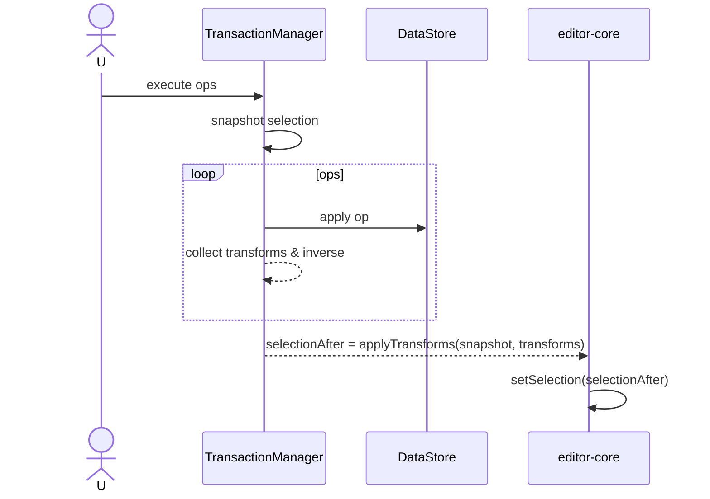

# Selection Mapping Specification

## Overview

Selection은 editor-core 소유다. 다만 트랜잭션 동안에는 editor.selection.clone()으로 만든 "로컬 Selection"을 컨텍스트에 주입해 오퍼레이션들이 계산·갱신에 사용할 수 있다. UI Selection은 커밋 이후 단 한 번만 반영한다. 본 문서는 nodeId+offset 기반으로, 로컬 Selection을 순차 갱신하여 최종 SelectionAfter를 산출하는 방식을 정의한다.

## Principles

- Ownership: selection 상태는 editor-core가 관리한다.
- No mid-op UI mutation: defineOperation 실행 중 editor-core Selection을 바꾸지 않는다(로컬 Selection만 갱신).
- Node/offset only: 절대좌표를 쓰지 않고 (nodeId, offset)만 사용한다.
- Deterministic: 같은 입력(트랜잭션, 초기 selection)에는 항상 같은 selectionAfter가 나온다.

## Data Model

### Selection Snapshot
```ts
type ModelSelection = {
  anchorId: string; anchorOffset: number;
  focusId: string;  focusOffset: number;
};
```

### Local Selection in Context
오퍼레이션은 로컬 Selection을 직접 갱신한다. 이 로컬 Selection은 editor.selection.clone()으로 생성되며, 트랜잭션 컨텍스트에 제공된다.
```ts
type ModelSelection = {
  anchorId: string; anchorOffset: number;
  focusId: string;  focusOffset: number;
};

type SelectionContext = {
  // 트랜잭션 시작 시점의 스냅샷
  before: ModelSelection;
  // 오퍼레이션들이 갱신하는 현재 값(최종 SelectionAfter)
  current: ModelSelection;
  // 유틸: 안전 보정 메서드(옵션)
  setSelection(next: ModelSelection): void;           // 클램프/보정 포함
  setCaret(nodeId: string, offset: number): void;     // 단일 캐럿
  setRange(aId: string, aOff: number, fId: string, fOff: number): void;
};
```
각 defineOperation은 필요 시 `context.selection.set*` API를 호출해 로컬 Selection을 갱신한다(단, editor-core Selection은 바꾸지 않는다).

## Transaction-time Application

1) TransactionManager는 트랜잭션 시작 시 editor.selection.clone()으로 before를 만들고, 동일 값으로 current를 초기화한다.
2) 각 오퍼레이션 실행 중 필요하면 `context.selection.set*`으로 current를 갱신한다.
3) 트랜잭션 종료 시 selectionBefore=before, selectionAfter=current 로 확정한다.
4) editor-core는 커밋 이후 selectionAfter를 1회 setSelection 한다.

합성 맵퍼가 필요 없고, 오퍼레이션 내부에서 즉시 로컬 Selection을 갱신하므로 구현이 단순하다.

## Operation Guidelines

- insertText(nodeId, pos, text)
  - if selection.current.anchorId===nodeId && anchorOffset≥pos → anchorOffset+=len(text)
  - focus에도 동일 규칙, 필요 시 캐럿을 pos+len(text)로 이동
- deleteTextRange(nodeId, start, end)
  - 동일 nodeId에서 offset∈[start,end) → start로 클램프, offset≥end → offset-= (end-start)
- replaceText(nodeId, start, end, newText)
  - 위 두 규칙을 순서 적용(삭제 후 삽입 길이만큼 쉬프트)
- wrap/unwrap/moveNode
  - 선택이 이동된 노드에 걸치면 가장 가까운 유효 텍스트 노드로 보정(보정 규칙은 selectionManager 유틸로 캡슐화)

모든 변환은 nodeId+offset만 다루며, 범위를 가진 selection은 (anchor, focus)에 각각 적용한다.

## Application Rules

Pseudo-code (트랜잭션 내 로컬 Selection 갱신):
```ts
// TransactionManager
const before = editor.selection.clone();
const current = { ...before };
const selection = makeSelectionContext(before, current, dataStore /*보정 유틸*/);

for (const op of ops) {
  await def.execute(op, { dataStore, schema, selection });
}

return { selectionBefore: before, selectionAfter: current };
```

보정 규칙은 selectionContext.set* 내부 구현으로 캡슐화한다. 필요한 경우 DataStore/PositionCalculator를 사용해 가장 가까운 유효 텍스트 노드와 offset으로 이동시키는 규칙을 적용한다.

## Examples

### Insert Text then Delete Range
1) insertText(text-1, pos=5, "+") → shift fromOffset=5, delta=+1
2) deleteTextRange(text-1, start=6, end=10) → clampDelete(6..10)

초기 selection: (text-1, 7) → 1)으로 8, 2)로 6으로 클램프.

### Wrap then Move
1) wrap([text-1, text-2]) → wrapperId=para-2
2) moveNode(text-2, newParent=listItem-3, toIndex=0)

범위 selection이 text-2에 걸쳐있다면 remapIfMoved 규칙으로 새 위치에 맞춰 조정.

## Integration

- defineOperation: result에 transforms와 inverse를 포함한다.
- TransactionManager: selectionSnapshot을 캡처, transforms를 순차 적용해 selectionAfter 계산, 커밋 이후 editor-core가 1회 적용.
- History: selectionBefore/After를 HistoryEntry에 기록해 결정적 undo/redo를 보장.

## Mermaid




