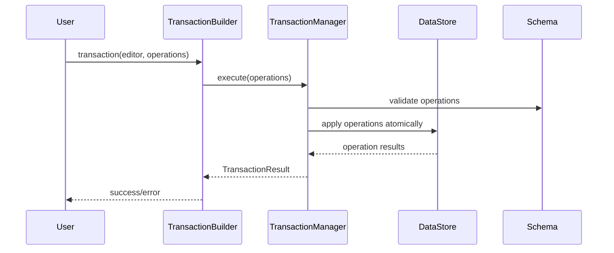

# Transaction DSL Final Specification

## 1. Overview

Transaction DSL은 **선언적 트랜잭션 시스템**입니다. 실제 구현된 코드를 기반으로 한 최종 명세서입니다.

### 1.1 Core Philosophy
- **선언적 구조**: 함수 기반 DSL로 트랜잭션 구성
- **일관성**: 일관된 패턴과 문법
- **타입 안전성**: TypeScript로 완전한 타입 지원
- **확장성**: 새로운 operation 추가가 쉬운 구조
- **원자성**: 모든 operation이 성공하거나 전부 실패

### 1.2 Key Benefits
- **일관된 문법**: 일관된 패턴으로 학습 비용 최소화
- **선언적 구조**: 복잡한 체이닝 대신 명확한 함수 호출 구조
- **타입 안전성**: 완전한 TypeScript 지원
- **확장성**: 새로운 operation과 helper 함수 추가가 쉬움
- **실제 구현 기반**: 테스트된 실제 코드를 기반으로 한 명세

## 2. Architecture

### 2.1 Core DSL Functions

#### 2.1.1 Transaction Function
```typescript
function transaction(editor: Editor, operations: (TransactionOperation | TransactionOperation[])[]): TransactionBuilder
```

**실제 구현:**
- `editor`: Editor 인스턴스 (DataStore 접근용)
- `operations`: 실행할 operation들의 배열 (중첩 배열 지원)
- 반환: `TransactionBuilder` 인터페이스

#### 2.1.2 TransactionBuilder Interface
```typescript
interface TransactionBuilder {
  commit(): Promise<TransactionResult>;
}
```

**실제 구현:**
- `commit()`: 트랜잭션 실행 및 결과 반환
- 내부적으로 `TransactionManager`를 사용하여 원자적 실행

#### 2.1.3 Create Function
```typescript
function create(node: INode, options?: any): CreateOperation
```

**중요한 사용법:**
- `create()` 함수는 중첩된 구조를 한 번에 생성합니다
- `parentId`를 별도로 설정할 필요가 없습니다 (중첩 관계는 `content` 배열로 표현)
- 자동 ID 생성과 Schema 검증이 포함됩니다

**올바른 사용법:**
```typescript
// ✅ 올바른 방법 (중첩 구조)
const nested = create({
  type: 'paragraph',
  content: [
    {
      type: 'inline-text', 
      text: 'Hello'
    }
  ]
});

// ❌ 잘못된 방법 (parentId 사용)
const parent = create({ type: 'paragraph', content: [] });
const child = create({ type: 'inline-text', text: 'Hello', parentId: 'parent-sid' });
```

**실제 구현:**
- `node`: 생성할 노드 (INode 타입)
- `options`: 생성 옵션 (선택사항)
- 반환: `CreateOperation` 객체

#### 2.1.4 Control Function
```typescript
function control(target: HandleOrId, actions: Array<{ type: string; payload?: any }>): TransactionOperation[]
```

**실제 구현:**
- `target`: 대상 노드 ID (control DSL에서 `nodeId`로 전달됨)
- `actions`: 실행할 액션들의 배열
- 각 액션에 `nodeId`를 자동으로 추가하여 반환

**중요한 구조:**
Control DSL은 다음과 같이 변환됩니다:
```typescript
// 입력
control('node-1', [{ type: 'setAttrs', payload: { attrs: { level: 2 } } }])

// 변환된 결과
[{ type: 'setAttrs', payload: { attrs: { level: 2 }, nodeId: 'node-1' } }]
```

**Operation에서 접근 방법:**
```typescript
defineOperation('setAttrs', async (operation: any, context: TransactionContext) => {
  const { nodeId, attrs } = operation.payload; // ✅ 올바름
  // operation.nodeId ❌ 잘못됨
});
```

#### 2.1.5 Helper Functions

##### Node Helper
```typescript
function node(type: string, attributes?: Record<string, any>, content?: INode[]): INode
```

**실제 구현:**
- 컨테이너 노드 생성 (paragraph, heading, list 등)
- `attributes`: 노드의 속성
- `content`: 자식 노드들의 배열

##### TextNode Helper (오버로드)
```typescript
function textNode(type: string, text: string): INode;
function textNode(type: string, text: string, marks: MarkDescriptor[]): INode;
function textNode(type: string, text: string, attributes: Record<string, any>): INode;
function textNode(type: string, text: string, marks: MarkDescriptor[], attributes: Record<string, any>): INode;
```

**실제 구현:**
- 텍스트 노드 생성 (inline-text, codeBlock 등)
- 4가지 오버로드로 유연한 사용법 지원
- `marks`: 마크 배열 (선택사항)
- `attributes`: 속성 객체 (선택사항)

##### Mark Helper
```typescript
function mark(type: string, attrs?: Record<string, any>): MarkDescriptor
```

**실제 구현:**
- 마크 생성
- `attrs`에서 `range` 속성을 자동으로 추출
- `range`: [start, end) 형태의 범위 (선택사항)

## 3. Type Definitions

### 3.1 Core Types
```typescript
export type HandleOrId = string;

export type MarkDescriptor = { 
  type: string; 
  attrs?: Record<string, any>; 
  range?: [number, number] 
};

export type DirectOperation = { type: string; payload?: any };
export type DeleteOperation = { type: 'delete'; nodeId: string };
export type SelectionOperation = { type: 'setSelection'; selection: any };

export type TransactionOperation = DirectOperation | DeleteOperation | SelectionOperation;

export interface OperationExecuteResult {
  ok: boolean;
  data: any;        // 업데이트된 노드 또는 결과 데이터
  inverse: {        // 역함수 operation 정의
    type: string;
    payload: any;
  };
}
```

### 3.2 Operation Types
```typescript
export interface CreateOperation {
  type: 'create';
  payload: {
    node: INode;
    options?: any;
  };
}
```

## 4. Usage Examples

### 4.1 Basic Node Creation
```typescript
import { transaction, create, node, textNode } from '@barocss/model';

// 단순한 텍스트 노드 생성
const result = await transaction(editor, [
  create(textNode('inline-text', 'Hello World'))
]).commit();

// 컨테이너 노드 생성
const result = await transaction(editor, [
  create(node('paragraph', {}, [
    textNode('inline-text', 'Hello'),
    textNode('inline-text', 'World')
  ]))
]).commit();
```

### 4.2 Text with Marks
```typescript
import { transaction, create, textNode, mark } from '@barocss/model';

// 마크가 있는 텍스트
const result = await transaction(editor, [
  create(textNode('inline-text', 'Bold text', [mark('bold')]))
]).commit();

// 마크와 속성이 모두 있는 텍스트
const result = await transaction(editor, [
  create(textNode('inline-text', 'Styled text', [mark('bold')], { class: 'highlight' }))
]).commit();
```

### 4.3 Control Operations
```typescript
import { transaction, create, control, textNode } from '@barocss/model';

// 노드 생성 후 제어
const createResult = await transaction(editor, [
  create(textNode('inline-text', 'Hello World'))
]).commit();

const textNodeId = createResult.operations?.[0].result.data.sid;

// 텍스트 교체
const controlResult = await transaction(editor, [
  control(textNodeId, [
    { type: 'setText', payload: { text: 'Hello Universe' } }
  ])
]).commit();
```

### 4.4 Complex Nested Structure
```typescript
import { transaction, create, node, textNode, mark } from '@barocss/model';

const result = await transaction(editor, [
  create(node('document', {}, [
    node('heading', { level: 1 }, [
      textNode('inline-text', 'Title')
    ]),
    node('paragraph', {}, [
      textNode('inline-text', 'This is '),
      textNode('inline-text', 'bold text', [mark('bold')]),
      textNode('inline-text', ' and this is '),
      textNode('inline-text', 'italic text', [mark('italic')])
    ])
  ]))
]).commit();
```

## 5. Operation System

### 5.1 defineOperation Pattern
```typescript
defineOperation('operationType', async (operation: any, context: TransactionContext) => {
  // Operation 실행 로직
  const payload = operation.payload;
  // ...
  return result;
});
```

### 5.2 defineOperationDSL Pattern
```typescript
export const operationName = defineOperationDSL('operationType', (param1, param2) => ({
  type: 'operationType',
  payload: { param1, param2 }
}));
```

### 5.3 Available Operations
- **create**: 노드 생성
- **setText**: 텍스트 설정
- **setAttrs**: 속성 설정
- **setMarks**: 마크 설정
- **applyMark**: 마크 적용
- **removeMark**: 마크 제거
- **toggleMark**: 마크 토글
- **wrap**: 텍스트 래핑
- **unwrap**: 텍스트 언래핑
- **addChild**: 자식 노드 추가
- **replaceText**: 텍스트 교체
- **insertText**: 텍스트 삽입
- **deleteTextRange**: 텍스트 범위 삭제

## 6. Transaction Flow

### 6.1 Execution Flow


### 6.2 Error Handling
- **Schema Validation**: 스키마 검증 실패 시 트랜잭션 전체 실패
- **Operation Errors**: 개별 operation 실패 시 트랜잭션 전체 실패
- **Rollback**: 실패 시 모든 변경사항 자동 롤백

## 7. Integration with DataStore

### 7.1 Schema Integration
- DataStore의 활성 스키마를 자동으로 TransactionManager에 설정
- 모든 operation은 스키마 검증을 거침
- 스키마 위반 시 즉시 실패 처리

### 7.2 Lock Management
- TransactionManager가 자동으로 락 관리
- 동시 트랜잭션 방지
- 원자적 실행 보장

## 8. Testing

### 8.1 Test Structure
```typescript
describe('Transaction DSL', () => {
  let editor: Editor;
  let dataStore: DataStore;
  let schema: Schema;

  beforeEach(() => {
    // 테스트 설정
  });

  it('should create simple text node', async () => {
    const result = await transaction(editor, [
      create(textNode('inline-text', 'Hello World'))
    ]).commit();

    expect(result.success).toBe(true);
    expect(result.operations).toHaveLength(1);
  });
});
```

### 8.2 Test Categories
- **Basic Syntax Tests**: DSL helper 함수들의 기본 동작
- **Create Tests**: 노드 생성 operation 테스트
- **Control Tests**: 노드 제어 operation 테스트
- **Integration Tests**: 복합 시나리오 테스트
- **Scenario Tests**: 실제 사용 사례 테스트


## 9. Best Practices

### 9.1 Operation Design
- 각 operation은 단일 책임을 가져야 함
- `defineOperation`과 `defineOperationDSL` 패턴을 일관되게 사용
- 에러 처리를 명확하게 구현

### 9.2 DSL Usage
- `node()`는 컨테이너 노드용, `textNode()`는 텍스트 노드용
- `textNode()` 오버로드를 적절히 활용
- `control()`을 사용하여 기존 노드 제어

### 9.3 Operation Structure
- 모든 operations은 `OperationExecuteResult` 구조로 반환
- `result.data`를 통해 업데이트된 노드에 접근
- `result.inverse`를 통해 역함수 operation 정의

### 9.4 Control DSL Structure
- Control DSL은 `operation.payload.nodeId`로 nodeId를 전달
- Operations에서 `operation.payload`에서 매개변수 추출
- `operation.nodeId` 직접 접근은 지원하지 않음

### 9.5 Operation Registration
- 모든 operations은 `register-operations.ts`에서 등록되어야 함
- `defineOperation`으로 정의된 operation은 자동으로 global registry에 등록
- 테스트에서 사용할 operation은 반드시 등록되어 있어야 함

### 9.6 Node ID Handling
- `create` operation은 자동으로 ID를 생성 (Figma 스타일)
- 테스트에서 명시적 ID 지정 시 무시될 수 있음
- 생성된 노드의 ID는 `result.data.sid`로 접근
- `update`, `delete` 등 다른 operations은 생성된 ID를 사용해야 함

### 9.7 Functional DSL (op function)

`op()` 함수는 복잡한 로직과 흐름 제어를 위한 함수형 DSL입니다. 기존의 선언적 DSL과 달리 명령형 프로그래밍 스타일로 복잡한 작업을 수행할 수 있습니다.

#### 9.7.1 기본 개념

```typescript
// 함수 시그니처
function op(operationFn: (context: TransactionContext) => OpResult | void | Promise<OpResult | void>): OpFunction

// 사용 예시
const result = await transaction(editor, [
  op(async (ctx) => {
    // 복잡한 로직 수행
    const node = ctx.dataStore.createNodeWithChildren(
      textNode('inline-text', 'Hello'),
      ctx.schema
    );
    
    return {
      success: true,
      data: node
    };
  })
]).commit();
```

#### 9.7.2 TransactionContext

`op` 함수는 `TransactionContext`를 매개변수로 받습니다:

```typescript
interface TransactionContext {
  dataStore: DataStore;           // DataStore 인스턴스 (직접 조작 가능)
  selectionManager: SelectionManager; // SelectionManager 인스턴스
  selection?: ModelSelection;     // 현재 선택 영역
  schema?: any;                   // Schema 인스턴스
  selectAbsoluteRange: (start: number, end: number) => void; // 절대 위치 선택
  resolveAbsolute: (position: number) => { nodeId: string; offset: number } | null; // 위치 해석
}
```

#### 9.7.3 OpResult 구조

```typescript
interface OpResult {
  success: boolean;                    // 성공/실패 여부
  data?: any;                         // 결과 데이터
  error?: string;                     // 에러 메시지 (success: false일 때)
  inverse?: TransactionOperation;     // 역함수 operation (undo용)
}
```

#### 9.7.4 지원하는 반환 타입

**1. void (아무것도 반환하지 않음)**
```typescript
op(async (ctx) => {
  // 부수 효과만 수행 (로깅, 상태 변경 등)
  // 아무것도 리턴하지 않음
})
```

**2. OpResult (성공/실패 결과)**
```typescript
op(async (ctx) => {
  const node = ctx.dataStore.createNodeWithChildren(
    textNode('inline-text', 'Hello'),
    ctx.schema
  );
  
  return {
    success: true,
    data: node
  };
})
```

**3. OpResult with inverse (역함수 지정)**
```typescript
op(async (ctx) => {
  const node = ctx.dataStore.createNodeWithChildren(
    textNode('inline-text', 'With inverse'),
    ctx.schema
  );
  
  return {
    success: true,
    data: node,
    inverse: { type: 'delete', payload: { nodeId: node.sid } }
  };
})
```

**4. 실패 케이스**
```typescript
op(async (ctx) => {
  const condition = false;
  if (condition) {
    return {
      success: true,
      data: ctx.dataStore.createNodeWithChildren(textNode('inline-text', 'Created'), ctx.schema)
    };
  } else {
    return {
      success: false,
      error: 'Condition not met'
    };
  }
})
```

#### 9.7.5 실행 흐름

1. **Transaction 시작**: `transaction(editor, [op(...)])` 호출
2. **Operation 등록**: `op` 함수가 `OpFunction` 객체로 변환
3. **Transaction Commit**: `commit()` 호출 시 `TransactionManager`가 실행
4. **OpFunction 실행**: `_executeOpFunction`에서 `opFn.execute(context)` 호출
5. **결과 처리**: `OpResult` 또는 `void` 반환값 처리
6. **Operation 생성**: `OpResult`는 즉시 operation을 생성하지 않음 (inverse는 undo용)

#### 9.7.6 기존 DSL과의 혼용

```typescript
const result = await transaction(editor, [
  // 기존 선언적 DSL
  create(textNode('inline-text', 'Regular operation')),
  
  // 함수형 DSL
  op(async (ctx) => {
    // 커스텀 로직 실행
    return { success: true };
  }),
  
  // 다시 선언적 DSL
  control('node-sid', setText('Updated text'))
]).commit();
```

#### 9.7.7 주요 특징

- **비동기 지원**: `async/await` 패턴 완전 지원
- **직접 DataStore 조작**: `ctx.dataStore`를 통한 직접적인 데이터 조작
- **조건부 실행**: 일반 JavaScript 문법으로 복잡한 로직 구현
- **에러 처리**: `try/catch`와 `OpResult.error`를 통한 명확한 에러 처리
- **역함수 지원**: `inverse` 속성으로 undo 동작 정의
- **트랜잭션 안전성**: 모든 변경사항이 트랜잭션 내에서 안전하게 실행

#### 9.7.8 주의사항

- `op((ctx) => { return { type, payload } })` 형태는 지원하지 않음
- `defineOperation`과 동일한 `OpResult` 구조만 사용
- `inverse`는 실제로 실행되지 않고 나중에 undo할 때 사용
- `OpResult`를 반환해도 `result.operations`에는 추가되지 않음 (inverse는 undo용)

### 9.3 Testing
- Mock 사용 최소화, 실제 DataStore 사용
- `result.operations`를 통한 결과 검증
- 다양한 시나리오 테스트

## 10. History System Integration

### 10.1 Overview
Transaction DSL은 History System과 완전히 통합되어 실행 취소/다시 실행 기능을 제공합니다.

### 10.2 Automatic History Management
```typescript
// 트랜잭션 실행 시 자동으로 히스토리에 추가
await editor.transaction([
  create(textNode('paragraph', 'Hello')),
  setText('node-1', 'World')
]).commit();

// 실행 취소 가능
await editor.undo();

// 다시 실행 가능
await editor.redo();
```

### 10.3 History Configuration
```typescript
const editor = new Editor({
  history: {
    maxSize: 100           // 최대 히스토리 크기
  }
});
```


### 10.5 History Exclusion Rules
다음 operation 타입들은 자동으로 히스토리에서 제외됩니다:
- `log`, `measure`: 디버깅/측정용
- `undo`, `redo`: History 관련
- `selectRange`, `selectNode`, `clearSelection`: 선택 영역 변경

## 11. Future Extensions

### 11.1 Planned Features
- 더 많은 operation 타입 추가
- 플러그인 시스템 확장
- 성능 최적화
- History 압축 및 최적화

### 11.2 API Stability
- 현재 API는 안정화됨
- 새로운 기능은 기존 패턴을 따름

---

이 명세서는 실제 구현된 코드를 기반으로 작성되었으며, 모든 예제는 테스트를 통과한 검증된 코드입니다.