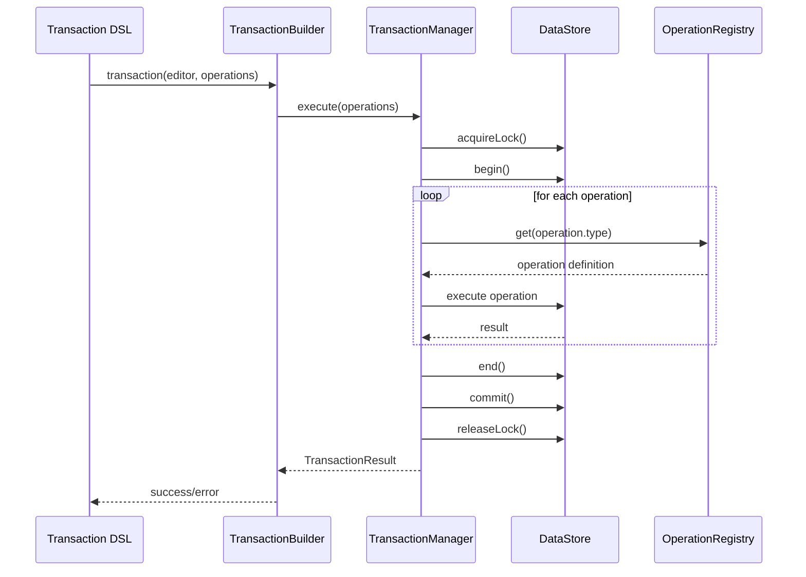
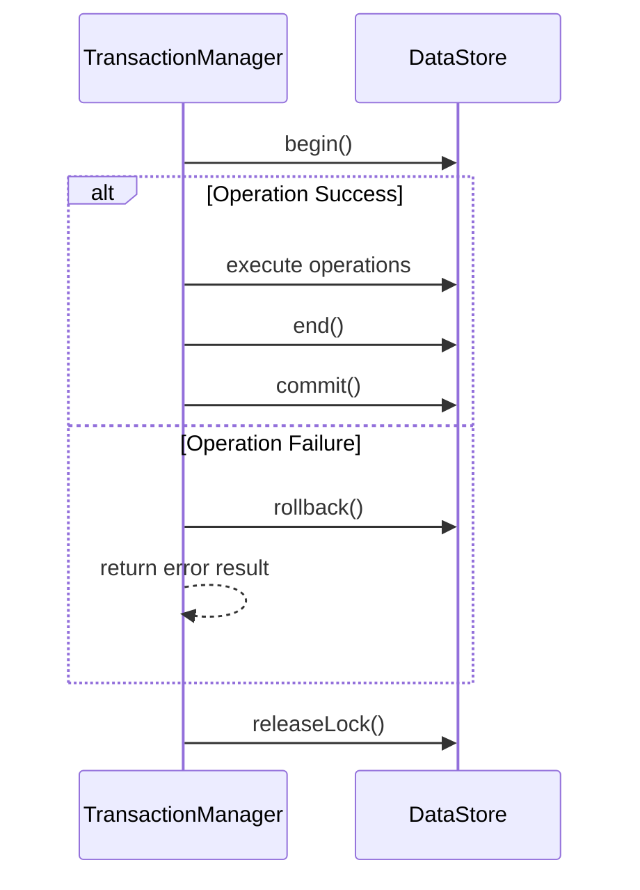

# Transaction System Specification

## 1. 개요

Transaction 시스템은 Barocss Model의 핵심 구성 요소로, 데이터의 일관성과 원자성을 보장합니다. 본 문서는 실제 구현된 코드를 기반으로 한 최종 명세서입니다.

### 1.1 핵심 특징
- **원자성**: 모든 변경사항이 성공하거나 전부 실패
- **일관성**: 스키마 검증을 통한 데이터 무결성 보장
- **격리성**: 글로벌 락을 통한 동시성 제어
- **지속성**: DataStore overlay 시스템을 통한 안전한 커밋
- **확장성**: 새로운 operation 추가가 쉬운 구조

### 1.2 주요 구성 요소
- **TransactionManager**: 트랜잭션 실행 및 관리
- **TransactionBuilder**: DSL 기반 트랜잭션 구성
- **GlobalOperationRegistry**: Operation 등록 및 조회
- **DataStore Integration**: 스키마 검증 및 데이터 저장

## 2. Architecture

### 2.1 Core Components

#### 2.1.1 TransactionManager
```typescript
export class TransactionManager {
  private _dataStore: DataStore;
  private _currentTransaction: Transaction | null = null;
  private _selectionManager?: any;
  private _schema?: any;

  constructor(dataStore: DataStore);
  setSelectionManager(selectionManager: any): void;
  setSchema(schema: any): void;
  async execute(operations: any[]): Promise<TransactionResult>;
  async createNode(node: INode): Promise<TransactionResult>;
  async updateNode(nodeId: string, updates: Partial<INode>): Promise<TransactionResult>;
  async deleteNode(nodeId: string): Promise<TransactionResult>;
  isInTransaction(): boolean;
  getCurrentTransaction(): Transaction | null;
}
```

**주요 기능:**
- 트랜잭션 실행 및 관리
- 글로벌 락 획득/해제
- DataStore overlay 트랜잭션 관리
- Operation 실행 및 결과 수집
- 에러 처리 및 롤백

#### 2.1.2 TransactionBuilder
```typescript
export interface TransactionBuilder {
  commit(): Promise<TransactionResult>;
}

class TransactionBuilderImpl implements TransactionBuilder {
  private editor: Editor;
  private ops: TransactionOperation[];
  
  constructor(editor: Editor, ops: TransactionOperation[]);
  async commit(): Promise<TransactionResult>;
}
```

**주요 기능:**
- DSL 기반 트랜잭션 구성
- Editor와 DataStore 연동
- 스키마 자동 설정
- TransactionManager를 통한 실행

### 2.2 Type Definitions

#### 2.2.1 Transaction Interface
```typescript
export interface Transaction {
  id: string;
  operations: TransactionOperation[];
  timestamp: Date;
  description?: string;
}
```

#### 2.2.2 TransactionResult Interface
```typescript
export interface TransactionResult {
  success: boolean;
  errors: string[];
  data?: any;
  transactionId?: string;
  operations?: TransactionOperation[];
}
```

#### 2.2.3 TransactionOperation Types
```typescript
export type DirectOperation = { type: string; payload?: any };
export type DeleteOperation = { type: 'delete'; nodeId: string };
export type SelectionOperation = { type: 'setSelection'; selection: any };
export type TransactionOperation = DirectOperation | DeleteOperation | SelectionOperation;
```

## 3. Transaction Flow

### 3.1 Execution Flow


### 3.2 Error Handling Flow


## 4. Lock Management

### 4.1 Global Lock System
```typescript
// 락 획득
const lockId = await this._dataStore.acquireLock('transaction-execution');

// 락 해제
this._dataStore.releaseLock(lockId);
```

**특징:**
- 글로벌 락을 통한 동시성 제어
- 트랜잭션 실행 중 다른 트랜잭션 차단
- 자동 락 해제 (finally 블록)
- 데드락 방지

### 4.2 DataStore Overlay System
```typescript
// 트랜잭션 시작
this._dataStore.begin();

// operations 실행
for (const operation of operations) {
  await this._executeOperation(operation);
}

// 커밋 또는 롤백
this._dataStore.end();
this._dataStore.commit(); // 성공 시
// this._dataStore.rollback(); // 실패 시
```

**특징:**
- Overlay 기반 격리된 변경사항
- 원자적 커밋/롤백
- 스키마 검증
- 성능 최적화

## 5. Operation System Integration

### 5.1 GlobalOperationRegistry
```typescript
class GlobalOperationRegistry {
  private operations = new Map<string, OperationDefinition>();

  register(name: string, definition: OperationDefinition): void;
  get(name: string): OperationDefinition | undefined;
  getAll(): Map<string, OperationDefinition>;
  clear(): void;
}
```

**기능:**
- Operation 정의 등록 및 조회
- Runtime operation 실행
- 타입 안전성 보장
- 동적 operation 로딩

### 5.2 Operation Execution
```typescript
private async _executeOperation(operation: any): Promise<any> {
  const def = globalOperationRegistry.get(operation.type);
  if (!def) {
    throw new Error(`Unknown operation type: ${operation.type}`);
  }
  
  const context = {
    dataStore: this._dataStore,
    selectionManager: this._selectionManager,
    schema: this._schema
  };
  
  const result = await def.execute(operation, context);
  
  // operation에 실행 결과를 포함하여 반환
  return {
    ...operation,
    result
  };
}
```

**특징:**
- 동적 operation 조회
- TransactionContext 제공
- 결과 수집 및 반환
- 에러 전파

## 6. Schema Integration

### 6.1 Schema Propagation
```typescript
// TransactionBuilder에서 스키마 설정
if (dataStore && dataStore._activeSchema) {
  tm.setSchema(dataStore._activeSchema);
}
```

**기능:**
- DataStore의 활성 스키마를 TransactionManager에 설정
- 모든 operation에서 스키마 검증
- 스키마 위반 시 즉시 실패 처리

### 6.2 Schema Validation
```typescript
// DataStore.updateNode에서 자동 스키마 검증
const result = context.dataStore.updateNode(nodeId, { text });
if (!result.valid) {
  throw new Error('Schema validation failed');
}
```

**특징:**
- 자동 스키마 검증
- 검증 실패 시 명확한 에러 메시지
- 트랜잭션 전체 실패 처리

## 7. Error Handling

### 7.1 Error Types
- **Schema Validation Errors**: 스키마 위반
- **Operation Errors**: 개별 operation 실패
- **Lock Errors**: 락 획득/해제 실패
- **DataStore Errors**: 데이터 저장소 오류

### 7.2 Error Recovery
```typescript
try {
  // 트랜잭션 실행
  const result = await this.execute(operations);
  return result;
} catch (error: any) {
  // 에러 발생 시 overlay 롤백
  try { this._dataStore.rollback(); } catch (_) {}
  
  return {
    success: false,
    errors: [error instanceof Error ? error.message : 'Unknown error'],
    transactionId: this._currentTransaction?.sid,
    operations
  };
} finally {
  // 락 해제
  if (lockId) {
    this._dataStore.releaseLock(lockId);
  }
}
```

**특징:**
- 자동 롤백
- 에러 메시지 수집
- 리소스 정리
- 원자성 보장

## 8. Performance Considerations

### 8.1 Batch Operations
```typescript
// 여러 operation을 한 번에 실행 (권장)
const result = await transaction(editor, [
  create(textNode('inline-text', 'Text 1')),
  create(textNode('inline-text', 'Text 2')),
  create(textNode('inline-text', 'Text 3'))
]).commit();
```

**장점:**
- 단일 락 획득
- 단일 overlay 트랜잭션
- 원자적 실행
- 성능 최적화

### 8.2 Lock Duration
- 락은 최소한의 시간만 유지
- Operation 실행 시간에만 락 보유
- 자동 락 해제 보장
- 데드락 방지

### 8.3 Memory Management
- Overlay 기반 메모리 효율성
- 불필요한 데이터 복사 최소화
- 가비지 컬렉션 친화적
- 메모리 누수 방지

## 9. Testing

### 9.1 Unit Testing
```typescript
describe('TransactionManager', () => {
  let transactionManager: TransactionManager;
  let dataStore: DataStore;

  beforeEach(() => {
    dataStore = new DataStore();
    transactionManager = new TransactionManager(dataStore);
  });

  it('should execute operations atomically', async () => {
    const result = await transactionManager.execute([
      { type: 'create', payload: { node: textNode('inline-text', 'Hello') } }
    ]);

    expect(result.success).toBe(true);
    expect(result.operations).toHaveLength(1);
  });

  it('should rollback on error', async () => {
    const result = await transactionManager.execute([
      { type: 'invalidOperation', payload: {} }
    ]);

    expect(result.success).toBe(false);
    expect(result.errors.length).toBeGreaterThan(0);
  });
});
```

### 9.2 Integration Testing
```typescript
describe('Transaction Integration', () => {
  it('should handle complex transaction', async () => {
    const result = await transaction(editor, [
      create(textNode('inline-text', 'Hello')),
      ...control('node-1', [
        { type: 'setText', payload: { text: 'World' } }
      ])
    ]).commit();

    expect(result.success).toBe(true);
    expect(result.operations).toHaveLength(2);
  });
});
```

## 10. Best Practices

### 10.1 Transaction Design
- **원자성**: 관련된 모든 변경사항을 하나의 트랜잭션에서 처리
- **일관성**: 스키마 검증을 통한 데이터 무결성 보장
- **격리성**: 동시성 제어를 통한 데이터 일관성
- **지속성**: 안전한 커밋을 통한 데이터 보존

### 10.2 Error Handling
- **명확한 에러 메시지**: 사용자가 이해할 수 있는 에러 메시지
- **적절한 롤백**: 실패 시 모든 변경사항 롤백
- **리소스 정리**: 락과 메모리 리소스 정리
- **로깅**: 디버깅을 위한 적절한 로깅

### 10.3 Performance
- **배치 처리**: 관련 operation들을 한 번에 처리
- **락 최소화**: 락 보유 시간 최소화
- **메모리 효율성**: 불필요한 데이터 복사 방지
- **캐싱**: 자주 사용되는 데이터 캐싱

## 11. Future Extensions

### 11.1 Planned Features
- **분산 트랜잭션**: 여러 DataStore 간 트랜잭션
- **트랜잭션 히스토리**: 트랜잭션 실행 히스토리 관리
- **성능 모니터링**: 트랜잭션 성능 메트릭
- **플러그인 시스템**: 커스텀 트랜잭션 로직

### 11.2 API Stability
- 현재 API는 안정화됨
- 새로운 기능은 기존 패턴을 따름

---

이 명세서는 실제 구현된 Transaction 시스템을 기반으로 작성되었으며, 모든 예제는 테스트를 통과한 검증된 코드입니다.